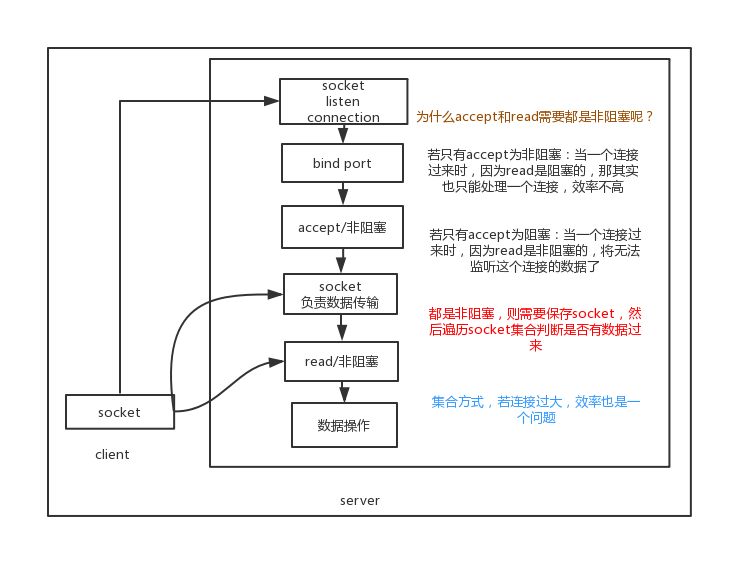

    从上篇bio文章，我们了解了传统socket连接为阻塞IO，然后了解了bio的多线程优化方式及其缺点。多路复用则是另外一种优化方式。

<style>
.my-code {
   color: orange;
}
.orange {
   color: rgb(255, 53, 2)
}
.red {
   color: red
}
code {
   color: #0ABF5B;
}
</style>


# 一、nio的设计思想
**同步非阻塞**：线程通过轮询检查IO状态，若数据未就绪立即返回，不阻塞。
**单线程处理多连接**：通过事件循环（EventLoop）管理多个连接。

<!--more-->


## 1.1、技术演进
1. **BIO → NIO**：  
   解决高并发场景下的线程资源瓶颈，但需处理异步编程复杂性。
2. **NIO → 多路复用**：  
   通过 `epoll`/`kqueue` 优化事件检测效率，减少 CPU 空转。

## 1.2、Bio
从`BIO`角度，以假设的方式说明`NIO`（实际上BIO没有对应的API），主要改动点如下：
- `serverSocket`设置成非阻塞
- 无限循环中判断是否有连接，如果有新连接则处理，没有的话处理是否有数据，有数据则处理。
```java
//服务端
public class BioServer {
    public static void main(String[] args) {
        List<Socket> socketList = Lists.newArrayList();
        byte[] bs = new byte[1024];
        try {
            //服务端的监听socket，只负责监听连接，监听的端口是：9878
            ServerSocket serverSocket = new ServerSocket();
            serverSocket.bind(new InetSocketAddress(9878));
            serverSocket.setBlock(false);//伪代码，表示设置serverSocket为非阻塞
            while (true) {//可以进行下一次的通信
                Socket accept = serverSocket.accept();
                if (accept == null) {
                    //表示该次while中，无新连接
                    socketList.forEach(socket -> {
                        //遍历socket，看是否有数据发过来
                        int readCount = socket.getInputStream().read(bs);
                        if(readCount > 0) {
                            //输出
                        }
                    });
                } else {
                    accept.setBlock(false);//伪代码，表示socket.read为非阻塞
                    socketList.add(accept);                            
                    socketList.forEach(socket -> {
                        int readCount = socket.getInputStream().read(bs);
                        if(readCount > 0) {
                            //输出
                        }
                    });
                }
            }
        } catch (IOException e) {
            e.printStackTrace();
        }
    }
}
```

## 1.3、NIO的具体实现【不使用多路复用】
以下是**不使用多路复用（Selector）**的NIO示例，展示纯非阻塞IO的工作方式及其局限性。
- **非阻塞模式**：将`socket`设置为非阻塞（`configureBlocking(false)`），调用 `accept()` 或 `read()` 时立即返回，不会阻塞线程。
- **主动轮询**：需要循环遍历所有连接，检查是否有数据可读/可写。
- **资源消耗**：高频轮询会导致CPU空转，性能极差。
```java
public class NonMultiplexingNioServer {
    public static void main(String[] args) throws IOException {
        // 1. 创建非阻塞 ServerSocketChannel
        ServerSocketChannel serverChannel = ServerSocketChannel.open();
        serverChannel.bind(new InetSocketAddress(8080));
        serverChannel.configureBlocking(false); // 设置为非阻塞模式
        // 2. 维护已接受的客户端连接列表
        List<SocketChannel> clients = new ArrayList<>();
        while (true) {
            // 3. 非阻塞 accept：立即返回，可能为 null
            SocketChannel client = serverChannel.accept();
            if (client != null) {
                client.configureBlocking(false); // 客户端连接也非阻塞
                clients.add(client);
                System.out.println("新客户端连接: " + client.getRemoteAddress());
            }
            // 4. 遍历所有客户端连接，尝试读取数据
            Iterator<SocketChannel> iterator = clients.iterator();
            while (iterator.hasNext()) {
                SocketChannel c = iterator.next();
                try {
                    ByteBuffer buffer = ByteBuffer.allocate(1024);
                    int bytesRead = c.read(buffer); // 非阻塞读取
                    if (bytesRead == -1) {
                        // 连接已关闭
                        c.close();
                        iterator.remove();
                        System.out.println("客户端断开: " + c.getRemoteAddress());
                    } else if (bytesRead > 0) {
                        buffer.flip();
                        byte[] data = new byte[buffer.limit()];
                        buffer.get(data);
                        System.out.println("收到数据: " + new String(data));
                    }
                } catch (IOException e) {
                    c.close();
                    iterator.remove();
                    System.out.println("客户端异常断开: " + c.getRemoteAddress());
                }
            }
            // 5. 短暂休眠以减少 CPU 占用（但会引入延迟）
            try {
                Thread.sleep(10); // 10ms 休眠
            } catch (InterruptedException e) {
                e.printStackTrace();
            }
        }
    }
}
```


## 1.4、NIO的具体实现【使用多路复用】
使用多路复用（Selector）。
```java 
//服务端
public class BioServer {
    public static void main(String[] args) {
        ServerSocketChannel serverChannel = ServerSocketChannel.open();
        serverChannel.configureBlocking(false);
        serverChannel.socket().bind(new InetSocketAddress(port));
        Selector selector = Selector.open();
        serverChannel.register(selector, SelectionKey.OP_ACCEPT);
        while (true) {
            int n = selector.select();
            if (n == 0) continue;
            Iterator ite = this.selector.selectedKeys().iterator();
            while (ite.hasNext()) {
                SelectionKey key = (SelectionKey) ite.next();
                if (key.isAcceptable()) {
                    SocketChannel clntChan = ((ServerSocketChannel) key.channel()).accept();
                    clntChan.configureBlocking(false);
                    //连接注册到Selector内
                    clntChan.register(key.selector(), SelectionKey.OP_READ, ByteBuffer.allocate(bufSize));
                }
                if (key.isReadable()) {
                    handleRead(key);
                }
                if (key.isWritable() && key.isValid()) {
                    handleWrite(key);
                }
                if (key.isConnectable()) {
                    System.out.println("isConnectable = true");
                }
                ite.remove();
            }
        }
    }
}
```  
工作流程：
```text
注册通道到 Selector → Selector 轮询就绪事件 → 分派事件到 Handler → 非阻塞读写数据
```


# 二、系统调用

## 2.1、ServerSocketChannel
`ServerSocketChannel`
```java
//java代码
ServerSocketChannel ss = ServerSocketChannel.open();
ss.bind(new InetSocketAddress(9090));
ss.configureBlocking(false); //重点  OS  NONBLOCKING!!!
```
追踪代码执行的系统调用：`sudo dtruss -f -p 12345 2> /tmp/trace.txt`
```text
//对应的系统调用
socket(PF_INET, SOCK_STREAM, IPPROTO_IP)  = 4    ---->获取文件描述符=4
fcntl(4, SETEL, O_RDWR|O_NONBLOCK) = 0           ---->修改文件描述符为非阻塞
bind(4, {sa_family=AF_INET, sin_port=htons(9090)})--->绑定端口
listen(4, 50);                         
```
对文件描述符进行设置成非阻塞。

## 2.2、socket非阻塞
创建socket的时候，指定socket是异步的，在type的参数中设置SOCK_NONBLOCK标志即可。
```text
int socket(int domain, int type, int protocol);
int s = socket(AF_INET, SOCK_STREAM | SOCK_NONBLOCK, IPPROTO_TCP);
```

## 2.3、普通文件非阻塞
对于文件的阻塞模式还是非阻塞模式::
```text
方法1、open时，使用O_NONBLOCK；
方法2、fcntl设置，使用F_SETFL，flags|O_NONBLOCK；
```

## 2.4、传统阻塞模式
```java
ServerSocket server = new ServerSocket(9090,20);
Socket client = server.accept();  //阻塞1 
```


# 三、多路复用
将文件描述符交给内核，一次系统调用，内核返回满足条件的文件描述符，再由用户程序去对文件描述符操作。
    
## 3.1、select、poll
- `select`：只能支持1024个fd
- `poll`：不限制fd个数
- `select\poll`问题：
  - 1、每次都要更新，重复传递fds（解决方法：创建内核空间存放fds）
  - 2、每次内核被调用后，内核需要遍历一遍所有的fds耗时耗资源（）

## 3.2、epoll：
解决前两个的问题
- 1、创建内核空间存放fds，每次内核调用后，将满足条件的fd存入链表，`epoll_wait`时再将链表返回。

为什么不需要遍历所有fds???
> 网卡中段时，将数据存入至fd的buffer缓冲区内，再由”延伸“将对应的fd由内核空间的fd红黑树对应的fd拷贝至链表内。      
    

## 3.3、代码
```java
public static void main(String[] args) {
  try (ServerSocketChannel serverSocketChannel = ServerSocketChannel.open()) {
      //创建serverSocket
      serverSocketChannel.bind(new InetSocketAddress(9090));
      //创建多路复用器
      Selector selector = Selector.open();
      //将服务端注册进多路复用器内
      SelectionKey selectionKey = serverSocketChannel.register(selector, SelectionKey.OP_ACCEPT);
      //返回多路复用器的keys
      Set<SelectionKey> selectionKeySet = selector.keys();
      //准备好了io的key数量
      int readyIOKeyCount = selector.select(500);
      if (readyIOKeyCount > 0) {
          //代表有准备好的fd，此时需要获取出key并进行数据的读取
          Set<SelectionKey> readyKeySet = selector.selectedKeys();
          //遍历，进行数据的处理
          Iterator<SelectionKey> iterator = readyKeySet.iterator();
          while (iterator.hasNext()) {
              SelectionKey key = iterator.next();
              iterator.remove();
              if (key.isAcceptable()) {
                  //代表是客户端连接类型的fd
                  ServerSocketChannel ssc = (ServerSocketChannel)key.channel();
                  SocketChannel client = ssc.accept();
                  //客户端设置为非阻塞
                  client.configureBlocking(false);
                  ByteBuffer byteBuffer = ByteBuffer.allocate(1024);
                  //将客户端注册进多路复用器内
                  client.register(selector, SelectionKey.OP_ACCEPT);
              } else if (key.isReadable()) {
                  //代表是可以数据读取的类型
                  SocketChannel client = (SocketChannel)key.channel();
                  ByteBuffer byteBuffer = (ByteBuffer)key.attachment();
                  byteBuffer.clear();
                  while (true) {
                      client.read(byteBuffer);
                  }
              }
          }
      }
  } catch (Exception e) {
  }
}
```
`Channel`，对应操作系统是一个fd（支持双向读写），然后将该fd注册进`Selector`内。`Selector` 会不断地轮询注册在其上的 `Channel`，如果某个 `Channel` 上面有新的 TCP 连接接入、读和写事件，这个 `Channel` 就处于就绪状态，会被 `Selector` 轮询出来，然后通过 `SelectionKey` 可以获取就绪 `Channel` 的集合，进行后续的 I/O 操作


# 五、文件IO
用不同的IO去读取文件。
## 5.1、标准IO
```java
File file = new File(path);
FileOutputStream out = new FileOutputStream(file);
while(true){
  Thread.sleep(10);
  out.write(data);
}
```
>注：每次write，会进行系统调用，此时写入的数据为data

## 5.2、字符IO
```Java
File file = new File(path);
BufferedOutputStream out = new BufferedOutputStream(new FileOutputStream(file));
while(true){
  Thread.sleep(10);
  out.write(data);
}
```
> 注：此时有字符缓冲区，当缓冲区满时，才会系统调用，因为系统调用减少了，进程空间的切换减少了，所以速度得到了提升。
> 其他：数据写入，也只是将数据写入到了内核的`pagecache`内，`pagecache`写入磁盘的方式（主动、定时写入）    
    
## 5.3、NIO方式
```java
RandomAccessFile raf = new RandomAccessFile(path, "rw");
raf.write("hello mashibing\n".getBytes());
raf.write("hello seanzhou\n".getBytes());
raf.seek(4);
raf.write("ooxx".getBytes());
FileChannel rafchannel = raf.getChannel();
//mmap  堆外  和文件映射的   byte  not  objtect
MappedByteBuffer map = rafchannel.map(FileChannel.MapMode.READ_WRITE, 0, 4096);
```
对应的系统调用
- open("/Users/chw/xxoo.txt\0", 0x202, 0x1B6)：打开文件
- socketpair(0x1, 0x1, 0x0)：创建一对无名的、相互连接的套接子


# 六、NIO核心组件

## 6.1、channel 通道
**作用**：用于进行数据的输入和输出，可以是文件通道、网络套接字通道等。
> 一个`Channel（通道）`代表和某一实体的连接，这个实体可以是文件、网络套接字等。也就是说，通道是Java NIO提供的一座桥梁，用于我们的程序和操作系统底层I/O服务进行交互

主要思想是把`Channel通道`注册到`Selector`中，通过`Selector`区监听`Channel`中的事件状态

**最常用的通道实现**
- `FileChannel`：读写文件
- `DatagramChannel`: UDP协议网络通信
- `SocketChannel`：TCP协议网络通信
- `ServerSocketChannel`：监听TCP连接

## 6.2、buffer  缓冲区
**作用**：数据的存储容器，与通道配合进行数据的读写操作。
  
**四个核心属性**
- `capacity`: 容量，表示缓冲区中最大存储数据的容量。一旦声明不能更改。
- `limit`: 界限，表示缓冲区中可以操作数据的大小。（limit 后的数据不能进行读写
- `position`: 位置，表示缓冲区中正在操作数据的位置
- `mark`: 标记，表示记录当前 position 的位置。可以通过 reset() 恢复到 mark 的位置

**创建Buffer的方式**：主要分为两种
- JVM堆内内存块Buffer
- 堆外内存块Buffer

> `MappedByteBuffer mapBuffer = filechannel.map`： 只有文件channel才有map，建立内存映射，实际系统调用为mmap，建立一个堆外内存。此时若向mapBuffer.put()数据，数据会放入到内核的pagecache内（put操作不会产生系统调用）

## 6.3、selector 选择器
**作用**：可以监听多个通道上的事件，如可读、可写等，实现一个线程管理多个通道的高效模式。通过选择器（`Selector`）来管理多个通道（`Channel`），当通道上有事件（如可读、可写等）发生时，能够快速地响应
> 而在 Linux 下，这个底层的事件通知机制可以基于 epoll 来实现，epoll 使得 NIO 能够高效地处理大量并发连接和事件，极大地提高了性能和可扩展性。


# 七、NIO中的问题
1. NIO的类库和API还是有点复杂，比如Buffer的使用
2. Selector编写复杂，如果对某个事件注册后，业务代码过于耦合
3. 面对断连重连、保丢失、粘包等，处理复杂
4. NIO存在BUG，根据网上言论说是selector空轮训导致CPU飙升
 
# 八、拆包粘包
举例说明：常用中文字符的UTF-8编码占3个字节，因此有很大概率出现在中间截断的情况。

完整的字节如下：
```text
... | ... | ... | Oxe4 | Oxb8 | Oxad | .....
```
中间截断：
```text
... | ... | ... | Oxe4 
Oxb8 | Oxad | .....
```
`Oxe4Oxb8Oxad`3个字节为“中”，此时分开了，`Decoder`解码器在解析过程中会失败
- 解决方法：当 `Decoder` 读取到缓冲区末尾的 `0xe4` 时，无法将其映射到一个 `Unicode`，`decode()`方法第三个参数 `false` 的作用就是让 `Decoder` 把无法映射的字节及其后面的数据都视作附加数据，因此 `decode()` 方法会在此处停止，并且 `position` 会回退到 `0xe4` 的位置。如此一来， 缓冲区中就遗留了“中”字编码的第一个字节，必须将其 `compact` 到前面，以正确的和后序数据拼接起来


# 九、空轮询
若Selector的轮询结果为空，也没有wakeup或新消息处理，则发生空轮询，CPU使用率100%
```java
Selector selector = Selector.open();
ServerSocketChannel serverChannel = ServerSocketChannel.open();
serverChannel.bind(new InetSocketAddress(8080));
serverChannel.configureBlocking(false);
serverChannel.register(selector, SelectionKey.OP_ACCEPT);

while (true) {
    // 正常情况下，select() 应阻塞到事件就绪
    int readyChannels = selector.select(); 
    if (readyChannels == 0) {
        continue; // 空轮询时 readyChannels=0，但 select() 立即返回
    }
    // 处理事件...
}
```
现象：`select()`理解返回且`readyChannels = 0`，循环高频执行，CPU占用`100%`。


## 9.1、解决方案

### 第一步：检测空轮询
通过记录select()调用次数和时间窗口，判断是否发生空轮询
```java
long startTime = System.nanoTime();
int selectCount = 0;
while (true) {
    long timeoutMs = 1000; // 设置超时时间
    int readyChannels = selector.select(timeoutMs);
    selectCount++;
    
    long elapsedTime = System.nanoTime() - startTime;
    if (elapsedTime > TimeUnit.MILLISECONDS.toNanos(100) && selectCount > 1000) {
        // 检测到空轮询：100ms 内 select() 被调用超过 1000 次
        rebuildSelector(); // 重建 Selector
        selectCount = 0;
        startTime = System.nanoTime();
    }
    // 处理事件...
}
```

### 第二步：重建selector
当检测到空轮询时，重新创建selector并迁移注册的通道。
```java
private void rebuildSelector() throws IOException {
    Selector newSelector = Selector.open();
    Selector oldSelector = this.selector;
    
    // 重新注册所有通道到新 Selector
    for (SelectionKey key : oldSelector.keys()) {
        if (!key.isValid()) continue;
        SelectableChannel channel = key.channel();
        Object attachment = key.attachment();
        int interestOps = key.interestOps();
        channel.register(newSelector, interestOps, attachment);
    }
    
    this.selector = newSelector;
    oldSelector.close(); // 关闭旧 Selector
}
```

  
More info:[I/O 多路复用入门](https://jeff.wtf/2017/02/IO-multiplexing/)
[一步步构建I/O多路复用的请求模型](https://juejin.im/entry/599f971af265da247d728531)
[Java NIO浅析](https://tech.meituan.com/2016/11/04/nio.html)            