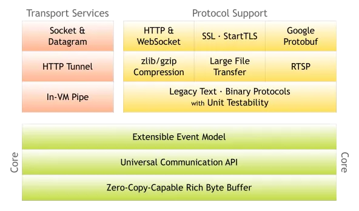
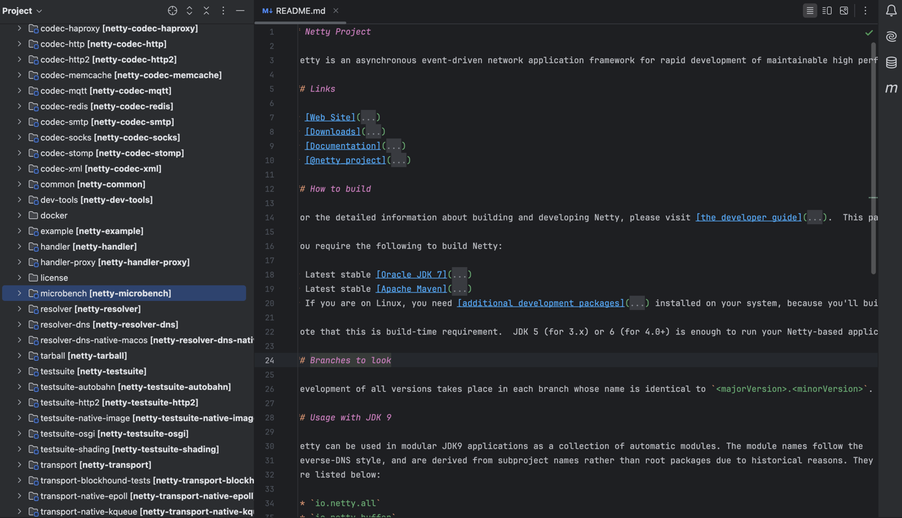
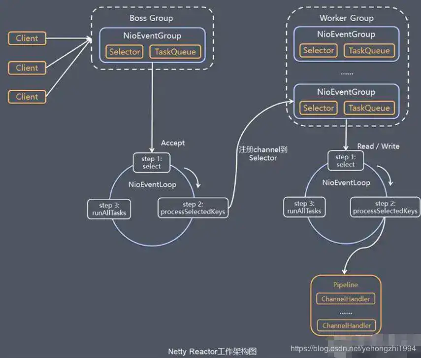
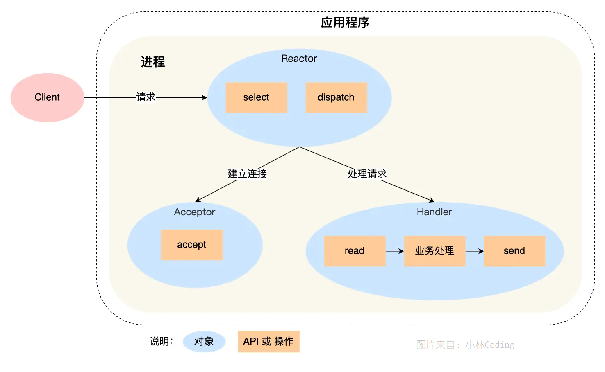
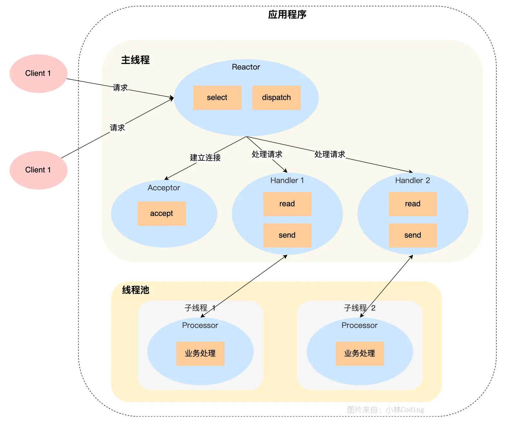
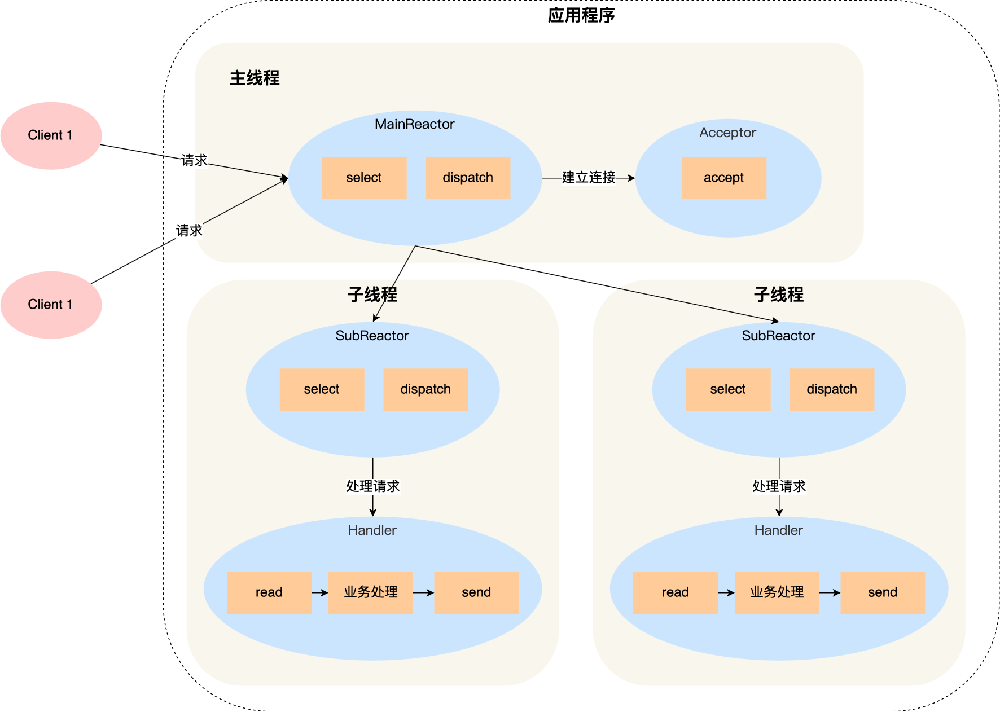
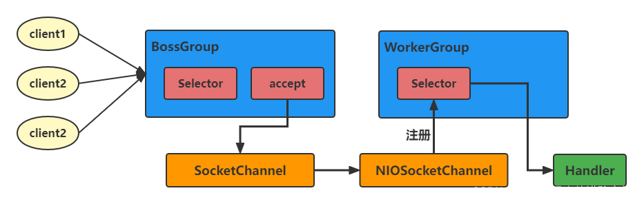

<style>
.my-code {
   color: orange;
}
.orange {
   color: rgb(255, 53, 2)
}
.red {
   color: red
}
code {
   color: #0ABF5B;
}
</style>


# 一、netty
Netty是一个高性能、异步事件驱动的网络应用框架，专注于简化TCP/UDP服务器和客户端的开发。

<!--more-->  

# 二、netty架构

## 2.1、架构图
下面这张图就是在官网首页的架构图：

- 绿色的部分`Core`核心模块，包括零拷贝、API库、可扩展的事件模型。
- 橙色部分`Protocol Support`协议支持，包括`Http`协议、`webSocket、SSL`(安全套接字协议)、谷歌`Protobuf`协议、`zlib/gzip`压缩与解压缩、`Large File Transfer`大文件传输等等。
- 红色的部分`Transport Services`传输服务，包括`Socket、Datagram、Http Tunnel`等等。

### 2.1.1、核心层（Core）
- **功能**：提供网络通信的基础能力，包括事件模型、通用 API、零拷贝缓冲区等。
- **关键模块**：
    - `netty-common`：通用工具类，如并发工具（`FastThreadLocal`）、日志、资源管理等。
    - `netty-buffer`：实现高性能的字节容器 `ByteBuf`，支持零拷贝、动态扩展、内存池等特性，是网络数据传输的核心。
        - `ByteBuf` 特点：
            - **零拷贝**：通过 `CompositeByteBuf` 组合多个缓冲区，避免内存复制。
            - **索引管理**：分离读索引（`readerIndex`）和写索引（`writerIndex`），简化操作。
            - **内存池化**：通过 `PooledByteBufAllocator` 减少内存分配开销。
    - `netty-resolver`：提供地址解析功能（如 DNS 解析）。

### 2.1.2、协议支持层（Protocol Support）
- **功能**：内置主流协议的编解码实现，降低开发成本。
- **关键模块**：
    - `netty-codec`：编解码器基类（如 `ByteToMessageDecoder`、`MessageToByteEncoder`），支持 HTTP、WebSocket、Protobuf 等协议。
        - 常用实现：`HttpServerCodec`、`ProtobufEncoder`、`LengthFieldPrepender`。
    - `netty-handler`：预置处理器（如 `LoggingHandler`、`SslHandler`），支持业务逻辑的动态编排。

### 2.1.3、传输服务层（Transport Service）
- **功能**：抽象网络传输能力，支持多种 I/O 模型（NIO、Epoll、OIO）和协议（TCP/UDP）。
- **关键模块**：
    - `netty-transport`：核心组件包括：
        - `Bootstrap`/`ServerBootstrap`：服务启动引导类，串联组件初始化。
        - `Channel`：网络通信载体，封装底层 Socket，支持异步 I/O 操作（如 `NioSocketChannel`、`NioServerSocketChannel`）。
        - `EventLoop`：事件循环线程，处理 I/O 事件和异步任务，基于 Reactor 模型实现。
        - `ChannelPipeline`：责任链模式管理处理器（`ChannelHandler`），实现数据的编解码和业务处理。


## 2.2、代码结构
netty的代码结构，3个主要模块，内部有多个小模块实现。



## 2.3、核心组件
可以将`Netty` 组件分为三层，各层协同工作：
1. **网络通信层**
    - **组件**：`Bootstrap`、`Channel`。
    - **职责**：监听端口、建立连接、读写数据，触发网络事件（如 `channelActive`、`channelRead`）。

2. **事件调度层**
    - **组件**：`EventLoopGroup`、`EventLoop`。
    - **职责**：基于 Reactor 模型处理事件，单线程管理多 Channel，避免线程竞争。

3. **服务编排层**
    - **组件**：`ChannelPipeline`、`ChannelHandler`。
    - **职责**：通过责任链模式动态编排处理器，处理数据编解码、业务逻辑等。



| 组件                    |                                                                                     |
|-----------------------|-------------------------------------------------------------------------------------|
| `Channel`               | 代表一个连接，是 Netty 对网络操作抽象类，包括基本的 I/O 操作，如 `bind()、connect()、read()、write()` 等            |
| `eventLoop`             | 事件轮询器，一个线程，执行一个一个的`channel`连接                                                         |
| `NioEventLoop`          | `eventLoop`的实现                                                                        |
| `eventLoopGroup`        | 事件轮询器组，`EventLoopGroup` 包含多个 `EventLoop`（每一个 `EventLoop` 通常内部包含一个线程）                      |
| `Boss EventloopGroup`   | 用于接收连接，一般情况下我们会指定 `bossGroup` 的 线程数为 1（并发连接量不大的时候）                                    |
| `Worker EventloopGroup` | 用于具体的处理（消息的读写以及其他逻辑处理）                                                              |
| `channelHandler`        | 连接处理器，处理`Channel`上有关的事件和命令的处理器，每一个`ChannelHandler`都会被封装成`ChannleHandlerContext`加入`Pipeline` |
| `channelPipeline`       | 管道，`channelHandler`的链式容器                                                              |
| `Bootstrap`             | 客户端的启动引导类/辅助类，使用 `connet()` 方法连接到远程的主机和端口                                             |
| `ServerBootstrap`       | 服务端的启动引导类/辅助类，使用 `bind()` 方法绑定本地的端口上，然后等待客户端的连接                                       |


### 2.3.1、核心组件协作流程
```text
Client Request
    │
    ▼
ServerBootstrap (监听端口)
    │
    ▼
Boss EventLoop (接受连接) → 分配 Worker EventLoop
    │
    ▼
Worker EventLoop (处理 I/O) → ChannelPipeline (编解码 → 业务处理)
    │
    ▼
ByteBuf (数据读写) → 返回响应
```

### 2.3.2、快速入门示例

#### 2.3.2.1、HTTP服务器
```java
public static void main(String[] args) {
    // 创建mainReactor
    NioEventLoopGroup boosGroup = new NioEventLoopGroup(1);
    // 创建工作线程组
    NioEventLoopGroup workerGroup = new NioEventLoopGroup();
    final ServerBootstrap serverBootstrap = new ServerBootstrap();
    serverBootstrap
            // 组装NioEventLoopGroup
            .group(boosGroup, workerGroup)
            // 设置channel类型为NIO类型
            .channel(NioServerSocketChannel.class)
            // 设置连接配置参数
            .option(ChannelOption.SO_BACKLOG, 1024)
            .childOption(ChannelOption.SO_KEEPALIVE, true)
            .childOption(ChannelOption.TCP_NODELAY, true)
            // 配置入站、出站事件handler
            .childHandler(new ChannelInitializer<NioSocketChannel>() {
                @Override
                protected void initChannel(NioSocketChannel ch) {
                    // 配置入站、出站事件channel
                    ch.pipeline().addLast(...);
                    ch.pipeline().addLast(...);
                }
            });
    // 绑定端口
    int port = 8080;
    serverBootstrap.bind(port).addListener(future -> {
        if (future.isSuccess()) {
            System.out.println(new Date() + ": 端口[" + port + "]绑定成功!");
        } else {
            System.err.println("端口[" + port + "]绑定失败!");
        }
    });
}
```

#### 2.3.2.1、HTTP客户端
```java
public class NettyClient {
    private final String host;
    private final int port;
    public NettyClient(String host, int port) {
        this.host = host;
        this.port = port;
    }
    public void start() throws InterruptedException {
        // 1. 创建 EventLoopGroup（处理 I/O 操作）
        EventLoopGroup group = new NioEventLoopGroup();
        try {
            // 2. 创建客户端启动引导类 Bootstrap
            Bootstrap bootstrap = new Bootstrap();
            bootstrap.group(group)
                     .channel(NioSocketChannel.class) // 使用 NIO 传输
                     .option(ChannelOption.SO_KEEPALIVE, true) // 启用 TCP KeepAlive
                     .handler(new ChannelInitializer<SocketChannel>() {
                         @Override
                         protected void initChannel(SocketChannel ch) {
                             // 3. 初始化 ChannelPipeline
                             ChannelPipeline pipeline = ch.pipeline();
                             // 添加字符串编解码器
                             pipeline.addLast(new StringEncoder(CharsetUtil.UTF_8));
                             pipeline.addLast(new StringDecoder(CharsetUtil.UTF_8));
                             // 添加自定义业务处理器
                             pipeline.addLast(new ClientHandler());
                         }
                     });

            // 4. 连接到服务器（异步操作）
            ChannelFuture connectFuture = bootstrap.connect(host, port).sync();
            System.out.println("客户端连接到服务器: " + host + ":" + port);
            // 5. 发送消息到服务器
            Channel channel = connectFuture.channel();
            channel.writeAndFlush("Hello Server!");
            // 6. 等待连接关闭
            channel.closeFuture().sync();
        } finally {
            // 7. 优雅关闭 EventLoopGroup
            group.shutdownGracefully();
        }
    }

    // 自定义客户端处理器（处理服务器响应）
    private static class ClientHandler extends SimpleChannelInboundHandler<String> {
        @Override
        protected void channelRead0(ChannelHandlerContext ctx, String msg) {
            // 接收服务器返回的消息
            System.out.println("收到服务器响应: " + msg);
        }

        @Override
        public void exceptionCaught(ChannelHandlerContext ctx, Throwable cause) {
            // 处理异常
            cause.printStackTrace();
            ctx.close();
        }
    }
}
```

# 三、线程模型
Netty 线程模型被称为 `Reactor`（响应式）模型/模式，它是基于 NIO 多路复用模型的一种升级，它的核心思想是将 IO 事件和业务处理进行分离，使用一个或多个线程来执行任务的一种机制。

## 3.1、Reactor模式
`Reactor`，一种事件驱动的设计模式，用于高效处理并发事件。

`Reactor` 对应的叫法:
- 反应器模式
- 分发者模式(`Dispatcher`)
- 通知者模式(`notifier`)

`Reactor` 包含以下三大组件：

1. `Reactor`（反应器）：`Reactor` 负责监听和分发事件，它是整个 `Reactor` 模型的调度中心。`Reactor` 监视一个或多个输入通道，如监听套接字上的连接请求或读写事件。当检测到事件发生时，`Reactor` 会将其分发给预先注册的处理器（`Handler`）进行处理。在 Netty 中，这个角色经常是由 `EventLoop` 或其相关的 `EventLoopGroup` 来扮演，它们负责事件的循环处理、任务调度和 I/O 操作。
2. `Acceptor`（接收器）：用于处理 IO 连接请求。当 `Reactor` 检测到有新的客户端连接请求时，会通知 `Acceptor`，后者通过 `accept()` 方法接受连接请求，并创建一个新的 `SocketChannel`（在 Netty 中是 `Channel`）来表示这个连接。随后，`Acceptor` 通常会将这个新连接的 `Channel` 注册到 `Worker Reactor` 或 `EventLoop` 中，以便进一步处理该连接上的读写事件。
3. `Handlers`（处理器）：`Handlers` 负责具体的事件处理逻辑，即执行与事件相关的业务操作。在 Netty 中，`Handler` 是一个或多个 `ChannelHandler` 的实例，它们形成一个责任链（`ChannelPipeline`），每个 `Handler` 负责处理一种或一类特定的事件（如解码、编码、业务逻辑处理等）。数据或事件在 `ChannelPipeline` 中从一个 `Handler` 传递到下一个，直至处理完毕或被消费。`Handler` 可以分为入站（`inbound`）和出站（`outbound`）两种，分别处理流入的数据或流出的数据。

## 3.2、Reactor三大模型
`Reactor` 模式支持以下三大模型：
1. 单线程模型
2. 多线程模型
3. 主从多线程模型


### 2.4.1、单线程模型（单Reactor单线程）
在**单线程模型**中，所有的事件处理操作都由单个 `Reactor` 实例在单个线程下完成。`Reactor` 负责监控事件、分发事件和执行事件处理程序（`Handlers`），如下图所示：

单线程模型的实现 Demo 如下：
```java
// 假设有一个单线程的Reactor，负责监听、接收连接、读写操作
class SingleThreadReactor {
    EventLoop eventLoop; // 单个事件循环线程
    SingleThreadReactor() {
        eventLoop = new EventLoop(); // 初始化单个事件循环
    }
    void start(int port) {
        ServerSocketChannel serverSocket = ServerSocketChannel.open();
        serverSocket.socket().bind(new InetSocketAddress(port)); // 绑定端口
        eventLoop.execute(() -> { // 在事件循环中执行
            while (true) {
                SocketChannel clientSocket = serverSocket.accept(); // 接受连接
                if (clientSocket != null) {
                    handleConnection(clientSocket); // 处理连接
                }
            }
        });
        eventLoop.run(); // 启动事件循环
    }
    void handleConnection(SocketChannel clientSocket) {
        // 读写操作，这里简化处理
        ByteBuffer buffer = ByteBuffer.allocate(1024);
        while (clientSocket.read(buffer) > 0) {
            // 处理读取的数据
            buffer.flip();
            // 假设处理数据逻辑...
            buffer.clear();
        }
        // 写操作逻辑类似
    }
}
```
- **缺点**：处理能力受限于单个线程的处理能力，无法充分利用多核 CPU，可能会影响性能。


### 2.4.2、多线程模型（单Reactor多线程）
在**多线程模型**中，连接 `Acceptor` 和业务处理（`Handlers`）是由不同线程分开执行的，其中 `Handlers` 是由线程池（多个线程）来执行的，如下图所示：

多线程模型的实现 Demo 如下：
```java
// 假设有两个线程，一个用于监听连接，一个用于处理连接后的操作
class MultiThreadReactor {
    EventLoop acceptLoop;
    EventLoop workerLoop;
    MultiThreadReactor() {
        acceptLoop = new EventLoop(); // 接收连接的线程
        workerLoop = new EventLoop(); // 处理连接的线程
    }
    void start(int port) {
        ServerSocketChannel serverSocket = ServerSocketChannel.open();
        serverSocket.socket().bind(new InetSocketAddress(port));
        acceptLoop.execute(() -> { // 在接受线程中监听
            while (true) {
                SocketChannel clientSocket = serverSocket.accept();
                if (clientSocket != null) {
                    workerLoop.execute(() -> handleConnection(clientSocket)); // 将新连接交给工作线程处理
                }
            }
        });
        acceptLoop.run(); // 启动接受线程
        workerLoop.run(); // 启动工作线程
    }
    // handleConnection 方法与单线程模型中的相同
}
```

### 2.4.3、主从多线程模型（多Reactor多线程）
主从多线程模型是一个主 `Reactor` 线程加多个子 `Reactor` 子线程，以及多个工作线程池来处理业务的，如下图所示：

主从多线程模型的实现 Demo 如下：
```java
public class MainReactorModel {
    public static void main(String[] args) {
        // 主Reactor，用于接受连接
        EventLoopGroup bossGroup = new NioEventLoopGroup();
        // 从Reactor，用于处理连接后的读写操作
        EventLoopGroup workerGroup = new NioEventLoopGroup();

        try {
            ServerBootstrap bootstrap = new ServerBootstrap();
            bootstrap.group(bossGroup, workerGroup)
                     .channel(NioServerSocketChannel.class)
                     .childHandler(new ChannelInitializer<SocketChannel>() {
                         @Override
                         protected void initChannel(SocketChannel ch) {
                             // 在这里添加业务处理器，如解码器、编码器、业务逻辑处理器
                             ch.pipeline().addLast(new MyBusinessHandler());
                         }
                     });
            ChannelFuture future = bootstrap.bind(8080).sync();
            System.out.println("Server started at port 8080");
            future.channel().closeFuture().sync(); // 等待服务器关闭
        } catch (InterruptedException e) {
            e.printStackTrace();
        } finally {
            bossGroup.shutdownGracefully();
            workerGroup.shutdownGracefully();
        }
    }
}
```

## 3.3、netty线程模型
Netty 主要基于 主从 Reactors 多线程模型 做了一定的 改进，其中主从 Reactor 多线程模型有多个 Reactor。

- BossGroup 线程维护Selector , 只关注Accecpt；
- 当接收到Accept事件，获取到对应的SocketChannel, 封装成 NIOScoketChannel并注册到 Worker 线程(事件循环)，并进行维护；
- 当Worker线程监听到selector 中通道发生自己感兴趣的事件后，就进行处理(就由handler)， 注意 handler 已经加入到通道

### 3.3.1、netty线程模型详细说明
`Netty`抽象出两组线程池：`BossGroup` 和 `WorkerGroup`
- `BossGroup` 专门负责接收客户端的连接
- `WorkerGroup` 专门负责网络的读写

每个`Boss Group` 中的 `NioEventLoop` 循环执行的步骤：
1) 轮询`accept` 事件
2) 处理`accept` 事件，与`client`建立连接 , 生成 `NioSocketChannel`，并将其注册 `Worker Group` 上的某个 `NIOEventLoop` 上的 `selector`
3) 处理任务队列的任务，即 `runAllTasks`

每个 `Worker Group` 中的 `NIOEventLoop` 循环执行的步骤：
1) 轮询 `read/write` 事件
2) 处理 `I/O` 事件， 即 `read/write` 事件，在对应的 `NioSocketChannel` 上处理
3) 处理任务队列的任务 ， 即 `runAllTasks`


