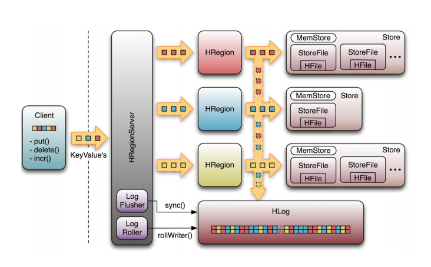

# HBASE
1、面向列存储的分布式存储系统。   
2、概念有row key和cloumn family。   
3、仅能通过行键(row key)和行键序列来检索数据，仅支持单行事务。  

<!--more-->  

> 下图为hbase的整体架构图  

   
> zk存储了所有Region server节点的信息 

HBase中的每一张表就是所谓的BigTable。BigTable会存储一系列的行记录，行记录有三个基本类型的定义：

1.RowKey

是行在BigTable中的唯一标识。

2.TimeStamp：

是每一次数据操作对应关联的时间戳，可以看作SVN的版本。

3.Column：

定义为<family>:<label>，通过这两部分可以指定唯一的数据的存储列，family的定义和修改需要对HBase进行类似于DB的DDL操作，

而label，不需要定义直接可以使用，这也为动态定制列提供了一种手段。family另一个作用体现在物理存储优化读写操作上，同family

的数据物理上保存的会比较接近，因此在业务设计的过程中可以利用这个特性。

**逻辑存储**
 

## 一、hbase master 
1、协调各个regsion server的负载均衡。  
2、负责给region分配region server。  
3、通过zk可以实现master的集群部署，但是同时只有一个master提供服务。  

```
**************************
**** HBase Meta Table ****
**************************
Meta table存储所有region的列表
Meta table的结构如下:
- Key: region的开始row key, region id
- Values: Region server
```

## 二、Regsion Server
1、client直接与Regsion server进行连接。   

  

* 1、Region  
```
1、根据Row Key的区域分成多个Region（按照rowkey分成region，若一个region存储不下则开辟新的region）
2、每个HRegion对应Table中一个Region，HRegion由多个HStore组成；
3、每个HStore对应Table中一个Column Family的存储；
4、flush的最小单位是region。
5、每个region最大1GB(默认)。
```    
* 2、MemStore
```
1、每一个cloumn family对应一个memstore，
2、采用LSM数据结构存储，并在内存中排序，提高写入速度。
3、若rowkey的cf过多，则会导致memstore过多，导致region的flush。
```
* 3、Store File
```
HFile的轻量封装。
```
* 4、HFile
```
1、HFile中存储有序的Key-Value对. 当Memstore满了之后, Memstore中的所有数据写入HDFS中,形成一个新的HFile
2、HFile文件主要分为4个部分：Scanned block部分、Non-scanned block部分、Load-on-open部分和Trailer。
```

* 5、HLog
```
一旦HRegionServer意外退出，MemStore中的内存数据就会丢失，引入HLog就是防止这种情况
```
参考  
[深度分析HBASE架构](https://zhuanlan.zhihu.com/p/30414252)    
[hbase存储结构介绍及hbase各种概念](https://www.cnblogs.com/yangjiming/p/9429169.html)  
    
# HBASE应用
## 一、现状
* 统一登录系统容量为26G左右  
    
* 业务日志容量为200G左右  
  
```
1、业务日志容量占总数据库的80%，每日新增数量多。
2、日志存储及重新，消耗机器过多的CPU和IO，会影响整个服务的性能。
```
## 二、优化

### 1、现有使用方式调研
```
1、业务ID+_+系统模块ID 两条件查询业务操作日志。  
2、各业务系统可以查看各自处理的历史数据。  
```

### 2、技术选型

1、存储问题
> MySQL 与 HBase 是我们日常应用中常用的两个数据库，分别解决应用的在线事务问题和大数据场景的海量存储问题，HBASE侧重写，存储无碎片，数据导入能力强;

2、数据分析处理
> MySQL 与 HBase 在大数据量下分析处理，显而易见，HBASE优势优于MYSQL ,完全分布式，易扩展, 底层使用HDFS, 存储与计算分离 ;

3、结合业务场景
> 业务操作日志，数据量大，业务单一，且历史数据在MQSQL中已达200G,没有过多复杂的查询;

4、性能
> HBase  在合理的设计存储 结构 合理的设计ROWKEY,查询效率很高，毫秒级

### 3、功能设计
* 1.可以使用rowkey精确查找.  
* 2.可根据查询条件查询，可以查询分页查询的方工有：  
    * 1.业务ID;  
    * 2.业务ID，系统ID;  

### 4、row key设计
业务ID+_+系统ID+_+业务系统操作ID+_+生成的唯一ID(时间毫秒数+4位计数（0000-9999）);  rowkey最大长度为 17*4+3
