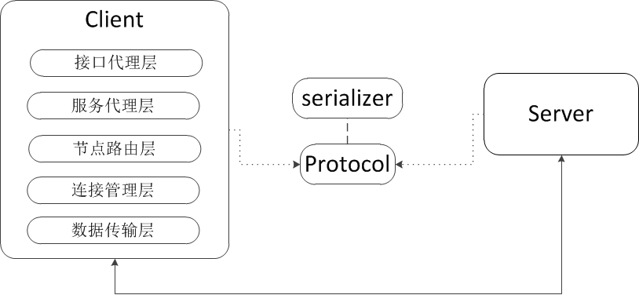
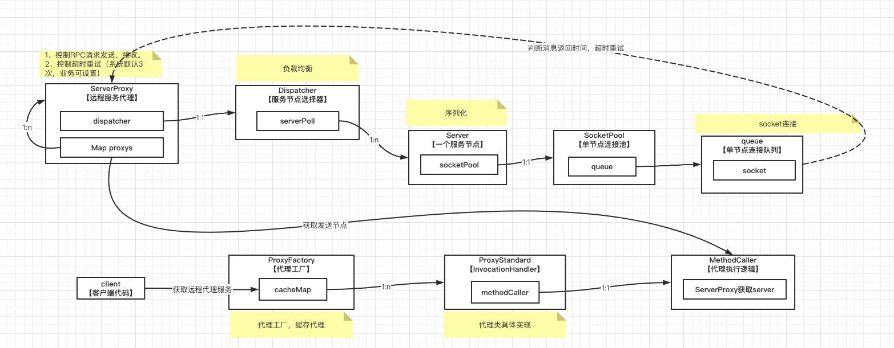
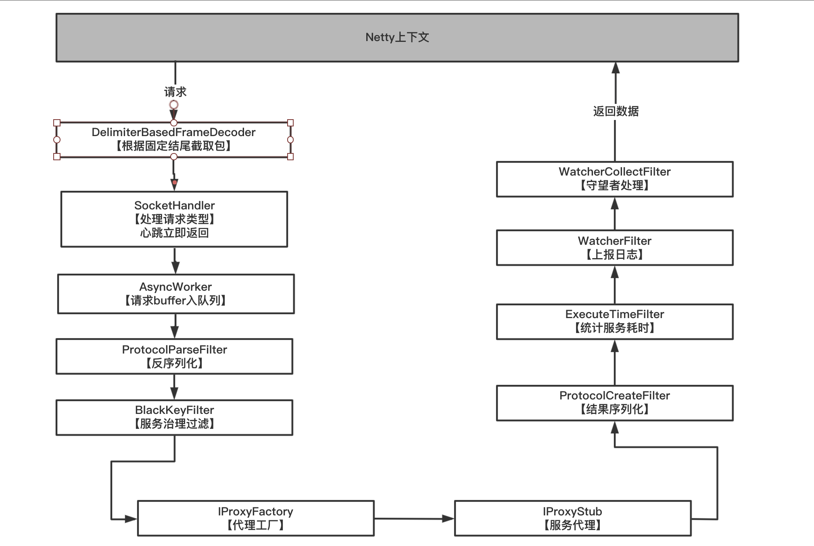

# 一、RPC需要解决的问题
1、服务发现（寻址）  
2、数据传输（序列化）  
3、底层通讯（TCP）  

## 1.1、服务发现&注册（寻址）
### A、整体流程
***涉及两个动作：服务端的服务注册、客户端的服务发现。***  

### B、实现
**1**、客户端与注册中心：客户端启动主动拉一次配置（获得服务的节点、端口信息）、拉收集项；启动完成后，收集项由注册中心每隔一个小时推送一次，另外在客户端有一个10分钟一次的定时任务会拉取最新的配置信息  
**2**、服务端与注册中心：服务端会启动一个定时任务，定时发送心跳（上报节点信息）、拉收集项、发送白名单（注册中心接收到白名单消息，并没有做任何处理，暂时无用）；注册中心每隔一小时推送一次最新的收集项，另外推送黑名单给服务端（黑名单用于拦截请求，保护服务）

<!--more-->  

## 1.2、数据传输（序列化）
字段       | 协议头   | 版本号  | 总长度      | SessionId  | 服务编号 | 协议类型 | 压缩类型      | 序列化类型    | 平台     | 调用链数据长度 | 调用链数据 | 服务治理key长度 | 服务治理key | 业务数据 | 协议尾  
--------- | -------  | ------ | ----------  | ---------- | ------- | ------  | ------------ | ----------- | ------- | ----------- | -------- | ------------- | ---------- | ------ | -----  
长度(byte) | 5       | 1      | 4          | 4           | 1       | 1      | 1            | 1           | 1        | 2           | xxoo     | 2              | xxoo      | xxoo    | 5  
含义       | 验证使用 | 扩展使用 | 不包含头和位 | 异步机制使用 | 暂无实现 | 啊     | 暂未实现      | asf、asf_ext | java     | 调用链使用   | 调用链使用  | 服务治理使用     |  服务治理使用 | 自定义java对象序列化后的byte数组 | 断包使用  

- 支持多种序列化方式：Hessian、SCF、json
- 解析字节流，截取到业务数据
- 根据序列化方式，对字节数组解析反序列化。

## 1.3、底层通讯（TCP）

底层通讯，使用了netty框架。

# 二、客户端
## 2.1、架构

- 接口代理层：采用Java的动态代理，创建接口代理并缓存，代理类中实现具体的序列化、节点路由、网络连接及数据传输等。
- 服务代理层：缓存服务，访问控制（同步、异步、服务故障（重启、宕机、超时）等转移）。
- 节点路由层：服务节点路由及服务负载均衡。
- 连接管理层：缓存客户端与服务端的TCP连接，并提供连接池功能。
- 数据传输层：数据的发送与接收。

## 2.2、一次方法调用过程

    1.每个Service在客户端，都对应一个ProxyStandard，它代理执行该Service的执行，初始化一次进行缓存  
    2.MethodCaller中是服务执行方法的地方，会调用ServiceProxy获取Server节点，获取方式是通过负载均衡策略  
    3.ServiceProxy持有自己的所有对象的Map,根据serviceName可以找到一个服务的节点池  
    4.Dispatcher是个负载均衡器，他负责选择服务的节点，并且持有一个服务的所有节点  
    5.一个节点对应一个Server对象，Server是一个服务提供者，它会和服务提供者直接会建立连接池queue  

## 2.3、重试机制
server将请求发送至queue中后，会同步等待返回结果，当接收信息时超时抛出异常，异常被serviceProxy捕获，进行超时的重试。
- 重试次数：默认3次
- 超时时间：默认3s

## 2.4、负载均衡
权重随机策略，默认采用轮询

## 2.5、服务降级唤醒
定时任务，获取断开连接的服务进行连接。

## 2.6、客户端容错汇总
1、超时连接：服务节点变为Dead，死亡节点异步线程进行探测激活

## 2.7、心跳机制
1、每个Socket创建连接之后，都会启动一个定期执行的心跳线程发送心跳。  
2、服务节点状态变为Deaed，异步探测线程5秒执行一次，会进行心跳探测，探测成功更新节点死亡时间，成功恢复节点

# 三、服务端
## 3.1、线程模型

1、socketHandler接到请求，根据负载均衡，将完整包放入异步处理队列。  
2、异步处理线程模型，可以有多个线程组，一个线程组默认8个线程，这个8个线程一起维护一个队列。

## 3.2、一次方法的调用过程

    1.请求数据首先通过固定结尾DelimiterBasedFrameDecoder解码
    2.SocketHandler判断数据类型，心跳直接返回
    3.前置业务过滤器ProtocolParseFilter反序列化请求
    4.根据请求lookup从服务代理工厂获取代理服务
    5.返回结果码流

## 3.3、启动过程

    2、生成服务代理
      1.1 加载所有的jar 容器lib+服务目录
      1.2 加载系统目录下所有class
      1.3 class中扫描ServiceContract注解的接口，扫描OperationContract注解的方法，去重
      1.4 class中扫描ServiceBehavior注解的实现，只扫描protected和public的方法，去重，相同的lookup报错
      1.5 扫描的jar中加载class，扫描jar中的ServiceContract和ServiceBehavior注解类
      1.6 接口和实现类对应关系绑定
      1.7 为csf服务实现类，利用java-assist生成代理类，有Spring增加上下文获取Bean逻辑
      1.8 生成代理对象工厂类
      1.9 初始化代理对象
      1.10 初始化代理工厂对象，将代理对象传入工厂
        
    3.加载并调用init接口的实现类
    4.加载Filter
    5.注册新号
    6.添加Hooks
    7.启动server
    8.注册Server的ShutDownHook 

