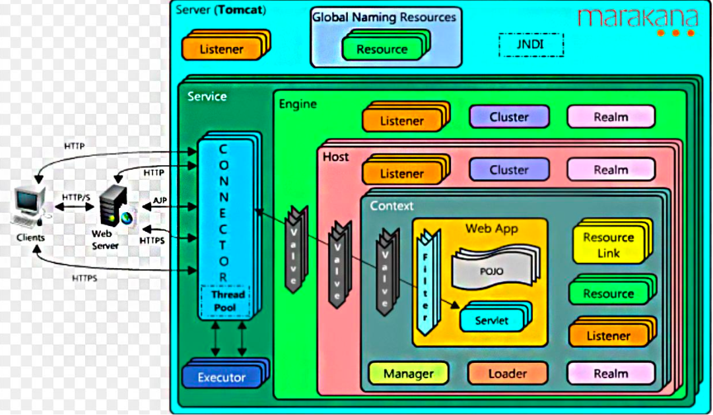
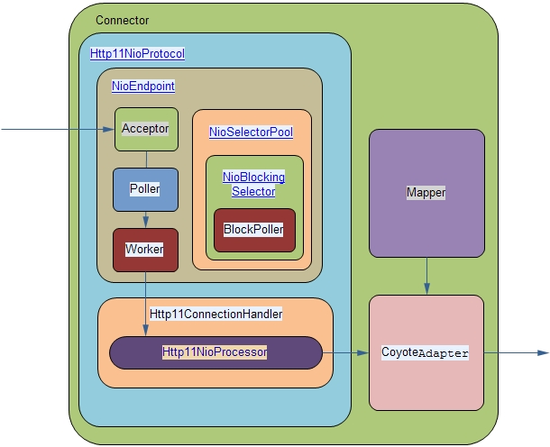
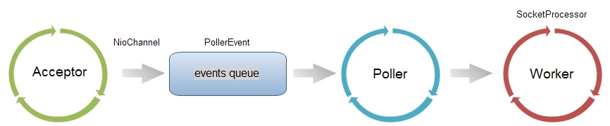
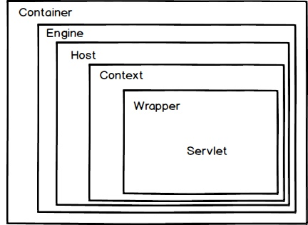

<style>
.my-code {
   color: orange;
}
.orange {
   color: rgb(255, 53, 2)
}
.red {
   color: red
}
code {
   color: #0ABF5B;
}
</style>


tomcat处理请求，要怎么做呢？
> * 1、监听某个接口，捕获HTTP请求
> * 2、将HTTP请求封装成request对象，同时创建response对象
> * 3、加载servlet对象，将request、response传入，然后再调用servlet的具体service方法。

# 一、Tomcat的一个简单架构图

<!--more-->  



可以看出Tomcat的一个整体架构
> 一个server服务器，可以包含多个服务；
> service中包含多个connector(连接器)，一个container(容器)；及其他一些组件

2个核心组件
- `Connector`:
主要负责处理Socket连接，以及Request与Response的转化。
- `Container`：
包括Engine、Host、Context和Wrapper,主要负责内部的处理以及Servlet的管理


## 1.1、Connector架构(连接器架构)

在tomcat中，是coyote组件，负责具体协议的解析及IO的相关操作


| 组件              | 功能                                                                                                       |
|-----------------|----------------------------------------------------------------------------------------------------------|
| Endpoint        | **端点**，用来处理socket接收和发送的逻辑，其内部由acceptor监听请求、Handler处理数据、AsyncTimeout检查请求超时。具体的实现有NioEndpoint、AprEndpoint等 |
| Processor       | **处理器**，负责构建Tomcat Request和response对象。具体的实现有Http11NioProcessor、StreamProcessor等。                         |
| adapter         | **适配器**，实现Tomcat Request、Response 与 ServletRequest、ServletResponse之间的相互转换。这采用的是经典的适配器模式。                 |
| protocolHandler | **协议处理器**，将不同的协议和通讯方式组合封装成对应的协议处理器。如 Http11NioProcessor封装的是HTTP+NIO。                                     |

> IO模型：NIO，NIO2，APR
> 应用层协议：HTTP 1.1，AJP，HTTP 2
> 还是可以看见connector中三大块：ProtocolHandler，Mapper，Adapter

### 1.1.1、Endpoint相关代码

#### 1.1.1.1、AbstractEndpoint代码
AbstractEndpoint是Tomcat连接器（Connector）的核心组件，负责监听客户端连接并处理请求。它是Endpoint接口的实现类， 源码如下：
```java
public abstract class AbstractEndpoint<S> {
    protected Acceptor[] acceptors;//接受新连接，并将连接时间放入Poller的队列中
    private volatile LimitLatch connectionLimitLatch = null;
    private int port;//监听端口
    private int maxConnections = 10000;//最大运行的并发连接。超过此值时，Acceptor线程会等待。
    private Executor executor = null;//连接池，处理具体的请求
    //处理器接口
    public static interface Handler<S> {
        public enum SocketState {
            OPEN, CLOSED, LONG, ASYNC_END, SENDFILE, UPGRADING, UPGRADED, SUSPENDED
        }
        public SocketState process(SocketWrapperBase<S> socket, SocketEvent status);
    }
    public abstract static class Acceptor implements Runnable {
        public enum AcceptorState {
            NEW, RUNNING, PAUSED, ENDED
        }
        protected volatile AcceptorState state = AcceptorState.NEW;
    }
    
}
```
具体职责包括：
- 监听指定端口（如8080）
- 管理Acceptor线程（接受新连接）
- 管理poller线程（轮询事件）
- 管理Processor线程（处理请求）
- 配置和控制连接的生命周期（如最大连接数、超时等）


#### 1.1.1.2、NioEndpoint
`NioEndpoint`包含以下核心组件：
1. `Acceptor`：接受新连接（`主Reactor`），监听TCP/IP连接请求。
2. `Poller`：监听I/O事件（`从Reactor`），基于Selector实现
3. `SocketProcessor`：封装具体连接的请求处理任务。
4. `Executor`（线程池）：处理`SocketProcessor`中的请求。
```java
public class NioEndpoint extends AbstractJsseEndpoint<NioChannel> {
    //是Java NIO中用于监听TCP连接的通道。
    private volatile ServerSocketChannel serverSock = null;
    //后台线程，监听tcp/ip请求，
    protected class Acceptor extends AbstractEndpoint.Acceptor {
        @Override
        public void run() {
            int errorDelay = 0;
            // 循环
            while (running) {
                try {
                    SocketChannel socket = null;
                    try {
                        //阻塞，直到有新连接到达
                        socket = serverSock.accept();
                    } catch (IOException ioe) {
                    }
                    if (running && !paused) {
                        //处理连接，生成PollEvent，添加到Poller线程的events同步队列里
                        if (!setSocketOptions(socket)) {
                        }
                    } 
                } catch (Throwable t) {
                }
            }
            state = AcceptorState.ENDED;
        }
    }
    //轮询线程，处理
    public class Poller implements Runnable {
        private Selector selector;
        private final SynchronizedQueue<PollerEvent> events = new SynchronizedQueue<>();
        @Override
        public void run() {
            // Loop until destroy() is called
            while (true) {
                boolean hasEvents = false;
                //events()方法内部，会遍历events，然后执行PollerEvent的run()方法，将SocketChannel注册到Selector中，监听OP_READ事件
                if ( keyCount == 0 ) hasEvents = (hasEvents | events());
                Iterator<SelectionKey> iterator =
                        keyCount > 0 ? selector.selectedKeys().iterator() : null;
                while (iterator != null && iterator.hasNext()) {
                    SelectionKey sk = iterator.next();
                    NioSocketWrapper attachment = (NioSocketWrapper)sk.attachment();
                    // Attachment may be null if another thread has called
                    // cancelledKey()
                    if (attachment == null) {
                        iterator.remove();
                    } else {
                        iterator.remove();
                        //处理请求，封装成SocketProcessor，并将其交给Executor线程池执行业务逻辑
                        processKey(sk, attachment);
                    }
                }//while

                //process timeouts
                timeout(keyCount,hasEvents);
            }//while

            getStopLatch().countDown();
        }
    }
}
```

线程模型
- **1个Acceptor线程**：负责接收新连接
- **1个Poller线程**：负责轮询I/O事件
- **1个线程池（Executor）**：处理具体的请求（默认大小有maxThreads配置）

##### PollerEvent
源码如下，实现了Runnable接口
```java
public static class PollerEvent implements Runnable {
    private NioChannel socket;
    private int interestOps;
    private NioSocketWrapper socketWrapper;

    @Override
    public void run() {
        if (interestOps == OP_REGISTER) {
            try {
                //将SocketChannel注册到Selector中，监听OP_READ事件
                socket.getIOChannel().register(
                        socket.getPoller().getSelector(), SelectionKey.OP_READ, socketWrapper);
            } catch (Exception x) {
                log.error(sm.getString("endpoint.nio.registerFail"), x);
            }
        }
    }
}
```
创建时机：在Acceptor线程中，`serverSock.accept();`获取连接后，通过`setSocketOptions(socket)`方法创建
```java
protected boolean setSocketOptions(SocketChannel socket) {
    // Process the connection
    try {
        //disable blocking, APR style, we are gonna be polling it
        socket.configureBlocking(false);
        Socket sock = socket.socket();
        socketProperties.setProperties(sock);
        NioChannel channel = new NioChannel(socket, bufhandler);
        //会调用Poller的register方法进行注册
        getPoller0().register(channel);
    } catch (Throwable t) {
    }
    return true;
}
public void register(final NioChannel socket) {
    socket.setPoller(this);
    NioSocketWrapper ka = new NioSocketWrapper(socket, NioEndpoint.this);
    socket.setSocketWrapper(ka);
    ka.setPoller(this);
    ka.setReadTimeout(getSocketProperties().getSoTimeout());
    ka.setWriteTimeout(getSocketProperties().getSoTimeout());
    ka.setKeepAliveLeft(NioEndpoint.this.getMaxKeepAliveRequests());
    ka.setSecure(isSSLEnabled());
    ka.setReadTimeout(getConnectionTimeout());
    ka.setWriteTimeout(getConnectionTimeout());
    PollerEvent r = eventCache.pop();
    ka.interestOps(SelectionKey.OP_READ);//this is what OP_REGISTER turns into.
    //创建 PollerEvent事件
    if ( r==null) r = new PollerEvent(socket,ka,OP_REGISTER);
    else r.reset(socket,ka,OP_REGISTER);
    //添加到Poller的events同步队列中
    addEvent(r);
}
```
执行时机：在`Poller线程`的`run()`方法内部，调用`events()`方法，将`SocketChannel`注册到`Selector`中，监听OP_READ事件
```java
public boolean events() {
    boolean result = false;
    PollerEvent pe = null;
    for (int i = 0, size = events.size(); i < size && (pe = events.poll()) != null; i++ ) {
        result = true;
        try {
            pe.run();
            pe.reset();
            if (running && !paused) {
                eventCache.push(pe);
            }
        } catch ( Throwable x ) {
            log.error("",x);
        }
    }
    return result;
}
```

##### SocketProcessor
源码如下：实现了`SocketProcessorBase`类，而`SocketProcessorBase`实现了`Runnable`接口。
```java
public abstract class SocketProcessorBase<S> implements Runnable {
    public final void run() {
        synchronized (socketWrapper) {
            if (socketWrapper.isClosed()) {
                return;
            }
            doRun();
        }
    }
}
public class NioEndpoint extends AbstractJsseEndpoint<NioChannel> {
    protected class SocketProcessor extends SocketProcessorBase<NioChannel> {
        @Override
        protected void doRun() {
            NioChannel socket = socketWrapper.getSocket();
            SelectionKey key = socket.getIOChannel().keyFor(socket.getPoller().getSelector());
            try {
                int handshake = -1;

                try {
                    if (key != null) {
                        if (socket.isHandshakeComplete()) {
                            handshake = 0;
                        } else if (event == SocketEvent.STOP || event == SocketEvent.DISCONNECT ||
                                event == SocketEvent.ERROR) {
                            handshake = -1;
                        } else {
                            handshake = socket.handshake(key.isReadable(), key.isWritable());
                            event = SocketEvent.OPEN_READ;
                        }
                    }
                } catch (IOException x) {
                    handshake = -1;
                    if (log.isDebugEnabled()) log.debug("Error during SSL handshake",x);
                } catch (CancelledKeyException ckx) {
                    handshake = -1;
                }
                if (handshake == 0) {
                    SocketState state = SocketState.OPEN;
                    // Process the request from this socket
                    if (event == null) {
                        state = getHandler().process(socketWrapper, SocketEvent.OPEN_READ);
                    } else {
                        state = getHandler().process(socketWrapper, event);
                    }
                    if (state == SocketState.CLOSED) {
                        close(socket, key);
                    }
                } else if (handshake == -1 ) {
                    getHandler().process(socketWrapper, SocketEvent.CONNECT_FAIL);
                    close(socket, key);
                } else if (handshake == SelectionKey.OP_READ){
                    socketWrapper.registerReadInterest();
                } else if (handshake == SelectionKey.OP_WRITE){
                    socketWrapper.registerWriteInterest();
                }
            }
        }
    }
}
```
创建时机：Poller线程的run()方法内部，会从selector中获取`SelectionKey`，然后执行`processKey(sk, attachment);`方法，处理请求，封装成`SocketProcessor`，并将其交给Executor线程池执行业务逻辑
```java
public boolean processSocket(SocketWrapperBase<S> socketWrapper,
            SocketEvent event, boolean dispatch) {
    try {
        if (socketWrapper == null) {
            return false;
        }
        SocketProcessorBase<S> sc = processorCache.pop();
        if (sc == null) {
            sc = createSocketProcessor(socketWrapper, event);
        } else {
            sc.reset(socketWrapper, event);
        }
        Executor executor = getExecutor();
        if (dispatch && executor != null) {
            executor.execute(sc);
        } else {
            sc.run();
        }
    } 
    return true;
}
```
执行流程：通过Executor线程池执行，最终执行`SocketProcessor`的`doRun()`方法，核心执行逻辑如下：
```java
getHandler().process(socketWrapper, SocketEvent.OPEN_READ);
```
- `getHandler()`：返回ConnectionHandler实例
- `process()`：调用ConnectionHandler的process()处理请求，具体流程如下：
  - **读取数据**：从SocketChannel读取HTTP请求。
  - **解析协议**：通过Http11Processor解析请求，生成CoyoteRequest和CoyoteResponse
  - **调用容器**：通过CoyoteAdapter将请求适配为标准ServletRequest，提交给Tomcat容器（如Catalina）处理


NioEndpoint的主要流程


> * EndPoint：coyote通信端点，是具体的socket的接收和发送器。
> * AbstractEndPoint：tomcat的具体实现，有两个内部类，accepter和SocketProcesser。由accepter接收具体的socket连接；由SocketProcesser去处理，它实现了runnable接口，在run方法中去调用processer。


## 1.2、Container架构


> `Engine`：没有父容器，一个 Engine代表一个完整的 Servlet 引擎，它接收来自Connector的请求，并决定传给哪个Host来处理，Host处理完请求后，将结果返回给Engine，Engine再将结果返回给Connector。
> `Host`：Engine可以包含多个Host，每个Host代表一个虚拟主机，这个虚拟主机的作用就是运行多个应用，它负责安装和展开这些应用，并且标识这个应用以便能够区分它们，每个虚拟主机对应的一个域名，不同Host容器接受处理对应不同域名的请求。
> `Context`：Host可以包含多个Context，Context是Servlet规范的实现，它提供了Servlet的基本环境，一个Context代表一个运行在Host上的Web应用
> `Wrapper`: Context可以包含多个Wrapper, Wrapper 代表一个 Servlet，它负责管理一个 Servlet，包括的 Servlet 的装载、初始化、执行以及资源回收。Wrapper 是最底层的容器，它没有子容器了，所以调用它的 addChild 将会报错。


要想搞清楚，记得看源码。结合启动过程，更清晰。


Tomcat例子，将组件都组合在一起
```java
package ex05.pyrmont.startup;

import ex05.pyrmont.core.SimpleContext;
import ex05.pyrmont.core.SimpleContextMapper;
import ex05.pyrmont.core.SimpleLoader;
import ex05.pyrmont.core.SimpleWrapper;
import ex05.pyrmont.valves.ClientIPLoggerValve;
import ex05.pyrmont.valves.HeaderLoggerValve;
import org.apache.catalina.Context;
import org.apache.catalina.Loader;
import org.apache.catalina.Mapper;
import org.apache.catalina.Pipeline;
import org.apache.catalina.Valve;
import org.apache.catalina.Wrapper;
import org.apache.catalina.connector.http.HttpConnector;

public final class Bootstrap2 {
  public static void main(String[] args) {
    HttpConnector connector = new HttpConnector();
    //继承了Wrapper，每一个实例里面都是会有一个Servlet的
    Wrapper wrapper1 = new SimpleWrapper();
    //设置Servlet的映射地址
    wrapper1.setName("Primitive");
　  //设置Servlet的名字
    wrapper1.setServletClass("PrimitiveServlet");
    Wrapper wrapper2 = new SimpleWrapper();
    wrapper2.setName("Modern");
    wrapper2.setServletClass("ModernServlet");
　
    //context是一个容器可以包含wrapper这个最底层的容器
    Context context = new SimpleContext();
    context.addChild(wrapper1);
    context.addChild(wrapper2);

    Valve valve1 = new HeaderLoggerValve();
    Valve valve2 = new ClientIPLoggerValve();
    //容器中除了其他容器之外还有Valve
    //另外要注意的是每一个context都是实现了Pipeline和Context接口的
    ((Pipeline) context).addValve(valve1);
    ((Pipeline) context).addValve(valve2);
    //这个mapper是做什么的呢？
    Mapper mapper = new SimpleContextMapper();
    mapper.setProtocol("http");
    context.addMapper(mapper);
    Loader loader = new SimpleLoader();
    //容器中还需要加载器，通过反射加载真正的Servlet对象
     context.setLoader(loader);
    // context.addServletMapping(pattern, name);
　  //context里面初始化了一个HashMap，存储映射和Servlet名字
    context.addServletMapping("/Primitive", "Primitive");
    context.addServletMapping("/Modern", "Modern");
    //因为connector封装好Reqeust之后会调用容器，所以将容器的声明给Connector
    connector.setContainer(context);
    try {
      connector.initialize();
       //connector开始监听端口，要明白底层肯定使用ServerSocket来实现的
      connector.start();

      // make the application wait until we press a key.
      System.in.read();
    }
    catch (Exception e) {
      e.printStackTrace();
    }
  }
}
```


参考
[How Tomcat Works读书笔记](https://www.jianshu.com/p/b21520f4ed69)        
[Tomcat工作原理](https://www.ibm.com/developerworks/cn/java/j-lo-tomcat1/index.html)
[Tomcat整体架构浅析](https://blog.csdn.net/cx520forever/article/details/52743166)
[tomcat架构分析 (connector NIO 实现)](https://blog.51cto.com/2839840/2046166)