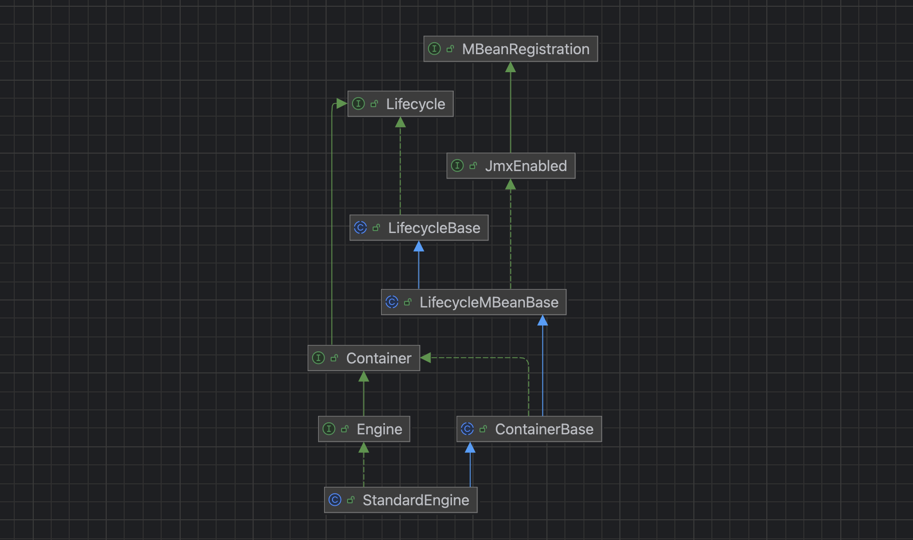
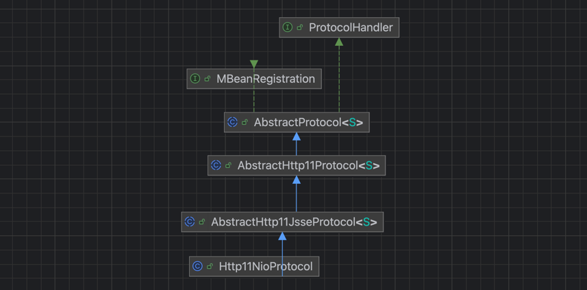
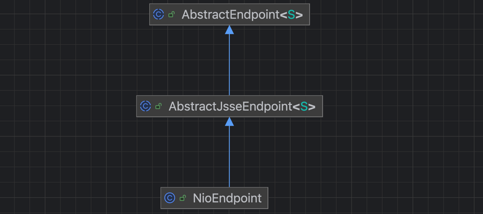
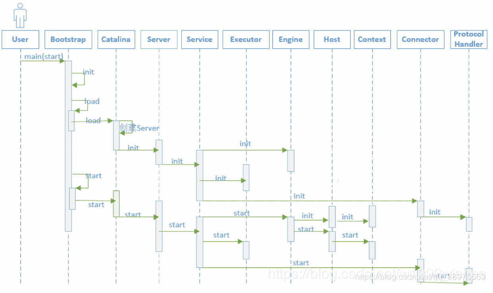

<style>
.my-code {
   color: orange;
}
.orange {
   color: rgb(255, 53, 2)
}
.red {
   color: red
}
code {
   color: #0ABF5B;
}
</style>


# 一、tomcat的启动过程
```text
exec "$PRGDIR/$EXECUTABLE" start "$@"
```
- `exec命令`：替换当前shell进程为`catalina.sh`，并传递参数（如start）
- `start参数`：指示`catalina.sh`以后台模式启动Tomcat

<!--more-->

## catalina.sh的核心流程

启动Tomcat
```text
if [ "$1" = "start" ]; then
  # 以后台模式启动
  nohup "$PRGDIR"/../bin/bootstrap.jar ...
elif [ "$1" = "run" ]; then
  # 以调试模式启动（前台）
  exec "$_RUNJAVA" ...
fi
```
- `nohup命令`：使Tomcat在后台运行，关闭终端后仍保持运行。
- `bootstrap.jar`：Java启动类 `org.apache.catalina.startup.Bootstrap`的入口。

## Java启动过程
初始化类加载器
```java
public void init() throws Exception {
    initClassLoaders(); // 初始化 Catalina 类加载器
    Thread.currentThread().setContextClassLoader(catalinaLoader);
}
```
启动catalina容器
```java
public static void main(String args[]) {
    synchronized (daemonLock) {
        Bootstrap daemon = new Bootstrap();
        if (command.equals("startd")) {
            args[args.length - 1] = "start";
            daemon.load(args);
            daemon.start();
        }
    }
}
```
执行`Boostrap`的main方法，此时tomcat就在JVM作为一个线程启动了。启动过程主要有2个步骤
1. 资源初始化，`load()`，绑定`serverSocket`
2. 资源启动，`start()`，connector创建acceptor连接线程池。


# 二、Load加载过程
执行Load方法
```java
/**
 * Load daemon.
 */
private void load(String[] arguments) throws Exception {
    // Call the load() method
    String methodName = "load";
    Method method = catalinaDaemon.getClass().getMethod(methodName, paramTypes);
```
通过反射，执行`Catalina.java`的load方法    
```java
public void load() {
    //首先利用Digester类解析server.xml文件，得到容器的配置，并创建相应的对象，并关联父子容器。依次创建的是StandardServer、StandardService、StandardEngine、StandardHost。
    Digester digester = createStartDigester();
    InputSource inputSource = null;
    InputStream inputStream = null;
    File file = null;
    try {
        //解析server.xml
        file = new File("conf/server.xml");
        inputStream = new FileInputStream(file);
        inputSource = new InputSource(file.toURI().toURL().toString());
    } catch (Exception e) {
    }
    
    // Start the new server
    try {
        getServer().init();
    } catch (LifecycleException e) {
    }
}
```

## 2.1、第一步：解析server.xml配置文件

### 2.1.1、createStartDigester的核心作用
是Tomcat启动过程中用于解析`server.xml`配置文件的关键方法，其核心功能是
- **创建并配置`Digester`对象**：通过规程（`Rules`）将XML节点映射到Java对象
- **定义对象创建规则**：根据XML节点路径（`<server>, <service>`）生成对应的Java对象（如`StandardServer、StandardService`）
- **设置属性和关联关系**：将XML节点的属性值设置到对象中，并通过方法调用（如`setParent()`）建立对象之间的层级关系。

<details style="background-color: #dbdbdb;padding: 10px;">
<summary>点击查看“`createStartDigester()`方法执行逻辑如下：”相关定义</summary>

```java
protected Digester createStartDigester() {
    long t1=System.currentTimeMillis();
    // Initialize the digester
    Digester digester = new Digester();
    digester.setValidating(false);
    digester.setRulesValidation(true);
    Map<Class<?>, List<String>> fakeAttributes = new HashMap<>();
    List<String> objectAttrs = new ArrayList<>();
    objectAttrs.add("className");
    fakeAttributes.put(Object.class, objectAttrs);
    // Ignore attribute added by Eclipse for its internal tracking
    List<String> contextAttrs = new ArrayList<>();
    contextAttrs.add("source");
    fakeAttributes.put(StandardContext.class, contextAttrs);
    digester.setFakeAttributes(fakeAttributes);
    digester.setUseContextClassLoader(true);

    //1. 创建 server对象（根节点）
    digester.addObjectCreate("Server",//xml节点路径
                             "org.apache.catalina.core.StandardServer",//默认类名
                             "className");//通过className属性指定类名（可选）
    digester.addSetProperties("Server");//设置server节点的属性（如port、address）
    //2. 将server对象传递给 catalina 实例的setServer()方法
    digester.addSetNext("Server",
                        "setServer",
                        "org.apache.catalina.Server");

    digester.addObjectCreate("Server/GlobalNamingResources",
                             "org.apache.catalina.deploy.NamingResourcesImpl");
    digester.addSetProperties("Server/GlobalNamingResources");
    digester.addSetNext("Server/GlobalNamingResources",
                        "setGlobalNamingResources",
                        "org.apache.catalina.deploy.NamingResourcesImpl");

    digester.addObjectCreate("Server/Listener",
                             null, // MUST be specified in the element
                             "className");
    digester.addSetProperties("Server/Listener");
    digester.addSetNext("Server/Listener",
                        "addLifecycleListener",
                        "org.apache.catalina.LifecycleListener");

    digester.addObjectCreate("Server/Service",
                             "org.apache.catalina.core.StandardService",
                             "className");
    digester.addSetProperties("Server/Service");
    digester.addSetNext("Server/Service",
                        "addService",
                        "org.apache.catalina.Service");

    digester.addObjectCreate("Server/Service/Listener",
                             null, // MUST be specified in the element
                             "className");
    digester.addSetProperties("Server/Service/Listener");
    digester.addSetNext("Server/Service/Listener",
                        "addLifecycleListener",
                        "org.apache.catalina.LifecycleListener");

    //Executor
    digester.addObjectCreate("Server/Service/Executor",
                     "org.apache.catalina.core.StandardThreadExecutor",
                     "className");
    digester.addSetProperties("Server/Service/Executor");

    digester.addSetNext("Server/Service/Executor",
                        "addExecutor",
                        "org.apache.catalina.Executor");


    digester.addRule("Server/Service/Connector",
                     new ConnectorCreateRule());
    digester.addRule("Server/Service/Connector",
                     new SetAllPropertiesRule(new String[]{"executor", "sslImplementationName"}));
    digester.addSetNext("Server/Service/Connector",
                        "addConnector",
                        "org.apache.catalina.connector.Connector");

    digester.addObjectCreate("Server/Service/Connector/SSLHostConfig",
                             "org.apache.tomcat.util.net.SSLHostConfig");
    digester.addSetProperties("Server/Service/Connector/SSLHostConfig");
    digester.addSetNext("Server/Service/Connector/SSLHostConfig",
            "addSslHostConfig",
            "org.apache.tomcat.util.net.SSLHostConfig");

    digester.addRule("Server/Service/Connector/SSLHostConfig/Certificate",
                     new CertificateCreateRule());
    digester.addRule("Server/Service/Connector/SSLHostConfig/Certificate",
                     new SetAllPropertiesRule(new String[]{"type"}));
    digester.addSetNext("Server/Service/Connector/SSLHostConfig/Certificate",
                        "addCertificate",
                        "org.apache.tomcat.util.net.SSLHostConfigCertificate");

    digester.addObjectCreate("Server/Service/Connector/SSLHostConfig/OpenSSLConf",
                             "org.apache.tomcat.util.net.openssl.OpenSSLConf");
    digester.addSetProperties("Server/Service/Connector/SSLHostConfig/OpenSSLConf");
    digester.addSetNext("Server/Service/Connector/SSLHostConfig/OpenSSLConf",
                        "setOpenSslConf",
                        "org.apache.tomcat.util.net.openssl.OpenSSLConf");

    digester.addObjectCreate("Server/Service/Connector/SSLHostConfig/OpenSSLConf/OpenSSLConfCmd",
                             "org.apache.tomcat.util.net.openssl.OpenSSLConfCmd");
    digester.addSetProperties("Server/Service/Connector/SSLHostConfig/OpenSSLConf/OpenSSLConfCmd");
    digester.addSetNext("Server/Service/Connector/SSLHostConfig/OpenSSLConf/OpenSSLConfCmd",
                        "addCmd",
                        "org.apache.tomcat.util.net.openssl.OpenSSLConfCmd");

    digester.addObjectCreate("Server/Service/Connector/Listener",
                             null, // MUST be specified in the element
                             "className");
    digester.addSetProperties("Server/Service/Connector/Listener");
    digester.addSetNext("Server/Service/Connector/Listener",
                        "addLifecycleListener",
                        "org.apache.catalina.LifecycleListener");

    digester.addObjectCreate("Server/Service/Connector/UpgradeProtocol",
                              null, // MUST be specified in the element
                              "className");
    digester.addSetProperties("Server/Service/Connector/UpgradeProtocol");
    digester.addSetNext("Server/Service/Connector/UpgradeProtocol",
                        "addUpgradeProtocol",
                        "org.apache.coyote.UpgradeProtocol");

    // Add RuleSets for nested elements
    digester.addRuleSet(new NamingRuleSet("Server/GlobalNamingResources/"));
    digester.addRuleSet(new EngineRuleSet("Server/Service/"));
    digester.addRuleSet(new HostRuleSet("Server/Service/Engine/"));
    digester.addRuleSet(new ContextRuleSet("Server/Service/Engine/Host/"));
    addClusterRuleSet(digester, "Server/Service/Engine/Host/Cluster/");
    digester.addRuleSet(new NamingRuleSet("Server/Service/Engine/Host/Context/"));

    // When the 'engine' is found, set the parentClassLoader.
    digester.addRule("Server/Service/Engine",
                     new SetParentClassLoaderRule(parentClassLoader));
    addClusterRuleSet(digester, "Server/Service/Engine/Cluster/");

    long t2=System.currentTimeMillis();
    if (log.isDebugEnabled()) {
        log.debug("Digester for server.xml created " + ( t2-t1 ));
    }
    return digester;

}
```

</details>

#### 2.1.1.1、关键规则方法解析

##### addObjectCreate()
**作用**：关键XML节点路径创建Java对象
底层实现
```java
public void begin(Attributes attributes) throws Exception {
    String realClassName = className; // 默认类名
    if (attributeName != null) {
        String value = attributes.getValue(attributeName); // 读取 className 属性
        if (value != null) {
            realClassName = value;
        }
    }
    Class<?> clazz = digester.getClassLoader().loadClass(realClassName);
    Object instance = clazz.newInstance();
    digester.push(instance); // 将对象压入栈顶
}
```

##### addSetProperties()
**作用**：将XML节点的属性值设置到对象的属性中。
实现
```java
public void begin(Attributes attributes) throws Exception {
    Object top = digester.peek(); // 获取栈顶对象
    for (int i = 0; i < attributes.getLength(); i++) {
        String name = attributes.getQName(i);
        String value = attributes.getValue(i);
        // 通过反射调用对象的 setter 方法（如 setPort(8080)）
        BeanUtils.setProperty(top, name, value);
    }
}
```
##### addSetNext()
**作用**：将当前对象传递给父对象的方法（建立父子关系）


#### 2.1.1.2、小结
> 解析`server.xml`文件，首先利用Digester类解析`server.xml`文件，得到容器的配置，并创建相应的对象，并关联父子容器。 依次创建的是`StandardServer、StandardService、StandardEngine、StandardHost`。。
> StandardService的创建：
```java
digester.addObjectCreate("Server/Service",
"org.apache.catalina.core.StandardService",
"className");
```
> 
> connector的创建
```java 
digester.addRule("Server/Service/Connector", new ConnectorCreateRule());//begin()方法
```
> Engine的创建：engine、host、Context的创建逻辑是差不多的。
```java
digester.addRuleSet(new EngineRuleSet("Server/Service/"));
public class Digester extends DefaultHandler2 {
    public void addRuleSet(RuleSet ruleSet) {
        //执行RuleSet的addRuleInstances方法
        ruleSet.addRuleInstances(this);
    }
}
public class EngineRuleSet extends RuleSetBase {
    public void addRuleInstances(Digester digester) {
        digester.addObjectCreate(prefix + "Engine",
                "org.apache.catalina.core.StandardEngine",
                "className");
    ...
    }
}
```

       

## 2.2、第二步：getServer().init()初始化server
`StandardServer`继承了`LifecycleBase`类
```java
public abstract class LifecycleBase implements Lifecycle {
    @Override
    public final synchronized void init() throws LifecycleException {
        if (!state.equals(LifecycleState.NEW)) {
            invalidTransition(Lifecycle.BEFORE_INIT_EVENT);
        }
        try {
            setStateInternal(LifecycleState.INITIALIZING, null, false);
            initInternal();
            setStateInternal(LifecycleState.INITIALIZED, null, false);
        } catch (Throwable t) {
            handleSubClassException(t, "lifecycleBase.initFail", toString());
        }
    }
}
```
内部执行`initInternal();`初始化方法

### 2.2.1、StandardServer.initInternal()
```java
protected void initInternal() throws LifecycleException {
    onameStringCache = register(new StringCache(), "type=StringCache");
    // Register the MBeanFactory
    MBeanFactory factory = new MBeanFactory();
    factory.setContainer(this);
    onameMBeanFactory = register(factory, "type=MBeanFactory");
    // Register the naming resources
    globalNamingResources.init();
    // Initialize our defined Services
    for (int i = 0; i < services.length; i++) {
        services[i].init();
    }
}
```
触发`service`的初始化

### 2.2.2、StandardService.initInternal()
```java
protected void initInternal() throws LifecycleException {
    if (engine != null) {
        engine.init();
    }
    // Initialize any Executors
    for (Executor executor : findExecutors()) {
        if (executor instanceof JmxEnabled) {
            ((JmxEnabled) executor).setDomain(getDomain());
        }
        executor.init();
    }
    // Initialize mapper listener
    mapperListener.init();
    // Initialize our defined Connectors
    synchronized (connectorsLock) {
        for (Connector connector : connectors) {
            try {
                connector.init();
            } catch (Exception e) {
                String message = sm.getString(
                        "standardService.connector.initFailed", connector);
                log.error(message, e);
                if (Boolean.getBoolean("org.apache.catalina.startup.EXIT_ON_INIT_FAILURE"))
                    throw new LifecycleException(message);
}}}}
```
主要有3个执行步骤：
1. service执行`engine`的初始化。(engine继承Container，所以实际是进行container的初始化)
2. 然后创建一组线程池。`executor`是Tomcat自己实现的线程池。
3. 然后进行连接器(`connector`)的初始化（一组连接器，server.xml中配置的多个connector，对应了端口号和协议）

tomcat的核心组件层级如下：
```text
Server
└── Service(s)
    ├── Connector(s)  # 处理外部连接（HTTP/HTTPS等）
    └── Engine        # 顶层容器，管理虚拟主机（Host）和请求处理
```

### 2.2.3、engine.init()
`StandardEngine.init()`实际执行`LifecycleBase.init()`
**触发条件**：当StandardService的engine属性不为null时（默认由`server.xml`配置）


```java
public abstract class LifecycleBase implements Lifecycle {
    @Override
    public final synchronized void init() throws LifecycleException {
        if (!state.equals(LifecycleState.NEW)) {
            invalidTransition(Lifecycle.BEFORE_INIT_EVENT);
        }
        try {
            setStateInternal(LifecycleState.INITIALIZING, null, false);
            initInternal();
            setStateInternal(LifecycleState.INITIALIZED, null, false);
        } catch (Throwable t) {
            handleSubClassException(t, "lifecycleBase.initFail", toString());
        }
    }
}
public class StandardEngine extends ContainerBase implements Engine {
    @Override
    protected void initInternal() throws LifecycleException {
        // Ensure that a Realm is present before any attempt is made to start
        // one. This will create the default NullRealm if necessary.
        getRealm();
        super.initInternal();
    }
}
public abstract class ContainerBase extends LifecycleMBeanBase implements Container {
    @Override
    protected void initInternal() throws LifecycleException {
        BlockingQueue<Runnable> startStopQueue = new LinkedBlockingQueue<>();
        startStopExecutor = new ThreadPoolExecutor(
                getStartStopThreadsInternal(),
                getStartStopThreadsInternal(), 10, TimeUnit.SECONDS,
                startStopQueue,
                new StartStopThreadFactory(getName() + "-startStop-"));
        startStopExecutor.allowCoreThreadTimeOut(true);
        super.initInternal();
    }
}
```
执行`engine.init()`方法，最终只会执行`ContainerBase.initInternal()`方法，主要是初始化一个启动线程池。


### 2.2.4、executor.init()
executor是`StandardThreadExecutor`（查看digester的解析过程）

没有做特殊的事情。

### 2.2.5、connector.init()
Connector的init方法主要是：
- 创建CoyoteAdapter
- 调用ProtocolHandler的init方法（并没有特殊逻辑），内部会调用Endpoint的init方法
```java
public class Connector extends LifecycleMBeanBase {
    @Override
    protected void initInternal() throws LifecycleException {
        super.initInternal();
        // 实例化adapter适配器
        adapter = new CoyoteAdapter(this);
        protocolHandler.setAdapter(adapter);
        try {
            //
            protocolHandler.init();
        } catch (Exception e) {
        }
    }
}
```

#### 2.2.5.1、Connector的创建
`ConnectorCreateRule`，用于处理<connection>标签的解析和Connector对象的创建，主要是其内部的begin()方法
```java
digester.addRule("Server/Service/Connector", new ConnectorCreateRule());
digester.addRule("Server/Service/Connector", new SetAllPropertiesRule(new String[]{"executor", "sslImplementationName"}));
digester.addSetNext("Server/Service/Connector",
                    "addConnector",
                    "org.apache.catalina.connector.Connector");
```
```java
public class ConnectorCreateRule extends Rule {
    @Override
    public void begin(String namespace, String name, Attributes attributes) throws Exception {
        //栈顶是 StandardService
        Service svc = (Service)digester.peek();
        Executor ex = null;
        if ( attributes.getValue("executor")!=null ) {
            ex = svc.getExecutor(attributes.getValue("executor"));
        }
        //根据protocol属性创建Connector
        Connector con = new Connector(attributes.getValue("protocol"));
        if (ex != null) {
            setExecutor(con, ex);
        }
        String sslImplementationName = attributes.getValue("sslImplementationName");
        if (sslImplementationName != null) {
            setSSLImplementationName(con, sslImplementationName);
        }
        //将新创建的Connector推入栈顶
        digester.push(con);
    }
}
```
在Connector的构造函数中，会去实例化`ProtocolHandler（"org.apache.coyote.http11.Http11NioProtocol"）`，并设置到Connector的protocolHandler属性中。
```java
public Connector(String protocol) {
    setProtocol(protocol);
    // Instantiate protocol handler
    ProtocolHandler p = null;
    try {
        Class<?> clazz = Class.forName(protocolHandlerClassName);
        p = (ProtocolHandler) clazz.getConstructor().newInstance();
    } catch (Exception e) {
    } finally {
        this.protocolHandler = p;
    }
}
```
`Http11NioProtocol`构造函数，会创建`NioEndpoint`
```java
public Http11NioProtocol() {
    super(new NioEndpoint());
}
```

#### 2.2.5.2、protocolHandler.init()
在创建`Connector`时就创建了`ProtocolHandler`。

- 执行`AbstractHttp11JsseProtocol.init()`
```java
public abstract class AbstractHttp11Protocol<S> extends AbstractProtocol<S> {
    @Override
    public void init() throws Exception {
        for (UpgradeProtocol upgradeProtocol : upgradeProtocols) {
            configureUpgradeProtocol(upgradeProtocol);
        }
        super.init();
    }
}
```
- 然后执行`AbstractProtocol.init()`方法：可以看到最终执行`endpoint.init()`方法
```java
public abstract class AbstractProtocol<S> implements ProtocolHandler, MBeanRegistration {
    @Override
    public void init() throws Exception {
        String endpointName = getName();
        endpoint.setName(endpointName.substring(1, endpointName.length()-1));
        endpoint.setDomain(domain);
        endpoint.init();
    }
}
```

#### 2.2.5.3、endpoint.init()

最终执行`AbstractEndpoint.init()`，主要职责就像绑定端口
- NioEndpoint的内部结构，我们已经在上一篇文章已经讲过，回顾一下，`NioEndpoint`包含以下核心组件：
1. `Acceptor`：接受新连接（`主Reactor`），监听TCP/IP连接请求。
2. `Poller`：监听I/O事件（`从Reactor`），基于Selector实现
3. `SocketProcessor`：封装具体连接的请求处理任务。
4. `Executor`（线程池）：处理`SocketProcessor`中的请求。- 
```java
public abstract class AbstractEndpoint<S> {
    public void init() throws Exception {
        if (bindOnInit) {
            bind();
            bindState = BindState.BOUND_ON_INIT;
        }
        if (this.domain != null) {
            // Register endpoint (as ThreadPool - historical name)
            oname = new ObjectName(domain + ":type=ThreadPool,name=\"" + getName() + "\"");
            Registry.getRegistry(null, null).registerComponent(this, oname, null);

            ObjectName socketPropertiesOname = new ObjectName(domain +
                    ":type=ThreadPool,name=\"" + getName() + "\",subType=SocketProperties");
            socketProperties.setObjectName(socketPropertiesOname);
            Registry.getRegistry(null, null).registerComponent(socketProperties, socketPropertiesOname, null);

            for (SSLHostConfig sslHostConfig : findSslHostConfigs()) {
                registerJmx(sslHostConfig);
            }
        }
    }
}
```
创建socket并绑定端口号。
```java
public void bind() throws Exception {
    if (!getUseInheritedChannel()) {
        serverSock = ServerSocketChannel.open();
        socketProperties.setProperties(serverSock.socket());
        InetSocketAddress addr = (getAddress()!=null?new InetSocketAddress(getAddress(),getPort()):new InetSocketAddress(getPort()));
        serverSock.socket().bind(addr,getAcceptCount());
    } else {
        // Retrieve the channel provided by the OS
        Channel ic = System.inheritedChannel();
        if (ic instanceof ServerSocketChannel) {
            serverSock = (ServerSocketChannel) ic;
        }
        if (serverSock == null) {
            throw new IllegalArgumentException(sm.getString("endpoint.init.bind.inherited"));
        }
    }
    serverSock.configureBlocking(true); //mimic APR behavior
    selectorPool.open();
}
```


# 三、load过程总结


参考
[Tomcat整体架构浅析](https://blog.csdn.net/cx520forever/article/details/52743166)