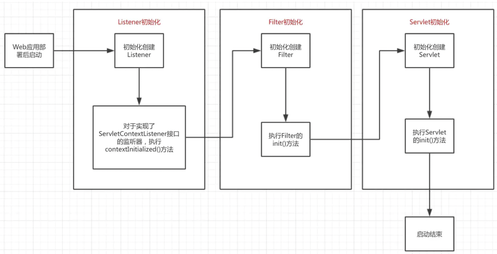

<style>
.my-code {
   color: orange;
}
.orange {
   color: rgb(255, 53, 2)
}
.red {
   color: red
}
code {
   color: #0ABF5B;
}
</style>

# 一、解析顺序
先解析server.xml，再解析web.xml


# 二、server.xml解析，在加载阶段

Catalina的load方法，此时会去解析server.xml文件

<!--more-->
```java
public void load() {
    // Create and execute our Digester
    Digester digester = createStartDigester();
    file = configFile();
    inputStream = new FileInputStream(file);
    inputSource = new InputSource(file.toURI().toURL().toString());
    inputSource.setByteStream(inputStream);
    digester.push(this);
    digester.parse(inputSource);//解析流，进行类
}    

protected Digester createStartDigester() {
    long t1=System.currentTimeMillis();
    // Initialize the digester
    Digester digester = new Digester();
    digester.setValidating(false);
    digester.setRulesValidation(true);
    Map<Class<?>, List<String>> fakeAttributes = new HashMap<>();
    List<String> objectAttrs = new ArrayList<>();
    objectAttrs.add("className");
    fakeAttributes.put(Object.class, objectAttrs);
    // Ignore attribute added by Eclipse for its internal tracking
    List<String> contextAttrs = new ArrayList<>();
    contextAttrs.add("source");
    fakeAttributes.put(StandardContext.class, contextAttrs);
    digester.setFakeAttributes(fakeAttributes);
    digester.setUseContextClassLoader(true);

    //创建StandardServer对象，设置其对象的属性，调用父节点Catalina的setServer方法将Server添加到Catalina中。
    digester.addObjectCreate("Server",
                             "org.apache.catalina.core.StandardServer",
                             "className");
    digester.addSetProperties("Server");
    digester.addSetNext("Server",
                        "setServer",
                        "org.apache.catalina.Server");

    digester.addObjectCreate("Server/GlobalNamingResources",
                             "org.apache.catalina.deploy.NamingResourcesImpl");
    digester.addSetProperties("Server/GlobalNamingResources");
    digester.addSetNext("Server/GlobalNamingResources",
                        "setGlobalNamingResources",
                        "org.apache.catalina.deploy.NamingResourcesImpl");

    digester.addObjectCreate("Server/Listener",
                             null, // MUST be specified in the element
                             "className");
    digester.addSetProperties("Server/Listener");
    digester.addSetNext("Server/Listener",
                        "addLifecycleListener",
                        "org.apache.catalina.LifecycleListener");

    digester.addObjectCreate("Server/Service",
                             "org.apache.catalina.core.StandardService",
                             "className");
    digester.addSetProperties("Server/Service");
    digester.addSetNext("Server/Service",
                        "addService",
                        "org.apache.catalina.Service");

    digester.addObjectCreate("Server/Service/Listener",
                             null, // MUST be specified in the element
                             "className");
    digester.addSetProperties("Server/Service/Listener");
    digester.addSetNext("Server/Service/Listener",
                        "addLifecycleListener",
                        "org.apache.catalina.LifecycleListener");

    //Executor
    digester.addObjectCreate("Server/Service/Executor",
                     "org.apache.catalina.core.StandardThreadExecutor",
                     "className");
    digester.addSetProperties("Server/Service/Executor");

    digester.addSetNext("Server/Service/Executor",
                        "addExecutor",
                        "org.apache.catalina.Executor");


    digester.addRule("Server/Service/Connector",
                     new ConnectorCreateRule());
    digester.addRule("Server/Service/Connector",
                     new SetAllPropertiesRule(new String[]{"executor", "sslImplementationName"}));
    digester.addSetNext("Server/Service/Connector",
                        "addConnector",
                        "org.apache.catalina.connector.Connector");

    digester.addObjectCreate("Server/Service/Connector/SSLHostConfig",
                             "org.apache.tomcat.util.net.SSLHostConfig");
    digester.addSetProperties("Server/Service/Connector/SSLHostConfig");
    digester.addSetNext("Server/Service/Connector/SSLHostConfig",
            "addSslHostConfig",
            "org.apache.tomcat.util.net.SSLHostConfig");

    digester.addRule("Server/Service/Connector/SSLHostConfig/Certificate",
                     new CertificateCreateRule());
    digester.addRule("Server/Service/Connector/SSLHostConfig/Certificate",
                     new SetAllPropertiesRule(new String[]{"type"}));
    digester.addSetNext("Server/Service/Connector/SSLHostConfig/Certificate",
                        "addCertificate",
                        "org.apache.tomcat.util.net.SSLHostConfigCertificate");

    digester.addObjectCreate("Server/Service/Connector/SSLHostConfig/OpenSSLConf",
                             "org.apache.tomcat.util.net.openssl.OpenSSLConf");
    digester.addSetProperties("Server/Service/Connector/SSLHostConfig/OpenSSLConf");
    digester.addSetNext("Server/Service/Connector/SSLHostConfig/OpenSSLConf",
                        "setOpenSslConf",
                        "org.apache.tomcat.util.net.openssl.OpenSSLConf");

    digester.addObjectCreate("Server/Service/Connector/SSLHostConfig/OpenSSLConf/OpenSSLConfCmd",
                             "org.apache.tomcat.util.net.openssl.OpenSSLConfCmd");
    digester.addSetProperties("Server/Service/Connector/SSLHostConfig/OpenSSLConf/OpenSSLConfCmd");
    digester.addSetNext("Server/Service/Connector/SSLHostConfig/OpenSSLConf/OpenSSLConfCmd",
                        "addCmd",
                        "org.apache.tomcat.util.net.openssl.OpenSSLConfCmd");

    digester.addObjectCreate("Server/Service/Connector/Listener",
                             null, // MUST be specified in the element
                             "className");
    digester.addSetProperties("Server/Service/Connector/Listener");
    digester.addSetNext("Server/Service/Connector/Listener",
                        "addLifecycleListener",
                        "org.apache.catalina.LifecycleListener");

    digester.addObjectCreate("Server/Service/Connector/UpgradeProtocol",
                              null, // MUST be specified in the element
                              "className");
    digester.addSetProperties("Server/Service/Connector/UpgradeProtocol");
    digester.addSetNext("Server/Service/Connector/UpgradeProtocol",
                        "addUpgradeProtocol",
                        "org.apache.coyote.UpgradeProtocol");

    // Add RuleSets for nested elements
    digester.addRuleSet(new NamingRuleSet("Server/GlobalNamingResources/"));
    //EngineRuleSet中，将实例化StandardEngine
    digester.addRuleSet(new EngineRuleSet("Server/Service/"));
    //HostRuleSet中，将实例化StandardHost
    digester.addRuleSet(new HostRuleSet("Server/Service/Engine/"))
    //ContextRuleSet中，将实例化StandardContext
    digester.addRuleSet(new ContextRuleSet("Server/Service/Engine/Host/"));
    addClusterRuleSet(digester, "Server/Service/Engine/Host/Cluster/");
    digester.addRuleSet(new NamingRuleSet("Server/Service/Engine/Host/Context/"));

    // When the 'engine' is found, set the parentClassLoader.
    digester.addRule("Server/Service/Engine",
                     new SetParentClassLoaderRule(parentClassLoader));
    addClusterRuleSet(digester, "Server/Service/Engine/Cluster/");

    long t2=System.currentTimeMillis();
    if (log.isDebugEnabled()) {
        log.debug("Digester for server.xml created " + ( t2-t1 ));
    }
    return digester;
}
```
server.xml的解析，主要是去创建相应的实例对象，并设置层级关系。


# 三、web.xml解析【StandardContext.startInternal()方法】
`StandardContext.startInternal()`启动过程中，触发`Lifecycle.CONFIGURE_START_EVENT` 事件，简化后代码如下：
```java
protected synchronized void startInternal() throws LifecycleException {
   // Notify our interested LifecycleListeners
   //1、通知容器启动事件，去解析web.xml
   fireLifecycleEvent(Lifecycle.CONFIGURE_START_EVENT, null);
   //Start our child containers, if not already started
   for (Container child : findChildren()) {
      if (!child.getState().isAvailable()) {
         child.start();
      }
   }
   //2、进行listener的创建和启动
   if (ok) {
     if (!listenerStart()) {
         log.error(sm.getString("standardContext.listenerFail"));
         ok = false;
     }
   }
   // 3、filter的创建和启动
   if (ok) {
     if (!filterStart()) {
         log.error(sm.getString("standardContext.filterFail"));
         ok = false;
     }
   }
   //加载和实例化servlet
   // Load and initialize all "load on startup" servlets
   if (ok) {
     if (!loadOnStartup(findChildren())){
         log.error(sm.getString("standardContext.servletFail"));
         ok = false;
     }
   }
}
```
<details style="background-color: #dbdbdb;padding: 10px;">
<summary>点击查看“StandardContext的创建”逻辑如下：</summary>

```java
public class ContextRuleSet extends RuleSetBase {
    public void addRuleInstances(Digester digester) {
        // 1. 创建Context实例，通过server.xml配置Context时，create是true，需要创建Context实例；通过HostConfig创建Context时，create为false，此时仅需要解析节点即可
        if (create) {
            digester.addObjectCreate(prefix + "Context", "org.apache.catalina.core.StandardContext", "className");
            digester.addSetProperties(prefix + "Context");
        } else {
            digester.addSetProperties(prefix + "Context", new String[]{"path", "docBase"});
        }

        if (create) {
            digester.addRule(prefix + "Context",
                    new LifecycleListenerRule
                            ("org.apache.catalina.startup.ContextConfig",
                                    "configClass"));
            digester.addSetNext(prefix + "Context",
                    "addChild",
                    "org.apache.catalina.Container");
        }

        // 2. 为Context添加生命周期监听器
        digester.addObjectCreate(prefix + "Context/Listener",
                null, // MUST be specified in the element
                "className");
        digester.addSetProperties(prefix + "Context/Listener");
        digester.addSetNext(prefix + "Context/Listener",
                "addLifecycleListener",
                "org.apache.catalina.LifecycleListener");

        // 3. 为Context指定类加载器，默认为org.apache.catalina.loader.WebappLoader
        digester.addObjectCreate(prefix + "Context/Loader",
                "org.apache.catalina.loader.WebappLoader",
                "className");
        digester.addSetProperties(prefix + "Context/Loader");
        digester.addSetNext(prefix + "Context/Loader",
                "setLoader",
                "org.apache.catalina.Loader");

        // 4. 为Context添加会话管理器，默认实现为StandardManager
        digester.addObjectCreate(prefix + "Context/Manager",
                "org.apache.catalina.session.StandardManager",
                "className");
        digester.addSetProperties(prefix + "Context/Manager");
        digester.addSetNext(prefix + "Context/Manager",
                "setManager",
                "org.apache.catalina.Manager");

        digester.addObjectCreate(prefix + "Context/Manager/Store",
                null, // MUST be specified in the element
                "className");
        digester.addSetProperties(prefix + "Context/Manager/Store");
        digester.addSetNext(prefix + "Context/Manager/Store",
                "setStore",
                "org.apache.catalina.Store");

        digester.addObjectCreate(prefix + "Context/Manager/SessionIdGenerator",
                "org.apache.catalina.util.StandardSessionIdGenerator",
                "className");
        digester.addSetProperties(prefix + "Context/Manager/SessionIdGenerator");
        digester.addSetNext(prefix + "Context/Manager/SessionIdGenerator",
                "setSessionIdGenerator",
                "org.apache.catalina.SessionIdGenerator");

        //5. 为Context添加初始化参数，通过该配置，为Context添加初始化参数
        digester.addObjectCreate(prefix + "Context/Parameter",
                "org.apache.tomcat.util.descriptor.web.ApplicationParameter");
        digester.addSetProperties(prefix + "Context/Parameter");
        digester.addSetNext(prefix + "Context/Parameter",
                "addApplicationParameter",
                "org.apache.tomcat.util.descriptor.web.ApplicationParameter");

        // 6. 为Context添加安全配置以及web资源配置
        digester.addRuleSet(new RealmRuleSet(prefix + "Context/"));

        digester.addObjectCreate(prefix + "Context/Resources",
                "org.apache.catalina.webresources.StandardRoot",
                "className");
        digester.addSetProperties(prefix + "Context/Resources");
        digester.addSetNext(prefix + "Context/Resources",
                "setResources",
                "org.apache.catalina.WebResourceRoot");

        digester.addObjectCreate(prefix + "Context/Resources/PreResources",
                null, // MUST be specified in the element
                "className");
        digester.addSetProperties(prefix + "Context/Resources/PreResources");
        digester.addSetNext(prefix + "Context/Resources/PreResources",
                "addPreResources",
                "org.apache.catalina.WebResourceSet");

        digester.addObjectCreate(prefix + "Context/Resources/JarResources",
                null, // MUST be specified in the element
                "className");
        digester.addSetProperties(prefix + "Context/Resources/JarResources");
        digester.addSetNext(prefix + "Context/Resources/JarResources",
                "addJarResources",
                "org.apache.catalina.WebResourceSet");

        digester.addObjectCreate(prefix + "Context/Resources/PostResources",
                null, // MUST be specified in the element
                "className");
        digester.addSetProperties(prefix + "Context/Resources/PostResources");
        digester.addSetNext(prefix + "Context/Resources/PostResources",
                "addPostResources",
                "org.apache.catalina.WebResourceSet");

        // 7. 为Context添加资源连接，默认为ContextResourceLink，用于J2EE命名服务
        digester.addObjectCreate(prefix + "Context/ResourceLink",
                "org.apache.tomcat.util.descriptor.web.ContextResourceLink");
        digester.addSetProperties(prefix + "Context/ResourceLink");
        digester.addRule(prefix + "Context/ResourceLink",
                new SetNextNamingRule("addResourceLink",
                        "org.apache.tomcat.util.descriptor.web.ContextResourceLink"));

        // 8. 为Context添加Valve
        digester.addObjectCreate(prefix + "Context/Valve",
                null, // MUST be specified in the element
                "className");
        digester.addSetProperties(prefix + "Context/Valve");
        digester.addSetNext(prefix + "Context/Valve",
                "addValve",
                "org.apache.catalina.Valve");

        // 9. 为Context添加守护资源配置
        digester.addCallMethod(prefix + "Context/WatchedResource",
                "addWatchedResource", 0);

        digester.addCallMethod(prefix + "Context/WrapperLifecycle",
                "addWrapperLifecycle", 0);

        digester.addCallMethod(prefix + "Context/WrapperListener",
                "addWrapperListener", 0);

        digester.addObjectCreate(prefix + "Context/JarScanner",
                "org.apache.tomcat.util.scan.StandardJarScanner",
                "className");
        digester.addSetProperties(prefix + "Context/JarScanner");
        digester.addSetNext(prefix + "Context/JarScanner",
                "setJarScanner",
                "org.apache.tomcat.JarScanner");

        digester.addObjectCreate(prefix + "Context/JarScanner/JarScanFilter",
                "org.apache.tomcat.util.scan.StandardJarScanFilter",
                "className");
        digester.addSetProperties(prefix + "Context/JarScanner/JarScanFilter");
        digester.addSetNext(prefix + "Context/JarScanner/JarScanFilter",
                "setJarScanFilter",
                "org.apache.tomcat.JarScanFilter");

        // 10. 为Context添加Cookie处理器
        digester.addObjectCreate(prefix + "Context/CookieProcessor",
                "org.apache.tomcat.util.http.Rfc6265CookieProcessor",
                "className");
        digester.addSetProperties(prefix + "Context/CookieProcessor");
        digester.addSetNext(prefix + "Context/CookieProcessor",
                "setCookieProcessor",
                "org.apache.tomcat.util.http.CookieProcessor");
    }
}
```
`StandardContext`添加`ContextConfig（是LifecycleListener类型）`

</details>

## 3.1、fireLifecycleEvent(Lifecycle.CONFIGURE_START_EVENT, null);
`standardContext`在创建过程中，添加了`ContextConfig（是LifecycleListener类型）`，此时执行`ContextConfig`的`lifecycleEvent()`方法
```java
public class ContextConfig implements LifecycleListener {
   @Override
   public void lifecycleEvent(LifecycleEvent event) {
      // Identify the context we are associated with
      try {
         context = (Context) event.getLifecycle();
      } catch (ClassCastException e) {
         log.error(sm.getString("contextConfig.cce", event.getLifecycle()), e);
         return;
      }
      // Process the event that has occurred
      if (event.getType().equals(Lifecycle.CONFIGURE_START_EVENT)) {
          //
         configureStart();
      }
   }
}
```
### 3.1.1、`configureStart()`逻辑
```java
protected synchronized void configureStart() {
   //进行web.xml的具体解析工作
  webConfig();
}
```
`ContextConfig`类中的`webConfig()`方法完成具体的解析工作

### 3.1.2、webConfig()方法,完成具体的解析工作
`/WEB-INF/web.xml`是`Servlet`规范的部署描述符，它描述了如何在一个Servlet容器中部署一个web应用，包括：session配置、servlet配置和映射、filter配置和映射、监听应用生命周期的listener、首页和错误页面配置、安全配置等。

同时，`Servlet 3.0`提供了web模块化规范，部署描述符也可以存在于`*/WEB-INF/lib/*.jar/web-fragment.xml`中，并在web应用部署时解析。

另外，Tomcat提供了`全局web.xml`：`$CATALINA_BASE/conf/web.xml`。与web-fragment一样的是，其配置将与`web.xml`合并，顺序可以通过ordering标签配置，具体合并规则见Servlet 3.0标准8.2.3节。

解析web.xml的过程就是读取各种部署描述符文件，合并并应用到容器中的过程，大体过程如下：
1. 使用`WebXmlDigester`，将`web.xml`的数据解析到`WebXml`对象中
2. 扫描`/WEB-INF/lib`下每个Jar包内的`/META-INF/web-fragment.xml`并解析，根据一定的规则排序，并放入Set中
3. 扫描`/WEB-INF/lib`下每个Jar包内的`/META-INF/services/`目录下的`ServletContainerInitializer`实现类，放入`StandardContext.initializers`中（后续将执行其`onStartup`方法）
4. 扫描`/WEB-INF/classes`下的`servlet注解`并添加相应配置
5. 将第一步解析的应用`web.xml`和第二步解析的`web-fragment.xml`以及全局的`web.xml`文件(`conf/web.xml 、web.xml.default`)合并到WebXml对象中
6. 将合并后的`WebXml`配置到`Context`中，例如为每个`Servlet`创建`Wrapper`并作为`Context`的子容器
```java
protected void webConfig() {
   //创建WebXmlParser解析web.xml配置文件，实例化WebXml类 start
   //解析WebXmlParser
   WebXmlParser webXmlParser = new WebXmlParser(context.getXmlNamespaceAware(), context.getXmlValidation(), context.getXmlBlockExternal());
    //分析解析WebXmlFragment
   Set<WebXml> defaults = new HashSet<>();
   defaults.add(getDefaultWebXmlFragment(webXmlParser));
    //分析解析ContextWebXml
   WebXml webXml = createWebXml();
   InputSource contextWebXml = getContextWebXmlSource();
   if (!webXmlParser.parseWebXml(contextWebXml, webXml, false)) {
      ok = false;
   }
    //创建WebXmlParser解析web.xml配置文件，实例化WebXml类 End
   ServletContext sContext = context.getServletContext();
   Map<String,WebXml> fragments = processJarsForWebFragments(webXml, webXmlParser);
   // Step 2. Order the fragments.
   Set<WebXml> orderedFragments = null;
   orderedFragments =  WebXml.orderWebFragments(webXml, fragments, sContext);
   // Step 3. Look for ServletContainerInitializer implementations
   if (ok) {
      processServletContainerInitializers();
   }
   if  (!webXml.isMetadataComplete() || typeInitializerMap.size() > 0) {
      // Step 4. Process /WEB-INF/classes for annotations and
      Map<String,JavaClassCacheEntry> javaClassCache = new HashMap<>();
      if (ok) {
         WebResource[] webResources = context.getResources().listResources("/WEB-INF/classes");
         for (WebResource webResource : webResources) {
            // Skip the META-INF directory from any JARs that have been
            // expanded in to WEB-INF/classes (sometimes IDEs do this).
            if ("META-INF".equals(webResource.getName())) {
               continue;
            }
            processAnnotationsWebResource(webResource, webXml,
                    webXml.isMetadataComplete(), javaClassCache);
         }
      }

      // Step 5. Process JARs for annotations and
      if (ok) {
         processAnnotations(orderedFragments, webXml.isMetadataComplete(), javaClassCache);
      }
      // Cache, if used, is no longer required so clear it
      javaClassCache.clear();
   }

   if (!webXml.isMetadataComplete()) {
      // Step 6. Merge web-fragment.xml files into the main web.xml file.
      if (ok) {
         ok = webXml.merge(orderedFragments);
      }
      // Step 7. Apply global defaults
      // Have to merge defaults before JSP conversion since defaults
      // provide JSP servlet definition.
      webXml.merge(defaults);
      // Step 8. Convert explicitly mentioned jsps to servlets
      if (ok) {
         convertJsps(webXml);
      }
      // Step 9. Apply merged web.xml to Context
      if (ok) {
         configureContext(webXml);
      }
   } else {
      webXml.merge(defaults);
      convertJsps(webXml);
      configureContext(webXml);
   }
   if (context.getLogEffectiveWebXml()) {
      log.info("web.xml:\n" + webXml.toXml());
   }
   // Always need to look for static resources
   // Step 10. Look for static resources packaged in JARs
   if (ok) {
      // Spec does not define an order.
      // Use ordered JARs followed by remaining JARs
      Set<WebXml> resourceJars = new LinkedHashSet<>();
      for (WebXml fragment : orderedFragments) {
         resourceJars.add(fragment);
      }
      for (WebXml fragment : fragments.values()) {
         if (!resourceJars.contains(fragment)) {
            resourceJars.add(fragment);
         }
      }
      processResourceJARs(resourceJars);
      // See also StandardContext.resourcesStart() for
      // WEB-INF/classes/META-INF/resources configuration
   }
   // Step 11. Apply the ServletContainerInitializer config to the context
   if (ok) {
      for (Map.Entry<ServletContainerInitializer,
              Set<Class<?>>> entry :
              initializerClassMap.entrySet()) {
         if (entry.getValue().isEmpty()) {
            context.addServletContainerInitializer(
                    entry.getKey(), null);
         } else {
            context.addServletContainerInitializer(
                    entry.getKey(), entry.getValue());
         }
      }
   }
}
```

### 3.1.3、ServletContext
当我们启动web的时候，会产生一个`ServletContext`为接口的对象，这个对象全局唯一，而且工程内部的所有`servlet`都共享这个对象。所以叫全局应用程序共享对象
`ServletContext`其实是一个接口，这个接口的实现是`ApplicationContext`类。
```java
@Override
public ServletContext getServletContext() {
  if (context == null) {
      context = new ApplicationContext(this);
      if (altDDName != null)
          context.setAttribute(Globals.ALT_DD_ATTR,altDDName);
  }
  return context.getFacade();
}
```

### 3.1.4、configureContext【将合并后的`WebXml`配置到`Context`中】
根据WebXml，设置`StandardContext`的各种属性。
- 调用`context.addChild()`将`Servlet（webxml.getServlets().values()）`封装为Wrapper，然后加入到`StandardContext`的`children`域中；
- `webxml.getWelcomeFiles()`，设置为`StandardContext.welcomeFiles`。 

> 解析`web.xml`的时候，使用的是WebXmlParser类，`WebXmlParser`类中封装了`Digester(webDigester、webFragmentDigester)、WebRuleSet、WebFragmentRuleSet`。

```java
private void configureContext(WebXml webxml) {
    //filter的解析，此处未进行创建
    for (FilterDef filter : webxml.getFilters().values()) {
        if (filter.getAsyncSupported() == null) {
            filter.setAsyncSupported("false");
        }
        context.addFilterDef(filter);
    }
    //listen解析，此处未进行创建
    for (String listener : webxml.getListeners()) {
        context.addApplicationListener(listener);
    }
    //创建wraper（此时servlet并未创建）
    for (ServletDef servlet : webxml.getServlets().values()) {
        Wrapper wrapper = context.createWrapper();
        if (servlet.getLoadOnStartup() != null) {
            wrapper.setLoadOnStartup(servlet.getLoadOnStartup().intValue());
        }
        if (servlet.getEnabled() != null) {
            wrapper.setEnabled(servlet.getEnabled().booleanValue());
        }
        wrapper.setName(servlet.getServletName());
        Map<String,String> params = servlet.getParameterMap();
        for (Entry<String, String> entry : params.entrySet()) {
            wrapper.addInitParameter(entry.getKey(), entry.getValue());
        }
        wrapper.setRunAs(servlet.getRunAs());
        Set<SecurityRoleRef> roleRefs = servlet.getSecurityRoleRefs();
        for (SecurityRoleRef roleRef : roleRefs) {
            wrapper.addSecurityReference(
                    roleRef.getName(), roleRef.getLink());
        }
        wrapper.setServletClass(servlet.getServletClass());
        MultipartDef multipartdef = servlet.getMultipartDef();
        if (multipartdef != null) {
            if (multipartdef.getMaxFileSize() != null &&
                    multipartdef.getMaxRequestSize()!= null &&
                    multipartdef.getFileSizeThreshold() != null) {
                wrapper.setMultipartConfigElement(new MultipartConfigElement(
                        multipartdef.getLocation(),
                        Long.parseLong(multipartdef.getMaxFileSize()),
                        Long.parseLong(multipartdef.getMaxRequestSize()),
                        Integer.parseInt(
                                multipartdef.getFileSizeThreshold())));
            } else {
                wrapper.setMultipartConfigElement(new MultipartConfigElement(
                        multipartdef.getLocation()));
            }
        }
        if (servlet.getAsyncSupported() != null) {
            wrapper.setAsyncSupported(
                    servlet.getAsyncSupported().booleanValue());
        }
        wrapper.setOverridable(servlet.isOverridable());
        context.addChild(wrapper);
    }
}
```

## 3.2、listen filter servlet的创建
`StandardContext.startInternal()`方法进行`web.xml`解析后，就会进行`listen, filter, servlet`的创建

### 3.2.1、listenerStart()

```java
public boolean listenerStart() {
     // Instantiate the required listeners
    String listeners[] = findApplicationListeners();
    Object results[] = new Object[listeners.length];
    boolean ok = true;
    for (int i = 0; i < results.length; i++) {
        if (getLogger().isDebugEnabled())
            getLogger().debug(" Configuring event listener class '" +
                listeners[i] + "'");
        try {
            String listener = listeners[i];
            results[i] = getInstanceManager().newInstance(listener);
        } catch (Throwable t) {
            t = ExceptionUtils.unwrapInvocationTargetException(t);
            ExceptionUtils.handleThrowable(t);
            getLogger().error(sm.getString("standardContext.applicationListener", listeners[i]), t);
            ok = false;
        }
    }   
}    
```
### 3.2.2、filterStart()
```java
public boolean filterStart() {
    if (getLogger().isDebugEnabled()) {
        getLogger().debug("Starting filters");
    }
    // Instantiate and record a FilterConfig for each defined filter
    boolean ok = true;
    synchronized (filterConfigs) {
        filterConfigs.clear();
        for (Entry<String,FilterDef> entry : filterDefs.entrySet()) {
            String name = entry.getKey();
            if (getLogger().isDebugEnabled()) {
                getLogger().debug(" Starting filter '" + name + "'");
            }
            try {
                ApplicationFilterConfig filterConfig = new ApplicationFilterConfig(this, entry.getValue());
                filterConfigs.put(name, filterConfig);
            } catch (Throwable t) {
                t = ExceptionUtils.unwrapInvocationTargetException(t);
                ExceptionUtils.handleThrowable(t);
                getLogger().error(sm.getString(
                        "standardContext.filterStart", name), t);
                ok = false;
            }
        }
    }
    return ok;
}
```

### 3.2.3、loadOnStartup(Container children[])

当然这种加载只是针对配置了 `load-on-startup` 属性的 `Servlet` 而言，
其它一般 `Servlet` 的加载和初始化会推迟到真正请求访问 web 应用而第一次调用该 `Servlet` 时，
下面会看到这种情况下代码分析。
```java
public boolean loadOnStartup(Container children[]) {
    // Collect "load on startup" servlets that need to be initialized
    TreeMap<Integer, ArrayList<Wrapper>> map = new TreeMap<>();
    for (int i = 0; i < children.length; i++) {
        Wrapper wrapper = (Wrapper) children[i];
        int loadOnStartup = wrapper.getLoadOnStartup();
        if (loadOnStartup < 0)
            continue;
        Integer key = Integer.valueOf(loadOnStartup);
        ArrayList<Wrapper> list = map.get(key);
        if (list == null) {
            list = new ArrayList<>();
            map.put(key, list);
        }
        list.add(wrapper);
    }

    // Load the collected "load on startup" servlets
    for (ArrayList<Wrapper> list : map.values()) {
        for (Wrapper wrapper : list) {
            try {
                wrapper.load();
            } catch (ServletException e) {            }
        }
    }
    return true;
}
//StandardWrapper
public synchronized void load() throws ServletException {
    instance = loadServlet();
    if (!instanceInitialized) {
        //Servlet servlet = instanceManager.newInstance(servletClass);
        initServlet(instance);
    }
}
```
然后执行`loadServlet()`方法，通过`InstanceManager`创建`servlet`，创建完成后，执行`servlet.init()`方法
```java
public class StandardWrapper extends ContainerBase
    implements ServletConfig, Wrapper, NotificationEmitter {
   
    public synchronized Servlet loadServlet() throws ServletException {

      Servlet servlet;
      try {
         InstanceManager instanceManager = ((StandardContext)getParent()).getInstanceManager();
         try {
            servlet = (Servlet) instanceManager.newInstance(servletClass);
         }
         //执行servlet.init()方法
         initServlet(servlet);
      } 
      return servlet;
   }
 }
```


> servlet执行时机
1. servlet = wrapper.allocate(); 调用StandardWrapper#allocate()方法，获取到servlet实例
2. ApplicationFilterChain filterChain = ApplicationFilterFactory.createFilterChain(request, wrapper, servlet);为当前请求创建一个过滤链，（非异步情况下）并调用filterChain.doFilter(request.getRequest(), response.getResponse());
3. filter#doFilter()、servlet#service()的执行是在filterChain.doFilter(request.getRequest(), response.getResponse());代码内部执行的。

> sevletRequestListener执行时机
```java
StandardHostValve.invoke
// context.fireRequestInitEvent，会去通知Listener
public final void invoke(Request request, Response response)
    throws IOException, ServletException {
    try {
        context.bind(Globals.IS_SECURITY_ENABLED, MY_CLASSLOADER);
        if (!asyncAtStart && !context.fireRequestInitEvent(request.getRequest())) {
            return;
        }
}     
```   

//请求过来时，会去执行listener
```java
public boolean fireRequestInitEvent(ServletRequest request) {
    Object instances[] = getApplicationEventListeners();
    if ((instances != null) && (instances.length > 0)) {
        ServletRequestEvent event = new ServletRequestEvent(getServletContext(), request);
            try {
                listener.requestInitialized(event);
            } catch (Throwable t) {
            }
        }
    }
    return true;
}
```

# 四、请求执行过程
StandardContext.startInternal()方法进行web.xml解析后，就会进行listen和filter和servlet（ServletWarpper）的创建
1. StandardHostValve.invoke，会调用StanardContext.fireRequestInitEvent
2. StandardContext.fireRequestInitEvent的 **listener（servletListener）** 的requestInitialized方法
3. 然后StandardContextValve.invoke，根据URL选择servlet
4. 然后StandardWrapperValve.invoke
    1. 会先判断servlet是否存在，不存在则创建。非load-on-startup类型的servlet会在第一次请求时创建。
    2. 执行过滤链，当所有的过滤器执行完成后，最后一个过滤器会调用步骤3
    3. 执行servlet.service方法


> 多种listener
1. ServletContextListener：监听ServletContext域对象的创建和销毁
2. HttpSessionListener：接口用于监听HttpSession对象的创建和销毁
3. ServletRequestListener：接口用于监听ServletRequest 对象的创建和销毁


listener -> filter -> servlet：执行顺序




