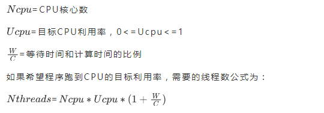

<style>
.my-code {
   color: orange;
}
.orange {
   color: rgb(255, 53, 2)
}
.red {
   color: red
}
code {
   color: #0ABF5B;
}
</style>


# 一、Tomcat的线程模型
讲解Tomcat的线程模型，先了解`NioEndpoint`

<!--more-->  

## 1.1、NioEndpoint
`NioEndpoint`包含以下核心组件：
1. `Acceptor`：接受新连接（`主Reactor`），监听TCP/IP连接请求。
2. `Poller`：监听I/O事件（`从Reactor`），基于Selector实现
3. `SocketProcessor`：封装具体连接的请求处理任务。
4. `Executor`（线程池）：处理`SocketProcessor`中的请求。【AbstractEndpoint内部的Executor线程池】
```java
public class NioEndpoint extends AbstractJsseEndpoint<NioChannel> {
    //是Java NIO中用于监听TCP连接的通道。
    private volatile ServerSocketChannel serverSock = null;
    //后台线程，监听tcp/ip请求，
    protected class Acceptor extends AbstractEndpoint.Acceptor {
        @Override
        public void run() {
            int errorDelay = 0;
            // 循环
            while (running) {
                try {
                    SocketChannel socket = null;
                    try {
                        //阻塞，直到有新连接到达
                        socket = serverSock.accept();
                    } catch (IOException ioe) {
                    }
                    if (running && !paused) {
                        //处理连接，生成PollEvent，添加到Poller线程的events同步队列里
                        if (!setSocketOptions(socket)) {
                        }
                    } 
                } catch (Throwable t) {
                }
            }
            state = AcceptorState.ENDED;
        }
    }
    //轮询线程，处理
    public class Poller implements Runnable {
        private Selector selector;
        private final SynchronizedQueue<PollerEvent> events = new SynchronizedQueue<>();
        @Override
        public void run() {
            // Loop until destroy() is called
            while (true) {
                boolean hasEvents = false;
                //events()方法内部，会遍历events，然后执行PollerEvent的run()方法，将SocketChannel注册到Selector中，监听OP_READ事件
                if ( keyCount == 0 ) hasEvents = (hasEvents | events());
                Iterator<SelectionKey> iterator =
                        keyCount > 0 ? selector.selectedKeys().iterator() : null;
                while (iterator != null && iterator.hasNext()) {
                    SelectionKey sk = iterator.next();
                    NioSocketWrapper attachment = (NioSocketWrapper)sk.attachment();
                    // Attachment may be null if another thread has called
                    // cancelledKey()
                    if (attachment == null) {
                        iterator.remove();
                    } else {
                        iterator.remove();
                        //处理请求，封装成SocketProcessor，并将其交给Executor线程池执行业务逻辑
                        processKey(sk, attachment);
                    }
                }//while

                //process timeouts
                timeout(keyCount,hasEvents);
            }//while

            getStopLatch().countDown();
        }
    }
    
    //public abstract class SocketProcessorBase<S> implements Runnable {
    protected class SocketProcessor extends SocketProcessorBase<NioChannel> {
        public SocketProcessor(SocketWrapperBase<NioChannel> socketWrapper, SocketEvent event) {
            super(socketWrapper, event);
        }
        @Override
        protected void doRun() {
            NioChannel socket = socketWrapper.getSocket();
            SelectionKey key = socket.getIOChannel().keyFor(socket.getPoller().getSelector());
            //处理请求
            state = getHandler().process(socketWrapper, event);
        }
    }
}
```
线程模型
- **1个Acceptor线程**：负责接收新连接
- **1个Poller线程**：负责轮询I/O事件
- **1个线程池（Executor）**：处理具体的请求（默认大小有maxThreads配置）

## 1.2、Executor
当`NioEndPoint`将`SocketProcessor`添加到`StandardThreadExecutor`中，最终会通过`StandardThreadExecutor`内部的`ThreadPoolExecutor`去执行
```java
public class StandardThreadExecutor extends LifecycleMBeanBase implements Executor, ResizableExecutor {
    /**
     * max number of threads
     */
    protected int maxThreads = 200;
    /**
     * min number of threads
     */
    protected int minSpareThreads = 25;

    protected ThreadPoolExecutor executor = null;

    @Override
    protected void startInternal() throws LifecycleException {
        taskqueue = new TaskQueue(maxQueueSize);
        TaskThreadFactory tf = new TaskThreadFactory(namePrefix,daemon,getThreadPriority());
        executor = new ThreadPoolExecutor(getMinSpareThreads(), getMaxThreads(), maxIdleTime, TimeUnit.MILLISECONDS,taskqueue, tf);
        executor.setThreadRenewalDelay(threadRenewalDelay);
        if (prestartminSpareThreads) {
            executor.prestartAllCoreThreads();
        }
        //重点方法：这行代码非常关键。没有这行代码，Tomcat 的线程池则会表现的和 JDK 的线程池一样。
        taskqueue.setParent(executor);
        setState(LifecycleState.STARTING);
    }

    @Override
    public void execute(Runnable command) {
        if ( executor != null ) {
            try {
                executor.execute(command);
            } catch (RejectedExecutionException rx) {
                //there could have been contention around the queue
                if ( !( (TaskQueue) executor.getQueue()).force(command) ) throw new RejectedExecutionException("Work queue full.");
            }
        } else throw new IllegalStateException("StandardThreadPool not started.");
    }
}
```
Tomcat线程池和JUC线程池的区别
- **提前创建核心线程**：
  - StandardThreadExecutor在启动过程中，`exector.prestartAllCoreThreads()`提前创建核心线程池。
- **任务代理处理**:
  - Tomcat线程池在任务数量超过当前线程数但未达到最大线程数时，户创建非核心线程，即使队列未满。JUC线程池则仅在队列满时创建非核心线程。
  - `taskqueue.setParent(executor);`：这行代码非常关键。没有这行代码，Tomcat 的线程池则会表现的和 JDK 的线程池一样。


# 二、连接池

## 2.1、acceptCount
accept队列的长度；当accept队列中连接的个数达到acceptCount时，队列满，进来的请求一律被拒绝。默认值是100。
```java
private int acceptCount = 100;
public class NioEndpoint extends AbstractJsseEndpoint<NioChannel> {
    @Override
    public void bind() throws Exception {
        if (!getUseInheritedChannel()) {
            serverSock = ServerSocketChannel.open();
            socketProperties.setProperties(serverSock.socket());
            InetSocketAddress addr = (getAddress() != null ? new InetSocketAddress(getAddress(), getPort()) : new InetSocketAddress(getPort()));
            //服务器套接字绑定到指定端口，并配置操作系统在拒绝新连接前的最大等待连接数
            serverSock.socket().bind(addr, getAcceptCount());
        }
        serverSock.configureBlocking(true); //mimic APR behavior
    }
}
```
- bind(SocketAddress addr, int backlog)
- `addr`：绑定的地址（IP和端口）。
- `backlog`：等待连接队列的最大长度。


## 2.1、maxConnections
Tomcat在任意时刻接收和处理的最大连接数。
- `NioEndpoint`内部的`acceptor`线程执行时，判断当前connection连接数的数量，如果超过maxConnections，Acceptor线程不会读取accept队列中的连接；这时accept队列中的线程会一直阻塞着，直到Tomcat接收的连接数小于maxConnections。如果设置为-1，则连接数不受限制。
- 默认值与连接器使用的协议有关：NIO的默认值是10000，APR/native的默认值是8192，而BIO的默认值为maxThreads（如果配置了Executor，则默认值是Executor的maxThreads）。
```java
public abstract class AbstractEndpoint<S> {
    private int maxConnections = 10000;
}

public class NioEndpoint extends AbstractJsseEndpoint<NioChannel> {
    //是Java NIO中用于监听TCP连接的通道。
    private volatile ServerSocketChannel serverSock = null;
    //后台线程，监听tcp/ip请求，
    protected class Acceptor extends AbstractEndpoint.Acceptor {
        @Override
        public void run() {
            int errorDelay = 0;
            // 循环
            while (running) {
                try {
                    //if we have reached max connections, wait
                    countUpOrAwaitConnection();
                    
                    SocketChannel socket = null;
                    try {
                        //阻塞，直到有新连接到达
                        socket = serverSock.accept();
                    } catch (IOException ioe) {
                    }
                    if (running && !paused) {
                        //处理连接，生成PollEvent，添加到Poller线程的events同步队列里
                        if (!setSocketOptions(socket)) {
                        }
                    }
                } catch (Throwable t) {
                }
            }
            state = AcceptorState.ENDED;
        }
    }
}
```

# 三、性能优化
Connector配置如下：
```xml
<Connector 
    port="8080" 
    protocol="org.apache.coyote.http11.Http11Nio2Protocol" <!-- 推荐NIO2 -->
    maxThreads="500"              <!-- 最大工作线程数（根据压测调整） -->
    minSpareThreads="50"          <!-- 最小空闲线程 -->
    acceptCount="200"             <!-- 等待队列长度 -->
    connectionTimeout="20000"     <!-- 连接超时时间（ms） -->
    maxConnections="10000"        <!-- 最大连接数 -->
    enableLookups="false"         <!-- 禁用DNS查询 -->
    compression="on"              <!-- 启用GZIP压缩 -->
    compressionMinSize="1024"     <!-- 压缩阈值 -->
    compressableMimeType="text/html,text/xml,text/css,text/javascript,application/json"
    redirectPort="8443"
    URIEncoding="UTF-8"/>
```
- `protocol`：优先使用NIO2或NIO，适合高并发。
- `maxThreads`：根据压测调整，IO密集型可设为`200~1000`，CPU密集型设为CPU核数 + `1~4`


# 四、线程池

## 4.1、N+1 和 2N的说法来源
源自2006年出版的《Java并发编程》这本书里，给出的公式如下：

> `N+1`：CPU密集型任务，线程几乎一直在执行计算，很少阻塞。N+1可以确保即使一个线程阻塞，其他N个线程扔能充分利用CPU。
> `2N`：IO密集型任务，线程频繁阻塞（如等待网络、数据库、文件IO），理论上，2N线程可使CPU利用率接近100%（假设每个线程的IO等待时间均匀分布）

现实情况下，假设一个简单查询，等待时间大约是10ms，计算时间是2ms，理论是5N个线程数量。`但是为什么可以设置成这么高，大家不敢设置呢？`
```text
是因为长久以来有个一贯的说法是：上下文切换会带来CPU的空转损耗，但是没人告诉你，CPU上下文切换这种说法呢是源自1961年有其时代的局限性
• 1961年的上下文切换耗时：在数百微秒到毫秒级别（如100~1000us），主要受限于低主频、慢内存和缺乏硬件支持。
• 现在的CPU上下文切换耗时大约是1~3微秒左右。

微秒 (μs)
• 换算关系：1 ms = 1000 μs。

每核每秒切换线程上下文1000次 * 每次3μs = 3000μs
• 3000μs/1000 = 3ms -> 1s中损耗3ms，损耗极少
```
在极端的高并发情况下，有`几十万个线程`正在切换才会造成巨大影响，否则以Tomcat为例，200个线程或者是1000、2000个线程切换，这个损耗几乎可以忽略不计的。
> 200000*3μs /1000/1000=0.6s，此时线程上下文切换会对性能造成巨大影响。


最终建议：
- 现代CPU的切换损耗已经微不足道，高线程数在IO密集型场景中可能显著提升吞吐量。
