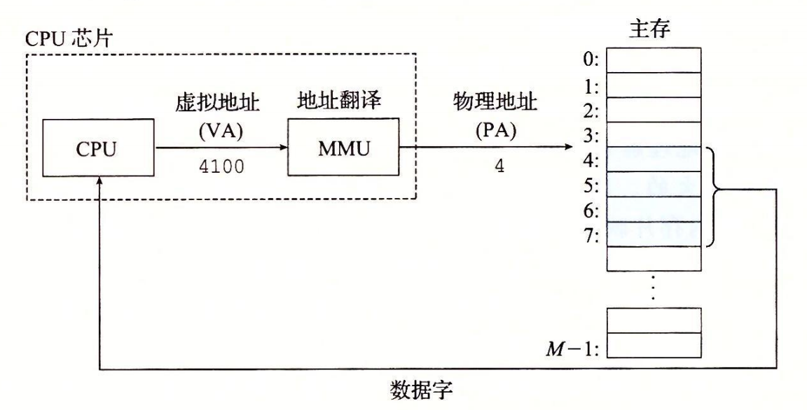
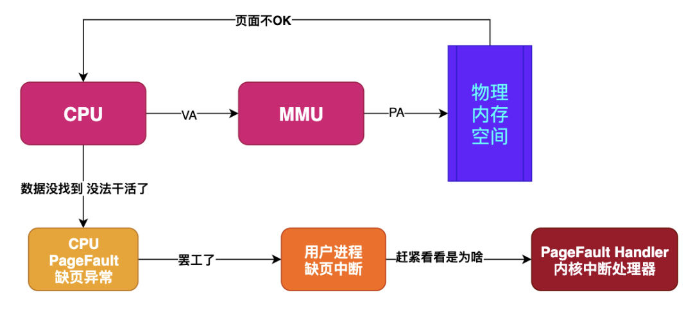
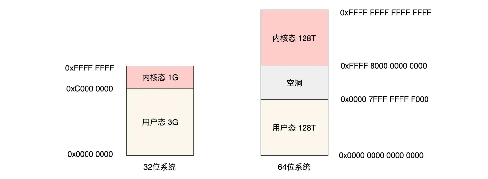
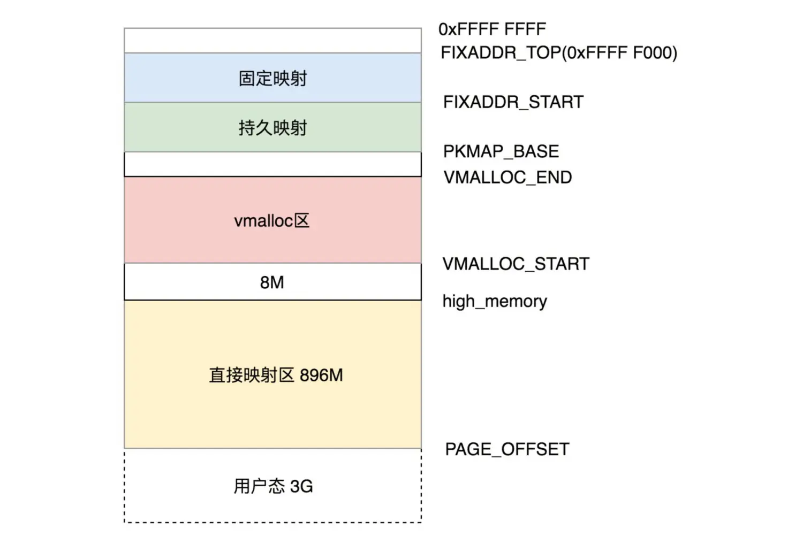
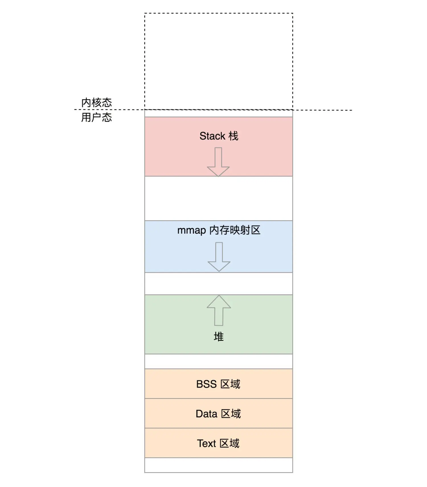
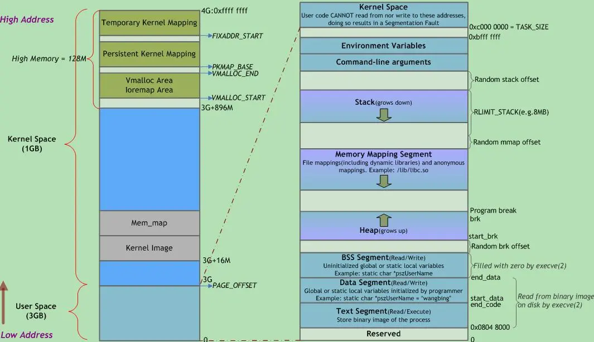

# 一、内存
内存（Memory）是计算机的重要组成部分，用于存储计算机正在运行的程序和数据。

<!--more-->  

## 1.1、内存类型
内存主要分为**随机存取存储器**（Random - Access Memory，RAM）和**只读存储器**（Read - Only Memory，ROM）。
- RAM 是计算机的主存储器，通常所说的内存大小就是指 RAM 的大小，它允许计算机快速地读取和写入数据，但是在计算机断电后，存储的数据会丢失。
- ROM 则用于存储一些固定的程序或数据，如计算机的 BIOS（基本输入输出系统），它的数据在一般情况下只能读取，不能随意写入，并且在断电后数据不会丢失。

# 二、内存管理

## 2.1、分区式内存管理

### 2.1.1、固定分区
- **原理：** 在系统初始化时，把内存划分为若干个固定大小的分区。每个分区的大小可以相同，也可以不同。每个分区可以装入一道程序，程序运行时整个分区都分配给它。例如，内存大小为 64KB，划分成 4 个分区，每个分区大小为 16KB。当有一个大小为 10KB 的程序要运行时，就会分配一个 16KB 的分区给它，剩余 6KB 空间浪费掉。
- **优点：** 实现简单，易于理解和管理。对于一些对内存要求固定且已知的系统比较适用。
- **缺点：** 存在内部碎片，即分区内未被利用的空间。内存利用率较低，因为程序大小不一定刚好与分区大小匹配；并且分区数量固定，限制了可同时运行的程序数量。

### 2.1.2、动态分区
- **原理：** 在程序装入内存时，根据程序的大小动态地划分内存空间。例如，内存最初是一个空闲的大块，当第一个程序大小为 20KB 需要装入时，就从内存中划分出 20KB 给它；当第二个程序大小为 30KB 装入时，再从剩余空闲空间划分出 30KB。
- **优点：** 没有内部碎片，因为是按照程序大小分配空间的。内存利用率相对较高。
- **缺点：** 存在外部碎片，即内存中由于多次分配和回收产生的小的空闲分区，这些小分区可能无法满足新程序的装入需求，尽管它们的总和可能足够。并且内存分配和回收的算法相对复杂，管理开销较大。

## 2.2、页式内存管理
- **原理：** 把内存空间划分为大小相等的页面（Page），一般页面大小为 4KB 或 8KB 等固定值。同时，将程序的逻辑地址空间也划分为同样大小的页。当程序运行时，以页为单位进行内存分配。例如，程序的逻辑地址空间有 100 页，内存中有 200 个物理页面。当程序需要运行时，操作系统会将程序的页映射到内存的物理页面上。
- **优点：** 有效地解决了外部碎片问题，因为页面大小固定，分配和回收相对简单。便于操作系统进行内存管理，通过页表（Page Table）来记录逻辑页和物理页的映射关系，方便实现虚拟内存。
- **缺点：** 存在内部碎片，因为最后一页可能没有装满程序内容。页表需要占用一定的内存空间，并且页表的查询会带来一定的时间开销。

在 32 位的 x86 架构中，早期的 Windows 和 Linux 系统通常使用 4KB 的页大小。随着 64 位架构的发展，也支持更大的页大小，如 2MB 或 4MB 的大页（Huge Pages）来提高性能

## 2.3、段式内存管理
- **原理：** 根据程序的逻辑结构将程序划分为若干个段（Segment），如代码段、数据段、堆栈段等。每个段有自己的名字和长度，在内存中可以独立地进行存储和管理。例如，一个编译后的程序可能包括代码段存放指令，数据段存放变量和常量，堆栈段用于函数调用等。
- **优点：** 便于程序和数据的共享，不同的程序可以共享相同的代码段。可以根据程序的逻辑结构进行动态增长，例如堆栈段可以根据函数调用的深度动态增长。
- **缺点：** 会产生外部碎片，因为段的大小不固定。段表（Segment Table）用于管理段的存储位置等信息，段表的管理和维护也会带来一定的开销。

## 2.4、段页式内存管理
- **原理：** 结合了段式和页式管理的优点。先将程序按逻辑结构分成段，然后每个段内再划分成页。在内存分配时，先找到相应的段，再将段内的页映射到内存中的物理页面。例如，一个程序分为代码段和数据段，代码段有 30 页，数据段有 20 页，这些页会根据需要映射到内存的物理页面上。
- **优点：** 综合了段式和页式的优点，既便于程序的逻辑管理，又有效地解决了外部碎片问题，同时也能方便地实现虚拟内存。
- **缺点：** 管理复杂程度较高，因为需要同时维护段表和页表，增加了系统的开销。内存空间的分配和回收过程涉及更多的步骤和数据结构。

**因为内存的控制方式是页，所以和磁盘的交互也是以页的方式页的整数倍**。

# 三、虚拟内存
虚拟内存是一种计算机系统内存管理技术，它使得应用程序在运行时能够使用比实际物理内存更大的地址空间。它将计算机的物理内存（Random - Access Memory，RAM）和磁盘空间（通常是硬盘的一部分）结合起来，为每个进程创建一个虚拟的、连续的地址空间。这个虚拟地址空间对进程来说就好像是真实的物理内存，但实际上，只有部分虚拟地址空间中的数据存储在物理内存中，其余部分存储在磁盘上。

> 众所周知，Linux采用虚拟内存管理技术，每个进程都有独立的进程地址空间。这是Linux内存管理的基础，所以我们先讲解一下虚拟内存技术。

## 3.1、为什么需要虚拟内存？
- 扩大内存
  多线程环境下，内存空间小，容易不足，为了使进程之间互不影响，
- 安全性提高
  不直接访问物理内存，这样就不会修改其他进程的数据，使安全性得到提高
- 易于开发
  每个进程拥有自己的独立空间

## 3.2、虚拟内存和物理内存
计算机系统的主存被组织成一个由 M 个连续的字节大小的单元组成的数组。每字节都有一个唯一的**物理地址（Physical Address，PA）**。第一个字节的地址为 0，接下来的字节地址为 1，再下一个为 2，依此类推。给定这种简单的结构，CPU 访问内存的最自然的方式就是使用物理地址。我们把这种方式称为**物理寻址（physical addressing）**。

早期的 PC 使用物理寻址，而且诸如数字信号处理器、嵌入式微控制器以及 Cray 超级计算机这样的系统仍然继续使用这种寻址方式。然而，现代处理器使用的是一种称为**虚拟寻址（virtual addressing）** 的寻址形式

使用虚拟寻址，CPU 通过生成一个**虚拟地址（Virtual Address，VA）** 来访问主存，这个虚拟地址在被送到内存之前先转换成适当的物理地址。将一个虚拟地址转换为物理地址的任务叫做**地址翻译（address translation）**。就像异常处理一样，地址翻译需要 CPU 硬件和操作系统之间的紧密合作。CPU 芯片上叫做**内存管理单元（Memory Management Unit，MMU）** 的专用硬件，利用存放在主存中的查询表来动态翻译虚拟地址，该表的内容由操作系统管理。

## 3.3、内存管理单元（Memory Management Unit，MMU）

### 3.3.1、定义
内存管理单元（MMU）是计算机系统中的一个硬件组件，主要负责处理 CPU 的内存访问请求。它位于 CPU 和物理内存之间，是实现虚拟内存和内存保护机制的关键部件。

### 3.3.2、作用
其基本功能包括虚拟地址到物理地址的转换以及内存访问权限的检查。当 CPU 发出一个虚拟内存地址访问请求时，MMU 会将这个虚拟地址转换为物理地址，使得 CPU 能够正确地访问物理内存中的数据。同时，MMU 会根据预先设置的内存访问权限规则，检查 CPU 的访问请求是否合法，例如，防止程序对只读内存区域进行写操作。

总结一下：地址翻译功能。

## 3.3、页表

### 3.3.1、定义
<code>页表</code>是虚拟内存系统的核心数据结构。它记录了每个虚拟页对应的物理页号、页面的状态（如是否在物理内存中、是否被修改等）和访问权限（如可读、可写、可执行）等信息。

### 3.3.2、作用
页表存储了进程中虚拟地址到物理地址的映射关系。

当 CPU 执行指令访问内存时，它使用的是虚拟地址。MMU收到CPU的虚拟地址之后开始查询页表，确定是否存在映射以及读写权限是否正常。

### 3.3.3、页表示例：

页表就是一个页表条目（Page Table Entry，PTE）的数组。

### 3.3.4、页表工作流程

第一步：虚拟地址分解：
- 虚拟地址通常由两部分组成，即页号和页内偏移量。以 32 位虚拟地址和 4KB 页面大小为例，高 20 位表示页号，低 12 位表示页内偏移量。当 CPU 要访问一个虚拟地址时，首先将虚拟地址分解为页号和页内偏移量这两个部分。

第二步：查找物理页号：
- 根据虚拟地址中的页号，在页表中查找对应的页表项。找到页表项后，获取其中的物理页号。如果页表项中的存在位为 0，说明该虚拟页不在物理内存中，此时会触发页面缺失处理机制，操作系统会从磁盘中读取该虚拟页到物理内存中，并更新页表项中的相关信息。

第三步：计算物理地址：
- 将获取到的物理页号和虚拟地址中的页内偏移量组合起来，计算出物理地址。物理页号需要左移页内偏移量对应的位数（如对于 4KB 页面，左移 12 位），然后再加上页内偏移量，得到最终的物理地址。这样，CPU 就可以根据这个物理地址来访问物理内存中的数据。

## 3.4、缺页

### 3.4.1、定义
缺页中断（英语：Page fault，又名硬错误、硬中断、分页错误、寻页缺失、缺页中断、页故障等）指的是当软件试图访问已映射在 虚拟 地址空间中，但是目前并未被加载在 物理内存中的一个 分页时，由 中央处理器的内存管理单元所发出的 中断。

### 3.4.2、导致缺页异常发生的情况有如下：
- 地址不在<code>虚拟地址空间</code>中
- 地址在<code>虚拟地址空间</code>中，但是其访问权限不够，例如写只读区间
- 还有和物理地址建立映射关系
- 映射的<code>物理页</code>已经不在内存中
- 映射的<code>物理页</code>访问权限不够
- 内核态下，通过vmalloc获取线性地址引起的异常，主要是因为延迟更新的问题，导致进程页表还没有更新

### 3.4.2、工作流程
以物理页不在内存中来进行说明：

假如目标内存页在物理内存中没有对应的页帧或者存在但无对应权限，CPU 就无法获取数据，这种情况下CPU就会报告一个缺页错误。

由于CPU没有数据就无法进行计算，CPU罢工了用户进程也就出现了缺页中断，进程会从用户态切换到内核态，并将缺页中断交给内核的 Page Fault Handler 处理。

# 四、进程的内存布局
以<code>32位</code>的计算机为例，一共可以虚拟出<code>4G（2^32）</code>的虚拟内存，每个进程都有各自独立的进程地址空间，意思就是**每一个进程都有4G的线性虚拟地址空间** 。4G进程地址空间被划分两部分，**内核空间和用户空间** 。用户空间从0到3G，内核空间从3G到4G；但是内核空间是由内核负责映射，不会跟着进程变化；内核空间地址有自己对应的页表，用户进程各自有不同的页表。可以理解为每个普通进程都有自己的用户空间，但是内核空间被所有普通进程所共享（每个进程虚拟空间的3G~4G部分是相同的 ）。

下面来看看**进程**在虚拟内存中的分布情况
## 4.1、内核态

- **固定映射区（Fixing Mapping Region）：** 该区域和4G的顶端只有4k的隔离带，其每个地址项都服务于特定的用途，如ACPI_BASE等。
- **永久内存映射区（PKMap Region）：** 该区域可访问高端内存。访问方法是使用alloc_page(_GFP_HIGHMEM)分配高端内存页或者使用kmap函数将分配到的高端内存映射到该区域。
- **动态内存映射区（Vmalloc Region）：** 该区域由内核函数vmalloc来分配，特点是：线性空间连续，但是对应的物理空间不一定连续。vmalloc分配的线性地址所对应的物理页可能处于低端内存，也可能处于高端内存。
- **直接映射区（Direct Memory Region）：** 线性空间中从3G开始最大896M的区间，为直接内存映射区，该区域的线性地址和物理地址存在线性转换关系：线性地址=3G+物理地址。

## 4.2、用户态

- **栈：** 栈是用户存放程序临时创建的局部变量，也就是说我们函数括弧“{}”中定义的变量（但不包括static声明的变量，static意味着在数据段中存放变量）。除此以外，在函数被调用时，其参数也会被压入发起调用的进程栈中，并且待到调用结束后，函数的返回值也会被存放回栈中。
- **mmap 内存映射区：** 用于文件映射（包括动态库）和匿名映射。常见的就是使用 mmap 分配的虚拟内存区域。
- **堆：** 堆是用于存放进程运行中被动态分配的内存段，它的大小并不固定，可动态扩张或缩减。当进程调用malloc等函数分配内存时，新分配的内存就被动态添加到堆上（堆被扩张）；当利用free等函数释放内存时，被释放的内存从堆中被剔除（堆被缩减）。
- **BSS段：** BSS段包含了未初始化的全局变量，在内存中bss段全部置零。
- **数据段：** 数据段用来存放已初始化的全局变量，换句话说就是存放程序静态分配的变量和全局变量。
- **代码段：** 代码段是用来存放可执行文件的操作指令，也就是说是它是可执行程序在内存中的镜像。代码段需要防止在运行时被非法修改，所以是不可写的。

用一张图总结一下：

## 4.3、进程内存管理
Linux内核通过一个被称为**进程描述符的<code>task_struct</code>** 结构体来管理进程，这个结构体包含了一个进程所需的所有信息。mm_struct中的pgd为页表，就是前面讲的一级页表。task_struct中有一个结构体被称为**内存描述符的<code>mm_struct</code>**，描述了一个进程的整个虚拟地址空间。每个进程正是因为都有自己的mm_struct，才使得每个进程都有自己独立的虚拟的地址空间

- **<code>task_struct</code>**：进程描述符
- **<code>mm_struct</code>**： Linux 内核中用于表示进程内存管理信息的一个关键数据结构。描述了**一个进程的整个虚拟地址空间**。每个进程正是因为都有自己的mm_struct，才使得每个进程都有自己独立的虚拟的地址空间
  - **<code>pgd</code>**：Page Global Directory，在 x86 架构的 Linux 系统中，采用多级页表结构，pgd是顶级页目录。
  - **<code>mmap</code>**：**链表头（通常是struct vm_area_struct *mmap）** 用于将所有通过mmap系统调用创建的内存区域（vm_area_struct）链接在一起。同时，为了更高效地查找和管理这些区域，还可能使用**红黑树（例如struct rb_root mm_rb）**。在插入新的vm_area_struct时，内核会根据内存区域的起始地址等信息将其插入到链表和红黑树中。这样，当需要查找一个特定的内存区域（比如根据虚拟地址查找对应的区域）时，可以通过遍历链表或者在红黑树中查找来定位。
- **<code>vm_area_struct</code>**：表示进程地址空间中的一个连续的虚拟内存区域。一个进程的地址空间通常由多个这样的区域组成，每个区域有不同的属性和用途。
  - **<code>vm_start</code>**：指向这个区域的起始处。
  - **<code>vm_end</code>**：指向这个区域的结束处。
  - **<code>vm_prot</code>**：描述这个区域内包含的所有页的读写许可权限。
  - **<code>vm_flags</code>**：描述这个区域内的页面是与其他进程共享的，还是这个进程私有的（还描述了其他一些信息）。 
  - **<code>vm_next</code>**：指向链表中下—区域结构。

## 4.3、用户态如何切换到内核态？
1. 系统调用（Trap）
   用户进程【主动】要求切换到内核态的一种方式。主要是为了使用内核态才能做的事情。
2. 中断（Interrupt）
   当外围设备完成用户请求的操作后，会向CPU发出相应的中断信息，这时CPU会暂时停止执行下一条即将要执行的指令转而去执行与中断信号对应的处理程序。例如磁盘读写操作完成，系统会切换到磁盘读写的中断处理程序中执行后续操作等。
3. 异常（Exception）
   当CPU执行用户程序发生了不可预知的异常，这时会触发由当前运行进程切换到处理此异常的内核相关程序中，也就转到了内核态，比如缺页异常。

### 4.3.1、系统调用

#### 4.3.1.1、文件操作相关系统调用
**<code>open</code>**
- **功能：** 用于打开或创建一个文件。它接受文件名和打开模式（如只读、只写、读写等）作为参数。例如，open("test.txt", O_RDONLY)会以只读模式打开名为test.txt的文件。
- **返回值：** 成功时返回一个文件描述符（一个非负整数），这个文件描述符是后续文件操作的重要标识；失败时返回 - 1，并设置相应的错误码，可以通过perror函数来查看错误信息。

**<code>read</code>**
- **功能：** 从打开的文件中读取数据。它需要文件描述符、缓冲区地址和要读取的字节数作为参数。例如，read(fd, buffer, 1024)会尝试从文件描述符fd对应的文件中读取 1024 字节的数据到buffer中。
- **返回值：** 成功时返回实际读取的字节数，这个数字可能小于请求读取的字节数（比如文件末尾剩余的数据不足请求的字节数）；如果返回 0，表示已经到达文件末尾；如果返回 - 1，则表示读取操作出现错误，同样可以通过perror来查看错误原因。

**<code>write</code>**
- **功能：** 向打开的文件中写入数据。参数包括文件描述符、要写入的数据缓冲区和要写入的字节数。例如，write(fd, data, sizeof(data))会将data中的数据写入文件描述符fd对应的文件中。
- **返回值：** 成功时返回实际写入的字节数；如果返回 - 1，表示写入操作出现错误。

**<code>close</code>**
- **功能：** 关闭一个打开的文件。关闭文件后，对应的文件描述符可以被重新分配。参数是要关闭的文件描述符。例如，close(fd)会关闭文件描述符fd对应的文件。
- **返回值：** 成功时返回 0；如果返回 - 1，表示关闭操作出现错误。

#### 4.3.1.2、进程管理相关系统调用
**<code>fork</code>**
- **功能：** 用于创建一个新的进程。在父进程中调用fork后，会创建一个子进程，子进程是父进程的副本，拥有几乎相同的内存空间（采用写时复制技术）、文件描述符等资源。例如，一个简单的fork用法如下：
- **返回值：** 在父进程中，fork返回子进程的进程 ID（一个大于 0 的整数）；在子进程中，fork返回 0；如果fork调用失败，返回 - 1。

**<code>exec系列（如execve）</code>**
- **功能：** 用于在当前进程的上下文中加载并执行一个新的可执行文件。它会替换当前进程的内存空间（代码段、数据段等）为新的可执行文件的内容。例如，execve("/bin/ls", argv, envp)会在当前进程中执行/bin/ls命令，argv是命令行参数数组，envp是环境变量数组。
- **返回值：** 如果exec系列函数调用成功，不会返回原来的代码，因为进程的内存空间已经被替换；如果调用失败，返回 - 1。

#### 4.3.1.3、内存管理相关系统调用
**<code>mmap和munmap</code>**
- **功能：** mmap用于在进程的虚拟地址空间创建一个新的内存映射，如将文件映射到内存或者创建匿名内存映射；munmap则用于取消一个已经存在的内存映射。例如，void *addr = mmap(NULL, size, PROT_READ | PROT_WRITE, MAP_SHARED, fd, offset)可以将文件描述符fd对应的文件从offset位置开始，映射size字节的内容到进程的虚拟地址空间，返回映射区域的起始虚拟地址addr。munmap(addr, size)则可以取消这个内存映射。
- **返回值：** mmap成功时返回映射区域的起始虚拟地址；如果调用失败，返回MAP_FAILED（通常是(void *)-1）。munmap成功时返回 0；如果调用失败，返回 - 1。

#### 4.3.1.4、进程间通信相关系统调用（IPC）
**<code>pipe</code>**
- **功能：** 用于创建一个管道，管道是一种单向的、先进先出（FIFO）的通信通道，通常用于父子进程之间的通信。例如，int pipefd[2]; pipe(pipefd)会创建一个管道，pipefd[0]是管道的读端，pipefd[1]是管道的写端。
- **返回值：** 成功时返回 0；如果调用失败，返回 - 1。

### 4.3.2、中断
**定义：** 中断是指计算机在执行程序的过程中，遇到某些紧急事件需要处理时，暂时中止当前程序的执行，转而去执行相应的中断处理程序，处理完后再返回原来被中断的程序继续执行。中断机制就像是一个紧急事件处理系统，它可以让计算机系统对外部设备的请求或者内部异常情况做出及时响应。

中断源分类：
- **硬件中断：** 由外部硬件设备触发，比如键盘按键、鼠标移动、网卡接收数据等。例如，当你在计算机上按下一个键时，键盘控制器会向 CPU 发送一个中断信号，通知 CPU 有按键事件发生，CPU 会暂停当前正在执行的程序，转而执行键盘中断处理程序来读取按键值并进行相应的处理。
- **软件中断：** 由软件指令触发，通常用于系统调用或者处理内部异常。在操作系统中，系统调用是通过软件中断实现的。例如，在 Linux 系统中，用户程序通过int 0x80（这是一种软件中断指令）来请求系统服务，如文件读写、进程创建等。

### 4.3.3、异常

参考文章：
[链接](https://www.jianshu.com/p/fb345b94501f)

