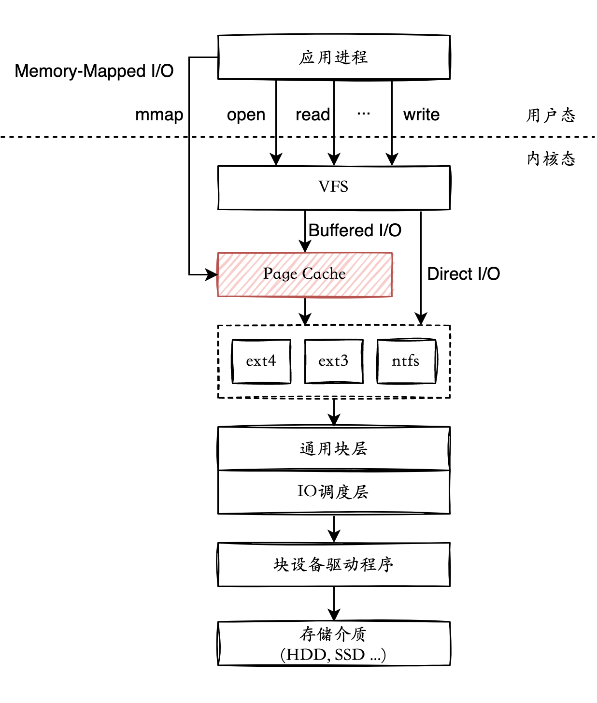
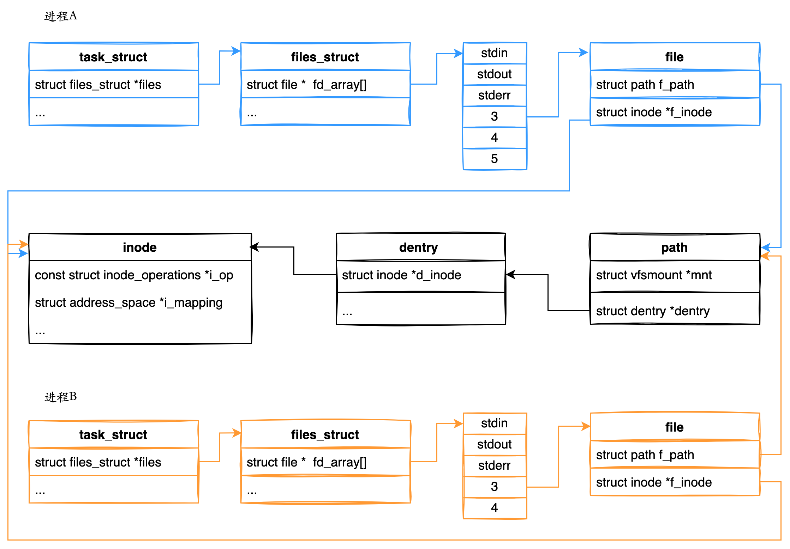
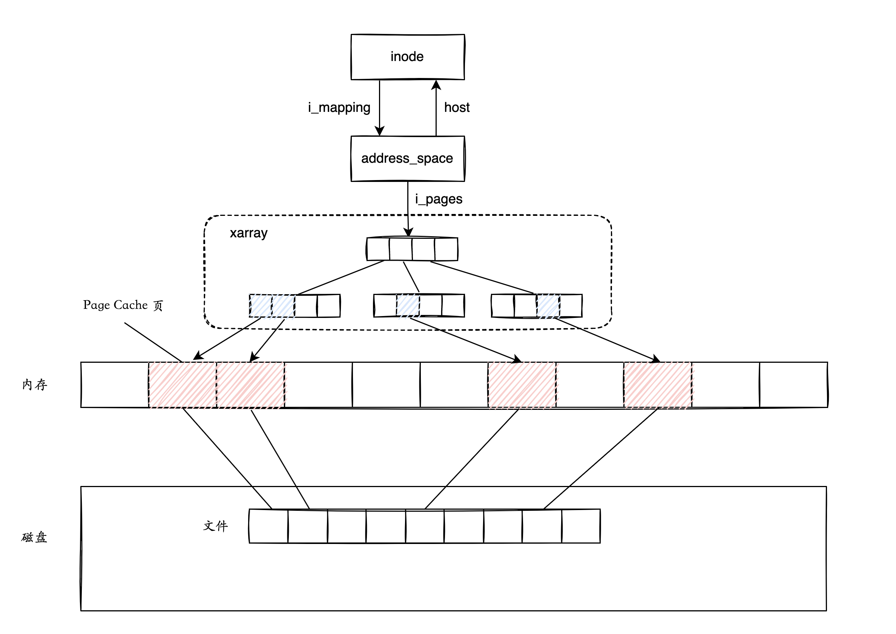
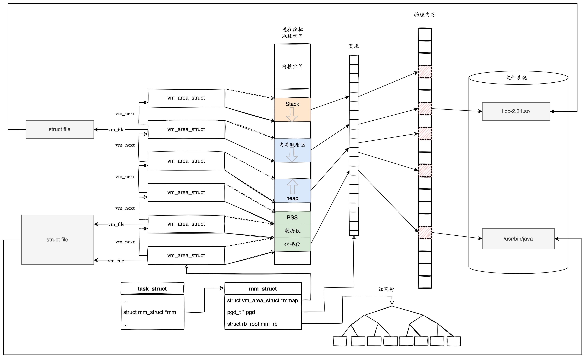
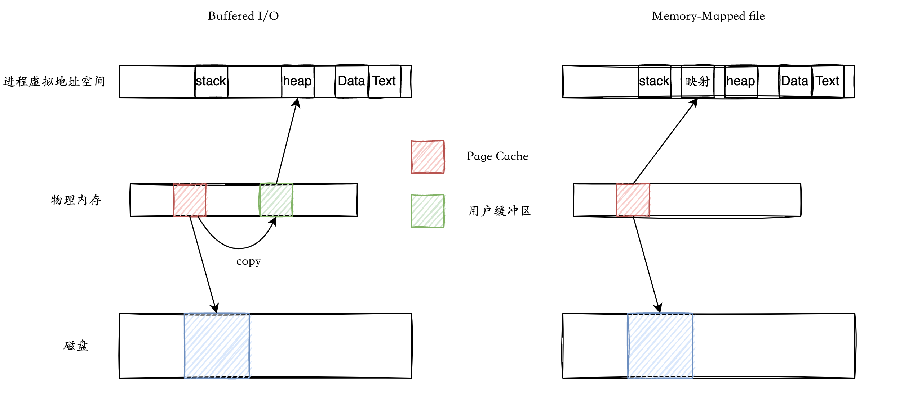

# 一、pagecache
Pagecache（页缓存）是操作系统内核用于缓存磁盘文件数据的一种高速缓存机制。它以内存中的页（通常是 4KB 大小，具体大小取决于操作系统和硬件架构）为单位，存储了从磁盘读取的文件数据或者准备写入磁盘的数据。

<!--more-->    

## 1.1、pagecache位置和作用
<code>Page Cache</code> 是由内核管理的内存，位于 <code>VFS(Virtual File System)</code> 层和具体文件系统层（例如ext4，ext3）之间。应用进程使用 <code>read/write</code> 等文件操作，通过系统调用进入到 <code>VFS</code> 层，根据 <code>O_DIRECT</code> 标志，可以使用 <code>Page Cache</code> 作为文件内容的缓存，也可以跳过 <code>Page Cache</code> 不使用内核提供的缓存功能。


另外，应用程序可以使用 mmap ，将文件内容映射到进程的虚拟地址空间，可以像读写内存一样直接读写硬盘上的文件。进程的虚拟内存直接和 Page Cache 映射。


## 1.2、内核怎么管理Page cache的？
为了了解内核是怎么管理 <code>Page Cache</code> 的，我们先看一下 <code>VFS(Virtual File System)</code> 的几个核心对象：
- **file**：存放已打开的文件信息，是进程访问文件的接口；
- **dentry**：使用 dentry 将文件组织成目录树结构；
- **inode**：唯一标识文件系统中的文件。对于同一个文件，内核中只会有一个 inode 结构。

对于每一个进程，打开的文件都有一个文件描述符，内核中进程数据结构 <code>task_struct</code> 中有一个类型为 <code>files_struct</code> 的 <code>files</code> 字段，保存着该进程打开的所有文件。<code>files_struct</code> 结构的<code>fd_array</code> 字段是 <code>file</code> 数组， 数组的下标是文件描述符，内容指向一个 <code>file</code> 结构，表示该进程打开的文件。<code>file</code> 与打开文件的进程相关联，如果多个进程打开同一个文件，那么每个进程都有自己的  <code>file</code> ，但这些 <code>file</code>  指向同一个 <code>inode</code>。

如上图所示，进程通过文件描述符与 VFS 中的 file 产生联系， 每个 file 对象又与一个 dentry 对应，根据 dentry 能找到 inode，而 inode 则代表文件本身。上图中进程 A 和进程 B 打开了同一个文件，进程 A 和进程 B 都维护着各自的 file ，但它们指向同一个 inode。


inode 通过 address_space 管理着文件已加载到内存中的内容，也就是 Page Cache。address_space 的字段 i_pages 指向一棵 xarray 树，与**这个文件相关的 Page Cache 页都挂在这颗树上**。我们在访问文件内容的时候，根据指定文件和相应的页偏移量，就可以通过 xarray 树快速判断该页是否已经在 Page Cache 中。如果该页存在，说明文件内容已经被读取到了内存，也就是存在于 Page Cache 中；如果该页不存在，就说明内容不在 Page Cache 中，需要从磁盘中去读取。

由于文件和  <code>inode</code> 一一对应，<font color=red>**我们可以认为  inode 是 Page Cache 的宿主（host）**</font>，内核通过 <code>inode->imapping->i_pages</code> 指向的树，管理维护着 <code>Page Cache</code>。

Page Cache 是如何产生和释放，又是如何与进程相关联的呢？我们需要先了解进程虚拟地址空间。

## 1.3、进程虚拟地址空间
进程在 <code>Linux</code> 内核由 <code>task_struct</code> 所描述。 <code>task_struct</code>描述了进程相关的所有信息，包括进程状态，运行时统计信息，进程亲缘关系，进度调度信息，信号处理，进程内存管理，进程打开的文件等等。我们这里关注的进程虚拟内存空间，是由 <code>task_struct</code> 中的 mm 字段指向的 <code>mm_struct</code> 所描述，它是一个进程内存的运行时摘要信息。



## 1.4、Page Cache 的产生和释放
Page Cache 的产生有两种不同的方式：
- Buffered I/O
- Memory-Mapped file


使用这两种方式访问磁盘上的文件时，内核会根据指定的文件和相应的页偏移量，判断文件内容是否已经在 Page Cache 中，如果内容不存在，需要从磁盘中去读取并创建 Page Cache 页。

这两种方式的不同之处在于，使用 Buffered I/O，要先将数据从 Page Cache 拷贝到用户缓冲区，应用才能从用户缓冲区读取数据。而对于 Memory-Mapped file 而言，则是直接将 Page Cache 页映射到进程虚拟地址空间，用户可以直接读写 Page Cache 中的内容。由于少了一次 copy，使用 Memory-Mapped file 要比 Buffered I/O  的效率高一些。


## 1.5、page cache的写入
Page Cache 的插入主要流程如下:
- 判断查找的 Page 是否存在于 Page Cache，存在即直接返回
- 否则通过 Linux 内核物理内存分配介绍的伙伴系统分配一个空闲的 Page.
- 将 Page 插入 Page Cache，即插入address_space的i_pages.
- 调用address_space的readpage()来读取指定 offset 的 Page.

假如 Page Cache 中的 Page 经过了修改，它的 flags 会被置为PG_dirty. 在 Linux 内核中，假如没有打开O_DIRECT标志，写操作实际上会被延迟刷盘，以下几种策略可以将脏页刷盘:
- 手动调用fsync()或者sync强制落盘
- 脏页占用比率过高，超过了设定的阈值，导致内存空间不足，触发刷盘(强制回写).
- 脏页驻留时间过长，触发刷盘(周期回写).


## 1.6、Page Cache 与文件持久化的一致性&可靠性
我们考虑如下一致性问题：如果发生写操作并且对应的数据在 Page Cache 中，那么写操作就会直接作用于 Page Cache 中，此时如果数据还没刷新到磁盘，那么内存中的数据就领先于磁盘，此时对应 page 就被称为 Dirty page。

当前 Linux 下以两种方式实现文件一致性：
- Write Through（写穿）：向用户层提供特定接口，应用程序可主动调用接口来保证文件一致性；
- Write back（写回）：系统中存在定期任务（表现形式为内核线程），周期性地同步文件系统中文件脏数据块，这是默认的 Linux 一致性方案；

上述两种方式最终都依赖于系统调用，主要分为如下三种系统调用：

上述三种系统调用可以分别由用户进程与内核进程发起。


## 1.6、mmap系统调用
系统调用 mmap是最重要的内存管理接口。使用 mmap 可以创建文件映射，从而产生 Page Cache。使用  mmap 还可以用来申请堆内存。glibc 提供的  malloc，内部使用的就是 mmap 系统调用。 由于 mmap 系统调用分配内存的效率比较低，  malloc 会先使用 mmap 向操作系统申请一块比较大的内存，然后再通过各种优化手段让内存分配的效率最大化。

***简单点说：就是在用户进程中创建变量vma和物理内存进行映射，而不需要再将数据从page cache再拷贝至用户进程空间。***


# 二、脏页
在操作系统的页缓存（Pagecache）管理机制中，脏页（Dirty Page）是指那些已经被修改但尚未写回磁盘的内存页。这些页面中的数据与磁盘上对应位置的数据不一致，因为它们在内存中经过了修改操作，如文件写入、数据更新等，并且还没有将新的数据同步到磁盘。

假如 Page Cache 中的 Page 经过了修改，它的 flags 会被置为PG_dirty. 在 Linux 内核中，假如没有打开O_DIRECT标志，写操作实际上会被延迟刷盘，以下几种策略可以将脏页刷盘:
- 手动调用fsync()或者sync强制落盘
- 脏页占用比率过高，超过了设定的阈值，导致内存空间不足，触发刷盘(强制回写).
- 脏页驻留时间过长，触发刷盘(周期回写).


# 三、write()系统调用
- **定义：** write是一个在操作系统层面用于文件写入操作的系统函数。在 C 语言等编程语言中，其典型的函数原型是ssize_t write(int fd, const void *buf, size_t count)。
- **功能：** 它的主要功能是将从buf所指向的缓冲区中的数据写入到由文件描述符fd指定的文件中，写入的字节数为count。例如，在一个简单的文件写入场景中，如果有一个已经打开的文件，我们可以使用write函数将数据存入这个文件。

调用示例：
```dtd
ret = write(fd, buff, 512);
```
Linux无法保证将512字节的buff写入文件这件事是原子的，因为：
- 即便你写了512字节那也只是最大512字节，buff不一定有512字节这么大；
- write操作有可能被信号中途打断，进而使得ret实际上小于512；
- 实现根据不同的系统而不同，且几乎都是分层，作为接口无法确保所有层资源预留。磁盘的缓冲区可能空间不足，导致底层操作失败。


## 3.1、缓存写入过程
- 数据从用户空间的缓冲区（由write函数的buf参数指定）被复制到内核空间的缓存（如 Page Cache）。这个过程涉及到内存管理操作，包括分配缓存页面（如果需要）、更新缓存页面的状态（例如，标记为脏页，表示数据已经修改但尚未写回磁盘）等。
- 对于写入缓存的字节数，它是由write函数的count参数决定的，但实际操作中可能会因为缓存空间限制、内存管理策略等因素而出现部分数据写入缓存的情况。例如，如果缓存空间不足，可能无法一次性将所有请求的数据全部写入缓存，此时write函数可能会返回一个小于count的值，表示实际成功写入缓存的字节数。

当write系统函数被调用时，通常情况下数据首先会被写入缓存，而不是直接写入文件。在现代操作系统的文件 I/O 操作中，为了提高性能，普遍采用了缓存机制。以常见的页缓存（Page Cache）为例，write函数会将数据先复制到内核中的页缓存。


# 四、flush
## 4.1、flush作用范围和层次
flush主要是在应用程序和内核缓冲区之间起作用。它将应用程序自己维护的文件写入缓冲区中的数据，强制写入到内核的缓冲区（如 Page Cache）。

## 4.2、flush数据完整性保证程度
flush只是将数据推进到内核缓冲区，对于数据是否真正写入磁盘以及文件属性是否更新没有提供像fsync那样的强保证。在缓存系统层面的flush（如 Page Cache 脏页写回），虽然有助于数据的持久化，但可能不会像fsync一样关注文件的所有属性更新，数据完整性保证程度相对较弱。

# 五、fsync

## 5.1、fsync作用范围和层次
主要用于将指定文件的所有修改（包括文件内容和文件属性）从内核缓冲区强制同步到磁盘。它会等待所有的磁盘 I/O 操作完成，确保文件在磁盘上的状态与内存中的最新状态完全一致，重点在于数据的持久化存储。

## 5.2、fsync数据完整性保证程度
提供了非常高的数据完整性保证。因为它等待所有与文件相关的磁盘 I/O 操作完成，包括文件数据和文件属性的更新。这使得在fsync操作完成后，文件在磁盘上的状态是完全更新的，能够抵抗系统崩溃、掉电等异常情况，最大程度地保证了文件数据的持久性和一致性。例如，在数据库事务提交时使用fsync，可以确保事务修改的所有数据和日志都存储在磁盘上，防止数据丢失

# 四、read系统调用
调用open函数时，可以指定是以阻塞方式还是以非阻塞方式打开一个文件描述符。

    阻塞方式打开：
    int fd = open("/dev/tty", O_RDWR|O_NONBLOCK);
    非阻塞方式打开：
    int fd = open("/dev/tty", O_RDWR);


**对于网络IO之socket**，默认是阻塞的，即当去read的时候，用户进程会阻塞，由内核去获取数据然后拷贝至用户空间；
设置成非阻塞时，read时候，用户进程立马得到消息（是否有内容），此时用户进程不是阻塞的，那么如果没有获取数据的话，按一般做法肯定是轮训的询问内核数据是否准备好，会加大内核压力；因此，多路复用就出现了....


**对于普通文件IO（IO包下）**，我觉得默认是阻塞的，读一次，就获取多少数据，直到wile循环结束将文件读完...
Java中IO包下的都是bio，代表是open系统调用是采用默认的阻塞方式，此时进程会阻塞，直到内核将数据从磁盘读到page cache，再从page cache读到用户空间


参考文章：
[深入理解page cache](https://cloud.tencent.com/developer/article/2363233?areaId=106001)

[Linux Cache VS. Buffer](https://gohalo.me/post/linux-memory-buffer-vs-cache-details.html)
[Linux内核Page Cache和Buffer Cache关系及演化历史](http://lday.me/2019/09/09/0023_linux_page_cache_and_buffer_cache/)
[文件IO系统调用内幕](https://lrita.github.io/2019/03/13/the-internal-of-file-syscall/)