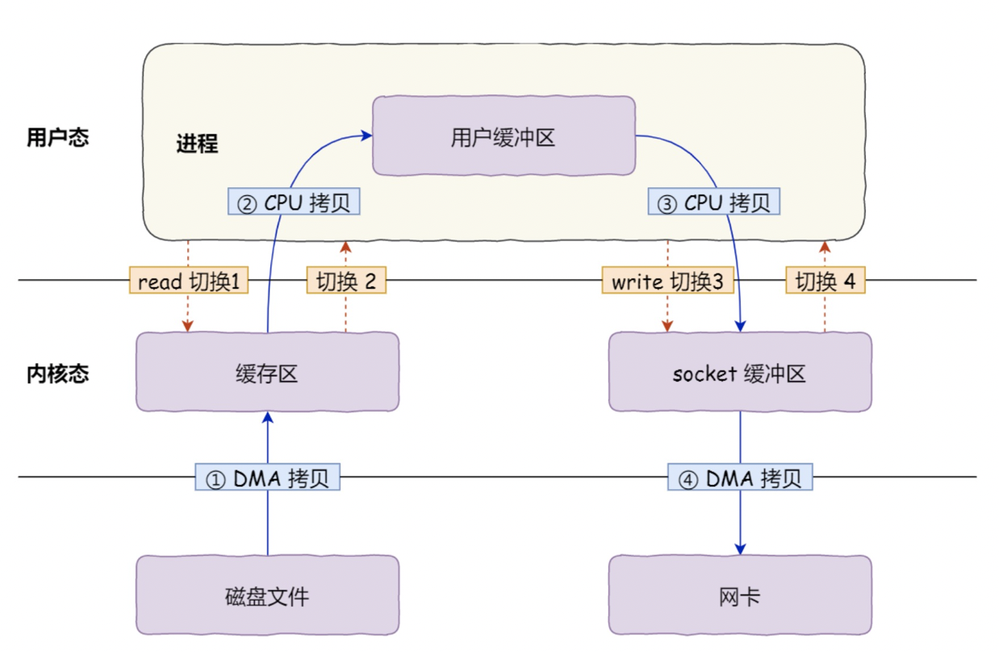
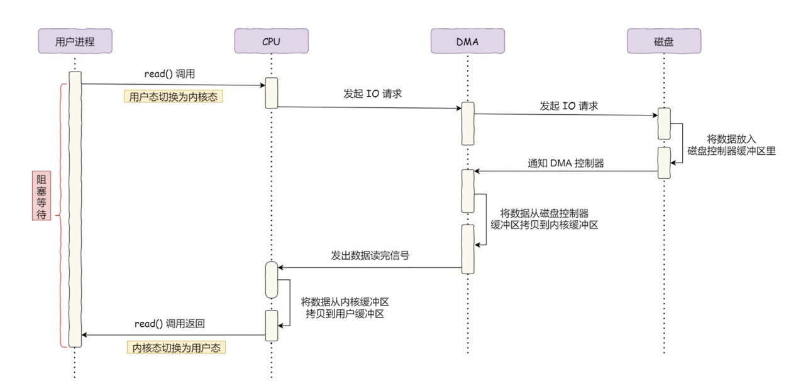
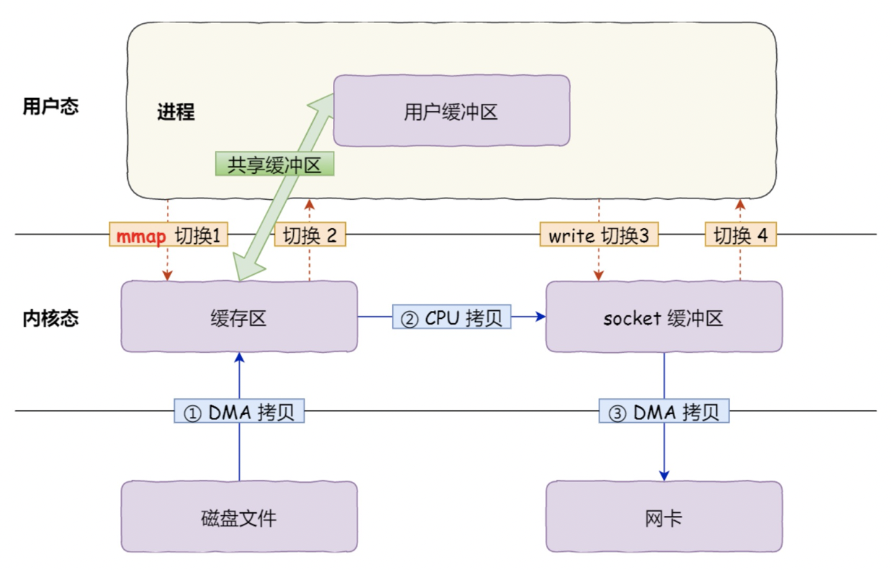
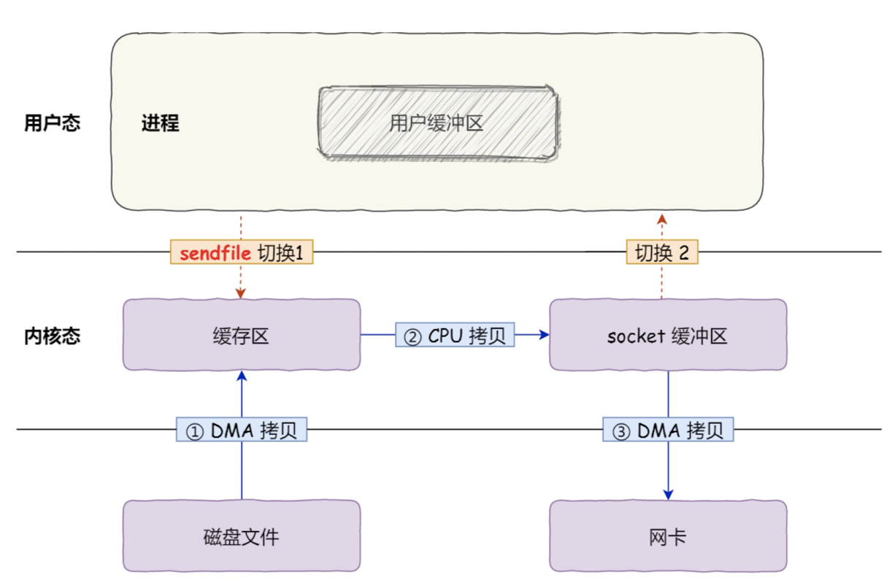
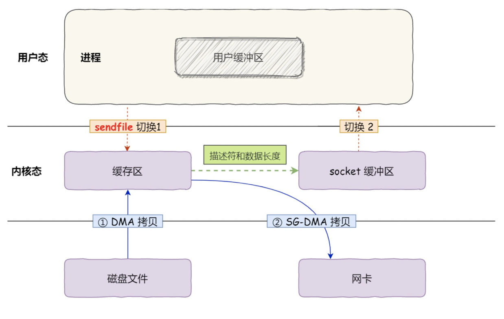
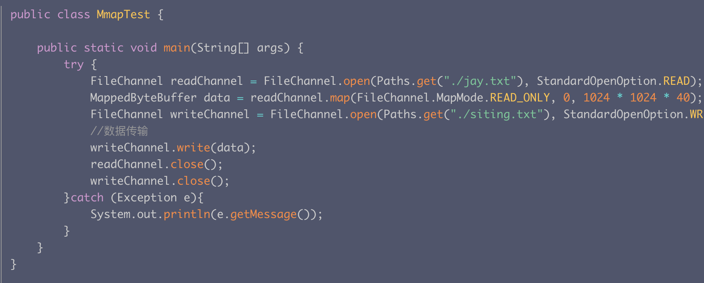
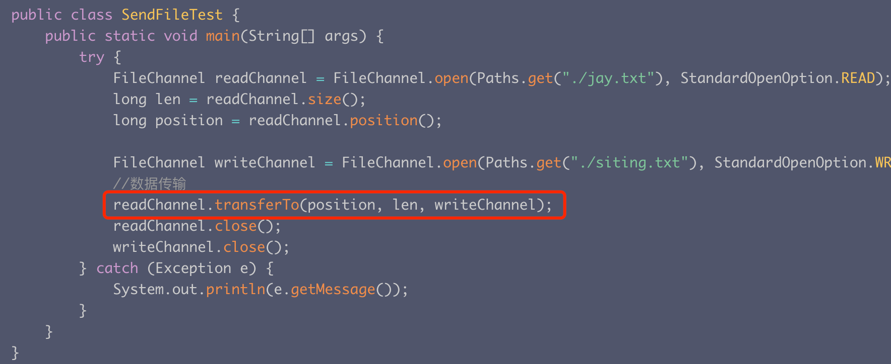

# 一、什么是零拷贝？
<font color=red>**零CPU拷贝**</font>，减少数据的拷贝。

<!--more-->  

# 二、前提知识

## 2.1、Linux进程的虚拟空间
Linux进程的虚拟空间，分成内核空间和用户空间，数据进入进程的过程，是从磁盘拷贝至内核，然后从内核空间拷贝至用户空间。

## 2.2、传统IO
传统的访问方式是通过 <code>write()</code> 和 <code>read()</code> 两个系统调用实现的，通过 read() 函数读取文件到到缓存区中，然后通过 write() 方法把缓存中的数据输出到网络端口。

- 传统的交互数据需要4次copy，并且上下文切换4次
- 内核态 -> 用户态 ：这个过程的数据拷贝是通过CPU拷贝的

### read()
- **请求发起：** 发生一次上下文切换
- **系统调用返回：** 发生第二次上下文切换

### write()
- **请求发起：** 发生一次上下文切换
- **系统调用返回：** 发生第二次上下文切换


## 2.3、DMA拷贝
Direct Memory Access，直接内存操作，专门进行数据传输的硬件。   
### 2.3.1、传统数据的传输：使用CPU，CPU负责数据的拷贝传输。

### 2.3.2、优化数据传输：DMA，专门进行数据传输的硬件

优势：解放CPU


# 三、零拷贝的实现
减少系统调用，减少态的切换。
* mmap + write
* sendfile
* sendfile + DMA

## 3.1、mmap + write
用户空间会和内核空间行程一个映射，这样就不需要将数据从内核态拷贝至用户态，从而减少一次拷贝。    

### 3.1.1、映射原理：
* 就是在用户进程中创建变量vma和物理内存进行映射，而不需要再将数据从page cache再拷贝至用户进程空间

- 4次上下文切换
  - mmap函数进入
  - mmap函数返回
  - write函数进入
  - write函数返回
- 3次数据拷贝
  - 1、磁盘 -> 内核态：DMA拷贝
  - 2、内核态 -> socket缓冲区：CPU拷贝
  - 用户态共享socket缓冲区
  - 3、socket缓冲区 -> 磁盘：DMA拷贝

## 3.2、sendfile
sendfile 系统调用可以将数据从一个文件描述符（通常是磁盘文件）直接传输到另一个文件描述符（通常是网络套接字），避免了数据在用户空间和内核空间之间的多次拷贝

sendfile() 这个系统调用如下：
```
include <sys/socket.h>
ssize_t sendfile(int out_fd, int in_fd, off_t *offset, size_t count);
```
前两个参数分别是目的端和源端的文件描述符，后面两个参数是源端的偏移量和复制数据的长度，返回值是实际复制数据的长度

它可以替代前面的**read()**和**write()**这两个系统调用，这样就可以减少一次系统调用
- 2次上下文切换
- 3次拷贝

## 3.3、sendfile + DMA
sendfile减少内核空间的CPU拷贝，不再通过socket缓冲区，直接从内核空间 -> 硬件设备

- 2次上下文切换
- 2次数据拷贝


总结：<font color=red>**如果你要对数据修改，sendFile就不合适了，而mmap 将磁盘文件映射到内存，支持读和写。**</font>

# 四、Java中的零拷贝
java NIO的零拷贝实现是基于mmap+write方式


## 4.1、Java NIO对mmap的支持
Java NIO有一个MappedByteBuffer的类，可以用来实现内存映射。它的底层是调用了Linux内核的mmap的API

FileChannel的map方法产生的<code>MappedByteBuffer</code>。FileChannel提供了<code>map()</code>方法，该方法可以在一个打开的文件和MappedByteBuffer之间建立一个虚拟内存映射，MappedByteBuffer继承于ByteBuffer；该缓冲器的内存是一个文件的内存映射区域。map方法底层是通过mmap实现的，因此将文件内存从磁盘读取到内核缓冲区后，用户空间和内核空间共享该缓冲区

## 4.2、Java NIO对sendfile的支持

FileChannel的transferTo()/transferFrom()，底层就是sendfile() 系统调用函数。Kafka 这个开源项目就用到它，平时面试的时候，回答面试官为什么这么快，就可以提到零拷贝sendfile这个点


## 4.3、从JMM看堆外内存

直接内存：就是基于mmap+write方式实现的零拷贝
* 永久代主要存放以下数据：
    * JVM internal representation of classes and their metadata
    * Class statics
    * Interned strings
    * 运行时常量池
        
* 从 JDK7 开始，JDK 开发者们就有消灭永久代的打算了。有部分数据移到永久代之外了：
    * Symbols => native memory
    * Interned strings => Java Heap
    * Class statics => Java Heap
    * 运行时常量池，还是存放在方法区内
* 到了 JDK8，这个工作终于完成了，彻底废弃了 PermGen，Metaspace 取而代之。
    * 运行时常量池，也移到了metaspace内

### 1、内存分类 
* 堆内内存： on-heap memory  
    * java虚拟机运行时区域堆内存（HeapByteBuffer）。 
    
* 堆外内存：off-heap memory
    * 除java堆之外的所有其他运行时数据区域，包括程序计数器，java虚拟机栈，本地 方法栈，方法区（元数据区），
    运行时常量池，直接内存（DirectByteBuffer）。

### 2、如何申请直接内存 
1. Unsafe.allocateMemory(long var1) 
2. ByteBuffer.allocateDirect(int capacity) 
3. native方法

### 3、源码解析

* DirectByteBuffer：直接内存对象，还归属JVM管理，在堆中。（冰山对象）
* 构建Cleaner对象用于跟踪DirectByteBuffer对象的垃圾回收，以实现当DirectByteBuffer被垃圾回收时，堆外内存也会被释放

### 4、申请&回收
* 申请
    * 通过C的malloc来进行分配
        * 如果内存不够？Bits.reserveMemory(size, cap) 
        * 首先尝试tryReserveMemory，这个方法会释放已经被JVM回收的DirectByteBuffer对象所引用的堆外内存。
        * 如果内存依旧不够，则会尝试System.gc()，产生full GC
        * 如果上面的操作都失败并且重试9次，则抛出OOM异常

* 回收
    * Cleaner是PhantomReference的子类，并通过自身的next和prev字段维护的一个双向链表。
    * PhantomReference的作用在于跟踪垃圾回收过程，并不会对对象的垃圾回收过程造成任何的影响。
    * 所以cleaner = Cleaner.create(this, new Deallocator(base, size, cap)); 用于对当前构造的DirectByteBuffer对象的垃圾回收过程进行跟踪。
    * 当DirectByteBuffer对象从pending状态 ——> enqueue状态时，会触发Cleaner的clean()，而Cleaner的clean()的方法会实现通过unsafe对堆外内存的释放。


[参考](https://www.jianshu.com/p/007052ee3773)