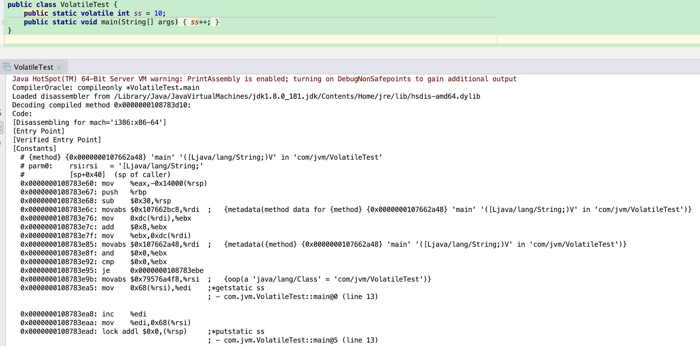

# 一、volatile
1. 保证变量可见性。
2. 禁止指令重排序。

# 二、如何实现
从三个层面解析。   
1. 字节码层面
2. JVM层面
3. CPU层面（汇编语言）

<!--more-->  

## 2.1、字节码层面


使用volatile关键字修饰的实例变量，会使用ACC_VOLATILE修饰。

## 2.2、JVM层面
c/c++中的volatile关键字，用来修饰变量，通常用于语言级别的 memory barrier。  
volatile是一种类型修饰符，被volatile声明的变量表示随时可能发生变化，每次使用时，都必须从变量i对应的内存地址读取，编译器对操作该变量的代码不再进行优化


## 2.3、汇编语言层面


idea：查看汇编指令代码，在执行的VM参数中添加以下值：
```
-server -Xcomp -XX:+UnlockDiagnosticVMOptions -XX:+PrintAssembly -XX:CompileCommand=compileonly,*VolatileTest.main
```

生成lock指令，lock指令会锁住总线，阻止其他CPU通过总线访问内存。

[volatile实现内存可见性分析：字节码版本](https://blog.csdn.net/m15517986455/article/details/83273723)

volatile会添加编译器屏障，防止编译器优化导致的指令重排

# 三、总结
通过内存屏障，实现禁止指令重排序和内存可见功能。