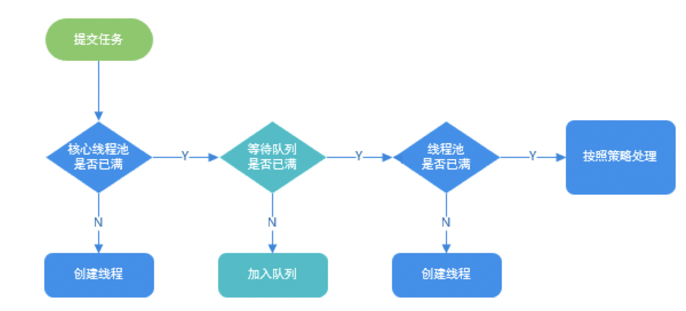
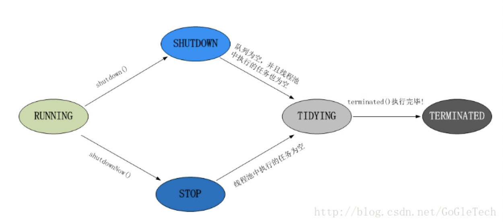
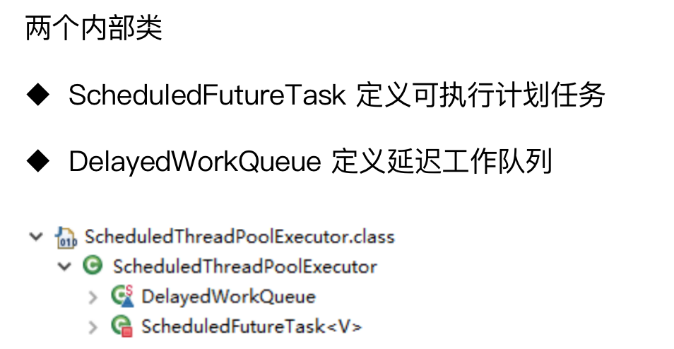
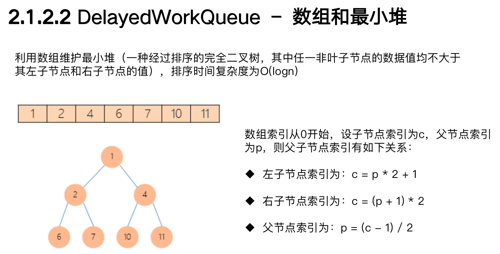

* 面试问题1：Java的线程池说一下，各个参数的作用，如何进行的?
* 面试问题2：按线程池内部机制，当提交新任务时，有哪些异常要考虑。
* 面试问题3：线程池都有哪几种工作队列？
* 面试问题4：使用无界队列的线程池会导致内存飙升吗？
* 面试问题5：说说几种常见的线程池及使用场景?

# 一、常见的创建线程池方式有以下几种：
1. Executors.newCachedThreadPool()：无限线程池。
2. Executors.newFixedThreadPool(nThreads)：创建固定大小的线程池。
3. Executors.newSingleThreadExecutor()：创建单个线程的线程池。

<!--more-->  

# 二、具体实现
```
public static ExecutorService newCachedThreadPool() {
    return new ThreadPoolExecutor(0, Integer.MAX_VALUE,
                                  60L, TimeUnit.SECONDS,
                                  new SynchronousQueue<Runnable>());
}
```
底层实现，都是采用了ThreadPoolExecutor对象进行线程池的实例化。

```
ThreadPoolExecutor(
    int corePoolSize, 
    int maximumPoolSize, 
    long keepAliveTime, 
    TimeUnit unit, 
    BlockingQueue<Runnable> workQueue, 
    RejectedExecutionHandler handler) 
```

这几个核心参数的作用：
* corePoolSize 为线程池的基本大小。
* maximumPoolSize 为线程池最大线程大小。
* keepAliveTime 和 unit 则是线程空闲后的存活时间。
* workQueue 用于存放任务的阻塞队列。
* handler 当队列和最大线程池都满了之后的饱和策略。


# 三、线程池执行流程


# 四、四种拒绝策略

1. AbortPolicy(抛出一个异常，默认的)
2. DiscardPolicy(直接丢弃任务)
3. DiscardOldestPolicy（丢弃队列里最老的任务，将当前这个任务继续提交给线程池）
4. CallerRunsPolicy（交给调用线程池的线程进行处理)


# 五、线程池的工作队列

* ArrayBlockingQueue：（有界队列）用数组实现的有界阻塞队列，按FIFO排序量。
* LinkedBlockingQueue：（可设置容量队列）基于链表结构的阻塞队列，按FIFO排序量，不设置容量则是无界的，吞吐量大于ArrayBlockingQueue
* DelayQueue：（延迟队列）
* PriorityBlockingQueue：（优先级队列）（小根堆）
* SynchronousQueue：（同步队列）
    * 内部使用CAS操作：特别之处在于它内部没有容器，一个生产线程，当它生产产品（即put的时候），如果当前没有人想要消费产品(即当前没有线程执行take)，此生产线程必须阻塞，等待一个消费线程调用take操作，take操作将会唤醒该生产线程，同时消费线程会获取生产线程的产品（即数据传递），这样的一个过程称为一次配对过程(当然也可以先take后put,原理是一样的)

# 六、几种常见的线程池
* newFixedThreadPool (固定数目线程的线程池)：采用无界队列，可能导致内存飙升及OOM，适用于执行长期的任务
* newCachedThreadPool(可缓存线程的线程池)
* newSingleThreadExecutor(单线程的线程池)
* newScheduledThreadPool(定时及周期执行的线程池)

```
newFixedThreadPool
public static ExecutorService newFixedThreadPool(int nThreads, ThreadFactory threadFactory) { 
    return new ThreadPoolExecutor(nThreads, 
                                    nThreads, 
                                    0L, 
                                    TimeUnit.MILLISECONDS, 
                                    new LinkedBlockingQueue<Runnable>(), threadFactory); 
}
```
1、采用无界队列，任务的执行时间比较长(比如设置了10秒)，会导致队列的任务越积越多，
    导致机器内存使用不停飙升， 最终导致OOM。

```
newCachedThreadPool
public static ExecutorService newCachedThreadPool(ThreadFactory threadFactory) { 
    return new ThreadPoolExecutor(0, 
                                Integer.MAX_VALUE, 
                                60L, 
                                TimeUnit.SECONDS, 
                                new SynchronousQueue<Runnable>(), 
                                threadFactory); 
}
```
1、线程个数无界

```
newSingleThreadExecutor
public static ExecutorService newSingleThreadExecutor(ThreadFactory threadFactory) { return new FinalizableDelegatedExecutorService (
    new ThreadPoolExecutor(1, 
                            1, 
                            0L, 
                            TimeUnit.MILLISECONDS, 
                            new LinkedBlockingQueue<Runnable>(), 
                            threadFactory)); 
}
```
1、核心线程数=1
2、最大线程数=1
3、适用于串行执行任务的场景，一个任务一个任务地执行

```
newScheduledThreadPool
public ScheduledThreadPoolExecutor(int corePoolSize) { 
    super(corePoolSize, Integer.MAX_VALUE, 0, NANOSECONDS, new DelayedWorkQueue()); 
}
```

# 七、线程池状态

1. RUNNING：运行状态，能够接收新任务，并处理已添加的任务。
2. SHUTDOWN：不接收新任务，但是已有任务继续执行。
3. STOP：不接收新任务，不处理已添加的任务，并会中断正在执行的任务。
4. TIDYING：最终做到队列中的任务为空。
5. TERMINATED：终止状态。

# 八、execute()和submit()方法的区别
1. execute()：提交不需要返回结果的任务。
2. submit()：提交需要返回结果的任务。


# 九、细讲ScheduledThreadPoolExecutor使用与实现

## 9.1、实际开发当中，经常会遇到计划任务类的需求：
* 订单15分钟内未支付自动关闭
* 每隔1个小时对前1小时内的支付账单做对账检查
* 每日凌晨2点对前一日的订单数据汇总处理

## 9.2、提供4个调度方法：
* schedule(Runnable command, long delay, TimeUnit unit)
    * 延迟特定时间后执行指定任务，无返回结果 
* schedule(Callable<V> callable, long delay, TimeUnit unit)
    * 延迟特定时间后执行指定任务，有返回结果
* scheduleAtFixedRate(Runnable command, long initialDelay, long period, TimeUnit unit)
    * 延迟初始时间后执行指定任务，之后周期性执行指定任务
* scheduleWithFixedDelay(Runnable command, long initialDelay, long delay, TimeUnit unit)
    * 延迟初始时间后执行指定任务，之后按固定时间间隔执行任务


## 9.3、数据结构


DelayedWorkQueue结构


# 10、线程池的动态扩容
1. TheadPoolExecute.setCorePoolSize(newSize)
    1. 若新值 > 旧值，则会创建线程去消费队列
    2. 若新值 < 旧值，则会在线程执行完成空闲(idle)时，进行线程回收