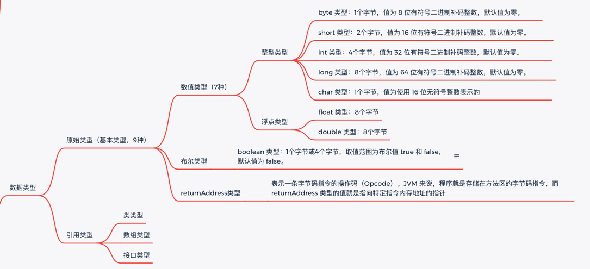
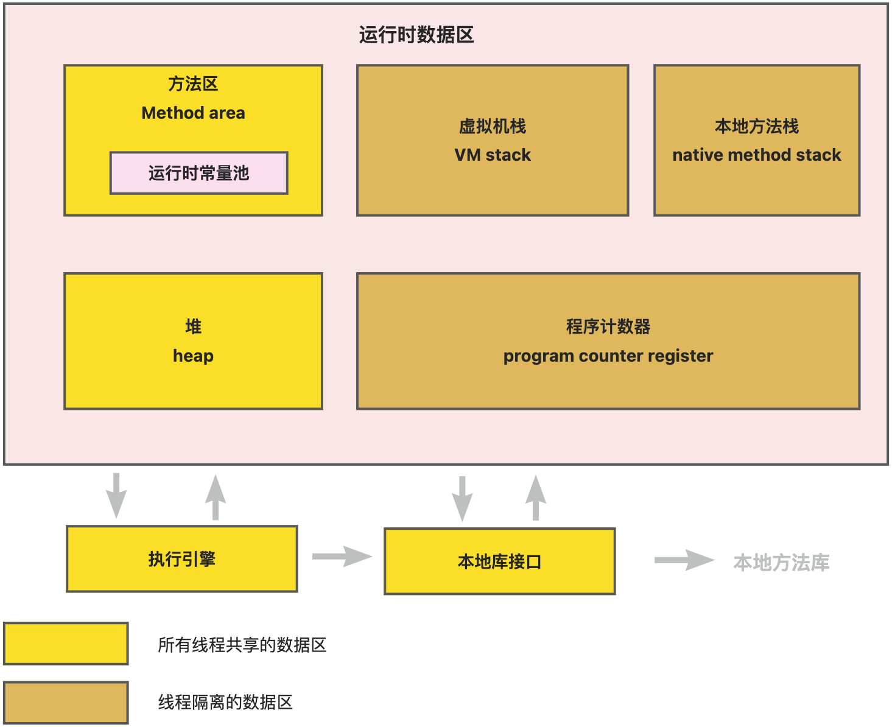
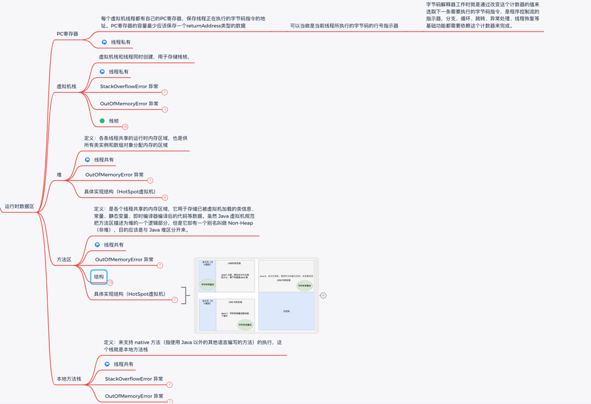

	这是Java虚拟机规范系列的第二篇文章，主要介绍的是虚拟机规范中的虚拟机结构，包含数据类型、运行时数据区、字节码指令集等内容。


### 0 Java虚拟机结构 纲领
Java虚拟机规范中的虚拟机结构相关章节细节如下：

<style>
.highlight.plain {
    height:400px;
}
</style>
```
2.1 Class 文件格式 .................................................21
2.2 数据类型 ......................................................22
2.3 原始类型与值 ...................................................22
2.3.1 整型类型与整型值 ..........................................23
2.3.2 浮点类型、取值集合及浮点值 ..................................24
2.3.3 returnAddress 类型和值 ...................................26
2.3.4 boolean 类型 .............................................26
2.4 引用类型与值 ...................................................27
2.5 运行时数据区 ...................................................27
2.5.1 PC 寄存器 ................................................28
2.5.2 Java 虚拟机栈 ............................................28
2.5.3 Java 堆 .................................................29
2.5.4 方法区...................................................29
2.5.5 运行时常量池..............................................30
2.5.6 本地方法栈 ...............................................30
2.6 栈帧..........................................................31
2.6.1 局部变量表 ...............................................32
2.6.2 操作数栈 .................................................33
2.6.3 动态链接 .................................................34
2.6.4 方法正常调用完成 ..........................................34
2.6.5 方法异常调用完成 ..........................................34
2.7 对象的表示.....................................................35
2.8 浮点算法 ......................................................35
2.8.1 Java 虚拟机和 IEEE 754 中的浮点算法..........................35
2.8.2 浮点模式 .................................................36
2.8.3 数值集合转换..............................................37
2.9 初始化方法的特殊命名 ............................................38
2.10 异常.........................................................38
2.11 字节码指令集简介...............................................40
2.11.1 数据类型与 Java 虚拟机.....................................41
2.11.2 加载和存储指令 ...........................................44
2.11.3 运算指令 ................................................45
2.11.4 类型转换指令.............................................46
2.11.5 对象创建与操作 ...........................................47
2.11.6 操作数栈管理指令 .........................................48
2.11.7 控制转移指令.............................................48
2.11.8 方法调用和返回指令........................................49
2.11.9 抛出异常 ................................................49
2.11.10 同步 ..................................................49
2.12 类库.........................................................50
2.13 公有设计，私有实现 .............................................51
```

### 1. 数据类型
Java虚拟机可以操作的数据类型可以分为2类：
- 原始类型：也称为“基本类型”，与之对应的数据值叫做“原始值”。
- 引用类型：与之对应的数据值叫做“引用值”。




### 2. 运行时数据区

Java 虚拟机规范定义了若干种程序运行期间会使用到的运行时数据区，其中有一些会随着虚拟机启动而创建，随着虚拟机退出而销毁。另外一些则是与线程一一对应的，这些与线程对应的数据区域会随着线程开始和结束而创建和销毁。
- PC寄存器
- Java虚拟机栈
- Java堆
- 方法区
- 运行时常量池
- 本地方法栈
  

#### 2.1 PC寄存器
Java 虚拟机可以支持多条线程同时执行（可参考《Java 语言规范》第 17 章），每一条 Java虚拟机线程都有自己的 PC（Program Counter）寄存器。在任意时刻，一条 Java 虚拟机线程只会执行一个方法的代码，这个正在被线程执行的方法称为该线程的当前方法（CurrentMethod，§2.6）。如果这个方法不是 native 的，那 PC 寄存器就保存 Java 虚拟机正在执行的字节码指令的地址，如果该方法是 native 的，那 PC 寄存器的值是 undefined。PC 寄存器的容量至少应当能保存一个 returnAddress 类型的数据或者一个与平台相关的本地指针的值。


#### 2.2 Java虚拟机栈
每一条 Java 虚拟机线程都有自己私有的 Java 虚拟机栈（Java Virtual Machine Stack） ，这个栈与线程同时创建，用于存储栈帧（Frames）。

##### 2.2.1 栈桢
###### 定义和作用
栈帧（Frame）是用来存储数据和部分过程结果的数据结构，同时也被用来处理动态链接（Dynamic Linking）、方法返回值和异常分派（Dispatch Exception）。

###### 创建&销毁
随着方法调用而创建，随着方法结束而销毁（正常结束或异常结束）。

每一个方法被调用直至执行完成的过程，就对应着一个栈桢在虚拟机栈中从入栈到出栈的过程。

###### 结构
- 局部变量表
- 操作数栈
- 指向当前方法所属类的运行时常量池

每一个栈帧都有自己的局部变量表（Local Variables，§2.6.1）、操作数栈（Operand Stack，§2.6.2）和指向当前方法所属的类的运行时常量池（§2.5.5）的引用。


**<font style="color:gray">1:局部变量表：</font>**  
- 容量：是在编译期确定
- 一个局部变量：可存储boolean、byte、char、short、float、reference和 returnAddress 的数据，
  - 存储空间：以局部变量槽（slot）来表示【其中64位长度的long和double类型的数据会占用两个变量槽，其余的数据类型只占用一个。】

**<font style="color:gray">2:操作数栈：</font>**
- 容量：是在编译期确定
- 与“局部变量表”的交互：
  - 获取数据：iload、lload.... 将局部变量加载到操作数栈
  - 存储数据：istore、lstore.... 将数据存储到局部变量表
> iadd是 Java 虚拟机字节码指令集中的一条指令，用于执行整数加法操作。它会从操作数栈中弹出两个整数，将这两个整数相加，然后把结果压回操作数栈。这种栈式的操作方式是 Java 虚拟机执行字节码指令的典型特征。例如，假设有一个简单的 Java 代码片段int a = 3; int b = 4; int c = a + b;，在字节码层面，当计算a + b时，就会使用iadd指令。


**<font style="color:gray">3:指向当前方法所属类的运行时常量池：也称做“动态链接”</font>**      
- 定义：含一个指向运行时常量池（§2.5.5）的引用
- 作用：将符号引用所表示的方法转换为实际方法的直接引用。【在 Class 文件里面，描述一个方法调用了其他方法，或者访问其成员变量是通过符号引用（Symbolic Reference）来表示的】
- 

在一条线程之中，只有目前正在执行的那个方法的栈帧是活动的。这个栈帧就被称为是当前栈帧（Current Frame），这个栈帧对应的方法就被称为是当前方法（Current Method），定义这个方法的类就称作当前类（Current Class）。


#### 2.3. 堆
在 Java 虚拟机中，堆（Heap）是可供各条线程共享的运行时内存区域，也是供所有类实例和数组对象分配内存的区域。

Java 堆在虚拟机启动的时候就被创建，它存储了被自动内存管理系统（Automatic StorageManagement System，也即是常说的“Garbage Collector（垃圾收集器）”）所管理的各种对象，这些受管理的对象无需，也无法显式地被销毁。

本规范中所描述的 Java 虚拟机并未假设采用什么具体的技术去实现自动内存管理系统。虚拟机实现者可以根据系统的实际需要来选择自动内存管理技术。Java 堆的容量可以是固定大小的，也可以随着程序执行的需求动态扩展，并在不需要过多空间时自动收缩。Java 堆所使用的内存不需要保证是连续的。

Java 堆可能发生如下异常情况： 
- 如果实际所需的堆超过了自动内存管理系统能提供的最大容量，那 Java 虚拟机将会抛出一个OutOfMemoryError 异常。

#### 2.4. 方法区
在 Java 虚拟机中，方法区（Method Area）是可供各条线程共享的运行时内存区域。

方法区与传统语言中的编译代码储存区（Storage Area Of Compiled Code）或者操作系统进程的正文段（Text Segment）的作用非常类似，它存储了每一个类的结构信息，例如运行时常量池（Runtime Constant Pool）、字段和方法数据、构造函数和普通方法的字节码内容、还包括一些在类、实例、接口初始化时用到的特殊方法（§2.9）。
- 存储每一个类的结构信息
  - 运行时常量池
  - 字段
  - 方法数据
  - 构造函数
  - 普通方法的字节码内容
  - 还包括一些在类、实例、接口初始化时用到的特殊方法
    - <font color=#e98787>**实例初始化方法<init\>：** </font> 在 Java 虚拟机层面上，Java 语言中的构造函数在《Java 语言规范 （第三版）》（下文简称JLS3）是以一个名为<init>的特殊实例初始化方法的形式出现的，<init>这个方法名称是由编译器命名的，因为它并非一个合法的 Java 方法名字，不可能通过程序编码的方式实现。实例初始化方法只能在实例的初始化期间，通过 Java 虚拟机的 invokespecial 指令来调用，只有在实例正在构造的时候，实例初始化方法才可以被调用访问
    - <font color=#e98787>**类初始化方法<clinit\>：**</font>  一个类或者接口最多可以包含不超过一个类或接口的初始化方法，类或者接口就是通过这个方法完成初始化的。这个方法是一个不包含参数的静态方法，名为<clinit>。这个名字也是由编译器命名的，因为它并非一个合法的 Java 方法名字，不可能通过程序编码的方式实现。
      - 类或接口的初始化方法由 Java 虚拟机自身隐式调用，没有任何虚拟机字节码指令可以调用这个方法，只有在类的初始化阶段中会被虚拟机自身调用。

#### 2.5. 本地方法栈
Java 虚拟机实现可能会使用到传统的栈（通常称之为“C Stacks”）来支持 native 方法（指使用 Java 以外的其他语言编写的方法）的执行，这个栈就是本地方法栈（Native Method Stack）。当 Java 虚拟机使用其他语言（例如 C 语言）来实现指令集解释器时，也会使用到本地方法栈。

本地方法栈可能发生如下异常情况：
- 如果线程请求分配的栈容量超过本地方法栈允许的最大容量时，Java 虚拟机将会抛出一个StackOverflowError 异常。
- 如果本地方法栈可以动态扩展，并且扩展的动作已经尝试过，但是目前无法申请到足够的内存去完成扩展，或者在建立新的线程时没有足够的内存去创建对应的本地方法栈，那 Java 虚拟机将会抛出一个 OutOfMemoryError 异常。

#### 2.6、运行时常量池
运行时常量池（Runtime Constant Pool）是每一个类或接口的常量池（Constant_Pool）的运行时表示形式，它包括了若干种不同的常量：从编译期可知的数值字面量到必须运行期解析后才能获得的方法或字段引用。运行时常量池扮演了类似传统语言中符号表（Symbol Table）的角色，不过它存储数据范围比通常意义上的符号表要更为广泛。

**每一个运行时常量池都分配在<font color=red> Java 虚拟机的方法区</font>之中**，在类和接口被加载到虚拟机后，对应的运行时常量池就被创建出来。

在创建类和接口的运行时常量池时，可能会发生如下异常情况：
- 当创建类或接口的时候，如果构造运行时常量池所需要的内存空间超过了方法区所能提供的最大值，那 Java 虚拟机将会抛出一个 OutOfMemoryError 异常。
关于构造运行时常量池的详细信息，可以参考“加载、链接和初始化”的内容。

**总结：**


### 3. 对象的表示
Java 虚拟机规范不强制规定对象的内部结构应当如何表示①。
> 在一些 Oracle 的 Java 虚拟机实现中，指向对象实例的引用是一个指向句柄的指针，这个句柄包含两部分
信心，一部分是指向这个对象所包括的方法表以及指向这个对象所属类相关的信息；另一部分是指向在堆中分配的
对象实例数据。（译者注：这条注释在 10 多年前出版的 Java 虚拟机规范第二版中就已经存在，第三版中仅仅是将
Sun 修改为 Oracle 而已，所表达的实际信息已比较陈旧。在 HotSpot 虚拟机中，指向对象的引用并不通过句柄，
而是直接指向堆中对象的实例数据，因此 HotSpot 虚拟机并不包括在上面所描述的“一些 Oracle 的 Java 虚拟
机实现”范围之内）

### 4. 字节码指令集
Java 虚拟机的指令由一个字节长度的、代表着某种特定操作含义的操作码（Opcode）以及跟随其后的零至多个代表此操作所需参数的操作数（Operands）所构成。

数据类型与Java虚拟机
iload 指令用于从局部变量表中加载 int 型的数据到操作数栈中，而 fload 指令加载的则是float 类型的数据

##### 加载和存储指令
加载和存储指令用于将数据从栈帧 的局部变量表 和操作数栈之间来回传输
- 将一个局部变量加载到操作栈的指令包括有：iload、iload_<n>、lload、lload_<n>、fload、fload_<n>、dload、dload_<n>、aload、aload_<n>
- 将一个数值从操作数栈存储到局部变量表的指令包括有：istore、istore_<n>、lstore、lstore_<n>、fstore、fstore_<n>、dstore、dstore_<n>、astore、astore_<n>
- 将一个常量加载到操作数栈的指令包括有：bipush、sipush、ldc、ldc_w、ldc2_w、aconst_null、iconst_m1、iconst_<i>、lconst_<l>、fconst_<f>、dconst_<d>
- 扩充局部变量表的访问索引的指令：wide


##### 运算指令
算术指令用于对两个操作数栈上的值进行某种特定运算，并把结果重新存入到操作栈顶
- 加法指令：iadd、ladd、fadd、dadd
- 减法指令：isub、lsub、fsub、dsub
- 乘法指令：imul、lmul、fmul、dmul
- 除法指令：idiv、ldiv、fdiv、ddiv
- 求余指令：irem、lrem、frem、drem
- 取反指令：ineg、lneg、fneg、dneg
- 位移指令：ishl、ishr、iushr、lshl、lshr、lushr
- 按位或指令：ior、lor
- 按位与指令：iand、land
- 按位异或指令：ixor、lxor
- 局部变量自增指令：iinc
- 比较指令：dcmpg、dcmpl、fcmpg、fcmpl、lcmp

##### 类型转换指令
类型转换指令可以将两种 Java 虚拟机数值类型进行相互转换，这些转换操作一般用于实现用户代码的显式类型转换操作，或者用来处理 Java 虚拟机字节码指令集中指令非完全独立独立的问题
- int 类型到 long、float 或者 double 类型
- long 类型到 float、double 类型
- float 类型到 double 类型

窄化类型转换（Narrowing Numeric Conversions）指令包括有：i2b、i2c、i2s、l2i、f2i、f2l、d2i、d2l 和 d2f。窄化类型转换可能会导致转换结果产生不同的正负号、不同的数量级，转换过程很可能会导致数值丢失精度。


##### 对象创建与操作
虽然类实例和数组都是对象，但 Java 虚拟机对类实例和数组的创建与操作使用了不同的字节码指令：
- 创建类实例的指令：new
- 创建数组的指令：newarray，anewarray，multianewarray
- 访问类字段（static 字段，或者称为类变量）和实例字段（非 static 字段，或者成为实例变量）的指令：getfield、putfield、getstatic、putstatic
- 把一个数组元素加载到操作数栈的指令：baload、caload、saload、iaload、laload、faload、daload、aaload
- 将一个操作数栈的值储存到数组元素中的指令：bastore、castore、sastore、iastore、fastore、dastore、aastore
- 取数组长度的指令：arraylength
- 检查类实例类型的指令：instanceof、checkcast


##### 操作数栈管理指令
Java 虚拟机提供了一些用于直接操作操作数栈的指令，包括：pop、pop2、dup、dup2、dup_x1、dup2_x1、dup_x2、dup2_x2 和 swap。


##### 方法调用和返回指令
以下四条指令用于方法调用：
- invokevirtual： 指令用于调用对象的实例方法，根据对象的实际类型进行分派（虚方法分派），这也是 Java 语言中最常见的方法分派方式。
- invokeinterface： 指令用于调用接口方法，它会在运行时搜索一个实现了这个接口方法的对象，找出适合的方法进行调用。
- invokespecial： 指令用于调用一些需要特殊处理的实例方法，包括实例初始化方法（§2.9）、私有方法和父类方法。
- invokestatic： 指令用于调用类方法（static 方法）


### 5. 同步
Java 虚拟机可以支持方法级的同步和方法内部一段指令序列的同步，这两种同步结构都是使用管程（Monitor）来支持的。

同步一段指令集序列通常是由 Java 语言中的 synchronized 块来表示的，Java 虚拟机的指令集中有 monitorenter 和 monitorexit 两条指令来支持 synchronized 关键字的语义，正确实现 synchronized 关键字需要编译器与 Java 虚拟机两者协作支持