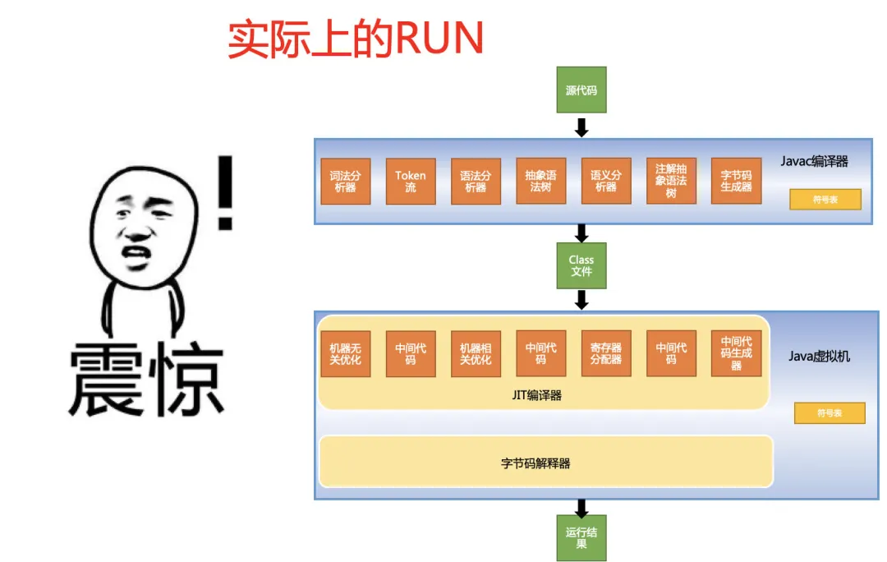

	这是Java虚拟机规范系列的第四篇文章，主要介绍的是虚拟机规范中的class文件格式。

### 一、class文件
每一个 Class 文件都对应着唯一一个类或接口的定义信息，但是相对地，类或接口并不一定都得定义在文件里（譬如类或接口也可以通过类加载器直接生成）。

<!-- more -->


#### 1.1、ClassFile 结构

```
ClassFile {
 u4 magic;  魔数，4 字节，魔数的唯一作用是确定这个文件是否为一个能被虚拟机所接受的 Class 文件。魔数值固定为 0xCAFEBABE，不会改变。
 u2 minor_version;  副版本号，2字节
 u2 major_version;  主版本号，2字节
 u2 constant_pool_count;  常量池计数器，constant_pool_count 的值等于 constant_pool 表中的成员数加 1。
 cp_info constant_pool[constant_pool_count-1];  常量池，constant_pool 是一种表结构（§4.4），它包含 Class 文件结构及其子结构中引用的所有字符串常量、类或接口名、字段名和其它常量。
 u2 access_flags;  访问标志，access_flags 是一种掩码标志，用于表示某个类或者接口的访问权限及基础属性。
 u2 this_class;    类索引，this_class 的值必须是对 constant_pool 表中项目的一个有效索引值。
 u2 super_class;   父类索引，对于类来说，super_class 的值必须为 0 或者是对 constant_pool 表中项目的一个有效索引值。
 u2 interfaces_count; 接口计数器，interfaces_count 的值表示当前类或接口的直接父接口数量。
 u2 interfaces[interfaces_count]; 接口表，interfaces[]数组中的每个成员的值必须是一个对 constant_pool 表中项目的一个有效索引值，它的长度为 interfaces_count。
 u2 fields_count; 字段计数器，fields_count 的值表示当前 Class 文件 fields[]数组的成员个数
 field_info fields[fields_count]; 字段表，fields[]数组中的每个成员都必须是一个 fields_info 结构（§4.5）的数据项，用于表示当前类或接口中某个字段的完整描述
 u2 methods_count;  方法计数器，methods_count 的值表示当前 Class 文件 methods[]数组的成员个数。
 method_info methods[methods_count];
 u2 attributes_count; 属性计数器，attributes_count 的值表示当前 Class 文件 attributes 表的成员个数。
 attribute_info attributes[attributes_count];
}
```




#### 1.2、各种内部表示名称

##### 全限定名称：类和接口的二进制名称
在 Class 文件结构中出现的**类或接口的名称，都通过全限定形式**（Fully Qualified Form）来表示，这被称作它们的“二进制名称”（JLS §13.1）。这个名称使用 CONSTANT_Utf8_info（§4.4.7）结构来表示，因此如果忽略其他一些约束限制的话，这个名称可能来自整个 Unitcode字符空间的任意字符组成。

> 譬如，类 Thread 的正常的二进制名是 java.lang.Thread。在 Class 文件的内部表示形式里面，对类 java.lang.Thrad 的引用是通过来一个代表字符串“java/lang/Thread”的CONSTANT_Utf8_info 结构来实现的。

##### 非全限定名称
方法名，字段名和局部变量名都被使用非全限定名（Unqualified Names）进行存储。非全限定名中不能包含 ASCII 字符"."、";"、"["和"/"（也不能包含他们的 Unitcode 表示形式，既类似"\u2E"这种形式）。


#### 1.3、描述符和签名
1. **描述符（Descriptor）** 是一个描述字段或方法的类型的字符串；
2. **签名（Signature）** 是用于描述字段、方法和类型定义中的泛型信息的字符串

##### 1.3.1、语法符号
描述符和签名都是用特定的语法符号（Grammar）来表示，这些语法是一组可表达如何根据不同的类型去产生可恰当描述它们的字符序列的标识集合。


##### 1.3.2、字段描述符
字段描述符（Field Descriptor），是一个表示类、实例或局部变量的语法符号，它是由语法产生的字符序列：
```dtd
FieldDescriptor:
    FieldType
ComponentType:
    FieldType
FieldType:
    BaseType
    ObjectType
    ArrayType
BaseType:
    B
    C
    D
    F
    I
    J
    S
    Z
ObjectType:
    L Classname ;
ArrayType:
    [ ComponentType
```
所有表示基本类型（BaseType）的字符、表示对象类型（ObjectType）中的字符"L"，表示数组类型（ArrayType）的"["字符都是 ASCII 编码的字符

##### 1.3.3、方法描述符
方法描述符（Method Descriptor）描述一个方法所需的参数和返回值信息：
```dtd
MethodDescriptor:
    ( ParameterDescriptor* ) ReturnDescriptor
```
参数描述符（ParameterDescriptor）描述需要传给这个方法的参数信息：
```dtd
ParameterDescriptor:
FieldType
```
返回描值述符(ReturnDescriptor)从当前方法返回的值，它是由语法产生的字符序列：
```dtd
ReturnDescriptor:
    FieldType
    VoidDescriptor
```
其中 VoidDescriptor 表示当前方法无返回值，即返回类型是 void。符号如下（字符 V 即 void）：
```dtd
VoidDescriptor:
V
```
如果一个方法描述符是有效的，那么它对应的方法的参数列表总长度小于等于 255，对于实例方法和接口方法，需要额外考虑隐式参数 this。


参数列表长度的计算规则如下：每个 long 和 double 类参数长度为 2，其余的都为 1，方法参数列表的总长度等于所有参数的长度之和。      
例如，方法：
```dtd
Object mymethod(int i, double d, Thread t)
```
的描述符为：
```dtd
(IDLjava/lang/Thread;)Ljava/lang/Object;
```
注意：这里使用了 Object 和 Thread 的二进制名称的内部形式。


##### 1.3.4、签名
**定义：**     
签名（Signatures）是用于给 Java 语言使用的描述信息编码，不在 Java 虚拟机系统使用的类型中。泛型类型、方法描述和参数化类型描述等都属于签名。

**作用：**     
Java 编译器需要这类信息来实现（或辅助实现）反射（reflection）和跟踪调试功能。


#### 1.4、常量池
Java 虚拟机指令执行时不依赖与类、接口，实例或数组的运行时布局，而是依赖常量池（constant_pool）表中的符号信息。

所有的**常量池项**都具有如下通用格式：
```dtd
cp_info {
    u1 tag;
    u1 info[];
}
```
常量池中，每个 **cp_info 项**的格式必须相同，它们都以一个表示 cp_info 类型的单字节 “tag”项开头。后面 info[]项的内容 tag 由的类型所决定。tag 有效的类型和对应的取值在表4.3 列出。每个 tag 项必须跟随 2 个或更多的字节，这些字节用于给定这个常量的信息，附加字节的信息格式由 tag 的值决定

表 4.3 常量池的 tag 项说明：

| 常量类型  | 值    |
|:---| ---:|
| CONSTANT_Class | 7|
| CONSTANT_Fieldref | 9|
| CONSTANT_Methodref  | 10|
| CONSTANT_InterfaceMethodref |  11|
| CONSTANT_String |  8|
| CONSTANT_Integer |  3|
| CONSTANT_Float |  4|
| CONSTANT_Long |  5|
| CONSTANT_Double |  6|
| CONSTANT_NameAndType |  12|
| CONSTANT_Utf8  | 1|
| CONSTANT_MethodHandle |  15|
| CONSTANT_MethodType |  16|
| CONSTANT_InvokeDynamic  | 18|

##### 1.4.1、CONSTANT_Class_info 结构
CONSTANT_Class_info 结构用于表示类或接口，格式如下：
```dtd
CONSTANT_Class_info {
    u1 tag;
    u2 name_index;
}
```
CONSTANT_Class_info 结构的项的说明：
- tag
  - CONSTANT_Class_info 结构的 tag 项的值为 CONSTANT_Class（7）。
- name_index
  - name_index 项的值，必须是对常量池的一个有效索引。常量池在该索引处的项必须是CONSTANT_Utf8_info（§4.4.7）结构，代表一个有效的类或接口二进制名称的内部形式。

##### 1.4.2、CONSTANT_Fieldref_info， CONSTANT_Methodref_info 和 CONSTANT_InterfaceMethodref_info 结构
字段，方法和接口方法由类似的结构表示：

字段：
```dtd
CONSTANT_Fieldref_info {
u1 tag;
u2 class_index;
u2 name_and_type_index;
}
```

方法：
```dtd
CONSTANT_Methodref_info {
u1 tag;
u2 class_index;
u2 name_and_type_index;
}
```

接口方法：
```dtd
CONSTANT_InterfaceMethodref_info {
u1 tag;
u2 class_index;
u2 name_and_type_index;
}
```

##### 1.4.3、CONSTANT_String_info 结构
CONSTANT_String_info 用于表示 java.lang.String 类型的常量对象，格式如下：
```dtd
CONSTANT_String_info {
    u1 tag;
    u2 string_index;
}
```
CONSTANT_String_info 结构各项的说明如下：
- tag
CONSTANT_String_info 结构的 tag 项的值为 CONSTANT_String（8）。
- string_index
string_index 项的值必须是对常量池的有效索引，常量池在该索引处的项必须是
CONSTANT_Utf8_info（§4.4.7）结构，表示一组 Unicode 码点序列，这组 Unicode
码点序列最终会被初始化为一个 String 对象。


##### 1.4.4、CONSTANT_Utf8_info 结构
CONSTANT_Utf8_info 结构用于表示字符串常量的值：
```dtd
CONSTANT_Utf8_info {
    u1 tag;
    u2 length;
    u1 bytes[length];
}
```
CONSTANT_Utf8_info 结构各项的说明如下：
- tag
CONSTANT_Utf8_info 结构的 tag 项的值为 CONSTANT_Utf8（1）。
- length
length 项的值指明了 bytes[]数组的长度（注意，不能等同于当前结构所表示的
String 对象的长度），CONSTANT_Utf8_info 结构中的内容是以 length 属性确定长
度而不是以 null 作为字符串的终结符。
- bytes[]
bytes[]是表示字符串值的byte数组，bytes[]数组中每个成员的byte值都不会是0，
也不在 0xf0 至 0xff 范围内。

字符串常量采用改进过的 UTF-8 编码表示。这种以改进过的 UTF-8 编码中，用于表示的字符串的码点字符序列可以包含 ASCII 中的所有非空（Non-Null）字符和所有 Unicode 编码的字符，一个字符占一个 byte。


### 二、示例

#### 2.1、Java源代码示例：
```java
public class HelloWorld {
    public static void main(String[] args) {
        System.out.println("Hello, World!");
    }
}
```

#### 2.2、部分 class 文件十六进制内容示例（简略展示一些关键部分）

##### 2.2.1、魔数
开头的 4 个字节为CA FE BA BE（十六进制），也就是前面提到的u4 magic，用于标识这是一个 Java 字节码文件。例如在十六进制编辑器中看到如下显示：
```dtd
CA FE BA BE
```

##### 2.2.2、版本号部分
紧挨着魔数的接下来 4 个字节表示版本信息，前 2 个字节表示次版本号（Minor Version），后 2 个字节表示主版本号（Major Version）。

对于 Java 8 编译生成的类文件，版本号对应的十六进制通常是00 00 00 34，表示次版本号是 0，主版本号对应的十进制是 52（十六进制 34 转十进制就是 52，对应 Java 8 的版本），在十六进制编辑器中看起来像这样：
```dtd
00 00 00 34
```

##### 2.2.3、常量池
常量池紧跟在版本号之后，它是一个很重要的区域，存放了各种字面量（如字符串、整数常量等）以及符号引用（类名、方法名、字段名等的引用）。常量池的开头是一个u2（2 字节无符号整数）表示常量池的容量计数，这个计数是从 1 开始的，而不是 0。例如如果常量池容量计数为00 16（十六进制，对应十进制 22），意味着常量池中有 21 项（因为从 1 开始计数），编辑器中显示如下开头部分：
```dtd
00 16 0A 00 04 00 12 09 00 03 00 13 07 00 14 07 00 15...
```
这里只是截取了一点常量池开头的内容，实际会根据类中用到的具体常量等情况持续延伸下去。


##### 2.2.4、类访问标志部分
常量池之后就是类访问标志相关信息，通过特定的字节组合来表明类的一些属性，比如是不是公共类、是不是抽象类、是不是接口等。例如对于上面的HelloWorld公共类，其类访问标志对应的十六进制可能是00 21，表示这是一个公共类（对应相应的位设置，这里不详细展开每一位含义），编辑器中显示如下：
```dtd
00 21
```
这只是一个非常简略且摘取关键部分的HelloWorld.class文件十六进制示例展示，整个class文件结构很复杂，还有如字段表、方法表、属性表等诸多内容，如果想更深入了解，可以使用专门的字节码分析工具（如javap命令等）去进一步解析查看具体的字节码指令等详细信息。例如通过javap -c HelloWorld.class命令可以以一种更易读的形式查看字节码指令，像main方法中的字节码指令会显示如下（简略形式）：
```
public static void main(java.lang.String[]);
    Code:
        0: getstatic     #2                  // Field java/lang/System.out:Ljava/io/PrintStream;
        3: ldc           "#{Hello, World!}"
        5: invokevirtual #3                  // Method java/io/PrintStream.println:(Ljava/lang/String;)V
        8: return
```
可以看到像getstatic（获取静态字段）、ldc（将常量压入操作数栈）、invokevirtual（调用虚方法，这里用于调用println方法）等字节码指令，它们都是 Java 虚拟机规范中定义的字节码指令集中的一部分，用于在字节码层面实现程序逻辑。
