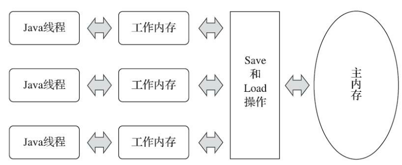

	这是Java内存模型（JMM）系列的第0篇文章，主要介绍的是JMM的相关概念定义。

### 一、JSR-133规范

Java内存模型(java memory model)。给定一个程序和该程序的一串执行轨迹，**内存模型**
用来屏蔽各种硬件和操作系统的内存访问差异，以实现Java查询在各种平台下都能达成一致的内存访问效果。
> JSR-133 规范，即 JavaTM内存模型与线程规范，由 JSR-133 专家组开发。JSR-133规范的标准内容将合并到 JavaTM语言规范、JavaTM虚拟机规范。

<!-- more -->

### 三、Java内存模型

主要目的：定义程序中各种变量的访问规则，即关注在虚拟机中把变量值存储到内存和从内存中取出变量值这样的底层细节。
> 变量包含：实例字段、静态字段和构成数组对象的元素。

#### 3.1、主内存和工作内存

Java内存模型的抽象：线程之间的共享变量存储在主内存（main memory）中，每个线程都有一个私有的本地内存（local memory），本地内存中存储了该线程以读/写共享变量的副本。

##### 3.1.1、主内存

主内存是所有线程共享的内存区域，它存储着 Java 程序中的所有实例变量、静态变量和类信息等。
> 当一个变量被声明为 static 或者是实例变量时，它就存储在主内存中.

##### 3.1.2、工作内存

本地内存是JMM的一个抽象概念，并不真实存在。它涵盖了缓存、写缓冲区、寄存器以及其他的硬件和编译器优化。

#### 3.2、通信方式

Java的通信，采用了共享内存的方式。

#### 3.3、内存的交互方式

| 术语     |                                            描述 |
|:-------|----------------------------------------------:|
| lock   |                                       锁主内存的变量 |
| unlock |                                      解锁主内存的变量 |
| read   |                                      读取主内存的变量 |
| load   | 载入，作用于工作内存的变量，把read操作从主内存中得到的变量值放入到工作内存的变量副本中 |
| use    |                                    使用，作用于工作内存 |
| assign |                                    赋值，作用于工作内存 |
| store  |                            存储，作用于工作内存，值传送到主内存 |
| write  |                        写入，把store操作的变量的值写入到主内存 |

#### 3.4、volatile

后续有相关章节文章。

#### 3.5、final

后续有相关章节文章。

#### 3.6、happens-before

后续有相关章节文章。

#### 3.7、锁

后续有相关章节文章。