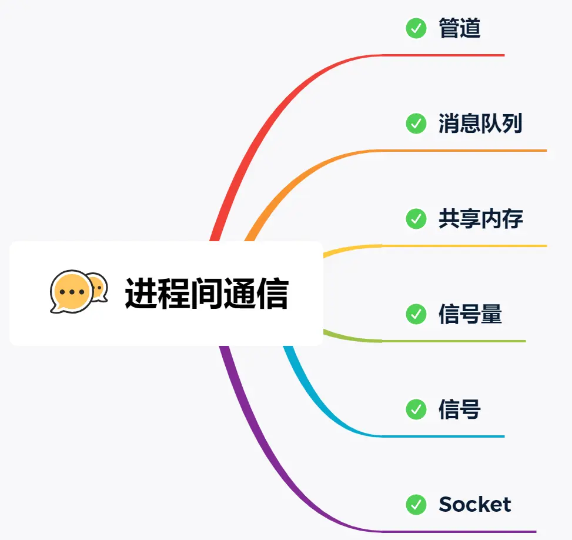
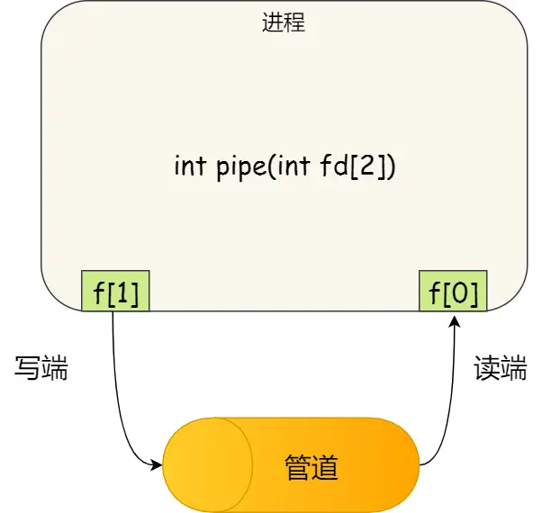
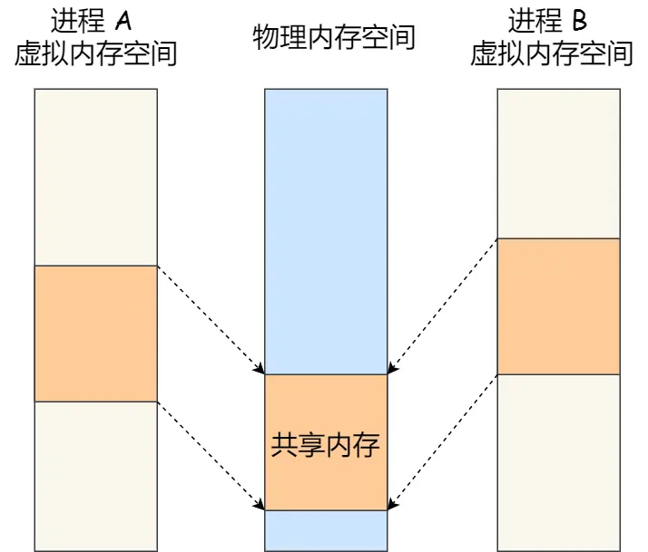
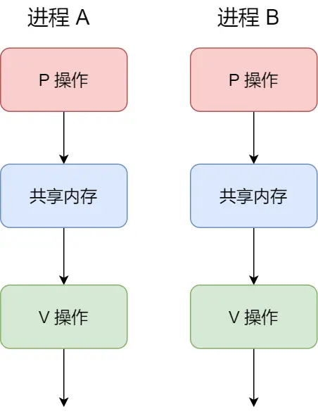
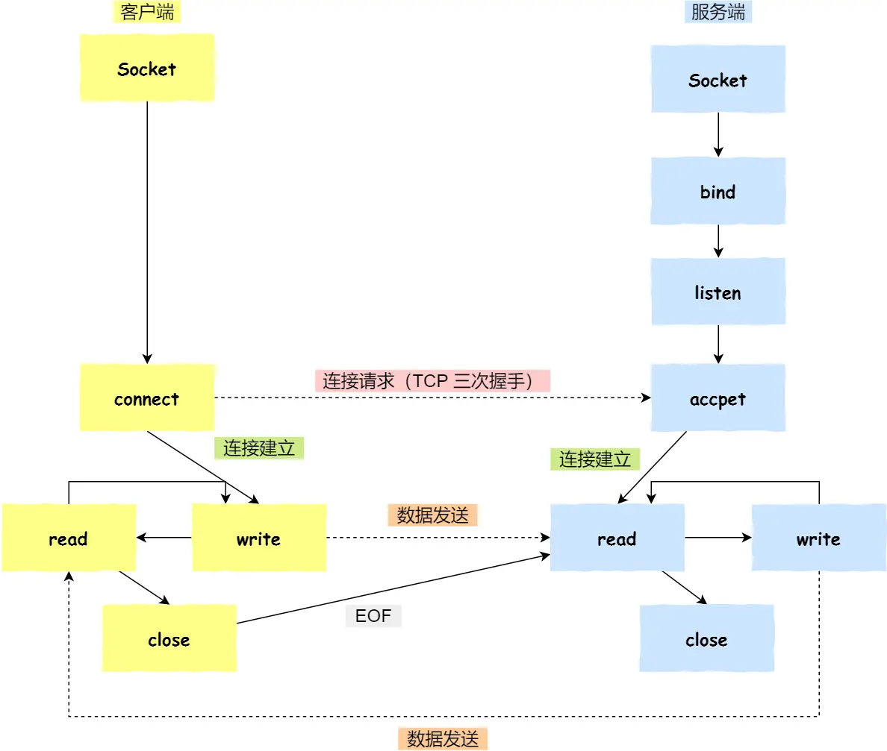

	
	这是Java内存模型（JMM）系列的第一篇文章，主要介绍的是进程间的通信方式。

### 一、进程如何通信？


<!-- more -->

#### 2.1、管道

在 Linux 的实际编码中，管道的创建调用的是系统调用pipe()，若创建成功则返回 0，创建失败就返回 -1：

```dtd
int pipe (int fd[2]);
```



该函数建了一个管道 pipe，返回了两个文件描述符，这表示管道的两端

- 一个是管道的读取端描述符 fd[0]
- 另一个是管道的写入端描述符 fd[1]。
- fd[1] 的输出是 fd[0] 的输入

```dtd
ps auxf | grep mysql
```

上面命令行里的「|」竖线就是一个管道，它的功能是将前一个命令（ps auxf）的输出，作为后一个命令（grep
mysql）的输入，从这功能描述，可以看出管道传输数据是单向的，如果想相互通信，我们需要创建两个管道才行。

同时，我们得知上面这种管道是没有名字，所以「|」表示的管道称为匿名管道，用完了就销毁。

> 管道的通信方式是效率低的，因此管道不适合进程间频繁地交换数据。

#### 2.2、消息队列

比如，A 进程要给 B 进程发送消息，A 进程把数据放在对应的消息队列后就可以正常返回了，B 进程需要的时候再去读取数据就可以了。同理，B
进程要给 A 进程发送消息也是如此。

消息队列是保存在内核中的消息链表，在发送数据时，会分成一个一个独立的数据单元，也就是消息体（数据块），消息体是用户自定义的数据类型，消息的发送方和接收方要约定好消息体的数据类型，所以每个消息体都是固定大小的存储块，不像管道是无格式的字节流数据。如果进程从消息队列中读取了消息体，内核就会把这个消息体删除。

消息队列生命周期随内核，如果没有释放消息队列或者没有关闭操作系统，消息队列会一直存在.

> 消息队列不适合比较大数据的传输，因为在内核中每个消息体都有一个最大长度的限制，同时所有队列所包含的全部消息体的总长度也是有上限。

#### 2.3、共享内存

共享内存的机制，就是拿出一块虚拟地址空间来，映射到相同的物理内存中。这样这个进程写入的东西，另外一个进程马上就能看到了，都不需要拷贝来拷贝去，传来传去，大大提高了进程间通信的速度。


> 共享内存通信方式，带来新的问题，那就是如果多个进程同时修改同一个共享内存，很有可能就冲突了

#### 2.4、信号量与PV操作

为了防止多进程竞争共享资源，而造成的数据错乱，所以需要保护机制，使得共享的资源，在任意时刻只能被一个进程访问。正好，**信号量**
就实现了这一保护机制。

**信号量其实是一个整型的计数器，主要用于实现进程间的互斥与同步，而不是用于缓存进程间通信的数据。**

信号量表示资源的数量，控制信号量的方式有两种原子操作：

- 一个是 P 操作，这个操作会把信号量减去 1，相减后如果信号量 < 0，则表明资源已被占用，进程需阻塞等待；相减后如果信号量 >=
  0，则表明还有资源可使用，进程可正常继续执行。
- 另一个是 V 操作，这个操作会把信号量加上 1，相加后如果信号量 <=
  0，则表明当前有阻塞中的进程，于是会将该进程唤醒运行；相加后如果信号量 > 0，则表明当前没有阻塞中的进程；



具体的过程如下：

- 进程 A 在访问共享内存前，先执行了 P 操作，由于信号量的初始值为 1，故在进程 A 执行 P 操作后信号量变为 0，表示共享资源可用，于是进程
  A 就可以访问共享内存。
- 若此时，进程 B 也想访问共享内存，执行了 P 操作，结果信号量变为了 -1，这就意味着临界资源已被占用，因此进程 B 被阻塞。
- 直到进程 A 访问完共享内存，才会执行 V 操作，使得信号量恢复为 0，接着就会唤醒阻塞中的线程 B，使得进程 B
  可以访问共享内存，最后完成共享内存的访问后，执行 V 操作，使信号量恢复到初始值 1。

可以发现，信号初始化为 1，就代表着是互斥信号量，它可以保证共享内存在任何时刻只有一个进程在访问，这就很好的保护了共享内存。

#### 2.5、信号

上面说的进程间通信，都是常规状态下的工作模式。**对于异常情况下的工作模式，就需要用「信号」的方式来通知进程。**

在 Linux 操作系统中， 为了响应各种各样的事件，提供了几十种信号，分别代表不同的意义。我们可以通过 kill -l 命令，查看所有的信号：

```java
$ kill -l
 1)SIGHUP       2)SIGINT       3)SIGQUIT      4)SIGILL       5)SIGTRAP
 6)SIGABRT      7)SIGBUS       8)SIGFPE       9)SIGKILL     10)SIGUSR1
11)SIGSEGV     12)SIGUSR2     13)SIGPIPE     14)SIGALRM     15)SIGTERM
16)SIGSTKFLT   17)SIGCHLD     18)SIGCONT     19)SIGSTOP     20)SIGTSTP
21)SIGTTIN     22)SIGTTOU     23)SIGURG      24)SIGXCPU     25)SIGXFSZ
26)SIGVTALRM   27)SIGPROF     28)SIGWINCH    29)SIGIO       30)SIGPWR
31)SIGSYS      34)SIGRTMIN    35)SIGRTMIN+1 36)SIGRTMIN+2 37)SIGRTMIN+3
        38)SIGRTMIN+4 39)SIGRTMIN+5 40)SIGRTMIN+6 41)SIGRTMIN+7 42)SIGRTMIN+8
        43)SIGRTMIN+9 44)SIGRTMIN+10 45)SIGRTMIN+11 46)SIGRTMIN+12 47)SIGRTMIN+13
        48)SIGRTMIN+14 49)SIGRTMIN+15 50)SIGRTMAX-14 51)SIGRTMAX-13 52)SIGRTMAX-12
        53)SIGRTMAX-11 54)SIGRTMAX-10 55)SIGRTMAX-9 56)SIGRTMAX-8 57)SIGRTMAX-7
        58)SIGRTMAX-6 59)SIGRTMAX-5 60)SIGRTMAX-4 61)SIGRTMAX-3 62)SIGRTMAX-2
        63)SIGRTMAX-1 64)SIGRTMAX
```

运行在 shell 终端的进程，我们可以通过键盘输入某些组合键的时候，给进程发送信号。例如

- Ctrl+C 产生 SIGINT 信号，表示终止该进程；
- Ctrl+Z 产生 SIGTSTP 信号，表示停止该进程，但还未结束；
  如果进程在后台运行，可以通过 kill 命令的方式给进程发送信号，但前提需要知道运行中的进程 PID 号，例如：
- kill -9 1050 ，表示给 PID 为 1050 的进程发送 SIGKILL 信号，用来立即结束该进程；

所以，信号事件的来源主要有硬件来源（如键盘 Cltr+C ）和软件来源（如 kill 命令）。

信号是进程间通信机制中<font color=#e98787>**唯一的异步通信机制，**</font>
因为可以在任何时候发送信号给某一进程，一旦有信号产生，我们就有下面这几种，用户进程对信号的处理方式。

1.**执行默认操作。** Linux 对每种信号都规定了默认操作，例如，上面列表中的 SIGTERM 信号，就是终止进程的意思。

2.**捕捉信号。** 我们可以为信号定义一个信号处理函数。当信号发生时，我们就执行相应的信号处理函数。

3.**忽略信号。** 当我们不希望处理某些信号的时候，就可以忽略该信号，不做任何处理。有两个信号是应用进程无法捕捉和忽略的，即
SIGKILL 和 SEGSTOP，它们用于在任何时候中断或结束某一进程。

#### 2.6、socket

前面提到的管道、消息队列、共享内存、信号量和信号都是在同一台主机上进行进程间通信，<font color=#e98787>
那要想跨网络与不同主机上的进程之间通信，就需要 Socket 通信了。</font>

实际上，Socket 通信不仅可以跨网络与不同主机的进程间通信，还可以在同主机上进程间通信。

我们来看看创建 socket 的系统调用：

```dtd
int socket(int domain, int type, int protocal)
```

三个参数分别代表：

- domain 参数用来指定协议族，比如 AF_INET 用于 IPV4、AF_INET6 用于 IPV6、AF_LOCAL/AF_UNIX 用于本机；
- type 参数用来指定通信特性，比如 SOCK_STREAM 表示的是字节流，对应 TCP、SOCK_DGRAM 表示的是数据报，对应 UDP、SOCK_RAW
  表示的是原始套接字；
- protocal 参数原本是用来指定通信协议的，但现在基本废弃。因为协议已经通过前面两个参数指定完成，protocol 目前一般写成 0 即可；



- 服务端和客户端初始化 socket，得到文件描述符；
- 服务端调用 bind，将绑定在 IP 地址和端口;
- 服务端调用 listen，进行监听；
- 服务端调用 accept，等待客户端连接；
- 客户端调用 connect，向服务器端的地址和端口发起连接请求；
- 服务端 accept 返回用于传输的 socket 的文件描述符；
- 客户端调用 write 写入数据；服务端调用 read 读取数据；
- 客户端断开连接时，会调用 close，那么服务端 read 读取数据的时候，就会读取到了 EOF，待处理完数据后，服务端调用 close，表示连接关闭。

这里需要注意的是，服务端调用 accept 时，连接成功了会返回一个已完成连接的 socket，后续用来传输数据。

所以，监听的 socket 和真正用来传送数据的 socket，是<font color=red>「两个」</font> socket，一个叫作<font color=red>监听
socket</font>，一个叫作<font color=red>已完成连接 socket</font>。
