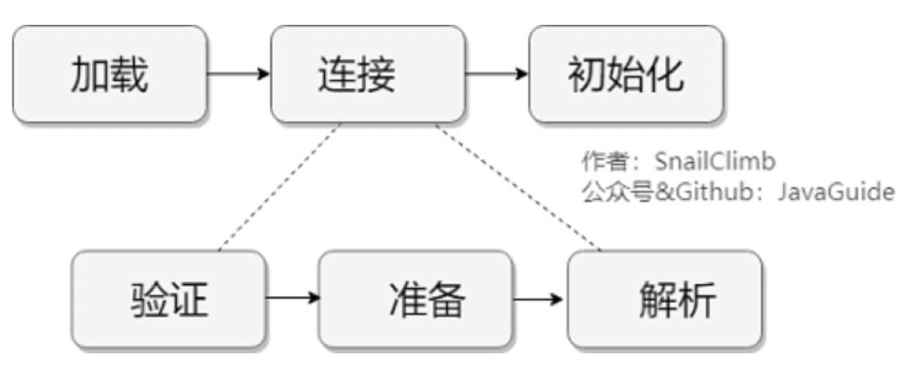

# 一、类的加载过程
从类加载顺序、类加载器等方面进行讲解

# 二、类加载顺序
加载 -> 验证 -> 准备 -> 解析 -> 初始化

加载：
将字节码文件加载至内存。

验证：
验证字节码文件是否符合JVM规范

准备：
对类或接口的**静态变量分配空间，并默认初始值**。此时不会执行任何字节码指令。
因为在初始化阶段，会调用显式的初始化器来初始化。

解析：
根据运行时常量池中的符号引用转化成直接引用
解析动作主要针对类或接口、字段、类方法、接口方法、方法类型、方法句柄和调用限定符7类符号引用进行。

初始化：
在准备阶段，已经按系统要求对静态变量分配空间和初始值，初始化过程**调用(clinit)类初始化器**

一个非数组类的加载阶段（加载阶段获取类的二进制字节流的动作）是可控性最强的阶段，这一步我们可以去完成还可以自定义类加载器去控制字节流的获取方式（重写一个类加载器的 loadClass() 方法）。数组类型不通过类加载器创建，它由 Java 虚拟机直接创建。

<!--more-->  

## 2.1、clinit详解
Java类加载的初始化过程，编译器会按语句在源文件出现的位置，依次自动收集类中的所有类变量的赋值动作和静态代码块，
然后**合并产生clinit方法**；如果类中没有静态语句和静态代码块，则可以不生成。

并且 clinit() 不需要显式调用父类（接口除外，接口不需要调用父接口的初始化方法，只有使用到父接口中的静态变量时才需要调用）的初始化方法 clinit()，虚拟机会保证在子类的 clinit() 方法执行之前，父类的 clinit() 方法已经执行完毕。

> 虚拟机首先执行的是类加载初始化过程中的 <clinit>() 方法，也就是静态变量赋值以及静态代码块中的代码，如果 <clinit>() 方法中触发了对象的初始化，也就是 <init>() 方法，那么会进入执行 <init>() 方法，执行 <init>() 方法完成之后，再回来继续执行 <clinit>() 方法。

# 三、类是生命周期

# 四、热加载
1. 实现自己的类加载器。
2. 从自己的类加载器中加载要热加载的类。
3. 不断轮训要热加载的类 class 文件是否有更新。
4. 如果有更新，重新加载。

> 如何判断文件是否更新?

我们需要判断 class 是否进行了更新，所以我们需要记录 class 类的修改时间，以及对应的类信息。
所以编译一个类用来记录某个类对应的某个类加载器以及上次加载的 class 的修改时间。

在实现思路里，我们知道轮训检查 class 文件是不是被更新过，所以每次调用要热加载的类时，我们都要进行检查类是否被更新然后决定要不要重新加载。为了方便这步的获取操作，可以使用一个简单的工厂模式进行封装。

# 五、双亲委派机制
Class.loadClass()方法，内部实现了双亲委派机制。
* 重写loadClass()方法进行定义自己的类加载器（可能会破坏双亲委派）
* 如果不想打破双亲委派，则重写findClass()方法