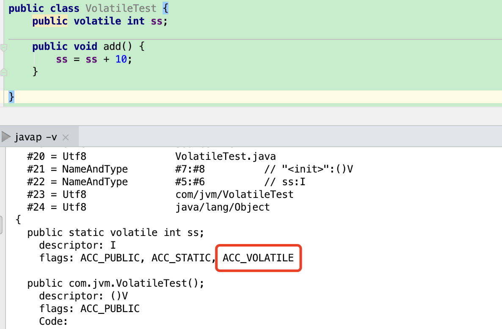
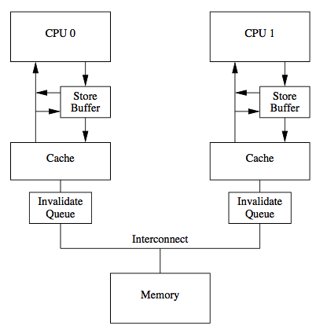

# 一、volatile
1. 保证变量可见性。
2. 禁止指令重排序。

# 二、如何实现
从三个层面解析。   
1. 字节码层面
2. JVM层面
3. CPU层面（汇编语言）

<!--more-->  

## 2.1、字节码层面


使用volatile关键字修饰的实例变量，会使用ACC_VOLATILE修饰。

## 2.2、JVM层面
c/c++中的volatile关键字，用来修饰变量，通常用于语言级别的 memory barrier。  
volatile是一种类型修饰符，被volatile声明的变量表示随时可能发生变化，每次使用时，都必须从变量i对应的内存地址读取，编译器对操作该变量的代码不再进行优化


## 2.3、汇编语言层面


idea：查看汇编指令代码，在执行的VM参数中添加以下值：
```
-server -Xcomp -XX:+UnlockDiagnosticVMOptions -XX:+PrintAssembly -XX:CompileCommand=compileonly,*VolatileTest.main
```

生成lock指令，lock指令会锁住总线，阻止其他CPU通过总线访问内存。

[volatile实现内存可见性分析：字节码版本](https://blog.csdn.net/m15517986455/article/details/83273723)


# 三、总结
## 3.1、如何保证禁止指令重排？
* 编译器优化的重排序：编译器在不改变单线程程序语义的前提下，可以重新安排语句的执行顺序。
* 指令级并行的重排序：如果不存在数据依赖性，处理器可以改变语句对应机器指令的执行顺序。
* 内存系统的重排序：

1. volatile会添加编译器屏障，防止编译器优化导致的指令重排，JMM定义的如下：
    * storestore
    * storeload
    * loadload
    * loadstore
2. 指令级的重排序
    * lfence：读屏障，清空invalidate queue，强制读取cache中的值，lfence之前的读操作一定在lfence之前完成
    * sfence：写屏障，会将store buffer中的修改写入到cache中，sfence之前的写操作一点在sfence之前完成，使其他CPU可见
    * mfence：同时刷新store buffer和 invalidate queue     

## 3.2、如何保证内存可见？

1. 写操作时，lock指令锁住总线，修改内存中的值。
2. 修改完以后，通过MESI协议保证数据一致性
    * MESI协议：定义了四种状态，独占->共享->修改->无效，当修改了数据时回写缓存，同时通知其他CPU该缓存无效，所以其他CPU需要重新从主存中读取最新内容，以此达到可见性，修改值的CPU需要等待其他CPU返回ack。
    * MESI实现：MESI的实现，按理论实现的话效率过低，从而通过store buffer来提高运行效率。
        * store buffer：在CPU和缓存之间CPU0修改并回写时，直接返回成功，不需要等到其他CPU返回invalidate ack，解决MESI协议的强一致性问题，提升性能。具体实现是：cpu0写入到store buffer后，继续往下执行，然后通知其他CPU值失效返回ack，此时CPU0会从cache中获取而不是store buffer，此处导致数据不一致，执行顺序也乱序；
        * Invalidate queue：在缓存和内存之间在收到invalidate消息后立马返回ack，实际并没有将cache中的数据清除，从而导致了数据不一致。

* **StoreBuffer和InvalidateQueue结构**


StoreBuffer和InvalidateQueue结构的引入，会引起数据不一致的问题，如何解决呢？
* 内存屏障（指令级）
    * smp_wmb(StoreStore)：执行后需等待 Store Buffer 中的写入变更 flush 完全到缓存后，后续的写操作才能继续执行，保证执行前后的写操作对其他 CPU 而言是顺序执行的；
    * smp_rmb(LoadLoad)：执行后需等待 Invalidate Queue 完全应用到缓存后，后续的读操作才能继续执行，保证执行前后的读操作对其他 CPU 而言是顺序执行的；

[happens-before](https://zhuanlan.zhihu.com/p/126275344)