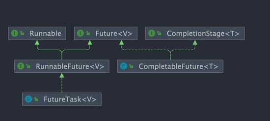
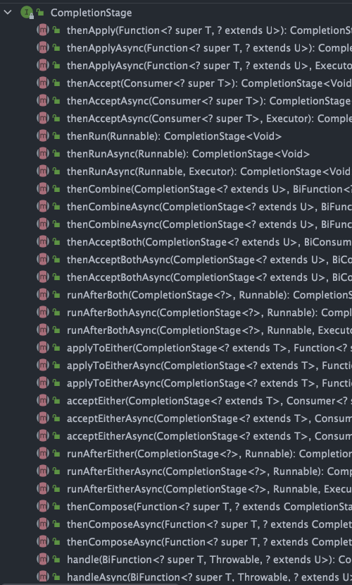

	这是“并发”系列的第三篇文章，主要介绍的是CompletableFuture相关内容。

# 一、CompletableFuture
JDK1.8引入的一个基于事件的异步回调类，它提供了一种简洁而强大的方式来处理异步任务和处理异步任务的结果

<!-- more -->

# 二、设计初衷
Future 在实际使用过程中存在一些局限性比如不支持异步任务的编排组合、获取计算结果的 get() 方法为阻塞调用。

Java 8 才被引入CompletableFuture 类可以解决Future 的这些缺陷。CompletableFuture 除了提供了更为好用和强大的 Future 特性之外，还提供了函数式编程、异步任务编排组合（可以将多个异步任务串联起来，组成一个完整的链式调用）等能力。

# 三、源码分析
下面我们来简单看看 CompletableFuture 类的定义。
```
public class CompletableFuture<T> implements Future<T>, CompletionStage<T> {
}
```
可以看到，CompletableFuture 同时实现了 Future 和 CompletionStage 接口。


## 3.1、Future接口
Future 接口有 5 个方法：
- **boolean cancel(boolean mayInterruptIfRunning)：** 尝试取消执行任务。
- **boolean isCancelled()：** 判断任务是否被取消。
- **boolean isDone()：** 判断任务是否已经被执行完成。
- **get()：** 等待任务执行完成并获取运算结果。
- **get(long timeout, TimeUnit unit)：** 多了一个超时时间。

## 3.2、CompletionStage 接口
CompletionStage 接口描述了一个异步计算的阶段。很多计算可以分成多个阶段或步骤，此时可以通过它将所有步骤组合起来，形成异步计算的流水线。

CompletionStage 接口中的方法比较多，CompletableFuture 的函数式能力就是这个接口赋予的。从这个接口的方法参数你就可以发现其大量使用了 Java8 引入的函数式编程。



# 四、CompletableFuture常见操作

## 4.1、创建 CompletableFuture

常见的创建 CompletableFuture 对象的方法如下：
- 通过 new 关键字。
- 基于 CompletableFuture 自带的静态工厂方法：runAsync()、supplyAsync() 。

### 4.1.1、通过 new 关键字
简单的案例:
```java
CompletableFuture<Integer> cp = new CompletableFuture<>();
// 可以调用 complete() 方法为其传入结果，这表示 resultFuture 已经被完成了。
// complete() 方法只能调用一次，后续调用将被忽略。
cp.complete(2);
```
**获取结果：** 获取异步计算的结果也非常简单，直接调用 get() 方法即可。调用 get() 方法的线程会阻塞直到 CompletableFuture 完成运算。
```java
int result = completableFuture.get();
```

### 4.1.2、静态工厂方法
这两个方法可以帮助我们封装计算逻辑。
```java
static <U> CompletableFuture<U> supplyAsync(Supplier<U> supplier);
// 使用自定义线程池(推荐)
static <U> CompletableFuture<U> supplyAsync(Supplier<U> supplier, Executor executor);
static CompletableFuture<Void> runAsync(Runnable runnable);
// 使用自定义线程池(推荐)
static CompletableFuture<Void> runAsync(Runnable runnable, Executor executor);
```

- **supplyAsync：** 执行CompletableFuture任务，支持返回值
  - 接受的参数是 Supplier<U\> ，这也是一个函数式接口，U 是返回结果值的类型。当你需要异步操作且关心返回结果的时候,可以使用 supplyAsync() 方法。
- **runAsync：** 执行CompletableFuture任务，没有返回值。
  - 接受的参数是 Runnable ，这是一个函数式接口，不允许返回值。当你需要异步操作且不关心返回结果的时候可以使用 runAsync() 方法。

**supplyAsync方法**其实很容易理解，就是创建一个AsyncSupply放入线程池执行。AsyncSupply是一个CompletableFuture的内部类，继承了ForkJoinTask和Runnable，可看作是一个异步任务。
#### supplyAsync()源码

asyncSupplyStage()方法内部逻辑：
- 第一步：d = new CompletableFuture()，创建一个Future
- 第二步：e.execute(new <font color=red>AsyncSupply<U>(d, f)</font>); 执行任务
  - e是asyncPool：默认是ForkJoinPool.commonPool()
- 第三步：return d; 返回创建的CompletableFuture


##### AsyncSupply：
AsyncSupply它实现了Runnable接口，所以被提交到线程池中后，工作线程会执行其run()方法。因此，我们只需要搞清楚其run()中的实现即可。
```java
static final class AsyncSupply<T> extends ForkJoinTask<Void>
            implements Runnable, AsynchronousCompletionTask {
        CompletableFuture<T> dep; Supplier<T> fn;
        AsyncSupply(CompletableFuture<T> dep, Supplier<T> fn) {
            this.dep = dep; this.fn = fn;
        }

        public final Void getRawResult() { return null; }
        public final void setRawResult(Void v) {}
        public final boolean exec() { run(); return true; }

        public void run() {
            CompletableFuture<T> d; Supplier<T> f;
            if ((d = dep) != null && (f = fn) != null) {
                dep = null; fn = null;
                if (d.result == null) {
                    try {
                        d.completeValue(f.get());
                    } catch (Throwable ex) {
                        d.completeThrowable(ex);
                    }
                }
                d.postComplete();
            }
        }
    }
}
```


### 创建示例：
```java
List<CompletableFuture<Object>> futureList = copyPartition.stream().map(subList ->
      //任务传递给supplyAsync()方法，该任务将在ForkJoinPool.commonPool()中异步完成运行，最后，supplyAsync()将返回新的CompletableFuture，其值是通过调用给定的Supplier所获得的值。
      CompletableFuture.supplyAsync(() -> {
          log.info("处理第{}段数据开始", n);
          return checkImportAndBuildEvent(baseMessageMap, subList, totalCheckedMap, mis);
      }, importForkJoinPool)
      //thenApplyAsync()方法，注册回调函数，当异步任务完成时，相应的回调函数会被自动触发执行【supplyAsync()获得的参数传递来执行给定的函数】
      .thenApplyAsync(eventSaveReqs -> {
                  log.info("处理第{}段数据开始", n);
                  return null;
              },
              queryForkJoinPool
      )
).collect(toList());
futureList.stream().map(CompletableFuture::join).collect(Collectors.toList());
```

## 4.2、处理异步结算的结果
> <font color=gray>**supplyAsync方法会把任务放入异步线程执行，然后主线程会直接执行thenApply，thenApply中会调用uniApplyStage。在调用uniApplyStage时，thenApply不会传入Executor，而thenApplyAsync则会传入Executor，意味着thenApply采用同步的方式，thenApplyAsync采用异步的方式。**</font>

当我们获取到异步计算的结果之后，还可以对其进行进一步的处理，比较常用的方法有下面几个：
- thenApply()
- thenAccept()
- thenRun()
- whenComplete()


### 4.2.1、thenApply()源码分析
thenApply() 方法接受一个 Function 实例，用它来处理结果。
```java
// 沿用上一个任务的线程池
public <U> CompletableFuture<U> thenApply(Function<? super T,? extends U> fn) {
    return uniApplyStage(null, fn);
}

//使用默认的 ForkJoinPool 线程池（不推荐）
public <U> CompletableFuture<U> thenApplyAsync(
    Function<? super T,? extends U> fn) {
    return uniApplyStage(defaultExecutor(), fn);
}
// 使用自定义线程池(推荐)
public <U> CompletableFuture<U> thenApplyAsync(
    Function<? super T,? extends U> fn, Executor executor) {
    return uniApplyStage(screenExecutor(executor), fn);
}
```
**thenApply()内部调用uniApplyStage()：**
```java
private <V> CompletableFuture<V> uniApplyStage(Executor e, Function<? super T,? extends V> f) {
        if (f == null) throw new NullPointerException();
        CompletableFuture<V> d =  new CompletableFuture<V>();
        if (e != null || !d.uniApply(this, f, null)) {
            UniApply<T,V> c = new UniApply<T,V>(e, d, this, f);
            push(c);
            c.tryFire(SYNC);
        }
        return d;
    }
```
内部流程：
- 创建新的CompletableFuture
- 然后执行uniApply()方法

**uniApplyStage()调用uniApply()：** 
> d.uniApply(this, f, null)
> - d：thenApply()方法新创建的CompletableFuture
> - this：supplyAsync()方法返回的CompletableFuture
> - f：thenApply()方法的函数型接口入参
```java
final <S> boolean uniApply(CompletableFuture<S> a,
                           Function<? super S, ? extends T> f,
                           UniApply<S, T> c) {
  Object r;
  Throwable x;
  // 1.判断依赖的CompletableFuture是否已完成，将要执行的任务是否已执行过
  // a.result为null说明上一个CompletableFuture还未执行完成
  if (a == null || (r = a.result) == null || f == null) {
    return false;
  }
  tryComplete:
  // result不为null说明f已经执行完成，直接返回true
  if (result == null) {
    // 2.依赖的CompletableFuture结果为异常或null的处理
    if (r instanceof AltResult) {
      if ((x = ((AltResult) r).ex) != null) {
        //若上一个CompletableFuture的执行有异常则把异常传递给当前CompletableFuture
        completeThrowable(x, r);
        break tryComplete;
      }
      r = null;
    }
    try {
      // 3.f的执行
      // 若c为null意味着mode>0,即已在异步线程中，若c不为空意味着尚未启动异步线程来执行该任务。
      // 若c非异步模式c.claim()返回true,若c为异步模式则在c.claim()中启动异步线程并返回false，不关心结果
      if (c != null && !c.claim()) {
        return false;
      }
      // 以上一个CompletableFuture的执行结果作为参数输入给f执行，执行结果赋值给当前CompletableFuture
      @SuppressWarnings("unchecked") S s = (S) r;
      completeValue(f.apply(s));// 为result赋值，值为f执行的结果
    } catch (Throwable ex) {
      completeThrowable(ex);
    }
  }
  return true;
}
```
uniApply的代码可分为三部分：
- 1）判断依赖的CompletableFuture【supplyAsync()方法返回的CompletableFuture】是否已完成，若已完成才会接着执行本任务；
- 2）处理依赖的CompletableFuture的结果为null或异常的情况，若有异常则直接作为本任务的结果；
- 3）依赖的CompletableFuture的结果作为入参传给Function，然后Function的执行。

<details style="background-color: #dbdbdb;padding: 10px;">
<summary>▲ 点击查看“tryComplete标签”相关定义</summary>
> 在 Java 中，标签是一个标识符后面跟着一个冒号（:），用于标记一段代码块，通常是循环（for、while、do - while）、if语句块、switch语句块等。例如，outerLoop:就是一个标签，它可以放在循环或其他代码块之前来标记这个块。
> ```java
outerLoop: for (int i = 0; i < 3; i++) {
// 这里是循环体内容
}
```
> 作用 - 控制流跳转（与break和continue配合）
> 与break配合使用
> 通常情况下，break语句用于跳出当前循环。在嵌套循环中，它会跳出最内层循环。但当break与标签一起使用时，它可以跳出被标签标记的代码块。
> 示例：
> outerLoop: for (int i = 0; i < 3; i++) {
    for (int j = 0; j < 3; j++) {
        if (i == 1 && j == 1) {
            break outerLoop;
        }
        System.out.println("i: " + i + ", j: " + j);
    }
}
System.out.println("已经跳出外层循环");
> 在这个例子中，有两层嵌套的循环。当i = 1且j = 1时，执行break outerLoop;语句。这里的outerLoop:是外层循环的标签，所以break语句会直接跳出外层循环，然后执行外层循环后面的打印语句，即打印出 “已经跳出外层循环”。

</details>

# 五、执行模式
CompletableFuture的执行模式：
- 链式执行
- 组合执行

## 5.1、链式执行【thenRun、thenAccept和 thenApply】
对于 Future，在提交任务之后，只能调用 get（）等结果返回； 但对于 CompletableFuture，可以在结果上面再加一个callback，当 得到结果之后，再接着执行callback。

### 例1：thenRun（Runnable）
thenRun方法用于在CompletableFuture完成后执行一个Runnable（无参数、无返回值的任务）。这个方法主要关注的是任务完成后的动作，而不关心CompletableFuture的计算结果。
```java
CompletableFuture<Void> testFuture = CompletableFuture.supplyAsync(new Supplier<String>() {
  public String get() {
    try {
        TimeUnit.SECONDS.sleep(1);
    } catch (InterruptedException e) {
        e.printStackTrace();
    }
    return "test result";
  }
}).thenRun(() -> {
    System.out.println("task A");
});
```

### 例2：thenAccept（Consumer）
thenAccept方法用于在CompletableFuture完成后，接收并处理CompletableFuture的计算结果。它接受一个Consumer接口的实现作为参数，Consumer接口的方法是有一个输入参数但没有返回值的。
```java
CompletableFuture<Void> testFuture = CompletableFuture.supplyAsync(new Supplier<String>() {
  public String get() {
    try {
      TimeUnit.SECONDS.sleep(1);
    } catch (InterruptedException e) {
      e.printStackTrace();
    }
    return "test result";
  }
}).thenAccept(result -> {
  System.out.println(result);
});
```

### 例3：thenApply（Function）
thenApply方法用于在CompletableFuture完成后，对其结果进行转换并返回一个新的CompletableFuture。它接受一个Function接口的实现作为参数，Function接口的方法是有一个输入参数并且有一个返回值的。
```java
CompletableFuture<String> testFuture = CompletableFuture.supplyAsync(new Supplier<String>() {
    public String get() {
        try {
            TimeUnit.SECONDS.sleep(1);
        } catch (InterruptedException e) {
            e.printStackTrace();
        }
        return "test result";
    }
}).thenApply(result -> {
    return result + "thenApply";
});
```
三个例子都是在任务执行完成之后，执行一个callback， 只是callback的形式有所区别：
1. thenRun() 后面跟的是一个无参数、无返回值的方法，即Runnable，所以最终的返回值是CompletableFuture<；Void>；类型。
2. thenAccept() 后面跟的是一个有参数、无返回值的方法，称为 Consumer，返回值也是CompletableFuture<；Void>；类型。 顾名思义，只进不出，所以称为Consumer；前面的Supplier，是无参数，有返回值，只出不进，和Consumer刚好相反。
3. thenApply() 后面跟的是一个有参数、有返回值的方法，称为Function。返回值是CompletableFuture<；String>；类型。 而参数接收的是前一个任务，即 supplyAsync（..）这个任务的 返回值。因此这里只能用supplyAsync，不能用runAsync。因为runAsync没有返回值，不能为下一个链式方法传入参数。


## 5.2、组合：thenCompose与thenCombine

### 例1：thenCompose【用于链式组合】
在上面的例子中，thenApply接收的是一个Function，但是这个Fu nction的返回值是一个通常的基本数据类型或一个对象，而不是另外 一个 CompletableFuture。如果 Function 的返回值也是一个Complet ableFuture，就会出现嵌套的CompletableFuture。例子：
```java
public class Test11 {

    static CompletableFuture<String> getUserId(String userId) {
        return CompletableFuture.supplyAsync(() -> {
            System.out.println("userId:" + userId);
            return userId;
        });
    }

    static CompletableFuture<String> getUserId2(String userId) {
        return CompletableFuture.supplyAsync(() -> {
            System.out.println("userId:" + userId);
            return userId;
        });
    }

    public static void main(String[] args) {

        // 这两个函数链式调用，代码如下所示
        CompletableFuture<CompletableFuture<String>> result = getUserId("111").thenApply(String -> getUserId2("112"));
        System.out.println(result.join().join());

        // 如果希望返回值是一个展平的CompletableFuture，可以使用thenCompose，代码如下所示
        CompletableFuture<String> result2 = getUserId("111").thenCompose(String -> getUserId2("112"));
        System.out.println(result2.join());
    }
}
```


### 例2：thenCombine 【用于合并结果组合】
thenCombine函数的接口定义如下，从传入的参数可以看出，它不 同于thenCompose
```java
public <U,V> CompletableFuture<V> thenCombine(CompletionStage<? extends U> other,BiFunction<? super T,? super U,? extends V> fn) {
    return biApplyStage(null, other, fn);
}
```
- 第1个参数是一个CompletableFuture类型
- 第2个参数是一个函数，并且是一个BiFunction
- 也就是该函数有2个输入参数，1个返回值。

从该接口的定义可以大致推测，它是要在2个CompletableFuture 完成之后，把2个CompletableFuture的返回值传进去，再额外做一些事情。实例如下：
```java
public static void main(String[] args) throws ExecutionException, InterruptedException {
    // 函数1：获取体重
    CompletableFuture<Double> weightFuture = CompletableFuture.supplyAsync(() -> {
        try {
            TimeUnit.SECONDS.sleep(1);
        } catch (InterruptedException e) {
            e.printStackTrace();
        }
        return 65.0;
    });
    // 函数2：获取身高
    CompletableFuture<Double> heightFuture = CompletableFuture.supplyAsync(() -> {
        try {
            TimeUnit.SECONDS.sleep(1);
        } catch (InterruptedException e) {
            e.printStackTrace();
        }
        return 177.8;
    });
    // 函数3：结合身高、体重，计算BMI指数
    CompletableFuture<Double> bmiFuture = weightFuture.thenCombine(heightFuture, (weight, height) -> {
        Double heightInMeter = height / 100;
        return weight / (heightInMeter * heightInMeter);
    });
    System.out.println("Your BMI is - " + bmiFuture.get());
}
```

### 任意个CompletableFuture的组合
上面的thenCompose和thenCombine只能组合2个CompletableFutur e，而接下来的allOf 和anyOf 可以组合任意多个CompletableFutur e。函数接口定义如下所示。
```java
public static CompletableFuture<Void> allOf(CompletableFuture<?>... cfs) {
    return andTree(cfs, 0, cfs.length - 1);
}
public static CompletableFuture<Object> anyOf(CompletableFuture<?>... cfs) {
    return orTree(cfs, 0, cfs.length - 1);
}
```
首先，这两个函数都是静态函数，参数是变长的CompletableFuture的集合。其次，allOf和anyOf的区别，前者是“与”，后者是 “或”。

#### 例1：allOf
allOf的返回值是CompletableFuture<；Void>；类型，这是 因为每个传入的CompletableFuture的返回值都可能不同，所以组合的 结果是无法用某种类型来表示的，索性返回Void类型。

#### 例2：anyOf
anyOf 的含义是只要有任意一个 CompletableFuture 结束，就可 以做接下来的事情，而无须像AllOf那样，等待所有的CompletableFut ure结束。 但由于每个CompletableFuture的返回值类型都可能不同，任意一 个，意味着无法判断是什么类型，所以anyOf的返回值是CompletableFuture<；Object>；类型。


# 六、商品信息获取示例
```java
@Service
public class ItemService {

    @Autowired
    private GmallPmsClient pmsClient;

    @Autowired
    private GmallWmsClient wmsClient;

    @Autowired
    private GmallSmsClient smsClient;

    @Autowired
    private ThreadPoolExecutor threadPoolExecutor;

    public ItemVo load(Long skuId) {

        ItemVo itemVo = new ItemVo();

        // 根据skuId查询sku的信息1
        CompletableFuture<SkuEntity> skuCompletableFuture = CompletableFuture.supplyAsync(() -> {
            ResponseVo<SkuEntity> skuEntityResponseVo = this.pmsClient.querySkuById(skuId);
            SkuEntity skuEntity = skuEntityResponseVo.getData();
            if (skuEntity == null) {
                return null;
            }
            itemVo.setSkuId(skuId);
            itemVo.setTitle(skuEntity.getTitle());
            itemVo.setSubTitle(skuEntity.getSubtitle());
            itemVo.setPrice(skuEntity.getPrice());
            itemVo.setWeight(skuEntity.getWeight());
            itemVo.setDefaltImage(skuEntity.getDefaultImage());
            return skuEntity;
        }, threadPoolExecutor);

        // 根据cid3查询分类信息2
        CompletableFuture<Void> categoryCompletableFuture = skuCompletableFuture.thenAcceptAsync(skuEntity -> {
            ResponseVo<List<CategoryEntity>> categoryResponseVo = this.pmsClient.queryCategoriesByCid3(skuEntity.getCategoryId());
            List<CategoryEntity> categoryEntities = categoryResponseVo.getData();
            itemVo.setCategories(categoryEntities);
        }, threadPoolExecutor);

        // 根据品牌的id查询品牌3
        CompletableFuture<Void> brandCompletableFuture = skuCompletableFuture.thenAcceptAsync(skuEntity -> {
            ResponseVo<BrandEntity> brandEntityResponseVo = this.pmsClient.queryBrandById(skuEntity.getBrandId());
            BrandEntity brandEntity = brandEntityResponseVo.getData();
            if (brandEntity != null) {
                itemVo.setBrandId(brandEntity.getId());
                itemVo.setBrandName(brandEntity.getName());
            }
        }, threadPoolExecutor);

        // 根据spuId查询spu4
        CompletableFuture<Void> spuCompletableFuture = skuCompletableFuture.thenAcceptAsync(skuEntity -> {
            ResponseVo<SpuEntity> spuEntityResponseVo = this.pmsClient.querySpuById(skuEntity.getSpuId());
            SpuEntity spuEntity = spuEntityResponseVo.getData();
            if (spuEntity != null) {
                itemVo.setSpuId(spuEntity.getId());
                itemVo.setSpuName(spuEntity.getName());
            }
        }, threadPoolExecutor);

        // 跟据skuId查询图片5
        CompletableFuture<Void> skuImagesCompletableFuture = CompletableFuture.runAsync(() -> {
            ResponseVo<List<SkuImagesEntity>> skuImagesResponseVo = this.pmsClient.queryImagesBySkuId(skuId);
            List<SkuImagesEntity> skuImagesEntities = skuImagesResponseVo.getData();
            itemVo.setImages(skuImagesEntities);
        }, threadPoolExecutor);

        // 根据skuId查询sku营销信息6
        CompletableFuture<Void> salesCompletableFuture = CompletableFuture.runAsync(() -> {
            ResponseVo<List<ItemSaleVo>> salesResponseVo = this.smsClient.querySalesBySkuId(skuId);
            List<ItemSaleVo> sales = salesResponseVo.getData();
            itemVo.setSales(sales);
        }, threadPoolExecutor);

        // 根据skuId查询sku的库存信息7
        CompletableFuture<Void> storeCompletableFuture = CompletableFuture.runAsync(() -> {
            ResponseVo<List<WareSkuEntity>> wareSkuResponseVo = this.wmsClient.queryWareSkusBySkuId(skuId);
            List<WareSkuEntity> wareSkuEntities = wareSkuResponseVo.getData();
            if (!CollectionUtils.isEmpty(wareSkuEntities)) {
                itemVo.setStore(wareSkuEntities.stream().anyMatch(wareSkuEntity -> wareSkuEntity.getStock() - wareSkuEntity.getStockLocked() > 0));
            }
        }, threadPoolExecutor);

        // 根据spuId查询spu下的所有sku的销售属性
        CompletableFuture<Void> saleAttrsCompletableFuture = skuCompletableFuture.thenAcceptAsync(skuEntity -> {
            ResponseVo<List<SaleAttrValueVo>> saleAttrValueVoResponseVo = this.pmsClient.querySkuAttrValuesBySpuId(skuEntity.getSpuId());
            List<SaleAttrValueVo> saleAttrValueVos = saleAttrValueVoResponseVo.getData();
            itemVo.setSaleAttrs(saleAttrValueVos);
        }, threadPoolExecutor);

        // 当前sku的销售属性
        CompletableFuture<Void> saleAttrCompletableFuture = CompletableFuture.runAsync(() -> {
            ResponseVo<List<SkuAttrValueEntity>> saleAttrResponseVo = this.pmsClient.querySkuAttrValuesBySkuId(skuId);
            List<SkuAttrValueEntity> skuAttrValueEntities = saleAttrResponseVo.getData();
            Map<Long, String> map = skuAttrValueEntities.stream().collect(Collectors.toMap(SkuAttrValueEntity::getAttrId, SkuAttrValueEntity::getAttrValue));
            itemVo.setSaleAttr(map);
        }, threadPoolExecutor);

        // 根据spuId查询spu下的所有sku及销售属性的映射关系
        CompletableFuture<Void> skusJsonCompletableFuture = skuCompletableFuture.thenAcceptAsync(skuEntity -> {
            ResponseVo<String> skusJsonResponseVo = this.pmsClient.querySkusJsonBySpuId(skuEntity.getSpuId());
            String skusJson = skusJsonResponseVo.getData();
            itemVo.setSkusJson(skusJson);
        }, threadPoolExecutor);

        // 根据spuId查询spu的海报信息9
        CompletableFuture<Void> spuImagesCompletableFuture = skuCompletableFuture.thenAcceptAsync(skuEntity -> {
            ResponseVo<SpuDescEntity> spuDescEntityResponseVo = this.pmsClient.querySpuDescById(skuEntity.getSpuId());
            SpuDescEntity spuDescEntity = spuDescEntityResponseVo.getData();
            if (spuDescEntity != null && StringUtils.isNotBlank(spuDescEntity.getDecript())) {
                String[] images = StringUtils.split(spuDescEntity.getDecript(), ",");
                itemVo.setSpuImages(Arrays.asList(images));
            }
        }, threadPoolExecutor);

        // 根据cid3 spuId skuId查询组及组下的规格参数及值 10
        CompletableFuture<Void> groupCompletableFuture = skuCompletableFuture.thenAcceptAsync(skuEntity -> {
            ResponseVo<List<ItemGroupVo>> groupResponseVo = this.pmsClient.queryGoupsWithAttrValues(skuEntity.getCategoryId(), skuEntity.getSpuId(), skuId);
            List<ItemGroupVo> itemGroupVos = groupResponseVo.getData();
            itemVo.setGroups(itemGroupVos);
        }, threadPoolExecutor);

        CompletableFuture.allOf(categoryCompletableFuture, brandCompletableFuture, spuCompletableFuture,
                skuImagesCompletableFuture, salesCompletableFuture, storeCompletableFuture, saleAttrsCompletableFuture,
                saleAttrCompletableFuture, skusJsonCompletableFuture, spuImagesCompletableFuture, groupCompletableFuture).join();

        return itemVo;
    }
}

```