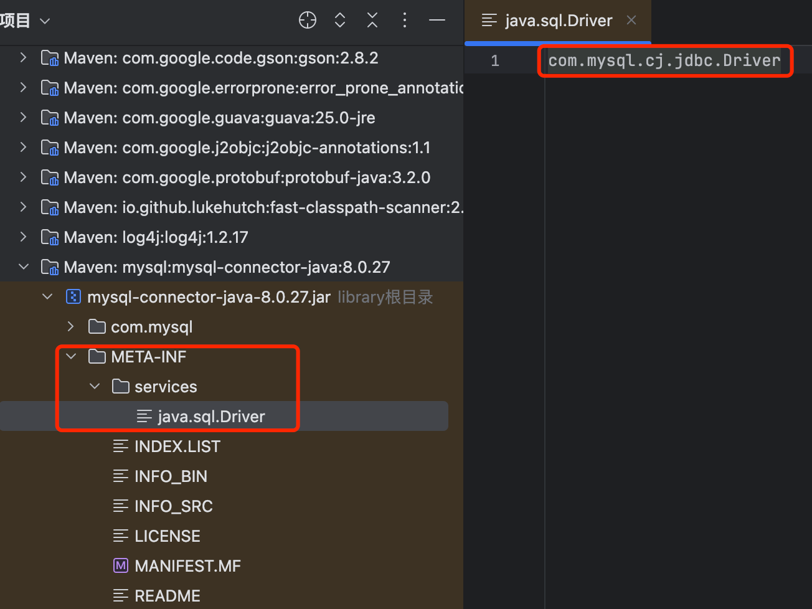

# 一、什么是SPI？
Service Provider Interface 服务提供接口缩写,是一种服务发现机制。

<!-- more -->

SPI的本质是将接口的实现类的全限定名定义在配置文件中，并有服务器读取配置文件，并加载实现类。这样就可以在运行的时候，动态为接口替换实现类。


# 二、java spi

## 2.1、工作原理
1、接口定义【由服务提供方提供接口】
> 首先定义一个或多个抽象的服务接口，这些接口规定了服务的功能和方法签名

2、服务提供者实现
> 不同的服务提供者针对这些接口进行具体的实现。每个实现类都代表一种特定的服务实现方式

3、配置文件
> 服务实现方去配置

4、服务加载
> 应用程序在运行时，通过java.util.ServiceLoader类来加载服务提供者。ServiceLoader会读取配置文件，实例化其中指定的服务实现类，并返回一个可迭代的服务提供者集合，供应用程序使用。例如：


## 2.2、常见示例
Java中常见的SPI实现就是JDBC。 数据库驱动的加载就使用了 Java SPI 机制，不同的数据库厂商可以提供自己的驱动实现

### 2.2.1、原理

#### 1. 接口定义
java.sql.Driver接口
```java
public interface Driver {

    Connection connect(String url, java.util.Properties info) throws SQLException;

    boolean acceptsURL(String url) throws SQLException;

    DriverPropertyInfo[] getPropertyInfo(String url, java.util.Properties info) throws SQLException;

    int getMajorVersion();

    int getMinorVersion();

    boolean jdbcCompliant();

    public Logger getParentLogger() throws SQLFeatureNotSupportedException;
}
```

#### 2. 接口实现
以MySQL为示例
```java
//package com.mysql.jdbc;
public class Driver extends com.mysql.cj.jdbc.Driver {
    public Driver() throws SQLException {
        super();
    }

    static {
        System.err.println("Loading class `com.mysql.jdbc.Driver'. This is deprecated. The new driver class is `com.mysql.cj.jdbc.Driver'. "
                + "The driver is automatically registered via the SPI and manual loading of the driver class is generally unnecessary.");
    }
}

//package com.mysql.cj.jdbc;
public class Driver extends NonRegisteringDriver implements java.sql.Driver {
    //
    // Register ourselves with the DriverManager
    //
    static {
        try {
            java.sql.DriverManager.registerDriver(new Driver());
        } catch (SQLException E) {
            throw new RuntimeException("Can't register driver!");
        }
    }

    /**
     * Construct a new driver and register it with DriverManager
     *
     * @throws SQLException
     *             if a database error occurs.
     */
    public Driver() throws SQLException {
        // Required for Class.forName().newInstance()
    }
}

//package com.mysql.cj.jdbc;
public class NonRegisteringDriver implements java.sql.Driver {
    public static String getOSName() {
        return Constants.OS_NAME;
    }
    public static String getPlatform() {
        return Constants.OS_ARCH;
    }

    static {
        try {
            Class.forName(AbandonedConnectionCleanupThread.class.getName());
        } catch (ClassNotFoundException e) {
            // ignore
        }
    }
    static int getMajorVersionInternal() {
        return StringUtils.safeIntParse(Constants.CJ_MAJOR_VERSION);
    }
    static int getMinorVersionInternal() {
        return StringUtils.safeIntParse(Constants.CJ_MINOR_VERSION);
    }

    public NonRegisteringDriver() throws SQLException {
        // Required for Class.forName().newInstance()
    }
    @Override
    public boolean acceptsURL(String url) throws SQLException {
        return (ConnectionUrl.acceptsUrl(url));
    }

    @Override
    public java.sql.Connection connect(String url, Properties info) throws SQLException {

        try {
            if (!ConnectionUrl.acceptsUrl(url)) {
                return null;
            }

            ConnectionUrl conStr = ConnectionUrl.getConnectionUrlInstance(url, info);
            switch (conStr.getType()) {
                case SINGLE_CONNECTION:
                    return com.mysql.cj.jdbc.ConnectionImpl.getInstance(conStr.getMainHost());

                case FAILOVER_CONNECTION:
                case FAILOVER_DNS_SRV_CONNECTION:
                    return FailoverConnectionProxy.createProxyInstance(conStr);

                case LOADBALANCE_CONNECTION:
                case LOADBALANCE_DNS_SRV_CONNECTION:
                    return LoadBalancedConnectionProxy.createProxyInstance(conStr);

                case REPLICATION_CONNECTION:
                case REPLICATION_DNS_SRV_CONNECTION:
                    return ReplicationConnectionProxy.createProxyInstance(conStr);

                default:
                    return null;
            }

        } catch (UnsupportedConnectionStringException e) {
            // when Connector/J can't handle this connection string the Driver must return null
            return null;

        } catch (CJException ex) {
            throw ExceptionFactory.createException(UnableToConnectException.class,
                    Messages.getString("NonRegisteringDriver.17", new Object[] { ex.toString() }), ex);
        }
    }

    @Override
    public int getMajorVersion() {
        return getMajorVersionInternal();
    }

    @Override
    public int getMinorVersion() {
        return getMinorVersionInternal();
    }

    @Override
    public DriverPropertyInfo[] getPropertyInfo(String url, Properties info) throws SQLException {
        String host = "";
        String port = "";
        String database = "";
        String user = "";
        String password = "";

        if (!isNullOrEmpty(url)) {
            ConnectionUrl connStr = ConnectionUrl.getConnectionUrlInstance(url, info);
            if (connStr.getType() == Type.SINGLE_CONNECTION) {
                HostInfo hostInfo = connStr.getMainHost();
                info = hostInfo.exposeAsProperties();
            }
        }

        if (info != null) {
            host = info.getProperty(PropertyKey.HOST.getKeyName());
            port = info.getProperty(PropertyKey.PORT.getKeyName());
            database = info.getProperty(PropertyKey.DBNAME.getKeyName());
            user = info.getProperty(PropertyKey.USER.getKeyName());
            password = info.getProperty(PropertyKey.PASSWORD.getKeyName());
        }

        DriverPropertyInfo hostProp = new DriverPropertyInfo(PropertyKey.HOST.getKeyName(), host);
        hostProp.required = true;
        hostProp.description = Messages.getString("NonRegisteringDriver.3");

        DriverPropertyInfo portProp = new DriverPropertyInfo(PropertyKey.PORT.getKeyName(), port);
        portProp.required = false;
        portProp.description = Messages.getString("NonRegisteringDriver.7");

        DriverPropertyInfo dbProp = new DriverPropertyInfo(PropertyKey.DBNAME.getKeyName(), database);
        dbProp.required = false;
        dbProp.description = Messages.getString("NonRegisteringDriver.10");

        DriverPropertyInfo userProp = new DriverPropertyInfo(PropertyKey.USER.getKeyName(), user);
        userProp.required = true;
        userProp.description = Messages.getString("NonRegisteringDriver.13");

        DriverPropertyInfo passwordProp = new DriverPropertyInfo(PropertyKey.PASSWORD.getKeyName(), password);
        passwordProp.required = true;
        passwordProp.description = Messages.getString("NonRegisteringDriver.16");

        JdbcPropertySet propSet = new JdbcPropertySetImpl();
        propSet.initializeProperties(info);
        List<DriverPropertyInfo> driverPropInfo = propSet.exposeAsDriverPropertyInfo();

        DriverPropertyInfo[] dpi = new DriverPropertyInfo[5 + driverPropInfo.size()];
        dpi[0] = hostProp;
        dpi[1] = portProp;
        dpi[2] = dbProp;
        dpi[3] = userProp;
        dpi[4] = passwordProp;
        System.arraycopy(driverPropInfo.toArray(new DriverPropertyInfo[0]), 0, dpi, 5, driverPropInfo.size());

        return dpi;
    }

    @Override
    public boolean jdbcCompliant() {
        // NOTE: MySQL is not SQL92 compliant
        // TODO Is it true? DatabaseMetaData.supportsANSI92EntryLevelSQL() returns true...
        return false;
    }

    @Override
    public Logger getParentLogger() throws SQLFeatureNotSupportedException {
        throw new SQLFeatureNotSupportedException();
    }
}
```

#### 3. 配置文件

```dtd
路径
~/.m2/repository/mysql/mysql-connector-java/8.0.27/mysql-connector-java-8.0.27.jar!/META-INF/services/java.sql.Driver

内容
com.mysql.cj.jdbc.Driver
```
			
#### 4. 加载驱动
<code>DriverManager</code>类在内部会使用 SPI 机制来加载驱动


##### 4.1、具体流程
<code>com.mysql.cj.jdbc.Driver</code>中的静态代码块调用了DriverManager类的registerDriver方法，因此JVM又会去加载DriverManager类，加载过程中DriverManager的静态代码块被执行。而 DriverManager的静态代码块中调用了loadInitialDrivers方法
```java
public class DriverManager {
    static {
        loadInitialDrivers();
        println("JDBC DriverManager initialized");
    }
}
```

- 首先获取 jdbc.drivers 系统属性，该属性可以包含用冒号分隔的驱动类名列表。
- 使用 ServiceLoader 来尝试加载 Driver 实现类。ServiceLoader 会扫描 META-INF/services/java.sql.Driver 文件来查找驱动类。
- 如果 jdbc.drivers 系统属性不为空，还会通过 Class.forName() 方法根据属性中指定的驱动类名来加载驱动类。

ServiceLoader的load()方法
```java
public static <S> ServiceLoader<S> load(Class<S> service) {
        ClassLoader cl = Thread.currentThread().getContextClassLoader();
        return ServiceLoader.load(service, cl);
    }
```
SPI机制使用Thread.currentThread().getContextClassLoader()来获取类加载器，而扩展点实现类通过Class<?> c = Class.forName(cn, false, loader)来获取。


## 2.3、优缺点

### 2.3.1、优点
使用Java SPI 机制的优势是实现解耦，使得接口的定义与具体业务实现分离，而不是耦合在一起。

### 2.3.2、缺点
不能按需加载。虽然ServiceLoader 做了延迟载入，但是基本只能通过遍历全部获取，也就是接口的实现类得全部载入并实例化一遍。


# 三、dubbo SPI
与 Java 原生的 SPI 类似，Dubbo 的 SPI 也是一种服务发现机制，但更加灵活和强大。它允许用户扩展 Dubbo 的功能，通过在运行时动态加载扩展类，实现框架的高度可扩展性。

## 3.1、核心元素
### 接口和实现类
在 Dubbo 中，核心功能通常以接口的形式定义，如com.alibaba.dubbo.rpc.Protocol（用于定义远程调用协议）、com.alibaba.dubbo.registry.Registry（用于服务注册和发现）等。

例如，Protocol接口可能有DubboProtocol、HttpProtocol等实现类，分别对应不同的远程调用协议。

### 配置文件
Dubbo 的 SPI 配置文件位于META-INF/dubbo目录下，以接口的全限定名命名。

例如，对于com.alibaba.dubbo.rpc.Protocol接口，其配置文件为META-INF/dubbo/com.alibaba.dubbo.rpc.Protocol。
> 文件内容为扩展名=实现类的全限定名的形式，如dubbo=com.alibaba.dubbo.rpc.protocol.dubbo.DubboProtocol。

## 3.2、代码示例

### 3.2.1、定义接口和实现类
```java
package com.example.dubbo.spi;

public interface Animal {
    void sound();
}

package com.example.dubbo.spi.impl;
import com.example.dubbo.spi.Animal;
public class Cat implements Animal {
    @Override
    public void sound() {
        System.out.println("Meow");
    }
}

package com.example.dubbo.spi.impl;
import com.example.dubbo.spi.Animal;
public class Dog implements Animal {
    @Override
    public void sound() {
        System.out.println("Woof");
    }
}
```

### 3.2.2、配置文件：
在META-INF/dubbo/com.example.dubbo.spi.Animal文件中添加：
```java
cat=com.example.dubbo.spi.impl.Cat
dog=com.example.dubbo.spi.impl.Dog
```

### 3.2.3、使用 Dubbo SPI 加载扩展
```java
import com.alibaba.dubbo.common.extension.ExtensionLoader;
import com.example.dubbo.spi.Animal;

public class DubboSPIDemo {
    public static void main(String[] args) {
        ExtensionLoader<Animal> loader = ExtensionLoader.getExtensionLoader(Animal.class);
        Animal cat = loader.getExtension("cat");
        cat.sound();
        Animal dog = loader.getExtension("dog");
        dog.sound();
    }
}
```

## 3.3、扩展点的加载过程
ExtensionLoader是 Dubbo SPI 的核心类，负责加载扩展类。
### 源码分析
```dtd
getExtension(String name)  #根据key获取拓展对象
    -->createExtension(String name) #创建拓展实例
        -->getExtensionClasses #根据路径获取所有的拓展类
            -->loadExtensionClasses #加载拓展类
                -->cacheDefaultExtensionName #解析@SPI注解
            -->loadDirectory #方法加载指定文件夹配置文件
                -->loadResource #加载资源
                    -->loadClass #加载类，并通过 loadClass 方法对类进行缓存
```
- 它首先查找META-INF/dubbo目录下的配置文件，找到对应接口的扩展实现。
- 对扩展类进行缓存，避免重复加载。
- 对于自适应扩展，会生成一个动态代理类，该代理类根据条件动态选择实现类。
