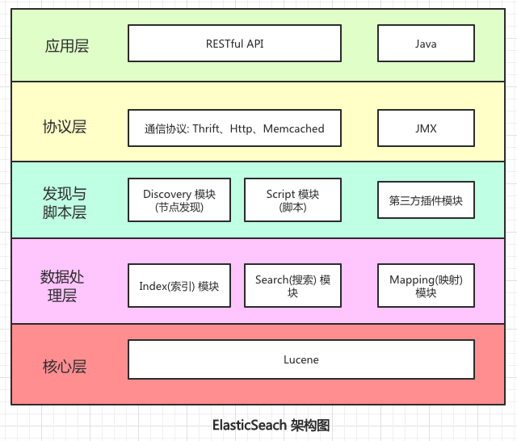

    这是“es”系列的第一篇文章，主要介绍的是ES的架构。

# 一、ES

<code class="red">elasticsearch</code>一个开源的分布式搜索引擎，可以用来实现搜索、日志统计、分析、系统监控等功能.

<!-- more -->

# 二、ES架构

在讨论 ES 架构前，我们先来区分两种类型的架构：

- 一种偏向于开发人员的视角 - 逻辑架构，其中对应索引，文档等概念。
- 一种偏向于运维人员的视角 - 物理架构，如 节点，集群，分片等

## 2.1、物理架构

### 2.1.1、集群

> 集群更多是关于多节点的协作和管理。

ES 作为分布式的系统，可以很好的满足可用性和拓展性。集群是分布式系统中一个常见的概念，<code class="red">在 ES 集群中，是由多个
ES 节点组成</code>。而每个节点具有不同的角色。

如下图，展示的是一个集群中节点的种类：

先着重一些常用节点类型：

| 节点名称	                 | 节点角色                 | 	节点描述                                                                                                              |
|-----------------------|----------------------|--------------------------------------------------------------------------------------------------------------------|
| Master-eligible node	 | master	              | 参加集群的选举，可以成为 master 节点，进而控制整个集群，修改集群的状态                                                                            |
| Data Node	            | data	                | 保存数据的节点，负责保存分片数据，同时执行相关 CRUD，search，agg 操作                                                                         |
| coordinating node	    | 	                    | 默认每个节点都是 coordinating node 节点，接收 client 请求，然后把结果聚合在一起。（实际上分为两个阶段，scatter 节点，会去 data node 请求数据，gather 阶段，把数据组合到一起。） |
| Hot & Warm node	      | data_warm/data_cold	 | 不同硬件配置的 Data Node，用于降低成本。                                                                                          |
| ingest Node           |                      | 预处理节点在索引数据之前可以先对数据做预处理操作，如转换、修改某些字段等。所有节点默认都是支持Ingest操作的，也可以专门讲某个节点配置为ingest节点                                     |

### 2.1.2、ES的分布式架构

> 集群和分布式架构，这两个概念有一定的关联性，但他们的侧重点不同。集群更多是关于多节点的协作和管理，而分布式架构则是关于数据的存储、分片、查询等技术。

核心设计目标

- 水平扩展：通过分片（shard）将数据拆分到多个节点，支持PB级数据存储。
- 负载均衡：请求可并行处理，提升查询和写入性能。
- 容错与冗余：通过副本分片（replica）实现数据冗余，防止数据丢失。

#### 2.1.2.1、关键机制【分片（shard）】

索引被拆分为多个分片，每个分片是一个独立的Lucene索引实现。分片可以是主分片（<code class="red">primary Shard</code>
）或副本分片（<code class="red">Replica Shard</code>)

如上图：假设索引名称是order，代表order索引有4个主分片(红色节点)，每个主分片有2个副本。

**作用：**

- 水平扩展：将数据分散到不同节点，避免单节点性能瓶颈。
- 并行处理：查询或写入请求可同时在多个分片上执行，提升吞吐量。

**分片配置：**

- 分片数在索引创建时确定，不可更改。
- 分片数过多可能导致管理开销增大，过少则限制扩展性。

#### 2.1.2.2、关键机制【副本（replica）】

每个主分片可以要多个副本分片，副本是主分片的完整拷贝。

**作用：**

- 容错性：当主分片所在节点故障时，副本可升级为主分片，保证服务连续性。
- 负载均衡：读请求可由副本分片处理，分散主分片压力。

**副本配置：**

- 副本数量需要根据集群规模和冗余需求设置，通常为1或2个副本。
- 副本过多会增加写入延迟和存储成本。

## 2.2、逻辑架构

### 2.2.1、正向索引

例如有一个商品表（id, title, price）

查询逻辑：

- 输入文档ID -> 输出内容

缺点

- 反向查询效率低：无法直接通过关键词查找相关文档（效率低，例如like语句）

### 2.2.1、倒排索引

倒排索引以<code class="red">关键词为中心</code>，记录每个关键词出现的<code class="red">文档列表及位置信息</code>。

倒排索引中有两个非常重要的概念：

- <code class="red">文档（Document）</code>：用来搜索的数据，其中的每一条数据就是一个文档。例如一个网页、一个商品信息
- <code class="red">词条（Term）</code>：对文档数据或用户搜索数据，利用某种算法分词，得到的具备含义的词语就是词条。例如：我是中国人，就可以分为：我、是、中国人、中国、国人这样的几个词条

### 2.2.2、文档（Document）与字段

elasticsearch是面向文档（Document）存储的，可以是数据库中的一条商品数据，一个订单信息。文档数据会被序列化为json格式后存储在elasticsearch中：

而Json文档中往往包含很多的**字段（Field）**，类似于mysql数据库中的列。

### 2.2.3、索引与映射

> 索引就像数据库里的表，映射就像数据库中定义的表结构

**索引（Index）**，就是相同类型的文档的集合【**类似mysql中的表**】

例如：

- 所有用户文档，就可以组织在一起，称为用户的索引；
- 所有商品的文档，可以组织在一起，称为商品的索引；
- 所有订单的文档，可以组织在一起，称为订单的索引；
  

因此，我们可以把索引当做是数据库中的表。

数据库的表会有约束信息，用来定义表的结构、字段的名称、类型等信息。因此，索引库中就有映射（mapping），是索引中文档的字段约束信息，类似表的结构约束。

我们统一的把mysql与elasticsearch的概念做一下对比：

| MySQL	  | Elasticsearch | 	说明                                                      |
|---------|---------------|----------------------------------------------------------|
| Table	  | Index	        | 索引(index)，就是文档的集合，类似数据库的表(table)                         |
| Row	    | Document	     | 文档（Document），就是一条条的数据，类似数据库中的行（Row），文档都是JSON格式           |
| Column	 | Field	        | 字段（Field），就是JSON文档中的字段，类似数据库中的列（Column）                  |
| Schema	 | Mapping	      | Mapping（映射）是索引中文档的约束，例如字段类型约束。类似数据库的表结构（Schema）          |
| SQL	    | DSL	          | DSL是elasticsearch提供的JSON风格的请求语句，用来操作elasticsearch，实现CRUD |

# 三、ES的结构

ES根据其功能模块和协作逻辑，可以抽象为以下分层架构模型：

## 3.1、应用层

上层业务与ES的集成和扩展。

- **核心功能**
    - 客户端SDK
    - 官方客户端（Java、Python、JS等）封装REST API
- **插件生态**
    - 安全插件（如open distro Security）
- **监控与管理**
    - kibana可视化、ES SQL集成

## 3.2、协议层（protocol & API）

提供外部交互接口和内部节点通信协议。

- **核心功能**
    - **rest API**
        - HTTP协议接口，支持crud操作
    - **transport protocol**
        - 节点间通信协议（如分片数据同步、集群状态更新）
- **关键模块**
    - netty网络框架：处理高并发网络请求

## 3.3、发现与脚本层（Discovery & scripting）

管理集群节点发现、状态同步机脚本执行能力。

- **核心功能**
    - 集群发现
        - 节点间通信协议（如基于Gossip 协议的Zen discovery）
        - 主节点选举、分片分配策略
- **脚本引擎（Scripting）**
    - painless脚本语言
- **关键模块**
    - <code class="red">Cluster service</code>：管理集群元数据
    - <code class="red">script module</code>：脚本解析与执行

## 3.4、数据处理层（Data Processing）

负责数据写入、索引、搜索、聚合等操作的执行逻辑。

- **核心功能**
    - **索引流程**
        - 文档解析 -> 分词 -> 倒排索引构建 -> 写入lucene分段。
    - **搜索流程**
        - 解析查询（Query DSL） -> 分布式查询 ->  结果合并（Reduce阶段） -> 返回客户端
    - **聚合计算**
        - 分布式统计（如Terms Aggregation） -> 结果汇总排序
- **关键模块**
    - **index shard**：数据分片（主分片 + 副本分片）。
    - **Translog**：预写日志，保证写入可靠性。

## 3.5、核心层（Core Engine）

ES的底层基础，直接依赖Apache Lucene实现索引和搜索的核心能力。

- **核心组件**
    - <code class="red">Apache Lucene</code>：负责倒排索引、分词、文档存储、查询执行等核心功能。
    - 分布式协调模块：基于Raft协议实现集群状态管理。

# 四、源码结构

参考文章：
https://www.cnblogs.com/buchizicai/p/17093719.html