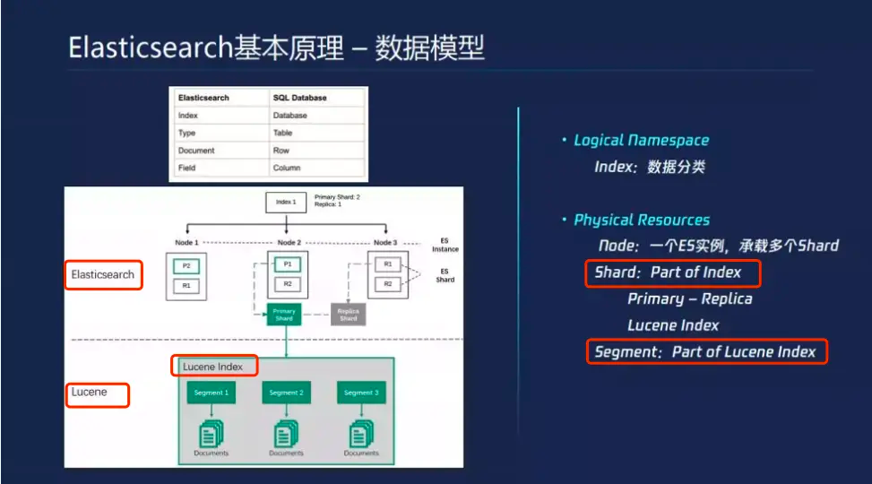
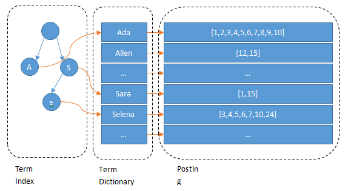
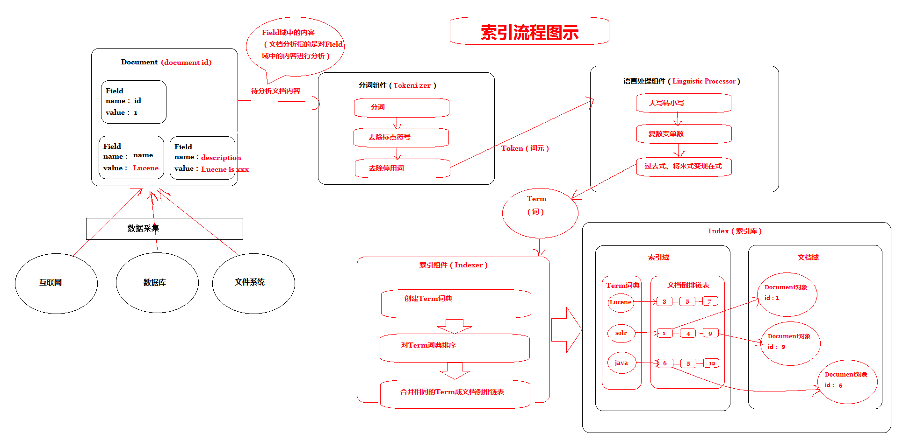
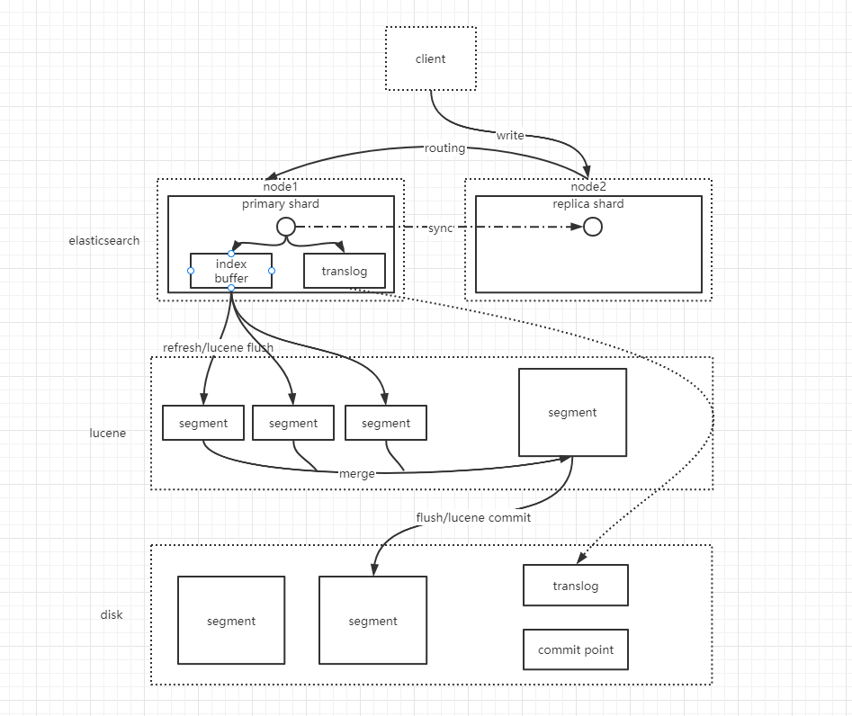
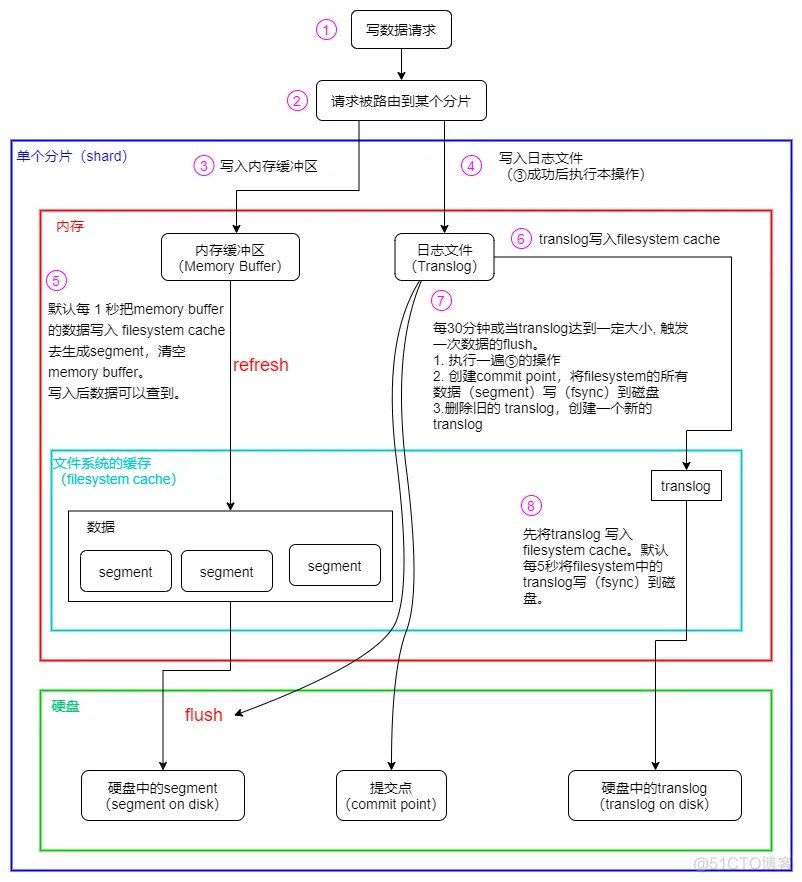
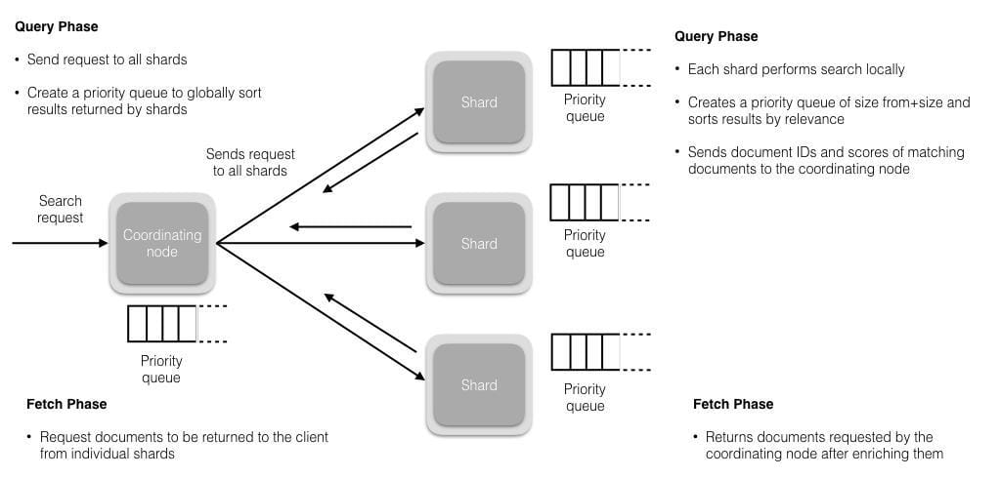

    这是“es”系列的第二篇文章，主要介绍的是ES的数据存储结构及存储流程。

<style>
.my-code {
   color: green;
}
.orange {
   color: rgb(255, 53, 2)
}
.red {
   color: red
}
code {
   color: #6260ff;
}
</style>

# 一、ES

<code class="red">elasticsearch</code>一个开源的分布式搜索引擎，可以用来实现搜索、日志统计、分析、系统监控等功能.

<!-- more -->

# 二、ES存储结构
elasticsearch 的逻辑存储结构可以分为几个层级。
- 索引（Index）
- 分片（Shard）
- 分段（Segment）
- 文档（Document）

## 2.1、索引
索引是ES中最高层级的逻辑存储单元，类似与关系型数据库中的“数据库”，就是我们常说的“倒排索引”

特点：
- 一个索引可以分为多个分片。
- 索引名称必须唯一（如products, logs）。
- 支持动态映射和显示映射。

### 2.1.1、索引创建
通过HTTP API创建，使用PUT请求直接创建索引。
```
PUT /<index_name>
{
    "settings": {
        "number_of_shards": 3,  # 主分片数
        "number_of_replicas": 1  # 副本分片数
    },
    //定义字段映射（mappings）
    "mappings":{
        "properties": {
            "field1": {"type":"text"}, # 字段1
            "field2":{"type":"keyword"} # 字段2
        }
    }
}
```

示例：创建一个名为 products 的索引，包含两个字段
```
PUT /products
{
    "settings": {
        "number_of_shards": 3,  # 主分片数
        "number_of_replicas": 1  # 副本分片数
    },
    //定义字段映射（mappings）
    "mappings":{
        "properties": {
            "name": {"type":"text"}, # 字段1
            "price":{"type":"float"} # 字段2
        }
    }
}
```

> index的创建包括三部分
> 
> 1. settings
> 索引的基本配置，包括分片数，每个分片对应的复制数量，分词器等
> 2. mapping
> 属性的类型及其相关定义
> 3. aliases
> 索引别名的定义


### 2.1.2、插入文档
往索引中插入文档。
```
POST /products/_doc/1
{
    "name":"小米手机",
    "price": 2999,
    "create_at":"2020-06-03T12:00:04Z"
}
```
文档ID为 1


### 2.1.3、Document（文档）
文档是最基本的存储单元，文档类似mysql表中的一行数据。

简单的说在ES中，<code class="red">文档以JSON格式存储，包含字段和值</code>。ES会将文档转换为`Lucene`的存储格式，并写入`分段`中。（文档指的就是一条JSON数据。）

Elasticsearch中文档使用**json格式**存储，因此存储上比Mysql要灵活的多，Elasticsearch支持任意格式的json数据。

例如： 一个订单数据，我们可以将复杂的Json结构保存到Elasticsearch中， mysql的就无法这样存储数据。
```json
{
    "id": 12,
    "status": 1,
    "total_price": 100,
    "create_time": "2019-12-12 12:20:22",
    "user" : { // 嵌套json对象
        "id" : 11,
        "username": "tizi365",
        "phone": "13500001111",
        "address" : "上海长宁区001号"
    }
}
```
文档中的任何json字段都可以作为查询条件。

存储格式：
- **原始文档**：存储在<code class="red">_source</code>字段中，用于返回原始数据。


### 2.1.4、Field(文档字段)
文档由多个json字段（Field）组成， 这里的字段类似mysql中表的字段。

当然Elasticsearch中字段也有类型的，下面是常用的字段类型:
- 数值类型（包括: long、integer、short、byte、double、float）
- text - 支持全文搜索
- keyword - 不支持全文搜索，例如：email、电话这些数据，作为一个整体进行匹配就可以，不需要分词处理。
- date - 日期类型
- boolean


## 2.2、分片（shard）
分片是索引的物理存储单元，分为主分片（primary shard）和副本分片（Replica Shard）。

特点：
- 主分片负责数据写入和查询。
- 副本分片提供高可用性和读取负载均衡。
- 分片数量在索引创建时指定，后续不可修改（除非通过Reindex操作）。

## 2.3、分段（segment）
分片由多个分段组成，分段是lucene的底层存储单元。

特点：
- 分段是不可变的，写入时生成新分段，删除时标记旧分段。
- 分段合并（segment merge）优化存储和查询性能。
- 分段包含倒排索引、正排索引、Doc values等数据结构。


# 三、ES的物理存储
先看一下索引、分片、分段的关联关系

- 如图所示，一个索引，会被分成多个分片并存储在多个DataNode上。
- 一个ES的<code class="red">primary shard</code> 对应`lucence`的索引， `lucence`的索引会被分成多个`segment`.

## 3.1、倒排索引的核心结构
接下来分析倒排索引的结构，倒排索引由以下三部分组成，如下图：
- **词项字典（Term Dictionary）**：存储所有唯一词项（Term）
- **倒排列表（Posting List）**：存储每个词项对应的文档列表及其位置信息。
- **单词索引（Term index）**：term dictionary太大，不适合存入内存，进行优化，所以term index 诞生了
  

查询顺序：term index  -> term dictionary -> posting list


## 3.2、倒排索引的详细组成

### 3.2.1、词项字典（Term Dictionary）
存储所有分词后的唯一词项（如Apple ， 小米）

**数据结构**：通常使用 <code class="red">前缀树（Trie）</code>或 <code class="red">B+树</code> 实现，支持快速查找词项

示例：
```
Term Dictionary:
- apple
- banna
- fruit
```


### 3.2.2、倒排列表（Postings List）
存储每个词项对应的文档列表及其位置信息。

**数据结构**：每个词项对应一个倒排列表，包含以下信息
- **文档ID（DocID）**：包含该词项的文档的唯一标识。
- **词频（Term Frequency，TF）**：词项在文档中出现的次数。
- **位置信息（Positions）**：词项在文档中的具体位置（用于短语查询）。
- **偏移量（offsets）**：词项在文档中的起始和结束位置（用于高亮显示）。

示例：
```
Postings list for "apple"
- DocID: 1, TF: 2, Positions: [0, 5], Offsets: [(0,5), (20,25)]
- DocID: 3, TF: 1, Positions: [10], Offsets: [(30, 35)]
```

## 3.3、存储文件
在Lucene（ES的底层实现）中，倒排索引由多个文件组成，存储在不同的分段（Segment）中。以下为核心文件：

| 文件类型 | 描述                                 |
|------|------------------------------------|
| .fdt | 存储文档的原始内容（_source字段）               |
| .fdx | 正排索引索引文件，用于快速定位.fdt中的文档内容          |
| .tim | 单词字典文件（Term Dictionary），存储所有唯一词项   |
| .tip | 单词索引文件（Term index），用于快速定位.tim中的单词  |
| .doc | 倒排列表文件（Posting List），存储单词对应的文档ID列表 |
| .pos | 位置信息文件（Positions），存储单词在文档中的位置      |
| .pay | 负载信息文件（payLoads），存储单词的附加信息（如权重）    |
| .nvd | 归一化因子文件（norms），存储字段的归一化因子（用于相关性评分） |

ES的数据存储目录（path.data）结构如下：
```
data/
|---- nodes/                                 # 节点数据目录
|---- |---- 0/                               # 节点ID
|     |     |---- indices/                   # 索引数据
|     |     |     |---- my_index/            # 索引名称
|     |     |     |     |---- 0/             # 分片ID
|     |     |     |     |    |---- index/    # lucene 分段文件
|     |     |     |     |    |---- translog  # 预写日志
|     |     |     |     |---- 1/             # 副本分片
|     |     |---- node.lck                   # 节点锁文件
|---- ...
```


# 四、倒排索引的构建流程

1. 文档分词
   1. 对文档内容进行分词（如 i love apple -> [i, love, apple]）
   2. 使用分词器（analyzer）处理停用词、同义词等
2. 生成词项
   1. 将分词结果转换成词项（Term），并记录词项的位置和偏移量。
3. 更新倒排索引
   1. 将词项及其对应的文档信息写入倒排列表。
4. 分段合并
   1. 将多个小分段合并为一个大分段，优化查询性能。


# 五、数据的写入过程

## 5.1、数据写入的核心流程
数据写入过程可以分为以下几个阶段：
1. 客户端请求：客户端发送写入请求到协调节点。
2. 路由与分片：协调节点根据文档ID路由到目标分片
3. 主分片写入：主分片将数据写入Lucene分段，并记录到Translog
4. 副本分片同步：主分片将数据同步到副本分片。
5. 刷新与提交：分段刷新后，数据对搜索可见。


## 5.2、数据写入的详细步骤


### 5.2.1、客户端请求
客户端根据轮询策略，选到一个coordinate Node (上图中为node2)

### 5.2.2、路由与分片
node2（协调节点）对Document ID计算目标分片
```
shard = hash(document_id) % number_of_shards
```
然后将请求转发到目标分片的主分片（primary shard）
- 在es集群中，每个节点都知道主分片节点的信息。

### 5.2.3、主分片写入


1）数据先写入 `memory buffer`，然后定时（`默认每隔1s`）将 memory buffer 中的数据写入一个新的 `segment` 文件中，并进入 Filesystem cache（同时清空 memory buffer），这个过程就叫做 `refresh`；

> `ES 的近实时性`：数据存在 memory buffer 时是搜索不到的，只有数据被 refresh 到 Filesystem cache 之后才能被搜索到，而 refresh 是每秒一次， 所以称 es 是近实时的，可以通过手动调用 es 的 api 触发一次 refresh 操作，让数据马上可以被搜索到；

2）由于 memory Buffer 和 Filesystem Cache 都是基于内存，假设服务器宕机，那么数据就会丢失，所以 ES 通过 translog 日志文件来保证数据的可靠性，在数据写入 memory buffer 的同时，将数据写入 translog 日志文件中，在机器宕机重启时，es 会自动读取 translog 日志文件中的数据，恢复到 memory buffer 和 Filesystem cache 中去。

> `ES 数据丢失的问题`：translog 也是先写入 Filesystem cache，然后默认每隔 5 秒刷一次到磁盘中，所以默认情况下，可能有 5 秒的数据会仅仅停留在 memory buffer 或者 translog 文件的 Filesystem cache中，而不在磁盘上，如果此时机器宕机，会丢失 5 秒钟的数据。也可以将 translog 设置成每次写操作必须是直接 fsync 到磁盘，但是性能会差很多。

3）`flush 操作`：不断重复上面的步骤，translog 会变得越来越大，当 translog 文件默认每30分钟或者 阈值超过 512M 时，就会触发 commit 操作，即 flush操作。
- 将 buffer 中的数据 refresh 到 Filesystem Cache 中去，清空 buffer；
- 创建一个新的 commit point（提交点），同时强行将 Filesystem Cache 中目前所有的数据都 fsync 到磁盘文件中；
- 删除旧的 translog 日志文件并创建一个新的 translog 日志文件，此时 commit 操作完成

### 5.2.4、同步数据值副本分片
ES使用Transport模块实现节点间的通信。主分片通过Transport层调用副本分片的接口，将写入操作同步到副本分片。

主分片将写入操作封装为 ReplicationOperation，通过TransportReplicationAction调用副本分片的接口
```java
public class TransportReplicationAction extends TransportAction<Request, Response> {
   @Override
   protected void doExecute(Request request, ActionListener<Response> listener) {
      // 主分片执行写入操作
      primaryShardReference.perform(request, new ActionListener<Response>() {
         @Override
         public void onResponse(Response response) {
            // 调用副本分片接口
            performOnReplicas(request, response, listener);
         }
      });
   }

   private void performOnReplicas(Request request, Response response, ActionListener<Response> listener) {
      // 发送请求到副本分片
      transportService.sendRequest(replicaNode, actionName, request, new ActionListener<Response>() {
         @Override
         public void onResponse(Response replicaResponse) {
            // 副本分片确认写入成功
            listener.onResponse(replicaResponse);
         }
      });
   }
}
```

ReplicaOperationTransportHandler是用于处理分片操作的Transport层处理器。它的核心方法是 messageReceived，负责接收主分片发送的写入请求，并在副本分片上执行相应的操作（如索引、更新、删除）。
```java
@Override
public void messageReceived(final Request request, final TransportChannel channel, Task task) throws Exception {
   try {
      // 1. 解析请求
      final ShardId shardId = request.shardId();
      final IndexShard replicaShard = getIndexShard(shardId);

      // 2. 执行副本分片操作
      switch (request.opType()) {
         case INDEX:
            replicaShard.applyIndexOperation(request);
            break;
         case UPDATE:
            replicaShard.applyUpdateOperation(request);
            break;
         case DELETE:
            replicaShard.applyDeleteOperation(request);
            break;
         default:
            throw new UnsupportedOperationException("Unsupported operation type: " + request.opType());
      }

      // 3. 返回操作结果
      channel.sendResponse(new Response());
   } catch (Exception e) {
      // 处理异常
      channel.sendResponse(e);
   }
}
```
处理流程：
1. 解析请求
   1. 从请求中解析出操作类型（如索引、更新、删除）和文档内容。
2. 执行副本分片操作
   1. 在副本分片上执行与主分片相同的写入操作。
   2. 操作包括
      1. 写入 `lucene` 分段
      2. 记录 `Translog`
3. 返回操作结果
   1. 将操作结果封装为响应，并通过 `TransportChannel` 返回给主分片

### 

## 5.3、保证数据可靠新

### 5.3.1、translog（记录日志）
ES数据是先写入缓存中，如果在写入数据时ES节点突然宕机可能会造成数据丢失。为保证数据存储的可靠性，当进行文档写操作时会先将文档写入`Lucene`，然后写入一份到`translog`，写入`translog`是落盘的，这样就可以防止服务器宕机后数据的丢失

`translog`会每隔5秒或者在一个变更请求完成之后执行一次`fsync`操作，将`translog`从缓存刷入磁盘。如果对可靠性要求不是很高，也可以设置异步落盘，可以提高性能，由配置`index.translog.durability`和`index.translog.sync_interval`控制。

ES 在写入缓存后，再写入 `translog` 日志文件（因为有可能缓存写入失败，为了减少写入失败回滚的复杂度，因此先写入缓存）。

由于 `translog` 是追加写入，因此性能要比随机写入要好。

### 5.3.2、flush（写入磁盘）
每30分钟或当`translog`达到一定大小(由`index.translog.flush_threshold_size`控制，默认`512mb`), ES会触发一次`flush`操作，此时ES会先执行`refresh`操作将`buffer`中的数据生成`segment`，然后调用`lucene`的`commit`方法将所有内存中的`segment` 写（`fsync`）到磁盘。此时Lucene中的数据就完成了持久化，会清空translog中的数据(6.x版本为了实现sequenceIDs,不删除translog)


# 六、数据的读取过程
数据读取，可以分成2种类型
- 数据读取：读取具体的 document。
- 数据搜索：根据一定条件去搜索数据。


## 6.1、数据读取
1. 客户端发送请求到任意一个node，成为`coordinate node`
2. `coordinate node`对`document`进行路由，将请求转发到对应的`node`，此时会使用`round-robin`随机轮询算法，在`primary  shard`以及其所有`replica`中随机选择一个，让读请求负载均衡
3. 接收请求的`node`返回`document`给`coordinate node`
4. `coordinate node`返回`document`给客户端


## 6.2、数据搜索
ES的搜索过程，可以分成2个流程：`query phase` & `fetch phase`


## 6.1、query phase（查询阶段）
1. 客户端发送请求到任意一个node，成为`coordinate node`
2. `coordinate node`会发送查询请求到所有的 分片shard，并且创建一个`优先级队列`
3. 每个`分片shard`会在本地执行查询请求后会生成一个命中文档的`优先级队列`。
   1. 这个队列是一个排序好的top N数据的列表，它的size等于`from+size`的和，也就是说如果你的from是10，size是10，那么这个队列的size就是20，所以这也是为什么深度分页不能用from+size这种方式，因为from越大，性能就越低。
   2. 分片shard返回 `Document ids` 和`匹配度`给 `coordinate node`

查询阶段结束，得到 `Document ids` 和`文章的匹配度`

## 6.2、fetch phase（读取阶段）
query阶段标识了那些文档满足了该次的search请求，但是我们仍然需要检索回`document整条数据`，这个阶段称为`fetch`。

流程如下：
1. `coordinating 节点`标识了那些document需要被拉取出来，并发送一个批量的mutil get请求到相关的shard上
2. 每个shard加载相关document，如果需要他们将会被返回到coordinating 节点上
3. 一旦所有的document被拉取回来，coordinating节点将会返回结果集到客户端上。


参考文章：
https://www.cnblogs.com/buchizicai/p/17093719.html
https://github.com/jmilktea/jtea/blob/master/elasticsearch/elasticsearch%E5%86%99%E5%85%A5%E5%8E%9F%E7%90%86.md