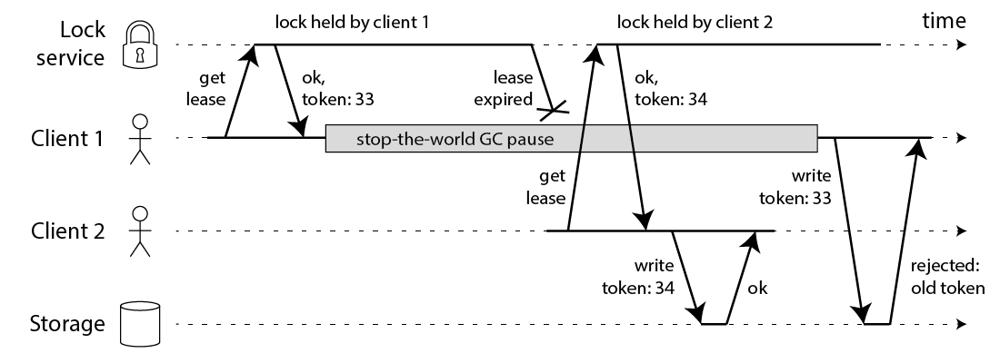
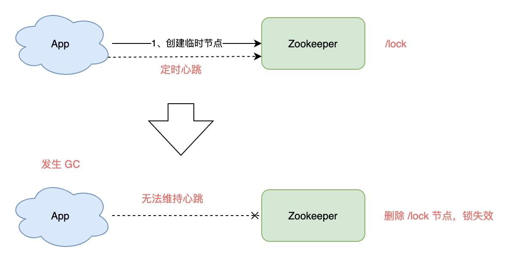

    这是“Redis”系列的第十篇文章，主要介绍的是Redis实现“分布式锁”。

# 一、Redis
<code>Redis（Remote Dictionary Server）</code>是一个开源的内存数据库，遵守 BSD 协议，它提供了一个高性能的键值（key-value）存储系统，常用于缓存、消息队列、会话存储等应用场景。

<!-- more -->

# 二、Redis分布式锁
在分布式系统中，Redis分布式锁用于协调多个进程或服务对共享资源的访问，确保同一时间只有一个客户端可以操作资源。Redis通过其原子性操作（如SETNX和set）实现分布式锁。

## 2.1、命令形式
Redis 2.6.12 之后，Redis 扩展了 SET 命令的参数，用这一条命令就可以了：

<code>SET key value [NX] [XX] [EX <seconds>] [PX <milliseconds>]</code>
- **NX**：Only set the key if it does not already exist.只有值不存在时才设置
- **XX**：Only set the key if it already exist.只有值存在时才设置
- **EX**：过期时间，秒单位
- **PX**：过期时间，毫秒单位

SET 命令用于设置一个 key 对应的 value 值，如果 key 不存在则创建它，如果 key 已经存在则会覆盖它的值。而 SETNX（SET if Not eXists）命令则只有在 key 不存在时才会设置它的值，如果 key 已经存在则不做任何操作。

## 2.2、锁实现方式
使用 SETNX 命令有以下好处：
- 保证原子性：SETNX 命令是原子性的，即只有在 key 不存在时才会执行设置操作，确保了在多线程或多进程并发访问时不会出现竞争条件。
- 避免误操作：SET 命令可能会覆盖已有的 key 值，而 SETNX 命令只在 key 不存在时才会执行设置操作，避免了误操作导致数据丢失的情况。
- 高效性能：由于 SETNX 命令只在 key 不存在时才会执行设置操作，所以它的执行效率比 SET 命令要高。

Redis 官方是不推荐基于 setnx 命令来实现分布式锁的，因为会存在很多问题，
- 锁的高级用法，比如读写锁、可重入锁等等，setnx 都比较难实现
- 需要想尽办法，保证 SETNX 和 EXPIRE 原子性执行，还要考虑各种异常情况如何处理。

### 2.2.1、方案1：setnx + delete
```
setnx lock_a random_value
// do sth
delete lock_a
```
问题
> 一旦服务获取锁之后，因某种原因挂掉，则锁一直无法自动释放。从而导致死锁

### 2.2.2、方案2：setnx + setex + delete
```
setnx lock_a random_value
setex lock_a 10 random_value // 10s超时
// do sth
delete lock_a
```
问题
> 按需设置超时时间。此方案解决了方案1死锁的问题，但同时引入了新的死锁问题：
如果setnx之后，setex 之前服务挂掉，会陷入死锁。
根本原因为 setnx/setex 分为了两个步骤，非原子操作。

### 2.2.3、方案3：set nx px + delete
```
SET lock_a random_value NX PX 10000 // 10s超时
// do sth
delete lock_a
```
此方案通过 set 的 NX/PX 选项，将加锁、设置超时两个步骤合并为一个原子操作，从而解决方案1、2的问题。(PX与EX选项的语义相同，差异仅在单位。)
此方案目前大多数 sdk、redis 部署方案都支持，因此是推荐使用的方式。

问题
>如果<font color=red>锁被错误的释放（如超时）</font>，或被错误的抢占，或因redis问题等导致锁丢失，无法很快的感知到
即线程1还在使用，但是超时了，线程2再次上锁，线程1执行完以后，会导致锁被删除释放

### 2.2.4、方案4：set key randomvalue NX PX + lua
为了解决<font color=red>锁被错误的释放（如超时）</font>的问题，引入了 lua 脚本。
- 解决办法是：客户端在加锁时，设置一个只有自己知道的「唯一标识」进去。
例如，可以是自己的线程 ID，也可以是一个 UUID（随机且唯一），这里我们以 UUID 举例：
```
// 锁的VALUE设置为UUID
127.0.0.1:6379> SET lock $uuid EX 20 NX
OK
```


加锁
```
SET lock_a random_value NX PX 10000
```
解锁

```
eval "if redis.call('get',KEYS[1]) == ARGV[1] then return redis.call('del',KEYS[1]) else return 0 end" 1 lock_a random_value
```
- <code>KEYS[1]</code>：KEYS[1]是 Lua 脚本中传入的参数，表示要操作的键。在这里，就是指锁对应的键
- <code>ARGV[1]</code>：ARGV[1]也是 Lua 脚本中传入的参数，通常存储着客户端设置的一个唯一标识（例如，一个随机生成的字符串或客户端的 ID 等）。当客户端获取锁时，会将这个唯一标识作为值与锁的键一起存储在 Redis 中。

即使因为某些异常导致锁被错误的抢占，也能部分保证锁的正确释放。并且在释放锁时能检测到锁是否被错误抢占、错误释放，从而进行特殊处理。

#### 2.2.4.1、LUA脚本
优点
- 减少网络开销
可以将多个请求通过脚本的形式一次发送，减少网络时延和请求次数
- 原子性的操作
Redis会将整个脚本作为一个整体执行，中间不会被其他命令插入。因此在编写脚本的过程中无需担心会出现竞态条件，无需使用事务
	
语法
```
$ redis-cli --eval path/to/redis.lua KEYS[1] KEYS[2] , ARGV[1] ARGV[2] ...
```
- --eval，告诉redis-cli读取并运行后面的lua脚本
- path/to/redis.lua，是lua脚本的位置
- KEYS[1] KEYS[2]，是要操作的键，可以指定多个，在lua脚本中通过KEYS[1], KEYS[2]获取
- ARGV[1] ARGV[2]，参数，在lua脚本中通过ARGV[1], ARGV[2]获取。

示例：
Eval 命令的基本语法如下：
```
redis 127.0.0.1:6379> EVAL script numkeys key [key ...] arg [arg ...]
redis 127.0.0.1:6379> EVAL "return {KEYS[1],KEYS[2],ARGV[1],ARGV[2]}" 2 key1 key2 first second
```
- <code>2</code>：numkeys，代表2个key
- <code>key1</code>：代表第一个key的名称
- <code>key2</code>：代表第二个key的名称
- <code>first</code>：第一个key的值
- <code>second</code>：第二个key的值


# 三、锁的可重入
SET是不支持重入锁的，但我们需要重入锁，怎么办呢？
- 目前对于redis的重入锁业界还是有很多解决方案的，当前比较流行的就是采用Redisson。
- Redisson是Redis官方推荐的Java版的Redis客户端。 

## 3.1、Redisson是如何实现的了？
```Java
<T> RFuture<T> tryLockInnerAsync(long waitTime, long leaseTime, TimeUnit unit, long threadId, RedisStrictCommand<T> command) {
    return evalWriteAsync(getRawName(), LongCodec.INSTANCE, command,
            "if (redis.call('exists', KEYS[1]) == 0) then " +
                    "redis.call('hincrby', KEYS[1], ARGV[2], 1); " +
                    "redis.call('pexpire', KEYS[1], ARGV[1]); " +
                    "return nil; " +
                    "end; " +
                    "if (redis.call('hexists', KEYS[1], ARGV[2]) == 1) then " +
                    "redis.call('hincrby', KEYS[1], ARGV[2], 1); " +
                    "redis.call('pexpire', KEYS[1], ARGV[1]); " +
                    "return nil; " +
                    "end; " +
                    "return redis.call('pttl', KEYS[1]);",
            Collections.singletonList(getRawName()), unit.toMillis(leaseTime), getLockName(threadId));
}
protected String getLockName(long threadId) {
    return id + ":" + threadId;
}
```
- exists 查询一个key是否存在
EXISTS key [key ...]
返回值
1 如果key存在
0 如果key不存在
- hincrby ：将hash中指定域的值增加给定的数字
  ARGV[2] = 进程ID+系统ID 进行原子自增加1，说明重入次数加1了
- pexpire：设置key的有效时间以毫秒为单位
  再对整个hash设置过期期间
- hexists：判断field是否存在于hash中
- pttl：获取key的有效毫秒数

lua参数解析：
- KEYS[1] = key的值
- ARGV[1]) = 持有锁的时间
- ARGV[2] = getLockName(threadId) 下面id就算系统在启动的时候会全局生成的uuid 来作为当前进程的id，加上线程id就是getLockName(threadId)了，可以理解为：进程ID+系统ID = ARGV[2]


## 3.2、小结
可以使用 Redis hash 结构实现，key 表示被锁的共享资源， hash 结构的 fieldKey 的 value 则保存加锁的次数。

# 四、锁的过期时间
前面我们提到，锁的过期时间如果评估不好，这个锁就会有「提前」过期的风险。

当时给的妥协方案是，尽量「冗余」过期时间，降低锁提前过期的概率。

这个方案其实也不能完美解决问题，那怎么办呢？

是否可以设计这样的方案：**加锁时，先设置一个过期时间，然后我们开启一个「守护线程」，定时去检测这个锁的失效时间，如果锁快要过期了，操作共享资源还未完成，那么就自动对锁进行「续期」，重新设置过期时间。**
- Redisson 是一个 Java 语言实现的 Redis SDK 客户端，在使用分布式锁时，它就采用了「自动续期」的方案来避免锁过期，这个守护线程我们一般也把它叫做「看门狗」线程。

## 4.1、watch dog 看门狗
Redisson看门狗机制， 只要客户端加锁成功，就会启动一个 Watch Dog。
```java
private <T> RFuture<Long> tryAcquireAsync(long leaseTime, TimeUnit unit, long threadId) {
    if (leaseTime != -1) {
        return tryLockInnerAsync(leaseTime, unit, threadId, RedisCommands.EVAL_LONG);
    }
    RFuture<Long> ttlRemainingFuture = tryLockInnerAsync(commandExecutor.getConnectionManager().getCfg().getLockWatchdogTimeout(), TimeUnit.MILLISECONDS, threadId, RedisCommands.EVAL_LONG);
    ttlRemainingFuture.onComplete((ttlRemaining, e) -> {
        if (e != null) {
            return;
        }

        // lock acquired
        if (ttlRemaining == null) {
            scheduleExpirationRenewal(threadId);
        }
    });
    return ttlRemainingFuture;
}
```
- leaseTime 必须是 -1 才会开启 Watch Dog 机制，如果需要开启 Watch Dog 机制就必须使用默认的加锁时间为 30s。
- 如果你自己自定义时间，超过这个时间，锁就会自定释放，并不会自动续期。

### 4.1.1、续期原理
续期原理其实就是用lua脚本，将锁的时间重置为30s
```java
private void scheduleExpirationRenewal(long threadId) {
    ExpirationEntry entry = new ExpirationEntry();
    ExpirationEntry oldEntry = EXPIRATION_RENEWAL_MAP.putIfAbsent(getEntryName(), entry);
    if (oldEntry != null) {
        oldEntry.addThreadId(threadId);
    } else {
        entry.addThreadId(threadId);
        renewExpiration();
    }
}

protected RFuture<Boolean> renewExpirationAsync(long threadId) {
    return commandExecutor.evalWriteAsync(getName(), LongCodec.INSTANCE, RedisCommands.EVAL_BOOLEAN,
            "if (redis.call('hexists', KEYS[1], ARGV[2]) == 1) then " +
                "redis.call('pexpire', KEYS[1], ARGV[1]); " +
                "return 1; " +
            "end; " +
            "return 0;",
        Collections.<Object>singletonList(getName()),
        internalLockLeaseTime, getLockName(threadId));
}
```
Watch Dog 机制其实就是一个后台定时任务线程，获取锁成功之后，会将持有锁的线程放入到一个 <code>RedissonLock.EXPIRATION_RENEWAL_MAP</code>里面，然后每隔 10 秒 （internalLockLeaseTime / 3） 检查一下，如果客户端 还持有锁 key（判断客户端是否还持有 key，其实就是遍历 <code>EXPIRATION_RENEWAL_MAP</code> 里面线程 id 然后根据线程 id 去 Redis 中查，如果存在就会延长 key 的时间），那么就会不断的延长锁 key 的生存时间。

如果服务宕机了，Watch Dog 机制线程也就没有了，此时就不会延长 key 的过期时间，到了 30s 之后就会自动过期了，其他线程就可以获取到锁。


# 五、Redis分布式锁安全吗？
之前分析的场景都是，锁在「单个」Redis 实例中可能产生的问题，并没有涉及到 Redis 的部署架构细节。

而我们在使用 Redis 时，一般会采用主从集群 + 哨兵的模式部署，这样做的好处在于，当主库异常宕机时，哨兵可以实现「故障自动切换」，把从库提升为主库，继续提供服务，以此保证可用性。

那当「主从发生切换」时，这个分布锁会依旧安全吗？

试想这样的场景：
- 客户端 1 在主库上执行 SET 命令，加锁成功
- 此时，主库异常宕机，SET 命令还未同步到从库上（主从复制是异步的）
- 从库被哨兵提升为新主库，这个锁在新的主库上，丢失了！


可见，当引入 Redis 副本后，分布锁还是可能会受到影响。

怎么解决这个问题？

为此，Redis 的作者提出一种解决方案，就是我们经常听到的 <font color=red>**Redlock（红锁）**</font>。

它真的可以解决上面这个问题吗？

## 5.1、Redlock 真的安全吗？
现在我们来看，Redis 作者提出的 <code>Redlock</code> 方案，是如何解决主从切换后，锁失效问题的。

<code>Redlock</code> 的方案基于 2 个前提：
- 不再需要部署**从库**和**哨兵**实例，只部署**主库**
- 但主库要部署多个，官方推荐至少 5 个实例

也就是说，想用使用 Redlock，你至少要部署 5 个 Redis 实例，而且都是主库，它们之间没有任何关系，都是一个个孤立的实例。
> <font color=green>注意：不是部署 Redis Cluster，就是部署 5 个简单的 Redis 实例。</font>


## 5.2、Redlock 具体如何使用呢？

整体的流程是这样的，一共分为 5 步：
1. 客户端先获取「当前时间戳T1」
2. 客户端依次向这 5 个 Redis 实例发起加锁请求（用前面讲到的 SET 命令），且每个请求会设置超时时间（毫秒级，要远小于锁的有效时间），如果某一个实例加锁失败（包括网络超时、锁被其它人持有等各种异常情况），就立即向下一个 Redis 实例申请加锁
3. 如果客户端从 >=3 个（大多数）以上 Redis 实例加锁成功，则再次获取「当前时间戳T2」，如果 T2 - T1 < 锁的过期时间，此时，认为客户端加锁成功，否则认为加锁失败
4. 加锁成功，去操作共享资源（例如修改 MySQL 某一行，或发起一个 API 请求）
5. 加锁失败，向「全部节点」发起释放锁请求（前面讲到的 Lua 脚本释放锁）

我简单帮你总结一下，有 4 个重点：
1. 客户端在多个 Redis 实例上申请加锁
2. 必须保证大多数节点加锁成功
3. 大多数节点加锁的总耗时，要小于锁设置的过期时间
4. 释放锁，要向全部节点发起释放锁请求


## 5.3、Redlock 为什么要这么做。

### 5.3.1、为什么要在多个实例上加锁？

本质上是为了「容错」，部分实例异常宕机，剩余的实例加锁成功，整个锁服务依旧可用。

### 5.3.2、为什么大多数加锁成功，才算成功？

多个 Redis 实例一起来用，其实就组成了一个「分布式系统」。

在分布式系统中，总会出现「异常节点」，所以，在谈论分布式系统问题时，需要考虑异常节点达到多少个，也依旧不会影响整个系统的「正确性」。

这是一个分布式系统「容错」问题，这个问题的结论是：如果只存在「故障」节点，只要大多数节点正常，那么整个系统依旧是可以提供正确服务的。

### 5.3.3、为什么步骤 3 加锁成功后，还要计算加锁的累计耗时？

因为操作的是多个节点，所以耗时肯定会比操作单个实例耗时更久，而且，因为是网络请求，网络情况是复杂的，有可能存在延迟、丢包、超时等情况发生，网络请求越多，异常发生的概率就越大。

所以，即使大多数节点加锁成功，但如果加锁的累计耗时已经「超过」了锁的过期时间，那此时有些实例上的锁可能已经失效了，这个锁就没有意义了。

### 5.3.4、为什么释放锁，要操作所有节点？

在某一个 Redis 节点加锁时，可能因为「网络原因」导致加锁失败。

例如，客户端在一个 Redis 实例上加锁成功，但在读取响应结果时，网络问题导致读取失败，那这把锁其实已经在 Redis 上加锁成功了。

所以，释放锁时，不管之前有没有加锁成功，需要释放「所有节点」的锁，以保证清理节点上「残留」的锁。

好了，明白了 Redlock 的流程和相关问题，看似 Redlock 确实解决了 Redis 节点异常宕机锁失效的问题，保证了锁的「安全性」。


# 六、Redlock 的争论谁对谁错？
Redis 作者把这个方案一经提出，就马上受到业界著名的分布式系统专家的质疑！

这个专家叫 Martin，是英国剑桥大学的一名分布式系统研究员。在此之前他曾是软件工程师和企业家，从事大规模数据基础设施相关的工作。它还经常在大会做演讲，写博客，写书，也是开源贡献者。

他马上写了篇文章，质疑这个 Redlock 的算法模型是有问题的，并对分布式锁的设计，提出了自己的看法。

之后，Redis 作者 Antirez 面对质疑，不甘示弱，也写了一篇文章，反驳了对方的观点，并详细剖析了 Redlock 算法模型的更多设计细节。

而且，关于这个问题的争论，在当时互联网上也引起了非常激烈的讨论。

二人思路清晰，论据充分，这是一场高手过招，也是分布式系统领域非常好的一次思想的碰撞！双方都是分布式系统领域的专家，却对同一个问题提出很多相反的论断，究竟是怎么回事？

## 6.1、分布式专家 Martin 对于 Relock 的质疑
在他的文章中，主要阐述了 4 个论点：

### 6.1.1、分布式锁的目的是什么？

Martin 表示，你必须先清楚你在使用分布式锁的目的是什么？

他认为有两个目的。

第一，效率。

使用分布式锁的互斥能力，是避免不必要地做同样的两次工作（例如一些昂贵的计算任务）。如果锁失效，并不会带来「恶性」的后果，例如发了 2 次邮件等，无伤大雅。

第二，正确性。

使用锁用来防止并发进程互相干扰。如果锁失效，会造成多个进程同时操作同一条数据，产生的后果是数据严重错误、永久性不一致、数据丢失等恶性问题，就像给患者服用重复剂量的药物一样，后果严重。

他认为，如果你是为了前者——效率，那么使用单机版 Redis 就可以了，即使偶尔发生锁失效（宕机、主从切换），都不会产生严重的后果。而使用 Redlock 太重了，没必要。

而如果是为了正确性，Martin 认为 Redlock 根本达不到安全性的要求，也依旧存在锁失效的问题！

### 6.1.2、锁在分布式系统中会遇到的问题
Martin 表示，一个分布式系统，更像一个复杂的「野兽」，存在着你想不到的各种异常情况。

这些异常场景主要包括三大块，这也是分布式系统会遇到的三座大山：NPC。
- N：Network Delay，网络延迟
- P：Process Pause，进程暂停（GC）
- C：Clock Drift，时钟漂移

Martin 用一个进程暂停（GC）的例子，指出了 Redlock 安全性问题：
1. 客户端 1 请求锁定节点 A、B、C、D、E
2. 客户端 1 的拿到锁后，进入 GC（时间比较久）
3. 所有 Redis 节点上的锁都过期了
4. 客户端 2 获取到了 A、B、C、D、E 上的锁
5. 客户端 1 GC 结束，认为成功获取锁
6. 客户端 2 也认为获取到了锁，发生「冲突」

Martin 认为，GC 可能发生在程序的任意时刻，而且执行时间是不可控的。
> 注：当然，即使是使用没有 GC 的编程语言，在发生网络延迟、时钟漂移时，也都有可能导致 Redlock 出现问题，这里 Martin 只是拿 GC 举例。

### 6.1.3、假设时钟正确的是不合理的
又或者，当多个 Redis 节点「时钟」发生问题时，也会导致 Redlock 锁失效。
1. 客户端 1 获取节点 A、B、C 上的锁，但由于网络问题，无法访问 D 和 E
2. 节点 C 上的时钟「向前跳跃」，导致锁到期
3. 客户端 2 获取节点 C、D、E 上的锁，由于网络问题，无法访问 A 和 B
4. 客户端 1 和 2 现在都相信它们持有了锁（冲突）

Martin 觉得，Redlock 必须「强依赖」多个节点的时钟是保持同步的，一旦有节点时钟发生错误，那这个算法模型就失效了。
> 即使 C 不是时钟跳跃，而是「崩溃后立即重启」，也会发生类似的问题。

Martin 继续阐述，机器的时钟发生错误，是很有可能发生的：
- 系统管理员「手动修改」了机器时钟
- 机器时钟在同步 NTP 时间时，发生了大的「跳跃」

总之，Martin 认为，Redlock 的算法是建立在「同步模型」基础上的，有大量资料研究表明，同步模型的假设，在分布式系统中是有问题的。

在混乱的分布式系统的中，你不能假设系统时钟就是对的，所以，你必须非常小心你的假设。

### 6.1.4、提出 fencing token 的方案，保证正确性
相对应的，Martin 提出一种被叫作 fencing token 的方案，保证分布式锁的正确性。

这个模型流程如下：
1. 客户端在获取锁时，锁服务可以提供一个「递增」的 token
2. 客户端拿着这个 token 去操作共享资源
3. 共享资源可以根据 token 拒绝「后来者」的请求


这样一来，无论 NPC 哪种异常情况发生，都可以保证分布式锁的安全性，因为它是建立在「异步模型」上的。

而 Redlock 无法提供类似 fencing token 的方案，所以它无法保证安全性。

他还表示，**一个好的分布式锁，无论 NPC 怎么发生，可以不在规定时间内给出结果，但并不会给出一个错误的结果。也就是只会影响到锁的「性能」（或称之为活性），而不会影响它的「正确性」。**

Martin 的结论：
1. Redlock 不伦不类：它对于效率来讲，Redlock 比较重，没必要这么做，而对于正确性来说，Redlock 是不够安全的。
2. 时钟假设不合理：该算法对系统时钟做出了危险的假设（假设多个节点机器时钟都是一致的），如果不满足这些假设，锁就会失效。
3. 无法保证正确性：Redlock 不能提供类似 fencing token 的方案，所以解决不了正确性的问题。为了正确性，请使用有「共识系统」的软件，例如 Zookeeper。

好了，以上就是 Martin 反对使用 Redlock 的观点，看起来有理有据。

下面我们来看 Redis 作者 Antirez 是如何反驳的。

## 6.2、Redis 作者 Antirez 的反驳
在 Redis 作者的文章中，重点有 3 个：

### 6.2.1、解释时钟问题
首先，Redis 作者一眼就看穿了对方提出的最为核心的问题：时钟问题。

Redis 作者表示，Redlock 并不需要完全一致的时钟，只需要大体一致就可以了，允许有「误差」。

例如要计时 5s，但实际可能记了 4.5s，之后又记了 5.5s，有一定误差，但只要不超过「误差范围」锁失效时间即可，这种对于时钟的精度的要求并不是很高，而且这也符合现实环境。

对于对方提到的「时钟修改」问题，Redis 作者反驳到：
1. 手动修改时钟：不要这么做就好了，否则你直接修改 Raft 日志，那 Raft 也会无法工作…
2. 时钟跳跃：通过「恰当的运维」，保证机器时钟不会大幅度跳跃（每次通过微小的调整来完成），实际上这是可以做到的

> 为什么 Redis 作者优先解释时钟问题？因为在后面的反驳过程中，需要依赖这个基础做进一步解释。

### 6.2.2、解释网络延迟、GC 问题
之后，Redis 作者对于对方提出的，网络延迟wan、进程 GC 可能导致 Redlock 失效的问题，也做了反驳：

我们重新回顾一下，Martin 提出的问题假设：
1. 客户端 1 请求锁定节点 A、B、C、D、E
2. 客户端 1 的拿到锁后，进入 GC
3. 所有 Redis 节点上的锁都过期了
4. 客户端 2 获取节点 A、B、C、D、E 上的锁
5. 客户端 1 GC 结束，认为成功获取锁
6. 客户端 2 也认为获取到锁，发生「冲突」


Redis 作者反驳到，这个假设其实是有问题的，Redlock 是可以保证锁安全的。

这是怎么回事呢？

还记得前面介绍 Redlock 流程的那 5 步吗？这里我再拿过来让你复习一下。
1. 客户端先获取「当前时间戳T1」
2. 客户端依次向这 5 个 Redis 实例发起加锁请求（用前面讲到的 SET 命令），且每个请求会设置超时时间（毫秒级，要远小于锁的有效时间），如果某一个实例加锁失败（包括网络超时、锁被其它人持有等各种异常情况），就立即向下一个 Redis 实例申请加锁
3. 如果客户端从 3 个（大多数）以上 Redis 实例加锁成功，则再次获取「当前时间戳T2」，如果 T2 - T1 < 锁的过期时间，此时，认为客户端加锁成功，否则认为加锁失败
4. 加锁成功，去操作共享资源（例如修改 MySQL 某一行，或发起一个 API 请求）
5. 加锁失败，向「全部节点」发起释放锁请求（前面讲到的 Lua 脚本释放锁）

> 注意，重点是 1-3，在步骤 3，加锁成功后为什么要重新获取「当前时间戳T2」？还用 T2 - T1 的时间，与锁的过期时间做比较？

Redis 作者强调：如果在 1-3 发生了网络延迟、进程 GC 等耗时长的异常情况，那在第 3 步 T2 - T1，是可以检测出来的，如果超出了锁设置的过期时间，那这时就认为加锁会失败，之后释放所有节点的锁就好了！

Redis 作者继续论述，如果对方认为，发生网络延迟、进程 GC 是在步骤 3 之后，也就是客户端确认拿到了锁，去操作共享资源的途中发生了问题，导致锁失效，那这不止是 Redlock 的问题，任何其它锁服务例如 Zookeeper，都有类似的问题，这不在讨论范畴内。

这里我举个例子解释一下这个问题：
1. 客户端通过 Redlock 成功获取到锁（通过了大多数节点加锁成功、加锁耗时检查逻辑）
2. 客户端开始操作共享资源，此时发生网络延迟、进程 GC 等耗时很长的情况
3. 此时，锁过期自动释放
4. 客户端开始操作 MySQL（此时的锁可能会被别人拿到，锁失效）

Redis 作者这里的结论就是：
- 客户端在拿到锁之前，无论经历什么耗时长问题，Redlock 都能够在第 3 步检测出来
- 客户端在拿到锁之后，发生 NPC，那 Redlock、Zookeeper 都无能为力
所以，Redis 作者认为 Redlock 在保证时钟正确的基础上，是可以保证正确性的。


### 6.2.3、质疑 fencing token 机制

Redis 作者对于对方提出的 fencing token 机制，也提出了质疑，主要分为 2 个问题，这里最不宜理解，请跟紧我的思路。

**第一，这个方案必须要求要操作的「共享资源服务器」有拒绝「旧 token」的能力。**

例如，要操作 MySQL，从锁服务拿到一个递增数字的 token，然后客户端要带着这个 token 去改 MySQL 的某一行，这就需要利用 MySQL 的「事物隔离性」来做。
```
// 两个客户端必须利用事物和隔离性达到目的
// 注意 token 的判断条件
UPDATE table T SET val = $new_val, current_token = $token WHERE id = $id AND current_token < $token
```
但如果操作的不是 MySQL 呢？例如向磁盘上写一个文件，或发起一个 HTTP 请求，那这个方案就无能为力了，这对要操作的资源服务器，提出了更高的要求。

也就是说，大部分要操作的资源服务器，都是没有这种互斥能力的。

再者，既然资源服务器都有了「互斥」能力，那还要分布式锁干什么？

所以，Redis 作者认为这个方案是站不住脚的。

**第二，退一步讲，即使 Redlock 没有提供 fencing token 的能力，但 Redlock 已经提供了随机值（就是前面讲的 UUID），利用这个随机值，也可以达到与 fencing token 同样的效果。**

如何做呢？

> Redis 作者只是提到了可以完成 fencing token 类似的功能，但却没有展开相关细节，根据我查阅的资料，大概流程应该如下，如有错误，欢迎交流~​

1. 客户端使用 Redlock 拿到锁
2. 客户端在操作共享资源之前，先把这个锁的 VALUE，在要操作的共享资源上做标记
3. 客户端处理业务逻辑，最后，在修改共享资源时，判断这个标记是否与之前一样，一样才修改（类似 CAS 的思路）

还是以 MySQL 为例，举个例子就是这样的：
1. 客户端使用 Redlock 拿到锁
2. 客户端要修改 MySQL 表中的某一行数据之前，先把锁的 VALUE 更新到这一行的某个字段中（这里假设为 current_token 字段)
3. 客户端处理业务逻辑
4. 客户端修改 MySQL 的这一行数据，把 VALUE 当做 WHERE 条件，再修改
```
UPDATE table T SET val = $new_val WHERE id = $id AND current_token = $redlock_value
```

可见，这种方案依赖 MySQL 的事物机制，也达到对方提到的 fencing token 一样的效果。

但这里还有个小问题，是网友参与问题讨论时提出的：**两个客户端通过这种方案，先「标记」再「检查+修改」共享资源，那这两个客户端的操作顺序无法保证啊？**

而用 Martin 提到的 fencing token，因为这个 token 是单调递增的数字，资源服务器可以拒绝小的 token 请求，保证了操作的「顺序性」！

Redis 作者对于这个问题做了不同的解释，我觉得很有道理，他解释道：**分布式锁的本质，是为了「互斥」，只要能保证两个客户端在并发时，一个成功，一个失败就好了，不需要关心「顺序性」。**

前面 Martin 的质疑中，一直很关心这个顺序性问题，但 Redis 的作者的看法却不同。

综上，Redis 作者的结论：
1. 作者同意对方关于「时钟跳跃」对 Redlock 的影响，但认为时钟跳跃是可以避免的，取决于基础设施和运维。
2. Redlock 在设计时，充分考虑了 NPC 问题，在 Redlock 步骤 3 之前出现 NPC，可以保证锁的正确性，但在步骤 3 之后发生 NPC，不止是 Redlock 有问题，其它分布式锁服务同样也有问题，所以不在讨论范畴内。


讲完了双方对于 Redis 分布锁的争论，你可能也注意到了，Martin 在他的文章中，推荐使用 Zookeeper 实现分布式锁，认为它更安全，确实如此吗？

## 6.3、基于 Zookeeper 的锁安全吗？
如果你有了解过 Zookeeper，基于它实现的分布式锁是这样的：
1. 客户端 1 和 2 都尝试创建「临时节点」，例如 /lock
2. 假设客户端 1 先到达，则加锁成功，客户端 2 加锁失败
3. 客户端 1 操作共享资源
4. 客户端 1 删除 /lock 节点，释放锁

你应该也看到了，Zookeeper 不像 Redis 那样，需要考虑锁的过期时间问题，它是采用了「临时节点」，保证客户端 1 拿到锁后，只要连接不断，就可以一直持有锁。

而且，如果客户端 1 异常崩溃了，那么这个临时节点会自动删除，保证了锁一定会被释放。

不错，没有锁过期的烦恼，还能在异常时自动释放锁，是不是觉得很完美？

其实不然。

思考一下，客户端 1 创建临时节点后，Zookeeper 是如何保证让这个客户端一直持有锁呢？
> 原因就在于，客户端 1 此时会与 Zookeeper 服务器维护一个 Session，这个 Session 会依赖客户端「定时心跳」来维持连接。

如果 Zookeeper 长时间收不到客户端的心跳，就认为这个 Session 过期了，也会把这个临时节点删除。

同样地，基于此问题，我们也讨论一下 GC 问题对 Zookeeper 的锁有何影响：
1. 客户端 1 创建临时节点 /lock 成功，拿到了锁
2. 客户端 1 发生长时间 GC
3. 客户端 1 无法给 Zookeeper 发送心跳，Zookeeper 把临时节点「删除」
4. 客户端 2 创建临时节点 /lock 成功，拿到了锁
5. 客户端 1 GC 结束，它仍然认为自己持有锁（冲突）

可见，即使是使用 Zookeeper，也无法保证进程 GC、网络延迟异常场景下的安全性。

**这就是前面 Redis 作者在反驳的文章中提到的：如果客户端已经拿到了锁，但客户端与锁服务器发生「失联」（例如 GC），那不止 Redlock 有问题，其它锁服务都有类似的问题，Zookeeper 也是一样！**``

所以，这里我们就能得出结论了：<font color=green>**一个分布式锁，在极端情况下，不一定是安全的。**</font>

如果你的业务数据非常敏感，在使用分布式锁时，一定要注意这个问题，不能假设分布式锁 100% 安全。

好，现在我们来总结一下 Zookeeper 在使用分布式锁时优劣：

Zookeeper 的优点：
1. 不需要考虑锁的过期时间
2. watch 机制，加锁失败，可以 watch 等待锁释放，实现乐观锁

但它的劣势是：
1. 性能不如 Redis
2. 部署和运维成本高
3. 客户端与 Zookeeper 的长时间失联，锁被释放问题


# 七、对分布式锁的理解

## 7.1、到底要不要用 Redlock？

前面也分析了，Redlock 只有建立在「时钟正确」的前提下，才能正常工作，如果你可以保证这个前提，那么可以拿来使用。

但保证时钟正确，我认为并不是你想的那么简单就能做到的。

- 第一，从硬件角度来说，时钟发生偏移是时有发生，无法避免的。
例如，CPU 温度、机器负载、芯片材料都是有可能导致时钟发生偏移。
- 第二，从我的工作经历来说，曾经就遇到过时钟错误、运维暴力修改时钟的情况发生，进而影响了系统的正确性，所以，人为错误也是很难完全避免的。

所以，我对 Redlock 的个人看法是，尽量不用它，而且它的性能不如单机版 Redis，部署成本也高，我还是会优先考虑使用 Redis「主从+哨兵」的模式，实现分布式锁。

那正确性如何保证呢？第二点给你答案。

## 7.2、如何正确使用分布式锁？
在分析 Martin 观点时，它提到了 fencing token 的方案，给我了很大的启发，虽然这种方案有很大的局限性，但对于保证「正确性」的场景，是一个非常好的思路。

所以，我们可以把这两者结合起来用：
1. 使用分布式锁，在上层完成「互斥」目的，虽然极端情况下锁会失效，但它可以最大程度把并发请求阻挡在最上层，减轻操作资源层的压力。
2. 但对于要求数据绝对正确的业务，在资源层一定要做好「兜底」，设计思路可以借鉴 fencing token 的方案来做。

两种思路结合，我认为对于大多数业务场景，已经可以满足要求了。

参考文章：
[深度剖析：Redis分布式锁到底安全吗？看完这篇文章彻底懂了！](http://kaito-kidd.com/2021/06/08/is-redis-distributed-lock-really-safe/)