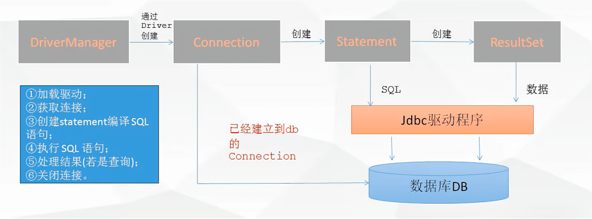

<style>
.orange {
   color: orange
}
.red {
   color: red
}
code {
   color: #0ABF5B;
}
</style>

# 一、数据库连接的重要概念和组件
在 Java 里，数据库连接是与数据库进行交互的基础，涉及到众多重要的概念和组件，以下是详细介绍：

<!-- more -->

# 二、JDBC（Java Database Connectivity）
- **概念**：`JDBC` 是 Java 提供的一套用于**执行 SQL 语句的标准 API**，它为多种关系型数据库提供了统一的访问方式。通过 `JDBC`，`Java` 程序可以与不同的数据库进行通信，执行诸如查询、插入、更新和删除等操作。
- **作用**：作为 `Java` 程序和数据库之间的桥梁，屏蔽了不同数据库之间的差异，使得开发者可以使用统一的 `Java` 代码来操作各种数据库，如 `MySQL、Oracle、SQL Server` 等。

# 三、JDBC的核心类
- `java.sql.Driver`：JDBC驱动程序必须实现的接口，用于建立与数据库的连接。
- `java.sql.DriverManager`：管理`JDBC`驱动程序，负责**获取与数据库的连接**。
- `java.sql.Connection`：表示与数据库的连接，是执行 `SQL` 语句和管理事务的基础。
- `java.sql.Statement`：用于执行静态 `SQL` 语句。它提供了 `execute、executeQuery` 和 `executeUpdate` 等方法。
- `java.sql.PreparedStatement`：`PreparedStatement` 是 `Statement` 的子接口，用于执行预编译的 SQL 语句。
- `javax.sql.DataSource`：数据源，`DataSource` 是 `Java` 提供的一个用于**获取数据库连接**的标准接口。

配合使用的示例：
```java
import java.sql.Connection;
import java.sql.DriverManager;
import java.sql.ResultSet;
import java.sql.Statement;
public class JdbcExample {
    // JDBC URL, 用户名和密码
    private static final String JDBC_URL = "jdbc:mysql://localhost:3306/yourDatabaseName"; // 替换为你的数据库URL
    private static final String JDBC_USER = "yourUsername"; // 替换为你的用户名
    private static final String JDBC_PASSWORD = "yourPassword"; // 替换为你的密码
    public static void main(String[] args) {
        Connection connection = null;
        Statement statement = null;
        ResultSet resultSet = null;
        try {
            // 1. 加载JDBC驱动程序（在新版本的JDBC中这一步通常是自动完成的）
            Class.forName("com.mysql.cj.jdbc.Driver");
            // 2. 建立连接
            connection = DriverManager.getConnection(JDBC_URL, JDBC_USER, JDBC_PASSWORD);
            System.out.println("数据库连接成功！");
            // 3. 创建Statement对象
            statement = connection.createStatement();
            // 4. 执行查询
            String sql = "SELECT id, name FROM yourTableName"; // 替换为你的表名和查询语句
            resultSet = statement.executeQuery(sql);
            // 5. 处理结果集
            while (resultSet.next()) {
                int id = resultSet.getInt("id");
                String name = resultSet.getString("name");
                System.out.println("ID: " + id + ", Name: " + name);
            }
        } catch (Exception e) {
            e.printStackTrace();
        } finally {
            // 6. 关闭资源
            try {
                if (resultSet != null) resultSet.close();
                if (statement != null) statement.close();
                if (connection != null) connection.close();
            } catch (Exception e) {
                e.printStackTrace();
            }
        }
    }
}
```


## 3.1、java.sql.Driver（数据库驱动）
- **作用**：这是所有 `JDBC` 驱动程序必须实现的接口。数据库厂商根据该接口提供具体的实现，用于建立与数据库的连接。在程序中，一般通过 `DriverManager` 来管理和使用这些驱动。
```java
package java.sql;
public interface Driver {
    // 尝试建立与给定数据库URL的连接
    Connection connect(String url, java.util.Properties info) throws SQLException;
}
```
- **接口实现**：以`MySQL`为示例，
```java
//package com.mysql.jdbc;
public class Driver extends com.mysql.cj.jdbc.Driver {
    public Driver() throws SQLException {
        super();
    }
    static {
        System.err.println("Loading class `com.mysql.jdbc.Driver'. This is deprecated. The new driver class is `com.mysql.cj.jdbc.Driver'. "
                + "The driver is automatically registered via the SPI and manual loading of the driver class is generally unnecessary.");
    }
}
//package com.mysql.cj.jdbc;
public class Driver extends NonRegisteringDriver implements java.sql.Driver {
    static {
        try {
            java.sql.DriverManager.registerDriver(new Driver());
        } catch (SQLException E) {
            throw new RuntimeException("Can't register driver!");
        }
    }
}
//package com.mysql.cj.jdbc;
public class NonRegisteringDriver implements java.sql.Driver {
    public static String getOSName() {
        return Constants.OS_NAME;
    }
    public static String getPlatform() {
        return Constants.OS_ARCH;
    }
    static {
        try {
            Class.forName(AbandonedConnectionCleanupThread.class.getName());
        } catch (ClassNotFoundException e) {
            // ignore
        }
    }
    @Override
    public java.sql.Connection connect(String url, Properties info) throws SQLException {
        if (!ConnectionUrl.acceptsUrl(url)) {
          return null;
        }
        ConnectionUrl conStr = ConnectionUrl.getConnectionUrlInstance(url, info);
        switch (conStr.getType()) {
          case SINGLE_CONNECTION:
            return com.mysql.cj.jdbc.ConnectionImpl.getInstance(conStr.getMainHost());
          case FAILOVER_CONNECTION:
          case FAILOVER_DNS_SRV_CONNECTION:
            return FailoverConnectionProxy.createProxyInstance(conStr);
          case LOADBALANCE_CONNECTION:
          case LOADBALANCE_DNS_SRV_CONNECTION:
            return LoadBalancedConnectionProxy.createProxyInstance(conStr);
          case REPLICATION_CONNECTION:
          case REPLICATION_DNS_SRV_CONNECTION:
            return ReplicationConnectionProxy.createProxyInstance(conStr);
          default:
            return null;
        }
    }
}
```


## 3.2、java.sql.DriverManager（数据库驱动管理器）
- **作用**：管理 `JDBC` 驱动程序，负责获取与数据库的连接。它通过 `getConnection` 方法，根据传入的数据库 URL、用户名和密码，选择合适的驱动程序并建立连接。
- 内部通过`registeredDrivers`静态内部属性管理所有的`Driver`驱动，再从集合内获取`Driver`驱动创建`Connection`。
- 加载`DriverManager`类时，执行静态代码块，再执行`loadInitialDrivers()`方法通过`SPI`机制加载所有的`Driver`。`ServiceLoader` 会扫描 `META-INF/services/java.sql.Driver` 文件来查找驱动类。
```java
package java.sql;
public class DriverManager {
  private final static CopyOnWriteArrayList<DriverInfo> registeredDrivers = new CopyOnWriteArrayList<>();
  //静态代码块，加载DriverManager类时会通过SPI机制加载所有的Driver
  static {
    loadInitialDrivers();
    println("JDBC DriverManager initialized");
  }
  private static void loadInitialDrivers() {
    String drivers;
    try {
      drivers = AccessController.doPrivileged(new PrivilegedAction<String>() {
        public String run() {
          return System.getProperty("jdbc.drivers");
        }
      });
    } catch (Exception ex) {
      drivers = null;
    }
    AccessController.doPrivileged(new PrivilegedAction<Void>() {
      public Void run() {
        ServiceLoader<Driver> loadedDrivers = ServiceLoader.load(Driver.class);
        Iterator<Driver> driversIterator = loadedDrivers.iterator();
        try{
          while(driversIterator.hasNext()) {
            driversIterator.next();
          }
        } catch(Throwable t) {
          // Do nothing
        }
        return null;
      }
    });
    println("DriverManager.initialize: jdbc.drivers = " + drivers);
    if (drivers == null || drivers.equals("")) {
      return;
    }
    String[] driversList = drivers.split(":");
    println("number of Drivers:" + driversList.length);
    for (String aDriver : driversList) {
      try {
        println("DriverManager.Initialize: loading " + aDriver);
        Class.forName(aDriver, true, ClassLoader.getSystemClassLoader());
      } catch (Exception ex) {
        println("DriverManager.Initialize: load failed: " + ex);
      }
    }
  }
  
  public static Connection getConnection(String url, String user, String password) throws SQLException {
    java.util.Properties info = new java.util.Properties();
    if (user != null) {
      info.put("user", user);
    }
    if (password != null) {
      info.put("password", password);
    }
    return (getConnection(url, info, Reflection.getCallerClass()));
  }
  private static Connection getConnection(String url, java.util.Properties info, Class<?> caller) throws SQLException {
    for(DriverInfo aDriver : registeredDrivers) {
      if(isDriverAllowed(aDriver.driver, callerCL)) {
        try {
          println("    trying " + aDriver.driver.getClass().getName());
          Connection con = aDriver.driver.connect(url, info);
          if (con != null) {
            // Success!
            println("getConnection returning " + aDriver.driver.getClass().getName());
            return (con);
          }
        } catch (SQLException ex) {
        }
      }
    }
  }
}
```


## 3.3、javax.sql.DataSource（数据源）
`DataSource`数据源，是`JDK1.4`之后提供的用来获得连接的工厂，用来替代`DriverManager`。
```java
package javax.sql;
public interface DataSource  extends CommonDataSource, Wrapper {
  Connection getConnection() throws SQLException;
}
```
示例代码（使用 `DruidDataSource`）
```java
import com.zaxxer.hikari.HikariConfig;
import com.zaxxer.hikari.HikariDataSource;
import java.sql.Connection;
import java.sql.SQLException;
public class DataSourceExample {
  public static void main(String[] args) {
    // 创建DruidDataSource对象
    DruidDataSource dataSource = new DruidDataSource();
    // 配置数据源参数
    dataSource.setUrl("jdbc:mysql://localhost:3306/mydatabase");
    dataSource.setUsername("username");
    dataSource.setPassword("password");
    // 其他性能优化配置
    dataSource.setInitialSize(5);
    dataSource.setMinIdle(5);
    dataSource.setMaxActive(20);
    // 启动连接池
    dataSource.init();
    // 获取数据库连接
    Connection connection = dataSource.getConnection();
    System.out.println("成功获取数据库连接！");
    // 使用完毕后关闭连接
    connection.close();
    // 应用停止时关闭连接池
    dataSource.close();
  }
}
```


## 3.4、java.sql.Connection（数据库连接）
**作用**：表示与数据库的连接，是执行 `SQL` 语句和管理事务的基础。通过 `Connection` 对象可以创建 `Statement、PreparedStatement` 和 `CallableStatement` 对象，还能设置事务的属性（如自动提交、提交和回滚事务）。
```java
package java.sql;
public interface Connection  extends Wrapper, AutoCloseable {
    Statement createStatement() throws SQLException;
    PreparedStatement prepareStatement(String sql) throws SQLException;
}
```


## 3.5、java.sql.Statement（数据库连接）
**作用**：用于执行静态 `SQL` 语句。它提供了 `execute、executeQuery` 和 `executeUpdate` 等方法，分别用于执行任意 `SQL` 语句、查询语句和更新语句（如插入、更新、删除）。
```java
package java.sql;
public interface Statement extends Wrapper, AutoCloseable {
  ResultSet executeQuery(String sql) throws SQLException;
  int executeUpdate(String sql) throws SQLException;
}
```

## 3.6、java.sql.PreparedStatement（数据库连接）
**作用**：`PreparedStatement` 是 `Statement` 的子接口，用于执行预编译的 `SQL` 语句。预编译的 `SQL` 语句可以提高执行效率，并且可以防止 `SQL` 注入攻击。它通过 `?` 占位符来表示参数，使用 `setXxx` 方法设置参数值。
```java
package java.sql;
public interface PreparedStatement extends Statement {
  ResultSet executeQuery() throws SQLException;
  int executeUpdate() throws SQLException;
}
```
`mysql`实现如下：
```java
package com.mysql.jdbc;
public class PreparedStatement extends StatementImpl implements java.sql.PreparedStatement {
  public ResultSet executeQuery() throws SQLException {
    Statement stmt = null;
    try {
      stmt = this.connection.createStatement();
      ((StatementImpl)stmt).executeSimpleNonQuery(this.connection, "SET net_write_timeout=" + this.connection.getNetTimeoutForStreamingResults());
    } finally {
      if (stmt != null) {
        stmt.close();
      }

    }
  }
}
```

## 3.7、ResultSet
**概念**：`ResultSet` 是 Java 中**用于存储 SQL 查询结果的接口**，位于 `java.sql` 包中。它可以看作是一个二维表格，包含了查询结果的所有行和列。通过 `ResultSet` 对象可以遍历查询结果，获取每一行的数据。
```java
package java.sql;
public interface ResultSet extends Wrapper, AutoCloseable {
  int getInt(int columnIndex) throws SQLException;
  long getLong(int columnIndex) throws SQLException;
}
```
示例代码
```java
import java.sql.Connection;
import java.sql.DriverManager;
import java.sql.ResultSet;
import java.sql.Statement;
import java.sql.SQLException;

public class ResultSetExample {
    public static void main(String[] args) {
        String url = "jdbc:mysql://localhost:3306/mydb";
        String user = "root";
        String password = "password";
        try (Connection connection = DriverManager.getConnection(url, user, password);
             Statement statement = connection.createStatement();
             ResultSet resultSet = statement.executeQuery("SELECT * FROM users")) {
            while (resultSet.next()) {
                String username = resultSet.getString("username");
                int age = resultSet.getInt("age");
                System.out.println("Username: " + username + ", Age: " + age);
            }
        } catch (SQLException e) {
            e.printStackTrace();
        }
    }
}
```

# 四、事务管理
**概念**：在 `Java` 中，通过 `Connection` 对象可以进行**事务管理**。事务是一组不可分割的 `SQL` 操作序列，这些操作要么全部执行成功，要么全部不执行。`Java` 提供了 `setAutoCommit()、commit()` 和 `rollback()` 等方法来管理事务。

示例代码:
```java
import java.sql.Connection;
import java.sql.DriverManager;
import java.sql.SQLException;
import java.sql.Statement;

public class TransactionExample {
    public static void main(String[] args) {
        String url = "jdbc:mysql://localhost:3306/mydb";
        String user = "root";
        String password = "password";
        try (Connection connection = DriverManager.getConnection(url, user, password)) {
            // 关闭自动提交
            connection.setAutoCommit(false);
            try (Statement statement = connection.createStatement()) {
                statement.executeUpdate("INSERT INTO users (username, age) VALUES ('John', 25)");
                statement.executeUpdate("UPDATE users SET age = 26 WHERE username = 'John'");
                // 提交事务
                connection.commit();
                System.out.println("Transaction committed successfully!");
            } catch (SQLException e) {
                // 回滚事务
                connection.rollback();
                System.out.println("Transaction rolled back!");
                e.printStackTrace();
            }
        } catch (SQLException e) {
            e.printStackTrace();
        }
    }
}
```

# 五、小结

## 5.1、DriverManager和DataSource
都是在 `Java` 中用于管理数据库连接的机制

| DriverManager                            | DataSource                            |
|------------------------------------------|---------------------------------------|
| 是比较传统的获取数据库连接的方式                         | `JDK1.4`之后提供的用来获得连接的工厂，用来替代`DriverManager`                              |
| 相对简单直接，但在连接管理的灵活性和性能优化方面可能不如 DataSource。 | 提供了更灵活的配置和管理方式，比如可以设置连接的一些属性、池的相关参数等。 |
| 一般不具备连接池的特性，每次获取连接可能都涉及到驱动的初始化等操作。       | 通常与连接池结合使用，可以更好地管理和复用数据库连接，提高性能和效率。             |
	
## 5.2、JDBC使用基本步骤

