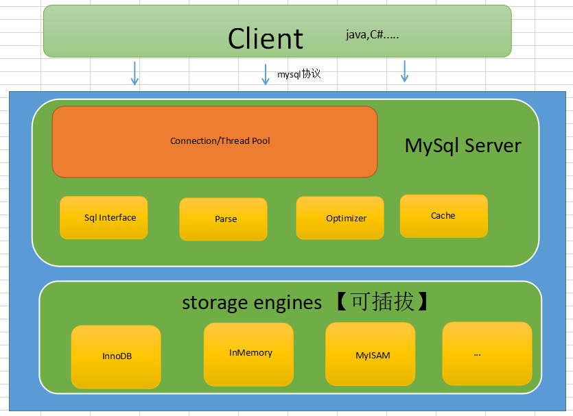
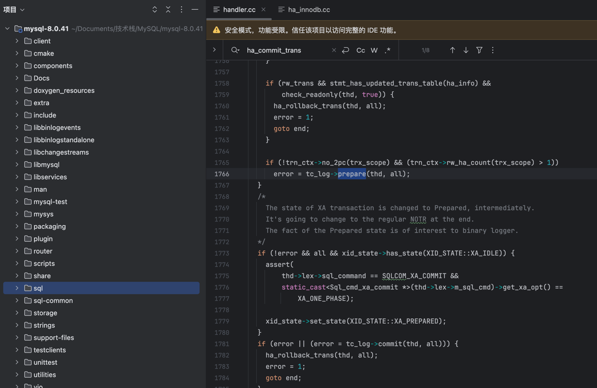

<style>
.orange {
   color: orange
}
.red {
   color: red
}
code {
   color: #0ABF5B;
}
</style>

    这是“mysql”系列的第四篇文章，主要介绍的是部分源码。

# 一、mysql

<code>MySQL</code> 是一种广泛使用的开源关系型数据库管理系统（RDBMS--Relational Database Management System）

<!-- more -->

# 二、源码架构图
首先看一下`MySQL`的源码架构图，主要可以分成三层。


## 2.1、源码结构
下面是8.0.41版本的源码结构图：

MySql其实就两大块，一块是`MySql Server`层，一块就是`Storage Engines`层。
- **<1> Client**：不同语言的`sdk`遵守`mysql`协议就可以与`mysqld`进行互通。
- **<2> Connection/Thread Pool**：`MySql`使用`C++`编写，`Connection`是非常宝贵的，在初始化的时候维护一个池。
- **<3> SqlInterface,Parse,Optimizer,Cache**：对sql处理，解析，优化，缓存等处理和过滤模块，了解了解即可。
- **<4> Storage Engines**：负责存储的模块，官方，第三方。

> MySQL 核心源码主要集中在 `sql` 和 `storage/innobase`，其他文件无需太过关注。


# 三、源码分析 · Performance Schema 初始化过程

`Performance Schema`可以用于监控`MySQL server`在运行过程中的资源消耗、资源等待等情况。在开启该功能后，`MySQL`会收集服务器的运行状态，并将信息记录在`performance_schema`库中对应的`Table`内。用户可通过查看对应的`Table`，了解数据库的运行状态。例如，借助`performance_schema.metadata_locks`表，可以获知当前`MySQL`中`MDL`锁的持有情况。借助`performance_schema.events_stages_current`表，我们可以获知当前`DDL`语句的执行进度。

## 3.1、初始化过程分析
`MySQL`实例的总入口函数是`main()`（位于`sql/main.cc`），内部调用`mysqld_main()`函数（在 `sql/mysqld.cc`）。该函数中，与`Performance Schema`模块初始化相关的函数简化记录如下：
```cpp
// sql/main.cc

extern int mysqld_main(int argc, char **argv);
/* MySQL 服务端程序 mysqld 的入口函数 */
int main(int argc, char **argv)
{
  return mysqld_main(argc, argv);
}
```
- `extern`：声明 `mysqld_main` 函数的原型，表明该函数的定义在其他文件中（通常在 `sql/mysqld.cc`）。实现了**入口函数与核心逻辑的分离**。


## 3.2、`mysqld_main` 函数
在<code>mysqld_main</code> 函数中（`sql/mysqld.cc`文件）。
```cpp
#ifdef _WIN32
int win_main(int argc, char **argv)
#else
int mysqld_main(int argc, char **argv)
#endif //条件编译块结束，此处仅决定函数名
{
//公共代码，方法体
}
```
假设在非windows环境下，将得到如下的**简化代码**：
```cpp
# sql/mysqld.cc, 不包含psi的初始化过程
mysqld_main:
    // 初始化服务器的基础环境
    my_init()
    // 加载my.cnf和my.cnf.d，还有命令行参数
    if (load_defaults(MYSQL_CONFIG_NAME, load_default_groups, &argc, &argv))
        return 1;
    init_sql_statement_names();
    sys_var_init();//系统变量初始化
    init_error_log_mutext();
    mysql_audit_initialize();

    logger.init_base();

    // 读取和设置配置文件和命令行参数，并根据相关参数进行相应的初始化操作，这个函数相当庞大
    if (init_common_variables())
        unireg_abort(1);
    
    my_init_signals();//初始化信号处理 ，注册信号处理函数（如SIGINT、SIGTERM），用于优雅关闭服务
    
    if (init_server_components())
        unireg_abort(1);

    init_ssl();
    // 网络初始化，获取监听地址，监听unix_socket，开始监听
    network_init();
    
    if (mysql_rm_tmp_tables() || 
        acl_init(opt_noacl) ||
        my_tz_init((THD *)0, default_tz_name, opt_bootstrap))
    { ... }

    if (!opt_noacl)
        grant_init();
    if (!opt_bootstrap)    
        servers_init(0);//从mysql库中初始化结构数据 
    
    init_status_vars();
    init_slave();// 初始化slave线程，并开启 

    start_handle_manager();// 开启handler管理线程, handle_manager，线程函数，监听COND_manager信号等

    sql_print_information(...);

    Connection_acceptor::connection_event_loop：开启监听服务。 window会进入setup_conn_event_handler_threads函数，并启动三个单独线程处理不同的连接方式，即Mysqld_socket_listener/Named_pipe_listener/Shared_mem_listener

```

### 3.2.1、my_init()
- 初始化内存分配、线程库、信号处理等。
- 设置程序名称和错误处理。
- `my_thread_global_init`：初始化线程的环境（初始化一堆资源锁）
  - `PSI_mutex_key` 结构
- `my_thread_init`：申请`mysys`线程的内存，主要用于debug

### 3.2.2、配置加载与参数解析
- **加载配置文件**
  - 调用 `load_defaults()`读取配置文件（如`my.cnf`或`mysql.cnf`），合并默认参数和命令行参数。
- **解析命令行参数**
  - 调用 `handler_early_options()` 初始化早期系统变量（如 `--initialize` 选型相关变量）
  - 调用 `init_sql_statement_names()` 注册`SQL`语句类型（如`SELECT、INSERT`对应的枚举值）

### 3.2.3、系统变量与资源初始化
- **系统变量初始化**
  - 调用 `sys_var_init()`将系统变量注册到哈希表中，供后续查询和修改。
- **日志与审计初始化**
  - 调用 `init_error_log_mutex()` 初始化日志互斥锁，确保多线程写入日志时的安全性。
  - 调用 `mysql_audit_initialize()` 初始化审计模块（如记录用户操作日志）。
- **线程与内存管理**
  - 调用 `init_common_variables()` 设置线程缓存大小、日志路径等通用变量。
- **初始化组件**
  - 调用`init_server_components()`，MySQL启动的核心在于初始化各个子系统，确保服务组件就绪


#### 3.2.3.1、init_common_variables
部分代码如下：
```cpp
// 设置数据库默认的存储引擎
#if defined(WITH_INNOBASE_STORAGE_ENGINE) || defined(WITH_XTRADB_STORAGE_ENGINE)
      default_storage_engine= const_cast<char *>("InnoDB");
#else
      default_storage_engine= const_cast<char *>("MyISAM");
#endif
    // 添加show status里的一些变量
    if (add_status_vars(status_vars))
    return 1; 
    
    // 解析命令行参数
    // 根据thread_handling设置thread_scheduler（也就是thd->scheduler)， scheduler实现在sql/scheduler.cc和sql/mysqld.cc，目前有两种模型，one-thread-per-connection和no-threads
    if (get_options(&remaining_argc, &remaining_argv))
        return 1;
    //其他，超级庞大
```

#### 3.2.3.2、init_server_components()
`init_server_components()` 函数负责MySQL核心模块的启动，包括mdl系统，Innodb存储引擎的启动等等：
- **MDL(metadata locking)子系统**
  - **作用**：管理元数据所，确保并发操作（如表结构修改、查询）的正确性。
- **表定义缓存和Hostname缓存**
  - **作用**：加速表结构和主机名的查找。
- **定时器组件**：
  - **作用**：支持超时控制。
- **查询缓存**
  - **作用**：缓存查询结果
- **从属列表（slave list）**
  - **作用**：管理复制拓扑中的从库信息。
- **错误日志**
  - **作用**：记录服务器运行时的错误信息。
- **插件系统**
  - **作用**：支持动态加载存储引擎、认证插件等。
- **存储引擎**（Storage Engines）
  - **作用**：初始化默认存储引擎（如Innodb）
  - 调用 innobase_init() 启动 innodb
- **GTID模块**
  - **作用**：支持基于 GTID 的复制
- **二进制日志**
- **事务两阶段提交**
  - **作用**：协调跨引擎事务的提交/回滚
- **优化器 Cost模块**
  - **作用**：支持查询优化器的成本计算。

总结代码如下：
```plaintext
mysqld_main()
  -> init_server_components()
    -> mdl_init() 
    -> table_def_init()
    -> my_timer_initialize()
    -> gtid_server_init()
    -> plugin_register_builtin_and_init_core_se()
    -> MYSQL_BIN_LOG::open_binlog()
    -> innobase_init()
    -> ...
```

<details style="background-color: #dbdbdb;padding: 10px;">
<summary><strong> init_server_components源码</strong> (点击展开)</summary>

```cpp
/*
* 核心模块
*/
static int init_server_components()
{
  DBUG_ENTER("init_server_components");
  /*
    We need to call each of these following functions to ensure that
    all things are initialized so that unireg_abort() doesn't fail
    需要调用以下每个函数来确保所有内容都已初始化
  */
  // 初始化 mdl 子系统。特别是, 初始化新的全局变量锁和相关的条件变量: LOCK_mdl 和 COND_mdl。
  mdl_init();
  // 初始化 partitioning, 当前只有 PSI Keys。
  partitioning_init();
  // 初始化 table definition cache hash表 和 hostname cache hash表
  if (table_def_init() | hostname_cache_init(host_cache_size))
    unireg_abort(MYSQLD_ABORT_EXIT);
  // 初始化 timer 组件
  if (my_timer_initialize())
    sql_print_error("Failed to initialize timer component (errno %d).", errno);
  else
    have_statement_timeout = SHOW_OPTION_YES;
  // 初始化 query cache
  init_server_query_cache();
  // 随机数模块初始化
  randominit(&sql_rand, (ulong)server_start_time, (ulong)server_start_time / 2);
  // 浮点运算器
  setup_fpu();
#ifdef HAVE_REPLICATION
  // 初始化 slave list
  init_slave_list();
#endif
 
  /* Setup logs */
 
  /*
    Enable old-fashioned error log, except when the user has requested
    help information. Since the implementation of plugin server
    variables the help output is now written much later.
 
    log_error_dest can be:
    disabled_my_option     --log-error was not used or --log-error=
    ""                     --log-error without arguments (no '=')
    filename               --log-error=filename
  */
#ifdef _WIN32
  /*
    Enable the error log file only if console option is not specified
    and --help is not used.
  */
  bool log_errors_to_file = !opt_help && !opt_console;
#else
  /*
    Enable the error log file only if --log-error=filename or --log-error
    was used. Logging to file is disabled by default unlike on Windows.
  */
  // 是否启用 error log
  bool log_errors_to_file = !opt_help && (log_error_dest != disabled_my_option);
#endif
  // 启用 error log
  if (log_errors_to_file)
  {
    // Construct filename if no filename was given by the user.
    // 如果 没有指定 error log filename, 则自动生成
    if (!log_error_dest[0] || log_error_dest == disabled_my_option)
      fn_format(errorlog_filename_buff, pidfile_name, mysql_data_home, ".err",
                MY_REPLACE_EXT); /* replace '.<domain>' by '.err', bug#4997 */
    else
      fn_format(errorlog_filename_buff, log_error_dest, mysql_data_home, ".err",
                MY_UNPACK_FILENAME);
    /*
      log_error_dest may have been set to disabled_my_option or "" if no
      argument was passed, but we need to show the real name in SHOW VARIABLES.
    */
    log_error_dest = errorlog_filename_buff;
    // open error log
    if (open_error_log(errorlog_filename_buff, false))
      unireg_abort(MYSQLD_ABORT_EXIT);
  }
  else
  {
    // We are logging to stderr and SHOW VARIABLES should reflect that.
    // 记录 error log 到 stderr
    log_error_dest = "stderr";
    // Flush messages buffered so far.
    flush_error_log_messages();
  }
    
  enter_cond_hook = thd_enter_cond;
  exit_cond_hook = thd_exit_cond;
  is_killed_hook = (int (*)(const void *))thd_killed;
  // transaction_cache init
  if (transaction_cache_init())
  {
    sql_print_error("Out of memory");
    unireg_abort(MYSQLD_ABORT_EXIT);
  }
 
  /*
    initialize delegates for extension observers, errors have already
    been reported in the function
    初始化各种 xxx_delegate 类型的指针, 为他们分配对象, 对动态插件的支持
  */
  if (delegates_init())
    unireg_abort(MYSQLD_ABORT_EXIT);
 
  /* need to configure logging before initializing storage engines
     在初始化 storage engines 之前需要配置 binlog.
  */
  if (opt_log_slave_updates && !opt_bin_log)
  {
    sql_print_warning("You need to use --log-bin to make "
                      "--log-slave-updates work.");
  }
  if (binlog_format_used && !opt_bin_log)
    sql_print_warning("You need to use --log-bin to make "
                      "--binlog-format work.");
 
  /* Check that we have not let the format to unspecified at this point */
  assert((uint)global_system_variables.binlog_format <=
         array_elements(binlog_format_names) - 1);
 
#ifdef HAVE_REPLICATION
  // replicate_same_server_id
  if (opt_log_slave_updates && replicate_same_server_id)
  {
    if (opt_bin_log)
    {
      sql_print_error("using --replicate-same-server-id in conjunction with \
--log-slave-updates is impossible, it would lead to infinite loops in this \
server.");
      unireg_abort(MYSQLD_ABORT_EXIT);
    }
    else
      sql_print_warning("using --replicate-same-server-id in conjunction with \
--log-slave-updates would lead to infinite loops in this server. However this \
will be ignored as the --log-bin option is not defined.");
  }
#endif
 
  opt_server_id_mask = ~ulong(0);
#ifdef HAVE_REPLICATION
  // 检查 serverid 超长
  opt_server_id_mask = (opt_server_id_bits == 32) ? ~ulong(0) : (1 << opt_server_id_bits) - 1;
  if (server_id != (server_id & opt_server_id_mask))
  {
    sql_print_error("server-id configured is too large to represent with"
                    "server-id-bits configured.");
    unireg_abort(MYSQLD_ABORT_EXIT);
  }
#endif
  //
  if (opt_bin_log)
  {
    /* Reports an error and aborts, if the --log-bin's path
       is a directory.
       --log-bin 指向一个目录
       */
    if (opt_bin_logname &&
        opt_bin_logname[strlen(opt_bin_logname) - 1] == FN_LIBCHAR)
    {
      sql_print_error("Path '%s' is a directory name, please specify \
a file name for --log-bin option",
                      opt_bin_logname);
      unireg_abort(MYSQLD_ABORT_EXIT);
    }
 
    /* Reports an error and aborts, if the --log-bin-index's path
       is a directory.
       --log-bin-index 指向一个目录
    */
    if (opt_binlog_index_name &&
        opt_binlog_index_name[strlen(opt_binlog_index_name) - 1] == FN_LIBCHAR)
    {
      sql_print_error("Path '%s' is a directory name, please specify \
a file name for --log-bin-index option",
                      opt_binlog_index_name);
      unireg_abort(MYSQLD_ABORT_EXIT);
    }
 
    char buf[FN_REFLEN];
    const char *ln;
    ln = mysql_bin_log.generate_name(opt_bin_logname, "-bin", buf);
    if (!opt_bin_logname && !opt_binlog_index_name)
    {
      /*
        User didn't give us info to name the binlog index file.
        Picking `hostname`-bin.index like did in 4.x, causes replication to
        fail if the hostname is changed later. So, we would like to instead
        require a name. But as we don't want to break many existing setups, we
        only give warning, not error.
      */
      sql_print_warning("No argument was provided to --log-bin, and "
                        "--log-bin-index was not used; so replication "
                        "may break when this MySQL server acts as a "
                        "master and has his hostname changed!! Please "
                        "use '--log-bin=%s' to avoid this problem.",
                        ln);
    }
    if (ln == buf)
    {
      my_free(opt_bin_logname);
      opt_bin_logname = my_strdup(key_memory_opt_bin_logname,
                                  buf, MYF(0));
    }
 
    /*
      Skip opening the index file if we start with --help. This is necessary
      to avoid creating the file in an otherwise empty datadir, which will
      cause a succeeding 'mysqld --initialize' to fail.
    */
    if (!opt_help && mysql_bin_log.open_index_file(opt_binlog_index_name, ln, TRUE))
    {
      unireg_abort(MYSQLD_ABORT_EXIT);
    }
  }
 
  if (opt_bin_log)
  {
    /*
      opt_bin_logname[0] needs to be checked to make sure opt binlog name is
      not an empty string, incase it is an empty string default file
      extension will be passed
      log_bin basename 和 log_bin index 检查
     */
    log_bin_basename =
        rpl_make_log_name(key_memory_MYSQL_BIN_LOG_basename,
                          opt_bin_logname, default_logfile_name,
                          (opt_bin_logname && opt_bin_logname[0]) ? "" : "-bin");
    log_bin_index =
        rpl_make_log_name(key_memory_MYSQL_BIN_LOG_index,
                          opt_binlog_index_name, log_bin_basename, ".index");
    if (log_bin_basename == NULL || log_bin_index == NULL)
    {
      sql_print_error("Unable to create replication path names:"
                      " out of memory or path names too long"
                      " (path name exceeds " STRINGIFY_ARG(FN_REFLEN) " or file name exceeds " STRINGIFY_ARG(FN_LEN) ").");
      unireg_abort(MYSQLD_ABORT_EXIT);
    }
  }
 
#ifndef EMBEDDED_LIBRARY
  // reply_log basename & index
  DBUG_PRINT("debug",
             ("opt_bin_logname: %s, opt_relay_logname: %s, pidfile_name: %s",
              opt_bin_logname, opt_relay_logname, pidfile_name));
  /*
    opt_relay_logname[0] needs to be checked to make sure opt relaylog name is
    not an empty string, incase it is an empty string default file
    extension will be passed
   */
  relay_log_basename =
      rpl_make_log_name(key_memory_MYSQL_RELAY_LOG_basename,
                        opt_relay_logname, default_logfile_name,
                        (opt_relay_logname && opt_relay_logname[0]) ? "" : "-relay-bin");
 
  if (relay_log_basename != NULL)
    relay_log_index =
        rpl_make_log_name(key_memory_MYSQL_RELAY_LOG_index,
                          opt_relaylog_index_name, relay_log_basename, ".index");
 
  if (relay_log_basename == NULL || relay_log_index == NULL)
  {
    sql_print_error("Unable to create replication path names:"
                    " out of memory or path names too long"
                    " (path name exceeds " STRINGIFY_ARG(FN_REFLEN) " or file name exceeds " STRINGIFY_ARG(FN_LEN) ").");
    unireg_abort(MYSQLD_ABORT_EXIT);
  }
#endif /* !EMBEDDED_LIBRARY */
 
  /* call ha_init_key_cache() on all key caches to init them
  key cache handle, 仅适用于ISAM 表
  */
  process_key_caches(&ha_init_key_cache);
 
  /* Allow storage engine to give real error messages */
  if (ha_init_errors())
    DBUG_RETURN(1);
 
  if (opt_ignore_builtin_innodb)
    sql_print_warning("ignore-builtin-innodb is ignored "
                      "and will be removed in future releases.");
  // 初始化 GTID server
  if (gtid_server_init())
  {
    sql_print_error("Failed to initialize GTID structures.");
    unireg_abort(MYSQLD_ABORT_EXIT);
  }
 
  /*
    Set tc_log to point to TC_LOG_DUMMY early in order to allow plugin_init()
    to commit attachable transaction after reading from mysql.plugin table.
    If necessary tc_log will be adjusted to point to correct TC_LOG instance
    later.
    tc_log 尽早指向 TC_LOG_DUMMY, 以便允许 plugin_init() 在读取 mysql.plugin 表之后提交附加的事务。
  */
  tc_log = &tc_log_dummy;
 
  /*Load early plugins */
  if (plugin_register_early_plugins(&remaining_argc, remaining_argv,
                                    opt_help ? PLUGIN_INIT_SKIP_INITIALIZATION : 0))
  {
    sql_print_error("Failed to initialize early plugins.");
    unireg_abort(MYSQLD_ABORT_EXIT);
  }
  /* Load builtin plugins, initialize MyISAM, CSV and InnoDB
  注册内置插件, 初始化 MyYSAM, CSV, InnoDB
  核心部分。
  */
  if (plugin_register_builtin_and_init_core_se(&remaining_argc,
                                               remaining_argv))
  {
    sql_print_error("Failed to initialize builtin plugins.");
    unireg_abort(MYSQLD_ABORT_EXIT);
  }
  /*
    Skip reading the plugin table when starting with --help in order
    to also skip initializing InnoDB. This provides a simpler and more
    uniform handling of various startup use cases, e.g. when the data
    directory does not exist, exists but is empty, exists with InnoDB
    system tablespaces present etc.
  */
  // 注册并初始化动态插件。还要初始化尚未初始化的内置插件[MyISAM CSV INNODB 外的其他内置插件]。
  if (plugin_register_dynamic_and_init_all(&remaining_argc, remaining_argv,
                                           (opt_noacl ? PLUGIN_INIT_SKIP_PLUGIN_TABLE : 0) |
                                               (opt_help ? (PLUGIN_INIT_SKIP_INITIALIZATION |
                                                            PLUGIN_INIT_SKIP_PLUGIN_TABLE)
                                                         : 0)))
  {
    sql_print_error("Failed to initialize dynamic plugins.");
    unireg_abort(MYSQLD_ABORT_EXIT);
  }
  plugins_are_initialized = TRUE; /* Don't separate from init function */
  // session_track_system_variables变量检查: 控制server是否跟踪分配给会话系统变量的任务
  Session_tracker session_track_system_variables_check;
  LEX_STRING var_list;
  char *tmp_str;
  size_t len = strlen(global_system_variables.track_sysvars_ptr);
  tmp_str = (char *)my_malloc(PSI_NOT_INSTRUMENTED, len * sizeof(char) + 2,
                              MYF(MY_WME));
  strcpy(tmp_str, global_system_variables.track_sysvars_ptr);
  var_list.length = len;
  var_list.str = tmp_str;
  if (session_track_system_variables_check.server_boot_verify(system_charset_info,
                                                              var_list))
  {
    sql_print_error("The variable session_track_system_variables either has "
                    "duplicate values or invalid values.");
    if (tmp_str)
      my_free(tmp_str);
    unireg_abort(MYSQLD_ABORT_EXIT);
  }
  if (tmp_str)
    my_free(tmp_str);
  /* we do want to exit if there are any other unknown options */
  if (remaining_argc > 1)
  {
    int ho_error;
    struct my_option no_opts[] =
        {
            {0, 0, 0, 0, 0, 0, GET_NO_ARG, NO_ARG, 0, 0, 0, 0, 0, 0}};
    /*
      We need to eat any 'loose' arguments first before we conclude
      that there are unprocessed options.
    */
    my_getopt_skip_unknown = 0;
    // 处理命令行选项
    if ((ho_error = handle_options(&remaining_argc, &remaining_argv, no_opts,
                                   mysqld_get_one_option)))
      unireg_abort(MYSQLD_ABORT_EXIT);
    /* Add back the program name handle_options removes */
    remaining_argc++;
    remaining_argv--;
    my_getopt_skip_unknown = TRUE;
 
    if (remaining_argc > 1)
    {
      sql_print_error("Too many arguments (first extra is '%s').",
                      remaining_argv[1]);
      sql_print_information("Use --verbose --help to get a list "
                            "of available options!");
      unireg_abort(MYSQLD_ABORT_EXIT);
    }
  }
 
  if (opt_help)
    unireg_abort(MYSQLD_SUCCESS_EXIT);
 
  /* if the errmsg.sys is not loaded, terminate to maintain behaviour
  如果 errmsg.sys 未加载, 则中止
  */
  if (!my_default_lc_messages->errmsgs->is_loaded())
  {
    sql_print_error("Unable to read errmsg.sys file");
    unireg_abort(MYSQLD_ABORT_EXIT);
  }
 
  /* We have to initialize the storage engines before CSV logging
  在 CSV logging之前, 我们必须初始化存储引擎
  */
  // 初始化 system database name cache【当前system database 只有 mysql】
  if (ha_init())
  {
    sql_print_error("Can't init databases");
    unireg_abort(MYSQLD_ABORT_EXIT);
  }
   
  if (opt_bootstrap)
    log_output_options = LOG_FILE;
 
  /*
    Issue a warning if there were specified additional options to the
    log-output along with NONE. Probably this wasn't what user wanted.
  */
  if ((log_output_options & LOG_NONE) && (log_output_options & ~LOG_NONE))
    sql_print_warning("There were other values specified to "
                      "log-output besides NONE. Disabling slow "
                      "and general logs anyway.");
 
  if (log_output_options & LOG_TABLE)
  {
    /* Fall back to log files if the csv engine is not loaded. */
    LEX_CSTRING csv_name = {C_STRING_WITH_LEN("csv")};
    if (!plugin_is_ready(csv_name, MYSQL_STORAGE_ENGINE_PLUGIN))
    {
      sql_print_error("CSV engine is not present, falling back to the "
                      "log files");
      log_output_options = (log_output_options & ~LOG_TABLE) | LOG_FILE;
    }
  }
 
  query_logger.set_handlers(log_output_options);
 
  // Open slow log file if enabled.  打开 slow log 文件
  if (opt_slow_log && query_logger.reopen_log_file(QUERY_LOG_SLOW))
    opt_slow_log = false;
 
  // Open general log file if enabled.  打开 general log 文件
  if (opt_general_log && query_logger.reopen_log_file(QUERY_LOG_GENERAL))
    opt_general_log = false;
 
  /*
    Set the default storage engines; 设置默认存储引擎
  */
  // 检查Innodb存储引擎是否初始化
  if (initialize_storage_engine(default_storage_engine, "",
                                &global_system_variables.table_plugin))
    unireg_abort(MYSQLD_ABORT_EXIT);
  // 检查 Innodb 存储引擎
  if (initialize_storage_engine(default_tmp_storage_engine, " temp",
                                &global_system_variables.temp_table_plugin))
    unireg_abort(MYSQLD_ABORT_EXIT);
 
  if (!opt_bootstrap && !opt_noacl)
  {
    std::string disabled_se_str(opt_disabled_storage_engines);
    ha_set_normalized_disabled_se_str(disabled_se_str);
 
    // Log warning if default_storage_engine is a disabled storage engine.
    handlerton *default_se_handle =
        plugin_data<handlerton *>(global_system_variables.table_plugin);
    if (ha_is_storage_engine_disabled(default_se_handle))
      sql_print_warning("default_storage_engine is set to a "
                        "disabled storage engine %s.",
                        default_storage_engine);
 
    // Log warning if default_tmp_storage_engine is a disabled storage engine.
    handlerton *default_tmp_se_handle =
        plugin_data<handlerton *>(global_system_variables.temp_table_plugin);
    if (ha_is_storage_engine_disabled(default_tmp_se_handle))
      sql_print_warning("default_tmp_storage_engine is set to a "
                        "disabled storage engine %s.",
                        default_tmp_storage_engine);
  }
  // 两阶段提交 tc_log
  if (total_ha_2pc > 1 || (1 == total_ha_2pc && opt_bin_log))
  {
    if (opt_bin_log)
      tc_log = &mysql_bin_log;
    else
      tc_log = &tc_log_mmap;
  }
  // init tc_log
  if (tc_log->open(opt_bin_log ? opt_bin_logname : opt_tc_log_file))
  {
    sql_print_error("Can't init tc log");
    unireg_abort(MYSQLD_ABORT_EXIT);
  }
  // before recovery
  (void)RUN_HOOK(server_state, before_recovery, (NULL));
  // xa recovery 操作
  if (ha_recover(0))
  {
    unireg_abort(MYSQLD_ABORT_EXIT);
  }
 
  /// @todo: this looks suspicious, revisit this /sven
  // gtid_mode
  enum_gtid_mode gtid_mode = get_gtid_mode(GTID_MODE_LOCK_NONE);
  // ENFORCE_GTID_CONSISTENCY
  if (gtid_mode == GTID_MODE_ON &&
      _gtid_consistency_mode != GTID_CONSISTENCY_MODE_ON)
  {
    sql_print_error("GTID_MODE = ON requires ENFORCE_GTID_CONSISTENCY = ON.");
    unireg_abort(MYSQLD_ABORT_EXIT);
  }
 
  if (opt_bin_log)
  {
    /*
      Configures what object is used by the current log to store processed
      gtid(s). This is necessary in the MYSQL_BIN_LOG::MYSQL_BIN_LOG to
      corretly compute the set of previous gtids.
       
    */
    assert(!mysql_bin_log.is_relay_log);
    mysql_mutex_t *log_lock = mysql_bin_log.get_log_lock();
    mysql_mutex_lock(log_lock);
    // 打开 binlog 文件
    if (mysql_bin_log.open_binlog(opt_bin_logname, 0,
                                  max_binlog_size, false,
                                  true /*need_lock_index=true*/,
                                  true /*need_sid_lock=true*/,
                                  NULL))
    {
      mysql_mutex_unlock(log_lock);
      unireg_abort(MYSQLD_ABORT_EXIT);
    }
    mysql_mutex_unlock(log_lock);
  }
 
  if (opt_myisam_log)
    (void)mi_log(1);
 
#if defined(HAVE_MLOCKALL) && defined(MCL_CURRENT) && !defined(EMBEDDED_LIBRARY)
  if (locked_in_memory && !getuid())
  {
    if (setreuid((uid_t)-1, 0) == -1)
    { // this should never happen
      sql_print_error("setreuid: %s", strerror(errno));
      unireg_abort(MYSQLD_ABORT_EXIT);
    }
    if (mlockall(MCL_CURRENT))
    {
      sql_print_warning("Failed to lock memory. Errno: %d\n", errno); /* purecov: inspected */
      locked_in_memory = 0;
    }
#ifndef _WIN32
    if (user_info)
      set_user(mysqld_user, user_info);
#endif
  }
  else
#endif
    locked_in_memory = 0;
 
  /* Initialize the optimizer cost module
  初始化优化器成本模块
  */
  init_optimizer_cost_module(true);
  ft_init_stopwords();
  // 初始化 max_user_conns
  init_max_user_conn();
  // 初始化 sql_command_flags 和 server_command_flags 数组。
  init_update_queries();
  DBUG_RETURN(0);
}

```

</details>


### 3.2.4、监听与连接处理

#### 3.2.4.1、Mysqld_socket_listener
Mysqld_socket_listener是MySQL服务器网络初始化的关键部分，其作用是初始化监听器的配置参数，并为后续的套接字绑定和监听操作做准备。
```cpp
static bool network_init(void)
{
    Mysqld_socket_listener *mysqld_socket_listener=
      new (std::nothrow) Mysqld_socket_listener(bind_addr_str,
                                                mysqld_port, back_log,
                                                mysqld_port_timeout,
                                                unix_sock_name);
    if (mysqld_socket_listener == NULL)
      return true;

    mysqld_socket_acceptor=
      new (std::nothrow) Connection_acceptor<Mysqld_socket_listener>(mysqld_socket_listener);
    if (mysqld_socket_acceptor == NULL)
    {
      delete mysqld_socket_listener;
      mysqld_socket_listener= NULL;
      return true;
    }
    // 内部会创建 socket
    if (mysqld_socket_acceptor->init_connection_acceptor())
}
```
#### 3.2.4.2、套接字创建与绑定
```cpp
bool init_connection_acceptor()
  {
    return m_listener->setup_listener();
  }
```
实际的`bind()`和`listen()`操作在 `Mysqld_socket_listener::setup_listener()` 中完成。
```cpp
// socket_connection.cc文件内
bool Mysqld_socket_listener::setup_listener()
{
  // Setup tcp socket listener
  if (m_tcp_port)
  {
    TCP_socket tcp_socket(
        m_bind_addr_str, //绑定的IP地址
        m_tcp_port, // TCP端口号
        m_backlog,  // 未完成连接队列的最大长度
        m_port_timeout); // 端口超时时间（单位：秒）

    MYSQL_SOCKET mysql_socket= tcp_socket.get_listener_socket();
    if (mysql_socket.fd == INVALID_SOCKET)
      return true;

    m_socket_map.insert(std::pair<MYSQL_SOCKET,bool>(mysql_socket, false));
  }
    ....
}
```
`TCP_socket tcp_socket(m_bind_addr_str, m_tcp_port, m_backlog, m_port_timeout);`是MySQL服务器初始化 `TCP` 套接字监听的关键代码，其核心作用是创建和配置一个 `TCP` 监听套接字，用于接收客户端连接请求。

```cpp
// socket_connection.cc文件内
MYSQL_SOCKET get_listener_socket()
{
    // 创建socket
    MYSQL_SOCKET listener_socket= create_socket(ai, AF_INET, &a);
    // 监听 ，listenr()方法
    mysql_socket_listen(listener_socket, static_cast<int>(m_backlog))
}
```

### 3.2.5、开启监听服务
`mysqld_socket_acceptor->connection_event_loop()`是MySQL服务器的核心主循环函数，负责持续监听和处理客户端连接请求。它是MySQL服务启动后进入“等待连接”状态的关键逻辑，确保服务器能够高效地接收和管理客户端连接。

循环结构
```cpp
/**
Connection acceptor loop to accept connections from clients.
*/
void connection_event_loop()
{
    Connection_handler_manager *mgr= Connection_handler_manager::get_instance();
    while (!abort_loop)
    {
        //监听并接受新连接
      Channel_info *channel_info= m_listener->listen_for_connection_event();
      if (channel_info != NULL)
        // 分发连接到连接处理程序
        mgr->process_new_connection(channel_info);
    }
}

```

#### 3.2.5.1、监听逻辑
`listen_for_connection_event()`是`MySQL`服务器处理客户端连接的核心函数之一，其主要功能是监听并接受新连接请求，返回封装了连接信息的 `Channel_info` 对象。
```cpp
Channel_info* Mysqld_socket_listener::listen_for_connection_event()
{
//通过poll() 或 Select() 等多路复用机制，等待 TCP/IP 套接字或UNIX套接字的 POLLIN 事件
int retval= select((int) m_select_info.m_max_used_connection,&m_select_info.m_read_fds, 0, 0, 0);
connect_sock= mysql_socket_accept(key_socket_client_connection, listen_sock,
                                      (struct sockaddr *)(&cAddr), &length);
}
```
当监听到连接请求时，调用 `mysql_socket_accept()` 接受连接，获取已连接套接字描述符。
```cpp
inline_mysql_socket_accept()
{
    socket_accept.fd= accept(socket_listen.fd, addr, &addr_length);
}

```

#### 3.2.5.2、分发连接
`connection_handler_manager.cc`文件下：
```cpp
void
Connection_handler_manager::process_new_connection(Channel_info* channel_info)
{
  if (abort_loop || !check_and_incr_conn_count())
  {
    channel_info->send_error_and_close_channel(ER_CON_COUNT_ERROR, 0, true);
    delete channel_info;
    return;
  }

  if (m_connection_handler->add_connection(channel_info))
  {
    inc_aborted_connects();
    delete channel_info;
  }
}
```
根据当前配置选择 `Connection_handler`。调用 `Connection_handler::add_connection()` 创建或复用线程处理连接。
- 线程管理
  - 单线程模式（--thread-handling=no-threads）:所有连接有主线程串行处理。
  - 多线程模式（默认）
    - 使用线程池（Per_thread_connection_handler)

多线程模式，在 `connection_handler_per_thread.cc`文件下，代码逻辑还是很复杂的
```cpp
bool Per_thread_connection_handler::add_connection(Channel_info* channel_info)
{
  int error= 0;
  my_thread_handle id;

  DBUG_ENTER("Per_thread_connection_handler::add_connection");

  // Simulate thread creation for test case before we check thread cache
  DBUG_EXECUTE_IF("fail_thread_create", error= 1; goto handle_error;);
  // 检查空闲线程并入队
  if (!check_idle_thread_and_enqueue_connection(channel_info))
    DBUG_RETURN(false);

  /*
    There are no idle threads avaliable to take up the new
    connection. Create a new thread to handle the connection
  */
  //创建新线程处理连接
  channel_info->set_prior_thr_create_utime();
  error= mysql_thread_create(key_thread_one_connection, &id,
                             &connection_attrib,
                             handle_connection,
                             (void*) channel_info);
#ifndef NDEBUG
handle_error:
#endif // !NDEBUG
   //线程创建失败处理
  if (error)
  {
    connection_errors_internal++;
    if (!create_thd_err_log_throttle.log())
      sql_print_error("Can't create thread to handle new connection(errno= %d)", error);
    channel_info->send_error_and_close_channel(ER_CANT_CREATE_THREAD,
                                               error, true);
    Connection_handler_manager::dec_connection_count();
    DBUG_RETURN(true);
  }
    // 线程创建成功处理
  Global_THD_manager::get_instance()->inc_thread_created();// 增加已创建线程计数器
  DBUG_PRINT("info",("Thread created"));
  DBUG_RETURN(false);
}
```

MySQL server启动源码还是很长的。
    
参考文章：
[MySQL启动过程详解二：核心模块启动 init_server_components()](https://www.cnblogs.com/juanmaofeifei/p/16111523.html)
[MySQL启动过程详解三：Innodb存储引擎的启动](https://www.cnblogs.com/juanmaofeifei/p/16129144.html)
[MySQL连接的建立与使用](https://www.cnblogs.com/juanmaofeifei/p/16146201.html)
[MySQL 源码解读 -- 连接管理](http://ilongda.com/knowledge/mysql/source_code_reading/server/connection.html)
[MySQL · 源码分析 · 一条insert语句的执行过程](http://mysql.taobao.org/monthly/2017/09/10/)
[读 MySQL 源码再看 INSERT 加锁流程](https://www.aneasystone.com/archives/2018/06/insert-locks-via-mysql-source-code.html)
[MySQL · 源码分析 · Performance Schema 初始化过程](http://mysql.taobao.org/monthly/2021/09/03/)
[MySQL源码阅读1-启动初始化](https://zhuanlan.zhihu.com/p/114149600)