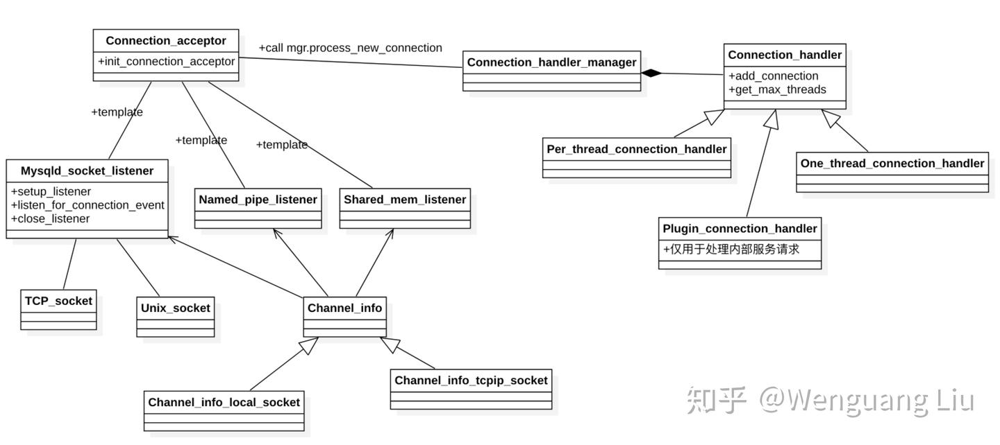
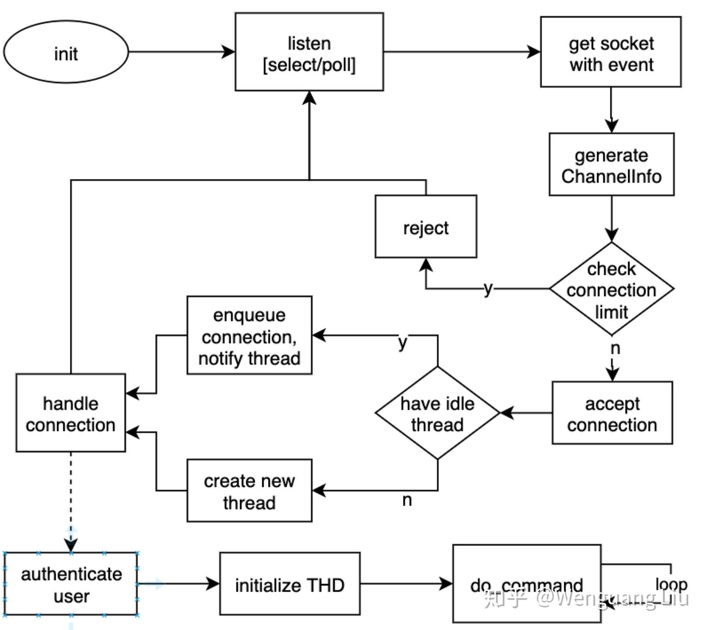

<style>
.orange {
   color: orange
}
.red {
   color: red
}
code {
   color: #0ABF5B;
}
</style>

    这是“mysql”系列的第四篇文章，主要介绍的是部分源码。

# 一、mysql

<code>MySQL</code> 是一种广泛使用的开源关系型数据库管理系统（RDBMS--Relational Database Management System）

<!-- more -->

# 二、连接与线程管理
在上篇的MySQL server启动源码分析中，对连接与线程管理讲解不够详细，本文进行更详细的介绍

`MySQL`初始化完成之后，便进入一个**死循环**中，接受客户端请求，并完成客户端的命令。该篇介绍`MySQL`服务中的连接与线程管理。主要将介绍与连接相关的类与流程。

## 2.1、类图与类之间关系
与连接和线程管理相关的代码主要在`/sql/conn_handler`中，主要包括以下类：
- `Connection_handler_manager`：单例类，用来管理连接处理器；
- `Connection_handler`：连接处理的抽象类，具体实现由其子类实现；
- `Per_thread_connection_handler`：继承了`Connection_handler`，每一个连接用单独的线程处理，默认为该实现，通过thread_handling参数可以设置；
- `One_thread_connection_handler`：继承了Connection_handler，所有连接用同一个线程处理；
- `Plugin_connection_handler`：继承了Connection_handler，支持由Plugin具体实现的handler，例如线程池；
- `Connection_acceptor`：一个模版类，以模版方式支持不同的监听实现（三个listener）。并且提供一个死循环，用以监听连接；
- `Mysqld_socket_listener`：实现以Socket的方式监听客户端的连接事件，并且支持`TCP socket`和`Unix socket`，即对应的TCP_socket和Unix_socket；
- `Shared_mem_listener`：通过共享内存的监听方式；
- `Named_pipe_listener`：通过命名管道来监听和接收客户请求；
- `Channel_info`：连接信道的抽象类，具体实现有`Channel_info_local_socket`和`Channel_info_tcpip_socket`，
- `Channel_info_local_socket`：与本地方式与服务器进行交互；
- `Channel_info_tcpip_socket`：以TCP/IP方式与服务器进行交互；
- `TCP_socket`：TCP socket，与MySQL服务不同机器的连接访问；
- `Unix_socket`：Unix socket，与MySQL服务相同主机的连接访问；

以上为连接管理中用到的类，类之间关系如下图所示。其中，三个`Listener`将作为`Connection_acceptor`模版类作为具体的`Listener`。简单关系就是通过`listener`监听请求，并创建连接`Channel_Info`的具体类，然后通过单例`Connection_handler_manager`指派给具体的`Connection_Handler`进行调度。下面将详细介绍整个流程。


## 2.2、下图是连接处理的流程图。


### 2.2.1、监听处理框架
初始化之后，进入`Connection_acceptor::connection_event_loop`, 以下是（`sql/conn_handler/connection_acceptor.h`）`connection_event_loop`的代码。
```cpp
void connection_event_loop() {
  Connection_handler_manager *mgr = Connection_handler_manager::get_instance();
  while (!connection_events_loop_aborted()) {
    Channel_info *channel_info = m_listener->listen_for_connection_event();
    if (channel_info != NULL) 
      mgr->process_new_connection(channel_info);
  }
}
```
该函数完成的功能就是通过监听客户请求`listen_for_connection_event()`，然后处理请求`process_new_connection()`，其中，`connection_events_loop_aborted()`为一个`flag`函数表示是否被终止；具体是哪个`listener`则是由模版填充。这里主要关注`Mysqld_socket_listener`。

### 2.2.2、Mysqld_socket_listener
在介绍监听之前需要对该`listener`进行初始化，即`setup_listener`函数。具体监听的`socket`列表是在初始化的`setup_listener`中完成的，在`m_socket_map`中第一个存的是`admin socket`，后面跟着是普通的`socket`，具体函数链为：`setup_listener` -> 填充`socket map` -> `setup_connection_events` -> `add_socket_to_listener`。所以`listener`会监听多个`socket`，且`admin`是列表中的第一个`socket`。

#### 2.2.2.1、获取请求
`listen_for_connection_event`监听了fd的连接请求，支持了`poll`或`select`方式，这里没有采用`epoll`的方式，但是这个并不会对`MySQL`的性能有太大的影响，这是因为MySQL的主要瓶颈不在这。
```cpp
Channel_info* Mysqld_socket_listener::listen_for_connection_event()
{
//通过poll() 或 Select() 等多路复用机制，等待 TCP/IP 套接字或UNIX套接字的 POLLIN 事件
int retval= select((int) m_select_info.m_max_used_connection,&m_select_info.m_read_fds, 0, 0, 0);
connect_sock= mysql_socket_accept(key_socket_client_connection, listen_sock,
                                      (struct sockaddr *)(&cAddr), &length);
}
```
在监听到有新请求之后，调用`Mysqld_socket_listener::get_ready_socket`获得已经`ready`的`socket`，具体逻辑如下（对于采用`poll`或`select`均是如是逻辑）：

检查是否有`admin`的`socket`请求，如果有将`admin`的`socket`返回；
否则返回第一个`ready`的`MySQL socket`；

#### 2.2.2.2、接收请求

在获得有效的`socket`之后，进入`accept_connection`，进入`(inline_)mysql_socket_accept`，调用`accept`接收请求。

接到`connect socket`之后，构造一个`Channel_info`，为`Channel_info_local_socket`（为`unix_socket`时，同一机器访问时）或`Channel_info_tcpip_socket（tcp socket时）`，将该对象作为`listen_for_connection_event`的返回值。并且所有与连接的相关的信息都保存在`Channel_info`中。

当然在以上阶段的任一个时候出现错误，那么都将关闭该socket。


### 2.2.3、处理新连接(process_new_connection)
处理新连接的代码逻辑如下：
- 首先检查服务是否已经停止，然后`check_and_incr_conn_count`增加连接计数，如果超过连接上限，那么将拒绝连接，并关闭连接；
- 如果通过，则将该连接请求加到`Connection_handler(Per_thread_connection_handler)`中`add_connection`函数；
```cpp
void Connection_handler_manager::process_new_connection(Channel_info *channel_info) {
  if (connection_events_loop_aborted() ||
  !check_and_incr_conn_count(channel_info->is_admin_connection())) {
    channel_info->send_error_and_close_channel(ER_CON_COUNT_ERROR, 0, true);
    delete channel_info;
    return;
  }
  
  if (m_connection_handler->add_connection(channel_info)) {
    inc_aborted_connects();
    delete channel_info;
  }
}
```
下面是两个函数的具体逻辑。

#### 2.2.3.1、判断连接上限
`check_and_incr_conn_count`中做一个简单的判断，即：
- 当前连接数如果大于设置的最大连接数，并且当前请求不是管理员连接，那么将拒绝；
- 如果没有超过上限，或者是管理员连接，那么将运行连接。也就是说，当连接满了之后，管理员还是可以登陆的。

个人感觉这里存在一个问题，就是假如一开始将最大连接数设置得比较大，如`10000`，并且并发请求量也到达了该数量，但是后续请求量下降了，那么还是会存在`10000`个线程，并不会自动缩小线程个数。

#### 2.2.3.2、add_connection
`connection_handler_per_thread.cc`文件，`add_connection` 是将连接放置线程中，如果有空闲的线程，那么将直接利用空闲的线程；否则将创建一个新的线程来处理新连接。
```cpp
bool Per_thread_connection_handler::add_connection(Channel_info *channel_info) {
  int error = 0;
  my_thread_handle id;
  
  if (!check_idle_thread_and_enqueue_connection(channel_info)) return false;
  
  /*
  There are no idle threads avaliable to take up the new
  connection. Create a new thread to handle the connection
  */
  channel_info->set_prior_thr_create_utime();
  // 创建线程
  error = mysql_thread_create(
    key_thread_one_connection, 
    &id, 
    &connection_attrib,
    handle_connection, 
    (void *)channel_info
  );
  if (error) {
  // 错误处理...
  }
  
  Global_THD_manager::get_instance()->inc_thread_created();
  DBUG_PRINT("info", ("Thread created"));
  return false;
}
```
##### 2.2.3.2.1、`check_idle_thread_and_enqueue_connection` 
做的事情就是检查当前是否有空闲状态的线程；有的话，则将`channel_info`加入到队列中，并向空闲线程发送信号；否则创建新线程，并执行`handle_connection`函数。

##### 2.2.3.2.2、`handle_connection`函数逻辑如下：
- 首先是初始化线程需要的内存；
- 然后创建一个`THD`对象`init_new_thd；`
- 创建/或重用`psi`对象，并加到thd对象；
- 将`thd`对象加到`thd manager`中；
- 调用`thd_prepare_connection`做验证：
```cpp
extern "C" {
  static void *handle_connection(void *arg) {
    Global_THD_manager *thd_manager = Global_THD_manager::get_instance();
    Connection_handler_manager *handler_manager = Connection_handler_manager::get_instance();
    Channel_info *channel_info = static_cast<Channel_info *>(arg);
    bool pthread_reused MY_ATTRIBUTE((unused)) = false;
    
    if (my_thread_init()) { //初始化需要的内存
      // 错误处理
      my_thread_exit(0);
      return NULL;
    }
    
    for (;;) {
      THD *thd = init_new_thd(channel_info);
      if (thd == NULL) {
        // 错误处理...
        break;  // We are out of resources, no sense in continuing.
      }
    
      #ifdef HAVE_PSI_THREAD_INTERFACE
        if (pthread_reused) {
          /*
          Reusing existing pthread:
          Create new instrumentation for the new THD job,
          and attach it to this running pthread.
          */
          PSI_thread *psi = PSI_THREAD_CALL(new_thread)(key_thread_one_connection,
          thd, thd->thread_id());
          PSI_THREAD_CALL(set_thread_os_id)(psi);
          PSI_THREAD_CALL(set_thread)(psi);
        }
      
        /* Find the instrumented thread */
        PSI_thread *psi = PSI_THREAD_CALL(get_thread)();
        /* Save it within THD, so it can be inspected */
        thd->set_psi(psi);
      #endif /* HAVE_PSI_THREAD_INTERFACE */
      mysql_thread_set_psi_id(thd->thread_id());
      mysql_thread_set_psi_THD(thd);
      mysql_socket_set_thread_owner(
      thd->get_protocol_classic()->get_vio()->mysql_socket);
      
      thd_manager->add_thd(thd);
  
      if (thd_prepare_connection(thd))
        handler_manager->inc_aborted_connects();
      else {
        while (thd_connection_alive(thd)) {
          if (do_command(thd)) break;
        }
        end_connection(thd);
      }
      close_connection(thd, 0, false, false);
  
      thd->get_stmt_da()->reset_diagnostics_area();
      thd->release_resources();
      
          // Clean up errors now, before possibly waiting for a new connection.
      #if OPENSSL_VERSION_NUMBER < 0x10100000L
        ERR_remove_thread_state(0);
      #endif /* OPENSSL_VERSION_NUMBER < 0x10100000L */
      thd_manager->remove_thd(thd);
      Connection_handler_manager::dec_connection_count();
      
      #ifdef HAVE_PSI_THREAD_INTERFACE
      /*
      Delete the instrumentation for the job that just completed.
      */
      thd->set_psi(NULL);
      PSI_THREAD_CALL(delete_current_thread)();
      #endif /* HAVE_PSI_THREAD_INTERFACE */
      
      delete thd;
      
      // Server is shutting down so end the pthread.
      if (connection_events_loop_aborted()) break;
  
      channel_info = Per_thread_connection_handler::block_until_new_connection();
      if (channel_info == NULL) break;
      pthread_reused = true;
      if (connection_events_loop_aborted()) {
        // 错误处理
      }
    }
    
    my_thread_end();
    my_thread_exit(0);
    return NULL;
  }
}  // extern "C"
```
  > 调用`thd_prepare_connection->login_connection->check_connection`，验证登陆用户，通过获得客户端ip，做`acl`检查客户主机（`acl_check_host`），通过`vio_keepalive`设置保活；
  > `acl_authenticate`校验客户端，并且更新thd的上下文，包括了字符集和用户名（`parse_com_change_user_packet`）；
  > `do_auth_once`：用指定的`plugin`名去检验用户的权限；并且后面会更新`thd`的用户和账号；检查用户的`acl`，并更新密码锁（`check_and_update_password_lock_state`）；
  > 检查该用户是否能够作为代理用户与其他相关授权检查（`acl_find_proxy_user`）；`ssl`检查；密码是否超时等；检查单个用户是否超过最大连接；
- 如果以上检查全部通过，那么将执行`prepare_new_connection_state`（在`thd_prepare_connection()`方法内部）准备处理用户请求；
  > 检查是否有压缩配置，有的话准备压缩相关上下文；
  > 申请内存，并将动态系统变量复制到线程独享，如字符集/事务设置/最大包等变量；
  > 执行初始化的命令，并处理错误
- 下面便是`do_command(thd)；`执行单条`query`或者`command`，后续会详细介绍该函数的调用栈；
- `end_connection`，关闭一个已经建立的连接，
  - > release_user_connection释放用户连接，并且释放线程回线程池；
- `close_connection`，`disconnect`关闭当前会话的vio；
  - > 退出当前用户，db的限制，acl等上下文
- 释放资源thd中的资源，处理其他信息。
- 最后会等待下一个连接，`Per_thread_connection_handler::block_until_new_connection`，监听接收前面提到的`check_idle_thread_and_enqueue_connection`发过来的信号；

以上便是整个线程和连接的管理流程。
  
参考文章：
[MySQL启动过程详解二：核心模块启动 init_server_components()](https://www.cnblogs.com/juanmaofeifei/p/16111523.html)
[MySQL启动过程详解三：Innodb存储引擎的启动](https://www.cnblogs.com/juanmaofeifei/p/16129144.html)
[MySQL连接的建立与使用](https://www.cnblogs.com/juanmaofeifei/p/16146201.html)
[MySQL 源码解读 -- 连接管理](http://ilongda.com/knowledge/mysql/source_code_reading/server/connection.html)
[MySQL · 源码分析 · 一条insert语句的执行过程](http://mysql.taobao.org/monthly/2017/09/10/)
[读 MySQL 源码再看 INSERT 加锁流程](https://www.aneasystone.com/archives/2018/06/insert-locks-via-mysql-source-code.html)
[MySQL · 源码分析 · Performance Schema 初始化过程](http://mysql.taobao.org/monthly/2021/09/03/)
[MySQL源码阅读1-启动初始化](https://zhuanlan.zhihu.com/p/114149600)
https://zhuanlan.zhihu.com/p/114343815