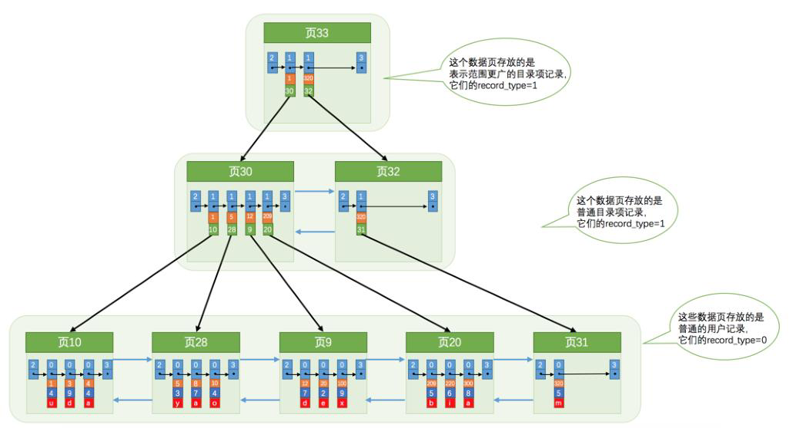
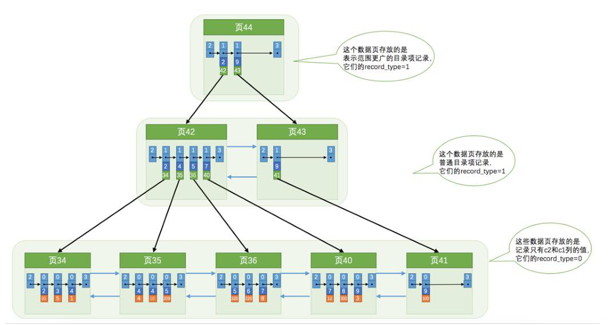
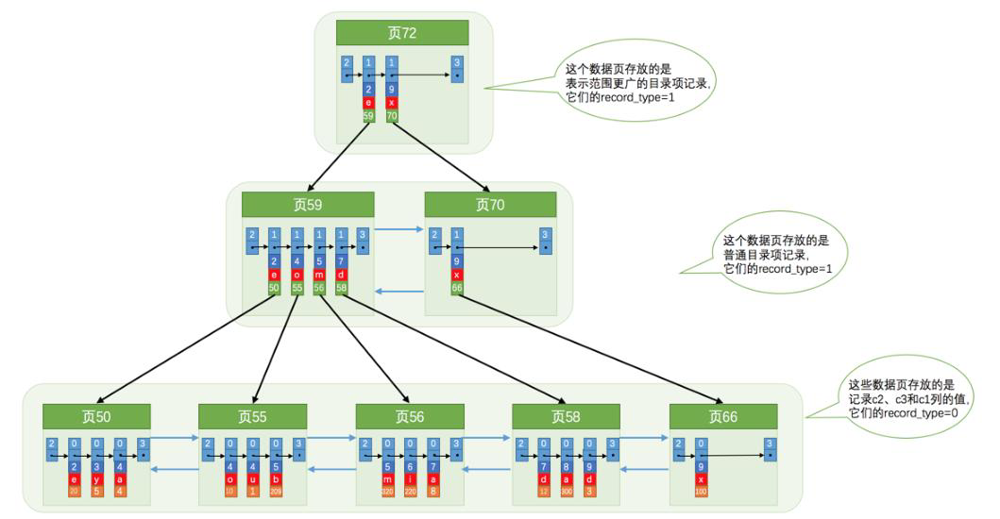
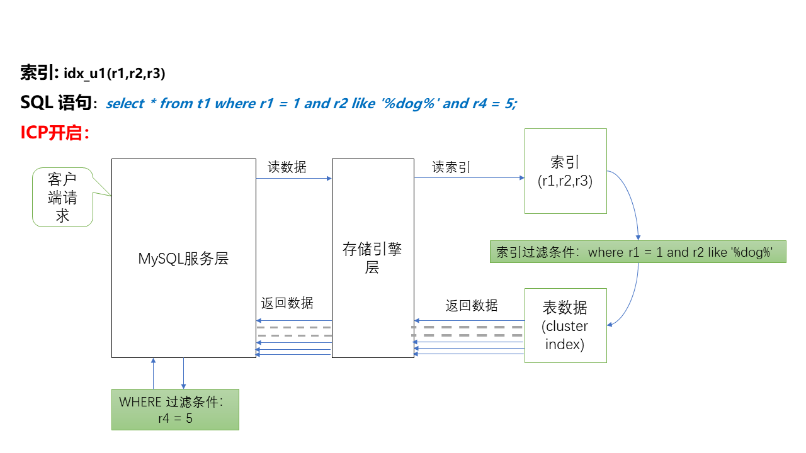

    这是“mysql”系列的第三篇文章，主要介绍的是索引。

<style>
.my-code {
   color: green;
}
.orange {
   color: rgb(255, 53, 2)
}
.red {
   color: red
}
</style>

# 一、mysql

<code>MySQL</code> 是一种广泛使用的开源关系型数据库管理系统（RDBMS--Relational Database Management System）

<!-- more -->
基本结构：


# 二、如果没有索引
对某个列精确匹配查询，SQL如下：
```
select * from table where col1 = xxxx;
```
那这条SQL是怎么查询的呢？

## 2.1、在一个页中查找
假设目前表中的记录比较少，所以的记录都可以放到一个页中，在查找记录的时候可以根据搜索条件的不同分为两种情况：

### 2.1.1、以主键为搜索条件
在 “page Directory（页目录）”中使用二分法快速定位到对应的槽，然后再遍历该槽对应分组中的记录即可快速找到指定的记录。

### 2.1.2、以其他列作为搜索条件
对非主键列的查找过程可就不那么幸运了，因为在数据页中并没有对非主键列建立所谓的“page Directory（页目录）”，所以无法通过二分查找快速定位。

这种情况下，只能从 “最小记录”开始，依次遍历单链表中的每条记录，然后对比每条记录是否符合搜索条件。很显然，这种查询效率非常低的。

## 2.2、在很多页中查找
大部分情况下，我们的表中存储的数据是非常多的，需要很多数据页来存储。

在很多页中查找记录的话可以分为两个步骤：
1. 定位到记录所在的页。
2. 从所在的页内中查找相应的记录。

在没有索引的情况下，不论是根据主键列或者是其他列的值进行查找，由于我们并不能快速的定位到记录所在的页，所以只能从第一个页沿着双向链表一直往下找，在每一个页中根据我们刚刚讲过的查找方式去查找指定的记录。

因为要遍历所有的数据页，所以这种方式是超级耗时的。

为了能够高效完成搜索，引入了“索引”。

# 三、innodb中的索引方案
innodb是怎么区分一条记录是普通的“用户记录”还是“目录项记录”呢？别忘了记录头信息里的<code>record_type</code>属性：
- 0：普通用户记录
- 1：目录项记录（索引）
- 2：最小记录
- 3：最大记录

把使用到的目录项放到数据页中的样子如下：

从图中可以看出来，我们重新分配了一个编号为 30 的页来专门存储 “目录项记录”。这里再强调一遍“目录项记录”和“普通用户记录”的不同点：
- 目录项记录
  - record_type=1。
  - 目录项记录只有“主键值”和“页的编号” 两个列。
- 普通用户记录
  - record_type=0
  - 普通用户记录的列是用户自己定义的，可能包含很多列，另外还有innodb自己添加的隐藏列。

除了上述几点外，这两者就没啥差别了，<font color=green>**它们用的是一样的数据页（页面类型都是Ox45BF，这个属性在File Header中）**</font>

现在以查找主键为 20 的记录为例，根据某个主键值去查找记录的步骤就可以大致拆分成下边两步：
1. 先到存储“目录项记录”的页，也就是页 30 中通过二分法快速定位到对应目录项，因为 12<20<209，所以定位到对应的记录所在的页为 9.
2. 再到存储“用户记录”的 页9 中根据二分法快速定位到主键值为 20 的用户记录。

“目录项记录”的页也只有 16KB，如果一个数据页存储不下，会再分配一个新“目录项记录”页。

如上图，插入一条主键值为320的用户记录，查询分配一个新的页，此时有两个新的数据页。

如果数据量非常多，会为“存储目录项记录”的页生成一个更高级的目录，就像是一个多级目录一样，大目录里嵌套小目录，如下图：


简化一下，可以用下图来描述：

这个像树的结构，称为<font color=green>**“B+树”**</font>

## 3.1、聚簇索引
上边介绍的 B+ 树本身就是一个目录，或者说本身就是一个索引。它有两个特点：
1. 使用记录主键值的大小进行记录和页的排序，这包括三方面的含义：
   1. 页内的记录是按照主键大小顺序排成一个单向链表。
   2. 各个存放用户记录的页，也是根据页中用户记录的主键大小顺序排成一个双向链表。
   3. 存放目录项记录的页分为不同的层次，同一层次中的页也是根据页中目录项记录的主键大小顺序排成一个双向链表。
2. B+ 树的叶子节点存储的是完整的用户记录。

我们把具有这两种特性的 B+ 树称为“聚簇索引”，所有完整的用户记录都存放在这个“聚簇索引”的叶子节点处。

在innodb存储引擎中，聚簇索引 就是数据的存储方式（所有的用户记录都存储在了 叶子节点），也就是所谓的索引即数据，数据即索引。

## 3.2、二级索引
上边介绍的 “聚簇索引” 只能在搜索条件是主键值时才能发挥作用，因为 B+ 树的数据都是按照主键进行排序的。那如果我们想从别的列作为搜索条件该咋办？难道只能从头到尾沿着链表依次遍历记录吗？

解决方案是可以多建几棵 B+ 树，不同的 B+ 树中的数据采用不同的排序规则。比如说我们用c2列的大小作为数据页、页中记录的排序规则，再建一棵 B+ 树，效果如下图：

这棵 B+ 树与上边介绍的聚簇索引有几处不同：
1. 二级索引叶子节点存储的不是完整的用户记录，而只是 “c2列 + 主键” 这两个列的值。
2. 目录项记录中不再是 “主键 + 页号”，而是变成了 “c2列 + 页号”。

如果想通过c2列的值查找某条记录，则可以利用这个二级索引。以查找c2列的值为4的记录为例，查找过程如下：
1. 确定 “目录项记录” 页。
2. 通过 “目录项记录” 页确定用户记录真实所在的页。
3. 在真实存储用户记录的页中定位到具体的记录。（<font color=green>**返回的是主键ID**</font>）
4. <font color=green>**再根据主键值去“聚簇索引”中再查找一遍完整的用户记录**</font>。<font color=red>**（简称回表）**</font>


### 3.2.1、二级索引小结
这种按照 “非主键列” 建立的 B+ 树需要一次 “回表”操作才可以定位到完整的用户记录，所以这种 B+ 树也被称为 “二级索引” 或者 “辅助索引”。

## 3.3、联合索引
我们也可以同时以多个列的大小作为排序规则，也就是同时为多个列建立索引，比如说让 B+ 树按照 c2和c3列的大小进行排序，这个包含两层含义：
1. 先把各个记录和页按照 c2 列进行排序，在记录的 c2 列相同的情况下，采用 c3 列进行排序


- 如图所示：每条 “目录项记录” 都由 “c2、c3、页号”这三个部分组成，各条记录先按 c2 列的值进行排序，如果记录的 c2 列相同，则按照 c3 列的值进行排序。
- B+ 树叶子节点处的用户记录由 “c2、c3、主键c1”组成。


## 3.4、覆盖索引
为了彻底告别 “回表” 操作带来的性能损耗，我们建议：最好在查询列表里只包含索引列。比如这样：
```
select name, birthday, phone_number from person_info where name > 'Asa' and name < 'Barlow';
```
因为我们只查询<code>name, birthday, phone_number</code>这三个索引列的值，所以在通过 <code>idx_name_birthday_phone_number</code> 索引得到结果后就不必到“聚簇索引”中再查找记录的剩余列。


# 四、索引下推（index condition pushdown）
索引下推（<code>INDEX CONDITION PUSHDOWN，简称 ICP</code>）是 MySQL 5.6 发布后针对<font color=green>**扫描二级索引的一项优化改进**</font>。总的来说是通过<font color=red>**把索引过滤条件下推到存储引擎**</font>，来减少 MySQL 存储引擎访问基表的次数以及 MySQL 服务层访问存储引擎的次数。<code>ICP</code> 适用于 <code>MYISAM</code> 和 <code>INNODB</code>。

优点如下：
1. 减少了回表的操作次数。
2. 减少了上传到 MySQL SERVER 层的数据。

接下来，详细看下不适用 ICP、使用 ICP 的详细示例来理清 ICP 的概念。
## 4.1、在不使用 ICP 索引扫描的过程：
MySQL 存储引擎层只把满足索引键值对应的整行表记录一条一条取出，并且上传给 MySQL 服务层。

MySQL 服务层对接收到的数据，使用 SQL 语句后面的 where 条件过滤，直到处理完最后一行记录，再一起返回给客户端。

假设 SQL 语句为：
```
(localhost)|>select * from t1 where r1 = 1 and r2 like '%dog%' and r4 = 5\G
*************************** 1. row ***************************
id: 28965
f1: 81
f2: 89
f3: 100
f4: 35
r1: 1
r2: 12844bda dog 11ea a051 08002753f58d
r3: 17
r4: 5
1 row in set (0.00 sec)
```
关闭 ICP 的处理流程大概如图下：

- 返回的数据，再由执行器进行过滤。

## 4.2、使用 ICP 扫描的过程：
MySQL 存储引擎层，先根据过滤条件中包含的索引键确定索引记区间，再在这个区间的记录上使用包含索引键的其他过滤条件进行过滤，之后规避掉不满足的索引记录，只根据满足条件的索引记录回表取回数据上传到 MySQL 服务层。

MySQL 服务层对接收到的数据，使用 where 子句中不包含索引列的过滤条件做最后的过滤，然后返回数据给客户端。

如下图所示：


上面两张图很明显的对比出开启 ICP 比不开启 ICP 的效率。返回数据这一块虚线表示规避掉的记录，开启 ICP 很明显减少了上传到 MySQL 存储引擎层、MySQL 服务层的记录条数，节省了 IO。

# 五、索引跳跃扫描（index skip scan）
MySQL 8.0.13开始支持，该优化方式<font color=green>**支持那些SQL在不符合组合索引最左前缀的原则**</font>的情况，优化器依然能组使用组合索引。

## 5.1、索引跳跃扫描的原理
索引跳跃扫描通过以下方式解决上述问题：
- **分解查询**：将查询条件分解为多个子查询，每个子查询对应前导列的一个唯一值。
- **合并结果**：将每个子查询的结果合并，得到最终结果。

### 5.1.1、分解查询
当数据库引擎遇到一个查询，只指定了复合索引中非最左侧的字段（例如对于<code>索引 Index(A, B, C)</code>，查询条件为 WHERE B =?）时，Index Skip Scan 开始发挥作用
		
数据库会根据索引最左侧的字段（A）的值将索引数据进行分组：
- 假设 字段A 的值有如下4个唯一值：A1, A2, A3, A4
- 将查询分解为4个子查询：
```
select * from table where A = A1 and B = ?;
select * from table where A = A2 and B = ?;
select * from table where A = A3 and B = ?;
select * from table where A = A4 and B = ?;
```
相当于跳过了对 A 字段的精确匹配要求，直接在不同的 A 值分组内根据 B 字段进行查找。


### 5.1.2、合并结果
将4个子查询的结果合并，返回给客户端。


## 5.2、索引跳跃扫描的适用场景
- **复合索引的前导列基数较低**：前导列的唯一值较少（例如性别、状态等）。
- **查询条件未使用前导列**：查询条件只使用了复合索引的非前导列。
- **查询性能优于全表扫描**：索引跳跃扫描的开销低于全表扫描。

> 列的基数：指的是某一列中不重复数据的个数。比如说某个列包含值 2, 5, 8, 2, 5, 8, 2, 5, 8，虽然有9条数据，但是该列的基数却是3.

## 5.3、索引跳跃扫描的限制
- **前导列基数不能过高**：如果前导列的唯一值过多，分解查询的开销会很大，导致性能下降。
- **索引选择性**：如果非前导列的选择性较低（即满足条件的行数较多），索引跳跃扫描的效果可能不明显。


# 六、索引失效

## 6.1、查询条件包含 OR
当OR连接的条件中，有未建立索引的列，可能导致索引失效，如 
```
select * from table where id = 1 or name = 'John'
```
explain结果：


若name列无索引，可能全表扫描。

### 6.1.1、如何优化？
使用union
```
select * from table where id = 1 
union 
select * from table where name = 'John'
```

## 6.2、使用不等于（!=、<>） 
```
explain select * from t_user where id_no <> '1002';
```
explain结果：


## 6.3、like以通配符开头（'%abc'）
```
explain select * from t_user where id_no like '%00%';
```
explain结果：


## 6.4、字符串不加单引号索引失效


## 6.5、NOT IN、NOT EXISTS导致索引失效
在日常中使用比较多的范围查询有<code class='orange'>in、exists、not in、not exists、between and</code>等。
```
explain select * from t_user where id in (2,3);
explain select * from t_user where id_no in ('1001','1002');
explain select * from t_user u1 where exists (select 1 from t_user u2 where u2.id  = 2 and u2.id = u1.id);
explain select * from t_user where id_no between '1002' and '1003';
```
上述四种语句执行时都会正常走索引，具体的explain结果就不再展示。主要看不走索引的情况：
```
explain select * from t_user where id_no not in('1002' , '1003');
```
explain结果：

- 这种索引失效情况：查询条件使用<code class='orange'>not in</code>时，如果是主键则走索引，如果是普通索引，则索引失效。

## 6.6、索引字段可以为null，使用is null或is not null时，可能会导致索引失效
```
explain select * from t_user where id_no is not null;
```
explain结果：


## 6.7、在索引列上使用内置函数，一定会导致索引失效
对索引列使用函数或表达式，会使索引失效。
```
select * from table where YEAR(data_column) = 2024
```
可以改为 
```
select * from table where date_column >= '2024-01-01' and date_column < '2025-01-01'
```

