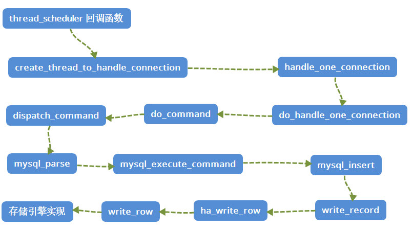

    这是“mysql”系列的第四篇文章，主要介绍的是部分源码。

# 一、mysql

<code>MySQL</code> 是一种广泛使用的开源关系型数据库管理系统（RDBMS--Relational Database Management System）

<!-- more -->
基本结构：


# 二、源码架构图
首先看一下MySQL的源码架构图，主要可以分成三层。


## 2.1、源码结构
下面是8.0.41版本的源码结构图：

MySql其实就两大块，一块是MySql Server层，一块就是Storage Engines层。
- **<1> Client**
不同语言的sdk遵守mysql协议就可以与mysqld进行互通。
- **<2> Connection/Thread Pool**
MySql使用C++编写，Connection是非常宝贵的，在初始化的时候维护一个池。
- **<3> SqlInterface,Parse,Optimizer,Cache**
对sql处理，解析，优化，缓存等处理和过滤模块，了解了解即可。
- **<4> Storage Engines**
负责存储的模块，官方，第三方，甚至是你自己都可以自定义实现这个数据存储，这就把生态做起来了，🐮👃。


# 三、源码分析

## 3.1、入口函数：main() -> mysald_main()
MySQL的启动入口是main()函数（位于sql/main.cc），但实际逻辑由<code>mysqld_main</code>函数（位于<code>sql/main.cc</code>）实现。
```cpp
// sql/main.cc
int main(int argc, char **argv)
{
  return mysqld_main(argc, argv);
}
```

## 3.2、初始化全局环境
在<code>mysqld_main</code> 函数中，首先进行全局初始化

### 3.2.1、基础初始化：my_init()
- 初始化内存分配、线程库、信号处理等。
- 设置程序名称和错误处理。

```cpp
// sql/mysqld.cc
my_init(argv[0]);//初始化全局环境
```

### 3.2.2、加载配置：load_defaults()
- 解析命令行参数和配置文件（如my.cnf）。
- 合并默认配置和用户自定义配置。

```cpp
//加载配置文件（如my.cnf）
if (load_defaults("my", load_default_groups, &argc, &argv) {
   exit(1);
}
//处理命令行参数
handle_options(&argc, &argv, my_long_options, mysqld_get_one_option);
```


## 3.3、核心子系统初始化
MySQL启动的核心在于初始化各个子系统，确保服务组件就绪

<details style="background-color: #dbdbdb;padding: 10px;">
<summary><strong> > init_server_components源码</strong> (点击展开)</summary>

```cpp
/*
* 核心模块
*/
static int init_server_components()
{
  DBUG_ENTER("init_server_components");
  /*
    We need to call each of these following functions to ensure that
    all things are initialized so that unireg_abort() doesn't fail
    需要调用以下每个函数来确保所有内容都已初始化
  */
  // 初始化 mdl 子系统。特别是, 初始化新的全局变量锁和相关的条件变量: LOCK_mdl 和 COND_mdl。
  mdl_init();
  // 初始化 partitioning, 当前只有 PSI Keys。
  partitioning_init();
  // 初始化 table definition cache hash表 和 hostname cache hash表
  if (table_def_init() | hostname_cache_init(host_cache_size))
    unireg_abort(MYSQLD_ABORT_EXIT);
  // 初始化 timer 组件
  if (my_timer_initialize())
    sql_print_error("Failed to initialize timer component (errno %d).", errno);
  else
    have_statement_timeout = SHOW_OPTION_YES;
  // 初始化 query cache
  init_server_query_cache();
  // 随机数模块初始化
  randominit(&sql_rand, (ulong)server_start_time, (ulong)server_start_time / 2);
  // 浮点运算器
  setup_fpu();
#ifdef HAVE_REPLICATION
  // 初始化 slave list
  init_slave_list();
#endif
 
  /* Setup logs */
 
  /*
    Enable old-fashioned error log, except when the user has requested
    help information. Since the implementation of plugin server
    variables the help output is now written much later.
 
    log_error_dest can be:
    disabled_my_option     --log-error was not used or --log-error=
    ""                     --log-error without arguments (no '=')
    filename               --log-error=filename
  */
#ifdef _WIN32
  /*
    Enable the error log file only if console option is not specified
    and --help is not used.
  */
  bool log_errors_to_file = !opt_help && !opt_console;
#else
  /*
    Enable the error log file only if --log-error=filename or --log-error
    was used. Logging to file is disabled by default unlike on Windows.
  */
  // 是否启用 error log
  bool log_errors_to_file = !opt_help && (log_error_dest != disabled_my_option);
#endif
  // 启用 error log
  if (log_errors_to_file)
  {
    // Construct filename if no filename was given by the user.
    // 如果 没有指定 error log filename, 则自动生成
    if (!log_error_dest[0] || log_error_dest == disabled_my_option)
      fn_format(errorlog_filename_buff, pidfile_name, mysql_data_home, ".err",
                MY_REPLACE_EXT); /* replace '.<domain>' by '.err', bug#4997 */
    else
      fn_format(errorlog_filename_buff, log_error_dest, mysql_data_home, ".err",
                MY_UNPACK_FILENAME);
    /*
      log_error_dest may have been set to disabled_my_option or "" if no
      argument was passed, but we need to show the real name in SHOW VARIABLES.
    */
    log_error_dest = errorlog_filename_buff;
    // open error log
    if (open_error_log(errorlog_filename_buff, false))
      unireg_abort(MYSQLD_ABORT_EXIT);
  }
  else
  {
    // We are logging to stderr and SHOW VARIABLES should reflect that.
    // 记录 error log 到 stderr
    log_error_dest = "stderr";
    // Flush messages buffered so far.
    flush_error_log_messages();
  }
    
  enter_cond_hook = thd_enter_cond;
  exit_cond_hook = thd_exit_cond;
  is_killed_hook = (int (*)(const void *))thd_killed;
  // transaction_cache init
  if (transaction_cache_init())
  {
    sql_print_error("Out of memory");
    unireg_abort(MYSQLD_ABORT_EXIT);
  }
 
  /*
    initialize delegates for extension observers, errors have already
    been reported in the function
    初始化各种 xxx_delegate 类型的指针, 为他们分配对象, 对动态插件的支持
  */
  if (delegates_init())
    unireg_abort(MYSQLD_ABORT_EXIT);
 
  /* need to configure logging before initializing storage engines
     在初始化 storage engines 之前需要配置 binlog.
  */
  if (opt_log_slave_updates && !opt_bin_log)
  {
    sql_print_warning("You need to use --log-bin to make "
                      "--log-slave-updates work.");
  }
  if (binlog_format_used && !opt_bin_log)
    sql_print_warning("You need to use --log-bin to make "
                      "--binlog-format work.");
 
  /* Check that we have not let the format to unspecified at this point */
  assert((uint)global_system_variables.binlog_format <=
         array_elements(binlog_format_names) - 1);
 
#ifdef HAVE_REPLICATION
  // replicate_same_server_id
  if (opt_log_slave_updates && replicate_same_server_id)
  {
    if (opt_bin_log)
    {
      sql_print_error("using --replicate-same-server-id in conjunction with \
--log-slave-updates is impossible, it would lead to infinite loops in this \
server.");
      unireg_abort(MYSQLD_ABORT_EXIT);
    }
    else
      sql_print_warning("using --replicate-same-server-id in conjunction with \
--log-slave-updates would lead to infinite loops in this server. However this \
will be ignored as the --log-bin option is not defined.");
  }
#endif
 
  opt_server_id_mask = ~ulong(0);
#ifdef HAVE_REPLICATION
  // 检查 serverid 超长
  opt_server_id_mask = (opt_server_id_bits == 32) ? ~ulong(0) : (1 << opt_server_id_bits) - 1;
  if (server_id != (server_id & opt_server_id_mask))
  {
    sql_print_error("server-id configured is too large to represent with"
                    "server-id-bits configured.");
    unireg_abort(MYSQLD_ABORT_EXIT);
  }
#endif
  //
  if (opt_bin_log)
  {
    /* Reports an error and aborts, if the --log-bin's path
       is a directory.
       --log-bin 指向一个目录
       */
    if (opt_bin_logname &&
        opt_bin_logname[strlen(opt_bin_logname) - 1] == FN_LIBCHAR)
    {
      sql_print_error("Path '%s' is a directory name, please specify \
a file name for --log-bin option",
                      opt_bin_logname);
      unireg_abort(MYSQLD_ABORT_EXIT);
    }
 
    /* Reports an error and aborts, if the --log-bin-index's path
       is a directory.
       --log-bin-index 指向一个目录
    */
    if (opt_binlog_index_name &&
        opt_binlog_index_name[strlen(opt_binlog_index_name) - 1] == FN_LIBCHAR)
    {
      sql_print_error("Path '%s' is a directory name, please specify \
a file name for --log-bin-index option",
                      opt_binlog_index_name);
      unireg_abort(MYSQLD_ABORT_EXIT);
    }
 
    char buf[FN_REFLEN];
    const char *ln;
    ln = mysql_bin_log.generate_name(opt_bin_logname, "-bin", buf);
    if (!opt_bin_logname && !opt_binlog_index_name)
    {
      /*
        User didn't give us info to name the binlog index file.
        Picking `hostname`-bin.index like did in 4.x, causes replication to
        fail if the hostname is changed later. So, we would like to instead
        require a name. But as we don't want to break many existing setups, we
        only give warning, not error.
      */
      sql_print_warning("No argument was provided to --log-bin, and "
                        "--log-bin-index was not used; so replication "
                        "may break when this MySQL server acts as a "
                        "master and has his hostname changed!! Please "
                        "use '--log-bin=%s' to avoid this problem.",
                        ln);
    }
    if (ln == buf)
    {
      my_free(opt_bin_logname);
      opt_bin_logname = my_strdup(key_memory_opt_bin_logname,
                                  buf, MYF(0));
    }
 
    /*
      Skip opening the index file if we start with --help. This is necessary
      to avoid creating the file in an otherwise empty datadir, which will
      cause a succeeding 'mysqld --initialize' to fail.
    */
    if (!opt_help && mysql_bin_log.open_index_file(opt_binlog_index_name, ln, TRUE))
    {
      unireg_abort(MYSQLD_ABORT_EXIT);
    }
  }
 
  if (opt_bin_log)
  {
    /*
      opt_bin_logname[0] needs to be checked to make sure opt binlog name is
      not an empty string, incase it is an empty string default file
      extension will be passed
      log_bin basename 和 log_bin index 检查
     */
    log_bin_basename =
        rpl_make_log_name(key_memory_MYSQL_BIN_LOG_basename,
                          opt_bin_logname, default_logfile_name,
                          (opt_bin_logname && opt_bin_logname[0]) ? "" : "-bin");
    log_bin_index =
        rpl_make_log_name(key_memory_MYSQL_BIN_LOG_index,
                          opt_binlog_index_name, log_bin_basename, ".index");
    if (log_bin_basename == NULL || log_bin_index == NULL)
    {
      sql_print_error("Unable to create replication path names:"
                      " out of memory or path names too long"
                      " (path name exceeds " STRINGIFY_ARG(FN_REFLEN) " or file name exceeds " STRINGIFY_ARG(FN_LEN) ").");
      unireg_abort(MYSQLD_ABORT_EXIT);
    }
  }
 
#ifndef EMBEDDED_LIBRARY
  // reply_log basename & index
  DBUG_PRINT("debug",
             ("opt_bin_logname: %s, opt_relay_logname: %s, pidfile_name: %s",
              opt_bin_logname, opt_relay_logname, pidfile_name));
  /*
    opt_relay_logname[0] needs to be checked to make sure opt relaylog name is
    not an empty string, incase it is an empty string default file
    extension will be passed
   */
  relay_log_basename =
      rpl_make_log_name(key_memory_MYSQL_RELAY_LOG_basename,
                        opt_relay_logname, default_logfile_name,
                        (opt_relay_logname && opt_relay_logname[0]) ? "" : "-relay-bin");
 
  if (relay_log_basename != NULL)
    relay_log_index =
        rpl_make_log_name(key_memory_MYSQL_RELAY_LOG_index,
                          opt_relaylog_index_name, relay_log_basename, ".index");
 
  if (relay_log_basename == NULL || relay_log_index == NULL)
  {
    sql_print_error("Unable to create replication path names:"
                    " out of memory or path names too long"
                    " (path name exceeds " STRINGIFY_ARG(FN_REFLEN) " or file name exceeds " STRINGIFY_ARG(FN_LEN) ").");
    unireg_abort(MYSQLD_ABORT_EXIT);
  }
#endif /* !EMBEDDED_LIBRARY */
 
  /* call ha_init_key_cache() on all key caches to init them
  key cache handle, 仅适用于ISAM 表
  */
  process_key_caches(&ha_init_key_cache);
 
  /* Allow storage engine to give real error messages */
  if (ha_init_errors())
    DBUG_RETURN(1);
 
  if (opt_ignore_builtin_innodb)
    sql_print_warning("ignore-builtin-innodb is ignored "
                      "and will be removed in future releases.");
  // 初始化 GTID server
  if (gtid_server_init())
  {
    sql_print_error("Failed to initialize GTID structures.");
    unireg_abort(MYSQLD_ABORT_EXIT);
  }
 
  /*
    Set tc_log to point to TC_LOG_DUMMY early in order to allow plugin_init()
    to commit attachable transaction after reading from mysql.plugin table.
    If necessary tc_log will be adjusted to point to correct TC_LOG instance
    later.
    tc_log 尽早指向 TC_LOG_DUMMY, 以便允许 plugin_init() 在读取 mysql.plugin 表之后提交附加的事务。
  */
  tc_log = &tc_log_dummy;
 
  /*Load early plugins */
  if (plugin_register_early_plugins(&remaining_argc, remaining_argv,
                                    opt_help ? PLUGIN_INIT_SKIP_INITIALIZATION : 0))
  {
    sql_print_error("Failed to initialize early plugins.");
    unireg_abort(MYSQLD_ABORT_EXIT);
  }
  /* Load builtin plugins, initialize MyISAM, CSV and InnoDB
  注册内置插件, 初始化 MyYSAM, CSV, InnoDB
  核心部分。
  */
  if (plugin_register_builtin_and_init_core_se(&remaining_argc,
                                               remaining_argv))
  {
    sql_print_error("Failed to initialize builtin plugins.");
    unireg_abort(MYSQLD_ABORT_EXIT);
  }
  /*
    Skip reading the plugin table when starting with --help in order
    to also skip initializing InnoDB. This provides a simpler and more
    uniform handling of various startup use cases, e.g. when the data
    directory does not exist, exists but is empty, exists with InnoDB
    system tablespaces present etc.
  */
  // 注册并初始化动态插件。还要初始化尚未初始化的内置插件[MyISAM CSV INNODB 外的其他内置插件]。
  if (plugin_register_dynamic_and_init_all(&remaining_argc, remaining_argv,
                                           (opt_noacl ? PLUGIN_INIT_SKIP_PLUGIN_TABLE : 0) |
                                               (opt_help ? (PLUGIN_INIT_SKIP_INITIALIZATION |
                                                            PLUGIN_INIT_SKIP_PLUGIN_TABLE)
                                                         : 0)))
  {
    sql_print_error("Failed to initialize dynamic plugins.");
    unireg_abort(MYSQLD_ABORT_EXIT);
  }
  plugins_are_initialized = TRUE; /* Don't separate from init function */
  // session_track_system_variables变量检查: 控制server是否跟踪分配给会话系统变量的任务
  Session_tracker session_track_system_variables_check;
  LEX_STRING var_list;
  char *tmp_str;
  size_t len = strlen(global_system_variables.track_sysvars_ptr);
  tmp_str = (char *)my_malloc(PSI_NOT_INSTRUMENTED, len * sizeof(char) + 2,
                              MYF(MY_WME));
  strcpy(tmp_str, global_system_variables.track_sysvars_ptr);
  var_list.length = len;
  var_list.str = tmp_str;
  if (session_track_system_variables_check.server_boot_verify(system_charset_info,
                                                              var_list))
  {
    sql_print_error("The variable session_track_system_variables either has "
                    "duplicate values or invalid values.");
    if (tmp_str)
      my_free(tmp_str);
    unireg_abort(MYSQLD_ABORT_EXIT);
  }
  if (tmp_str)
    my_free(tmp_str);
  /* we do want to exit if there are any other unknown options */
  if (remaining_argc > 1)
  {
    int ho_error;
    struct my_option no_opts[] =
        {
            {0, 0, 0, 0, 0, 0, GET_NO_ARG, NO_ARG, 0, 0, 0, 0, 0, 0}};
    /*
      We need to eat any 'loose' arguments first before we conclude
      that there are unprocessed options.
    */
    my_getopt_skip_unknown = 0;
    // 处理命令行选项
    if ((ho_error = handle_options(&remaining_argc, &remaining_argv, no_opts,
                                   mysqld_get_one_option)))
      unireg_abort(MYSQLD_ABORT_EXIT);
    /* Add back the program name handle_options removes */
    remaining_argc++;
    remaining_argv--;
    my_getopt_skip_unknown = TRUE;
 
    if (remaining_argc > 1)
    {
      sql_print_error("Too many arguments (first extra is '%s').",
                      remaining_argv[1]);
      sql_print_information("Use --verbose --help to get a list "
                            "of available options!");
      unireg_abort(MYSQLD_ABORT_EXIT);
    }
  }
 
  if (opt_help)
    unireg_abort(MYSQLD_SUCCESS_EXIT);
 
  /* if the errmsg.sys is not loaded, terminate to maintain behaviour
  如果 errmsg.sys 未加载, 则中止
  */
  if (!my_default_lc_messages->errmsgs->is_loaded())
  {
    sql_print_error("Unable to read errmsg.sys file");
    unireg_abort(MYSQLD_ABORT_EXIT);
  }
 
  /* We have to initialize the storage engines before CSV logging
  在 CSV logging之前, 我们必须初始化存储引擎
  */
  // 初始化 system database name cache【当前system database 只有 mysql】
  if (ha_init())
  {
    sql_print_error("Can't init databases");
    unireg_abort(MYSQLD_ABORT_EXIT);
  }
   
  if (opt_bootstrap)
    log_output_options = LOG_FILE;
 
  /*
    Issue a warning if there were specified additional options to the
    log-output along with NONE. Probably this wasn't what user wanted.
  */
  if ((log_output_options & LOG_NONE) && (log_output_options & ~LOG_NONE))
    sql_print_warning("There were other values specified to "
                      "log-output besides NONE. Disabling slow "
                      "and general logs anyway.");
 
  if (log_output_options & LOG_TABLE)
  {
    /* Fall back to log files if the csv engine is not loaded. */
    LEX_CSTRING csv_name = {C_STRING_WITH_LEN("csv")};
    if (!plugin_is_ready(csv_name, MYSQL_STORAGE_ENGINE_PLUGIN))
    {
      sql_print_error("CSV engine is not present, falling back to the "
                      "log files");
      log_output_options = (log_output_options & ~LOG_TABLE) | LOG_FILE;
    }
  }
 
  query_logger.set_handlers(log_output_options);
 
  // Open slow log file if enabled.  打开 slow log 文件
  if (opt_slow_log && query_logger.reopen_log_file(QUERY_LOG_SLOW))
    opt_slow_log = false;
 
  // Open general log file if enabled.  打开 general log 文件
  if (opt_general_log && query_logger.reopen_log_file(QUERY_LOG_GENERAL))
    opt_general_log = false;
 
  /*
    Set the default storage engines; 设置默认存储引擎
  */
  // 检查Innodb存储引擎是否初始化
  if (initialize_storage_engine(default_storage_engine, "",
                                &global_system_variables.table_plugin))
    unireg_abort(MYSQLD_ABORT_EXIT);
  // 检查 Innodb 存储引擎
  if (initialize_storage_engine(default_tmp_storage_engine, " temp",
                                &global_system_variables.temp_table_plugin))
    unireg_abort(MYSQLD_ABORT_EXIT);
 
  if (!opt_bootstrap && !opt_noacl)
  {
    std::string disabled_se_str(opt_disabled_storage_engines);
    ha_set_normalized_disabled_se_str(disabled_se_str);
 
    // Log warning if default_storage_engine is a disabled storage engine.
    handlerton *default_se_handle =
        plugin_data<handlerton *>(global_system_variables.table_plugin);
    if (ha_is_storage_engine_disabled(default_se_handle))
      sql_print_warning("default_storage_engine is set to a "
                        "disabled storage engine %s.",
                        default_storage_engine);
 
    // Log warning if default_tmp_storage_engine is a disabled storage engine.
    handlerton *default_tmp_se_handle =
        plugin_data<handlerton *>(global_system_variables.temp_table_plugin);
    if (ha_is_storage_engine_disabled(default_tmp_se_handle))
      sql_print_warning("default_tmp_storage_engine is set to a "
                        "disabled storage engine %s.",
                        default_tmp_storage_engine);
  }
  // 两阶段提交 tc_log
  if (total_ha_2pc > 1 || (1 == total_ha_2pc && opt_bin_log))
  {
    if (opt_bin_log)
      tc_log = &mysql_bin_log;
    else
      tc_log = &tc_log_mmap;
  }
  // init tc_log
  if (tc_log->open(opt_bin_log ? opt_bin_logname : opt_tc_log_file))
  {
    sql_print_error("Can't init tc log");
    unireg_abort(MYSQLD_ABORT_EXIT);
  }
  // before recovery
  (void)RUN_HOOK(server_state, before_recovery, (NULL));
  // xa recovery 操作
  if (ha_recover(0))
  {
    unireg_abort(MYSQLD_ABORT_EXIT);
  }
 
  /// @todo: this looks suspicious, revisit this /sven
  // gtid_mode
  enum_gtid_mode gtid_mode = get_gtid_mode(GTID_MODE_LOCK_NONE);
  // ENFORCE_GTID_CONSISTENCY
  if (gtid_mode == GTID_MODE_ON &&
      _gtid_consistency_mode != GTID_CONSISTENCY_MODE_ON)
  {
    sql_print_error("GTID_MODE = ON requires ENFORCE_GTID_CONSISTENCY = ON.");
    unireg_abort(MYSQLD_ABORT_EXIT);
  }
 
  if (opt_bin_log)
  {
    /*
      Configures what object is used by the current log to store processed
      gtid(s). This is necessary in the MYSQL_BIN_LOG::MYSQL_BIN_LOG to
      corretly compute the set of previous gtids.
       
    */
    assert(!mysql_bin_log.is_relay_log);
    mysql_mutex_t *log_lock = mysql_bin_log.get_log_lock();
    mysql_mutex_lock(log_lock);
    // 打开 binlog 文件
    if (mysql_bin_log.open_binlog(opt_bin_logname, 0,
                                  max_binlog_size, false,
                                  true /*need_lock_index=true*/,
                                  true /*need_sid_lock=true*/,
                                  NULL))
    {
      mysql_mutex_unlock(log_lock);
      unireg_abort(MYSQLD_ABORT_EXIT);
    }
    mysql_mutex_unlock(log_lock);
  }
 
  if (opt_myisam_log)
    (void)mi_log(1);
 
#if defined(HAVE_MLOCKALL) && defined(MCL_CURRENT) && !defined(EMBEDDED_LIBRARY)
  if (locked_in_memory && !getuid())
  {
    if (setreuid((uid_t)-1, 0) == -1)
    { // this should never happen
      sql_print_error("setreuid: %s", strerror(errno));
      unireg_abort(MYSQLD_ABORT_EXIT);
    }
    if (mlockall(MCL_CURRENT))
    {
      sql_print_warning("Failed to lock memory. Errno: %d\n", errno); /* purecov: inspected */
      locked_in_memory = 0;
    }
#ifndef _WIN32
    if (user_info)
      set_user(mysqld_user, user_info);
#endif
  }
  else
#endif
    locked_in_memory = 0;
 
  /* Initialize the optimizer cost module
  初始化优化器成本模块
  */
  init_optimizer_cost_module(true);
  ft_init_stopwords();
  // 初始化 max_user_conns
  init_max_user_conn();
  // 初始化 sql_command_flags 和 server_command_flags 数组。
  init_update_queries();
  DBUG_RETURN(0);
}

```

</details>


### 3.3.1、日志系统初始化
- 初始化错误日志、慢程序日志、通用日志等。

```cpp
log_tables();
error_log();
slow_log();
general_log();
```

### 3.3.2、存储引擎初始化
加载并初始化存储引擎插件（如innodb、myisam）
```cpp
//初始化插件系统
plugin_init(&argc, &argv, PLUGIN_INIT_SKIP_PLUGIN_TABLE);
//初始化存储引擎接口
ha_init();
```
- <code>plugin_init()</code>(sql/sql_plugin.cc)会调用存储引擎的初始化函数。
  - 例如，innodb的入口是<code>innodb_init()</code>(storage/innobase/handler/ha_innodb.cc).
- <code>ha_init()</code>(sql/handler.cc)初始化Handler API，注册存储引擎


### 3.3.3、网络模块初始化
创建监听套接字，绑定端口，准备接收客户端连接。
```cpp
//初始化网络模块
network_init();//初始化网络协议（TCP/IP、Socket）
create_socket();//创建监听套接字并绑定端口
```
- 关键函数 <code>network_init()</code>(sql/conn_handler/socket_connection.cc)和 create_socket（）

### 3.3.4、线程池与后台线程
初始化线程池、启动后台线程（如主线程、IO线程）
```cpp
//初始化线程池
thread_pool_init();
//启动信号处理线程
start_signal_handler()
//启动后台线程（如 innodb的主线程）
start_handle_manager();
```
- innodb的主线程 <code>srv_master_thread</code>(storage/innobase/srv/srv0start.cc)负责脏页刷新、检查点等任务。

## 3.4、启动服务主循环
初始化完成后，MySQL进入服务主循环，监听客户端请求。

### 3.4.1、处理客户端连接
调用<code>handle_connection_sockets()</code> (sql/conn_handler/socket_connection.cc)进入事件循环，监听连接。
```cpp

int mysqld_main(int argc, char **argv)
{
    //创建服务监听线程
    handle_connections_sockets();
}

void handle_connections_sockets()
{
     //监听连接
     new_sock= mysql_socket_accept(key_socket_client_connection, sock,
                                    (struct sockaddr *)(&cAddr), &length);

    if (mysql_socket_getfd(sock) == mysql_socket_getfd(unix_sock))
      thd->security_ctx->set_host((char*) my_localhost);

    //创建连接
    create_new_thread(thd);
}

//创建新线程处理处理用户连接
static void create_new_thread(THD *thd){
   
   thd->thread_id= thd->variables.pseudo_thread_id= thread_id++;
   
   //线程进了线程调度器
   MYSQL_CALLBACK(thread_scheduler, add_connection, (thd));   
}

```
- 该函数使用poll()或epoll()监听套接字，接受新连接并为每个连接创建线程（或使用线程池）。
- MySQL 后续<code>Connection_handler_manager （sql/conn_handler/connection_handler_manager.cc）</code>替代handle_connections_sockets，这个类是连接处理的核心管理类，负责管理不同类型的连接处理程序。
  - mysqld_socket_acceptor->connection_event_loop();//一个无限循环，不断从事件多路复用器中获取就绪的事件，并根据事件类型进行处理。


```cpp
/**
    Connection acceptor loop to accept connections from clients.
  */
  void connection_event_loop() {
    Connection_handler_manager *mgr =
        Connection_handler_manager::get_instance();
    while (!connection_events_loop_aborted()) {
      Channel_info *channel_info = m_listener->listen_for_connection_event();
      if (channel_info != nullptr) mgr->process_new_connection(channel_info);
    }
  }
```
<font color=green>**更多内容查看第四章节。**</font>

### 3.4.2、请求处理
每个客户端连接由 THD（线程描述符）管理，执行SQL解析、优化、执行等流程。
请求处理入口为 do_command() (sql/sql_parse.cc)

<font color=green>**更多内容查看第四章节。**</font>


## 3.5、信号处理与优雅关闭
MySQL注册信号处理函数，响应 SIGTERM、SIGINT等信号，执行优雅关闭。
```cpp
//注册信号处理函数
my_init_signals()
//信号处理逻辑（如 shutdown）
signal_hand_thd = new Signal_handler_thread();
```
- 关闭时调用 clean_up() (sql/mysqld.cc)，释放资源并退出。


# 四、MySQL连接的建立与使用
在 MYSQL的启动过程中，可以看到在 <code>mysqld_main()</code> 函数的最后调用了 <code>mysqld_socket_acceptor->connection_event_loop()</code> 函数用来处理MySQL的连接，这里通过源码分析一下MySQL连接的建立与使用过程：

## 4.1、第一步，等待连接进入
在死循环中调用 m_listener->listen_for_connection_event() 等待连接进入

```cpp
void connection_event_loop() {
    Connection_handler_manager *mgr =
        Connection_handler_manager::get_instance();
    while (!connection_events_loop_aborted()) {
      Channel_info *channel_info = m_listener->listen_for_connection_event();
      if (channel_info != nullptr) mgr->process_new_connection(channel_info);
    }
  }
```


## 4.2、第二步：处理连接
如果有连接进入，则调用 precess_new_connection() 处理连接
```cpp
// 如果有连接进入，处理连接void
Connection_handler_manager::process_new_connection(Channel_info* channel_info)
{　 // check_and_incr_conn_count() 检查是否有空余连接, 如果没有空余连接, 结束处理流程
  if (abort_loop || !check_and_incr_conn_count())
  {
    channel_info->send_error_and_close_channel(ER_CON_COUNT_ERROR, 0, true);
    delete channel_info;
    return;
  }
  // 这里有空余连接, connection_accepted = true
  if (m_connection_handler->add_connection(channel_info))
  {
    inc_aborted_connects();
    delete channel_info;
  }
}
```
- 调用 check_and_incr_conn_count() 检查是否有空余连接[当前连接数是否大于 max_connections], 如果没有空余连接, 结束处理流程；
  注意：这里允许 max_connections + 1 个连接，最后一个连接是为 super user保留的。
- 如果存在空余连接，则对连接进行处理


## 4.3、第三步：获取线程，处理连接

```cpp
// 在这里创建连接bool 
Per_thread_connection_handler::add_connection(Channel_info *channel_info)
{
  int error = 0;
  my_thread_handle id;
 
  DBUG_ENTER("Per_thread_connection_handler::add_connection");
 
  // Simulate thread creation for test case before we check thread cache
  DBUG_EXECUTE_IF("fail_thread_create", error = 1; goto handle_error;);
  // 检查 thread cache 中是否有空闲 thread，如果有，使用 cached thread
  if (!check_idle_thread_and_enqueue_connection(channel_info))
    DBUG_RETURN(false);
 
  /*
    There are no idle threads avaliable to take up the new
    connection. Create a new thread to handle the connection    没有可用的空闲线程来处理新的连接，创建一个新的线程来处理这个连接。
  */
  channel_info->set_prior_thr_create_utime();
  error = mysql_thread_create(key_thread_one_connection, &id,
                              &connection_attrib,
                              handle_connection,
                              (void *)channel_info);
#ifndef NDEBUG
handle_error:
#endif // !NDEBUG
 
  if (error)
  {
    connection_errors_internal++;
    if (!create_thd_err_log_throttle.log())
      sql_print_error("Can't create thread to handle new connection(errno= %d)",
                      error);
    channel_info->send_error_and_close_channel(ER_CANT_CREATE_THREAD,
                                               error, true);
    Connection_handler_manager::dec_connection_count();
    DBUG_RETURN(true);
  }
 
  Global_THD_manager::get_instance()->inc_thread_created();
  DBUG_PRINT("info", ("Thread created"));
  DBUG_RETURN(false);
}
```
- 查看 thread cache 中是否有空闲 thread，如果有，使用 cached thread
```cpp
bool Per_thread_connection_handler::check_idle_thread_and_enqueue_connection(
    Channel_info *channel_info)
{
  bool res = true;
 
  mysql_mutex_lock(&LOCK_thread_cache);<br>  // 如果 blocked_pthread > wake_thread，则 thread cache 中存在空闲 thread
  if (Per_thread_connection_handler::blocked_pthread_count > wake_pthread)
  {
    DBUG_PRINT("info", ("waiting_channel_info_list->push %p", channel_info));<br>    // 将 channel_info 放入 waiting_channel_info_list，wake_pthread ++
    waiting_channel_info_list->push_back(channel_info);
    wake_pthread++;
    mysql_cond_signal(&COND_thread_cache);
    res = false;
  }
  mysql_mutex_unlock(&LOCK_thread_cache);
 
  return res;
}
```
- 如果不存在，则创建一个新的线程来处理这个连接
```cpp
/**
  Block the current pthread for reuse by new connections.
  阻塞当前的物理线程，供新的连接使用
  @retval NULL   Too many pthreads blocked already or shutdown in progress.
  @retval !NULL  Pointer to Channel_info object representing the new connection
                 to be served by this pthread.
*/
 
Channel_info *Per_thread_connection_handler::block_until_new_connection()
{
  Channel_info *new_conn = NULL;
  mysql_mutex_lock(&LOCK_thread_cache);
  if (blocked_pthread_count < max_blocked_pthreads &&
      !kill_blocked_pthreads_flag)
  {
    /* Don't kill the pthread, just block it for reuse */
    DBUG_PRINT("info", ("Blocking pthread for reuse"));
 
    /*
      mysys_var is bound to the physical thread,
      so make sure mysys_var->dbug is reset to a clean state
      before picking another session in the thread cache.
    */
    DBUG_POP();
    assert(!_db_is_pushed_());
 
    // Block pthread ++
    blocked_pthread_count++;
    while (!abort_loop && !wake_pthread && !kill_blocked_pthreads_flag)<br>      // 这里等待信号
      mysql_cond_wait(&COND_thread_cache, &LOCK_thread_cache);
    blocked_pthread_count--;
 
    if (kill_blocked_pthreads_flag)
      mysql_cond_signal(&COND_flush_thread_cache);
    else if (wake_pthread)
    {<br>      // wake_pthread 计数器 -1
      wake_pthread--;
      if (!waiting_channel_info_list->empty())
      {<br>        // 如果 waiting_channel_info_list 不是空的, 则取出第一个
        new_conn = waiting_channel_info_list->front();
        waiting_channel_info_list->pop_front();
        DBUG_PRINT("info", ("waiting_channel_info_list->pop %p", new_conn));
      }
      else
      {
        assert(0);
      }
    }
  }
  mysql_mutex_unlock(&LOCK_thread_cache);
  return new_conn;
}
```


## 4.4、第四步：开始处理 handle_connection
线程调用 <code>handle_connection()</code> 线程处理函数，初始化一个 thd 对象，并将其加入 thd list; 并初始化 lex 词法解析器，进行连接身份验证，初始化 thd，准备执行语句。
```cpp
/**
  Thread handler for a connection
  线程处理函数。
  @param arg   Connection object (Channel_info)
 
  This function (normally) does the following:
  - Initialize thread
  - Initialize THD to be used with this thread
  - Authenticate user
  - Execute all queries sent on the connection
  - Take connection down
  - End thread  / Handle next connection using thread from thread cache
*/
extern "C" void *handle_connection(void *arg)
{
  Global_THD_manager *thd_manager = Global_THD_manager::get_instance();
  Connection_handler_manager *handler_manager =
      Connection_handler_manager::get_instance();
  Channel_info *channel_info = static_cast<Channel_info *>(arg);
  bool pthread_reused MY_ATTRIBUTE((unused)) = false;
  
  if (my_thread_init())
  {
    connection_errors_internal++;
    channel_info->send_error_and_close_channel(ER_OUT_OF_RESOURCES, 0, false);
    handler_manager->inc_aborted_connects();
    Connection_handler_manager::dec_connection_count();
    delete channel_info;
    my_thread_exit(0);
    return NULL;
  }
 
  for (;;)
  {    // 初始化一个 thd 对象
    THD *thd = init_new_thd(channel_info);
    if (thd == NULL)
    {
      connection_errors_internal++;
      handler_manager->inc_aborted_connects();
      Connection_handler_manager::dec_connection_count();
      break; // We are out of resources, no sense in continuing.
    }
 
    // 将新创建的 thd 添加到 thd list；
    thd_manager->add_thd(thd);
    /**     1. 初始化 lex 词法解析器     2. 进行连接身份验证     3. 初始化 thd , 准备执行语句    */
    if (thd_prepare_connection(thd))
      handler_manager->inc_aborted_connects();
    else
    {      // 只要连接 alive，就会一直循环下去
      while (thd_connection_alive(thd))
      {        // 处理命令，这是 MySQL 的核心操作
        if (do_command(thd))
          break;
      }      // 减少当前用户的连接计数等
      end_connection(thd);
    }    // 关闭一个连接
    close_connection(thd, 0, false, false);
    // 释放资源
    thd->get_stmt_da()->reset_diagnostics_area();
    thd->release_resources();
 
    // Clean up errors now, before possibly waiting for a new connection.
#if OPENSSL_VERSION_NUMBER < 0x10100000L
    ERR_remove_thread_state(0);
#endif /* OPENSSL_VERSION_NUMBER < 0x10100000L */
    // 从 thd list 中移除 thd
    thd_manager->remove_thd(thd);    // 减少当前连接数
    Connection_handler_manager::dec_connection_count();
 
    delete thd;
 
    if (abort_loop) // Server is shutting down so end the pthread.
      break;
    // 阻塞当前的物理线程，使得物理线程被新的连接重用
    channel_info = Per_thread_connection_handler::block_until_new_connection();
    if (channel_info == NULL)
      break;
    pthread_reused = true;
    if (abort_loop)
    {
      // Close the channel and exit as server is undergoing shutdown.
      channel_info->send_error_and_close_channel(ER_SERVER_SHUTDOWN, 0, false);
      delete channel_info;
      channel_info = NULL;
      Connection_handler_manager::dec_connection_count();
      break;
    }
  }
 
  my_thread_end();
  my_thread_exit(0);
  return NULL;
}
```


## 4.5、第五步：处理用户命令
调用 <code>do_command()</code>. 处理用户命令。
```cpp
//继续分发
bool do_command(THD *thd)
{
    return_value= dispatch_command(command, thd, packet+1, (uint) (packet_length-1));
}
bool dispatch_command(enum enum_server_command command, THD *thd, char* packet, uint packet_length)
{
      switch (command) {
         case COM_INIT_DB: ....  break;
         ...
         case COM_QUERY:   //查询语句：  insert xxxx
             mysql_parse(thd, thd->query(), thd->query_length(), &parser_state);  //sql解析
           break;
      }
}
//sql解析模块
void mysql_parse(THD *thd, char *rawbuf, uint length, Parser_state *parser_state)
{
      error= mysql_execute_command(thd);
}
```
继续执行<code>mysql_execute_command</code>
```cpp
//继续执行
int mysql_execute_command(THD *thd)
{
  switch (lex->sql_command) 
  {
      case SQLCOM_SELECT:  res= execute_sqlcom_select(thd, all_tables);  break;

      //这个 insert 就是我要追的
      case SQLCOM_INSERT:   res= mysql_insert(thd, all_tables, lex->field_list, lex->many_values,
		                                      lex->update_list, lex->value_list,
                                              lex->duplicates, lex->ignore);
  }
}
//insert插入操作处理
bool mysql_insert(THD *thd,TABLE_LIST *table_list,List<Item> &fields, List<List_item> &values_list,
                  List<Item> &update_fields, List<Item> &update_values, 
                  enum_duplicates duplic, bool ignore)
{
      while ((values= its++))
      {
           error= write_record(thd, table, &info, &update);
      }
}
//写入记录
int write_record(THD *thd, TABLE *table, COPY_INFO *info, COPY_INFO *update)
{
    if (duplicate_handling == DUP_REPLACE || duplicate_handling == DUP_UPDATE)
    {
         // ha_write_row  重点是这个函数
         while ((error=table->file->ha_write_row(table->record[0])))
         {
             ....
         }
    }
}
```
继续挖 ha_write_row
```cpp
int handler::ha_write_row(uchar *buf)
{
    MYSQL_TABLE_IO_WAIT(m_psi, PSI_TABLE_WRITE_ROW, MAX_KEY, 0,{ error= write_row(buf); })
}

//这是一个虚方法
virtual int write_row(uchar *buf __attribute__((unused)))
{
    return HA_ERR_WRONG_COMMAND;
}
```
write_row是个虚方法，也就是给底层方法实现的，在这里就是给各大Storage Engines的哈

## 4.6、小结
总的请求调用堆栈如下：



方法调用总结如下：
1. 在死循环中调用 m_listener->listen_for_connection_event() 等待连接进入
2. 如果有连接进入，则调用 precess_new_connection() 处理连接
3. 调用 check_and_incr_conn_count() 检查是否有空余连接[当前连接数是否大于 max_connections], 如果没有空余连接, 结束处理流程；
   注意：这里允许 max_connections + 1 个连接，最后一个连接是为 super user保留的。
4. 如果存在空余连接，则对连接进行处理
5. 查看 thread cache 中是否有空闲 thread，如果有，使用 cached thread
6. 如果不存在，则创建一个新的线程来处理这个连接
7. 线程调用 handle_connection() 线程处理函数，初始化一个 thd 对象，并将其加入 thd list; 并初始化 lex 词法解析器，进行连接身份验证，初始化 thd，准备执行语句。
8. 调用 do_command(). 处理用户命令。
   9. 后续流程，可查看“一条Insert语句的执行过程”

    
参考文章：
[MySQL启动过程详解二：核心模块启动 init_server_components()](https://www.cnblogs.com/juanmaofeifei/p/16111523.html)
[MySQL启动过程详解三：Innodb存储引擎的启动](https://www.cnblogs.com/juanmaofeifei/p/16129144.html)
[MySQL连接的建立与使用](https://www.cnblogs.com/juanmaofeifei/p/16146201.html)
[MySQL 源码解读 -- 连接管理](http://ilongda.com/knowledge/mysql/source_code_reading/server/connection.html)
[MySQL · 源码分析 · 一条insert语句的执行过程](http://mysql.taobao.org/monthly/2017/09/10/)
[读 MySQL 源码再看 INSERT 加锁流程](https://www.aneasystone.com/archives/2018/06/insert-locks-via-mysql-source-code.html)