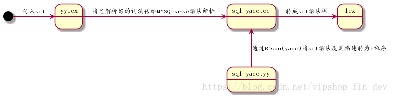

<style>
.orange {
   color: orange
}
.red {
   color: red
}
code {
   color: #0ABF5B;
}
</style>

    这是“mysql”系列的第五篇文章，主要介绍的是Insert流程部分源码。

# 一、mysql

<code>MySQL</code> 是一种广泛使用的开源关系型数据库管理系统（RDBMS--Relational Database Management System）

<!-- more -->

    前文回顾

在 MYSQL的启动过程文章中，可以看到在 `mysqld_main()` 函数的最后调用了 `mysqld_socket_acceptor->connection_event_loop()` 函数用来处理MySQL的连接，这里通过源码分析一下MySQL连接的建立与使用过程：
1. 在死循环中调用 `m_listener->listen_for_connection_event()` 等待连接进入
2. 如果有连接进入，则调用 `precess_new_connection()` 处理连接
3. 调用 `check_and_incr_conn_count()` 检查是否有空余连接[当前连接数是否大于 max_connections], 如果没有空余连接, 结束处理流程；
   - 注意：这里允许 `max_connections + 1` 个连接，最后一个连接是为 `super user`保留的。
4. 如果存在空余连接，则对连接进行处理
5. 查看 `thread cache` 中是否有空闲 `thread`，如果有，使用 `cached thread`
6. 如果不存在，则创建一个新的线程来处理这个连接
7. 线程调用 `handle_connection()` 线程处理函数，初始化一个 `thd` 对象，并将其加入 `thd list`; 并初始化 `lex` 词法解析器，进行连接身份验证，初始化 `thd`，准备执行语句。
8. 调用 `do_command()`. 处理用户命令。

# 二、do_command函数
调用 <code>do_command()</code>. 处理用户命令。

主要可以分成两个部分，
- 首先从连接中读取命令
- 然后执行命令。

```cpp
// /sql/sql_parse.cc文件中
//继续分发
bool do_command(THD *thd)
{
    //1. 读取命令
    rc= thd->get_protocol()->get_command(&com_data, &command);
    //2. 执行命令
    return_value= dispatch_command(command, thd, packet+1, (uint) (packet_length-1));
}
```

## 2.1、读取命令
调用`Protocol_classic::get_command：`分成两个内容，一个是从`vio`中读取命令，通过调用`my_net_read->net_read_packet`读取数据包（如果有多个包，则需要读取多次）。对于该过程，先读取包头，然后再根据包头大小去读取数据，同时会检查是否超过最大包上限。另外，如果包是被压缩过的，则需要解压，有两种解压方式：`zstd_uncompress`和`zlib_uncompress`。

具体的函数调用栈如下：
```text
my_net_set_read_timeout->vio_timeout

Protocol_classic::get_command,
	Protocol_classic::read_packet
		my_net_read
			vio_set_blocking_flag
				vio_set_blocking
			net_read_packet, [multi-call if necessary]
				net_read_packet_header: read header of packet
					net_read_raw_loop: Read something from server/clinet
						vio_read
							inline_mysql_socket_recv(mysql_socket.h) -> recv
							error handling
						error handler (by timeout/error)
				net_realloc: Expand packet buffer if necessary
					check whether exceed the max_allow_packet
				net_read_raw_loop
			my_uncompress [to uncompress package]
				zstd_uncompress
				zlib_uncompress
		error handling
	get command, from first byte enum_server_command.
	Protocol_classic::parse_packet
		validate and parse for different command.
		对于COM_STMT_EXECUTE命令: 需要解释Prepared Statement的参数类型，然后读取真实数据，
		对于其他命令，按照mysql协议把数据指针指向buf；

// error handling.
	THD::send_statement_status
	return

```

## 2.2、分发并执行命令
进入`dispatch_command`函数，先执行以下逻辑：
- 更新`performance schema`接口指标；
- 检查当前时间，如果超过了2038年，则停止该MySQL服务；
- 如果请求协议类型是`PROTOCOL_PLUGIN`，但该命令不允许`PROTOCOL_PLUGIN`，那么将断开该连接；
- 检查密码是否过期；
- 将该命令通知到相关的审计中`audit`；
```cpp
bool dispatch_command(enum enum_server_command command, THD *thd, char* packet, uint packet_length)
{
// 进入dispatch，即执行switch ... case ...，命令分成三类：功能类、数据操作类、未实现 
      switch (command) {
         case COM_INIT_DB: ....  break; //功能类
         ...
         case COM_QUERY:   //数据操作类：如select, insert update等。 
             mysql_parse(thd, thd->query(), thd->query_length(), &parser_state);  //sql解析
           break;
      }
}

```
进行sql语句解析：（`sql/sql_parse.cc`）
```cpp
void mysql_parse(THD *thd, char *rawbuf, uint length,
                 Parser_state *parser_state)
{
  /* ...... */
	
  /* 检查query_cache，如果结果存在于cache中，直接返回 */
  if (query_cache_send_result_to_client(thd, rawbuf, length) <= 0)   
  {
     LEX *lex= thd->lex;
 	 
 	 /* 解析语句 */
     bool err= parse_sql(thd, parser_state, NULL);
		
	 /* 整理语句格式，记录 general log */
	 /* ...... */
      /* 执行语句 */
     error= mysql_execute_command(thd);
     /* 提交或回滚没结束的事务（事务可能在mysql_execute_command中提交，用trx_end_by_hint标记事务是否已经提交） */
     if (!thd->trx_end_by_hint)         
     {
       if (!error && lex->ci_on_success)
         trans_commit(thd);
    
       if (error && lex->rb_on_fail)
         trans_rollback(thd);
     }
```

### 2.2.1、sql解析
`parse_sql()`的作用（`sql/sql_parse.cc`）：调用 `Bison` 生成的语法解析器 `MYSQLparse()`（定义在 `sql/sql_yacc.cc`），将SQL语句解析为抽象语法树（`AST`），并填充到`LEX`的结构体中。
```cpp
bool parse_sql(THD *thd,
               Parser_state *parser_state,
               Object_creation_ctx *creation_ctx)
{
    bool mysql_parse_status= MYSQLparse(thd) != 0;

}
```
解析过程如下：

```
---parse_sql（sql/sql_parse.cc）：使用提供的解析器状态和对象创建上下文，将一个 SQL 语句转换成一个准备解决的抽象语法树（AST）。
------THD::sql_parser（sql/sql_class.cc）：首先调用解析器将语句转换为解析树；然后，进一步将解析树转换为抽象语法树（AST），以备解析（resolve）之用。
---------my_sql_parser_parse：Bison 解析器生成的语法解析入口函数
---------LEX::make_sql_cmd（sql/sql_lex.cc）：使用解析树（parse_tree）实例化一个 Sql_cmd 对象，并将其赋值给 Lex。
------------Parse_tree_root::make_cmd（sql/parse_tree_nodes.h）：各个语句根据自身抽象语法树（AST）构造 Sql_cmt 对象。
```


#### 分析器
解析器的工作流程
```text
词法分析 -> 语法分析 -> 语义分析 -> 生成语法树
```
1. 词法分析
   - `sql_lex.cc` 将 `SQL` 拆分为 `Token` （如`select`, `*` ,`FROM`, `users`）
2. 语法分析
   - `sql_yacc.yy`根据语法规则构建语法树（如`select`节点、 `FROM子`句节点）
3. 语言分析
   - 验证表是否存储，字段是否合法。
4. 返回语法树
   - 语法树传递给优化器 （`Optimizer`）生成执行计划。


解析器的核心文件：
- 词法分析器：`sql/sql_lex.cc`和`sql/sql_yacc.cc`
- 语法分析器：`sql/sql_yacc.yy`

> THD ： 是MYSQL线程上下文，包含当前连接的SQL语句、词法分析器状态等信息。


### 2.2.2、命令执行
继续执行<code>mysql_execute_command</code>：（`sql/sql_parse.cc`）
```cpp
int
mysql_execute_command(THD *thd, bool first_level)
{
   switch (lex->sql_command) {
     /* ...... */
     case SQLCOM_SELECT: //查询
     {
       DBUG_EXECUTE_IF("use_attachable_trx",
                       thd->begin_attachable_ro_transaction(););
   
       thd->clear_current_query_costs();
   
       res= select_precheck(thd, lex, all_tables, first_table);
   
       if (!res)
         res= execute_sqlcom_select(thd, all_tables);
   
       thd->save_current_query_costs();
   
       DBUG_EXECUTE_IF("use_attachable_trx",
                       thd->end_attachable_transaction(););
   
       break;
     }
     case SQLCOM_INSERT: //插入
     case SQLCOM_REPLACE_SELECT:
     case SQLCOM_INSERT_SELECT:
     {
       assert(first_table == all_tables && first_table != 0);
       assert(lex->m_sql_cmd != NULL);
       res= lex->m_sql_cmd->execute(thd);
       break;
     }
  }
}
```

处理用户命令的源码解析暂时到此为止，更具体的内容后面单独的文章进行解析。


参考文章：
[MySQL启动过程详解二：核心模块启动 init_server_components()](https://www.cnblogs.com/juanmaofeifei/p/16111523.html)
[MySQL启动过程详解三：Innodb存储引擎的启动](https://www.cnblogs.com/juanmaofeifei/p/16129144.html)
[MySQL连接的建立与使用](https://www.cnblogs.com/juanmaofeifei/p/16146201.html)
[MySQL 源码解读 -- 连接管理](http://ilongda.com/knowledge/mysql/source_code_reading/server/connection.html)
[读 MySQL 源码再看 INSERT 加锁流程](https://www.aneasystone.com/archives/2018/06/insert-locks-via-mysql-source-code.html)
[MySQL二阶段提交及组提交简析](https://www.ctyun.cn/developer/article/403942519849029)
[MySQL事务提交流程详解](https://www.cnblogs.com/juanmaofeifei/p/16040614.html)
[源码分析 | MySQL 的 commit 是怎么 commit 的？](https://opensource.actionsky.com/%E6%BA%90%E7%A0%81%E5%88%86%E6%9E%90-mysql-%E7%9A%84-commit-%E6%98%AF%E6%80%8E%E4%B9%88-commit-%E7%9A%84%EF%BC%9F/)
[MySQL · 源码分析 · 一条insert语句的执行过程](https://blog.csdn.net/bohu83/article/details/82903976)
[MySQL 引擎特性 · InnoDB Redo Log 解析](https://zhuanlan.zhihu.com/p/451690418)
[MySQL · 源码分析 · 一条insert语句的执行过程](http://mysql.taobao.org/monthly/2017/09/10/)
[MySQL · 源码详解 · mini transaction详解](http://mysql.taobao.org/monthly/2021/09/04/)
[MySQL · InnoDB · Redo log](http://mysql.taobao.org/monthly/2019/03/03/)
[MTR(mini-transaction)设计与实现](https://www.pagefault.info/2019/04/18/mtr-minitransaction-design-and-implementation.html)
[MySQL源码阅读4-do_command函数/功能类命令](https://zhuanlan.zhihu.com/p/121772222)
[从Mysql源代码角度分析一句简单sql的查询过程](https://blog.csdn.net/vipshop_fin_dev/article/details/79688717)
[MySQL · 源码分析 · 词法分析及其性能优化](http://mysql.taobao.org/monthly/2017/02/04/)