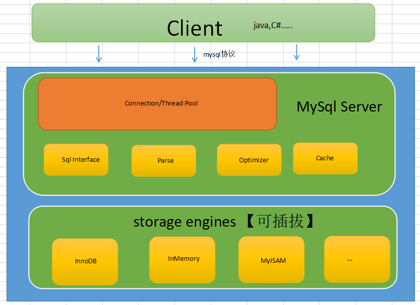
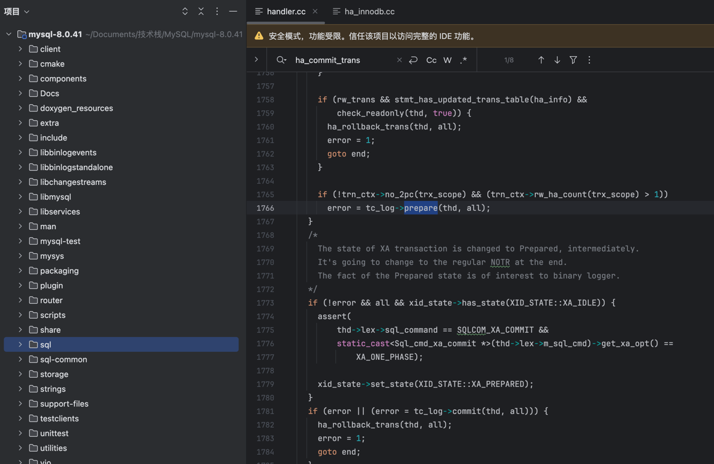
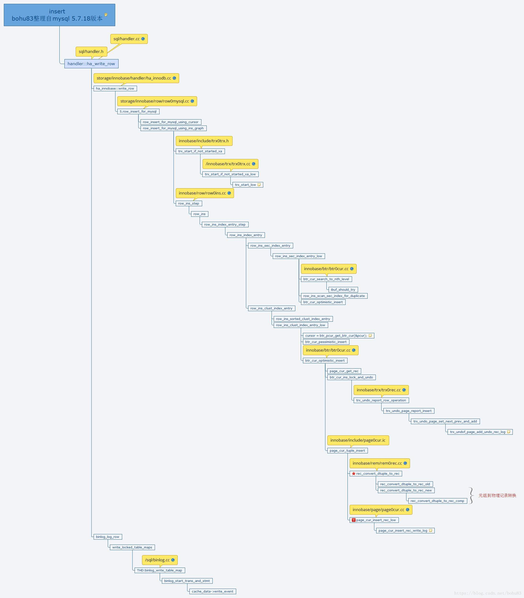
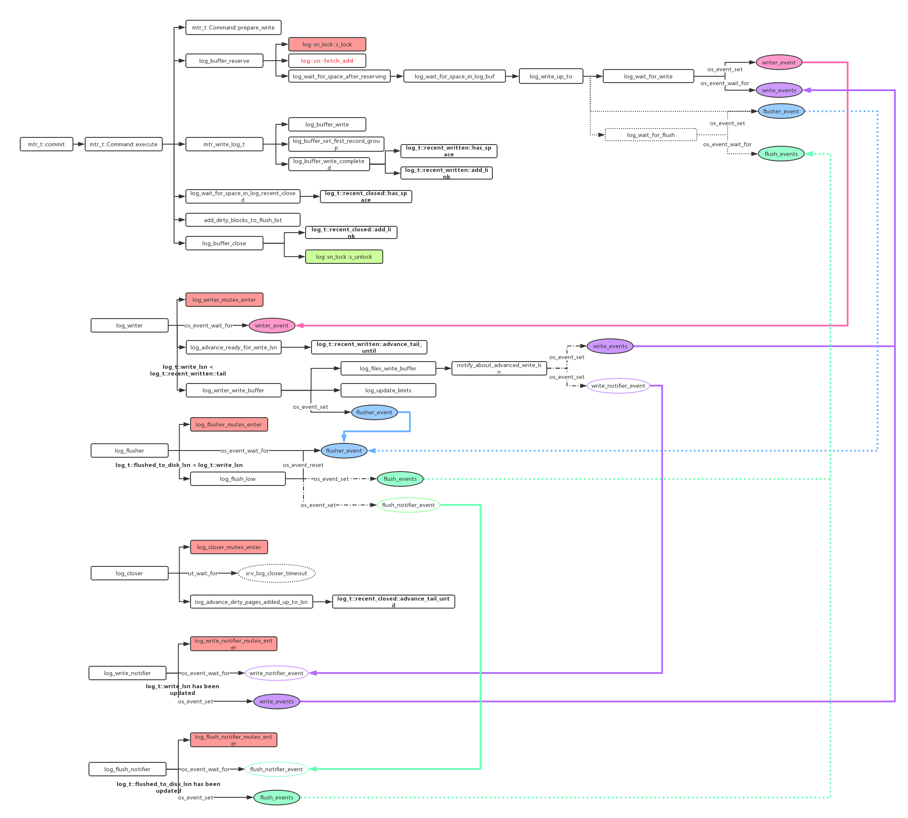
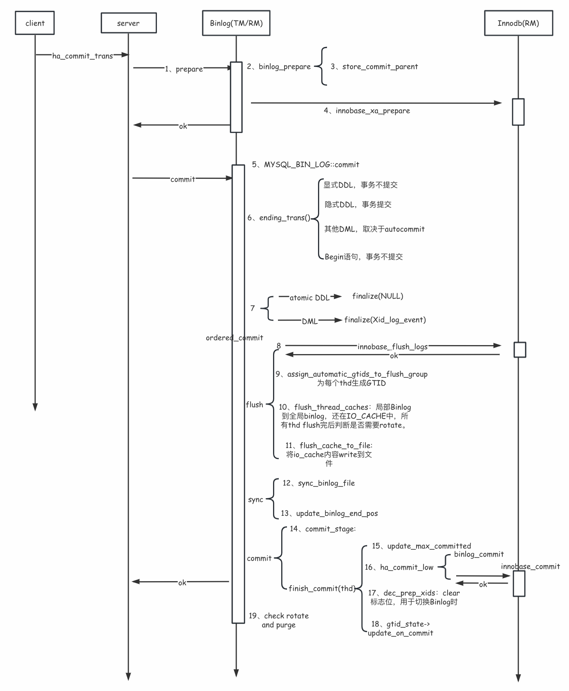
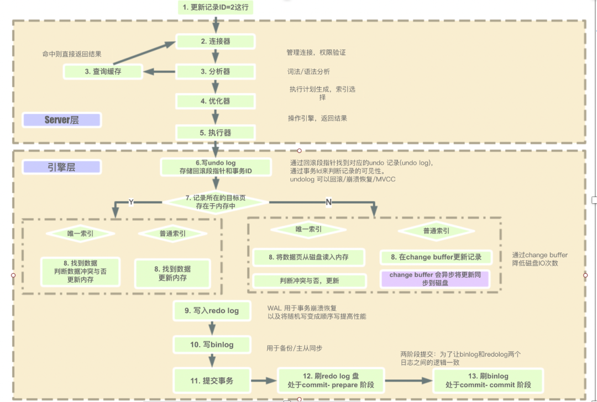

    这是“mysql”系列的第五篇文章，主要介绍的是Insert流程部分源码。

# 一、mysql

<code>MySQL</code> 是一种广泛使用的开源关系型数据库管理系统（RDBMS--Relational Database Management System）

<!-- more -->
基本结构：


# 二、源码架构图
首先看一下MySQL的源码架构图，主要可以分成三层。


## 2.1、源码结构
下面是8.0.41版本的源码结构图：

MySql其实就两大块，一块是MySql Server层，一块就是Storage Engines层。
- **<1> Client**
不同语言的sdk遵守mysql协议就可以与mysqld进行互通。
- **<2> Connection/Thread Pool**
MySql使用C++编写，Connection是非常宝贵的，在初始化的时候维护一个池。
- **<3> SqlInterface,Parse,Optimizer,Cache**
对sql处理，解析，优化，缓存等处理和过滤模块，了解了解即可。
- **<4> Storage Engines**
负责存储的模块，官方，第三方，甚至是你自己都可以自定义实现这个数据存储，这就把生态做起来了，🐮👃。


# 三、一条Insert语句的执行过程
收到客户端的请求后，会调用 <code>do_command()</code>. 处理用户命令。
```cpp
//继续分发
bool do_command(THD *thd)
{
    return_value= dispatch_command(command, thd, packet+1, (uint) (packet_length-1));
}
bool dispatch_command(enum enum_server_command command, THD *thd, char* packet, uint packet_length)
{
      switch (command) {
         case COM_INIT_DB: ....  break;
         ...
         case COM_QUERY:   //查询语句：  insert xxxx
             mysql_parse(thd, thd->query(), thd->query_length(), &parser_state);  //sql解析
           break;
      }
}
//sql解析模块
void mysql_parse(THD *thd, char *rawbuf, uint length, Parser_state *parser_state)
{
      error= mysql_execute_command(thd);
}
```
略过建立连接（更具体的连接流程，查看上一篇文章），从 <code>mysql_parse()</code> 开始分析

```cpp
void mysql_parse(THD *thd, char *rawbuf, uint length,
                 Parser_state *parser_state)
{
  /* ...... */
	
  /* 检查query_cache，如果结果存在于cache中，直接返回 */
  if (query_cache_send_result_to_client(thd, rawbuf, length) <= 0)   
  {
     LEX *lex= thd->lex;
 	 
 	 /* 解析语句 */
     bool err= parse_sql(thd, parser_state, NULL);
		
	 /* 整理语句格式，记录 general log */
	 /* ...... */
	 		  /* 执行语句 */
             error= mysql_execute_command(thd);
             /* 提交或回滚没结束的事务（事务可能在mysql_execute_command中提交，用trx_end_by_hint标记事务是否已经提交） */
             if (!thd->trx_end_by_hint)         
             {
               if (!error && lex->ci_on_success)
                 trans_commit(thd);
 
               if (error && lex->rb_on_fail)
                 trans_rollback(thd);
             }
```

## 5.1、 解析SQL
<code>parse_sql</code>，使用提供的解析器状态和对象创建上下文，将一个 SQL 语句转换成一个准备解决的抽象语法树（AST）。

```
---parse_sql（sql/sql_parse.cc）：使用提供的解析器状态和对象创建上下文，将一个 SQL 语句转换成一个准备解决的抽象语法树（AST）。
------THD::sql_parser（sql/sql_class.cc）：首先调用解析器将语句转换为解析树；然后，进一步将解析树转换为抽象语法树（AST），以备解析（resolve）之用。
---------my_sql_parser_parse：Bison 解析器生成的语法解析入口函数
---------LEX::make_sql_cmd（sql/sql_lex.cc）：使用解析树（parse_tree）实例化一个 Sql_cmd 对象，并将其赋值给 Lex。
------------Parse_tree_root::make_cmd（sql/parse_tree_nodes.h）：各个语句根据自身抽象语法树（AST）构造 Sql_cmt 对象。
```

## 5.2、执行Insert语句
进入 <code>mysql_execute_command()</code>
```cpp
/*  */
  /* ...... */
  
  case SQLCOM_INSERT:
  {  
    
    /* 检查权限 */
    if ((res= insert_precheck(thd, all_tables)))
      break;

    /* 执行insert */
    res= mysql_insert(thd, all_tables, lex->field_list, lex->many_values,
                      lex->update_list, lex->value_list,
                      lex->duplicates, lex->ignore);

	/* 提交或者回滚事务 */
    if (!res)
    {
      trans_commit_stmt(thd);
      trans_commit(thd);
      thd->trx_end_by_hint= TRUE;
    }
    else if (res)
    {
      trans_rollback_stmt(thd);
      trans_rollback(thd);
      thd->trx_end_by_hint= TRUE;
    }
```

进入 mysql_insert()，源码在<code>sql/sql_insert.cc</code>
```cpp
bool mysql_insert(THD *thd,TABLE_LIST *table_list,
                  List<Item> &fields, /* insert 的字段 */
                  List<List_item> &values_list, /* insert 的值 */
                  List<Item> &update_fields,
                  List<Item> &update_values,
                  enum_duplicates duplic,
                  bool ignore)
{ 
  /*对每条记录调用 write_record */
  while ((values= its++))
  {
	if (lock_type == TL_WRITE_DELAYED)
    {
      LEX_STRING const st_query = { query, thd->query_length() };
      DEBUG_SYNC(thd, "before_write_delayed");
      /* insert delay */
      error= write_delayed(thd, table, st_query, log_on, &info);
      DEBUG_SYNC(thd, "after_write_delayed");
      query=0;
    }
    else 
      /* normal insert */
      error= write_record(thd, table, &info, &update);
  }
  
  /*
    这里还有
    thd->binlog_query()写binlog
    my_ok()返回ok报文，ok报文中包含影响行数
  */
```
进入 write_record
```cpp
/*
  COPY_INFO *info 用来处理唯一键冲突，记录影响行数
  COPY_INFO *update 处理 INSERT ON DUPLICATE KEY UPDATE 相关信息
*/
int write_record(THD *thd, TABLE *table, COPY_INFO *info, COPY_INFO *update)
{
  if (duplicate_handling == DUP_REPLACE || duplicate_handling == DUP_UPDATE)
  {
    /* 处理 INSERT ON DUPLICATE KEY UPDATE 等复杂情况 */
  }
  /* 调用存储引擎的接口 */
  else if ((error=table->file->ha_write_row(table->record[0])))
  {
    DEBUG_SYNC(thd, "write_row_noreplace");
    if (!ignore_errors ||
        table->file->is_fatal_error(error, HA_CHECK_DUP))
      goto err; 
    table->file->restore_auto_increment(prev_insert_id);
    goto ok_or_after_trg_err;
  }
}
```
调用存储引擎的接口 ha_write_row. 源码在<code>sql/handler.cc</code>
```cpp
/* handler 是各个存储引擎的基类，这里我们使用InnoDB引擎*/
int handler::ha_write_row(uchar *buf)
{
  /* 指定log_event类型*/
  Log_func *log_func= Write_rows_log_event::binlog_row_logging_function;
  error= write_row(buf);
}
```
handler 是各个存储引擎的基类，这里我们使用InnoDB引擎。再往下是进入引擎的write_row。<font color=green>**write_row是个虚方法，也就是给底层方法实现的，在这里就是给各大Storage Engines的哈**</font>，进入引擎层，这里是innodb引擎，handler对应ha_innobase 插入的表信息保存在handler中

### 5.2.1、innodb执行插入
先看一下整体的流程：

再分析具体的源码：
```cpp
int
ha_innobase::write_row(
/*===================*/
        uchar*  record) /*!< in: a row in MySQL format */
{
		error = row_insert_for_mysql((byte*) record, prebuilt);
}
```
```cpp

UNIV_INTERN
dberr_t
row_insert_for_mysql(                                                                                                                                                                                       
/*=================*/
        byte*           mysql_rec,      /*!< in: row in the MySQL format */
        row_prebuilt_t* prebuilt)       /*!< in: prebuilt struct in MySQL
                                        handle */
{
		/*记录格式从MySQL转换成InnoDB*/
		row_mysql_convert_row_to_innobase(node->row, prebuilt, mysql_rec);
	
        thr->run_node = node;
        thr->prev_node = node;
		
		/*插入记录*/
        row_ins_step(thr);
}
```
```cpp
UNIV_INTERN
que_thr_t*
row_ins_step(
/*=========*/
        que_thr_t*      thr)    /*!< in: query thread */
{
		/*给表加IX锁*/
		err = lock_table(0, node->table, LOCK_IX, thr);
		
		/*插入记录*/
		err = row_ins(node, thr);
}
```
InnoDB表是基于B+树的索引组织表

如果InnoDB表没有主键和唯一键，需要分配隐含的row_id组织聚集索引

row_id分配逻辑在row_ins中，这里不详细展开
```cpp
static __attribute__((nonnull, warn_unused_result))
dberr_t
row_ins(
/*====*/
        ins_node_t*     node,   /*!< in: row insert node */
        que_thr_t*      thr)    /*!< in: query thread */
{
		if (node->state == INS_NODE_ALLOC_ROW_ID) {
				/*若innodb表没有主键和唯一键，用row_id组织索引*/
        		row_ins_alloc_row_id_step(node);
				
				/*获取row_id的索引*/
                node->index = dict_table_get_first_index(node->table);
                node->entry = UT_LIST_GET_FIRST(node->entry_list);
		}
		
		/*遍历所有索引，向每个索引中插入记录*/
		while (node->index != NULL) {
                if (node->index->type != DICT_FTS) {
                        /* 向索引中插入记录 */
                        err = row_ins_index_entry_step(node, thr);

                        if (err != DB_SUCCESS) {

                                return(err);
                        }
                }                                                                                                                                                                                           
				
				/*获取下一个索引*/
                node->index = dict_table_get_next_index(node->index);
                node->entry = UT_LIST_GET_NEXT(tuple_list, node->entry);

                }
        }
}
```
插入单个索引项
```cpp
static __attribute__((nonnull, warn_unused_result))
dberr_t
row_ins_index_entry_step(                                                                                                                                                                                   
/*=====================*/
        ins_node_t*     node,   /*!< in: row insert node */
        que_thr_t*      thr)    /*!< in: query thread */
{
        dberr_t err;

        /*给索引项赋值*/
        row_ins_index_entry_set_vals(node->index, node->entry, node->row);

		/*插入索引项*/
        err = row_ins_index_entry(node->index, node->entry, thr);

        return(err);
}
```
#### 5.2.1.1、插入索引记录
插入操作又分为：聚合索引、组合索引以及二级索引。
- 逻辑都会先尝试page不分离的插入方式，需要定位到记录插入的位置，完成mlog的数据更新，在mtr提交过程中，
  - 1、redo写入公共buffer；
  - 2、把更新的page加到buffer pool的flush list，脏页上记录的lsn为当前mtr写入的结束点lsn，基于加锁逻辑，能够保证flush list上的脏页总是以LSN排序。

<code>row_ins_index_entry</code> 函数的主要功能是将一条新的索引记录插入到 InnoDB 存储引擎的索引结构中，执行的堆栈信息如下：
```
row_ins_index_entry
  |--> row_ins_clust_index_entry // 聚合索引insert [展开]
  |--> row_ins_sec_index_multi_value_entry // 组合索引insert
  |--> row_ins_sec_index_entry // 二级索引insert
```

具体源码如下：
```cpp
static
dberr_t
row_ins_index_entry(                                                                                                                                                                                        
/*================*/
        dict_index_t*   index,  /*!< in: index */
        dtuple_t*       entry,  /*!< in/out: index entry to insert */
        que_thr_t*      thr)    /*!< in: query thread */
{

        if (dict_index_is_clust(index)) {
        		/* 插入聚集索引 */
                return(row_ins_clust_index_entry(index, entry, thr, 0));
        } else {
        		/* 插入二级索引 */
                return(row_ins_sec_index_entry(index, entry, thr));
        }
}
```

row_ins_clust_index_entry 和 row_ins_sec_index_entry 函数结构类似，只分析插入聚集索引，源码如下：
##### 1. 聚合索引 Insert Record流程
方法执行流程如下：
```
分支1： 
  |--> row_ins_clust_index_entry // 聚合索引insert
  |  |--> row_ins_clust_index_entry_low(BTR_MODIFY_LEAF) // 尝试乐观方式更新B+Tree叶子节点，加x-latch锁[展开]
  |  |--> row_ins_clust_index_entry_low(BTR_MODIFY_TREE) // 悲观方式更新整体B+Tree 

row_ins_clust_index_entry_low ①
  |--> mtr.start();     // 做一些初始化。
  |--> btr_cur_optimistic_insert // 假设已经获得该Page的x-latch锁，尝试在游标的下一个位置插入Row。
  |  |--> btr_cur_ins_lock_and_undo // 写undolog
  |  |  |--> trx_undo_report_row_operation // 在undo记录insert、update、聚合索引删除标记 这些信息。内含 mtr_start/mtr_commit 
  |  |  |  |--> trx_undo_assign_undo // 创建或者复用一个undo_log, 内含 mtr_start/mtr_commit 
  |  |--> page_cur_tuple_insert // 在Page游标的下一个位置点Insert数据
  |  |  |--> page_cur_insert_rec_low // [见下文] ②
  |  |  |--> page_cur_insert_rec_zip //  if 压缩页的情况 
  |--> btr_cur_pessimistic_insert // 如果乐观情况失败，调用悲观Insert接口
  |--> mtr.commit();  // [见下文] ③

 page_cur_insert_rec_low ②
  |--> 1-8: //为Record分配内存，并添加到B+Tree上
  |--> 9. page_cur_insert_rec_write_log // 为Redo Record of Insert Record分配内存（自定义的heap）
                                        // 并记录在Page上
  |  |--> 先寻找 insert_record的第一个字节
  |  |--> 计算mlog大小; mlog_open //为mlog分配内存
  |  |--> mlog_write_initial_log_record_fast //初始化mlog,这里的mlog类型 MLOG_COMP_REC_INSERT
  //|  |--> dict_index_get_n_unique_in_tree 
          // 计算行Record上决定唯一性的列(field)数，也就是聚合索引=主键数，二级索引=主键+二级索引数
  |  |--> memcpy(log_ptr, ins_ptr, rec_size); // 把insert指针拷贝给redolog指针 
  |  |--> mlog_close // 关闭mlog
```

继续执行<code>row_ins_clust_index_entry</code>
```cpp
UNIV_INTERN
dberr_t
row_ins_clust_index_entry(
/*======================*/
        dict_index_t*   index,  /*!< in: clustered index */
        dtuple_t*       entry,  /*!< in/out: index entry to insert */
        que_thr_t*      thr,    /*!< in: query thread */
        ulint           n_ext)  /*!< in: number of externally stored columns */
{
        if (UT_LIST_GET_FIRST(index->table->foreign_list)) {
                err = row_ins_check_foreign_constraints(
                        index->table, index, entry, thr);
                if (err != DB_SUCCESS) {
                        return(err);
                }
        }
        
        /* flush log，make checkpoint（如果需要） */
        log_free_check();

		/* 先尝试乐观插入，修改叶子节点 BTR_MODIFY_LEAF */
        err = row_ins_clust_index_entry_low(
                0, BTR_MODIFY_LEAF, index, n_uniq, entry, n_ext, thr, 
                &page_no, &modify_clock);
                
        if (err != DB_FAIL) {
                DEBUG_SYNC_C("row_ins_clust_index_entry_leaf_after");
                return(err);
        }    
		
		/* flush log，make checkpoint（如果需要） */
        log_free_check();

		/* 乐观插入失败，尝试悲观插入 BTR_MODIFY_TREE */
        return(row_ins_clust_index_entry_low(
                        0, BTR_MODIFY_TREE, index, n_uniq, entry, n_ext, thr,
                        &page_no, &modify_clock));
```
```cpp
UNIV_INTERN
dberr_t
row_ins_clust_index_entry_low(
{
    /*启动mini transaction*/
    mtr_start(&mtr);
    /* 将cursor移动到索引上待插入的位置 */
    btr_cur_search_to_nth_level(index, 0, entry, PAGE_CUR_LE, mode,                                                                                                                                     
                                &cursor, 0, __FILE__, __LINE__, &mtr);
                    /*根据不同的flag检查主键冲突*/
                    err = row_ins_duplicate_error_in_clust_online(
                            n_uniq, entry, &cursor,
                            &offsets, &offsets_heap);
                    err = row_ins_duplicate_error_in_clust(
                            flags, &cursor, entry, thr, &mtr);
    /*
      如果要插入的索引项已存在，则把insert操作改为update操作
      索引项已存在，且没有主键冲突，是因为之前的索引项对应的数据被标记为已删除
      本次插入的数据和上次删除的一样，而索引项并未删除，所以变为update操作		
    */
    if (row_ins_must_modify_rec(&cursor)) {
            /* There is already an index entry with a long enough common
            prefix, we must convert the insert into a modify of an
            existing record */
            mem_heap_t*     entry_heap      = mem_heap_create(1024);
            
            /* 更新数据到存在的索引项 */
            err = row_ins_clust_index_entry_by_modify(
                    flags, mode, &cursor, &offsets, &offsets_heap,
                    entry_heap, &big_rec, entry, thr, &mtr);
            
            /*如果索引正在online_ddl，先记录insert*/
            if (err == DB_SUCCESS && dict_index_is_online_ddl(index)) {
                    row_log_table_insert(rec, index, offsets);
            }

            /*提交mini transaction*/
            mtr_commit(&mtr);
            mem_heap_free(entry_heap);
    } else {
            rec_t*  insert_rec;

            if (mode != BTR_MODIFY_TREE) {
                    /*进行一次乐观插入*/
                    err = btr_cur_optimistic_insert(
                            flags, &cursor, &offsets, &offsets_heap,
                            entry, &insert_rec, &big_rec,
                            n_ext, thr, &mtr);
            } else {
                    /*
                      如果buffer pool余量不足25%，插入失败，返回DB_LOCK_TABLE_FULL
                      处理DB_LOCK_TABLE_FULL错误时，会回滚事务
                      防止大事务的锁占满buffer pool(注释里写的)
                    */
                    if (buf_LRU_buf_pool_running_out()) {

                            err = DB_LOCK_TABLE_FULL;
                            goto err_exit;
                    }

                    if (/*太长了，略*/) {
                             /*进行一次乐观插入*/
                            err = btr_cur_optimistic_insert(
                                    flags, &cursor,
                                    &offsets, &offsets_heap,
                                    entry, &insert_rec, &big_rec,
                                    n_ext, thr, &mtr);
                    } else {
                            err = DB_FAIL;
                    }

                    if (err == DB_FAIL) {
                             /*乐观插入失败，进行悲观插入*/
                            err = btr_cur_pessimistic_insert(
                                    flags, &cursor,
                                    &offsets, &offsets_heap,
                                    entry, &insert_rec, &big_rec,
                                    n_ext, thr, &mtr);
                    }
            }

}
```
btr_cur_optimistic_insert 和 btr_cur_pessimistic_insert 涉及B+树的操作，内部细节很多，以后再做分析

##### 2. 提交mini transaction
在<code>row_ins_clust_index_entry_low</code>方法内部，会执行
```
mtr_start(&mtr);
/*提交mini transaction*/
mtr_commit(&mtr);
```
InnoDB会将事务执行过程拆分为若干个Mini Transaction（mtr），每个mtr包含一系列如加锁，写数据，写redo，放锁等操作

更详细的请查看事务提交章节的mtr_t::commit()小节。

## 5.3、事务提交
回到SQL解析部分，从源码上了解到，在执行完成insert后，会继续执行事务提交操作，从 <code>trans_commit(THD *thd)</code> 函数开始。
```cpp
bool trans_commit(THD *thd){
  // 提交事务。
  res = ha_commit_trans(thd, TRUE);
  if (res == FALSE)
    if (thd->rpl_thd_ctx.session_gtids_ctx().notify_after_transaction_commit(thd))
      sql_print_warning("Failed to collect GTID to send in the response packet!");
  thd->server_status &= ~SERVER_STATUS_IN_TRANS;
  thd->variables.option_bits &= ~OPTION_BEGIN;
  thd->get_transaction()->reset_unsafe_rollback_flags(Transaction_ctx::SESSION);
  thd->lex->start_transaction_opt = 0;
 
  /* The transaction should be marked as complete in P_S. */
  assert(thd->m_transaction_psi == NULL);
  thd->tx_priority = 0;
  trans_track_end_trx(thd);
  DBUG_RETURN(MY_TEST(res));
}
```

### 5.3.1、事务提交总流程

接下来进入<code>ha_commit_trans</code>执行堆栈如下：
- 该函数负责处理 binlog 层和存储引擎层的提交。里面就涉及到了<font color=red>**两阶段提交**</font>

```dtd
ha_commit_trans // XA transaction 即可理解为 2PC 两阶段提交协议。
                // 事务协调器（Transaction Coordinator）来处理各节点是回退还是前滚, tc_log即协调者日志。
  |--> tc_log->prepare()
  |  |--> MYSQL_BIN_LOG::prepare--> ha_prepare_low/(ht->prepare)--> innobase_xa_prepare // prepare binlog
           // innodb 存储引擎初始化 innodb_init() /storage/innobase/handler/ha_innodb.cc
           // innobase_hton->prepare = innobase_xa_prepare
  |  |--> innobase_xa_prepare -->trx_prepare// prepare an X/Open XA 分布式事务
  |  |  |--> trx_prepare_low
  |  |  |  |--> mtr_start_sync()
  |  |  |  |--> trx_undo_set_state_at_prepare // undolog 状态从TRX_UNDO_ACTIVE设置为TRX_UNDO_PREPARED
  |  |  |  |  |--> trx_undo_page_get // 获得 undo page
  |  |  |  |  |--> trx_undo_gtid_write // 向undo header写GTID信息
  |  |  |  |  |--> trx_undo_write_xid // 向undo header写XID信息
  |  |  |  |--> mtr_commit

  |--> tc_log->commit()
  |  |--> MYSQL_BIN_LOG::commit
  |  |  |--> binlog_cache_data::finalize() // 写events到cache
  |  |  |--> MYSQL_BIN_LOG::ordered_commit() // 大接口，binlog commit
// Step1: flushing transactions to binary log
  |  |  |  |--> MYSQL_BIN_LOG::process_flush_stage_queue() // flush cache
  |  |  |  |  |--> assign_automatic_gtids_to_flush_group // 生成GTID
  |  |  |  |  |--> flush_thread_caches // flush cache for session,Write the Gtid_log_event to the binary log
  |  |  |  |--> MYSQL_BIN_LOG::flush_cache_to_file() // Flush binary log I/O cache到binlog文件
// Step2: Syncing binary log file to disk
  |  |  |  |--> MYSQL_BIN_LOG::sync_binlog_file--> IO_CACHE_ostream::sync()--> inline_mysql_file_sync()
		--> my_sync -->fdatasync // call fsync() to sync the file to disk
// Step3: Commit all transactions in order
  |  |  |  |--> MYSQL_BIN_LOG::process_commit_stage_queue() // flush cache
  |  |  |  |  |--> ha_commit_low // storage engine commit // innobase_hton->commit = innobase_commit;
  |  |  |  |  |--> innobase_commit -->innobase_commit_low-->trx_commit_for_mysql //此时rtx的状态为TRX_STATE_PREPARED
  |  |  |  |  |  |--> trx_commit
  |  |  |  |  |  |  |--> mtr_start_sync //mtr_start
  |  |  |  |  |  |  |--> trx_commit_low // Commits a transaction and a mini-transaction.
  |  |  |  |  |  |  |  |--> trx_write_serialisation_history // 为事务分配其历史序列号，并更新的undo日志记录写入分配的回滚段
  |  |  |  |  |  |  |  |--> mtr_commit 
  |  |  |  |  |  |  |  |--> trx_commit_in_memory // Commits a transaction in memory
```
- binlog既是二阶段的参与者，又是协调者，所以在源码实现中可以看到 prepare阶段 和 commit阶段函数入口都在MYSQL_BIN_LOG中。
- 准备阶段：tc_log->prepare()
- 提交阶段：tc_log->commit()

<code>ha_commit_trans</code>源码如下：
```cpp
/*   
    提交事务。
    server层最后调用函数 ha_commit_trans(), 该函数负责处理 binlog 层和存储引擎层的提交。
*/
int ha_commit_trans(THD *thd, bool all, bool ignore_global_read_lock)
{
    // 读写事务 && 不能忽略全局读锁
    if (rw_trans && !ignore_global_read_lock)
    {
      /*
        获取一个 MDL_KEY::COMMIT 元数据锁, 该元数据锁将确保 commit 操作会被活跃的 FTWRL 锁阻止。
        FTWRL锁会阻塞 COMMIT 操作。
      */
      MDL_REQUEST_INIT(&mdl_request,
                       MDL_key::COMMIT, "", "", MDL_INTENTION_EXCLUSIVE,
                       MDL_EXPLICIT);
      DBUG_PRINT("debug", ("Acquire MDL commit lock"));
      // 申请 MDL_key::COMMIT 锁, 申请失败
      if (thd->mdl_context.acquire_lock(&mdl_request,
                                        thd->variables.lock_wait_timeout))
      {
        ha_rollback_trans(thd, all);
        DBUG_RETURN(1);
      }
      release_mdl = true;
    }
    // 判断是否开启 xa 事务;
    // 所有的 entries 都支持 2pc && 在事务 scope 中设置做读写更改的引擎数量 > 1
    if (!trn_ctx->no_2pc(trx_scope) && (trn_ctx->rw_ha_count(trx_scope) > 1))
      // prepare; 在事务协调器中 prepare commit tx, 在引擎层生成一个 XA 事务。
      // tc_log: mysqld启动时生成的 MySQL_BIN_LOG 对象[XA控制对象]。
      error = tc_log->prepare(thd, all);
  }
  /*
    XA 事务的状态变更为 prepared, 中间态。最终会变成常规的 NOTR 状态。
  */
  if (!error && all && xid_state->has_state(XID_STATE::XA_IDLE))
  {
    assert(thd->lex->sql_command == SQLCOM_XA_COMMIT &&
           static_cast<Sql_cmd_xa_commit *>(thd->lex->m_sql_cmd)->get_xa_opt() == XA_ONE_PHASE);
    // 设置 XA 事务状态为 XA_PREPARED 状态。
    xid_state->set_state(XID_STATE::XA_PREPARED);
  }
  /**
   * XA 事务提交
  */
  if (error || (error = tc_log->commit(thd, all)))
  {
    ha_rollback_trans(thd, all);
    error = 1;
    goto end;
  }
end:
  // 释放 mdl 锁。
  if (release_mdl && mdl_request.ticket)
  {
    thd->mdl_context.release_lock(mdl_request.ticket);
  }  /*
   * 释放资源并执行其他清理。空事务也需要。
  */
  if (is_real_trans)
  {
    trn_ctx->cleanup();
    thd->tx_priority = 0;
  }
}
```


### 5.3.2、Prepare 阶段
> <font color=red>**prepare阶段分为binlog的prepare和innodb的prepare**</font>。进入binlog和innodb prepae前会设置durability_property = HA_IGNORE_DURABILITY, 表示在innodb prepare和finish_commit()时，不刷redo log到磁盘。


MYSQL_BIN_LOG::prepare的执行逻辑如下：
```cpp
int MYSQL_BIN_LOG::prepare(THD *thd, bool all)
{
  /*
    设置 HA_IGNORE_DURABILITY 在 prepare 阶段不将事务的 prepare record 刷到 innodb redo log。
    这样在 binlog 组提交的 flush 阶段 flushing binlog 之前 flush prepare record 到 innodb redo log。
    在 innodb prepare 时, 不刷 redo log.
  */
  thd->durability_property = HA_IGNORE_DURABILITY;
  //  在引擎中 prepare commit trx
  int error = ha_prepare_low(thd, all);
  DBUG_RETURN(error);
}
```
- 用户线程对象的 durability_property 属性值会被设置为 HA_IGNORE_DURABILITY。
  - 这个属性和 redo 日志刷盘有关，InnoDB prepare 会用到。

继续执行 <code>ha_prepare_low</code>函数：
```cpp
/**
 * prepare commit trx
 * 在引擎层 prepare commit trx
 * 包括 binlog引擎 和 innodb引擎
*/
int ha_prepare_low(THD *thd, bool all)
{
  // 遍历引擎
  if (ha_info)
  {
    for (; ha_info && !error; ha_info = ha_info->next())
    {
      int err = 0;
      // 引擎
      handlerton *ht = ha_info->ht();
      /*
        如果这个特定事务是只读的, 不要调用两阶段提交。
      */
      if (!ha_info->is_trx_read_write())
        continue;
      /**
       * 调用引擎的 prepare 在存储层生成 XA 事务。
       * 先 binlog prepare, 再 innodb prepare;
       * binlog prepare: 将上一次 commit 队列中最大的 seq num 写入本次事务的 last_commit 中
       * innodb prepare: 在 innodb 中更改 undo 日志段的状态为 trx_undo_prepared, 并将 xid 写入 undo log header。
       * */
      if ((err = ht->prepare(ht, thd, all)))
      {
        my_error(ER_ERROR_DURING_COMMIT, MYF(0), err);
        error = 1;
      }
      // ha_prepare_count++
      thd->status_var.ha_prepare_count++;
    }
  }
}
```
内部执行流程会执行<code>ht->prepare(ht, thd, all)</code>
- <font color=red>**prepare阶段分为binlog的prepare和innodb的prepare.**</font>

#### 第一步：Binlog Prepare
binlog 被看作一种存储引擎，它也有 prepare 阶段，代码如下：
```cpp
// sql/binlog.cc
static int binlog_prepare(handlerton *, THD *thd, bool all) {
  DBUG_TRACE;
  if (!all) {
    thd->get_transaction()->store_commit_parent(
        mysql_bin_log.m_dependency_tracker.get_max_committed_timestamp());
  }
  return 0;
}
```
二阶段提交时
- all = true，不会命中分支 if (!all)。也就是说，在 prepare 阶段，binlog 什么也不会干。
- 对于all为false的事务，会更新该事务的last_commited为此时most recently commited事务的sequence_number，sequence_number是Binlog提交的逻辑时间戳，可用于在slave节点上并行执行Binlog事务，生成和自增策略参考Binlog事务依赖策略。


#### 第二步：InnoDB Prepare
innodb prepare阶段堆栈信息如下；
```dtd
innobase_xa_prepare()                             # innodb prepapre
| ...
|- trx_prepare_for_mysql()
|  |- trx_prepare()
|  |  |- trx_prepare_low()
|  |  |  |- mtr_t::start（）                      # 开启一个mini-transaction
|  |  |  |- mtr_t::commit()                      # 通过mtr,写redo到redo log buffer
|  |  |  |  |- Command::execute()
|  |  |  |  |  |- prepare_write()                # 准备写mtr log到redo-log buffer
|  |  |  |  |  |- finish_write()
|  |  |- trx->state = TRX_STATE_PREPARED
```
并没有写redo log到文件中，除非redo log buffer空间不足。以下可看出：
```dtd
finish_write()
| ...
|- log_reserve_and_open()
|  |- # not enough space,do a write of buffer
|  |- log_buffer_sync_in_background(false)       # not enough space,do a write of buffer
|  |  |- log_write_up_to(lsn, false)             # write to redo log file,没有执行fsync
|  |  |  |- log_group_write_buf()                # Writes a buffer to a log file group
|...
|- mtr_write_log_t::operator()                   # append blocks to redo log buffer
|  |- log_write_low()                            # 写 redo log block 到 redo log buffer

```
从上面过程可以看出，prepare阶段并没有写redo log到文件中，只有一种情况会写入到文件中，那就是redo log buffer空间不足时，并且这里只是写入文件系统缓存，并不执行flush操作。

> 二阶段提交的 prepare 阶段，InnoDB 主要做五件事。
> 
> **第 1 件**，把分配给事务的所有 undo 段的状态从 TRX_UNDO_ACTIVE 修改为 TRX_UNDO_PREPARED。
进入二阶段提交的事务，都至少改变过（插入、更新、删除）一个用户表的一条记录，最少会分配 1 个 undo 段，最多会分配 4 个 undo 段。
具体什么情况分配多少个 undo 段，后续关于 undo 模块的文章会有详细介绍。
不管 InnoDB 给事务分配了几个 undo 段，它们的状态都会被修改为 TRX_UNDO_PREPARED。
> **第 2 件**，把事务 Xid 写入所有 undo 段中当前提交事务的 undo 日志组头信息。
InnoDB 给当前提交事务分配的每个 undo 段中，都会有一组 undo 日志属于这个事务，事务 Xid 就写入 undo 日志组的头信息。
对于第 1、2 件事，如果事务改变了用户普通表的数据，修改 undo 段状态、把事务 Xid 写入 undo 日志组头信息，都会产生 redo 日志。
> **第 3 件**，把内存中的事务对象状态从 TRX_STATE_ACTIVE 修改为 TRX_STATE_PREPARED。
前面修改 undo 状态，是为了事务提交完成之前，MySQL 崩溃了，下次启动时，能够从 undo 段中恢复崩溃之前的事务状态。
这里修改事务对象状态，用于 MySQL 正常运行过程中，标识事务已经进入二阶段提交的 prepare 阶段。
> **第 4 件**，如果当前提交事务的隔离级别是读未提交（READ-UNCOMMITTED）或读已提交（READ-COMMITTED)，InnoDB 会释放事务给记录加的共享、排他 GAP 锁。
虽然读未提交、读已提交隔离级别一般都只加普通记录锁，不加 GAP 锁，但是，外键约束检查、插入记录重复值检查这两个场景下，还是会给相应的记录加 GAP 锁。
> **第 5 件**，调用 trx_flush_logs()，处理 redo 日志刷盘的相关逻辑。

Innodb prepare 一个 X/Open XA 分布式事务，源码如下：
```cpp
/*******************************************************************/ /**
static int innobase_xa_prepare(
        /*================*/
        handlerton *hton, /*!< in: InnoDB handlerton ; innodb引擎 */
        THD *thd,                   /*!< in: handle to the MySQL thread of
                    the user whose XA transaction should
                    be prepared ; mysql线程 */
        bool prepare_trx) /*!< in: true - prepare transaction
                    false - the current SQL statement
                    ended ; true: prepare 事务
                            false: 当前 SQL 语句结束, 语句级别的提交 */
{
    // trx
    trx_t *trx = check_trx_exists(thd);
    // 获取thd的 xid, 同时设置到 trx -> xid 中
    thd_get_xid(thd, (MYSQL_XID *)trx->xid);
 
    /* 释放可能的 FIFO ticket 和 search latch。
    因为我们要保留 trx_sys -> mutex, 我们必须首先释放 search system latch 来遵守锁存顺序。
    */
    trx_search_latch_release_if_reserved(trx);
    // prepare trx
    if (prepare_trx || (!thd_test_options(thd, OPTION_NOT_AUTOCOMMIT | OPTION_BEGIN)))
    {
        /* preapre 整个事务, 或者这是一个SQL语句结束, autocommit 是打开状态 */
        // 事务已经在 mysql 2pc 协调器中注册。
        ut_ad(trx_is_registered_for_2pc(trx));
        // trx prepare
        dberr_t err = trx_prepare_for_mysql(trx);
    }
    else
    {
        /* 语句的提交动作, 而非真正的事务提交。 */
        // 需要释放语句 hold 的 auto_increment 锁
        lock_unlock_table_autoinc(trx);
 
        // 记录本语句的 undo 信息, 以便语句级的回滚
        // 标记最新SQL语句结束。
        trx_mark_sql_stat_end(trx);
    }
    return (0);
}
```
继续执行<code>trx_prepare_for_mysql：</code>
```cpp
/**
 * trx prepare
*/
dberr_t
trx_prepare_for_mysql(trx_t *trx)
{
    trx->op_info = "preparing";
    // prepare trx.
    trx_prepare(trx);
}
```
继续执行<code>trx_prepare:</code>
- 转换事物状态为，事物状态由 active 变为 prepare

```cpp
/****************************************************************/ /**
prepare trx.*/
static void trx_prepare(
        /*========*/
        trx_t *trx) /*!< in/out: transaction */
{
    // 回滚段 != NULL && redo 段被修改
    if (trx->rsegs.m_redo.rseg != NULL && trx_is_redo_rseg_updated(trx))
    {
        // 为指定的回滚段 preapre 一个事务。lsn 为当前已 commit 的 lsn
        lsn = trx_prepare_low(trx, &trx->rsegs.m_redo, false);
    }
 
    if (trx->rsegs.m_noredo.rseg != NULL && trx_is_noredo_rseg_updated(trx))
    {
        // 为指定的回滚段 preapre 一个事务。
        trx_prepare_low(trx, &trx->rsegs.m_noredo, true);
    }
 
    /*--------------------------------------*/
    // 事务状态为 TRX_STATE_ACTIVE 状态, 修改事务状态
    trx->state = TRX_STATE_PREPARED;
    // 事务系统中处于 xa prepared 状态的事务的数量
    trx_sys->n_prepared_trx++;
    /*--------------------------------------*/
    /* Release read locks after PREPARE for READ COMMITTED
    and lower isolation.
    对 rc 隔离级别, 在 prepare 之后释放 read locks, 降低隔离度
    */
    if (trx->isolation_level <= TRX_ISO_READ_COMMITTED)
    {
        /* Stop inheriting GAP locks.
        停止继承 GAP lock。
        */
        trx->skip_lock_inheritance = true;
 
        /* Release only GAP locks for now.
        释放 GAP lock。
        */
        lock_trx_release_read_locks(trx, true);
    }
    switch (thd_requested_durability(trx->mysql_thd))
    {
    case HA_IGNORE_DURABILITY:
        /*
        在 binlog group commit 的 prepare 阶段, 我们设置 HA_IGNORE_DURABILITY , 这样在这个阶段不会 flush redo log。
        这样我们就可以在 binlog group commit 的 flush 阶段在将 binary log写入二进制日志之前, 在一个组中 flush redo log。
        */
        break;
    case ..
    }
}
```
继续执行 <code>trx_prepare_low</code>，为指定的回滚段 preapre 一个事务。
```cpp
/****************************************************************/ /**
为指定的回滚段 preapre 一个事务。 */
static lsn_t
trx_prepare_low(
        /*============*/
        trx_t *trx,                             /*!< in/out: transaction */
        trx_undo_ptr_t *undo_ptr, /*!< in/out: pointer to rollback
                    segment scheduled for prepare. 指向回滚段的指针 */
        bool noredo_logging)            /*!< in: turn-off redo logging. 不需要redo log */
{
    lsn_t lsn;
    // insert 或者 undo 回滚段不为 NULL
    if (undo_ptr->insert_undo != NULL || undo_ptr->update_undo != NULL)
    {
        // start a sync mtr
        mtr_start_sync(&mtr);
        // 设置 mtr mode
        if (noredo_logging)
        {
            mtr_set_log_mode(&mtr, MTR_LOG_NO_REDO);
        }
 
        /*
        将  undo 日志段状态从 trx_undo_active 修改为 trx_undo_prepared:
        更改 undo 回滚段将其设置为 prepare 状态。
        */
        mutex_enter(&rseg->mutex);
        // insert undo log 不为 NULL
        if (undo_ptr->insert_undo != NULL)
        {
            /*
            这里不需要获取 trx->undo_mutex, 因为只允许一个 OS 线程为该事务做事务准备。
            */
            // 将 undo 日志段状态从 trx_undo_active 修改为 trx_undo_prepared 状态
            trx_undo_set_state_at_prepare(
                    trx, undo_ptr->insert_undo, false, &mtr);
        }
        // 将 undo 日志段状态从 trx_undo_active 修改为 trx_undo_prepared 状态
        if (undo_ptr->update_undo != NULL)
        {
            trx_undo_set_state_at_prepare(
                    trx, undo_ptr->update_undo, false, &mtr);
        }
 
        mutex_exit(&rseg->mutex);
        lsn = mtr.commit_lsn();
    }
    else
    {
        lsn = 0;
    }
    return (lsn);
}
```
继续执行<code>trx_undo_set_state_at_prepare</code>，修改 undo 日志段的状态：
```cpp
/* 修改 undo 日志段的状态*/
page_t *
trx_undo_set_state_at_prepare(
        trx_t *trx,
        trx_undo_t *undo,
        bool rollback,
        mtr_t *mtr)
{
    // 获取 undo page 页, 并在其上加 x-latch
    undo_page = trx_undo_page_get(
            page_id_t(undo->space, undo->hdr_page_no),
            undo->page_size, mtr);
    // undo 段 header
    seg_hdr = undo_page + TRX_UNDO_SEG_HDR;
    // 如果是 XA rollback
    if (rollback)
    {
        ut_ad(undo->state == TRX_UNDO_PREPARED);
        // 将 undo 段的状态从 TRX_UNDO_PREPARED 修改为 TRX_UNDO_ACTIVE 状态
        mlog_write_ulint(seg_hdr + TRX_UNDO_STATE, TRX_UNDO_ACTIVE,
                                         MLOG_2BYTES, mtr);
        return (undo_page);
    }
    /*------------------------------*/
    // 是 XA prepare, 则将 undo 段的状态从 TRX_UNDO_ACTIVE 修改为 TRX_UNDO_PREPARED, 并将 xid 写入 undo。
    ut_ad(undo->state == TRX_UNDO_ACTIVE);
    undo->state = TRX_UNDO_PREPARED;
    undo->xid = *trx->xid;
    /*------------------------------*/
    // 在 undo 段中更新当前 undo 段的状态
    mlog_write_ulint(seg_hdr + TRX_UNDO_STATE, undo->state,
                                     MLOG_2BYTES, mtr);
    // 在 undo 段 last undo log header 中写入 xid
    offset = mach_read_from_2(seg_hdr + TRX_UNDO_LAST_LOG);
    undo_header = undo_page + offset;
    mlog_write_ulint(undo_header + TRX_UNDO_XID_EXISTS,
                                     TRUE, MLOG_1BYTE, mtr);
    trx_undo_write_xid(undo_header, &undo->xid, mtr);
    return (undo_page);
}
```


### 5.3.3、Commit 阶段
文章的书写顺序是先了解整体逻辑，再分析源码分析。

#### 5.3.3.1、逻辑分析
二阶段提交的 commit 阶段分为三个子阶段：flush 子阶段、sync 子阶段、commit 子阶段。

##### Stage 0 阶段
主要是 8.0 新增的一个阶段，主要是针对从库保证 commit order（顺序提交）。

##### Flush 子阶段
1. 根据 <code>innodb_flush_log_at_trx_commit</code> 参数进行 redo log 的刷盘操作
   - 获取并清空 BINLOG_FLUSH_STAGE 和 COMMIT_ORDER_FLUSH_STAGE 队列
   - 存储引擎层将 prepare 状态的 redo log 根据 <code>innodb_flush_log_at_trx_commit</code> 参数刷盘
   - 不再阻塞 slave 的 preserve commit order 的执行
2. 调用 get_server_sidno() 和 Gtid_state::get_automatic_gno() 生成 GTID
3. Flush binlog_cache_mngr
   - Flush stmt_cache
   - Flush trx_cache
     - 生成 last_committed 和 sequence_number
     - flush GTID log event
     - 将 trx_cache 中的数据 flush 到 binlog cache 中
     - 准备提交事务后的 Binlog pos
     - 递增 prepread XID
4. 插桩调用after_flush，将已经 flush 的 binlog file 和 position 注册到半同步复制插件中
5. 如果 sync_binlog!=1，在 flush stage 更新 Binlog 位点，并广播 update 信号，从库的 Dump 线程可以由此感知 Binlog 的更新

##### Sync 子阶段
1. 根据 <code>sync_binlog</code> 的参数设置进行刷盘前的等待并调用 fsync() 进行刷盘
2. 如果 <code>sync_binlog==1</code>，在 sync stage 阶段更新 binog 位点，并广播 update 信号，从库的 Dump 线程可以由此感知 Binlog 的更新

##### Commit 子阶段
1. after_sync hook（半同步复制 after_sync 的钩子）
2. 更新全局的 m_max_committed_transaction（用作后续事务的 last_committed），并初始化事务上下文的 sequence number
3. Binlog 层提交，什么也不做
4. 存储引擎层提交
   - 为持久化 GTID 提前分配 update undo segment
   - 更新数据字典中被修改表的 update_time 时间
   - 分配 Mini-transaction handle和buffer
   - 更新 undo 状态
     - 对于 insert 状态从 TRX_UNDO_ACTIVE  修改为 TRX_UNDO_TO_FREE，update 修改为 TRX_UNDO_TO_PURGE
     - 如果事务为 update 还需要将 rollback segments 分配 trx no，并将其添加到 purge 队列中
   - 将 update undo log header 添加到 history list 开头释放一些内存对象
   - 在系统事务表记录 binlog 位点
   - 关闭 mvcc read view
   - 持久化 GTID
   - 释放insert undo log
   - 唤醒后台线程开始干活，如 master thread、purge thread、page_cleaner
5. 更新整组事务的 executed_gtid
6. 在存储引擎层提交之后，递减 Prepared 状态下的 XID 计数器
7. after_sync hook（半同步复制 after_commit的钩子）
8. 广播 m_stage_cond_binlog 信号变量，唤醒挂起的 follower


#### 5.3.3.2、源码分析
了解完整体逻辑，对源码分析感兴趣的请继续往下。

Commit 阶段的功能实现主要集中在 <code>MYSQL_BIN_LOG::ordered_commit</code> 函数中。


##### Flush 阶段
```cpp
int MYSQL_BIN_LOG::ordered_commit(THD *thd, bool all, bool skip_commit) {
 
  /*
    Stage #0: 保证从实例的 SQL 线程按照 Relay log 的事务顺序进行提交
  */
  if (Commit_order_manager::wait_for_its_turn_before_flush_stage(thd) ||
      ending_trans(thd, all) ||
      Commit_order_manager::get_rollback_status(thd)) {
    if (Commit_order_manager::wait(thd)) {
      return thd->commit_error;
    }
  }
 
  /*
    Stage #1: flushing transactions to binary log
 
    While flushing, we allow new threads to enter and will process
    them in due time. Once the queue was empty, we cannot reap
    anything more since it is possible that a thread entered and
    appointed itself leader for the flush phase.
  */
 
  if (change_stage(thd, Commit_stage_manager::BINLOG_FLUSH_STAGE, thd, nullptr,
                   &LOCK_log)) {
    DBUG_PRINT("return", ("Thread ID: %u, commit_error: %d", thd->thread_id(),
                          thd->commit_error));
    return finish_commit(thd);
  }
 
  THD *wait_queue = nullptr, *final_queue = nullptr;
  mysql_mutex_t *leave_mutex_before_commit_stage = nullptr;
  my_off_t flush_end_pos = 0;
  bool update_binlog_end_pos_after_sync;
 
  // Flush 阶段主要的处理逻辑
  flush_error =
      process_flush_stage_queue(&total_bytes, &do_rotate, &wait_queue);
 
  if (flush_error == 0 && total_bytes > 0)
    /*
      flush binlog cache到file cache
    */
    flush_error = flush_cache_to_file(&flush_end_pos);
 
  // 后面根据 sync_binlog 参数决定更新 binlog pos 的位置并广播 Binlog 更新信号
  update_binlog_end_pos_after_sync = (get_sync_period() == 1);
 
  /*
    If the flush finished successfully, we can call the after_flush
    hook. Being invoked here, we have the guarantee that the hook is
    executed before the before/after_send_hooks on the dump thread
    preventing race conditions among these plug-ins.
  */
  if (flush_error == 0) {
    const char *file_name_ptr = log_file_name + dirname_length(log_file_name);
    assert(flush_end_pos != 0);
    /*
      插桩调用 after_flush，将已经 flush 的 binlog file 和 position 注册到半同步复制插件中，
      用于后续对比 slave 应答接受到的 binlog position。
    */
    if (RUN_HOOK(binlog_storage, after_flush,
                 (thd, file_name_ptr, flush_end_pos))) {
      LogErr(ERROR_LEVEL, ER_BINLOG_FAILED_TO_RUN_AFTER_FLUSH_HOOK);
      flush_error = ER_ERROR_ON_WRITE;
    }
 
    // 如果 sync_binlog!=1，在 flush stage 更新 binlog 位点并广播 update 信号，从库的 Dump 线程可以由此感知 Binlog 的更新
    if (!update_binlog_end_pos_after_sync) update_binlog_end_pos();
  }

```
Flush stage 的主要处理逻辑集中在 process_flush_stage_queue：
```cpp
int MYSQL_BIN_LOG::process_flush_stage_queue(my_off_t *total_bytes_var,
                                             bool *rotate_var,
                                             THD **out_queue_var) {
 
  int no_flushes = 0;
  my_off_t total_bytes = 0;
  mysql_mutex_assert_owner(&LOCK_log);
  // 根据 innodb_flush_log_at_trx_commit 参数进行 redo log 的刷盘操作
  THD *first_seen = fetch_and_process_flush_stage_queue();
 
  // 调用 get_server_sidno() 和 Gtid_state::get_automatic_gno 生成 GTID
  assign_automatic_gtids_to_flush_group(first_seen);
  /* Flush thread caches to binary log. */
  for (THD *head = first_seen; head; head = head->next_to_commit) {
    Thd_backup_and_restore switch_thd(current_thd, head);
    /*
      flush binlog_cache_mngr 的 stmt_cache和trx_cache。
      flush trx_cache：
        - 生成 last_committed 和 sequence_number
        - flush GTID log event
        - 将 trx_cache 中的数据 flush 到 binlog cache 中
        - 准备提交事务后的 Binlog pos
        - 递增 prepread XID
    */
    std::pair<int, my_off_t> result = flush_thread_caches(head);
    total_bytes += result.second;
    if (flush_error == 1) flush_error = result.first;
#ifndef NDEBUG
    no_flushes++;
#endif
  }
 
  *out_queue_var = first_seen;
  *total_bytes_var = total_bytes;
  if (total_bytes > 0 &&
      (m_binlog_file->get_real_file_size() >= (my_off_t)max_size ||
       DBUG_EVALUATE_IF("simulate_max_binlog_size", true, false)))
    *rotate_var = true;
#ifndef NDEBUG
  DBUG_PRINT("info", ("no_flushes:= %d", no_flushes));
  no_flushes = 0;
#endif
  return flush_error;
}
```
redo log 刷盘的堆栈如下：
```cpp
// 获取并清空 BINLOG_FLUSH_STAGE 和 COMMIT_ORDER_FLUSH_STAGE 队列，flush 事务到磁盘；不再阻塞 slave 的 preserve commit order 的执行
|fetch_and_process_flush_stage_queue  
// 存储引擎层将 prepare 状态的 redo log 根据 innodb_flush_log_at_trx_commit 参数刷盘
|--ha_flush_logs                      
|----innobase_flush_logs
|------log_buffer_flush_to_disk
```

##### SYNC 阶段
Sync 阶段的代码如下：
```cpp
/*
  Stage #2: Syncing binary log file to disk
*/
 
if (change_stage(thd, Commit_stage_manager::SYNC_STAGE, wait_queue, &LOCK_log,
                 &LOCK_sync)) {
  DBUG_PRINT("return", ("Thread ID: %u, commit_error: %d", thd->thread_id(),
                        thd->commit_error));
  return finish_commit(thd);
}
 
/*
  - sync_counter：commit group的数量
  - get_sync_period()：获取sync_binlog参数的值
  - 如果sync stage队列中的commit group大于等于sync_binlog的值，当前leader就调用fsync()进行刷盘操作（sync_binlog_file(false)），
    在sync之前可能会进行等待，等待更多的commit group入队，等待的时间为binlog_group_commit_sync_no_delay_count或binlog_group_commit_sync_delay，默认都为0。
  - 如果sync stage队列中的commit group小于sync_binlog的值，当前leader不会调用fsync()进行刷盘也不会等待
  - 如果sync_binlog为0，每个commit group都会触发等待动作，但是不会sync
  - 如果sync_binlog为1，每个commit group都会触发等待动作，且会sync
*/
if (!flush_error && (sync_counter + 1 >= get_sync_period()))
  Commit_stage_manager::get_instance().wait_count_or_timeout(
      opt_binlog_group_commit_sync_no_delay_count,
      opt_binlog_group_commit_sync_delay, Commit_stage_manager::SYNC_STAGE);
 
final_queue = Commit_stage_manager::get_instance().fetch_queue_acquire_lock(
    Commit_stage_manager::SYNC_STAGE);
 
if (flush_error == 0 && total_bytes > 0) {
  DEBUG_SYNC(thd, "before_sync_binlog_file");
  std::pair<bool, bool> result = sync_binlog_file(false);
  sync_error = result.first;
}
 
/*
 如果sync_binlog==1,在sync stage阶段更新binog位点，并广播update信号，从库的Dump线程可以由此感知Binlog的更新
 （位点在flush stage中的process_flush_stage_queue()
                       |--flush_thread_caches()
                       |-----set_trans_pos()函数中设置）
*/
if (update_binlog_end_pos_after_sync && flush_error == 0 && sync_error == 0) {
  THD *tmp_thd = final_queue;
  const char *binlog_file = nullptr;
  my_off_t pos = 0;
 
  while (tmp_thd != nullptr) {
    if (tmp_thd->commit_error == THD::CE_NONE) {
      tmp_thd->get_trans_fixed_pos(&binlog_file, &pos);
    }
    tmp_thd = tmp_thd->next_to_commit;
  }
 
  if (binlog_file != nullptr && pos > 0) {
    update_binlog_end_pos(binlog_file, pos);
  }
}
 
DEBUG_SYNC(thd, "bgc_after_sync_stage_before_commit_stage");
 
leave_mutex_before_commit_stage = &LOCK_sync;
```

##### COMMIT 阶段
Commit 阶段的代码如下：
```cpp
 /*
    Stage #3: Commit all transactions in order.
  */
commit_stage:
  /* binlog_order_commits：是否进行 order commit，即保持 redo 和 binlog 的提交顺序一致 */
  if ((opt_binlog_order_commits || Clone_handler::need_commit_order()) &&
      (sync_error == 0 || binlog_error_action != ABORT_SERVER)) {
    if (change_stage(thd, Commit_stage_manager::COMMIT_STAGE, final_queue,
                     leave_mutex_before_commit_stage, &LOCK_commit)) {
      DBUG_PRINT("return", ("Thread ID: %u, commit_error: %d", thd->thread_id(),
                            thd->commit_error));
      return finish_commit(thd);
    }
    THD *commit_queue =
        Commit_stage_manager::get_instance().fetch_queue_acquire_lock(
            Commit_stage_manager::COMMIT_STAGE);
    DBUG_EXECUTE_IF("semi_sync_3-way_deadlock",
                    DEBUG_SYNC(thd, "before_process_commit_stage_queue"););
 
    if (flush_error == 0 && sync_error == 0)
      /* after_sync hook */
      sync_error = call_after_sync_hook(commit_queue);
 
    /*
      Commit 阶段的主要处理逻辑
    */
    process_commit_stage_queue(thd, commit_queue);
 
    /**
     * After commit stage
     */
    if (change_stage(thd, Commit_stage_manager::AFTER_COMMIT_STAGE,
                     commit_queue, &LOCK_commit, &LOCK_after_commit)) {
      DBUG_PRINT("return", ("Thread ID: %u, commit_error: %d", thd->thread_id(),
                            thd->commit_error));
      return finish_commit(thd);
    }
 
    THD *after_commit_queue =
        Commit_stage_manager::get_instance().fetch_queue_acquire_lock(
            Commit_stage_manager::AFTER_COMMIT_STAGE);
    /* after_commit hook */
    process_after_commit_stage_queue(thd, after_commit_queue);
 
    final_queue = after_commit_queue;
    mysql_mutex_unlock(&LOCK_after_commit);
  } else {
    if (leave_mutex_before_commit_stage)
      mysql_mutex_unlock(leave_mutex_before_commit_stage);
    if (flush_error == 0 && sync_error == 0)
      sync_error = call_after_sync_hook(final_queue);
  }
 
 
  /* 广播 m_stage_cond_binlog 信号变量，唤醒挂起的 follower */
  Commit_stage_manager::get_instance().signal_done(final_queue);
  DBUG_EXECUTE_IF("block_leader_after_delete", {
    const char action[] = "now SIGNAL leader_proceed";
    assert(!debug_sync_set_action(thd, STRING_WITH_LEN(action)));
  };);
 
  /*
    Finish the commit before executing a rotate, or run the risk of a
    deadlock. We don't need the return value here since it is in
    thd->commit_error, which is returned below.
  */
  (void)finish_commit(thd);
  DEBUG_SYNC(thd, "bgc_after_commit_stage_before_rotation");
 
  return thd->commit_error == THD::CE_COMMIT_ERROR;
}
```
Commit 阶段的主要处理逻辑集中在 process_commit_stage_queue 函数中：
```cpp
void MYSQL_BIN_LOG::process_commit_stage_queue(THD *thd, THD *first) {
  mysql_mutex_assert_owner(&LOCK_commit);
#ifndef NDEBUG
  thd->get_transaction()->m_flags.ready_preempt =
      true;  // formality by the leader
#endif
  for (THD *head = first; head; head = head->next_to_commit) {
    DBUG_PRINT("debug", ("Thread ID: %u, commit_error: %d, commit_pending: %s",
                         head->thread_id(), head->commit_error,
                         YESNO(head->tx_commit_pending)));
    DBUG_EXECUTE_IF(
        "block_leader_after_delete",
        if (thd != head) { DBUG_SET("+d,after_delete_wait"); };);
    /*
      If flushing failed, set commit_error for the session, skip the
      transaction and proceed with the next transaction instead. This
      will mark all threads as failed, since the flush failed.
 
      If flush succeeded, attach to the session and commit it in the
      engines.
    */
#ifndef NDEBUG
    Commit_stage_manager::get_instance().clear_preempt_status(head);
#endif
    /*
      更新全局的 m_max_committed_transaction（用作后续事务的 last_committed），
      并初始本事务上下文的 sequence number
    */
    if (head->get_transaction()->sequence_number != SEQ_UNINIT) {
      mysql_mutex_lock(&LOCK_replica_trans_dep_tracker);
      m_dependency_tracker.update_max_committed(head);
      mysql_mutex_unlock(&LOCK_replica_trans_dep_tracker);
    }
    /*
      Flush/Sync error should be ignored and continue
      to commit phase. And thd->commit_error cannot be
      COMMIT_ERROR at this moment.
    */
    assert(head->commit_error != THD::CE_COMMIT_ERROR);
    Thd_backup_and_restore switch_thd(thd, head);
    bool all = head->get_transaction()->m_flags.real_commit;
    assert(!head->get_transaction()->m_flags.commit_low ||
           head->get_transaction()->m_flags.ready_preempt);<br>  // Binlog Commit、Innodb Commit
    ::finish_transaction_in_engines(head, all, false);
    DBUG_PRINT("debug", ("commit_error: %d, commit_pending: %s",
                         head->commit_error, YESNO(head->tx_commit_pending)));
  }
 
  /*
    锁定 sidno，更新整组事务 的executed_gtid
    - 如果没开启 binlog，@@GLOBAL.GTID_PURGED 的值是从 executed_gtid 获取的，
      此时 @@GLOBAL.GTID_PURGED 的值和 @@GLOBAL.GTID_EXECUTED 永远是一致的，
      就不需要在记录 lost_gtids
    - 如果开启了 binlog，但是未开启 log_replica_updates，slave 的 SQL 线程或 slave worker 线程
      将自身的 GTID 更新到 executed_gtids、lost_gtids
  */
  gtid_state->update_commit_group(first);
 
  for (THD *head = first; head; head = head->next_to_commit) {
    Thd_backup_and_restore switch_thd(thd, head);
    auto all = head->get_transaction()->m_flags.real_commit;
    // 只针对外部 XA 事务，在存储引擎层将事务标记为 Prepared
    trx_coordinator::set_prepared_in_tc_in_engines(head, all);
    /*
      在存储引擎层提交之后，递减 Prepared 状态下的 XID 计数器
    */
    if (head->get_transaction()->m_flags.xid_written) dec_prep_xids(head);
  }
}
```
其中 ::finish_transaction_in_engines  函数是主要的存储引擎层提交逻辑，相关堆栈如下：
```dtd
|::finish_transaction_in_engines
|--trx_coordinator::commit_in_engines
|----ha_commit_low
// Binlog 层提交什么也不做（空函数）
|------binlog_commit
// 存储引擎层提交
|------innobase_commit                                
|--------innobase_commit_low
|----------trx_commit_for_mysql
// 为持久化 GTID 提前分配 update undo segment
|------------trx_undo_gtid_add_update_undo  
// 更新数据字典中被修改表的 update_time 时间
|------------trx_update_mod_tables_timestamp     
// 分配 Mini-transaction handle 和 buffer
|------------trx_commit          
// 提交 mini-transaction
|--------------trx_commit_low                         
|----------------trx_write_serialisation_history
// 更新 undo 状态：
// 对于 insert 状态从 TRX_UNDO_ACTIVE 修改为 TRX_UNDO_TO_FREE
// update 修改为 TRX_UNDO_TO_PURGE
// 如果事务为 update 还需要将 rollback segments 分配 trx no，并将其添加到 purge 队列中
|------------------trx_undo_set_state_at_finish      
//将 update undo log header 添加到 history list 开头释放一些内存对象;
|------------------trx_undo_update_cleanup  
 // 在系统事务表记录 binlog 位点
|------------------trx_sys_update_mysql_binlog_offset 
|----------------trx_commit_in_memory
//- 关闭 mvcc read view
//- 持久化 GTID
//- 释放 insert undo log
//- 唤醒后台线程开始干活，如：master thread、purge thread、page_cleaner
```


#### 5.3.3.3、commit阶段小结
二阶段提交的 commit 阶段分为三个子阶段：flush 子阶段、sync 子阶段、commit 子阶段。

flush 子阶段会把 prepare 阶段及之前产生的 redo 日志都刷盘，把事务执行过程中产生的 binlog 日志写入 binlog 日志文件。

sync 子阶段会根据系统变量 sync_binlog 的值决定是否把 binlog 日志刷盘。

为了避免每个事务各自提交，触发操作系统对同一个页频繁的重复刷盘，InnoDB 引入了组提交。

为了避免每个子阶段出现多个队长同时干活的情况，InnoDB 还引入了三个互斥量：LOCK_log、LOCK_sync、LOCK_commit。

### 5.3.4、mtr_t::commit()
InnoDB会将事务执行过程拆分为若干个Mini Transaction（mtr），每个mtr包含一系列如加锁，写数据，写redo，放锁等操作。

在“执行insert语句”章节 和 “commit阶段”中都有提到这个内容。

#### 5.3.4.1、如何使用？
以下是一个mtr大致的执行过程，这里仅需要知道mtr.commit()是开始写redo log的地方就可以了。
- mtr.start() 开启一个mini transaction
- mtr_x_lock() <font color=green>**加锁**</font>，这个操作分成两步，1. 对space->latch加X锁；2. 将space->latch放入mtr_t::m_impl::memo中（这样在mtr.commit()后就可以将mtr之前加过的锁放掉）
- mlog_write_ull <font color=green>**写数据**</font>，这个操作也分成两步，1. 直接修改page上的数据；2. 将该操作的redo log写入mtr::m_impl::m_log中
- mtr.commit() <font color=green>**写redo log + 放锁**</font>，这个操作会将上一步m_log中的内容写入redo log file，并且在最后放锁

#### 5.3.4.2、基本原理
MTR 基于 WAL（Write - Ahead Logging）预写式日志的原理。在对数据页进行修改之前，先将修改操作记录到日志文件中。这样，即使在修改数据页的过程中出现系统崩溃，也可以通过重新执行日志中的操作来恢复数据。
> mini-transaction是mysql内部的对底层page的一个原子操作，保证并发事务操作下以及数据库异常时page中数据的一致性。
> 一般来说在一个MTR中会做两个事情.
> - 写redolog
> - 挂载脏页到flush list.
>
> mini transaction 的信息保存在结构体 mtr_t 中，结构体成员描述详见前文，其中m_memo和m_log最为重要。
> - m_memo：管理mtr持有的锁信息。对于持有的page锁，还要保留page指针，这是为了在commit时，将修改的脏页加入flush list中。
> - m_log：保存mtr修改操作对应的redo日志。在commit时，将redo日志一起拷贝到log_sys模块的公共日志buffer中。
>
> mini-transaction和我们理解的数据库事务不是一个东西。从一致性来讲，数据库事务是保证多条语句操作的一致性，往往涉及到多个页的修改。而mini-transaction是单页数据一致性，是避免内存页的并发更新影响。当然数据库事务一致性实现也是建立在mini-transaction的基础上的。
> 所有对页的操作都要在mini_transaction中执行。

#### 5.3.4.3、执行流程

mtr_t::commit()
```dtd
mtr.commit() ③
mtr_t::Command::execute()
  |--> struct mtr_write_log_t{operator()} // 这里使用operator()重载运算符，通过迭代函数遍历blocks
  |  |--> log_buffer_write // 把redo单个block写入 redo log buffer. [见下文]
  |  |--> log_buffer_write_completed // log buffer已完成 [见下文]
  |--> log_buffer_reserve // 这里涉及到 用户线程和write flush线程的广播关系。[见下文]
  |--> add_dirty_blocks_to_flush_list // mtr中修改的blocks加到 buffer_pool 的flush_list; 迭代函数
  |--> log_buffer_close // 对应 log_buffer_reserve，log buffer 结束 [见下文]
  |--> release_all -> memo_slot_release // 释放mtr的所有latch和lock; 迭代函数 [见下图latch和lock的枚举]
  |  |--> buf_page_release_latch/rw_lock_s_unlock/.. 
  |--> release_resources // 清理一些对象信息
```
**log_buffer_write()**： 每个redo block写入redo log buffer。
```dtd
log_buffer_write (log_t &log, const byte *str,..) //之前还有很多逻辑，公共buffer以512字节对齐
  |--> byte *ptr = log.buf + (start_lsn % log.buf_size); //最后日志从mtr拷贝到RedoLog Buffer(公共buffer)
  |--> std::memcpy(ptr, str, len);
```
**log_buffer_reserve()** ：这里调用 log_write_up_to 把write和flush的任务异步下发给 log_writer 和 log_flusher去完成，同时 初始化判断 writer 和 flush是否正确完成的条件condition函数，开启异步等待events[]，待 log writer 和 log flusher完成后，再唤醒 用户线程，继续后面的工作。
```dtd
log_buffer_reserve
  |--> log_buffer_s_lock_enter_reserve -> log.sn.fetch_add(len) //更新sn增量redo长度
  |--> if (end_sn > log.buf_limit_sn.load()) log buffer空间不足 
  |  |--> log_wait_for_space_after_reserving -> log_wait_for_space_in_log_buf
  |  |  |--> log_write_up_to //用户线程触发 write/flush线程，以及异步等待返回结果。
  |  |  |  |--> log_wait_for_write 
  |  |  |  |--> log_wait_for_flush 
```
**log_buffer_write_completed()**：主要作用是把 要写的redo 添加到 link buf ，并更新link buf，更新m_tail、write_lsn、current_lsn，后面在 【无锁并发写入】会进一步说明。
```dtd
log_buffer_write_completed
  |--> !while(log.recent_written.has_space()) 
  |  |--> os_event_set(log.writer_event) // Redo没空间了，立即write page cache 来释放。
  |--> log.recent_written.add_link_advance_tail() // 更新写redo对应的 link buf [见下图]
  |--> os_event_set(log.closer_event) // 如果有线程在等待 flush_list 上的数据刷脏，广播closer_event 

```
**log_buffer_close()**: 这个函数，逻辑走到这里，用户线程 可以认为 write和flush 任务都已经下发， 可以去更新 脏页数据 在 flush list 上的情况，为刷脏 check point 做准备。同redo 并发写 page cache，可能存在空洞，大lsn脏页已经挂到 flush list了，小lsn的脏页还没有的情况。recent_closed.m_tail表示之前的lsn已经挂载到flush list。log_closer 线程负责不停检查，推进 m_tail。
```dtd
log_buffer_close
  |--> log_buffer_s_lock_exit_close
  |  |--> log.recent_closed.add_link_advance_tail() 
```

mtr_commit源码如下：
```cpp
*/** Commit a mini-transaction. */*
void mtr_t::commit() {
  ut_ad(is_active());
  ut_ad(!is_inside_ibuf());
  ut_ad(m_impl.m_magic_n == MTR_MAGIC_N);
  m_impl.m_state = MTR_STATE_COMMITTING;

  Command cmd(this);

  if (m_impl.m_n_log_recs > 0 ||
      (m_impl.m_modifications && m_impl.m_log_mode == MTR_LOG_NO_REDO)) {
    ut_ad(!srv_read_only_mode || m_impl.m_log_mode == MTR_LOG_NO_REDO);

    cmd.execute();
  } else {
    cmd.release_all();
    cmd.release_resources();
  }
}
```
Command::execute
因此我们来看最终的执行方法 execute
```cpp
void mtr_t::Command::execute() {
  ut_ad(m_impl->m_log_mode != MTR_LOG_NONE);

  ulint len;

#ifndef UNIV_HOTBACKUP
  len = prepare_write();

  if (len > 0) {
    mtr_write_log_t write_log;

    write_log.m_left_to_write = len;

    auto handle = log_buffer_reserve(*log_sys, len);

    write_log.m_handle = handle;
    write_log.m_lsn = handle.start_lsn;
    write_log.m_rec_group_start_lsn = handle.start_lsn;

    m_impl->m_log.for_each_block(write_log);

    ut_ad(write_log.m_left_to_write == 0);
    ut_ad(write_log.m_lsn == handle.end_lsn);

    log_wait_for_space_in_log_recent_closed(*log_sys, handle.start_lsn);

    DEBUG_SYNC_C("mtr_redo_before_add_dirty_blocks");

    add_dirty_blocks_to_flush_list(handle.start_lsn, handle.end_lsn);

    log_buffer_close(*log_sys, handle);

    m_impl->m_mtr->m_commit_lsn = handle.end_lsn;

  } else {
    DEBUG_SYNC_C("mtr_noredo_before_add_dirty_blocks");

    add_dirty_blocks_to_flush_list(0, 0);
  }
#endif */* !UNIV_HOTBACKUP */*

  release_all();
  release_resources();
}
```

#### 5.3.4.4、小结
从上文的解析中，我们可以看到多次调用<code>mtr.commit()</code>，那多次调用有什么区别呢？

<font color=green>**mtr.commit()源码中在插入索引数据时和事务二阶段的prepare时都会调用，都会写入redo log ? 两次调用的区别是什么？**</font>

##### 1. 相同点：写入 redo log
无论是插入索引数据时调用 mtr.commit()，还是在事务二阶段提交的 prepare 阶段调用，都会将相关操作产生的修改信息写入 redo log。这是为了保证操作的原子性、持久性和数据一致性。当系统崩溃时，可以利用 redo log 恢复到一致状态。
##### 2. 两次调用的区别
1. 调用时机
   插入索引数据时：插入索引数据时调用 mtr.commit() 是在对索引页完成一组相关修改操作之后。例如，在插入新的索引项、调整索引结构（如索引页分裂）等操作完成后，就会调用 mtr.commit() 来结束这个迷你事务（MTR），将修改记录到 redo log。这个过程通常是在事务执行过程中的某个中间步骤，可能会多次发生，具体取决于插入操作的复杂性和涉及的索引页数量。
   事务二阶段提交的 prepare 阶段：在事务二阶段提交的 prepare 阶段调用 mtr.commit() 是在事务已经完成了对数据（包括索引和数据记录）的所有修改操作之后，并且在准备向事务协调器表明自身准备好提交事务之前。这是事务提交过程中的一个关键节点，用于确保事务的修改已经被安全记录。
2. 写入内容
   插入索引数据时：主要记录的是插入索引数据过程中对索引页的修改信息。比如，新索引项的插入位置、索引页的指针调整、键值的更新等。这些信息仅与索引结构的变化相关，用于在系统崩溃时恢复索引数据的一致性。
   事务二阶段提交的 prepare 阶段：写入的内容更加全面，除了包含事务执行过程中对索引页的修改信息外，还包括对数据记录页的修改信息，如数据的插入、更新和删除操作。此外，还会记录事务的状态信息，将事务标记为 “准备提交（Prepared）” 状态，以便在后续的提交或回滚操作中使用。
3. 操作目的
   插入索引数据时：目的是保证插入索引数据操作的原子性和持久性。通过将索引页的修改记录到 redo log，确保在系统崩溃时可以恢复到插入操作完成后的状态，避免索引数据出现不一致的情况。
   事务二阶段提交的 prepare 阶段：目的是为整个事务的提交做准备，确保事务的所有修改操作都已经被持久化记录。在这个阶段，所有参与事务的资源管理器都需要完成 mtr.commit() 操作，将相关修改写入 redo log 并刷盘，以向事务协调器表明自己准备好提交事务，为后续的提交阶段奠定基础。
4. 后续操作
   插入索引数据时：在 mtr.commit() 调用完成后，事务可能会继续进行其他操作，如插入更多的索引数据、修改数据记录等。后续的操作会开启新的 MTR 并重复类似的过程。
   事务二阶段提交的 prepare 阶段：在 mtr.commit() 调用完成后，资源管理器会向事务协调器发送 “准备好提交（Ready to Commit）” 的消息。事务协调器会根据所有资源管理器的反馈来决定是否进入提交阶段。如果所有资源管理器都准备好，事务协调器会发起提交指令；如果有任何一个资源管理器无法准备好，事务协调器会发起回滚指令。
   综上所述，虽然 mtr.commit() 在插入索引数据时和事务二阶段提交的 prepare 阶段都会写入 redo log，但它们在调用时机、写入内容、操作目的和后续操作等方面存在明显的区别。

### 5.3.5、事务提交小结
由Binlog担任协调者的XA事务处理过程:





参考文章：
[MySQL启动过程详解二：核心模块启动 init_server_components()](https://www.cnblogs.com/juanmaofeifei/p/16111523.html)
[MySQL启动过程详解三：Innodb存储引擎的启动](https://www.cnblogs.com/juanmaofeifei/p/16129144.html)
[MySQL连接的建立与使用](https://www.cnblogs.com/juanmaofeifei/p/16146201.html)
[MySQL 源码解读 -- 连接管理](http://ilongda.com/knowledge/mysql/source_code_reading/server/connection.html)
[读 MySQL 源码再看 INSERT 加锁流程](https://www.aneasystone.com/archives/2018/06/insert-locks-via-mysql-source-code.html)
[MySQL二阶段提交及组提交简析](https://www.ctyun.cn/developer/article/403942519849029)
[MySQL事务提交流程详解](https://www.cnblogs.com/juanmaofeifei/p/16040614.html)
[源码分析 | MySQL 的 commit 是怎么 commit 的？](https://opensource.actionsky.com/%E6%BA%90%E7%A0%81%E5%88%86%E6%9E%90-mysql-%E7%9A%84-commit-%E6%98%AF%E6%80%8E%E4%B9%88-commit-%E7%9A%84%EF%BC%9F/)
[MySQL · 源码分析 · 一条insert语句的执行过程](https://blog.csdn.net/bohu83/article/details/82903976)
[MySQL 引擎特性 · InnoDB Redo Log 解析](https://zhuanlan.zhihu.com/p/451690418)
[MySQL · 源码分析 · 一条insert语句的执行过程](http://mysql.taobao.org/monthly/2017/09/10/)
[MySQL · 源码详解 · mini transaction详解](http://mysql.taobao.org/monthly/2021/09/04/)
[MySQL · InnoDB · Redo log](http://mysql.taobao.org/monthly/2019/03/03/)
[MTR(mini-transaction)设计与实现](https://www.pagefault.info/2019/04/18/mtr-minitransaction-design-and-implementation.html)
