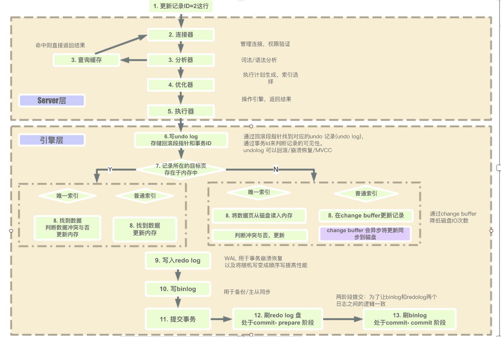
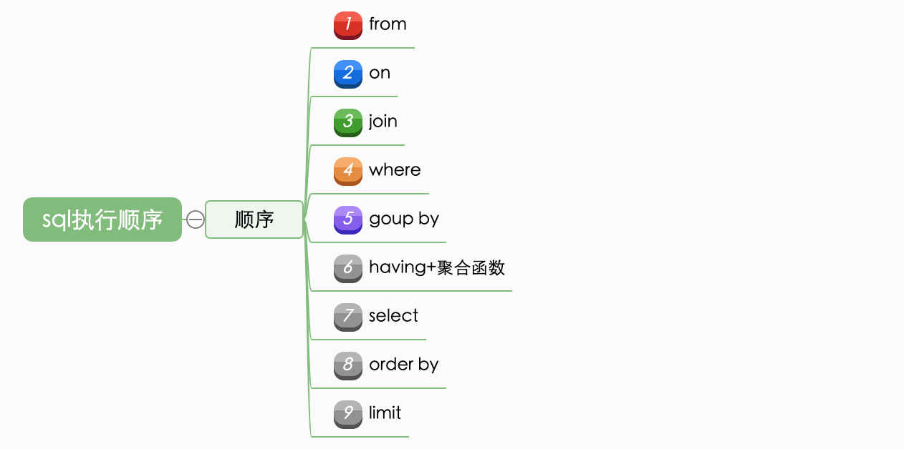
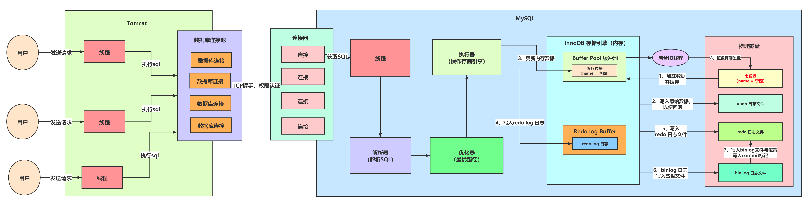

    这是“mysql”系列的第五篇文章，主要介绍的是sql查询过程。

# 一、mysql

<code>MySQL</code> 是一种广泛使用的开源关系型数据库管理系统（RDBMS--Relational Database Management System）

<!-- more -->

# 二、mysql执行过程
mysql整体的执行过程如下图所示：

# 三、sql的执行顺序

## 1：from
选出表

## 2：join on
- <code class='orange'>join ：表示要关联的表</code>
通过from和join on选择出需要执行的数据库表T和S，产生笛卡尔积，生成T和S合并的<code class='orange'>临时中间表Temp1</code>。
- <code class='orange'>on ：on是连接的条件</code>
确定表的绑定关系，通过on产生<code class='orange'>临时中间表Temp2</code>

## 4：where
表示筛选，根据where后面的条件进行过滤
<code class='orange'>得到临时表Temp3</code>

## 5：group by
进行分组，对where条件过滤后的临时表Temp3按照固定的字段进行分组，产生临时中间表Temp4
<code class='orange'>得到临时表Temp4</code>

## 6：having等聚合函数
聚合
对临时中间表Temp4进行聚合，这里可以为count等计数，然后产生中间表Temp5
<code class='orange'>得到临时表Temp5</code>

## 7：select
对分组聚合完的表挑选出需要查询的数据，如果为*会解析为所有数据，此时会产生中间表Temp6
<code class='orange'>得到临时表Temp6</code>

## 8：Distinct

distinct对所有的数据进行去重,此时如果有min、max函数会执行字段函数计算，然后产生<code class='orange'>临时表Temp7</code>

实例说明:此阶段对temp5中的数据进行去重,引擎API会调用去重函数进行数据的过滤,最终只保留id第一次出现的那条数据,然后产生临时中间表temp7

## 9：order by
会根据Temp7进行顺序排列或者逆序排列，然后插入临时中间表Temp8，这个过程比较耗费资源。

## 10：limit
limit对中间表Temp8进行分页，<code class='orange'>产生临时中间表Temp9</code>，返回给客户端。

# 四、数据更新流程

查看文章：
[mysql执行过程以及顺序](https://www.cnblogs.com/wyq178/p/11576065.html)

