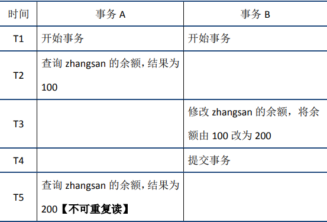
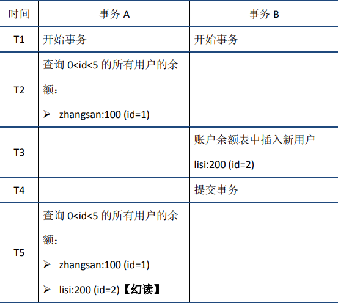
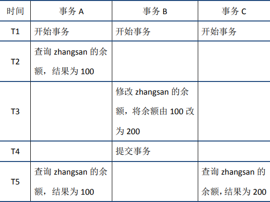
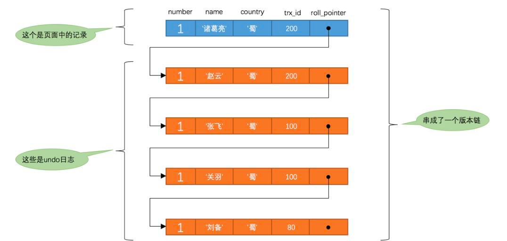
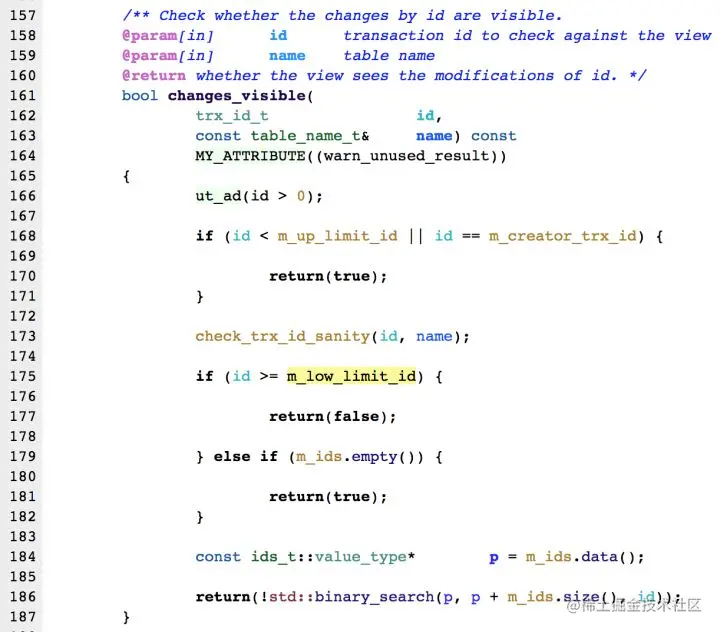

<style>
.orange {
   color: orange
}
.red {
   color: red
}
code {
   color: #0ABF5B;
}
</style>

    这是“mysql”系列的第六篇文章，主要介绍的是事务和MVCC。

# 一、mysql

<code>MySQL</code> 是一种广泛使用的开源关系型数据库管理系统（RDBMS--Relational Database Management System）

<!-- more -->

# 二、事务
事务处理几乎在每一个信息系统中都会涉及，它存在的意义是为了保证系统中所有的数据都是符合期望的，且相互关联的数据之间不会产生矛盾，即数据状态的**一致性（Consistency）**。

按照数据库的经典理论，要达成这个目标，需要三方面共同努力来保障。
- **原子性（atomic）**：在同一项业务处理过程中，事务保证了对多个数据的修改，要么同时成功，要么同时被撤销。
- **隔离性（Isolation）**：在不同的业务处理过程中，事务保证了各业务正在读、写的数据相互独立，不会彼此影响。
- **持久性（Durability）**：事务应当保证所有成功被提交的数据修改都能够正确地被持久化，不丢失数据。

> 在《凤凰架构》一书中提到：以上四种属性即事务的“`ACID`”特性，但笔者对这种说法其实不太认同，因为这四种特性并不正交，`A、I、D`是手段，`C`是目的，前者是因，后者是果，弄到一块去完全是为了拼凑个单词缩写（数据库科学家酷爱凑缩写的恶趣味...）。


## 2.1. 本地事务
**本地事务（Local Transaction）** 其实应该翻译成“局部事务”才好与稍后的“全局事务”相对于。
> 是一种最基础的事务解决方案，只适用于**单个服务**使用**单个数据源**的场景。

如今研究事务的实现原理，必定会追溯到**ARIES理论**（`Algorithms for Recovery and Isolation exploiting semantic， ARIES`），直接翻译过来是“基于语义的恢复与隔离算法”。
> **ARIES理论**是现代数据库的基础理论。三篇论文分别解决了ACID的三个属性：原子性、持久性、隔离性。


### 2.1.1. 实现原子性和持久性
**原子性和持久性**在事务里是密切相关的两个属性：
- ***原子性*** 保证了事务的多个操作要么都生效要么都不生效，不会存在中间状态。
- ***持久性*** 保证了一旦事务生效，就不会再因为任何原因而导致其修改的内容被撤销或丢失。

数据必须要成功写入磁盘、磁带等持久化存储器后**才能拥有持久性**，只存储在内存中的数据，一旦遇到应用程序忽然崩溃，或者数据库、操作系统一侧崩溃，甚至是机器忽然断电宕机等情况就会丢失，我们将这些意外情况都统称为“**崩溃”（crash）**。

实现原子性和持久性的**最大困难是“写入磁盘”这个操作并不是原子的**，不仅有“写入”与“未写入”状态，还客观存在着“正在写”的中间状态。由于写入存在中间状态，所以可能出现以下情况：
- **未提交事务，写入后崩溃：** 程序还没修改完三个数据，但数据库已经将其中一个或两个数据的变动写入磁盘，若此时出现崩溃，一旦重启之后，数据库必须要有办法得知崩溃前发生过一次不完整的操作，将已经修改过的数据从磁盘中恢复成没有改过的样子，以保证原子性。
- **已提交事务，写入前崩溃：**（已经执行提交事务这个动作，只是还没有完成）程序已经修改完三个数据，但数据库还未将全部三个数据的变动都写入磁盘，若此时出现崩溃，一旦重启之后，数据库必须要有办法得知崩溃前发生过一次完整的购物操作，将还没来得及写入磁盘的那部分数据重新写入，以保证原子性。

由于写入中间状态与崩溃都是无法避免的，为了保证原子性和持久性，就只能在崩溃后采取恢复的补救措施，这种数据恢复操作被称为 **“崩溃恢复”**（`crash recovery`）。

为了能够顺利地完成崩溃恢复，在磁盘中写入数据就不能像程序修改内存中的变量值那样，直接改变某表某行某列的某个值，而是必须将修改数据这个操作所需的全部信息，包括修改什么数据、数据物理上位于哪个内存页和磁盘块中、从什么值改成什么值，等等，**以日志的形式**--即以仅进行顺序追加的文件写入的形式（这是最高效的写入方式）**先记录到磁盘中**。

只有在日志记录全部安全落盘，数据库在日志中看到代表事务成功提交的“**提交记录（commit record）**”后，才会根据日志上的信息对真正的数据进行修改，修改完成后，再在日志中加入一条“**结束记录（end record）**”表示事务已完成持久化，这种事务失效方法被称为“**提交日志（commit Logging）**”
> 额外知识
> 
> 通过日志实现事务的原子性和持久性是当今的主流方案，但并不是唯一的选择。除日志外，还有另外一种称为“`shardow paging`”的事务实现机制，常用的轻量级数据库`SQLLite Version`采用的事务机制就是`shadow paging`。
> `shadow paging`的大体思路是对数据变动会写到磁盘的数据中，先复制一份副本，保留原数据，修改副本数据。

#### Commit Logging
`Commit Logging`保障数据持久性、原子性的原理并不难理解：
- 首先，日志一旦成功写入`commit record`，那整个事务就是成功的，即使真正修改数据时崩溃了，重启后根据已经写入磁盘的日志信息恢复现场、继续修改数据即可，这保证了持久性。
- 其次，如果日志没有成功写入`commit record`就发生崩溃，那整个事务就是失败的，系统重启后会看到一部分没有`commit record`的日志，将这部分日志标记为回滚状态即可，整个事务就像完全没有发生过一样，这保证了原子性。

> 阿里的OceanBase就是采用这种方式。

**Commit Logging缺点：**
- 所有对数据的真实修改都必须发生在事务提交以后，即日志写入了`commit record`之后。在此之前，即使磁盘I/O有足够空闲，即使某个事务修改的数据量非常庞大，占用了大量的内存缓冲区，无论何种理由，都决不允许在事务提交之前就修改磁盘上的数据，却对提升数据库的性能十分不利。
> 为此，ARIES提出了“提前写入日志”（Write-Ahead Logging）的日志改进方案，所谓“提前写入”（Write-Ahead），就是运行在事务提交之前写入变动数据的意思。

#### Write-Ahead Logging
`Write-Ahead Logging`按照事务提交时点，将何时写入变动数据划分为`FORCE`和`STEAL`两类情况。
- <code class='orange'>FORCE</code>：当**事务提交后**，要求变动数据必须同时完成写入则称为FORCE，如果不强制变动数据必须同时完成写入则称为`NO-FORCE`。现实中大部分数据库采用的是`NO-FORCE`策略，因为只要有了日志，变动数据随时可以持久化，从优化磁盘`I/O`性能考虑，没有必要强制数据写入时立即进行。
- <code class='orange'>STEAL</code>：在**事务提交前**，允许变动数据提前写入则称为`STEAL`，不允许则称为`NO-STEAL`。从优化磁盘`I/O`性能考虑，允许数据提前写入，有利于利用空闲`I/O`资源，也有利于节省数据库缓存区的内存。

`Write-Ahead Logging`允许`NO-FORCE`，也允许`STEAL`，它给出解决办法是增加了另一种被称为`Undo Log`的日志类型，当变动数据写入磁盘前，必须先记录`Undo Log`，注明修改了哪个位置的数据、从什么值改成什么值等。

|                     | `FORCE`（事务提交后，变动数据必须同时完成写入）  | `NO-FORCE`  | `STEAL` （变动数据提前写入） |
|---------------------|------------------------------|-------------|--------------------|
| Commit Logging      | 允许                           |             | 不允许                |
| Write-Ahead Logging |                              | 允许          | 允许                 |

由于`Undo Log`的加入`Write-Ahead Logging`在崩溃恢复时会经历如下三个阶段：
- **分析阶段（Analysis）**：该阶段从最后一次检查点（Checkpoint，可理解为在这个点之前所有应该持久化的变动都已安全落盘）开始扫描日志，找出所有没有**End Record**的事务，组成待恢复的事务集合，这个集合至少会包括**事务表**（`Transaction Table`）和**脏页表**（`Dirty Page Table`）两个组成部分。
- **重做阶段（Redo）**：该阶段依据分析阶段中产生的待恢复的事务集合来重演历史（`Repeat History`），具体操作是找出所有包含`Commit Record`的日志，将这些日志修改的数据写入磁盘，写入完成后在日志中增加一条`End Record`，然后移出待恢复事务集合。
- **回滚阶段（Undo）**：该阶段处理经过分析、重做阶段后剩余的恢复事务集合，此时剩余的都是需要回滚的事务，它们被称为Loser，根据Undo Log中的信息，将已经提前写入磁盘的信息重新改写回去，以达到回滚这些Loser事务的目的。


### 2.1.2. 实现隔离性
隔离性保证了每个事务各自读、写的数据互相独立，不会彼此影响。只从定义上就能嗅出隔离性肯定与<code class='red'>并发</code>密切相关，因为如果没有并发，所有事务全都是串行的，那就不需要任何隔离。

如何在并发下实现串行的数据访问呢？加锁同步！！！
- **写锁**（Write Lock，也叫做排它锁，eXclusive Lock，简写为`X-Lock`）：如果数据有加写锁，就只有持有写锁的事务才能对数据进行写入操作，数据加持着写锁时，其他事务不能写入数据，也不能施加读锁。
- **读锁**（Read Lock，也叫做共享锁，Shared Lock，简写为`S-Lock`）：多个事务可以对同一个数据添加多个读锁，数据被加上读锁后就不能再被加上写锁，所以其他事务不能对该数据进行写入，但仍然可以读取。
- **范围锁**（`Range Lock`）：对于某个范围直接加排他锁，在这个范围内的数据不能被写入。`SELECT * FROM books WHERE price < 100 FOR UPDATE;`
  - 加了范围锁后，不仅不能修改该范围内已有的数据，也不能在该范围内新增或删除任何数据，后者是一组排他锁的集合无法做到的。
- **多版本并发控制**（`MVCC`）：无锁优化方案。

#### 隔离级别
*并发控制*理论决定了隔离程度与并发能力是相互抵触的，隔离程度越高，并发访问时的吞吐量越低。现代数据库一定会提供除可串行化意外的其他隔离级别供用户使用，让用户自主调节隔离级别，根本目的是让用户可以调节数据库的加锁方式，取得隔离性与吞吐量之间的平衡。

这里介绍的是以`ARIES`理论为讨论目标，具体的数据库并不一定要完全遵照理论去实现。

- **可串行化（Serializable）**：
- **可重复读（Repeatable Read）**：可重复读对事务所涉及的数据加读锁和写锁，且一直持有至事务结束，但不再加范围锁。
  - 幻读问题（Phantom Read）：可重复读比可串行化弱化的地方，指在事务执行过程中，<code class='red'>两个完全相同的范围查询</code>得到了不同的结果集。是一个事务受到其他事务影响，隔离性被破坏的表现。
  - MySQL默认隔离级别，但它在只读事务中可以完全避免幻读问题。但在读写事务中，MySQL仍然会出现幻读问题。可重复读是通过`MVCC`和`next-key lock`分别解决快照读和当前读的幻读问题。
- **读已提交（Read Committed）**：对事务涉及的数据加的写锁会一直持续到事务结束，但加的读锁在查询操作完成后会马上释放。
  - 不可重复读问题：读已提交比可重复读弱化的地方在于不可重复读问题，是指在事务执行过程中，对<code class='red'>同一行数据</code>的两次查询得到了不同的结果。隔离性被破坏的表现。
- **读未提交（Read Uncommitted）**：它只会对事务涉及的数据加写锁，且一直持续到事务结束，但完全不加读锁。
  - 脏读问题（Dirty Read）：指事务执行过程中，一个事务读取到了另外一个事务未提交的数据。

以上四种隔离级别属于数据库理论的基础知识。不是数据库的某种固有属性或设定。

以上四种隔离级别有一个共同特点，就是幻读、不可重复读、脏读等问题都是由于一个事务在读数据的过程中，受另外一个写数据的事务影响而破坏了隔离性。

针对这种“一个事务读 + 另外一个事务写”的隔离问题，“多版本并发控制”（`Multi-version Concurrency control, MVCC`）是无锁优化方案。
> MVCC是只针对“读+写”场景的优化，如果两个事务同时修改数据，即“写+写”的情况，那就没有多少优化的空间了，此时加锁几乎是唯一可行的解决方案，稍微有点讨论余地的是加锁策略是选“**乐观加锁（Optimistic Locking)**”还是“**悲观加锁（Pessimistic Locking）**”


## 2.2、事务使用

```dtd
-- 开启事务
START TRANSACTION;
-- 执行 SQL 语句
UPDATE accounts SET balance = balance - 100 WHERE id = 1;
-- 提交事务
COMMIT;
```


# 三、并发带来的问题
首先来看并发情况下，读操作可能存在的三类问题：
- 脏读
- 不可重复读
- 幻读

## 3.1、脏读
脏读：当前事务(A)中可以读到其他事务(B)**未提交的数据**（脏数据），这种现象是脏读。举例如下（以账户余额表为例）：


## 3.2、不可重复读
不可重复读：在事务A中先后**两次读取同一个数据**，两次读取的结果不一样，这种现象称为不可重复读。脏读与不可重复读的区别在于：前者读到的是其他事务未提交的数据，后者读到的是其他事务已提交的数据。举例如下：

- <font color=red>**同一条数据**</font>：两次读取结果不一致。

## 3.3、幻读
幻读：在事务A中按照某个条件先后两次查询数据库，**两次查询结果的条数不同**，这种现象称为幻读。不可重复读与幻读的区别可以通俗的理解为：前者是数据变了，后者是数据的行数变了。举例如下：

- <font color=red>**一个范围的数据**</font>：两次读取结果不一致。
  - 通过next-key lock解决幻读


# 四、事务的隔离级别
为了解决并发带来的问题，定义了四种隔离级别来解决。隔离级别与读问题的关系如下：

- 需要注意的是，在SQL标准中，RR是无法避免幻读问题的；但是InnoDB实现的RR，在只读事务中可以避免幻读问题。


# 五、MVCC
<code>RR</code>解决脏读、不可重复读、幻读等问题，使用的是MVCC：`MVCC全称Multi-Version Concurrency Control`，即多版本的并发控制协议。下面的例子很好的体现了MVCC的特点：在同一时刻，不同的事务读取到的数据可能是不同的(即多版本)——在T5时刻，事务A和事务C可以读取到不同版本的数据。

`MVCC`最大的优点是读不加锁，因此读写不冲突，并发性能好。InnoDB实现MVCC，多个版本的数据可以共存，主要基于以下技术及数据结构：
1. **隐藏列**：InnoDB中每行数据都有隐藏列，隐藏列中包含了本行数据的事务id、指向undo log的指针等。
   - 隐藏的ID
   - 6字节的事务ID（DB_TRX_ID ）
   - 7字节的回滚指针（DB_ROLL_PTR）：指向undo segment中的undo log
2. **基于undo log的版本链**：前面说到每行数据的隐藏列中包含了指向undo log的指针，而每条undo log也会指向更早版本的undo log，从而形成一条版本链。
3. **ReadView 视图**：通过隐藏列和版本链，MySQL可以将数据恢复到指定版本；但是具体要恢复到哪个版本，则需要根据ReadView来确定。所谓ReadView，是指事务（记做事务A）在某一时刻给整个事务系统（trx_sys）打快照，之后再进行读操作时，会将读取到的数据中的事务id与trx_sys快照比较，从而判断数据对该ReadView是否可见，即对事务A是否可见。

`trx_sys`中的主要内容，以及<font color=red>**判断可见性**</font>的方法如下：
- **low_limit_id**：表示生成ReadView时系统中应该分配给下一个事务的id。如果数据的事务id大于等于low_limit_id，则对该ReadView不可见。
- **up_limit_id**：表示生成ReadView时当前系统中活跃的读写事务中最小的事务id。如果数据的事务id小于up_limit_id，则对该ReadView可见。
- **rw_trx_ids**：表示生成ReadView时当前系统中活跃的读写事务的事务id列表。如果数据的事务id在low_limit_id和up_limit_id之间，则需要判断事务id是否在rw_trx_ids中：如果在，说明生成ReadView时事务仍在活跃中，因此数据对ReadView不可见；如果不在，说明生成ReadView时事务已经提交了，因此数据对ReadView可见。

## 5.1、版本链

### 5.1.1、隐藏列
我们数据库中的每行数据，除了我们肉眼看见的数据，还有几个隐藏字段，得开天眼才能看到。分别是DB_TRX_ID、DB_ROLL_PTR、db_row_id。
- `DB_TRX_ID`
  6byte，最近修改(修改/插入)事务ID：记录创建这条记录/最后一次修改该记录的事务ID。
- `DB_ROLL_PTR`（版本链关键）
  7byte，回滚指针，指向这条记录的上一个版本（存储于rollback segment里）
- `db_row_id`
  6byte，隐含的自增ID（隐藏主键），如果数据表没有主键，InnoDB会自动以db_row_id产生一个聚簇索引。

实际还有一个删除flag隐藏字段, 记录被更新或删除并不代表真的删除，而是删除flag变了。


2个事务更新同一条数据

每次对数据库记录进行改动，都会记录一条undo日志，每条undo日志也都有一个roll_pointer属性（INSERT操作对应的undo日志没有该属性，因为该记录并没有更早的版本），可以将这些undo日志都连起来，串成一个链表，所以现在的情况就像下图一样：

我们把这个链表称之为【版本链】


## 5.2、Readview 读视图
Read View主要是用来做可见性判断的, 即当我们某个事务执行快照读的时候，对该记录创建一个Read View读视图，把它比作条件用来判断当前事务能够看到哪个版本的数据，既可能是当前最新的数据，也有可能是该行记录的undo log里面的某个版本的数据。

### 5.2.1、当前读、快照读都是什么鬼
它读取的数据库记录，都是当前最新的版本，会对当前读取的数据进行加锁，防止其他事务修改数据。是悲观锁的一种操作。

如下操作都是当前读：
- select lock in share mode (共享锁)
- select for update (排他锁)
- update (排他锁)
- insert (排他锁)
- delete (排他锁)
- 串行化事务隔离级别

### 5.2.2、快照读
快照读的实现是基于多版本并发控制，即MVCC，既然是多版本，那么快照读读到的数据不一定是当前最新的数据，有可能是之前历史版本的数据。

如下操作是快照读：
- 不加锁的select操作（注：事务级别不是串行化）


### 5.2.3、Readview 生成
事务进行<font color=red>**快照读操作**</font>的时候生产的读视图(Read View)，在该事务执行的快照读的那一刻，会生成数据库系统当前的一个快照。


### 5.2.4、ReadView几个属性
- <code>trx_ids</code>: 当前系统活跃(未提交)事务版本号集合。
- <code>low_limit_id</code>: 创建当前read view 时“当前系统<font color=red>**最大事务版本号**</font>+1”。
- <code>up_limit_id</code>: 创建当前read view 时“系统正处于活跃事务<font color=red>**最小版本号**</font>”
- <code>creator_trx_id</code>: 创建当前read view的事务版本号；

### 5.2.5、ReadView的可见性判断

- <code>**db_trx_id < up_limit_id**</code> || <code>db_trx_id</code> == <code>**creator_trx_id**</code>（显示）
  - 如果数据事务ID小于read view中的最小活跃事务ID，则可以肯定该数据是在当前事务启之前就已经存在了的,所以可以显示。
  - 或者数据的事务ID等于creator_trx_id ，那么说明这个数据就是当前事务自己生成的，自己生成的数据自己当然能看见，所以这种情况下此数据也是可以显示的。
- <font color=red>**db_trx_id >= low_limit_id**</font>（不显示）
  - 如果数据事务ID大于read view 中的当前系统的最大事务ID，则说明该数据是在当前read view 创建之后才产生的，所以数据不显示。如果小于则进入下一个判断
- <font color=red>**db_trx_id**</font>是否在活跃事务（trx_ids）中
  - 不存在：则说明read view产生的时候事务已经commit了，这种情况数据则可以显示。
  - 已存在：则代表我Read View生成时刻，你这个事务还在活跃，还没有Commit，你修改的数据，我当前事务也是看不见的。

# 六、MVCC和事务隔离级别
<code>Read View</code>用于支持<font color=red>**RC（Read Committed，读提交）**</font>和<font color=red>**RR（Repeatable Read，可重复读）**</font>隔离级别的实现。

## 6.1、RR、RC生成时机
- <code>**RC**</code>隔离级别下，是每个**快照读**都会生成并获取最新的Read View；
- <code>**RR**</code>隔离级别下，则是**同一个事务中**的**第一个快照读**才会创建Read View, 之后的快照读获取的都是同一个Read View，之后的查询就不会重复生成了，所以一个事务的**查询结果每次都是一样**的。

## 6.2、解决幻读问题
- **快照读**：通过MVCC来进行控制的，不用加锁。按照MVCC中规定的“语法”进行增删改查等操作，以避免幻读。
- **当前读**：通过next-key锁（行锁+gap锁）来解决问题的。


> 参考文章：
> 
> [全网最全一篇数据库MVCC详解，不全你打我](https://www.cnblogs.com/kismetv/p/10331633.html)
> [深入学习MySQL事务：ACID特性的实现原理](https://juejin.cn/post/6871046354018238472)
> [【MySQL】MVCC原理分析 + 源码解读 -- 必须说透](https://cloud.tencent.com/developer/article/2184720)