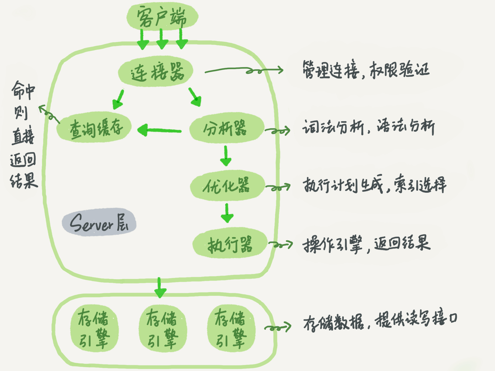
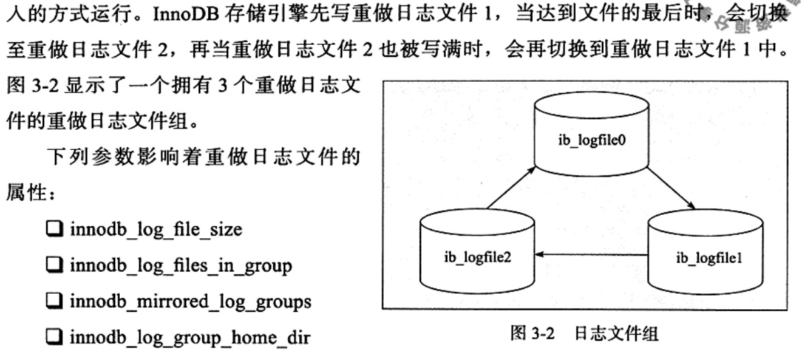
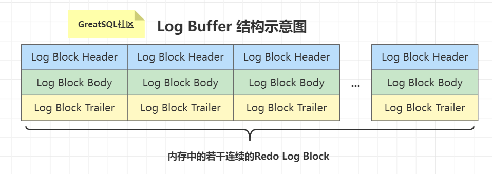
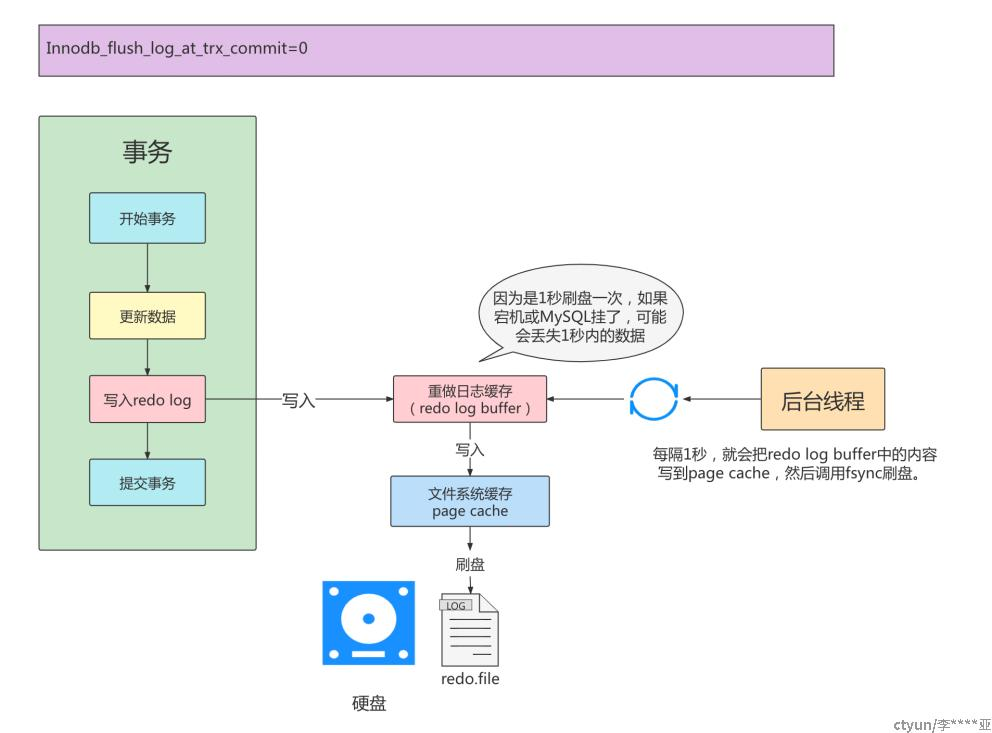
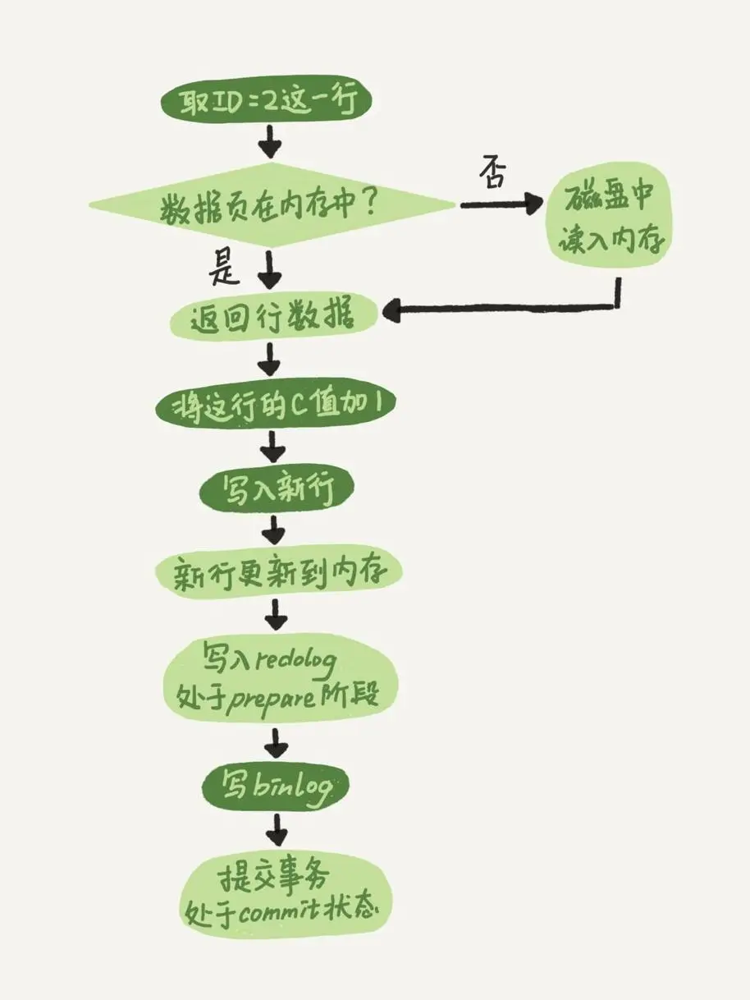
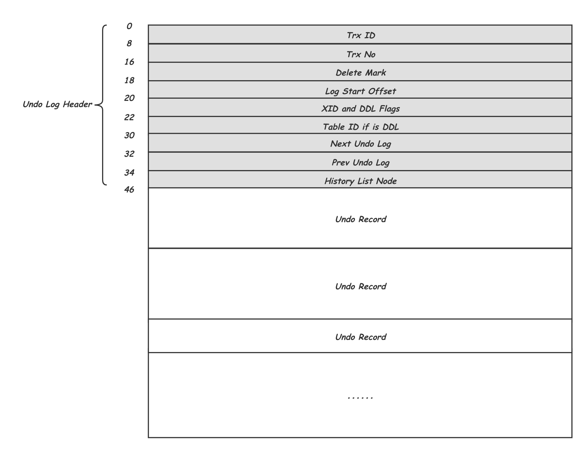
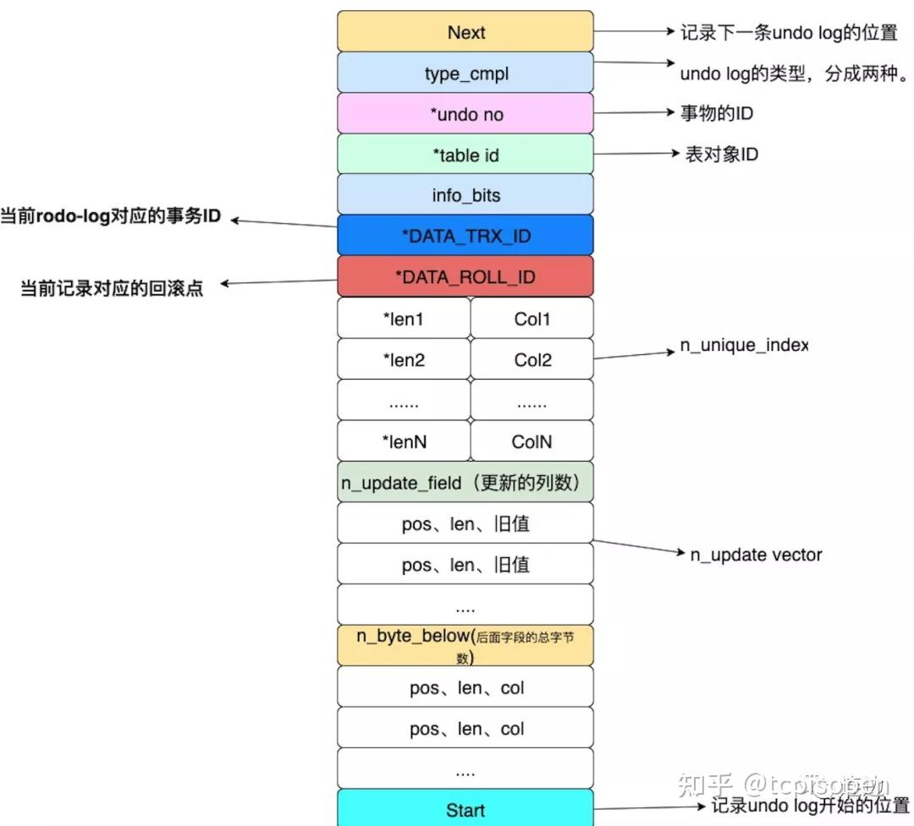
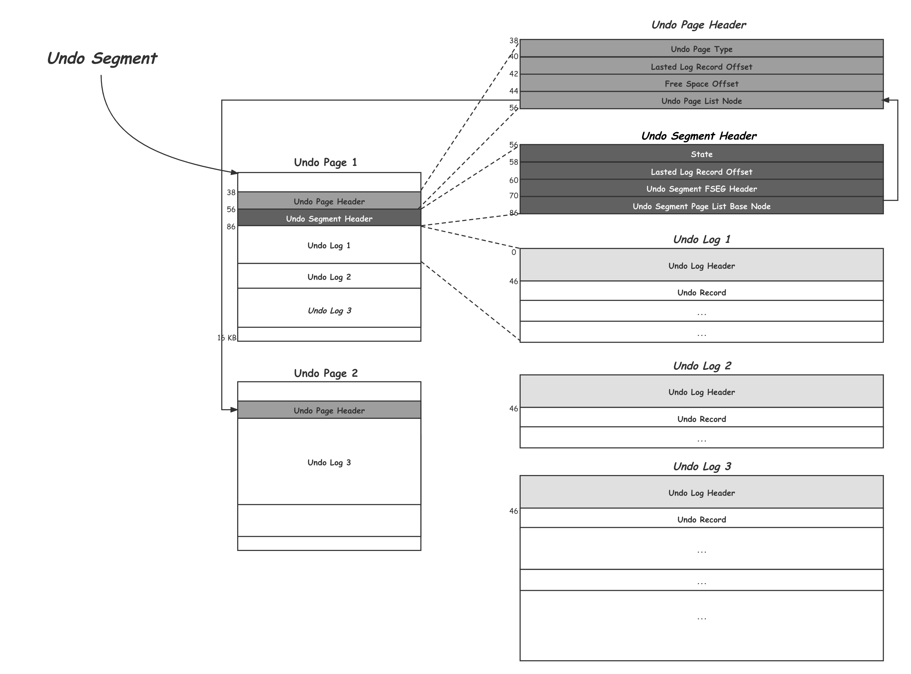

    这是“mysql”系列的第六篇文章，主要介绍的是日志。

# 一、mysql

<code>MySQL</code> 是一种广泛使用的开源关系型数据库管理系统（RDBMS--Relational Database Management System）

<!-- more -->
基本结构：


# 二、日志类别
日志文件记录了影响MySQL数据库的各种类型活动。常见的日志文件有：
- 错误日志（error log）
- 二进制日志（binlog）
- 慢查询日志（slow query log）
- 查询日志（log）

# 三、binlog（二进制日志)
二进制日志（binlog)记录了对MySQL数据库执行更改的所有操作，但不包含 select 和 show 这类操作。

## 3.1、binlog的作用：
1. **恢复（recovery）**：某些数据的恢复需要二进制日志，例如，在一个数据库全备文件恢复后，用户可以通过二进制日志进行 point-in-time 的恢复。
2. **复制（replication）**：主从复制。
3. **审计（audit）**：用户可以通过二进制日志中的信息来进行审计，判断是否有对数据库进行注入的攻击。

## 3.2、binlog 格式
### 3.2.1、satement
记录的是逻辑SQL语句，即记录的是执行的SQL语句
优点：日志文件较小
缺点：可能存在主从不一致的问题（如使用非确定性函数时）

### 3.2.2、row
记录变更前后的数据
优点：主从一致性高
缺点：日志文件较大
### 3.2.3、mixed
混合使用 satement 和 Row 格式

## 3.3、binlog的生成
Binlog（二进制日志）主要由 MySQL 服务器的主线程生成。

Binlog Event（二进制日志事件）是 MySQL 二进制日志（Binary Log，简称 Binlog）中的基本记录单元，Binlog 用于记录数据库的所有变更操作，而 Binlog Event 则详细描述了这些变更的具体信息。
### 3.3.1、Binlog Event类型
MySQL 支持多种类型的 Binlog Event，常见的类型如下：
- **Query Event**：记录执行的 SQL 查询语句，通常用于记录 DDL（数据定义语言）语句，如 <code>CREATE TABLE、ALTER TABLE</code> 等。当执行这类语句时，会生成一个 Query Event 并记录到 Binlog 中。
- **Write_rows Event**：用于记录 INSERT 操作，包含插入的行的具体数据。例如，当执行 <code>INSERT INTO users (name, age) VALUES ('John', 25);</code> 语句时，会生成一个 Write_rows Event 记录插入的 name 和 age 值。
- **Update_rows Event**：记录 UPDATE 操作，包含更新前后的行数据。例如，执行 <code>UPDATE users SET age = 26 WHERE name = 'John';</code> 语句时，会生成一个 Update_rows Event 记录更新前和更新后的 age 值。
- **Delete_rows Event**：记录 DELETE 操作，包含被删除的行的相关信息。当执行 <code>DELETE FROM users WHERE age > 30;</code> 语句时，会生成一个 Delete_rows Event 记录被删除行的条件和可能的部分数据。
- **Xid Event**：用于标记事务的提交，包含事务的唯一标识符（XID）。当一个事务提交时，会生成一个 Xid Event 记录该事务的结束。

### 3.3.2、Binlog Event结构
生成过程
- **执行 SQL 语句**：当客户端向 MySQL 服务器发送修改数据的 SQL 语句（如 INSERT、UPDATE、DELETE 等）时，执行器会执行这些语句并与存储引擎交互完成数据的修改。
- **收集变更信息**：在执行 SQL 语句的过程中，执行器会收集数据变更的详细信息，如插入的行数据、更新前后的值等。
- **生成 Binlog Event**：MySQL 服务器的主线程根据收集到的变更信息，将其组织成相应类型的 Binlog Event。例如，如果是 INSERT 语句，会生成 <code>Write_rows Event</code>。
- **写入 Binlog**：生成的 Binlog Event 会先被写入 Binlog Cache，在事务提交时，根据 <code>sync_binlog</code> 参数的设置，将 Binlog Cache 中的内容刷新到磁盘上的 Binlog 文件中。

## 3.4、binlog 的写入

### 3.4.1、binlog的刷盘策略
Binlog 的刷盘策略由<code>sync_binlog</code>参数控制：
- <code>sync_binlog=1</code>
    - 代表一个事务提交时会调用<code>fsync</code>磁盘<font color=red>**同步指令**</font>将binlog_cache中的数据写入磁盘，保证数据的不丢失，实际与页的写入是一致的。
    - **binlog由谁写入？**当事务提交时，**MySQL主线程**会负责将该事务产生的 Binlog 从 Binlog Cache 刷盘到 Binlog 文件。
- <code>sync_binlog=0</code>
    - MySQL主线程不会调用fsync命令，而是由操作系统自己决定什么时候刷入磁盘
    - 缓存占用内存比例达到一定比例
    - 超过一定时间
- <code>sync_binlog=n</code>
    - 代表n个事务提交才会写盘，此时数据是写入binlog_cache中，未写盘则会导致数据丢失，给数据恢复和复制带来问题。


## 3.5、crash-safe
即发生崩溃时，仍能够保证数据的完整性和一致性，并且能够将数据库恢复到崩溃前的一个一致状态。

### 为什么binlog无法保障crash-safe?
只有binlog日志的情况下，下面通过几个示例来说明：
<font color=green>**示例1**</font>
```
prepared
binlog
commit
```
sync_binlog=1，写入到二进制缓冲时会立马刷盘（指二进制文件刷盘），此时发生crash，commit未提交（数据库的脏页数据没有刷入磁盘），重启会事务回滚，而二进制日志刷盘了，从而数据出现问题。
> sync_binlog=1，不是能保证数据落盘吗？为什么还要redo log？
> 
> sync_binlog=1，只是能够解决binlog丢失问题，通过配置sync_binlog=1，表示每次事务的 binlog 都持久化到磁盘。这个参数也建议设置成 1，这样可以保证 MySQL 异常重启之后 binlog 不丢失


<font color=green>**示例2**</font>
```
prepared
commit
binlog
```
先提交事务再写binlog
- 事务commit，此时数据写入磁盘（这个数据是指数据库中的行数据，而不是指binlog日志数据），binlog未刷盘，有可能事务提交数据更新之后数据库崩了，还没来得及写binlog。我们都知道binlog一般用来做数据库的主从复制或恢复数据库，这样就导致主从数据库不一致或者无法恢复数据库了


## 3.6、binlog小结
Binlog 由 <font color=green>**MySQL server的SQL线程负责写入**</font>，用于记录所有对数据库的修改操作。它的写入过程涉及 Binlog缓存、Binlog文件和文件系统缓存，写入时机由 sync_binlog 参数控制。通过合理配置和优化，可以提高 Binlog 的写入性能，同时确保数据的一致性和持久性。


# 四、redo log（重做日志）
redo log（重做日志）是innodb的核心组件之一，用于保证事务的持久性和崩溃恢复。它的主要作用是记录对数据页的修改操作，以便在数据库崩溃后能够重新应用这些修改，确保数据的一致性。

## 4.1、redo log的作用
1. 保证事务的持久性
即使数据库崩溃，已提交事务的修改也不会丢失。
2. 支持崩溃恢复
在数据库重启时，通过重放 redo log 可以将数据恢复到崩溃前的状态。
3. 提高写性能
将对数据页的随机写操作转换为对 redo log 的顺序写操作，从而提高写入性能。

binlog无法保障crash-safe，redo log的作用是为了和binlog保持逻辑一致，通过“两阶段提交”，保证crash-safe。

## 4.2、redo log的结构

### 4.2.1、redo log 文件结构
redo log由多个固定大小的文件组成，通常位于MySQL的数据目录下，文件名为 <code>ib_logfile0</code> 和 <code>ib_logfile1</code>（默认配置）。redo log文件是循环使用的，写满后会从头开始覆盖。


### 4.2.2、redo log buffer 结构
<code>redo log buffer</code> 这片内存空间被划分成若干个连续的<code>Redo Log Block</code>。一个<code>Redo Log Block</code>占用512字节大小。最终也是以Bolck的格式写入到 redo log file中。


重做日志条目结构如下：

- redo_log_type占用1字节，表示重做日志的类型
- space 表示表空间的ID
- page_no 表示页的偏移量，同样采用压缩的方式
- redo_log_body 表示每个重做日志的数据部分，恢复时需要调用相应的函数进行解析。


## 4.3、redo log的生成
执行器触发生成
> 当客户端向 MySQL 服务器发送修改数据的 SQL 语句（如 INSERT、UPDATE、DELETE 等）时，执行器会根据优化器生成的执行计划与存储引擎进行交互，执行具体的数据修改操作。在这个过程中，执行器会触发存储引擎生成相应的 Redo Log。

存储引擎具体生成
> InnoDB 存储引擎负责实际生成 Redo Log。当对数据页进行修改时，存储引擎会记录这些修改操作的详细信息，包括修改的数据页编号、修改的偏移量、修改前和修改后的数据等。这些信息会被组织成 Redo Log 记录，并存储在 Redo Log Buffer 中。


## 4.3、redo log的写入

### 4.3.1、redo log buffer的写入
存储引擎在执行数据修改操作时，会实时生成 Redo Log 记录并将其写入 Redo Log Buffer，具体过程如下：
- **数据页定位与修改**：存储引擎接收到执行器的请求后，会定位到需要修改的数据页。如果数据页不在内存中，会先将其从磁盘加载到内存的缓冲池中。然后，在内存的数据页上进行实际的修改操作。
- **Redo Log 记录生成**：在对数据页进行修改的同时，存储引擎会根据修改操作的类型和内容生成相应的 Redo Log 记录。这些记录包含了修改的数据页编号、修改的偏移量、修改前和修改后的数据等详细信息，用于在数据库崩溃恢复时将数据页恢复到一致状态。
- **写入 Redo Log Buffer**：生成的 Redo Log 记录会被立即写入 Redo Log Buffer。Redo Log Buffer 是位于内存中的一块区域，用于临时存储 Redo Log 记录，这样可以减少直接进行磁盘 I/O 的次数，提高数据库的性能。

### 4.3.2、Redo 写盘操作
有几种场景可能会触发redo log写文件：
1. Redo log buffer空间不足时
2. 事务提交
3. 后台线程
4. 做checkpoint
5. 实例shutdown时
6. binlog切换时

我们所熟悉的参数<code>innodb_flush_log_at_trx_commit</code> <font color=red>**作用于事务提交时**</font>，这也是最常见的场景：
- 当设置该值为1时，每次事务提交都要做一次fsync，这是最安全的配置，即使宕机也不会丢失事务；
  - MySQL server的主线程会确保 Redo Log 从 Redo Log Buffer 写入操作系统的文件系统缓存，然后调用 fsync() 系统调用将文件系统缓存中的 Redo Log 数据同步到物理磁盘。在这个过程中，主线程直接与操作系统进行交互，而不是通过执行器。
- 当设置为2时，则在事务提交时只做write操作，只保证写到系统的page cache，因此实例crash不会丢失事务，但宕机则可能丢失事务；
  - MySQL server的主线程会将 Redo Log 写入文件系统缓存，但不会调用 fsync() 进行磁盘同步。
- 当设置为0时，事务提交不会触发redo写操作，而是留给后台线程每秒一次的刷盘操作，因此实例crash将最多丢失1秒钟内的事务。
  - Log Writer 线程会按照一定的规则，定期将 Redo Log Buffer（重做日志缓冲区）中的内容刷新到磁盘上的 Redo Log 文件中。Redo Log Buffer 是内存中的一块区域，用于临时存储事务的重做日志信息。Log Writer 线程会周期性地检查 Redo Log Buffer 的状态，当满足一定条件（如达到一定的时间间隔、缓冲区达到一定的使用比例等）时，就会将缓冲区中的日志数据写入磁盘。


### 4.3.2、redo log的写入过程

1. 事务执行
当事务对数据页进行修改时，innodb会生成对应的 redo log记录。
2. 写入 redo log buffer
redo log记录首先被写入内存中的 redo log buffer，刷新的时机由参数<code>innodb_flush_log_at_trx_commit</code>控制。
3. 刷新到磁盘
redo log文件的内容最终会被刷新到磁盘，以确保数据的持久性。

重做日志缓存往磁盘写入时，是按 512个字节，也就是一个扇区的大小进行写入。因为扇区是写入的最小单位，因此可以保证写入必定是成功的。因此在重做日志的写入过程中不需要有double write.

关键线程的作用：
1. log writer线程（归属于innodb）
将 redo log buffer中的内容写入操作系统的文件系统缓存。
2. log flusher线程
将文件系统缓存中的内容刷新到物流磁盘。

在早期 InnoDB 版本中 Redo Log 主要由 <code>Master Thread</code> 写入，而在较新的版本中，Redo Log 的写入工作由专门的 <code>log write</code> 线程负责。

# 五、两阶段提交
介绍完了 redo log 和 bin log，我们再看一下他们两者是如何配合完成两阶段提交的。

> 在mysql中数据更新的流程是：
> 1. 执行器先从引擎中找到数据，如果在内存则直接返回，如果不在内存查询后返回。
> 2. 执行器拿到数据后，会先修改数据，然后记录undolog，调用引擎接口重新写入数据。
> 3. 引擎将数据更新到内存，同时写入redo log，此时处于prepare状态。
>    1. 将事务的状态信息（如事务 ID、操作类型等）也记录到 redo log 中，并标记为 prepare 状态。
> 4. 执行器生成这个操作的binlog。
> 5. 执行器调用引擎的事务提交接口，将redo状态改成commit状态，更新完成。

**两阶段总结：**
1. **Prepare 阶段**：
    1. 由innodb存储引擎将 redo log 写文件并刷盘，此时redo log是**prepare**状态；
3. **commit阶段**：<font color=gray>Binlog 写入文件；binlog 刷盘；InnoDB commit；</font>
    1. MySQL server将binlog buffer的内容刷新到磁盘的 binlog 文件中。
        2. <code>sync_binlog=1：</code>代表一个事务提交时会调用fsync磁盘同步指令将binlog_cache中的数据写入磁盘，保证数据的不丢失
    2. innodb存储引擎的后台线程将 redo log buffer刷新到磁盘，redolog处于commit状态
        3. <code>innodb_flush_log_at_trx_commit=1：</code>表示在执行commit时将重做日志缓冲同步写到磁盘，即伴有fsync的调用。

## 5.1、为什么需要两阶段？
下面我们分析一下，采用两阶段提交的好处。
- 情景一，redo log 处于 prepare 状态时，如果写 bin log 失败了，那么更新失败，此时 redo log 没有 commit，bin log 也没有记录，两者的状态是一致的，没有问题。
- 情景二，redo log 处于 prepare 状态时，写 bin log 成功，但是宕机导致 commit 失败了。此时 bin log 产生了记录，redo log 没有写入成功，数据暂时不一致。

但是不用担心，当 MySQL 重启时，会检查 redo log 中处于 prepare 状态的记录。在 redo log 中，记录了一个叫做 XID 的字段，这个字段在 bin log 中也有记录，MySQL 会通过这个 XID，如果在 bin log 中找到了，那么就 commit 这个 redo log，如果没有找到，说明 bin log 其实没有写成功，就放弃提交。

通过这样的机制，保证了 redo log 和 bin log 的一致性。


# 六、undo log（回滚日志）
每一个事务对数据的修改都会被记录到 <code>undo log</code> ，当执行事务过程中出现错误或者需要执行回滚操作的话，MySQL 可以利用 <code>undo log</code> 将数据恢复到事务开始之前的状态。<code>undo log</code> 属于逻辑日志，记录的是 SQL 语句，比如说事务执行一条 DELETE 语句，那 <code>undo log</code> 就会记录一条相对应的 INSERT 语句。同时，undo log 的信息也会被记录到 redo log 中，因为 undo log 也要实现持久性保护。并且，undo-log 本身是会被删除清理的，例如 INSERT 操作，在事务提交之后就可以清除掉了；UPDATE/DELETE 操作在事务提交不会立即删除，会加入 history list，由后台线程 purge 进行清理。

## 6.1、作用
1. **事务回滚 - 原子性**： undo log是为了实现事务的原子性而出现的产物，事务处理的过程中，如果出现了错误或者用户执行ROLLBACK语句，MySQL可以利用undo log中的备份将数据恢复到事务开始之前的状态。
2. **多个行版本控制（MVCC）- 隔离性**： undo log在MySQL InnoDB储存引擎中用来实现多版本并发控制，事务未提交之前，当读取的某一行被其他事务锁定时，它可以从undo log中分析出该行记录以前的数据是什么，从而提供该行版本信息，让用户实现非锁定一致性读取。

## 6.2、undo log的生成
在事务中，进行以下四种操作，都会创建undo log：
- insert用户定义的表
- update或者delete用户定义的表
- insert用户定义的临时表
- update或者delete用户定义的临时表

### 6.2.1、生成时机
用undo log实现原子性和持久化的事务的简化过程：

假设有A、B两个数据，值分别为1,2。
- A. 事务开始
- B. 记录A=1到undo log中
- C. 修改A=3
- D. 记录B=2到undo log中
- E. 修改B=4
- F. 将undo log写到磁盘 -------undo log持久化
- G. 将数据写到磁盘 -------数据持久化
- H. 事务提交 -------提交事务

## 6.3、undo log的组织方式
这一小节我们将从几个层面来进行介绍：首先是在不考虑物理存储的情况下的逻辑组织方式； 之后，物理组织方式介绍如何将其存储到到实际16KB物理块中；然后文件组织方式介绍整体的文件结构；最后再介绍其在内存中的组织方式。

### 6.3.1、逻辑组织方式 - Undo Log
每个事务其实会修改一组的Record，对应的也就会产生一组Undo Record，这些Undo Record首尾相连就组成了这个事务的Undo Log。除了一个个的Undo Record之外，还在开头增加了一个Undo Log Header来记录一些必要的控制信息，因此，一个Undo Log的结构如下所示：

**Undo Log Header**中记录了产生这个Undo Log的事务的Trx ID；Trx No是事务的提交顺序，也会用这个来判断是否能Purge，这个在后面会详细介绍；Delete Mark标明该Undo Log中有没有TRX_UNDO_DEL_MARK_REC类型的Undo Record，避免Purge时不必要的扫描；Log Start Offset中记录Undo Log Header的结束位置，方便之后Header中增加内容时的兼容；之后是一些Flag信息；Next Undo Log及Prev Undo Log标记前后两个Undo Log，这个会在接下来介绍；最后通过History List Node将自己挂载到为Purge准备的History List中。

<font color=red>**索引中的同一个Record被不同事务修改，会产生不同的历史版本，这些历史版本又通过Rollptr穿成一个链表，供MVCC使用**</font>。如下图所示：


示例中有三个事务操作了表t上，主键id是1的记录，首先事务I插入了这条记录并且设置filed a的值是A，之后事务J和事务K分别将这条id为1的记录中的filed a的值修改为了B和C。I，J，K三个事务分别有自己的逻辑上连续的三条Undo Log，每条Undo Log有自己的Undo Log Header。从索引中的这条Record沿着Rollptr可以依次找到这三个事务Undo Log中关于这条记录的历史版本。同时可以看出，Insert类型Undo Record中只记录了对应的主键值：id=1，而Update类型的Undo Record中还记录了对应的历史版本的生成事务Trx_id，以及被修改的field a的历史值。

每当InnoDB中需要修改某个Record时，都会将其历史版本写入一个Undo Log中，这种Undo Record是Update类型。当插入新的Record时，还没有一个历史版本，但为了方便事务回滚时做逆向（Delete）操作，这里还是会写入一个Insert类型的Undo Record。

#### 6.3.1.1、undo log record 的类型
为了更好的处理回滚，undo log和之前说的redo log记录物理日志不一样，它是逻辑日志，可以认为当delete一条记录时，undo log中会记录一条对应的insert记录，反之亦然，当update一条记录时，它记录一条对应相反的update记录。 对应着undo log的两种类型，分别是 insert undo log和update undo log。

##### 1. insert undo log长啥样
对于 insert 类型的sql，会在undo log中记录下方才你insert 进来的数据的ID，根据ID完成精准的删除。


##### 2. update undo log长啥样
一条update sql对应undolog长如下这样：


### 6.3.2、物理组织格式【Undo Segment】
上面描述了一个Undo Log的结构，一个事务会产生多大的Undo Log本身是不可控的，而最终写入磁盘却是按照固定的块大小为单位的，InnoDB中默认是16KB，那么如何用固定的块大小承载不定长的Undo Log，以实现高效的空间分配、复用，避免空间浪费。InnoDB的基本思路是让多个较小的Undo Log紧凑存在一个Undo Page中，而对较大的Undo Log则随着不断的写入，按需分配足够多的Undo Page分散承载。下面我们就看看这部分的物理存储方式：

如上所示，是一个Undo Segment的示意图，每个写事务开始写操作之前都需要持有一个Undo Segment，一个Undo Segment中的所有磁盘空间的分配和释放，也就是16KB Page的申请和释放，都是由一个FSP的Segment管理的，这个跟索引中的Leaf Node Segment和Non-Leaf Node Segment的管理方式是一致的，这部分之后会有单独的文章来进行介绍。
- undo log 是采用 segment（段）的方式来记录的，每个 undo 操作在记录的时候占用一个 undo log segment（undo 日志段），undo log segment 包含在 rollback segment（回滚段）中。事务开始时，需要为其分配一个 rollback segment。每个 rollback segment 有 1024 个 undo log segment，这有助于管理多个并发事务的回滚需求。


# 七、各日志生成及写入流程总结


participant 客户端
participant mysqlserver
participant binlogbuffer
participant binlog
participant innodb
participant redologbuffer
participant redolog
participant undologsegment

客户端->mysqlserver: START TRANSACTION; \ninsert ... \ncommit;
activate mysqlserver #FFBBBB

==<font color=red>sql解析</font>==
mysqlserver->mysqlserver: sql解析

==<font color=red>执行insert</font>==
mysqlserver->innodb: ha_write_row，innodb执行插入
activate innodb #FFBBBB
innodb->innodb: row_ins，行插入操作
activate innodb #FFBBBB
innodb->innodb: row_ins_index_entry，向索引中插入数据
activate innodb #FFBBBB 
innodb->innodb: mtr.start()，开启mini事务
innodb->undologsegment: <font color=red>btr_cur_ins_lock_and_undo，写入undo日志</font>
activate undologsegment #FFBBBB
deactivate undologsegment
innodb->innodb: page_cur_tuple_insert，在Page游标的下一个位置点Insert数据
innodb->innodb: mtr.commit()，提交mini事务
activate innodb #FFBBBB
innodb->innodb: 将修改的脏页加入flush list中
innodb->redologbuffer: <font color=red>将redo日志一起拷贝到log_sys模块的公共日志buffer中。</font>
activate redologbuffer #FFBBBB
deactivate redologbuffer
deactivate innodb
deactivate innodb
deactivate innodb
innodb-->mysqlserver:
deactivate innodb

==<font color=red>事务提交</font>==
mysqlserver->mysqlserver:trans_commit，事务提交
activate mysqlserver #FFBBBB
==<font color=red>事务提交-prepare阶段</font>==
mysqlserver->mysqlserver: <font color=green>**MYSQL_BIN_LOG::prepare**</font>
activate mysqlserver #FFBBBB
mysqlserver->mysqlserver: binlog_prepare
mysqlserver->innodb: innobase_xa_prepare
activate innodb #FFBBBB
innodb->innodb: undo 段的状态从 TRX_UNDO_ACTIVE 修改为 TRX_UNDO_PREPARED
innodb->innodb: 事务对象状态从 TRX_STATE_ACTIVE 修改为 TRX_STATE_PREPARED。
innodb->innodb: 调用 trx_flush_logs()，处理 redo 日志刷盘的相关逻辑。
innodb->redologbuffer: 将redo日志一起拷贝到log_sys模块的公共日志buffer中。
activate redologbuffer #FFBBBB
deactivate redologbuffer
innodb-->mysqlserver:
deactivate innodb
deactivate mysqlserver
==<font color=red>事务提交-commit阶段</font>==
mysqlserver->mysqlserver: <font color=green>**MYSQL_BIN_LOG::ordered_commit**</font>
activate mysqlserver #FFBBBB
mysqlserver->mysqlserver: 1. flush 子阶段
activate mysqlserver #FFBBBB
mysqlserver->redolog: <font color=red>根据 innodb_flush_log_at_trx_commit 参数进行 redo log 的刷盘操作</font>
activate redolog #FFBBBB
deactivate redolog
mysqlserver->binlogbuffer: <font color=red>将 trx_cache 中的数据 flush 到 binlog cache 中</font>
activate binlogbuffer #FFBBBB
deactivate binlogbuffer
deactivate mysqlserver
mysqlserver->mysqlserver: 2. sync 子阶段
activate mysqlserver #FFBBBB
mysqlserver->binlog: <font color=red>根据 sync_binlog 的参数设置进行刷盘前的等待并调用 fsync() 进行刷盘</font>
activate binlog #FFBBBB
deactivate binlog
deactivate mysqlserver
mysqlserver->mysqlserver: 3. commit 子阶段
activate mysqlserver #FFBBBB

deactivate mysqlserver




**各文件写入顺序**：
- undo log 写入
- 数据写入
- redolog写入
  - redo log buffer
  - redo log 刷盘
- binlog 写入
  - 写入binlog buffer
  - binlog 刷盘


参考文章：
[MySQL Binlog 源码入门](http://mysql.taobao.org/monthly/2023/01/04/)
[MySQL · 引擎特性 · InnoDB 事务子系统介绍](http://mysql.taobao.org/monthly/2015/12/01/)
[07 期 | 二阶段提交 (1) prepare 阶段](https://opensource.actionsky.com/07-%e6%9c%9f-%e4%ba%8c%e9%98%b6%e6%ae%b5%e6%8f%90%e4%ba%a4-1-prepare-%e9%98%b6%e6%ae%b5/)