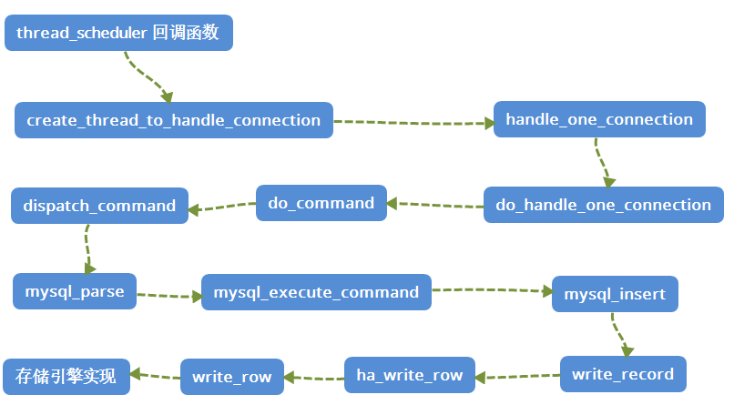
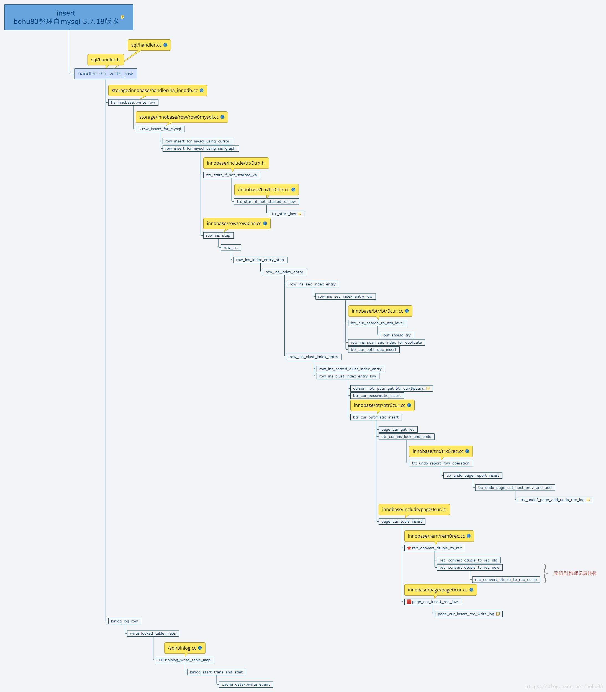

<style>
.orange {
   color: orange
}
.red {
   color: red
}
code {
   color: #0ABF5B;
}
</style>

    这是“mysql”系列的第五篇文章，主要介绍的是Insert流程部分源码。

# 一、mysql

<code>MySQL</code> 是一种广泛使用的开源关系型数据库管理系统（RDBMS--Relational Database Management System）

<!-- more -->

# 二、一条Insert语句的执行过程
一条INSERT语句的执行过程堆栈总结如下，主要是两个步骤：
- **事务执行阶段**（`execute`方法）
  - undo log生成
  - redo log生成
  - binlog 生成
- **事务提交阶段**（`trans_commit_stmt(thd)`）
  - prepare阶段
  - commit阶段
```text
mysql_execute_command
    -> Sql_cmd_insert::execute（事务执行阶段）
        -> mysql_insert
            -> write_record
                -> ha_write_row
                    -> write_row：存储引擎的具体实现
                    -> binlog_log_row(table, 0, buf, log_func)：写binlog
    -> trans_commit_stmt(thd);（事务提交阶段）
        -> ha_commit_trans  
```


## 2.1、命令执行
命令执行<code>mysql_execute_command</code>：（`sql/sql_parse.cc`）
```cpp
int
mysql_execute_command(THD *thd, bool first_level)
{
    switch (lex->sql_command) {
      /* ...... */
      case SQLCOM_INSERT: //插入
      case SQLCOM_REPLACE_SELECT:
      case SQLCOM_INSERT_SELECT:
      {
        assert(first_table == all_tables && first_table != 0);
        assert(lex->m_sql_cmd != NULL);
        res= lex->m_sql_cmd->execute(thd); // 插入语句的核心执行入口
        break;
      }
    }
    trans_commit_stmt(thd);
  }
}
```
`lex->m_sql_cmd->execute(thd);`
- `lex`：词法分析器对象（`LEX`），保存了解析后的SQL语句信息。
- `m_sql_cmd`：指向具体 `SQL` 命令的处理对象（如 `Sql_cmd_insert, Sql_cmd_insert_select`）
- `execute(thd)`：
  - 根据 `SQL` 命令类型调用对应的执行函数。
  - `thd`：线程上下文（`THD`），包含当前会话的元信息（如连接、事务、临时表等）

## 2.2、execute(thd)
在 `sql/sql_insert.cc` 文件中，执行逻辑如下：
```cpp
bool Sql_cmd_insert::execute(THD *thd)
{
    if (insert_precheck(thd, all_tables)) //检查，
        return true;
    res= mysql_insert(thd, all_tables);//插入
}
```
进入 `mysql_insert()`，源码在<code>sql/sql_insert.cc</code>
```cpp
bool mysql_insert(THD *thd,TABLE_LIST *table_list,
                  List<Item> &fields, /* insert 的字段 */
                  List<List_item> &values_list, /* insert 的值 */
                  List<Item> &update_fields,
                  List<Item> &update_values,
                  enum_duplicates duplic,
                  bool ignore)
{ 
  /*对每条记录调用 write_record */
  while ((values= its++))
  {
	if (lock_type == TL_WRITE_DELAYED)
    {
      LEX_STRING const st_query = { query, thd->query_length() };
      DEBUG_SYNC(thd, "before_write_delayed");
      /* insert delay */
      error= write_delayed(thd, table, st_query, log_on, &info);
      DEBUG_SYNC(thd, "after_write_delayed");
      query=0;
    }
    else 
      /* normal insert */
      error= write_record(thd, table, &info, &update);
  }
  
  /*
    这里还有
    thd->binlog_query()写binlog
    my_ok()返回ok报文，ok报文中包含影响行数
  */
```
进入 `write_record`
```cpp
/*
  COPY_INFO *info 用来处理唯一键冲突，记录影响行数
  COPY_INFO *update 处理 INSERT ON DUPLICATE KEY UPDATE 相关信息
*/
int write_record(THD *thd, TABLE *table, COPY_INFO *info, COPY_INFO *update)
{
  if (duplicate_handling == DUP_REPLACE || duplicate_handling == DUP_UPDATE)
  {
    /* 处理 INSERT ON DUPLICATE KEY UPDATE 等复杂情况 */
  }
  /* 调用存储引擎的接口 */
  else if ((error=table->file->ha_write_row(table->record[0])))
  {
    DEBUG_SYNC(thd, "write_row_noreplace");
    if (!ignore_errors ||
        table->file->is_fatal_error(error, HA_CHECK_DUP))
      goto err; 
    table->file->restore_auto_increment(prev_insert_id);
    goto ok_or_after_trg_err;
  }
}
```
`ha_write_row`，存储引擎抽象的`Handler API` !, 源码在<code>sql/handler.cc</code>
```cpp
/* handler 是各个存储引擎的基类，这里我们使用InnoDB引擎*/
int handler::ha_write_row(uchar *buf)
{
  /* 指定log_event类型*/
  Log_func *log_func= Write_rows_log_event::binlog_row_logging_function;
  MYSQL_TABLE_IO_WAIT(PSI_TABLE_WRITE_ROW, MAX_KEY, error,
    { error= write_row(buf); })
  if (unlikely((error= binlog_log_row(table, 0, buf, log_func))))
  
}
```
`handler` 是各个存储引擎的基类，这里我们使用InnoDB引擎。可以看到，调用链还是挺深的，追到 `ha_write_row` 方法基本上算是追到头了，再往下的话就是 `MySql Server` 给 `Storage Engine`提供的接口实现了（进入引擎层，这里是`innodb`引擎，`handler`对应`ha_innobase` 插入的表信息保存在`handler`中）
- `MYSQL_TABLE_IO_WAIT`：性能监控中的一个关键机制，用于跟踪和记录表基本的I/O订单事件，帮助分析数据库的I/O性能瓶颈。
- `write_row`：具体存储引擎实现。
- `binlog_log_row`：将行数据变更记录到二进制日志。

> <code class='red'>handler</code>是MySQL存储引擎接口的核心类，定义了存储引擎需要实现的方法。每个存储引擎都必须实现handler类的方法。
> - `ha_write_row`：插入数据
> - `ha_update_row`：更新数据
> - `ha_delete_row`：删除数据
> - `ha_index_read`：读取索引数据
> - `ha_commit_low`：提交事务
> ```cpp
> //handler.h文件
> class handler :public Sql_alloc
> {
>   int ha_write_row(uchar * buf);
>   int ha_update_row(const uchar * old_data, uchar * new_data);
>   int ha_delete_row(const uchar * buf);
> }
> ```


这么多方法，看起来有点懵懵的吧，我来画一张图，帮助大家理解下这个调用堆栈。

如下火焰图，也能很清晰的了解执行过程：


# 三、【事务执行阶段】innodb执行插入
先看一下整体的流程：

再分析具体的源码，源码路径：`storage/innobase/handler/ha_innodb.cc`
```cpp
int
ha_innobase::write_row(
/*===================*/
    uchar*  record) /*!< in: a row in MySQL format */
{
    // 隐式事务
    trx = thd_to_trx(thd); // 获取事务对象
    TrxInInnoDB trx_in_innodb(trx); // 隐式开启事务（若未启动）
    sql_command = thd_sql_command(m_user_thd);
	if ((sql_command == SQLCOM_ALTER_TABLE
	     || sql_command == SQLCOM_OPTIMIZE
	     || sql_command == SQLCOM_CREATE_INDEX
	     || sql_command == SQLCOM_DROP_INDEX)
	    && m_num_write_row >= 10000) 
	{
	    //涉及大量数据重写或索引重建，直接锁表
    } else {
        //实际执行插入逻辑，涉及事务和索引操作
        error = row_insert_for_mysql((byte*) record, prebuilt);
    }
}
```
当数据量少时，执行 `storage/innobase/row/row0mysql.cc`文件的`row_insert_for_mysql()`函数，实际执行插入逻辑，涉及**事务和索引**操作。
```cpp
dberr_t
row_insert_for_mysql(
	const byte*		mysql_rec,
	row_prebuilt_t*		prebuilt)
{
	// 表是intrinsic table（一种特殊的内存临时表）
	if (dict_table_is_intrinsic(prebuilt->table)) {
	    // 游标的方式插入
		return(row_insert_for_mysql_using_cursor(mysql_rec, prebuilt));
	} else {
	    // 普通表
		return(row_insert_for_mysql_using_ins_graph(
			mysql_rec, prebuilt));
	}
}
```
普通表：调用`row_insert_for_mysql_using_ins_graph`，构建完整的插入执行路径，处理以下复杂逻辑：
- 事务的 `undo/redo` 日志记录（保证原子性和持久性）
- 行级锁的获取（如 `FOR update` 或 隔离级别要求的锁）
- 索引维护（更新所有相关索引的B+树结构）
- 约束检查（如唯一键、外键约束）
- 触发器的调用（如有定义）

```cpp
static
dberr_t
row_insert_for_mysql_using_ins_graph(
	const byte*	mysql_rec,
	row_prebuilt_t*	prebuilt)
{
    // 插入数据
    row_ins_step(thr);
}
```
继续解析插入数据的流程：
```cpp
UNIV_INTERN
que_thr_t*
row_ins_step(
/*=========*/
        que_thr_t*      thr)    /*!< in: query thread */
{
    // 获取事务，判断事务状态
    trx = thr_get_trx(thr);
    // 事务ID
    trx_write_trx_id(node->trx_id_buf, trx->id);
    /*给表加IX锁*/
    err = lock_table(0, node->table, LOCK_IX, thr);
    
    /*插入记录*/
    err = row_ins(node, thr);
}
```
InnoDB表是基于`B+`树的索引组织表，如果InnoDB表没有主键和唯一键，需要分配隐含的`row_id`组织聚集索引，`row_id`分配逻辑在`row_ins`中，这里不详细展开
```cpp
static __attribute__((nonnull, warn_unused_result))
dberr_t
row_ins(
/*====*/
        ins_node_t*     node,   /*!< in: row insert node */
        que_thr_t*      thr)    /*!< in: query thread */
{
    if (node->state == INS_NODE_ALLOC_ROW_ID) {
        /*若innodb表没有主键和唯一键，用row_id组织索引*/
        row_ins_alloc_row_id_step(node);
        
        /*获取row_id的索引*/
        node->index = dict_table_get_first_index(node->table);
        node->entry = UT_LIST_GET_FIRST(node->entry_list);
    }
    
    /*遍历所有索引，向每个索引中插入记录*/
    while (node->index != NULL) {
        if (node->index->type != DICT_FTS) {
                /* 向索引中插入记录 */
                err = row_ins_index_entry_step(node, thr);
                if (err != DB_SUCCESS) {
                        return(err);
                }
        }                                                                                                                                                                                           
        /*获取下一个索引*/
        node->index = dict_table_get_next_index(node->index);
        node->entry = UT_LIST_GET_NEXT(tuple_list, node->entry);
        }
    }
}
```
插入单个索引项
```cpp
static __attribute__((nonnull, warn_unused_result))
dberr_t
row_ins_index_entry_step(                                                                                                                                                                                   
/*=====================*/
        ins_node_t*     node,   /*!< in: row insert node */
        que_thr_t*      thr)    /*!< in: query thread */
{
    dberr_t err;

    /*给索引项赋值*/
    row_ins_index_entry_set_vals(node->index, node->entry, node->row);

    /*插入索引项*/
    err = row_ins_index_entry(node->index, node->entry, thr);

    return(err);
}
```
## 3.1、插入索引记录
<code>row_ins_index_entry</code> 函数的主要功能是将一条新的**索引记录**插入到 InnoDB 存储引擎的索引结构（主键或二级索引）中，并处理相关约束（如唯一性检查、锁冲突等）执行的 具体源码如下：
```cpp
static
dberr_t
row_ins_index_entry(                                                                                                                                                                                        
/*================*/
        dict_index_t*   index,  /*!< in: index */
        dtuple_t*       entry,  /*!< in/out: index entry to insert */
        que_thr_t*      thr)    /*!< in: query thread */
{

    if (dict_index_is_clust(index)) {
        /* 插入聚集索引 */
        return(row_ins_clust_index_entry(index, entry, thr, 0));
    } else {
        /* 插入二级索引 */
        return(row_ins_sec_index_entry(index, entry, thr));
    }
}
```
索引分为：聚合索引、二级索引。
- 逻辑都会先尝试page不分离的插入方式，需要定位到记录插入的位置，完成mlog的数据更新，在mtr提交过程中，
  - 1、redo写入公共buffer；
  - 2、把更新的page加到buffer pool的flush list，脏页上记录的lsn为当前mtr写入的结束点lsn，基于加锁逻辑，能够保证flush list上的脏页总是以LSN排序。

### 3.1.1、聚合索引 Insert Record流程
`row_ins_clust_index_entry` 和 `row_ins_sec_index_entry` 函数结构类似，只分析插入聚集索引，源码如下：
- 主要是判断乐观、悲观方式进行插入入。
```cpp
UNIV_INTERN
dberr_t
row_ins_clust_index_entry(
/*======================*/
        dict_index_t*   index,  /*!< in: clustered index */
        dtuple_t*       entry,  /*!< in/out: index entry to insert */
        que_thr_t*      thr,    /*!< in: query thread */
        ulint           n_ext)  /*!< in: number of externally stored columns */
{
    if (UT_LIST_GET_FIRST(index->table->foreign_list)) {
        err = row_ins_check_foreign_constraints(
                index->table, index, entry, thr);
        if (err != DB_SUCCESS) {
                return(err);
        }
    }
    
    /* flush log，make checkpoint（如果需要） */
    log_free_check();

    /* 先尝试乐观插入，修改叶子节点 BTR_MODIFY_LEAF */
    err = row_ins_clust_index_entry_low(
            0, BTR_MODIFY_LEAF, index, n_uniq, entry, n_ext, thr, 
            &page_no, &modify_clock);
            
    if (err != DB_FAIL) {
            DEBUG_SYNC_C("row_ins_clust_index_entry_leaf_after");
            return(err);
    }    
    
    /* flush log，make checkpoint（如果需要） */
    log_free_check();

    /* 乐观插入失败，尝试悲观插入 BTR_MODIFY_TREE */
    return(row_ins_clust_index_entry_low(
        0, BTR_MODIFY_TREE, index, n_uniq, entry, n_ext, thr,
        &page_no, &modify_clock));
```

`row_ins_clust_index_entry_low`是**插入主键索引记录**的核心函数，负责处理主键唯一性校验、锁机制、乐观/悲观插入策略以及页面分裂等逻辑。关键点包括：
- **主键唯一性校验**：通过`S/X Record Lock`防止重复插入。
- **锁机制**：隐式锁转换、`SX Lock` 和 `Non-leaf Page Lock`优化。
- **死锁处理**：检查并回滚冲突事务
- **版本优化**：MySQL 8.0引入的SX Lock显著提升了并发性能。
```cpp
UNIV_INTERN
dberr_t
row_ins_clust_index_entry_low(
{
    /*启动mini transaction*/
    mtr_start(&mtr); // 初始化 `MTR` 结构体 （`mtr_t`）、分配锁栈 （`Lock Stack`）和日志栈（`Log Stack`）
    // 定位插入位置
    btr_pcur_open(index, entry, PAGE_CUR_LE, mode, &pcur, &mtr);
	cursor = btr_pcur_get_btr_cur(&pcur);
	cursor->thr = thr;
    
    /*根据不同的flag检查主键冲突*/
    err = row_ins_duplicate_error_in_clust_online(
            n_uniq, entry, &cursor,
            &offsets, &offsets_heap);
    err = row_ins_duplicate_error_in_clust(
            flags, &cursor, entry, thr, &mtr);
    /*
      如果要插入的索引项已存在，则把insert操作改为update操作
      索引项已存在，且没有主键冲突，是因为之前的索引项对应的数据被标记为已删除
      本次插入的数据和上次删除的一样，而索引项并未删除，所以变为update操作		
    */
    if (row_ins_must_modify_rec(&cursor)) {
        /* There is already an index entry with a long enough common
        prefix, we must convert the insert into a modify of an
        existing record */
        mem_heap_t*     entry_heap      = mem_heap_create(1024);
        
        /* 更新数据到存在的索引项 */
        err = row_ins_clust_index_entry_by_modify(
                flags, mode, &cursor, &offsets, &offsets_heap,
                entry_heap, &big_rec, entry, thr, &mtr);
        
        /*如果索引正在online_ddl，先记录insert*/
        if (err == DB_SUCCESS && dict_index_is_online_ddl(index)) {
                row_log_table_insert(rec, index, offsets);
        }

        /*提交mini transaction*/
        mtr_commit(&mtr);
        mem_heap_free(entry_heap);
    } else {
        rec_t*  insert_rec;

        if (mode != BTR_MODIFY_TREE) {
            /*进行一次乐观插入*/
            err = btr_cur_optimistic_insert(
                    flags, &cursor, &offsets, &offsets_heap,
                    entry, &insert_rec, &big_rec,
                    n_ext, thr, &mtr);
        } else {
            /*
              如果buffer pool余量不足25%，插入失败，返回DB_LOCK_TABLE_FULL
              处理DB_LOCK_TABLE_FULL错误时，会回滚事务
              防止大事务的锁占满buffer pool(注释里写的)
            */
            if (buf_LRU_buf_pool_running_out()) {

                err = DB_LOCK_TABLE_FULL;
                goto err_exit;
            }

            if (/*太长了，略*/) {
                 /*进行一次乐观插入*/
                err = btr_cur_optimistic_insert(
                        flags, &cursor,
                        &offsets, &offsets_heap,
                        entry, &insert_rec, &big_rec,
                        n_ext, thr, &mtr);
            } else {
                    err = DB_FAIL;
            }

            if (err == DB_FAIL) {
                 /*乐观插入失败，进行悲观插入*/
                err = btr_cur_pessimistic_insert(
                        flags, &cursor,
                        &offsets, &offsets_heap,
                        entry, &insert_rec, &big_rec,
                        n_ext, thr, &mtr);
            }
        }
        if (big_rec != NULL) {
            mtr_commit(&mtr);
        }
    }
}
```
总结流程如下：
- 开启 mini transaction
- 获取游标
- 数据插入
  - **乐观插入**：`btr_cur_optimistic_insert`
  - **悲观插入**：`btr_cur_pessimistic_insert`
- 提交 mini transaction


#### 3.1.1.1、开启mini transaction
`Mini transaction`(简称mtr)是`InnoDB`对物理数据文件操作的**最小事务单元**，用于管理对`Page`加锁、修改、释放、以及日志提交到公共`buffer`等工作。一个`mtr`操作必须是原子的，一个事务可以包含多个`mtr`。每个`mtr`完成后需要将本地产生的日志拷贝到公共缓冲区，将修改的脏页放到`flush list`上。
> innodb存储引擎中的一个很重要的用来**保证持久性**的机制就是mini事务（`Mini transaction`(简称mtr)），本书把它称做“物理事务”，这样叫是相对逻辑事务而言的，
> - 对于逻辑事务，做熟悉数据库的人都很清楚，它是数据库区别于文件系统的最重要特性之一，它具有四个特性ACID，用来保证数据库的完整性——要么都做修改，要么什么都没有做。
> - 物理事务从名字来看，是物理的，因为在innodb存储引擎中，只要是涉及到文件修改，文件读取等物理操作的，都离不开这个物理事务，可以说物理事务是**内存与文件**之间的一个桥梁。

开启`MTR`，执行如下代码块：
```cpp
mtr_start(&mtr);
mtr.set_named_space(index->space);
```
`mtr_start`主要包括：
- 初始化`mtr`的各个状态变量
- 默认模式为`MTR_LOG_ALL`，表示记录所有的数据变更
- `mtr`状态设置为`ACTIVE`状态（`MTR_STATE_ACTIVE`）
- 为锁管理对象和日志管理对象初始化内存（`mtr_buf_t`）,初始化对象链表
> **MTR 结构体（mtr_t）**
> ```c
> #define mtr_start(m)		(m)->start()
> #define mtr_commit(m)		(m)->commit()
> struct mtr_t {
>     /** State variables of the mtr */
> 	struct Impl {
> 		mtr_buf_t	m_memo;// 锁栈（记录锁信息）
> 		mtr_buf_t	m_log;// 日志栈（记录 Redo/Undo 日志）
> 		bool		m_made_dirty;// 是否修改了 Buffer Pool 页面
> 		bool		m_inside_ibuf;
> 		bool		m_modifications;
> 		ib_uint32_t	m_n_log_recs; // 日志记录数量
> 		mtr_log_t	m_log_mode;// 日志模式（如 MTR_LOG_ALL）
> 		mtr_state_t	m_state;// MTR 状态（ACTIVE/COMMITTING/COMMITTED）
>     }
>     void commit();
>     void start(bool sync = true, bool read_only = false);
> };
> ```

#### 3.1.1.2、定位插入位置
```cpp
// 定位插入位置
btr_pcur_open(index, entry, PAGE_CUR_LE, mode, &pcur, &mtr);
cursor = btr_pcur_get_btr_cur(&pcur);
cursor->thr = thr;
```
`btr_pcur_open`方法，获取到插入的位置。这个位置，由cursor游标来标记


#### 3.1.1.3、乐观插入`btr_cur_optimistic_insert`
`btr_cur_optimistic_insert`乐观插入的核心思想是：假设插入操作不会与现有数据发生冲突，从而避免显式加锁，以提高并发性能。

```cpp
# storage/innobase/btr/btr0cur.cc
dberr_t
btr_cur_optimistic_insert(
{
    // 写undolog
    btr_cur_ins_lock_and_undo(flags, cursor, entry,
							thr, mtr, &inherit);
    // 在Page游标的下一个位置点Insert数据
    page_cur_tuple_insert(
				page_cursor, entry, index, offsets, heap,
				n_ext, mtr);
				
}
```
```text
btr_cur_optimistic_insert
    │
    ├─ btr_cur_ins_lock_and_undo()
    │   │
    │   ├─ mtr_start()   // 开始 Mini-Transaction（复用 MTR）
    │   │
    │   ├─ lock_rec_insert_check_and_lock()   // 锁检查
    │   │
    │   ├─ trx_undo_report_row_operation()    // 生成 Undo 日志（记录到 mtr）
    │   │
    │   └─ mtr_commit()                    // 提交 mtr，写入 Redo 日志缓冲区
    │
    ├─ page_cur_tuple_insert       
    │   │
    │   └─ page_cur_insert_rec_low()    // 插入记录（记录到 mtr）
    │
    └─ 
```
> page_cur_tuple_insert函数本身不会主动调用mtr_start()。依赖上层的调用者传递的MTR 上下文，所有数据页和undo页的修改会共享同一个MTR的作用域，从而保证原子性和Redo日志的正确性。

##### undo log生成
在`btr_cur_ins_lock_and_undo()`函数中，
```cpp
dberr_t
trx_undo_report_row_operation(
    // 开启一个 MTR管理 undo 页的修改
    mtr_start(&mtr);
    // 为插入操作分配 Undo 页面并记录日志（记录到MTR的本地日志缓存）
    trx_undo_page_report_insert()
    // 提交mtr，将本地 redo 日志写入全局缓冲区
    mtr_commit(&mtr);
}
```
- undo 页修改，变成脏页，暂存于缓冲区
- 为什么undo log也需要redo log？
  - **undo 页的修改也需要持久化**：undo 页存储事务的undo 日志，用于回滚未提交的事务或实现MVCC，如果undo 页本身未持久化，事务的原子性和隔离性将无法保证。


##### 插入记录（插入数据页）
插入数据页的核心入口函数`page_cur_insert_rec_low`。简化后源码如下：
```cpp
/**Writes the log record of a record insert on a page. */
rec_t*
page_cur_insert_rec_low()
{
    /* 1. Get the size of the physical record in the page */
	rec_size = rec_offs_size(offsets);
	/* 2. Try to find suitable space from page memory management */

	free_rec = page_header_get_ptr(page, PAGE_FREE);
	/* 3. Create the record */
	insert_rec = rec_copy(insert_buf, rec, offsets);
	rec_offs_make_valid(insert_rec, index, offsets);

	/* 4. Insert the record in the linked list of records */
	ut_ad(current_rec != insert_rec);
	/* 5. Set the n_owned field in the inserted record to zero,
	and set the heap_no field */
	if (page_is_comp(page)) {
	
	/* 6. Update the last insertion info in page header */

	last_insert = page_header_get_ptr(page, PAGE_LAST_INSERT);
	/* 7. It remains to update the owner record. */
	{
		rec_t*	owner_rec	= page_rec_find_owner_rec(insert_rec);
		/* 8. Now we have incremented the n_owned field of the owner
		record. If the number exceeds PAGE_DIR_SLOT_MAX_N_OWNED,
		we have to split the corresponding directory slot in two. */

		if (UNIV_UNLIKELY(n_owned == PAGE_DIR_SLOT_MAX_N_OWNED)) {
			page_dir_split_slot(
				page, NULL,
				page_dir_find_owner_slot(owner_rec));
		}
    }
    /* 9. 生成redo 日志 */
	if (UNIV_LIKELY(mtr != NULL)) {
		page_cur_insert_rec_write_log(insert_rec, rec_size,
					      current_rec, index, mtr);
	}
}
```
总结核心步骤如下：
1. 获取记录的长度。函数传入参数就有已经组合好的完整记录，所以只需要从记录的元数据中获取即可。
2. 首先从`PAGE_FREE`链表中尝试获取足够的空间。仅仅比较链表头的一个记录，如果这个记录的空间大于需要插入的记录的空间，则复用这块空间(包括`heap_no`)，否则就从`PAGE_HEAP_TOP`分配空间。如果这两个地方都没有，则返回空。这里注意一下，由于只判断`Free`链表的第一个头元素，所以算法对空间的利用率不是很高，估计也是为了操作方便。假设，某个数据页首先删除了几条大的记录，但是最后一条删除的是比较小的记录A，那么后续插入的记录大小只有比记录A还小，才能把`Free`链表利用起来。举个例子，假设先后删除记录的大小为`4K, 3K, 5K, 2K`，那么只有当插入的记录小于`2K`时候，这些被删除的空间才会被利用起来，假设新插入的记录是`0.5K`，那么`Free`链表头的`2K`，可以被重用，但是只是用了前面的`0.5K`，剩下的`1.5K`依然会被浪费，下次插入只能利用5K记录所占的空间，并不会把剩下的`1.5K`也利用起来。这些特性，**从底层解释了，为什么InnoDB那么容易产生碎片，经常需要进行空间整理**。
3. 如果`Free`链表不够，就从`PAGE_HEAP_TOP`分配，如果分配成功，需要递增`PAGE_N_HEAP`。
4. 如果这个数据页有足够的空间，则拷贝记录到指定的空间。
5. 修改新插入记录前驱上的`next`指针，同时修改这条新插入记录的指针`next`指针。这两步主要是保证记录上链表的连续性。
6. 递增`PAGE_N_RECS`。设置`heap_no`。设置`owned`值为`0`。
7. 更新`PAGE_LAST_INSERT，PAGE_DIRECTION，PAGE_N_DIRECTION`，设置这些参数后，可以一定程度上提高连续插入的性能，因为插入前需要先定位插入的位置，有了这些信息可以加快查找。详见查找记录代码分析。
8. 修改数据目录。因为增加了一条新的记录，可能有些目录`own`的记录数量超过了最大值(目前是8条)，需要重新整理一下这个数据页的目录(`page_dir_split_slot`)。算法比较简单，就是找到中间节点，然后用这个中间节点重新构建一个新的目录，为了给这个新的目录腾空间，需要把后续的所有目录都平移，这个涉及一次`momove`操作(`page_dir_split_slot和page_dir_add_slot`)。
9. 写`redolog`日志，持久化操作。
10. 如果有`blob`字段，则处理独立的`off-page`。

插入数据页函数`page_cur_insert_rec_low`总结如下：
```text
page_cur_insert_rec_low ②
  |--> 1-8: //为Record分配内存，并添加到B+Tree上
  |--> 9. page_cur_insert_rec_write_log // 为Redo Record of Insert Record分配内存（自定义的heap）
                                        // 并记录在Page上
  |  |--> 先寻找 insert_record的第一个字节
  |  |--> 计算mlog大小; mlog_open //为mlog分配内存
  |  |--> mlog_write_initial_log_record_fast //初始化mlog,这里的mlog类型 MLOG_COMP_REC_INSERT
  //|  |--> dict_index_get_n_unique_in_tree 
          // 计算行Record上决定唯一性的列(field)数，也就是聚合索引=主键数，二级索引=主键+二级索引数
  |  |--> memcpy(log_ptr, ins_ptr, rec_size); // 把insert指针拷贝给redolog指针 
  |  |--> mlog_close // 关闭mlog
```


##### redo  log 生成
`page_cur_insert_rec_write_log`函数负责为数据页中记录的插入生成`redo log`，并将`redo log`写入到mtr的`mlog`栈中，简化后源码如下：
```cpp
static
void
page_cur_insert_rec_write_log(
    // 计算大小（mlog，mtr的内部结构）
    byte*	log_ptr = mlog_open(mtr, 0);
    // 初始化mlog
    log_ptr = mlog_write_initial_log_record_fast(
				insert_rec, MLOG_REC_INSERT, log_ptr, mtr);
    // 把insert指针拷贝给redo log指针
    memcpy(log_ptr, ins_ptr, rec_size);
    mlog_close(mtr, log_ptr + rec_size);
}
```


#### 3.1.1.4、提交mini transaction
`mtr_commit(&mtr);`核心作用

| 功能        | 说明                                        |
|-----------|-------------------------------------------|
| **redo日志持久化** | 将MTR本地缓存的redo 日志写入全局redo 日志缓冲区，可能触发刷盘     |
| **释放资源**      | 释放MTR持有的页锁（如x-Latch），并将脏页加入缓冲池的Flush List |
| **原子性保证**     | 确保MTR内的所有操作（如数据页和Undo页的修改）要么全部生效，要么全部回滚   |


接下来再解析`mtr_commit(&mtr);`函数的实现，在`mtr0mtr.cc`文件中，源码如下：
```cpp
/** Commit a mini-transaction. */
void
mtr_t::commit()
{
	ut_ad(is_active());
	ut_ad(!is_inside_ibuf());
	ut_ad(m_impl.m_magic_n == MTR_MAGIC_N);
	m_impl.m_state = MTR_STATE_COMMITTING;

	/* This is a dirty read, for debugging. */
	ut_ad(!recv_no_log_write);
	Command	cmd(this);
	if (m_impl.m_modifications
	    && (m_impl.m_n_log_recs > 0
		|| m_impl.m_log_mode == MTR_LOG_NO_REDO)) {

		ut_ad(!srv_read_only_mode
		      || m_impl.m_log_mode == MTR_LOG_NO_REDO);

		cmd.execute();
	} else {
		cmd.release_all();
		cmd.release_resources();
	}
}
```
然后进入MTR提交的核心实现：`mtr_t::Command::execute()`
```cpp
mtr_t::Command::execute()
{
    // 1. 前置条件校验
	ut_ad(m_impl->m_log_mode != MTR_LOG_NONE);
    // 2. 准备并写入Redo日志
	if (const ulint len = prepare_write()) {
	    // 将本地日志内容写入全局redo 日志缓冲区，并更新全局日志序列号（LSN）
		finish_write(len);
	}
    // 3. 管理刷盘顺序锁，若MTR修改了数据页（m_made_dirty=true）
	if (m_impl->m_made_dirty) {
		log_flush_order_mutex_enter();
	}
	/* It is now safe to release the log mutex because the
	flush_order mutex will ensure that we are the first one
	to insert into the flush list. */
	// 4. 释放日志系统互斥锁
	log_mutex_exit();
    // 5. 更新提交LSN
	m_impl->m_mtr->m_commit_lsn = m_end_lsn;
    // 6. 释放数据页资源
	release_blocks();
    // 7. 释放刷盘顺序锁
	if (m_impl->m_made_dirty) {
		log_flush_order_mutex_exit();
	}
    // 8. 清理 MTR 内部状态
	release_all();
	release_resources();
}
```

##### Step 1: mtr_t::Command::prepare_write()（准备并写入Redo日志）
函数作用：
- 获取日志系统的锁（`log_sys->mutex`）：确保 `Redo Log` 写入的原子性和一致性。
- 执行写入前的检查：验证当前 `mtr` 是否需要写入 `Redo Log`（例如是否为临时表），并预留日志空间。
```cpp
/** Prepare to write the mini-transaction log to the redo log buffer.
@return number of bytes to write in finish_write() */
ulint
mtr_t::Command::prepare_write()
{
    // 1. 动态扩展 Redo Log Buffer
    if (len > log_sys->buf_size / 2) { //如果当前日志长度超过 Redo Log Buffer的一半
		log_buffer_extend((len + 1) * 2);
	}
    // 2. 持有log_sys->mutex（日志系统互斥锁）
    log_mutex_enter();
    // 3. 检查点触发（检查当前日志LSN是否接近检查点，若接近则触发检查点，避免 Redo Log 文件过大）
    if (len > log_sys->buf_size / 2) {
		log_buffer_extend((len + 1) * 2);
	}
}
```


##### Step 2: mtr_t::Command::finish_write（本地日志内容写入全局redo 日志缓冲区）
主要负责
- 将 `redo log` 从 `mtr` 的内部缓存写入全局`Redo log buffer`。
- 更新`LSN`。
- 处理小日志块的快速写入路径。
- 确保`redo log`的顺序性和一致性。

```cpp
void
mtr_t::Command::finish_write(
	ulint	len)
{
    // 1. 断言检查
	ut_ad(m_impl->m_log_mode == MTR_LOG_ALL); //确保当前 MTR 需要写 redo log
	ut_ad(log_mutex_own()); // 确保当前线程持有 log_sys->mutex 日志系统锁
	ut_ad(m_impl->m_log.size() == len);
	ut_ad(len > 0);
    // 2. 小日志块的快速写入
	if (m_impl->m_log.is_small()) {
		const mtr_buf_t::block_t*	front = m_impl->m_log.front();
		ut_ad(len <= front->used());
        // 快速预留 redo log buffer 空间并写入日志 
        // 直接将日志从 mtr->mlog 拷贝到全局 redo log buffer
		m_end_lsn = log_reserve_and_write_fast(
			front->begin(), len, &m_start_lsn);

		if (m_end_lsn > 0) {
			return;
		}
	}
    // 3. 大日志块的通用写入
	/* Open the database log for log_write_low */
	m_start_lsn = log_reserve_and_open(len); // 预留 redo log buffer 空间

	mtr_write_log_t	write_log;
	m_impl->m_log.for_each_block(write_log); // 遍历 mtr->mlog的所有日志块，写入 redo log buffer

	m_end_lsn = log_close();
}
```


总结如下：
```
分支1： 
  |--> row_ins_clust_index_entry // 聚合索引insert
  |  |--> row_ins_clust_index_entry_low(BTR_MODIFY_LEAF) // 尝试乐观方式更新B+Tree叶子节点，加x-latch锁[展开]
  |  |--> row_ins_clust_index_entry_low(BTR_MODIFY_TREE) // 悲观方式更新整体B+Tree 

row_ins_clust_index_entry_low ①
  |--> mtr.start();     // 做一些初始化。
  |--> btr_cur_optimistic_insert // 假设已经获得该Page的x-latch锁，尝试在游标的下一个位置插入Row。
  |  |--> btr_cur_ins_lock_and_undo // 写undolog
  |  |  |--> trx_undo_report_row_operation // 在undo记录insert、update、聚合索引删除标记 这些信息。内含 mtr_start/mtr_commit 
  |  |  |  |--> trx_undo_assign_undo // 创建或者复用一个undo_log, 内含 mtr_start/mtr_commit 
  |  |--> page_cur_tuple_insert // 在Page游标的下一个位置点Insert数据
  |  |  |--> page_cur_insert_rec_low // [见下文] ②
  |  |  |--> page_cur_insert_rec_zip //  if 压缩页的情况 
  |--> btr_cur_pessimistic_insert // 如果乐观情况失败，调用悲观Insert接口
  |--> mtr.commit();  // [见下文] ③

 page_cur_insert_rec_low ②
  |--> 1-8: //为Record分配内存，并添加到B+Tree上
  |--> 9. page_cur_insert_rec_write_log // 为Redo Record of Insert Record分配内存（自定义的heap）
                                        // 并记录在Page上
  |  |--> 先寻找 insert_record的第一个字节
  |  |--> 计算mlog大小; mlog_open //为mlog分配内存
  |  |--> mlog_write_initial_log_record_fast //初始化mlog,这里的mlog类型 MLOG_COMP_REC_INSERT
  //|  |--> dict_index_get_n_unique_in_tree 
          // 计算行Record上决定唯一性的列(field)数，也就是聚合索引=主键数，二级索引=主键+二级索引数
  |  |--> memcpy(log_ptr, ins_ptr, rec_size); // 把insert指针拷贝给redolog指针 
  |  |--> mlog_close // 关闭mlog
```
1. 写`undo log`（写入到undo log buffer）
2. 写`redo log`（写入到redo log buffer，此时还没写入到文件？）

# 四、【事务执行阶段】binlog生成 & 写入缓存
执行入口如下：`sql/handler.cc`文件
```cpp
int handler::ha_write_row(uchar *buf)
{
  int error;
  Log_func *log_func= Write_rows_log_event::binlog_row_logging_function;

  MYSQL_TABLE_IO_WAIT(PSI_TABLE_WRITE_ROW, MAX_KEY, error,
    { error= write_row(buf); })


  if (unlikely((error= binlog_log_row(table, 0, buf, log_func))))
    DBUG_RETURN(error); /* purecov: inspected */

  DEBUG_SYNC_C("ha_write_row_end");
  DBUG_RETURN(0);
}
```
`binlog_log_row`在存储引擎成功写入一行数据后被调用。`SQL`层调用 `binlog_log_row` 记录 `Binlog`。
```cpp
int binlog_log_row(TABLE* table, // 操作的表对象
                          const uchar *before_record, // 更新前的行数据
                          const uchar *after_record, //更新后的行数据
                          Log_func *log_func) //日志函数指针
{
  // 状态检查，Binlog是否开启
  if (check_table_binlog_row_based(thd, table))
  {
    bool const has_trans= thd->lex->sql_command == SQLCOM_CREATE_TABLE ||
                           table->file->has_transactions();
      error=  (*log_func)(thd, table, has_trans, before_record, after_record);
  }
}
```
最后执行`Write_rows_log_event::binlog_row_logging_function;`，用于处理行级`Binlog`记录的关键函数指针。
- `Write_rows_log_event`：用于记录行插入操作的核心事件类型。

```cpp
// sql/log_event.cc
int Write_rows_log_event::binlog_row_logging_function(
    THD *thd, TABLE *table, 
    const uchar *before_record, const uchar *after_record)
{
    return thd->binlog_write_row(table, before_record, after_record);
}
```

```cpp
// sql/binlog.cc
int THD::binlog_write_row(TABLE* table, bool is_trans, 
                          uchar const *record,
                          const uchar* extra_row_info)
{ 
  assert(is_current_stmt_binlog_format_row() && mysql_bin_log.is_open());

  // 分配内存
  Row_data_memory memory(table, max_row_length(table, record));
  if (!memory.has_memory())
    return HA_ERR_OUT_OF_MEM;
  // 获取行数据存储位置
  uchar *row_data= memory.slot(0);
  // 打包行数据
  size_t const len= pack_row(table, table->write_set, row_data, record);
  // 准备Binlog事件（创建Binlog事件）
  Rows_log_event* const ev=
    binlog_prepare_pending_rows_event(table, server_id, len, is_trans,
                                      static_cast<Write_rows_log_event*>(0),
                                      extra_row_info);
  
  if (unlikely(ev == 0))
    return HA_ERR_OUT_OF_MEM;
  // 添加行数据到事件
  return ev->add_row_data(row_data, len);
}
```
将数据追加到内存缓冲区，不会立即写入二进制日志文件。
```cpp
int Rows_log_event::add_row_data(uchar *row_data, size_t length)
{
  DBUG_ENTER("Rows_log_event::add_row_data");
  /*
     If the length is zero, there is nothing to write, so we just
     return. Note that this is not an optimization because the rest of
     the function will not do anything if the length is zero.
   */
  if (length == 0)
    DBUG_RETURN(0);

  DBUG_DUMP("row_data", row_data, min<size_t>(length, 32));

  /* Insert into the buffer */
  if (m_rows_buf->append(row_data, length))
    DBUG_RETURN(HA_ERR_RBR_LOGGING_FAILED);

  m_rows_cur_length += length;
  m_row_count++;

  DBUG_RETURN(0);
}
```

# 五、小结
`Sql_cmd_insert::execute`是事务执行阶段，执行SQL语句，修改数据页并生成redo log。关键操作：
- 调用 `row_insert_for_mysql()` 等函数执行数据插入。
- `Innodb` 将事务的变更写入`redo log buffer`（但未标记为`prepare`)
- 事务此时扔处于“执行中”状态，未提交。

一条数据的插入流程**事务执行阶段**小结：
1. undo log 生成，写入缓冲区。
2. 插入数据页
3. redo log 生成，写入缓冲区。
4. binlog 生成，写入缓冲区。


参考文章：
[MySQL启动过程详解二：核心模块启动 init_server_components()](https://www.cnblogs.com/juanmaofeifei/p/16111523.html)
[MySQL启动过程详解三：Innodb存储引擎的启动](https://www.cnblogs.com/juanmaofeifei/p/16129144.html)
[MySQL连接的建立与使用](https://www.cnblogs.com/juanmaofeifei/p/16146201.html)
[MySQL 源码解读 -- 连接管理](http://ilongda.com/knowledge/mysql/source_code_reading/server/connection.html)
[读 MySQL 源码再看 INSERT 加锁流程](https://www.aneasystone.com/archives/2018/06/insert-locks-via-mysql-source-code.html)
[MySQL二阶段提交及组提交简析](https://www.ctyun.cn/developer/article/403942519849029)
[MySQL事务提交流程详解](https://www.cnblogs.com/juanmaofeifei/p/16040614.html)
[源码分析 | MySQL 的 commit 是怎么 commit 的？](https://opensource.actionsky.com/%E6%BA%90%E7%A0%81%E5%88%86%E6%9E%90-mysql-%E7%9A%84-commit-%E6%98%AF%E6%80%8E%E4%B9%88-commit-%E7%9A%84%EF%BC%9F/)
[MySQL 引擎特性 · InnoDB Redo Log 解析](https://zhuanlan.zhihu.com/p/451690418)
[MySQL · 源码分析 · 一条insert语句的执行过程](http://mysql.taobao.org/monthly/2017/09/10/)
[MySQL · 源码详解 · mini transaction详解](http://mysql.taobao.org/monthly/2021/09/04/)
[MySQL · InnoDB · Redo log](http://mysql.taobao.org/monthly/2019/03/03/)
[MTR(mini-transaction)设计与实现](https://www.pagefault.info/2019/04/18/mtr-minitransaction-design-and-implementation.html)
