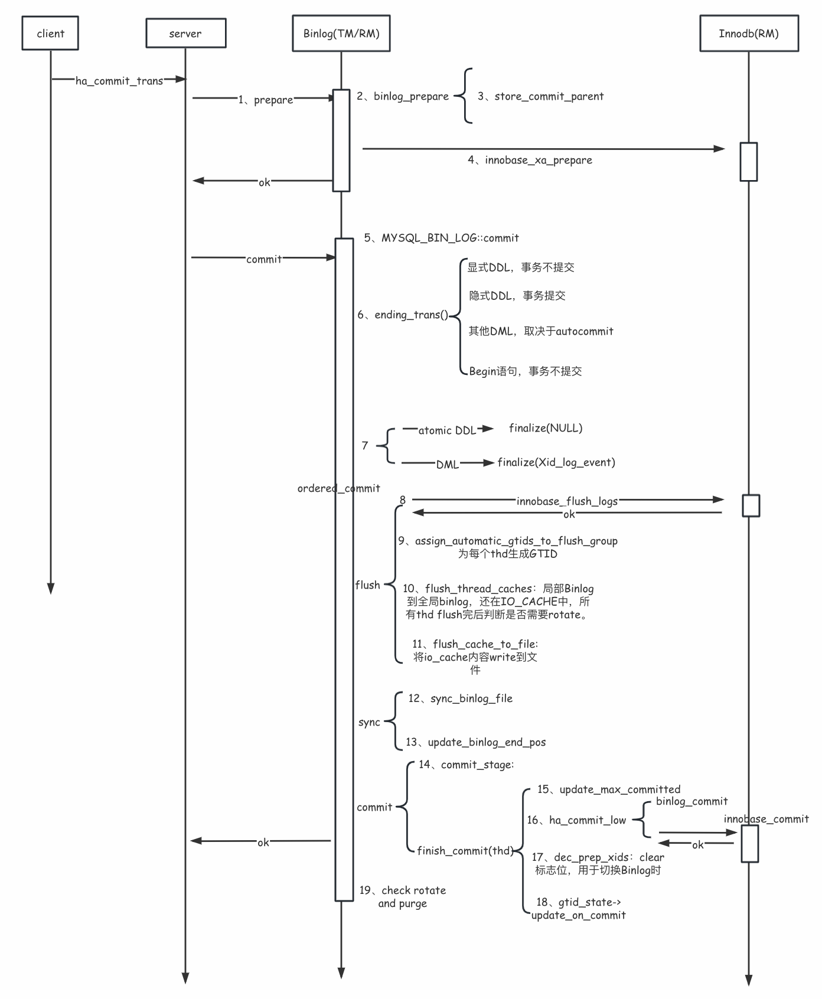
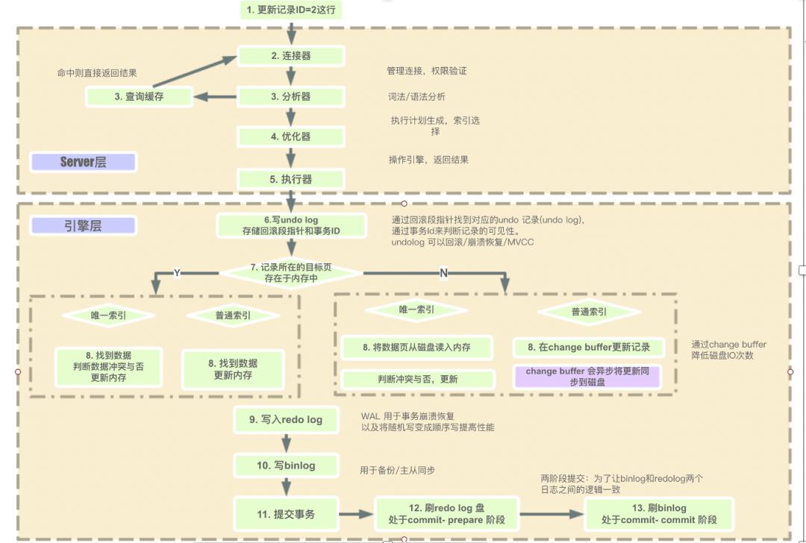

<style>
.orange {
   color: orange
}
.red {
   color: red
}
code {
   color: #0ABF5B;
}
</style>

    这是“mysql”系列的第五篇文章，主要介绍的是Insert流程部分源码。

# 一、mysql

<code>MySQL</code> 是一种广泛使用的开源关系型数据库管理系统（RDBMS--Relational Database Management System）

<!-- more -->

# 二、一条Insert语句的执行过程
一条INSERT语句的执行过程堆栈总结如下，主要是两个步骤：
- **事务执行阶段**（`execute`方法）
    - undo log生成
    - redo log生成
    - binlog 生成
- **事务提交阶段**（`trans_commit_stmt(thd)`）
    - prepare阶段
    - commit阶段
```text
mysql_execute_command
    -> Sql_cmd_insert::execute（事务执行阶段）
        -> mysql_insert
            -> write_record
                -> ha_write_row
                    -> write_row：存储引擎的具体实现
                    -> binlog_log_row(table, 0, buf, log_func)：写binlog
    -> trans_commit_stmt(thd);（事务提交阶段）
        -> ha_commit_trans  
```

上一篇文章解析了**事务执行阶段**，本文将解析**事务提交阶段**。

# 三、事务提交阶段
回到`sql/sql_parse.cc`文件的`mysql_execute_command`函数，在调用Innodb执行数据insert后，会继续执行事务提交操作，从 `trans_commit_stmt(thd);` 函数开始。
```cpp
bool trans_commit_stmt(thd);
    // 事务处于活跃状态
  if (thd->get_transaction()->is_active(Transaction_ctx::STMT))
  {
    // 提交事务
    res= ha_commit_trans(thd, FALSE);
    if (! thd->in_active_multi_stmt_transaction())
      trans_reset_one_shot_chistics(thd);
  }
}
```

## 3.1、事务提交总流程
接下来进入<code>ha_commit_trans</code>：
- **功能**：触发**两阶段提交**，协调 `Redo Log`和`Binlog`的一致性。
- **关键步骤**：
  - **准备阶段（Prepare phase）**：
    - Innodb将`redo log` 标记为 `PREPARE` 状态。
    - `Redo Log` 被强制刷盘（由 `innodb_flush_log_at_trx_commmit` 控制）
  - **提交阶段（commit phase）**
    - `MySQL Server` 将事务的逻辑操作写入 `binlog`（这里的写入，主要是从内存缓冲区写入磁盘，binlog的生成是在事务执行阶段）
    - `binlog`被强制刷盘（由 `sync_binlog` 控制）
    - Innodb 将 `redo log` 标记为 `COMMIT`，完成最终提交。
- **执行堆栈如下**：
```dtd
ha_commit_trans // XA transaction 即可理解为 2PC 两阶段提交协议。
                // 事务协调器（Transaction Coordinator）来处理各节点是回退还是前滚, tc_log即协调者日志。
  |--> tc_log->prepare()
  |  |--> MYSQL_BIN_LOG::prepare--> ha_prepare_low/(ht->prepare)--> innobase_xa_prepare // prepare binlog
           // innodb 存储引擎初始化 innodb_init() /storage/innobase/handler/ha_innodb.cc
           // innobase_hton->prepare = innobase_xa_prepare
  |  |--> innobase_xa_prepare -->trx_prepare// prepare an X/Open XA 分布式事务
  |  |  |--> trx_prepare_low
  |  |  |  |--> mtr_start_sync()
  |  |  |  |--> trx_undo_set_state_at_prepare // undolog 状态从TRX_UNDO_ACTIVE设置为TRX_UNDO_PREPARED
  |  |  |  |  |--> trx_undo_page_get // 获得 undo page
  |  |  |  |  |--> trx_undo_gtid_write // 向undo header写GTID信息
  |  |  |  |  |--> trx_undo_write_xid // 向undo header写XID信息
  |  |  |  |--> mtr_commit

  |--> tc_log->commit()
  |  |--> MYSQL_BIN_LOG::commit
  |  |  |--> binlog_cache_data::finalize() // 写events到cache
  |  |  |--> MYSQL_BIN_LOG::ordered_commit() // 大接口，binlog commit
// Step1: flushing transactions to binary log
  |  |  |  |--> MYSQL_BIN_LOG::process_flush_stage_queue() // flush cache
  |  |  |  |  |--> assign_automatic_gtids_to_flush_group // 生成GTID
  |  |  |  |  |--> flush_thread_caches // flush cache for session,Write the Gtid_log_event to the binary log
  |  |  |  |--> MYSQL_BIN_LOG::flush_cache_to_file() // Flush binary log I/O cache到binlog文件
// Step2: Syncing binary log file to disk
  |  |  |  |--> MYSQL_BIN_LOG::sync_binlog_file--> IO_CACHE_ostream::sync()--> inline_mysql_file_sync()
		--> my_sync -->fdatasync // call fsync() to sync the file to disk
// Step3: Commit all transactions in order
  |  |  |  |--> MYSQL_BIN_LOG::process_commit_stage_queue() // flush cache
  |  |  |  |  |--> ha_commit_low // storage engine commit // innobase_hton->commit = innobase_commit;
  |  |  |  |  |--> innobase_commit -->innobase_commit_low-->trx_commit_for_mysql //此时rtx的状态为TRX_STATE_PREPARED
  |  |  |  |  |  |--> trx_commit
  |  |  |  |  |  |  |--> mtr_start_sync //mtr_start
  |  |  |  |  |  |  |--> trx_commit_low // Commits a transaction and a mini-transaction.
  |  |  |  |  |  |  |  |--> trx_write_serialisation_history // 为事务分配其历史序列号，并更新的undo日志记录写入分配的回滚段
  |  |  |  |  |  |  |  |--> mtr_commit 
  |  |  |  |  |  |  |  |--> trx_commit_in_memory // Commits a transaction in memory
```
- `binlog`既是二阶段的参与者，又是协调者，所以在源码实现中可以看到 `prepare`阶段 和 `commit`阶段函数入口都在`MYSQL_BIN_LOG`中。
- 准备阶段：`tc_log->prepare()`
- 提交阶段：`tc_log->commit()`

<code>ha_commit_trans</code>源码如下：
```cpp
/*   
    提交事务。
    server层最后调用函数 ha_commit_trans(), 该函数负责处理 binlog 层和存储引擎层的提交。
*/
int ha_commit_trans(THD *thd, bool all, bool ignore_global_read_lock)
{
    // 读写事务 && 不能忽略全局读锁
    if (rw_trans && !ignore_global_read_lock)
    {
      /*
        获取一个 MDL_KEY::COMMIT 元数据锁, 该元数据锁将确保 commit 操作会被活跃的 FTWRL 锁阻止。
        FTWRL锁会阻塞 COMMIT 操作。
      */
      MDL_REQUEST_INIT(&mdl_request,
                       MDL_key::COMMIT, "", "", MDL_INTENTION_EXCLUSIVE,
                       MDL_EXPLICIT);
      DBUG_PRINT("debug", ("Acquire MDL commit lock"));
      // 申请 MDL_key::COMMIT 锁, 申请失败
      if (thd->mdl_context.acquire_lock(&mdl_request,
                                        thd->variables.lock_wait_timeout))
      {
        ha_rollback_trans(thd, all);
        DBUG_RETURN(1);
      }
      release_mdl = true;
    }
    // 判断是否开启 xa 事务;
    // 所有的 entries 都支持 2pc && 在事务 scope 中设置做读写更改的引擎数量 > 1
    if (!trn_ctx->no_2pc(trx_scope) && (trn_ctx->rw_ha_count(trx_scope) > 1))
      // prepare; 在事务协调器中 prepare commit tx, 在引擎层生成一个 XA 事务。
      // tc_log: mysqld启动时生成的 MySQL_BIN_LOG 对象[XA控制对象]。
      error = tc_log->prepare(thd, all);
  }
  /*
    XA 事务的状态变更为 prepared, 中间态。最终会变成常规的 NOTR 状态。
  */
  if (!error && all && xid_state->has_state(XID_STATE::XA_IDLE))
  {
    assert(thd->lex->sql_command == SQLCOM_XA_COMMIT &&
           static_cast<Sql_cmd_xa_commit *>(thd->lex->m_sql_cmd)->get_xa_opt() == XA_ONE_PHASE);
    // 设置 XA 事务状态为 XA_PREPARED 状态。
    xid_state->set_state(XID_STATE::XA_PREPARED);
  }
  /**
   * XA 事务提交
  */
  if (error || (error = tc_log->commit(thd, all)))
  {
    ha_rollback_trans(thd, all);
    error = 1;
    goto end;
  }
end:
  // 释放 mdl 锁。
  if (release_mdl && mdl_request.ticket)
  {
    thd->mdl_context.release_lock(mdl_request.ticket);
  }  /*
   * 释放资源并执行其他清理。空事务也需要。
  */
  if (is_real_trans)
  {
    trn_ctx->cleanup();
    thd->tx_priority = 0;
  }
}
```


## 3.2、Prepare 阶段
`prepare`入口 `tc_log->prepare(thd, all);`：
> <font color=red>**prepare阶段分为binlog的prepare和innodb的prepare**</font>。进入binlog和innodb prepae前会设置durability_property = HA_IGNORE_DURABILITY, 表示在innodb prepare和finish_commit()时，不刷redo log到磁盘。


### 第一步：Binlog Prepare
`MYSQL_BIN_LOG::prepare`的作用是处理事务的`prepare`阶段，特别是与`Binlog`相关的部分。在MySQL5.7及以后版本中，Binlog作为XA事务的协调者（`coordinator`），而存储引擎作为参与者（`participant`）
- 主要是完成以下操作
  - 设置延迟持久化标志（核心优化）
  - 调用存储引擎真正的`prepare`

源码解析如下：
```cpp
// sql/binlog.cc
int MYSQL_BIN_LOG::prepare(THD *thd, bool all)
{
  DBUG_ENTER("MYSQL_BIN_LOG::prepare");
  // 断言确保binlog已启用
  assert(opt_bin_log);
  /*
    复制线程（slave线程）显式覆盖sql_log_bin的值，使用log_slave_updates的值
  */
  assert(thd->slave_thread ?
         opt_log_slave_updates : thd->variables.sql_log_bin);
  /*
    设置HA_IGNORE_DURABILITY，避免在prepare阶段将事务的prepared记录
    刷新到存储引擎日志（例如InnoDB redo log）。这样我们可以在binlog组提交的
    flush阶段，将一组事务的prepared记录批量刷新到存储引擎日志。
    在解析下一条命令开始时重置为HA_REGULAR_DURABILITY。
  */
  thd->durability_property= HA_IGNORE_DURABILITY;

  // 调用底层的存储引擎prepare操作
  int error= ha_prepare_low(thd, all);

  DBUG_RETURN(error);
}
```
- 用户线程对象的 `durability_property` 属性值会被设置为 `HA_IGNORE_DURABILITY`。
  - 这个属性和 `redo` 日志刷盘有关，`InnoDB prepare` 会用到。

继续执行 <code>ha_prepare_low</code>函数，调用底层的存储引擎prepare操作：
```cpp
/**
 * prepare commit trx
 * 在引擎层 prepare commit trx
 * 包括 binlog引擎 和 innodb引擎
*/
int ha_prepare_low(THD *thd, bool all)
{
  // 遍历引擎
  if (ha_info)
  {
    for (; ha_info && !error; ha_info = ha_info->next())
    {
      int err = 0;
      // 引擎
      handlerton *ht = ha_info->ht();
      /*
        如果这个特定事务是只读的, 不要调用两阶段提交。
      */
      if (!ha_info->is_trx_read_write())
        continue;
      /**
       * 调用引擎的 prepare 在存储层生成 XA 事务。
       * 先 binlog prepare, 再 innodb prepare;
       * binlog prepare: 将上一次 commit 队列中最大的 seq num 写入本次事务的 last_commit 中
       * innodb prepare: 在 innodb 中更改 undo 日志段的状态为 trx_undo_prepared, 并将 xid 写入 undo log header。
       * */
      if ((err = ht->prepare(ht, thd, all)))
      {
        my_error(ER_ERROR_DURING_COMMIT, MYF(0), err);
        error = 1;
      }
      // ha_prepare_count++
      thd->status_var.ha_prepare_count++;
    }
  }
}
```
内部执行流程会执行<code>ht->prepare(ht, thd, all)</code>
- <font color=red>**prepare阶段分为binlog的prepare和innodb的prepare.**</font>


`binlog` 被看作一种存储引擎，它也有 `prepare` 阶段，代码如下：
```cpp
// sql/binlog.cc
static int binlog_prepare(handlerton *, THD *thd, bool all) {
  DBUG_TRACE;
  if (!all) {
    thd->get_transaction()->store_commit_parent(
        mysql_bin_log.m_dependency_tracker.get_max_committed_timestamp());
  }
  return 0;
}
```
二阶段提交时
- `all = true`，不会命中分支 `if (!all)`。也就是说，在 `prepare` 阶段，`binlog` 什么也不会干。
- 对于all为false的事务，会更新该事务的`last_commited`为此时`most recently commited`事务的`sequence_number`，`sequence_number`是`Binlog`提交的逻辑时间戳，可用于在`slave`节点上并行执行Binlog事务，生成和自增策略参考Binlog事务依赖策略。


### 第二步：InnoDB Prepare
Innodb `prepare` 一个 `X/Open XA` 分布式事务，源码如下：
```cpp
/*******************************************************************/ /**
static int innobase_xa_prepare(
        /*================*/
        handlerton *hton, /*!< in: InnoDB handlerton ; innodb引擎 */
        THD *thd,                   /*!< in: handle to the MySQL thread of
                    the user whose XA transaction should
                    be prepared ; mysql线程 */
        bool prepare_trx) /*!< in: true - prepare transaction
                    false - the current SQL statement
                    ended ; true: prepare 事务
                            false: 当前 SQL 语句结束, 语句级别的提交 */
{
    // trx
    trx_t *trx = check_trx_exists(thd);
    // 获取thd的 xid, 同时设置到 trx -> xid 中
    thd_get_xid(thd, (MYSQL_XID *)trx->xid);
 
    /* 释放可能的 FIFO ticket 和 search latch。
    因为我们要保留 trx_sys -> mutex, 我们必须首先释放 search system latch 来遵守锁存顺序。
    */
    trx_search_latch_release_if_reserved(trx);
    // prepare trx
    if (prepare_trx || (!thd_test_options(thd, OPTION_NOT_AUTOCOMMIT | OPTION_BEGIN)))
    {
        /* preapre 整个事务, 或者这是一个SQL语句结束, autocommit 是打开状态 */
        // 事务已经在 mysql 2pc 协调器中注册。
        ut_ad(trx_is_registered_for_2pc(trx));
        // trx prepare
        dberr_t err = trx_prepare_for_mysql(trx);
    }
    else
    {
        /* 语句的提交动作, 而非真正的事务提交。 */
        // 需要释放语句 hold 的 auto_increment 锁
        lock_unlock_table_autoinc(trx);
 
        // 记录本语句的 undo 信息, 以便语句级的回滚
        // 标记最新SQL语句结束。
        trx_mark_sql_stat_end(trx);
    }
    return (0);
}
```
继续执行<code>trx_prepare_for_mysql：</code>
```cpp
/**
 * trx prepare
*/
dberr_t
trx_prepare_for_mysql(trx_t *trx)
{
    trx->op_info = "preparing";
    // prepare trx.
    trx_prepare(trx);
}
```
继续执行<code>trx_prepare:</code>
- 转换事务状态为，事务状态由 `active` 变为 `prepare`

```cpp
/****************************************************************/ /**
prepare trx.*/
static void trx_prepare(
        /*========*/
        trx_t *trx) /*!< in/out: transaction */
{
    // 回滚段 != NULL && redo 段被修改
    if (trx->rsegs.m_redo.rseg != NULL && trx_is_redo_rseg_updated(trx))
    {
        // 为指定的回滚段 preapre 一个事务。lsn 为当前已 commit 的 lsn
        lsn = trx_prepare_low(trx, &trx->rsegs.m_redo, false);
    }
 
    if (trx->rsegs.m_noredo.rseg != NULL && trx_is_noredo_rseg_updated(trx))
    {
        // 为指定的回滚段 preapre 一个事务。
        trx_prepare_low(trx, &trx->rsegs.m_noredo, true);
    }
 
    /*--------------------------------------*/
    // 事务状态为 TRX_STATE_ACTIVE 状态, 修改事务状态
    trx->state = TRX_STATE_PREPARED;
    // 事务系统中处于 xa prepared 状态的事务的数量
    trx_sys->n_prepared_trx++;
    /*--------------------------------------*/
    /* Release read locks after PREPARE for READ COMMITTED
    and lower isolation.
    对 rc 隔离级别, 在 prepare 之后释放 read locks, 降低隔离度
    */
    if (trx->isolation_level <= TRX_ISO_READ_COMMITTED)
    {
        /* Stop inheriting GAP locks.
        停止继承 GAP lock。
        */
        trx->skip_lock_inheritance = true;
 
        /* Release only GAP locks for now.
        释放 GAP lock。
        */
        lock_trx_release_read_locks(trx, true);
    }
    switch (thd_requested_durability(trx->mysql_thd))
    {
    case HA_IGNORE_DURABILITY:
        /*
        在 binlog group commit 的 prepare 阶段, 我们设置 HA_IGNORE_DURABILITY , 这样在这个阶段不会 flush redo log。
        这样我们就可以在 binlog group commit 的 flush 阶段在将 binary log写入二进制日志之前, 在一个组中 flush redo log。
        */
        break;
    case ..
    }
}
```
继续执行 <code>trx_prepare_low</code>，为指定的回滚段 `preapre` 一个事务。

`trx_prepare_low`函数主要负责将 `Undo Log` 标记为 `PREPARE` 状态。
```cpp
/****************************************************************/ /**
为指定的回滚段 preapre 一个事务。 */
static lsn_t
trx_prepare_low(
        /*============*/
        trx_t *trx,                             /*!< in/out: transaction */
        trx_undo_ptr_t *undo_ptr, /*!< in/out: pointer to rollback
                    segment scheduled for prepare. 指向回滚段的指针 */
        bool noredo_logging)            /*!< in: turn-off redo logging. 不需要redo log */
{
    lsn_t lsn;
    // insert 或者 undo 回滚段不为 NULL
    if (undo_ptr->insert_undo != NULL || undo_ptr->update_undo != NULL)
    {
        // start a sync mtr
        mtr_start_sync(&mtr);
        // 设置 mtr mode
        if (noredo_logging)
        {
            mtr_set_log_mode(&mtr, MTR_LOG_NO_REDO);
        }
 
        /*
        将  undo 日志段状态从 trx_undo_active 修改为 trx_undo_prepared:
        更改 undo 回滚段将其设置为 prepare 状态。
        */
        mutex_enter(&rseg->mutex);
        // insert undo log 不为 NULL
        if (undo_ptr->insert_undo != NULL)
        {
            /*
            这里不需要获取 trx->undo_mutex, 因为只允许一个 OS 线程为该事务做事务准备。
            */
            // 将 undo 日志段状态从 trx_undo_active 修改为 trx_undo_prepared 状态
            trx_undo_set_state_at_prepare(
                    trx, undo_ptr->insert_undo, false, &mtr);
        }
        // 将 undo 日志段状态从 trx_undo_active 修改为 trx_undo_prepared 状态
        if (undo_ptr->update_undo != NULL)
        {
            trx_undo_set_state_at_prepare(
                    trx, undo_ptr->update_undo, false, &mtr);
        }
 
        mutex_exit(&rseg->mutex);
        lsn = mtr.commit_lsn();
    }
    else
    {
        lsn = 0;
    }
    return (lsn);
}
```
继续执行<code>trx_undo_set_state_at_prepare</code>，修改 `undo` 日志段的状态：
```cpp
/* 修改 undo 日志段的状态*/
page_t *
trx_undo_set_state_at_prepare(
        trx_t *trx,
        trx_undo_t *undo,
        bool rollback,
        mtr_t *mtr)
{
    // 获取 undo page 页, 并在其上加 x-latch
    undo_page = trx_undo_page_get(
            page_id_t(undo->space, undo->hdr_page_no),
            undo->page_size, mtr);
    // undo 段 header
    seg_hdr = undo_page + TRX_UNDO_SEG_HDR;
    // 如果是 XA rollback
    if (rollback)
    {
        ut_ad(undo->state == TRX_UNDO_PREPARED);
        // 将 undo 段的状态从 TRX_UNDO_PREPARED 修改为 TRX_UNDO_ACTIVE 状态
        mlog_write_ulint(seg_hdr + TRX_UNDO_STATE, TRX_UNDO_ACTIVE,
                                         MLOG_2BYTES, mtr);
        return (undo_page);
    }
    /*------------------------------*/
    // 是 XA prepare, 则将 undo 段的状态从 TRX_UNDO_ACTIVE 修改为 TRX_UNDO_PREPARED, 并将 xid 写入 undo。
    ut_ad(undo->state == TRX_UNDO_ACTIVE);
    undo->state = TRX_UNDO_PREPARED;
    undo->xid = *trx->xid;
    /*------------------------------*/
    // 在 undo 段中更新当前 undo 段的状态
    mlog_write_ulint(seg_hdr + TRX_UNDO_STATE, undo->state,
                                     MLOG_2BYTES, mtr);
    // 在 undo 段 last undo log header 中写入 xid
    offset = mach_read_from_2(seg_hdr + TRX_UNDO_LAST_LOG);
    undo_header = undo_page + offset;
    mlog_write_ulint(undo_header + TRX_UNDO_XID_EXISTS,
                                     TRUE, MLOG_1BYTE, mtr);
    trx_undo_write_xid(undo_header, &undo->xid, mtr);
    return (undo_page);
}
```
`innodb prepare`阶段堆栈信息如下；
```dtd
innobase_xa_prepare()                             # innodb prepapre
| ...
|- trx_prepare_for_mysql()
|  |- trx_prepare()
|  |  |- trx_prepare_low()
|  |  |  |- mtr_t::start（）                      # 开启一个mini-transaction
|  |  |  |- mtr_t::commit()                      # 通过mtr,写redo到redo log buffer
|  |  |  |  |- Command::execute()
|  |  |  |  |  |- prepare_write()                # 准备写mtr log到redo-log buffer
|  |  |  |  |  |- finish_write()
|  |  |- trx->state = TRX_STATE_PREPARED
```
并没有写`redo log`到文件中，除非`redo log buffer`空间不足。以下可看出：
```dtd
finish_write()
| ...
|- log_reserve_and_open()
|  |- # not enough space,do a write of buffer
|  |- log_buffer_sync_in_background(false)       # not enough space,do a write of buffer
|  |  |- log_write_up_to(lsn, false)             # write to redo log file,没有执行fsync
|  |  |  |- log_group_write_buf()                # Writes a buffer to a log file group
|...
|- mtr_write_log_t::operator()                   # append blocks to redo log buffer
|  |- log_write_low()                            # 写 redo log block 到 redo log buffer

```
从上面过程可以看出，`prepare`阶段并没有写`redo log`到文件中，只有一种情况会写入到文件中，那就是`redo log buffer`空间不足时，并且这里只是写入文件系统缓存，并不执行`flush`操作。

> 二阶段提交的 prepare 阶段，InnoDB 主要做五件事。
>
> **第 1 件**，把分配给事务的所有 `undo` 段的状态从 `TRX_UNDO_ACTIVE` 修改为 `TRX_UNDO_PREPARED`。
进入二阶段提交的事务，都至少改变过（插入、更新、删除）一个用户表的一条记录，最少会分配 1 个 `undo` 段，最多会分配 4 个 `undo` 段。
具体什么情况分配多少个 undo 段，后续关于 undo 模块的文章会有详细介绍。
不管 InnoDB 给事务分配了几个 undo 段，它们的状态都会被修改为 TRX_UNDO_PREPARED。
> **第 2 件**，把事务 `Xid` 写入所有 `undo` 段中当前提交事务的 `undo` 日志组头信息。
InnoDB 给当前提交事务分配的每个 undo 段中，都会有一组 undo 日志属于这个事务，事务 Xid 就写入 undo 日志组的头信息。
对于第 1、2 件事，如果事务改变了用户普通表的数据，修改 undo 段状态、把事务 Xid 写入 undo 日志组头信息，都会产生 redo 日志。
> **第 3 件**，把内存中的事务对象状态从 TRX_STATE_ACTIVE 修改为 TRX_STATE_PREPARED。
前面修改 undo 状态，是为了事务提交完成之前，MySQL 崩溃了，下次启动时，能够从 undo 段中恢复崩溃之前的事务状态。
这里修改事务对象状态，用于 MySQL 正常运行过程中，标识事务已经进入二阶段提交的 prepare 阶段。
> **第 4 件**，如果当前提交事务的隔离级别是读未提交（READ-UNCOMMITTED）或读已提交（READ-COMMITTED)，InnoDB 会释放事务给记录加的共享、排他 GAP 锁。
虽然读未提交、读已提交隔离级别一般都只加普通记录锁，不加 GAP 锁，但是，外键约束检查、插入记录重复值检查这两个场景下，还是会给相应的记录加 GAP 锁。


## 3.3、Commit 阶段
执行入口在`ha_commit_trans()`函数的`tc_log->commit()`代码块。
```cpp
// sql/handler.cc
bool trans_commit_stmt(THD *thd)
{
 tc_log->prepare(thd, all);
 tc_log->commit(thd, all)
}
```
进入`commit()`函数，其是MySQL事务提交的核心函数，负责协调Binlog与存储引擎的最终提交。
```cpp
// sql/binlog.cc
TC_LOG::enum_result MYSQL_BIN_LOG::commit(THD *thd, bool all)
{
    /* The prepare phase of XA transaction two phase logging. */
    int err = 0;
    bool one_phase = get_xa_opt(thd) == XA_ONE_PHASE;
    
    assert(thd->lex->sql_command != SQLCOM_XA_COMMIT || one_phase);
    // xid event 生成并写入 binlog cache, 在真正的写操作语句生成的event之后
    XID_STATE *xs = thd->get_transaction()->xid_state();
    XA_prepare_log_event end_evt(thd, xs->get_xid(), one_phase);
    err = cache_mngr->trx_cache.finalize(thd, &end_evt, xs);
   
     ........
    // 组提交。
    // ordered_commit: 事务在 binlog 阶段提交的核心函数。
    if (ordered_commit(thd, all, skip_commit))
      DBUG_RETURN(RESULT_INCONSISTENT);
 
    /*
      Mark the flag m_is_binlogged to true only after we are done
      with checking all the error cases.
      检查完所有错误情况后, 将标记 m_is_binlogged 标记为 true.
    */
    if (is_loggable_xa_prepare(thd))
      thd->get_transaction()->xid_state()->set_binlogged();
}
```
`Commit` 阶段的功能实现主要集中在 `MYSQL_BIN_LOG::ordered_commit` 函数中。
```cpp
int MYSQL_BIN_LOG::ordered_commit(THD *thd, bool all, bool skip_commit)
{
    /*
    Stage #1: flushing transactions to binary log
    阶段1: 将事务 flush 到二进制日志
    While flushing, we allow new threads to enter and will process
    them in due time. Once the queue was empty, we cannot reap
    anything more since it is possible that a thread entered and
    appointed itself leader for the flush phase.
    在 flush 时, 允许新的线程进入, 并在适当的时间处理他们。
    一旦队列变空, 我们就不能再收获任何东西了, 因为可能有一个线程进入了队列并
    指定自己为flush阶段的 leader。
    */
 
    #ifdef HAVE_REPLICATION
    /**
    * 先形成 flush 队列, 非 leader 线程将被阻塞, 直到 commit 阶段被 leader 线程唤醒。
    * 然后leader线程获取 Lock log锁
    */
    if (has_commit_order_manager(thd))
    {
        Slave_worker *worker = dynamic_cast<Slave_worker *>(thd->rli_slave);
        Commit_order_manager *mngr = worker->get_commit_order_manager();
    
    if (mngr->wait_for_its_turn(worker, all))
    {
      thd->commit_error = THD::CE_COMMIT_ERROR;
      DBUG_RETURN(thd->commit_error);
    }
    // 获取 Lock_log 锁, 非 leader 线程将被阻塞, 直到commit之后被 leader 线程唤醒, 非 leader 线程这里返回 true, 线程应该等待提交完成。
    if (change_stage(thd, Stage_manager::FLUSH_STAGE, thd, NULL, &LOCK_log))
      DBUG_RETURN(finish_commit(thd));
    }
  else
#endif
      // 获取 Lock_log 锁, 非 leader 线程将被阻塞, 直到被 leader 线程唤醒, 非 leader 线程这里返回 true, 线程应该等待提交完成。
      if (change_stage(thd, Stage_manager::FLUSH_STAGE, thd, NULL, &LOCK_log))
  {
    DBUG_RETURN(finish_commit(thd));
  }
 
  THD *wait_queue = NULL, *final_queue = NULL;
  mysql_mutex_t *leave_mutex_before_commit_stage = NULL;
  my_off_t flush_end_pos = 0;
  bool update_binlog_end_pos_after_sync;
  DEBUG_SYNC(thd, "waiting_in_the_middle_of_flush_stage");
  // 执行 flush 阶段操作。
  /*
  * 1. 对 flush 队列进行 fetch, 本次处理的flush队列就固定了
    2. 在 innodb 存储引擎中 flush redo log, 做 innodb 层 redo 持久化。
    3. 为 flush 队列中每个事务生成 gtid。
    4. 将 flush队列中每个线程的 binlog cache flush 到 binlog 日志文件中。这里包含两步:
            1. 将事务的 GTID event直接写入 binlog 磁盘文件中
            2. 将事务生成的别的 event 写入 binlog file cache 中
  */
  flush_error = process_flush_stage_queue(&total_bytes, &do_rotate,
                                          &wait_queue);
  // 将 binary log cache(IO cache) flush到文件中
  if (flush_error == 0 && total_bytes > 0)
    flush_error = flush_cache_to_file(&flush_end_pos);
  // sync_binlog 是否等于 1
  update_binlog_end_pos_after_sync = (get_sync_period() == 1);
 
  /*
    如果 flush 操作成功, 则调用 after_flush hook。
  */
  if (flush_error == 0)
  {
    const char *file_name_ptr = log_file_name + dirname_length(log_file_name);
    assert(flush_end_pos != 0);
    if (RUN_HOOK(binlog_storage, after_flush,
                 (thd, file_name_ptr, flush_end_pos)))
    {
      sql_print_error("Failed to run 'after_flush' hooks");
      flush_error = ER_ERROR_ON_WRITE;
    }
    // 不等于 1, 通知 dump 线程
    if (!update_binlog_end_pos_after_sync)
      // 更新 binlog end pos, 通知 dump 线程向从库发送 event
      update_binlog_end_pos();
    DBUG_EXECUTE_IF("crash_commit_after_log", DBUG_SUICIDE(););
  }
 
  if (flush_error)
  {
    /*
      Handle flush error (if any) after leader finishes it's flush stage.
      如果存在 flush 错误, 则处理 flush错误
    */
    handle_binlog_flush_or_sync_error(thd, false /* need_lock_log */,
                                      (thd->commit_error == THD::CE_FLUSH_GNO_EXHAUSTED_ERROR)
                                          ? ER(ER_GNO_EXHAUSTED)
                                          : NULL);
  }
  /*
    Stage #2: Syncing binary log file to disk
    sync binary log file to disk.
  */
  /** 释放 Lock_log mutex, 获取 Lock_sync mutex
   *  第一个进入的 flush 队列的 leader 为本阶段的 leader, 其他 flush 队列加入 sync 队列, 其他 flush 队列的
   * leader会被阻塞, 直到 commit 阶段被 leader 线程唤醒。
   * */
  if (change_stage(thd, Stage_manager::SYNC_STAGE, wait_queue, &LOCK_log, &LOCK_sync))
  {
    DBUG_RETURN(finish_commit(thd));
  }
 
  /*
    根据 delay 的设置来决定是否延迟一段时间, 如果 delay 的时间越久, 那么加入 sync 队列的
    事务就越多【last commit 是在 binlog prepare 时生成的, 尚未更改, 因此加入 sync 队列的
    事务是同一组事务】, 提高了从库 mts 的效率。
  */
  if (!flush_error && (sync_counter + 1 >= get_sync_period()))
    stage_manager.wait_count_or_timeout(opt_binlog_group_commit_sync_no_delay_count,
                                        opt_binlog_group_commit_sync_delay,
                                        Stage_manager::SYNC_STAGE);
  // fetch sync 队列, 对 sync 队列进行固化。
  final_queue = stage_manager.fetch_queue_for(Stage_manager::SYNC_STAGE);
  // 这里 sync_binlog file到磁盘中
  if (flush_error == 0 && total_bytes > 0)
  {
    // 根据 sync_binlog 的设置决定是否刷盘
    std::pair<bool, bool> result = sync_binlog_file(false);
    sync_error = result.first;
  }
  // 在这里 sync_binlog = 1, 更新 binlog end_pos, 通知 dump 线程发送 event
  if (update_binlog_end_pos_after_sync)
  {
    THD *tmp_thd = final_queue;
    const char *binlog_file = NULL;
    my_off_t pos = 0;
    while (tmp_thd->next_to_commit != NULL)
      tmp_thd = tmp_thd->next_to_commit;
    if (flush_error == 0 && sync_error == 0)
    {
      tmp_thd->get_trans_fixed_pos(&binlog_file, &pos);
      // 更新 binlog end pos, 通知 dump 线程
      update_binlog_end_pos(binlog_file, pos);
    }
  }
 
  leave_mutex_before_commit_stage = &LOCK_sync;
  /*
    Stage #3: Commit all transactions in order.
    按顺序在 Innodb 层提交所有事务。 
    如果我们不需要对提交顺序进行排序, 并且每个线程必须执行 handlerton 提交, 那么这个阶段可以跳过。
    然而, 由于我们保留了前一阶段的锁, 如果我们跳过这个阶段, 则必须进行解锁。
  */
commit_stage:
  // 如果需要顺序提交
  if (opt_binlog_order_commits &&
      (sync_error == 0 || binlog_error_action != ABORT_SERVER))
  {
    // SYNC队列加入 COMMIT 队列, 第一个进入的 SYNC 队列的 leader 为本阶段的 leader。其他 sync 队列
    // 加入 commit 队列的 leade 会被阻塞, 直到 COMMIT 阶段后被 leader 线程唤醒。
    // 释放 lock_sync mutex, 持有 lock_commit mutex.
    if (change_stage(thd, Stage_manager::COMMIT_STAGE,
                     final_queue, leave_mutex_before_commit_stage,
                     &LOCK_commit))
    {
      DBUG_RETURN(finish_commit(thd));
    }
    // 固化 commit 队列
    THD *commit_queue = stage_manager.fetch_queue_for(Stage_manager::COMMIT_STAGE);
    // 调用 after_sync hook
    if (flush_error == 0 && sync_error == 0)
      // 调用 after_sync hook.注意：对于after_sync, 这里将等待binlog dump 线程收到slave节点关于队列中事务最新的 binlog_file和 binlog_pos的ACK。
      sync_error = call_after_sync_hook(commit_queue);
 
    /*
      process_commit_stage_queue 将为队列中每个 thd 持有的 GTID
      调用 update_on_commit 或 update_on_rollback。
 
      这样做的目的是确保 gtid 按照顺序添加到 GTIDs中, 避免出现不必要的间隙
 
      如果我们只允许每个线程在完成提交时调用 update_on_commit, 则无法保证 GTID
      顺序, 并且 gtid_executed 之间可能出现空隙。发生这种情况, server必须从
      Gtid_set 中添加和删除间隔, 添加或删除间隔需要一个互斥锁, 这会降低性能。
    */
    process_commit_stage_queue(thd, commit_queue);
    // 退出 Lock_commit 锁
    mysql_mutex_unlock(&LOCK_commit);
    /*
      Process after_commit after LOCK_commit is released for avoiding
      3-way deadlock among user thread, rotate thread and dump thread.
      在 LOCK_commit 释放之后处理 after_commit 来避免 user thread, rotate thread 和 dump thread的
      3路死锁。
    */
    process_after_commit_stage_queue(thd, commit_queue);
    final_queue = commit_queue;
  }
  else
  {
    // 释放锁, 调用 after_sync hook.
    if (leave_mutex_before_commit_stage)
      mysql_mutex_unlock(leave_mutex_before_commit_stage);
    if (flush_error == 0 && sync_error == 0)
      sync_error = call_after_sync_hook(final_queue);
  }
 
  /*
    Handle sync error after we release all locks in order to avoid deadlocks
    为了避免死锁, 在释放所有的 locks 之后处理sync error
  */
  if (sync_error)
    handle_binlog_flush_or_sync_error(thd, true /* need_lock_log */, NULL);
 
  /* Commit done so signal all waiting threads
      commit完成之后通知所有处于 wait 状态的线程
  */
  stage_manager.signal_done(final_queue);
 
  /*
    Finish the commit before executing a rotate, or run the risk of a
    deadlock. We don't need the return value here since it is in
    thd->commit_error, which is returned below.
    在执行 rotate 之前完成commit, 否则可能出现死锁。
  */
  (void)finish_commit(thd);
 
  /*
    If we need to rotate, we do it without commit error.
    Otherwise the thd->commit_error will be possibly reset.
    rotate
   */
  if (DBUG_EVALUATE_IF("force_rotate", 1, 0) ||
      (do_rotate && thd->commit_error == THD::CE_NONE &&
       !is_rotating_caused_by_incident))
  {
    /*
　　　　如果需要进行 binlog rotate, 则进行 rotate 操作。
    */
 
    DEBUG_SYNC(thd, "ready_to_do_rotation");
    bool check_purge = false;
    mysql_mutex_lock(&LOCK_log);
    /*
      If rotate fails then depends on binlog_error_action variable
      appropriate action will be taken inside rotate call.
    */
    int error = rotate(false, &check_purge);
    mysql_mutex_unlock(&LOCK_log);
 
    if (error)
      thd->commit_error = THD::CE_COMMIT_ERROR;
    else if (check_purge)
      // rotate判断是否需要 expire binlog.
      purge();
  }
  /*
    flush or sync errors are handled above (using binlog_error_action).
    Hence treat only COMMIT_ERRORs as errors.
  */
  DBUG_RETURN(thd->commit_error == THD::CE_COMMIT_ERROR);
}
```
`MYSQL_BIN_LOG::ordered_commit` 函数中，可以将整个逻辑分成3个阶段：
- `Flush` 子阶段
- `Sync` 子阶段
- `commit` 子阶段

### 3.3.1、Flush子阶段
`Flush stage` 的主要处理逻辑集中在 `process_flush_stage_queue`：
```cpp
int MYSQL_BIN_LOG::process_flush_stage_queue(my_off_t *total_bytes_var,
                                             bool *rotate_var,
                                             THD **out_queue_var) {
  int no_flushes = 0;
  my_off_t total_bytes = 0;
  mysql_mutex_assert_owner(&LOCK_log);
  // 根据 innodb_flush_log_at_trx_commit 参数进行 redo log 的刷盘操作
  THD *first_seen = fetch_and_process_flush_stage_queue();
 
  // 调用 get_server_sidno() 和 Gtid_state::get_automatic_gno 生成 GTID
  assign_automatic_gtids_to_flush_group(first_seen);
  /* Flush thread caches to binary log. */
  for (THD *head = first_seen; head; head = head->next_to_commit) {
    Thd_backup_and_restore switch_thd(current_thd, head);
    /*
      flush binlog_cache_mngr 的 stmt_cache和trx_cache。
      flush trx_cache：
        - 生成 last_committed 和 sequence_number
        - flush GTID log event
        - 将 trx_cache 中的数据 flush 到 binlog cache 中
        - 准备提交事务后的 Binlog pos
        - 递增 prepread XID
    */
    std::pair<int, my_off_t> result = flush_thread_caches(head);
    total_bytes += result.second;
    if (flush_error == 1) flush_error = result.first;
#ifndef NDEBUG
    no_flushes++;
#endif
  }
 
  *out_queue_var = first_seen;
  *total_bytes_var = total_bytes;
  if (total_bytes > 0 &&
      (m_binlog_file->get_real_file_size() >= (my_off_t)max_size ||
       DBUG_EVALUATE_IF("simulate_max_binlog_size", true, false)))
    *rotate_var = true;
#ifndef NDEBUG
  DBUG_PRINT("info", ("no_flushes:= %d", no_flushes));
  no_flushes = 0;
#endif
  return flush_error;
}
```
1. 根据 <code>innodb_flush_log_at_trx_commit</code> 参数进行 `redo log` 的刷盘操作
    - 获取并清空 `BINLOG_FLUSH_STAGE` 和 `COMMIT_ORDER_FLUSH_STAGE` 队列
    - 存储引擎层将 `prepare` 状态的 `redo log` 根据 <code>innodb_flush_log_at_trx_commit</code> 参数刷盘
    - 不再阻塞 `slave` 的 `preserve commit order` 的执行
2. 调用 `get_server_sidno()` 和 `Gtid_state::get_automatic_gno()` 生成 `GTID`
3. `Flush binlog_cache_mngr`
    - `Flush stmt_cache`
    - `Flush trx_cache`
        - 生成 `last_committed` 和 `sequence_number`
        - `flush GTID log event`
        - 将 `trx_cache` 中的数据 `flush` 到 `binlog cache` 中
        - 准备提交事务后的 `Binlog pos`
        - 递增 `prepread XID`
4. 插桩调用`after_flush`，将已经 `flush` 的 `binlog file` 和 `position` 注册到半同步复制插件中
5. 如果 `sync_binlog!=1`，在 `flush stage` 更新 `Binlog` 位点，并广播 `update` 信号，从库的 `Dump` 线程可以由此感知 `Binlog` 的更新

`redo log` 刷盘的堆栈如下：
```
// 获取并清空 BINLOG_FLUSH_STAGE 和 COMMIT_ORDER_FLUSH_STAGE 队列，flush 事务到磁盘；不再阻塞 slave 的 preserve commit order 的执行
|fetch_and_process_flush_stage_queue  

// 存储引擎层将 prepare 状态的 redo log 根据 innodb_flush_log_at_trx_commit 参数刷盘
|--ha_flush_logs                      
|----innobase_flush_logs
|------log_buffer_flush_to_disk
```

### 3.3.2、sync子阶段

```cpp
/*
  Stage #2: Syncing binary log file to disk
*/
 
if (change_stage(thd, Commit_stage_manager::SYNC_STAGE, wait_queue, &LOCK_log,
                 &LOCK_sync)) {
  DBUG_PRINT("return", ("Thread ID: %u, commit_error: %d", thd->thread_id(),
                        thd->commit_error));
  return finish_commit(thd);
}
 
/*
  - sync_counter：commit group的数量
  - get_sync_period()：获取sync_binlog参数的值
  - 如果sync stage队列中的commit group大于等于sync_binlog的值，当前leader就调用fsync()进行刷盘操作（sync_binlog_file(false)），
    在sync之前可能会进行等待，等待更多的commit group入队，等待的时间为binlog_group_commit_sync_no_delay_count或binlog_group_commit_sync_delay，默认都为0。
  - 如果sync stage队列中的commit group小于sync_binlog的值，当前leader不会调用fsync()进行刷盘也不会等待
  - 如果sync_binlog为0，每个commit group都会触发等待动作，但是不会sync
  - 如果sync_binlog为1，每个commit group都会触发等待动作，且会sync
*/
if (!flush_error && (sync_counter + 1 >= get_sync_period()))
  Commit_stage_manager::get_instance().wait_count_or_timeout(
      opt_binlog_group_commit_sync_no_delay_count,
      opt_binlog_group_commit_sync_delay, Commit_stage_manager::SYNC_STAGE);
 
final_queue = Commit_stage_manager::get_instance().fetch_queue_acquire_lock(
    Commit_stage_manager::SYNC_STAGE);
 
if (flush_error == 0 && total_bytes > 0) {
  DEBUG_SYNC(thd, "before_sync_binlog_file");
  std::pair<bool, bool> result = sync_binlog_file(false);
  sync_error = result.first;
}
 
/*
 如果sync_binlog==1,在sync stage阶段更新binog位点，并广播update信号，从库的Dump线程可以由此感知Binlog的更新
 （位点在flush stage中的process_flush_stage_queue()
                       |--flush_thread_caches()
                       |-----set_trans_pos()函数中设置）
*/
if (update_binlog_end_pos_after_sync && flush_error == 0 && sync_error == 0) {
  THD *tmp_thd = final_queue;
  const char *binlog_file = nullptr;
  my_off_t pos = 0;
 
  while (tmp_thd != nullptr) {
    if (tmp_thd->commit_error == THD::CE_NONE) {
      tmp_thd->get_trans_fixed_pos(&binlog_file, &pos);
    }
    tmp_thd = tmp_thd->next_to_commit;
  }
 
  if (binlog_file != nullptr && pos > 0) {
    update_binlog_end_pos(binlog_file, pos);
  }
}
DEBUG_SYNC(thd, "bgc_after_sync_stage_before_commit_stage");
leave_mutex_before_commit_stage = &LOCK_sync;
```
1. 根据 <code>sync_binlog</code> 的参数设置进行刷盘前的等待并调用 `fsync()` 进行刷盘
2. 如果 <code>sync_binlog==1</code>，在 `sync stage` 阶段更新 `binog` 位点，并广播 `update` 信号，从库的 `Dump` 线程可以由此感知 `Binlog` 的更新


### 3.3.3、commit子阶段
`Commit` 阶段的主要处理逻辑集中在 `process_commit_stage_queue` 函数中：
```cpp
void MYSQL_BIN_LOG::process_commit_stage_queue(THD *thd, THD *first) {
  mysql_mutex_assert_owner(&LOCK_commit);
#ifndef NDEBUG
  thd->get_transaction()->m_flags.ready_preempt =
      true;  // formality by the leader
#endif
  for (THD *head = first; head; head = head->next_to_commit) {
    DBUG_PRINT("debug", ("Thread ID: %u, commit_error: %d, commit_pending: %s",
                         head->thread_id(), head->commit_error,
                         YESNO(head->tx_commit_pending)));
    DBUG_EXECUTE_IF(
        "block_leader_after_delete",
        if (thd != head) { DBUG_SET("+d,after_delete_wait"); };);
    /*
      If flushing failed, set commit_error for the session, skip the
      transaction and proceed with the next transaction instead. This
      will mark all threads as failed, since the flush failed.
 
      If flush succeeded, attach to the session and commit it in the
      engines.
    */
#ifndef NDEBUG
    Commit_stage_manager::get_instance().clear_preempt_status(head);
#endif
    /*
      更新全局的 m_max_committed_transaction（用作后续事务的 last_committed），
      并初始本事务上下文的 sequence number
    */
    if (head->get_transaction()->sequence_number != SEQ_UNINIT) {
      mysql_mutex_lock(&LOCK_replica_trans_dep_tracker);
      m_dependency_tracker.update_max_committed(head);
      mysql_mutex_unlock(&LOCK_replica_trans_dep_tracker);
    }
    /*
      Flush/Sync error should be ignored and continue
      to commit phase. And thd->commit_error cannot be
      COMMIT_ERROR at this moment.
    */
    assert(head->commit_error != THD::CE_COMMIT_ERROR);
    Thd_backup_and_restore switch_thd(thd, head);
    bool all = head->get_transaction()->m_flags.real_commit;
    assert(!head->get_transaction()->m_flags.commit_low ||
           head->get_transaction()->m_flags.ready_preempt);<br>  // Binlog Commit、Innodb Commit
    ::finish_transaction_in_engines(head, all, false);
    DBUG_PRINT("debug", ("commit_error: %d, commit_pending: %s",
                         head->commit_error, YESNO(head->tx_commit_pending)));
  }
 
  /*
    锁定 sidno，更新整组事务 的executed_gtid
    - 如果没开启 binlog，@@GLOBAL.GTID_PURGED 的值是从 executed_gtid 获取的，
      此时 @@GLOBAL.GTID_PURGED 的值和 @@GLOBAL.GTID_EXECUTED 永远是一致的，
      就不需要在记录 lost_gtids
    - 如果开启了 binlog，但是未开启 log_replica_updates，slave 的 SQL 线程或 slave worker 线程
      将自身的 GTID 更新到 executed_gtids、lost_gtids
  */
  gtid_state->update_commit_group(first);
 
  for (THD *head = first; head; head = head->next_to_commit) {
    Thd_backup_and_restore switch_thd(thd, head);
    auto all = head->get_transaction()->m_flags.real_commit;
    // 只针对外部 XA 事务，在存储引擎层将事务标记为 Prepared
    trx_coordinator::set_prepared_in_tc_in_engines(head, all);
    /*
      在存储引擎层提交之后，递减 Prepared 状态下的 XID 计数器
    */
    if (head->get_transaction()->m_flags.xid_written) dec_prep_xids(head);
  }
}
```
其中 `::finish_transaction_in_engines`  函数是主要的存储引擎层提交逻辑，相关堆栈如下：
```
|::finish_transaction_in_engines
|--trx_coordinator::commit_in_engines
|----ha_commit_low
// Binlog 层提交什么也不做（空函数）
|------binlog_commit
// 存储引擎层提交
|------innobase_commit                                
|--------innobase_commit_low
|----------trx_commit_for_mysql
// 为持久化 GTID 提前分配 update undo segment
|------------trx_undo_gtid_add_update_undo  
// 更新数据字典中被修改表的 update_time 时间
|------------trx_update_mod_tables_timestamp     
// 分配 Mini-transaction handle 和 buffer
|------------trx_commit          
// 提交 mini-transaction
|--------------trx_commit_low                         
|----------------trx_write_serialisation_history
// 更新 undo 状态：
// 对于 insert 状态从 TRX_UNDO_ACTIVE 修改为 TRX_UNDO_TO_FREE
// update 修改为 TRX_UNDO_TO_PURGE
// 如果事务为 update 还需要将 rollback segments 分配 trx no，并将其添加到 purge 队列中
|------------------trx_undo_set_state_at_finish      
//将 update undo log header 添加到 history list 开头释放一些内存对象;
|------------------trx_undo_update_cleanup  
 // 在系统事务表记录 binlog 位点
|------------------trx_sys_update_mysql_binlog_offset 
|----------------trx_commit_in_memory
//- 关闭 mvcc read view
//- 持久化 GTID
//- 释放 insert undo log
//- 唤醒后台线程开始干活，如：master thread、purge thread、page_cleaner
```
**Commit 子阶段**
1. `after_sync hook`（半同步复制 `after_sync` 的钩子）
2. 更新全局的 `m_max_committed_transaction`（用作后续事务的 `last_committed`），并初始化事务上下文的 `sequence number`
3. `Binlog` 层提交，什么也不做
4. 存储引擎层提交
   - 为持久化 `GTID` 提前分配 `update undo segment`
   - 更新数据字典中被修改表的 `update_time` 时间
   - 分配 `Mini-transaction handle`和`buffer`
   - 更新 `undo` 状态
     - 对于 `insert` 状态从 `TRX_UNDO_ACTIVE`  修改为 `TRX_UNDO_TO_FREE`，`update` 修改为 `TRX_UNDO_TO_PURGE`
     - 如果事务为 `update` 还需要将 `rollback segments` 分配 `trx no`，并将其添加到 `purge` 队列中
   - 将 `update undo log header` 添加到 `history list` 开头释放一些内存对象
   - 在系统事务表记录 `binlog` 位点
   - 关闭 `mvcc read view`
   - 持久化 `GTID`
   - 释放`insert undo log`
   - 唤醒后台线程开始干活，如 `master thread、purge thread、page_cleaner`
5. 更新整组事务的 `executed_gtid`
6. 在存储引擎层提交之后，递减 `Prepared` 状态下的 XID 计数器
7. `after_sync hook`（半同步复制 `after_commit`的钩子）
8. 广播 `m_stage_cond_binlog` 信号变量，唤醒挂起的 `follower`


### 3.3.3、commit阶段小结
二阶段提交的 `commit` 阶段分为三个子阶段：

| 阶段         | 说明                                                                 |
|------------|--------------------------------------------------------------------|
| `flush` 子阶段  | 把 `prepare` 阶段及之前产生的 `redo` 日志都刷盘，把事务执行过程中产生的 `binlog` 日志写入 `binlog` 日志文件。 |
| `sync` 子阶段   | 根据系统变量 `sync_binlog` 的值决定是否把 `binlog` 日志刷盘。                            |
| `commit` 子阶段 |                                                                    |


## 3.4、mtr_t::commit()
InnoDB会将事务执行过程拆分为若干个Mini Transaction（mtr），每个mtr包含一系列如加锁，写数据，写redo，放锁等操作。

<font color=green>**mtr.commit()源码中在插入索引数据时和事务二阶段的prepare时都会调用，都会写入redo log ? 两次调用的区别是什么？**</font>

### 1. 相同点：写入 redo log
无论是插入索引数据时调用` mtr.commit()`，还是在事务二阶段提交的 `prepare` 阶段调用，都会将相关操作产生的修改信息写入 `redo log`。这是为了保证操作的原子性、持久性和数据一致性。当系统崩溃时，可以利用 redo log 恢复到一致状态。

### 2. 两次调用的区别
1. 调用时机
- **插入索引数据时**：插入索引数据时调用 `mtr.commit()` 是在对索引页完成一组相关修改操作之后。例如，在插入新的索引项、调整索引结构（如索引页分裂）等操作完成后，就会调用 `mtr.commit()` 来结束这个迷你事务（MTR），将修改记录到 redo log。这个过程通常是在事务执行过程中的某个中间步骤，可能会多次发生，具体取决于插入操作的复杂性和涉及的索引页数量。
- **事务二阶段提交的 prepare 阶段**：在事务二阶段提交的 `prepare` 阶段调用 `mtr.commit()` 是在事务已经完成了对数据（包括索引和数据记录）的所有修改操作之后，并且在准备向事务协调器表明自身准备好提交事务之前。这是事务提交过程中的一个关键节点，用于确保事务的修改已经被安全记录。
2. 写入内容
- **插入索引数据时**：主要记录的是插入索引数据过程中对索引页的修改信息。比如，新索引项的插入位置、索引页的指针调整、键值的更新等。这些信息仅与索引结构的变化相关，用于在系统崩溃时恢复索引数据的一致性。
- **事务二阶段提交的 prepare 阶段**：写入的内容更加全面，除了包含事务执行过程中对索引页的修改信息外，还包括对数据记录页的修改信息，如数据的插入、更新和删除操作。此外，还会记录事务的状态信息，将事务标记为 “准备提交（Prepared）” 状态，以便在后续的提交或回滚操作中使用。
3. 操作目的
- **插入索引数据时**：目的是保证插入索引数据操作的原子性和持久性。通过将索引页的修改记录到 `redo log`，确保在系统崩溃时可以恢复到插入操作完成后的状态，避免索引数据出现不一致的情况。
- **事务二阶段提交的 prepare 阶段**：目的是为整个事务的提交做准备，确保事务的所有修改操作都已经被持久化记录。在这个阶段，所有参与事务的资源管理器都需要完成 mtr.commit() 操作，将相关修改写入 redo log 并刷盘，以向事务协调器表明自己准备好提交事务，为后续的提交阶段奠定基础。
4. 后续操作
- **插入索引数据时**：在 `mtr.commit()` 调用完成后，事务可能会继续进行其他操作，如插入更多的索引数据、修改数据记录等。后续的操作会开启新的 MTR 并重复类似的过程。
- **事务二阶段提交的 prepare 阶段**：在 `mtr.commit()` 调用完成后，资源管理器会向事务协调器发送 “准备好提交（Ready to Commit）” 的消息。事务协调器会根据所有资源管理器的反馈来决定是否进入提交阶段。如果所有资源管理器都准备好，事务协调器会发起提交指令；如果有任何一个资源管理器无法准备好，事务协调器会发起回滚指令。

综上所述，虽然 `mtr.commit()` 在插入索引数据时和事务二阶段提交的 `prepare` 阶段都会写入 `redo log`，但它们在调用时机、写入内容、操作目的和后续操作等方面存在明显的区别。

# 四、事务提交小结
由Binlog担任协调者的XA事务处理过程:


更新总结如下：



## 4.1、各日志的生成及写入
- 事务执行阶段
  1. undo log的写入内存缓冲区
  2. redo log 写入内存缓冲区
  3. binlog 写入内存缓冲区
- 事务提交阶段（commit阶段）
  1. redo log 的刷盘（根据`innodb_flush_log_at_trx_commit`参数）
  2. binlog 写入文件
  3. binlog 的刷盘（根据`sync_binlog`参数）

参考文章：
[MySQL启动过程详解二：核心模块启动 init_server_components()](https://www.cnblogs.com/juanmaofeifei/p/16111523.html)
[MySQL启动过程详解三：Innodb存储引擎的启动](https://www.cnblogs.com/juanmaofeifei/p/16129144.html)
[MySQL连接的建立与使用](https://www.cnblogs.com/juanmaofeifei/p/16146201.html)
[MySQL 源码解读 -- 连接管理](http://ilongda.com/knowledge/mysql/source_code_reading/server/connection.html)
[读 MySQL 源码再看 INSERT 加锁流程](https://www.aneasystone.com/archives/2018/06/insert-locks-via-mysql-source-code.html)
[MySQL二阶段提交及组提交简析](https://www.ctyun.cn/developer/article/403942519849029)
[MySQL事务提交流程详解](https://www.cnblogs.com/juanmaofeifei/p/16040614.html)
[源码分析 | MySQL 的 commit 是怎么 commit 的？](https://opensource.actionsky.com/%E6%BA%90%E7%A0%81%E5%88%86%E6%9E%90-mysql-%E7%9A%84-commit-%E6%98%AF%E6%80%8E%E4%B9%88-commit-%E7%9A%84%EF%BC%9F/)
[MySQL 引擎特性 · InnoDB Redo Log 解析](https://zhuanlan.zhihu.com/p/451690418)
[MySQL · 源码分析 · 一条insert语句的执行过程](http://mysql.taobao.org/monthly/2017/09/10/)
[MySQL · 源码详解 · mini transaction详解](http://mysql.taobao.org/monthly/2021/09/04/)
[MySQL · InnoDB · Redo log](http://mysql.taobao.org/monthly/2019/03/03/)
[MTR(mini-transaction)设计与实现](https://www.pagefault.info/2019/04/18/mtr-minitransaction-design-and-implementation.html)
