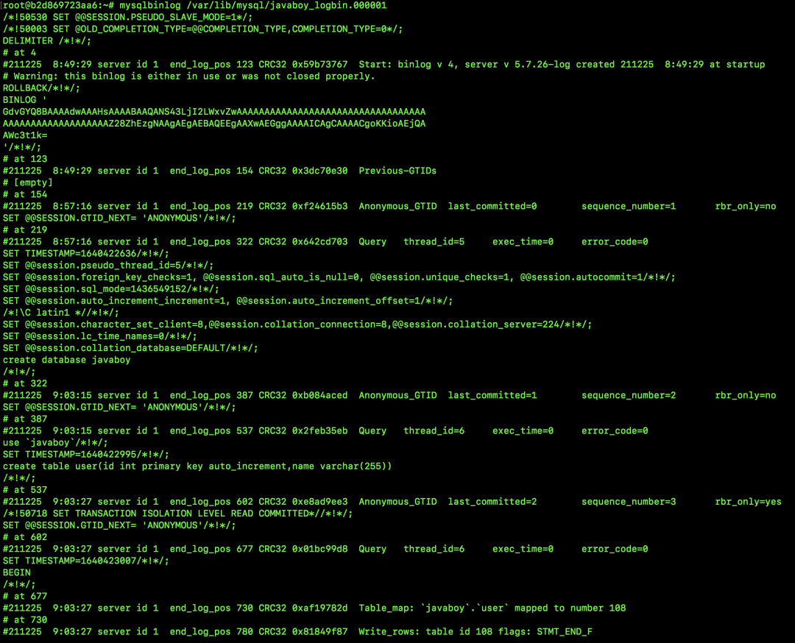
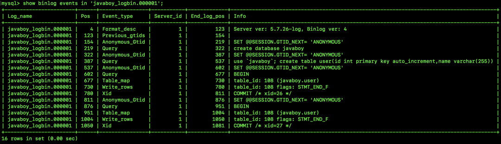

<style>
.orange {
   color: orange
}
.red {
   color: red
}
code {
   color: #0ABF5B;
}
</style>

    这是“mysql”系列的第七篇文章，主要介绍的是binlog日志。

# 一. mysql

`MySQL` 是一种广泛使用的开源关系型数据库管理系统（`RDBMS--Relational Database Management System`）

<!-- more -->


# 二. 日志类别
日志文件记录了影响MySQL数据库的各种类型活动。常见的日志文件有：
- 错误日志（`error log`）
- 二进制日志（`binlog`）
- 慢查询日志（`slow query log`）
- 查询日志（`log`）

# 三. binlog（二进制日志)
二进制日志（`binlog`)记录了对MySQL数据库执行更改的所有操作，但不包含 `select` 和 `show` 这类操作。

## 3.1. binlog的作用：
1. **恢复（`recovery`）**：某些数据的恢复需要二进制日志，例如，在一个数据库全备文件恢复后，用户可以通过二进制日志进行 `point-in-time` 的恢复。
2. **复制（`replication`）**：主从复制。
3. **审计（`audit`）**：用户可以通过二进制日志中的信息来进行审计，判断是否有对数据库进行注入的攻击。


## 3.2. binlog的存储位置
开启 `binlog` 主要是修改 `MySQL` 的配置文件 `mysqld.cnf`，该文件在容器的 `/etc/mysql/mysql.conf.d` 目录下。
```conf
# 这个参数表示启用 binlog 功能，并指定 binlog 的存储目录
log-bin=javaboy_logbin

# 设置 binlog_fomart 格式
binlog_fomart=MIXED

# 设置一个 binlog 文件的最大字节
# 设置最大 100MB
max_binlog_size=104857600

# 设置了 binlog 文件的有效期（单位：天）
expire_logs_days = 7

# binlog 日志只记录指定库的更新（配置主从复制的时候会用到）
#binlog-do-db=javaboy_db

# binlog 日志不记录指定库的更新（配置主从复制的时候会用到）
#binlog-ignore-db=javaboy_no_db

# 写缓存多少次，刷一次磁盘，默认 0 表示这个操作由操作系统根据自身负载自行决定多久写一次磁盘
# 1 表示每一条事务提交都会立即写磁盘，n 则表示 n 个事务提交才会写磁盘
sync_binlog=0

# 为当前服务取一个唯一的 id（MySQL5.7 之后需要配置）
server-id=1
```

## 3.3. 常见binlog操作

### 3.3.1. 查看binlog列表
通过如下方式我们可以查看 `binlog` 日志列表：`show master logs;`
```bash
mysql> show master logs;
+----------------------+------------------+
| Log_name             | File_size        |
+----------------------+------------------+
| javaboy_logbin.00001 | 154              |
+----------------------+------------------+
1 rows in set (0.00 sec)
```
可以看到，我这里目前只有一个日志文件，文件名为 `javaboy_logbin.000001`，`File_size` 表示这个文件占用的字节大小是 `154`。

### 3.3.2. 查看master状态
这个命令我们在搭建 `MySQL` 主从的时候经常会用到，如下：
```bash
mysql> show master status;
+----------------------+------------------+------------------+-------------------+-------------------+
| File                 | Position         |  Binlog_Do_DB    |  Binlog_Ingore_DB | Executed_Gtid_Set |
+----------------------+------------------+------------------+-------------------+-------------------+
| javaboy_logbin.00001 | 154              |                  |                   |                   |
+----------------------+------------------+------------------+-------------------+-------------------+
1 rows in set (0.00 sec)
```
这个时候可以看到最新的 `binlog` 日志文件名称以及最后一个操作事件的 `Position` 值。

### 3.3.3. 刷新 binlog
正常来说，一个 `binlog` 写满之后，会自动切换到下一个 `binlog` 开始写，不过我们也可以执行一个 `flush logs` 命令来手动刷新 `binlog`，手动刷新 `binlog` 之后，就会产生一个新的 `binlog` 日志文件，接下来所有的 `binlog` 日志都将记录到新的文件中。如下：

```bash
mysql> flush logs;
Query OK, 0 rows affected (0.02 sec)
mysql> show master logs;
+----------------------+------------------+
| Log_name             | File_size        |
+----------------------+------------------+
| javaboy_logbin.00001 | 206              |
| javaboy_logbin.00002 | 154              |
+----------------------+------------------+
2 rows in set (0.00 sec)
mysql> show master status;
+----------------------+------------------+------------------+-------------------+-------------------+
| File                 | Position         |  Binlog_Do_DB    |  Binlog_Ingore_DB | Executed_Gtid_Set |
+----------------------+------------------+------------------+-------------------+-------------------+
| javaboy_logbin.00002 | 154              |                  |                   |                   |
+----------------------+------------------+------------------+-------------------+-------------------+
1 rows in set (0.00 sec)
```
我们刷新日志之后，再通过 `show master logs` 去查看日志，发现日志文件已经多了一个新产生的了，然后再通过 `show master status` 去查看最新的日志文件信息，发现也已经变为 `javaboy_logbin.000002`。

---

## 3.4. binlog 文件解析

### 3.4.1. 查看binlog内容
由于 `binlog` 是二进制日志文件，所以要是直接打开，那肯定是看不了的。`MySQL` 为我们提供了两个官方工具，我们一个一个来看，首先是 `mysqlbinlog` 命令，如下（开启`GTID`模式）：

这里是一个新安装的数据库，里边只是创建了一个名为 `javaboy` 的库，然后创建了一个名为 `user` 的表加了两条数据，其他什么事情都没做，所以创建库的脚本我们其实能够从纷杂的文件中找到。

产生的日志文件中有一个 `end_log_pos` 是日志文件的 `pos` 点，这个将来在数据恢复的时候有用。

不过这种查看方式不够人性化，我们说 `binlog` 是<code class='red'>按照事件来记录日志</code>的，所以如果我们能够**按照事件**的方式查看日志，就会好很多，我们再来看看如下一个命令：
```bash
show binlog events [IN 'log_name'] [FROM pos] [LIMIT [offset,] row_count];
```
这个表示以事件的方式来查看 `binlog`，这里涉及到几个参数：
- <code class='orange'>log_name</code>：可以指定要查看的 `binlog` 日志文件名，如果不指定的话，表示查看最早的 `binlog` 文件。
- <code class='orange'>pos</code>：从哪个 `pos` 点开始查看，凡是 `binlog` 记录下来的操作都有一个 `pos` 点，这个其实就是相当于我们可以指定从哪个操作开始查看日志，如果不指定的话，就是从该 `binlog` 的开头开始查看。
- <code class='orange'>offset</code>：这是是偏移量，不指定默认就是 `0`。
- <code class='orange'>row_count</code>：查看多少行记录，不指定就是查看所有。

我们来看一个简单的例子：
```bash
show binlog events in 'javaboy_logbin.000001';
```

这下就清晰多了，我们可以看到之前的所有操作，例如：
- 在 `Pos 219-322` 之间创建了一个库。
- 在 `Pos 387-537` 之间创建了一张表。
- 在 `Pos 677-780` 之间添加了一条记录。
- ...

这其实就是 `Row` 格式的 `binlog`。

如官方文档中所写，`binlog`格式如下：
- `binlog`文件以一个值为`0Xfe62696e`的魔数开头，这个魔数对应`0xfe 'b''i''n'`。
- `binlog`由一系列的`binlog event`构成。每个`binlog event`包含`header`和`data`两部分。
    - `header`部分提供的是`event`的公共的类型信息，包括`event`的创建时间，服务器等等。
    - `data`部分提供的是针对该`event`的具体信息，如具体数据的修改。

---

### 3.4.2. Binlog 格式
`binlog` 有三种格式：
- `Statement(Statement-Based Replication,SBR)`：每一条会修改数据的 `SQL` 都会记录在 `binlog` 中。
- `Row(Row-Based Replication,RBR)`：不记录 `SQL` 语句上下文信息，仅保存哪条记录被修改。
- `Mixed(Mixed-Based Replication,MBR)`：`Statement` 和 `Row` 的混合体。

`mysql5.5`默认的还是`statement`模式，当然我们在主从同步中一般是不建议用`statement`模式的，因为会有些语句不支持，比如语句中包含`UUID`函数，以及`LOAD DATA IN FILE`语句等，一般推荐的是`mixed`格式。

#### 3.4.2.1. satement
记录的是逻辑`SQL`语句，即记录的是执行的`SQL`语句
**优点**：日志文件较小
**缺点**：可能存在主从不一致的问题（如使用非确定性函数时）

#### 3.4.2.2. row
记录变更前后的数据
**优点**：主从一致性高
**缺点**：日志文件较大

#### 3.4.2.3. mixed
混合使用 `satement` 和 `Row` 格式

---

### 3.4.3. Binlog Event
- `binlog`由一系列的`binlog event`构成。每个`binlog event`包含`header`和`data`两部分。
    - `header`部分提供的是`event`的公共的类型信息，包括`event`的创建时间，服务器等等。
    - `data`部分提供的是针对该`event`的具体信息，如具体数据的修改。

    
#### 3.4.3.1. Binlog Event类型
`MySQL` 支持多种类型的 `Binlog Event`，常见的类型如下：
- <code class='orange'>Query Event</code>：记录执行的 `SQL` 查询语句，通常用于记录 `DDL`（数据定义语言）语句，如 `CREATE TABLE、ALTER TABLE` 等。当执行这类语句时，会生成一个 `Query Event` 并记录到 `Binlog` 中。
- <code class='orange'>Write_rows Event</code>：用于记录 `INSERT` 操作，包含插入的行的具体数据。例如，当执行 `INSERT INTO users (name, age) VALUES ('John', 25);` 语句时，会生成一个 `Write_rows Event` 记录插入的 `name` 和 `age` 值。
- <code class='orange'>Update_rows Event</code>：记录 `UPDATE` 操作，包含更新前后的行数据。例如，执行 `UPDATE users SET age = 26 WHERE name = 'John';` 语句时，会生成一个 `Update_rows Event` 记录更新前和更新后的 `age` 值。
- <code class='orange'>Delete_rows Event</code>：记录 `DELETE` 操作，包含被删除的行的相关信息。当执行 `DELETE FROM users WHERE age > 30;` 语句时，会生成一个 `Delete_rows Event` 记录被删除行的条件和可能的部分数据。
- <code class='orange'>Xid Event</code>：用于标记事务的提交，包含事务的唯一标识符（`XID`）。当一个事务提交时，会生成一个 `Xid Event` 记录该事务的结束。


#### 3.4.3.2. Binlog Event数据结构
- 每个`binlog event`包含`header`和`data`两部分。
  - `header`部分提供的是`event`的公共的类型信息，包括`event`的创建时间，服务器等等。
  - `data`部分提供的是针对该`event`的具体信息，如具体数据的修改。
```
+============================================+
|        | timestamp         0 : 4（字节）    | 事件创建时间（小端存储）
|        +-----------------------------------+
|        | type_code         4 : 1（字节）    | 事件类型
| event  +-----------------------------------+
| header | server_id         5 : 4（字节）    | 服务器ID（小端存储）
|        +-----------------------------------+
|        | event_length      9 : 4（字节）    | 事件总长度
|        +-----------------------------------+
|        | next_position    13 : 4（字节）    | 下一个事件的起始位置
|        +-----------------------------------+
|        | flags            17 : 2（字节）    | 标志位（如 LOG_EVENT_BINLOG_IN_USE_F）
|        +-----------------------------------+
|        | extra_headers    19 : x-19        | 
+============================================+
| event  | fixed part        x : y           |
| data   +-----------------------------------+
|        | variable part                     |
+============================================+
```

`Data`是事件的主体，其结构因事件类型而异。以下是常见事件类型的`data`结构示例：
- `FORMAT_DESCRIPTION_EVENT（V4）`
  - 作用：描述`binlog`文件的格式版本
  - 关键字段：
    - `binlog_version`（2字节）：binlog格式版本（v4为4）
    - `server_version`（50字节）：MySQL服务器版本（如8.0.28）
    - `create_timestamp`（字节）：Binlog文件创建时间
- `QUERY_EVENT`
  - 作用：记录SQL语句（Statement模式下）
  - 关键字段：
    - `thread_id`（4字节）：执行线程ID
    - `exec_time`（4字节）：执行耗时（单位：秒）
    - `error_code`（2字节）：错误码
    - `query`（可变长度）：SQL语句（如BEGIN、COMMIT）

### 3.4.4. 示例说明
假设`MySQL`的`binlog`格式为`ROW`（未开启`GTID`模式），执行以下`SQL`操作：
```
-- 创建表
CREATE TABLE user (id INT PRIMARY KEY, name VARCHAR(50), age INT);
-- 插入数据
INSERT INTO user (id, name, age) VALUES (1, 'Alice', 25);
-- 更新数据
UPDATE user SET age = 26 WHERE id = 1;
-- 删除数据
DELETE FROM user WHERE id = 1;
```
输出结果（部分）
```sql
# Format: v4
# Binlog version: 4
# Server version: 8.0.28
# Created: 2025-05-17 16:53:59
# Position: 123
# End_log_pos: 157
# Event_type: FORMAT_DESCRIPTION
# Server_id: 1
# ...

# At 157
#250517 16:53:59 server id 1  end_log_pos 256  Xid = 1
COMMIT /* XID = 1 */

# At 256
#250517 16:54:00 server id 1  end_log_pos 367  Table_map: `test`.`user` mapped to number 290
#250517 16:54:00 server id 1  end_log_pos 427  Write_rows: table id 290 flags: STMT_END_F
### INSERT INTO `test`.`user`
### SET
###   @1=1 /* INT meta=0 nullable=0 is_null=0 */
###   @2='Alice' /* VARSTRING(50) meta=50 nullable=1 is_null=0 */
###   @3=25 /* INT meta=0 nullable=0 is_null=0 */
# at 427
#250517 16:54:00 server id 1  end_log_pos 462  Xid = 2
COMMIT /* XID = 2 */

# At 462
#250517 16:54:01 server id 1  end_log_pos 573  Table_map: `test`.`user` mapped to number 290
#250517 16:54:01 server id 1  end_log_pos 633  Update_rows: table id 290 flags: STMT_END_F
### UPDATE `test`.`user`
### WHERE
###   @1=1 /* INT meta=0 nullable=0 is_null=0 */
###   @2='Alice' /* VARSTRING(50) meta=50 nullable=1 is_null=0 */
###   @3=25 /* INT meta=0 nullable=0 is_null=0 */
### SET
###   @1=1 /* INT meta=0 nullable=0 is_null=0 */
###   @2='Alice' /* VARSTRING(50) meta=50 nullable=1 is_null=0 */
###   @3=26 /* INT meta=0 nullable=0 is_null=0 */
# at 633
#250517 16:54:01 server id 1  end_log_pos 668  Xid = 3
COMMIT /* XID = 3 */

# At 668
#250517 16:54:02 server id 1  end_log_pos 779  Table_map: `test`.`user` mapped to number 290
#250517 16:54:02 server id 1  end_log_pos 839  Delete_rows: table id 290 flags: STMT_END_F
### DELETE FROM `test`.`user`
### WHERE
###   @1=1 /* INT meta=0 nullable=0 is_null=0 */
###   @2='Alice' /* VARSTRING(50) meta=50 nullable=1 is_null=0 */
###   @3=26 /* INT meta=0 nullable=0 is_null=0 */
# at 839
#250517 16:54:02 server id 1  end_log_pos 874  Xid = 4
COMMIT /* XID = 4 */
```
对输出结果进行解析说明：

| 内容                                              | 含义                                                                              |
|-------------------------------------------------|---------------------------------------------------------------------------------|
| `# At 100`                                      | 表示当前事件（`event`）在`binlog`文件中的起始位置（以字节为单位）。是`binlog`文件中事件的定位标识符，用于标识事件在文件中的具体偏移量。 |
| `#250517 16:54:02`                              | 表示事件发生的时间（2025年5月17日16:54:01）                                                   |
| `server id 1`                                   | 表示该事件由MySQL服务器的`server_id=1`的实例生成                                               |
| `end_log_pos 573`                               | 表示该事件在binlog文件中结束的位置是第`573`字节                                                   |
| `Table_map: `test`.`user` mapped to number 290` | 表示数据库`test`中的`user`表被映射为**表 ID 290**                                            |
| `Write_rows`                                    | 写入行                                                                             |
| `Update_rows`                                   | 更新行                                                                             |
| `Delete_rows`                                   | 删除行                                                                             |
| `flags: STMT_END_F`                             | 表示该事件是一个事务的结束标志（与XID事件类似，但仅在ROW格式中出现                                            |
| `COMMIT /* XID = 2 */`                          | 表示事务提交（COMMIT）操作，事务提交标志着一组数据库操作的完成，所有变更将被持久化，表示事务的`XID`（事务ID）为3                 |


完整事务的`binlog`记录
```sql
# At 600
#250517 16:54:00 server id 1  end_log_pos 633  Query thread_id=3 exec_time=0 error_code=0
BEGIN

# At 633
#250517 16:54:01 server id 1  end_log_pos 668  Xid = 3
COMMIT /* XID = 3 */
```
`COMMIT`事件的生成，在后续`binlog`的生成章节进行说明。


### 3.4.5. GTID（Global Transaction Identifier）
`GTID（Global Transaction Identifier）`是MySQL 5.6 引入的一种事务标识机制，用于唯一标识每个事务，并简化主从复制的管理。

- **作用**
  - **唯一标识事务**：每个事务在`MySQL`中都会分配一个全局唯一的`GTID`，格式为：`source_id:transaction_id`（例如`aaaa-bbb-ccc-ddd-eee:1`）
  - **简化主从复制**：从库通过`GTID`自动定位需要复制的事务，无需手动指定`binlog`文件名和位置（如`master_log_file`和`master_log_pos`）
  - **自动故障切换**：在高可用场景，`GTID`可以快速切换从库，确保从库继续复制未完成的事务。
  - **避免数据不一致**：`GTID`保证事务在主从之间严格顺序执行，避免因复制延迟导致的数据冲突。
- 与`binlog`的关系
  - `GTID` 不会改变`binlog`的格式（`STATEMENT/ROW/MIXED`），但会在`binlog`中添加`GTID`元数据，具体影响如下：
````sql
# At 1000
SET @@SESSION.GTID_NEXT='aaaaaaaa-bbbb-cccc-dddd-eeeeeeeeeeee:1'/*!*/;
BEGIN
...
COMMIT
````
- `GTID_NEXT`：表示当前事务的`GTID`

**性能开销**
- `GTID`会增加少量`binlog`写入开销（约`1% ~ 3%`），但通常可忽略。

| 特性        | `GTID`                          | `XID`                                     |
|-----------|---------------------------------|-------------------------------------------|
| **定义**    | 全局事务标识符，用于唯一标识一个事务，并确保其在集群中的唯一性 | 事务标识符，用于标识数据库内部事务的唯一性，主要在binlog和innodb中使用 |
| **核心作用**  | 主从复制中事务的唯一性、故障恢复、数据一致性保障        | 事务在数据库内部的追踪、日志记录、恢复操作的依据                  |
| **唯一性范围** | 全局唯一（跨实例、跨集群）                   | 本地唯一（仅当前实例内唯一）                            |
| **配置**        | 可通过参数（`gtid_mode`）启用或关闭           | 内部自动维护，用户无法直接配置                           |

`GTID`和`XID`是互补的，选择建议：
- 如果需要主从复制、故障恢复或分布式集群管理，开启`GTID`。
- 如果仅需本地事务追踪或数据恢复，使用`XID`即可。


### 3.4.6. Binlog event的有序性
- `XID`和`TIMESTAMP`
  - **无序**：事务的`XID`和执行时间戳（`TIMESTAMP`）可能不按顺序写入`binlog`，尤其在并发事务场景下。
  - **原因**：事务提交顺序与写入`binlog`的顺序可能不一致。
- `GTID（Global Transaction Identifier）`
  - **有序**：在自动模式下，`GTID`的`GNO`（全局事务编号）是递增的，确保同一个`UUID`下的事务顺序性。

## 3.5. binlog的生成 & 刷盘
`Binlog`（二进制日志）主要由 `MySQL` 服务器的主线程生成。

生成过程
- **执行 SQL 语句**：当客户端向 `MySQL` 服务器发送修改数据的 SQL 语句（如 `INSERT、UPDATE、DELETE` 等）时，执行器会执行这些语句并与存储引擎交互完成数据的修改。
- **收集变更信息**：在执行 `SQL` 语句的过程中，执行器会收集数据变更的详细信息，如插入的行数据、更新前后的值等。
- **生成 Binlog Event**：`MySQL` 服务器的主线程根据收集到的变更信息，将其组织成相应类型的 `Binlog Event`。例如，如果是 `INSERT` 语句，会生成 `Write_rows Event`。
- **写入 Binlog**：生成的 `Binlog Event` 会先被写入 `Binlog Cache`，在事务提交时，根据 `sync_binlog` 参数的设置，将 `Binlog Cache` 中的内容刷新到磁盘上的 `Binlog` 文件中。

### 3.5.1. Binlog Commit事件
在MySQL中，`binlog commit`事件是**事务提交时（COMMIT操作）**在二进制日志中记录的关键事件，用于标识事务的结果。它与两阶段提交机制密切相关，确保数据一致性。

#### 3.5.1.1. Commit事件作用
- **事务完整性标识**
  在`binlo`g 中，事务的结束通过 `XID_EVENT`（ROW格式）或`COMMIT`语句（Statement格式）表示。这个事件标志着事务的所有更改已完成。
- **主从复制依据**
  从库通过解析`binlog`中的`commit`事件，确认事务是否已完整执行，并将其应用于本地数据库。
- **崩溃恢复依据**
  在数据库崩溃恢复时，MySQL通过`binlog`中的`commit`事件和`redo log`的`prepare`阶段状态，判断事务是否需要提交或回滚。

#### 3.5.1.2. 与两阶段提交的关系
1. **Prepare阶段（Innodb）**
   - **执行事务操作**：
     - 执行SQL语句（如Insert），修改内存中的数据页，并将变更记录到redo log中（此时`redo log`标记为`prepare`状态，未最终提交）。
     - 生成一个唯一的`XID`（事务ID），用于关联redo log 和 binlog
   - **记录redo log 的prepare状态**
     - 写入`redo log`的内容包括：数据变更、事务状态（prepare）、XID。
     - 调用`fsync`将`redo log`刷盘（确保崩溃时可恢复）
2. **Commit阶段（MySQL Server层）**
  - 写入binLog
    - **生成binlog事件**：事务的变更操作会被打包为`binlog`事件（如`XID_EVENT`或`COMMIT`语句），写入线程级的`binlog`缓存。
    - 将事务的逻辑操作（如SQL语句或行变更）写入`binlog`，并在末尾添加<code class='red'>Xid事件</code>（ROW格式）或`COMMIT语句`（STATEMENT格式）
    - 刷盘操作（由`sync_binlog`控制）根据`sync_binlog`决定刷盘策略。
  - 提交redo log
    - **修改redo log 状态**，将`redo log`的状态从`prepare`更新为`commit`。
    - 此时，事务正式提交，数据变更对其他事务可见。

关键时间点：
- `COMMIT`**事件的生成**：在事务提交阶段的早期（写入`binlog`缓存时）
- `binlog`**刷盘**：在`COMMIT`事件生成后，根据`sync_binlog`参数决定是否立即刷盘。

### 3.5.2. binlog的刷盘策略
`Binlog` 的刷盘策略由`sync_binlog`参数控制：
- `sync_binlog=1`
    - 代表一个事务提交时会调用`fsync`磁盘<font color=red>**同步指令**</font>将binlog_cache中的数据写入磁盘，保证数据的不丢失，实际与页的写入是一致的。
    - **binlog由谁写入？**当事务提交时，**MySQL主线程**会负责将该事务产生的 `Binlog` 从 `Binlog Cache` 刷盘到 `Binlog` 文件。
- `sync_binlog=0`
    - MySQL主线程不会调用`fsync`命令，而是由操作系统自己决定什么时候刷入磁盘
    - 缓存占用内存比例达到一定比例
    - 超过一定时间
- `sync_binlog=n`
    - 代表n个事务提交才会写盘，此时数据是写入binlog_cache中，未写盘则会导致数据丢失，给数据恢复和复制带来问题。


## 3.6. crash-safe
`crash safe` 指数据库在意外崩溃（如断电、系统故障）后，能够通过日志机制恢复到崩溃前的一致性状态，确保数据不丢失且事务完整。


### 3.6.1. 为什么binlog无法保障crash-safe?
- **Binlog是逻辑日志**
  - 记录的是高层操作（如 `Insert into t values(1)`），无法直接反映数据页的物理状态。
  - 例如：若某事务修改了多个数据页，binlog 仅记录逻辑操作，但无法指定如何物理恢复这些页。
- **Redo log是物理日志**
  - 直接记录数据页的修改，崩溃恢复时可快速重放物理操作，确保数据页恢复到一致性状态。

结论：Binlog缺乏物理恢复能力，需依赖Redo log 实现crash safe.


## 3.6. binlog小结
`Binlog` 由 <font color=green>**MySQL server的SQL线程负责写入**</font>，用于记录所有对数据库的修改操作。它的写入过程涉及 `Binlog`缓存、`Binlog`文件和文件系统缓存，写入时机由 `sync_binlog` 参数控制。通过合理配置和优化，可以提高 `Binlog` 的写入性能，同时确保数据的一致性和持久性。


> 参考文章： 
> [MySQL Binlog 源码入门](http://mysql.taobao.org/monthly/2023/01/04/) 
> [MySQL · 引擎特性 · InnoDB 事务子系统介绍](http://mysql.taobao.org/monthly/2015/12/01/) 
> [07 期 | 二阶段提交 (1) prepare 阶段](https://opensource.actionsky.com/07-%e6%9c%9f-%e4%ba%8c%e9%98%b6%e6%ae%b5%e6%8f%90%e4%ba%a4-1-prepare-%e9%98%b6%e6%ae%b5/)
> [MySQL 的 binlog 的三种格式](https://www.51cto.com/article/703972.html)