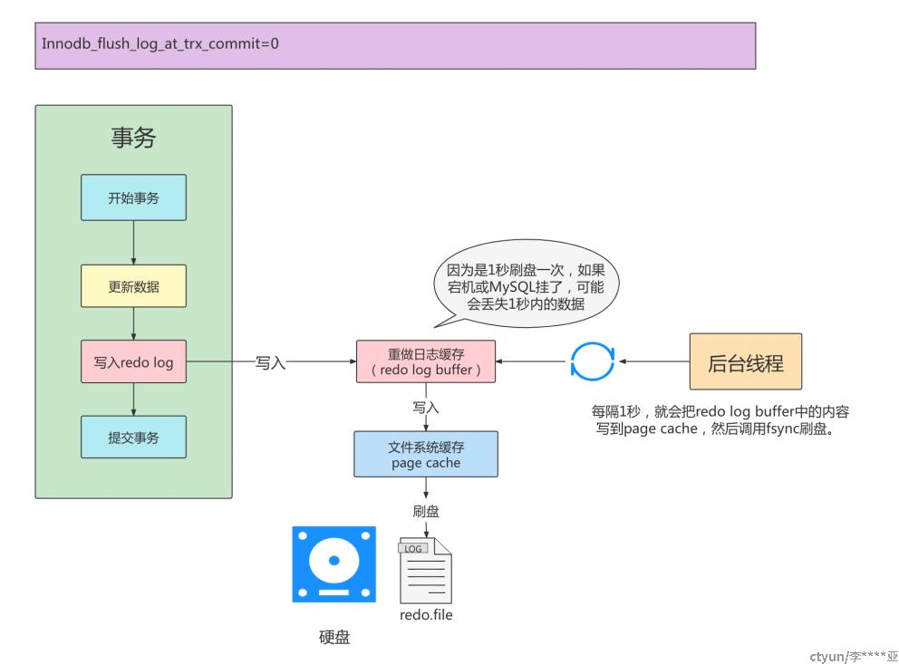
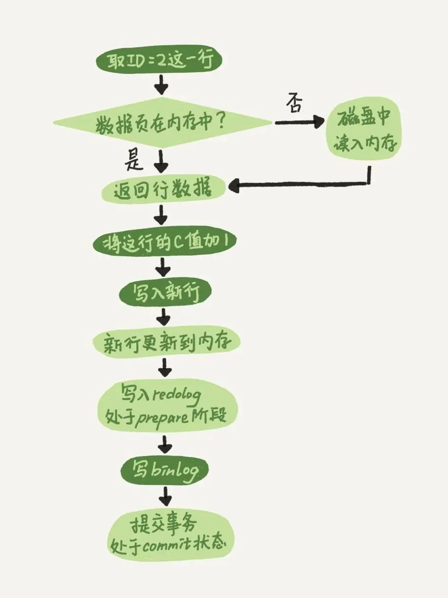

<style>
.orange {
   color: orange
}
.red {
   color: red
}
code {
   color: #0ABF5B;
}
</style>

    这是“mysql”系列的第八篇文章，主要介绍的是redo日志。

# 一. mysql

`MySQL` 是一种广泛使用的开源关系型数据库管理系统（`RDBMS--Relational Database Management System`）

<!-- more -->


# 二. 日志类别
日志文件记录了影响MySQL数据库的各种类型活动。常见的日志文件有：
- 错误日志（`error log`）
- 二进制日志（`binlog`）
- 慢查询日志（`slow query log`）
- 查询日志（`log`）


# 三. redo log（重做日志）
`redo log`（重做日志）是`innodb`的核心组件之一，用于保证事务的持久性和崩溃恢复。它的主要作用是记录对数据页的修改操作，以便在数据库崩溃后能够重新应用这些修改，确保数据的一致性。

## 4.1. redo log的作用
1. **保证事务的持久性**
即使数据库崩溃，已提交事务的修改也不会丢失。
2. **支持崩溃恢复**
在数据库重启时，通过重放 `redo log` 可以将数据恢复到崩溃前的状态。
3. **提高写性能**
将对数据页的随机写操作转换为对 `redo log` 的顺序写操作，从而提高写入性能。

`binlog`无法保障`crash-safe`，`redo log`的作用是为了和`binlog`保持逻辑一致，通过“`两阶段提交`”，保证`crash-safe`。

## 4.2. redo log 的组成
组成：
1. `redo log buffer`：重做日志的缓存
2. `redo log file`：重做日志文件

- `MySQL` 中数据是以页为单位，你查询一条记录，会从硬盘把一页的数据加载出来，加载出来的数据叫数据页，会放入到 `Buffer Pool` 中。
- 后续的查询都是先从 `Buffer Pool` 中找，没有命中再去硬盘加载，减少硬盘 IO 开销，提升性能。
- 更新表数据的时候，也是如此，发现 `Buffer Pool` 里存在要更新的数据，就直接在 `Buffer Pool` 里更新。然后会把“在某个数据页上做了什么修改”记录到重做日志缓存（`redo log buffer`）里，接着刷盘到 `redo log` 文件里。
  


## 4.2. redo log File 重做日志文件

### 4.2.1. redo log file 文件组
`redo log`由多个固定大小的文件组成，通常位于MySQL的数据目录下，文件名为 `ib_logfile0` 和 `ib_logfile1`（默认配置）。`redo log`文件是循环使用的，写满后会从头开始覆盖。


### 4.2.2. ib_logfile的结构
`ib_logfile` 日志文件由多个`Log Block`组成，每个`Block`的大小固定为`512`字节（对应磁盘扇区大小）.
- 前 `2048` 个字节，也就是前 `4 个 block` 是用来存储一些管理信息的。
- 从第 `2048` 字节往后是用来存储 `log buffer` 中的 `block` 镜像的。
我们还是画一个图进行说明吧：


#### 4.2.1.1. ib_logfile的 前4个 Block
**前4个 block** 存的都是啥管理信息呢？

- <code class='red'>log file header</code> ：描述该 redo 日志文件的一些整体属性，看一下它的结构：
    - `LOG_HEADER_FORMAT`（0，4字节）：redo 日志的版本，在 MySQL5.7.21 中该值永远为 1
    - `LOG_HEADER_PAD1`（4，4字节）：做字节填充用的，没什么实际意义
    - `LOG_HEADER_START_LSN`（8，8字节）：标记本 redo 日志文件开始的 LSN 值，也就是文件偏移量为 2048 字节初对应的 LSN 值
    - `LOG_HEADER_CREATOR`（16，32字节）：一个字符串，标记本 redo 日志文件的创建者是谁。正常运行时该值为 MySQL 的版本号，比如： "MySQL 5.7.21" ，使用 mysqlbackup 命令创建的 redo 日志文件的该值为 "ibbackup" 和创建时间
    - `LOG_BLOCK_CHECKSUM` （508，4字节）：本 block 的校验值
- <code class='red'>checkpoint1 </code>：记录关于 checkpoint 的一些属性，如上图：
    - `LOG_CHECKPOINT_NO`（0，8字节）：服务器做 checkpoint 的编号，每做一次 checkpoint ，该值就加 1
    - `LOG_CHECKPOINT_LSN`（8，8字节）：服务器做 checkpoint 结束时对应的 LSN 值，系统奔溃恢复时将从该值开始
    - `LOG_CHECKPOINT_OFFSET`（16，8字节）：上个属性中的 LSN 值在 redo 日志文件组中的偏移量
    - `LOG_CHECKPOINT_LOG_BUF_SIZE`（24，8字节）：|服务器在做 checkpoint 操作时对应的 log buffer 的大小
    - `LOG_BLOCK_CHECKSUM`：本block的校验值
      

#### 4.2.1.2. block结构
每个 `Block` 的结构如下：


| 字段           | 字节数   | 描述                            |
|--------------|-------|-------------------------------|
| **Block Header** | 12字节  | 包含Block的元数据                   |
| **Log Data**     | 498字节 | 存储Redo log的实际内容，即事务的物理修改操作记录  |
| **Block Tailer** | 4字节   | 校验和（checksum），用于验证Block数据的完整性 |

- **LOG_BLOCK_HDR_NO** ：每一个 `block` 都有一个大于 0 的唯一标号，本属性就表示该标号
- **LOG_BLOCK_HDR_DATA_LEN** ：表示 `block` 中已经使用了多少字节，初始值为 12 （因为 `log block body` 从第12个字节处开始）。随着往 `block` 中写入的 `redo` 日志越来也多，本属性值也跟着增长。如果 `log block body` 已经被全部写满，那么本属性的值被设置为 `512`
- **LOG_BLOCK_FIRST_REC_GROUP** ：一条 `redo` 日志也可以称之为一条 `redo` 日志记录（ `redo log record` ），一个 `mtr` 会生产多条 `redo` 日志记录，这些 `redo` 日志记录被称之为一个 redo 日志记录组（ `redo logrecord group` ）。 `LOG_BLOCK_FIRST_REC_GROUP` 就代表该 `block` 中第一个 `mtr` 生成的 `redo` 日志记录组的偏移量（其实也就是这个 block 里第一个 mtr 生成的第一条 redo 日志的偏移量）
- **LOG_BLOCK_CHECKPOINT_NO** ：表示所谓的 `checkpoint` 的序号

### 4.2.2. redo log file 内容
`ib_logfile*`是二进制格式且结构复杂，无法直接通过文本编辑器查看，需借助工具解析。
- hexdump查看原始二进制内容
- 使用专业工具解析（Percona）

#### 4.2.2.1. 日志记录的基本字段
| 字段                           | 描述                                                 |
|------------------------------|----------------------------------------------------|
| **LSN（Log Sequence Number）** | 8字节，单调递增的序列号，标识日志记录的顺序和位置。                         |
| **Transaction ID**           | 事务的唯一标识符，用于区分不同事务的修改。                              |
| **STATE**                    | 事务状态（PREPARE或COMMIT），用于崩溃恢复时判断事务是否需要提交或回滚          |
| **Log Type**                 | 操作类型：MLOG_WRITE_STRING（写字符串）；MLOG_REC_INSERT（插入记录） |
| **Space ID**                 | 表空间ID，标识修改发生的数据文件                                  |
| **Page No**                  | 数据页号，标识具体修改的页面。                                    |
| **Offset**                   | 数据页内的偏移量，标识修改的位置                                   |
| **Length**                   | 修改的数据长度                                            |
| **Data**                     | 修改后的数据值（二进制格式）                                     |

#### 4.2.2.2. ib_logfile解析示例
**hexdump 解析示例**
```sql
hexdump -C ib_logfile0
```
输出片段如下：
```plaintext
偏移量        内容（十六进制）
00000000  00 00 00 00 [00 00 00 6d]  [02] [00 00 00 01] 00 00 00  |........m........|
00000010  [2a 00 00 00] 00 00 00 00  f8 ff ff ff 01 00 00 00  |*...............|
00000020  00 00 00 00 00 00 00 00  00 00 00 00 00 00 00 00  |................|
00000030  6b 01 00 00 00 00 00 00  01 00 00 00 05 00 00 00  |k...............|
00000040  01 00 00 00 00 00 00 00  00 00 00 00 00 00 00 00  |................|
00000050  00 00 00 00 00 00 00 00  00 00 00 00 00 00 00 00  |................|
...（中间省略部分内容）...
00000200  a0 03 00 00 00 00 00 00  01 00 00 00 10 00 00 00  |................|
00000210  02 00 00 00 00 00 00 00  00 00 00 00 00 00 00 00  |................|
00000220  01 00 00 00 00 00 00 00  [61 62 63 64] 00 00 00 00  |........abcd....|
```
关键字段解析

| 偏移量    | 内容（十六进制）    | 含义解释                                   |
|----------|-------------|----------------------------------------|
| 00000004 | 00 00 00 6d | LSN（日志序列号）：0x6d 表示当前日志的起始位置（十进制为109）。  |
| 00000008 | 02          | 日志类型：0x02 代表 MLOG_WRITE_REDO（数据页修改日志）。 |
| 0000000c | 00 00 00 01 | 表空间ID：0x01 表示该操作属于系统表空间或特定表空间。         |
| 00000010 | 2a 00 00 00 | 数据页号：0x2a 表示修改的数据页编号（十进制为42）。          |
| 00000228 | 61 62 63 64 | 实际数据：此处为字符 abcd 的ASCII码，可能是某行记录的字段值。   |


**Percona 解析示例**

以下是模拟输出示例：
```plaintext
=== Redo Log Record ===
LSN: 0x000000000000006d
Type: MLOG_WRITE_REDO (0x02)
Transaction ID: 0x0000000000000001
Table Space ID: 1
Page Number: 42
STATE：COMMIT
Data: 
  Offset: 0x100
  Length: 16 bytes
  Content: 0x0100000000000000000000000061626364  --> 解析为字段值 'abcd'
```
- 关键信息：
  - 该日志记录了对**表空间1**中**42号数据页**的修改，写入值为`abcd`.
  - 通过**事务ID**可关联到具体事务，`LSN`用于恢复时的顺序控制。


## 4.3. redo log buffer 重做日志的缓存
为了解决磁盘速度过慢的问题而引入了 `Buffer Pool` 。同理，写入 `redo` 日志时也不能直接直接写到磁盘上，实际上在服务器启动时就向操作系统申请了一大片称之为 `redo log buffer` 的连续内存空间，也叫 **redo日志缓冲区** ，简称为 `log buffer` 。这片内存空间被划分成若干个连续的 `redo log block` ，每个`Block` 512 字节，如图：


### 4.3.1. 刷盘时机
刷盘时机由 `innodb_flush_log_at_trx_commit` 参数控制：默认为1，事务提交时立即刷盘。

刷盘策略：
- 事务提交时刷盘：事务提交时，`Redo Log`会根据配置刷新到磁盘。
- 后台线程定时刷盘：Innodb 后台线程**每隔1秒**将`redo log buffer`刷入磁盘
- 日志缓冲区满时刷盘：当`redo log buffer`占用超过一半时，强制刷盘。


## 4.3. redo log的生成

### 4.3.1. redo log生成示例
`InnoDB`会将事务执行过程拆分为若干个`Mini Transaction（mtr）`，每个`mtr`包含一系列如加锁，写数据，写redo，放锁等操作。举个例子：
```c
void btr_truncate(const dict_index_t *index) {
  
  ... ...
      
  page_size_t page_size(space->flags);
  const page_id_t page_id(space_id, root_page_no);
  mtr_t mtr;
  buf_block_t *block;

  mtr.start();

  mtr_x_lock(&space->latch, &mtr);

  block = buf_page_get(page_id, page_size, RW_X_LATCH, &mtr);

  page_t *page = buf_block_get_frame(block);
  ut_ad(page_is_root(page));

  /* Mark that we are going to truncate the index tree
  We use PAGE_MAX_TRX_ID as it should be always 0 for clustered
  index. */
  mlog_write_ull(page + (PAGE_HEADER + PAGE_MAX_TRX_ID), IB_ID_MAX, &mtr);

  mtr.commit();
    
  ... ...
      
}
```
`btr_truncate`是一个用于 截断索引树 的函数。其核心逻辑是通过Mini-Transaction（MTR）机制对 B+ 树的根页进行物理修改，并生成相应的Redo log 以确保崩溃恢复能力。
- `mtr.start()` 开启一个`mini transaction`
- `mtr_x_lock()` 加锁，这个操作分成两步，1. 对space->latch加X锁；2. 将space->latch放入mtr_t::m_impl::memo中（这样在mtr.commit()后就可以将mtr之前加过的锁放掉）
- `mlog_write_ull` 写数据，这个操作也分成两步，1. 将该操作的redo log写入mtr::m_impl::m_log中；2. 直接修改page上的数据；
- `mtr.commit()` 写redo log + 放锁，这个操作会将上一步m_log中的内容写入redo log file，并且在最后放锁
以上就是一个mtr大致的执行过程，这里仅需要知道`mtr.commit()`是开始**写redo log**的地方就可以了。

#### 4.3.1.1. `mlog_write_ull`
`mlog_write_ull`是Innodb中用于**生成Redo Log**的核心函数之一。

源码伪代码示例：
```c
void mlog_write_ull(byte* ptr, ulint val, mtr_t* mtr) {
    // Step 1: 在 Redo Log Buffer 中预留空间
    byte* log_ptr = log_reserve(MLOG_PAGE_WRITE_ULL, mtr);

    // Step 2: 写入 Redo Log 头信息
    mlog_write_initial(log_ptr, MLOG_PAGE_WRITE_ULL, mtr);
    mlog_write_page_id(log_ptr, page_id(mtr), mtr);
    mlog_write_offset(log_ptr, (ulint)(ptr - page_start), mtr);

    // Step 3: 写入 8 字节值
    mlog_write_ull(log_ptr, val, mtr);

    // Step 4: 修改内存中的数据页
    mach_write_to_8(ptr, val);
}
```

**关键点总结**

| 关键点            | 说明                                         |
|----------------|--------------------------------------------|
| 日志类型           | MLOG_PAGE_WRITE_ULL（写入8字节无符号长整形）           |
| 作用             | 记录对数据页中某个偏移量的修改，确保崩溃恢复能力                   |
| 执行顺序           | 先写Redo Log,再修改数据页（符合WAL机制）                 |
| 调用时机           | 在事务执行过程中（如插入、更新、删除操作时）                     |
| 与mtr_commit的关系 | `mlog_write_ull`生成Redo Log，`mtr_commit`负责将日志刷盘 |

```c
// 示例：插入记录的流程（伪代码）
void insert_record(mtr_t* mtr, page_t* page, const char* value) {
    // Step 1: 生成 Redo Log
    mlog_write_initial_log_record(MLOG_REC_INSERT, page, value);

    // Step 2: 修改内存中的数据页
    page_insert_record(page, value);
}
```

### 4.3.2. mini-transaction（MTR）
`mini-transaction`（简称MTR）是`Innodb`内部用于管理并发事务的最小原子操作单元。它通过加锁、生成 `Redo/undo` 日志、释放锁等步骤，确保单个数据页修改的原子性和一致性。`MTR` 是Innodb实现高并发、数据一致性的核心机制之一。

`MTR`**的核心作用**
- **保证单页数据一致性**：MTR 是针对单个数据页（Page）的原子操作，确保该页的修改要么全部成功，要么全部失败。
- **并发控制**：通过加锁机制（如 S-Lock/ X-Lock）防止多个事务同时修改同一数据页。
- **日志管理**：MTR 会生成 `Redo log` 和 `Undo Log`。
- **支持用户事务**：用户事务（User Transaction）由多个 MTR 组成，每个 MTR 对应一个具体的物理操作（如插入、更新、删除）。

> `mini transation` 主要用于innodb `redo log` 和 `undo log`写入，保证两种日志的ACID特性
> 
> 我们需要明确的是，`Mini-Transaction`与我们通常理解的数据库事务并非同一概念。
> - 数据库事务，作为数据库操作的基本单位，旨在保证多条语句操作的一致性，通常涉及到多个数据页的修改。
> - 而`Mini-Transaction`则是专注于保证单个数据页的一致性，避免内存页的并发更新冲突。


`mini-transaction`遵循以下三个协议:
- **The FIX Rules**：修改一个页需要获得该页的x-latch
- **Write-Ahead Log**：持久化一个数据页之前，必须先将内存中相应的日志页持久化
- **Force-log-at-commit**：


#### 4.3.2.1. MTR 的生命周期
`MTR`总是按照如下的顺序使用：
```c
mtr_t mtr
mtr.start()

/* ... */
/* 写入数据至 mini-transaction 的 m_log. */
/* ... */

mtr.commit()
```
1. `mtr_start()`
   - 初始化 `MTR` 结构体 （`mtr_t`）
   - 分配锁栈 （`Lock Stack`）和日志栈（`Log Stack`）
2. **加锁**（`mtr_s_lock/mtr_x_lock`）
   - 对目标数据页加共享锁（`S-Latch`）或排他锁（`X-Latch`）
   - 锁信息记录在锁栈中。
3. **操作数据页**
    - 生成 `Undo log` 和 `Redo Log`
    - 修改数据页（如插入记录、更新索引）
4. **提交**（`mtr_commit()`)
   - 将日志栈中的日志写入 `Redo Log Buffer`
   - 释放锁栈中的锁。
   - 更新数据页的`LSN（Log Sequence Number）`。

#### 4.3.2.2. MTR 结构体（mtr_t）
```c
struct mtr_t {
    ulint        state;                 // MTR 状态（ACTIVE/COMMITTING/COMMITTED）
    dyn_array_t  memo;                  // 锁栈（记录锁信息）
    dyn_array_t  log;                   // 日志栈（记录 Redo/Undo 日志）
    ibool        modifications;         // 是否修改了 Buffer Pool 页面
    ulint        n_log_recs;            // 日志记录数量
    dulint       start_lsn;             // 起始 LSN
    dulint       end_lsn;               // 结束 LSN
    ulint        log_mode;              // 日志模式（如 MTR_LOG_ALL）
    ulint        magic_n;               // 魔数（用于调试）
};
```
- **log**：用来存储这个物理事务在访问修改数据页面的过程中产生的所有日志，<code class='red'>这个日志就是数据库中经常说到的重做（redo log）日志；</code>
- 其中`m_memo`中元素是`mtr_memo_slot_t`, 记录**加锁的对象和加锁的类型**.
```c
/** mini-transaction memo stack slot. */
struct mtr_memo_slot_t {
void *object;  /* 加锁的对象. */

ulint type;    /* 持有的锁类型，W or R. */
};
```


#### 4.3.2.3. mtr_start
这个方法只是对`mtr_struct`数据结构的初始化。
```c
UNIV_INLINE mtr_t* mtr_start(mtr_t*    mtr)    
{
    dyn_array_create(&(mtr->memo));
    dyn_array_create(&(mtr->log));

    mtr->log_mode = MTR_LOG_ALL;
    mtr->modifications = FALSE;
    mtr->n_log_recs = 0;


#ifdef UNIV_DEBUG
    mtr->state = MTR_ACTIVE;
    mtr->magic_n = MTR_MAGIC_N;
#endif
    return(mtr);
}  
```

#### 4.3.2.4. mtr_commit
这个方法是Innodb中**事务提交**的核心函数，负责：
1. **写 Redo Log**：将当前 MTR 对数据页的修改写到`Redo Log`。
2. **释放资源**：释放锁（Latch）和内存资源。
3. **刷盘控制**：根据配置决定是否将Redo Log刷盘。
```c
void mtr_commit(mtr_t*    mtr)
{
    // 1. 断言检查：确保传入的 mtr 指针合法，且 MTR处于 MTR_ACTIVE状态（未提交或回滚）
    ut_ad(mtr);
    ut_ad(mtr->magic_n == MTR_MAGIC_N);
    ut_ad(mtr->state == MTR_ACTIVE);
    // 2. 写 redo log
    if (mtr->modifications) { // 表示当前 MTR 是否有对数据页的修改（如插入、更新、删除）
        mtr_log_reserve_and_write(mtr); // 分成2个步骤
        // 步骤1：预留 Redo Log Buffer空间（通过 log_buffer_reserve()）
        // 步骤2：将修改操作 写入 Redo Log Buffer
        // 关键逻辑：生成的Redo Log是 物理日志，记录数据页的物理偏移量和修改值
    }
    // 3. 释放资源：释放MTR持有的所有资源（如锁、Page Latch）
    mtr_memo_pop_all(mtr);
    // 4. 日志刷盘
    if (mtr->modifications) {
        log_release();//根据 innodb_flush_log_at_trx_commit配置，控制redo  log 的刷盘策略
        // 1：默认，立即刷盘（fsync），保证事务持久性
        // 2：仅写入 OS cache，每秒异步刷盘
        // 0：每秒批量刷盘，性能高但安全性低
    }
    // 5. 释放内存
    dyn_array_free(&(mtr->memo));
    dyn_array_free(&(mtr->log));
}   
```

> InnoDB 存储引擎负责实际生成 Redo Log。当对数据页进行修改时，存储引擎会记录这些修改操作的详细信息，包括修改的数据页编号. 修改的偏移量、修改前和修改后的数据等。这些信息会被组织成 Redo Log 记录，并存储在 Redo Log Buffer 中。


## 4.3. redo log的写入过程

1. 事务执行
当事务对数据页进行修改时，innodb会生成对应的 redo log记录。
2. 写入 redo log buffer
redo log记录首先被写入内存中的 redo log buffer，刷新的时机由参数`innodb_flush_log_at_trx_commit`控制。
3. 刷新到磁盘
redo log文件的内容最终会被刷新到磁盘，以确保数据的持久性。

重做日志缓存往磁盘写入时，是按 512个字节，也就是一个扇区的大小进行写入。因为扇区是写入的最小单位，因此可以保证写入必定是成功的。因此在重做日志的写入过程中不需要有double write.

关键线程的作用：
1. `log writer`线程（归属于innodb）
将 redo log buffer中的内容写入操作系统的文件系统缓存。
2. `log flusher`线程
将文件系统缓存中的内容刷新到物流磁盘。

在早期 InnoDB 版本中 Redo Log 主要由 `Master Thread` 写入，而在较新的版本中，Redo Log 的写入工作由专门的 `log write` 线程负责。

# 五. 两阶段提交
介绍完了 `redo log` 和 `bin log`，我们再看一下他们两者是如何配合完成两阶段提交的。

> 在mysql中数据更新的流程是：
> 1. 执行器先从引擎中找到数据，如果在内存则直接返回，如果不在内存查询后返回。
> 2. 执行器拿到数据后，会先修改数据，然后记录`undolog`，调用引擎接口重新写入数据。
> 3. 引擎将数据更新到内存，同时写入redo log，此时处于prepare状态。
>    1. 将事务的状态信息（如事务 ID、操作类型等）也记录到 redo log 中，并标记为 prepare 状态。
> 4. 执行器生成这个操作的binlog。
> 5. 执行器调用引擎的事务提交接口，将redo状态改成commit状态，更新完成。

**两阶段总结：**
1. **Prepare 阶段**：
    1. 由innodb存储引擎将 redo log 写文件并刷盘，此时redo log是**prepare**状态；
3. **commit阶段**：<font color=gray>Binlog 写入文件；binlog 刷盘；InnoDB commit；</font>
    1. MySQL server将binlog buffer的内容刷新到磁盘的 binlog 文件中。
        2. `sync_binlog=1：`代表一个事务提交时会调用fsync磁盘同步指令将binlog_cache中的数据写入磁盘，保证数据的不丢失
    2. innodb存储引擎的后台线程将 redo log buffer刷新到磁盘，redolog处于commit状态
        3. `innodb_flush_log_at_trx_commit=1：`表示在执行commit时将重做日志缓冲同步写到磁盘，即伴有fsync的调用。

## 5.1. 为什么需要两阶段？
下面我们分析一下，采用两阶段提交的好处。
- 情景一，`redo log` 处于 `prepare` 状态时，如果写 `bin log` 失败了，那么更新失败，此时 `redo log` 没有 `commit`，bin log 也没有记录，两者的状态是一致的，没有问题。
- 情景二，`redo log` 处于 `prepare` 状态时，写 `bin log` 成功，但是宕机导致 commit 失败了。此时 bin log 产生了记录，redo log 没有写入成功，数据暂时不一致。

但是不用担心，当 `MySQL` 重启时，会检查 `redo log` 中处于 prepare 状态的记录。在 redo log 中，记录了一个叫做 XID 的字段，这个字段在 bin log 中也有记录，MySQL 会通过这个 XID，如果在 bin log 中找到了，那么就 commit 这个 redo log，如果没有找到，说明 bin log 其实没有写成功，就放弃提交。

通过这样的机制，保证了 `redo log` 和 `bin log` 的一致性。


> 参考文章： 
> [MySQL Binlog 源码入门](http://mysql.taobao.org/monthly/2023/01/04/) 
> [MySQL · 引擎特性 · InnoDB 事务子系统介绍](http://mysql.taobao.org/monthly/2015/12/01/) 
> [07 期 | 二阶段提交 (1) prepare 阶段](https://opensource.actionsky.com/07-%e6%9c%9f-%e4%ba%8c%e9%98%b6%e6%ae%b5%e6%8f%90%e4%ba%a4-1-prepare-%e9%98%b6%e6%ae%b5/)
> [MySQL 的 binlog 的三种格式](https://www.51cto.com/article/703972.html)
> http://mysql.taobao.org/monthly/2017/10/03/
> http://mysql.taobao.org/monthly/2021/09/04/
> [InnoDB 的 Redo Log 分析](https://leviathan.vip/2018/12/15/InnoDB%E7%9A%84Redo-Log%E5%88%86%E6%9E%90/)