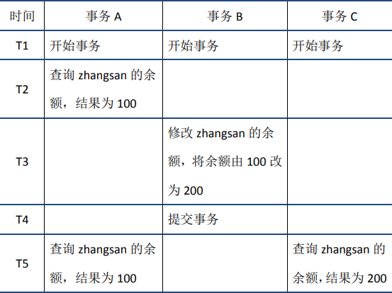
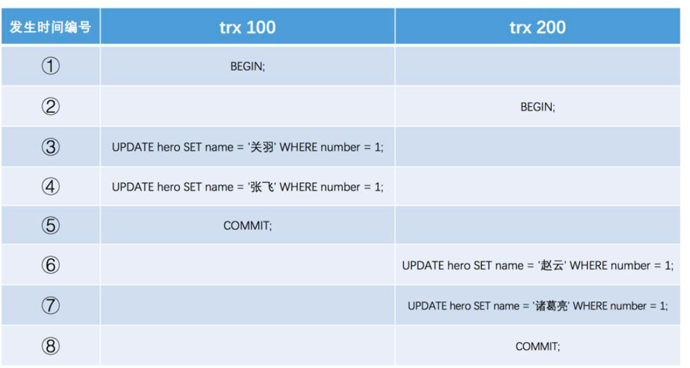
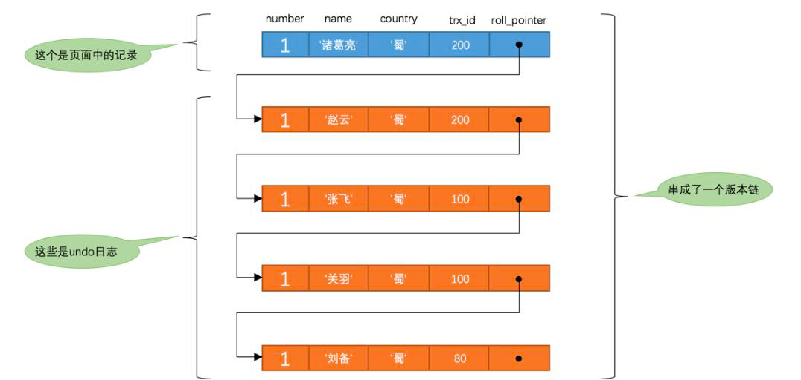
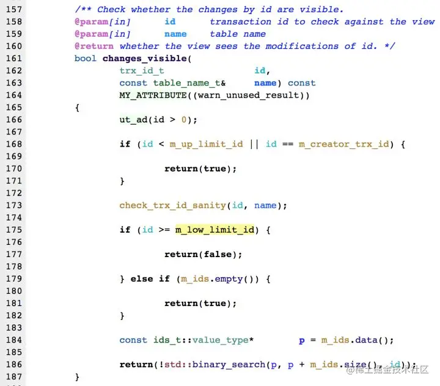

    这是“mysql”系列的第六篇文章，主要介绍的是MVCC。

# 一、mysql

<code>MySQL</code> 是一种广泛使用的开源关系型数据库管理系统（RDBMS--Relational Database Management System）

<!-- more -->

# 二、MVCC
在上一篇的“事务”文章中，了解了**四种隔离级别**还有一个共同特点，就是幻读、不可重复读、脏读等问题都是由于一个事务在读数据的过程中，受另外一个写数据的事务影响而破坏了隔离性。针对这种“`一个事务读+另一个事务写`”的隔离问题，产生了“`MVCC-多版本并发控制（Multi-version concurrency control）`”的无锁优化方案。
- `MVCC`是一种读取优化策略，它的“无锁”特指读取时不需要加锁。
- `MVCC`的基本思路是对数据库的任何修改都不会直接覆盖之前的数据，而是产生一个新版本与老版本共存，以此达到读取时可以完全不加锁的目的。

下面的例子很好的体现了`MVCC`的特点：在同一时刻，不同的事务读取到的数据可能是不同的(即多版本)——在`T5`时刻，**事务A**和**事务C**可以读取到不同版本的数据。

`MVCC`最大的优点是读不加锁，因此读写不冲突，并发性能好。

## 2.1、MVCC实现原理
它的实现原理主要是`基于undo log的版本链` ，`Read View` 来实现的

InnoDB实现MVCC，多个版本的数据可以共存，主要基于以下技术及数据结构：
1. **隐藏列**：InnoDB中每行数据都有隐藏列，隐藏列中包含了本行数据的事务id、指向undo log的指针等。
   - 隐藏的ID
   - 6字节的事务ID（DB_TRX_ID ）
   - 7字节的回滚指针（DB_ROLL_PTR）：指向`undo segment`中的`undo log`
2. **基于undo log的版本链**：前面说到每行数据的隐藏列中包含了指向`undo log`的指针，而每条`undo log`也会指向更早版本的`undo log`，从而形成一条版本链。
3. **ReadView 视图**：通过隐藏列和版本链，MySQL可以将数据恢复到指定版本；但是具体要恢复到哪个版本，则需要根据ReadView来确定。所谓ReadView，是指事务（记做事务A）在某一时刻给整个事务系统（trx_sys）打快照，之后再进行读操作时，会将读取到的数据中的事务id与trx_sys快照比较，从而判断数据对该ReadView是否可见，即对事务A是否可见。

`trx_sys`中的主要内容，以及**判断可见性**的方法如下：
- **low_limit_id**：表示生成ReadView时系统中应该分配给下一个事务的id。如果数据的事务id大于等于low_limit_id，则对该ReadView不可见。
- **up_limit_id**：表示生成ReadView时当前系统中活跃的读写事务中最小的事务id。如果数据的事务id小于up_limit_id，则对该ReadView可见。
- **rw_trx_ids**：表示生成ReadView时当前系统中活跃的读写事务的事务id列表。如果数据的事务id在low_limit_id和up_limit_id之间，则需要判断事务id是否在rw_trx_ids中：如果在，说明生成ReadView时事务仍在活跃中，因此数据对ReadView不可见；如果不在，说明生成ReadView时事务已经提交了，因此数据对ReadView可见。

### 2.1.1、基于undo log的版本链

#### 2.1.1.1、隐藏列
我们数据库中的每行数据，除了我们肉眼看见的数据，还有几个隐藏字段。分别是`DB_TRX_ID`、`DB_ROLL_PTR`、`db_row_id`。

| 字段                   | 说明                                                         |
|----------------------|------------------------------------------------------------|
| `DB_TRX_ID`          | `6byte`，最近修改(修改/插入)事务ID：记录创建这条记录/最后一次修改该记录的事务ID。             |
| `DB_ROLL_PTR`（版本链关键） | `7byte`，回滚指针，指向这条记录的上一个版本（指向`undo segment`中的`undo log`）              |
| `db_row_id`          | `6byte`，隐含的自增ID（隐藏主键），如果数据表没有主键，InnoDB会自动以db_row_id产生一个聚簇索引。 |

实际还有一个删除`flag`隐藏字段, 记录被更新或删除并不代表真的删除，而是删除`flag`变了。

#### 2.1.1.2、Undo Log
示例，2个事务更新同一条数据：

每次对数据库记录进行改动，都会记录一条`undo`日志，每条`undo`日志也都有一个`roll_pointer`属性（`INSERT`操作对应的`undo`日志没有该属性，因为该记录并没有更早的版本），可以将这些`undo`日志都连起来，串成一个链表，所以现在的情况就像下图一样：

我们把这个链表称之为【`版本链`】

### 2.1.2、Readview 读视图
`Read View`主要是用来做**可见性判断**的, 即当我们某个事务执行快照读的时候，对该记录创建一个`Read View`读视图，把它比作条件用来判断当前事务能够看到哪个版本的数据，既可能是当前最新的数据，也有可能是该行记录的`undo log`里面的某个版本的数据。

#### 2.1.2.1、当前读
它读取的数据库记录，都是当前最新的版本，会对当前读取的数据进行加锁，防止其他事务修改数据。是**悲观锁**的一种操作。

如下操作都是当前读：
- select lock in share mode (共享锁)
- select for update (排他锁)
- update (排他锁)
- insert (排他锁)
- delete (排他锁)
- 串行化事务隔离级别

#### 2.1.2.2、快照读
快照读的实现是基于多版本并发控制，即MVCC，既然是多版本，那么快照读读到的数据不一定是当前最新的数据，有可能是之前历史版本的数据。

如下操作是快照读：
- 不加锁的select操作（注：事务级别不是串行化）

#### 2.1.2.3、Readview 生成
事务进行**快照读操作**的时候生产的读视图(`Read View`)，在该事务执行的快照读的那一刻，会生成数据库系统当前的一个快照。

#### 2.1.2.4、ReadView几个属性
- <code>trx_ids</code>: 当前系统活跃(未提交)事务版本号集合。
- <code>low_limit_id</code>: 创建当前read view 时“当前系统**最大事务版本号**+1”。
- <code>up_limit_id</code>: 创建当前read view 时“系统正处于活跃事务**最小版本号**”
- <code>creator_trx_id</code>: 创建当前read view的事务版本号；

#### 2.1.2.5、ReadView的可见性判断

- <code>**db_trx_id < up_limit_id**</code> || <code>db_trx_id</code> == <code>**creator_trx_id**</code>（显示）
  - 如果数据事务ID小于read vie
  - w中的最小活跃事务ID，则可以肯定该数据是在当前事务启之前就已经存在了的,所以可以显示。
  - 或者数据的事务ID等于creator_trx_id ，那么说明这个数据就是当前事务自己生成的，自己生成的数据自己当然能看见，所以这种情况下此数据也是可以显示的。
- **db_trx_id >= low_limit_id**（不显示）
  - 如果数据事务ID大于read view 中的当前系统的最大事务ID，则说明该数据是在当前read view 创建之后才产生的，所以数据不显示。如果小于则进入下一个判断
- **db_trx_id**是否在活跃事务（trx_ids）中
  - 不存在：则说明read view产生的时候事务已经commit了，这种情况数据则可以显示。
  - 已存在：则代表我Read View生成时刻，你这个事务还在活跃，还没有Commit，你修改的数据，我当前事务也是看不见的。

# 六、MVCC和事务隔离级别
<code>Read View</code>用于支持**RC（Read Committed，读提交）**和**RR（Repeatable Read，可重复读）**隔离级别的实现。

## 6.1、RR、RC生成时机
- <code>**RC**</code>隔离级别下，是每个**快照读**都会生成并获取最新的Read View；
- <code>**RR**</code>隔离级别下，则是**同一个事务中**的**第一个快照读**才会创建Read View, 之后的快照读获取的都是同一个Read View，之后的查询就不会重复生成了，所以一个事务的**查询结果每次都是一样**的。

## 6.2、解决幻读问题
- **快照读**：通过MVCC来进行控制的，不用加锁。按照MVCC中规定的“语法”进行增删改查等操作，以避免幻读。
- **当前读**：通过next-key锁（行锁+gap锁）来解决问题的。

> 参考文章：
> 
> [全网最全一篇数据库MVCC详解，不全你打我](https://www.cnblogs.com/kismetv/p/10331633.html)
> [深入学习MySQL事务：ACID特性的实现原理](https://juejin.cn/post/6871046354018238472)
> [【MySQL】MVCC原理分析 + 源码解读 -- 必须说透](https://cloud.tencent.com/developer/article/2184720)