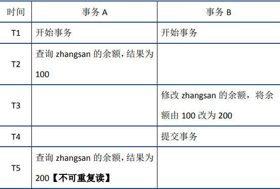
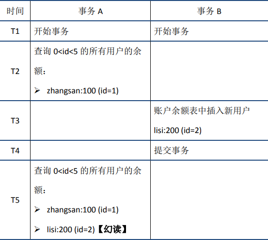
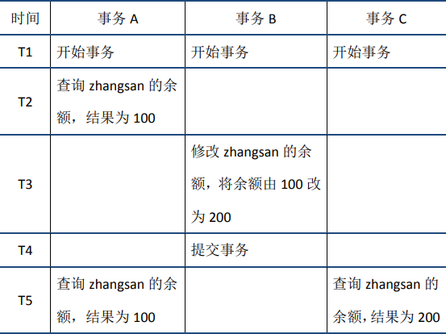
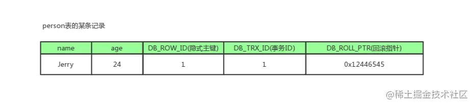
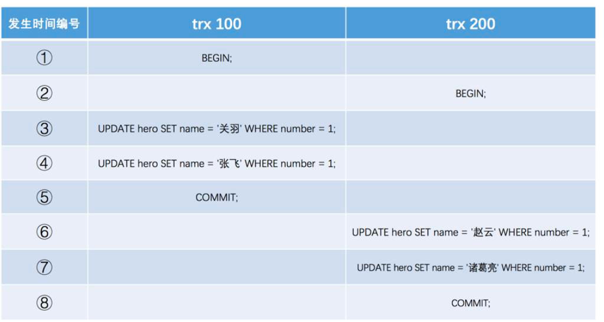
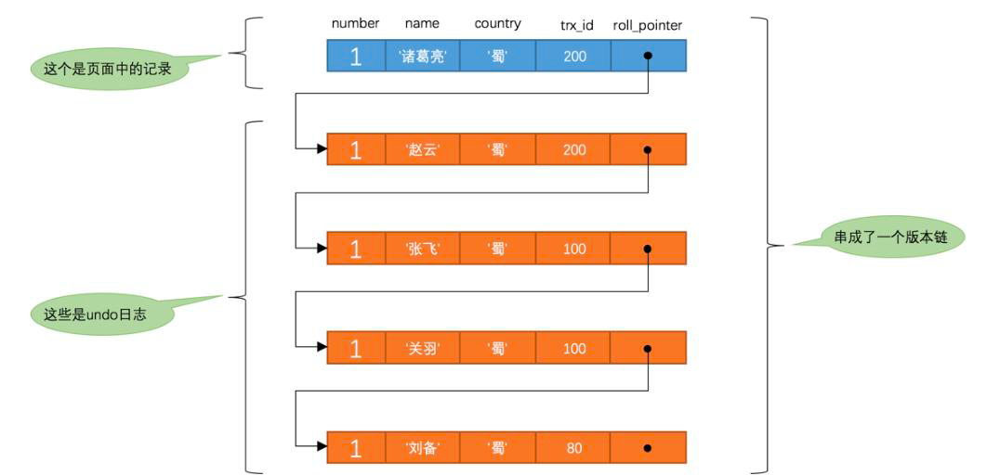
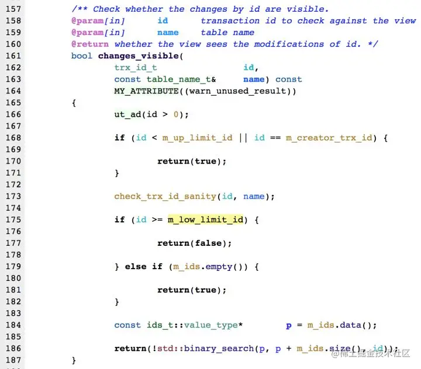

    这是“mysql”系列的第七篇文章，主要介绍的是事务和MVCC。

# 一、mysql

<code>MySQL</code> 是一种广泛使用的开源关系型数据库管理系统（RDBMS--Relational Database Management System）

<!-- more -->

# 二、事务
在 MySQL 中，事务是一组不可分割的 SQL 语句序列，这些语句要么全部成功执行，要么全部不执行。事务主要用于确保数据库操作的原子性、一致性、隔离性和持久性（ACID 特性）

## 2.1、事务的ACID 特性
- **原子性（Atomicity）**：事务是一个不可分割的工作单位，事务中的操作要么全部成功，要么全部失败回滚。
  - undo log来保证事务的原子性
- **一致性（Consistency）**：事务执行前后，数据库的状态应保持一致。例如，在转账操作中，无论转账是否成功，账户的总金额应该保持不变。
  - 一致性的保障依赖于多个方面：
    - 原子性和持久性：原子性确保事务中的操作要么全部成功，要么全部失败，持久性保证事务提交后数据永久保存，这两个特性为一致性提供了基础。
- **隔离性（Isolation）**：多个事务并发执行时，一个事务的执行不应该影响其他事务的执行，每个事务都感觉自己是在独立执行。
  - MVCC+锁
    - (一个事务)写操作对(另一个事务)写操作的影响：锁机制保证隔离性
    - (一个事务)写操作对(另一个事务)读操作的影响：MVCC保证隔离性
- **持久性（Durability）**：一旦事务提交成功，它对数据库所做的更改将永久保存，即使数据库发生故障也不会丢失。
  - redo log用来保证事务的持久性


## 2.2、事务使用

```dtd
-- 开启事务
START TRANSACTION;
-- 执行 SQL 语句
UPDATE accounts SET balance = balance - 100 WHERE id = 1;
-- 提交事务
COMMIT;
```


# 三、并发带来的问题
首先来看并发情况下，读操作可能存在的三类问题：
- 脏读
- 不可重复读
- 幻读

## 3.1、脏读
脏读：当前事务(A)中可以读到其他事务(B)未提交的数据（脏数据），这种现象是脏读。举例如下（以账户余额表为例）：


## 3.2、不可重复读
不可重复读：在事务A中先后两次读取同一个数据，两次读取的结果不一样，这种现象称为不可重复读。脏读与不可重复读的区别在于：前者读到的是其他事务未提交的数据，后者读到的是其他事务已提交的数据。举例如下：

- <font color=red>**同一条数据**</font>：两次读取结果不一致。

## 3.3、幻读
幻读：在事务A中按照某个条件先后两次查询数据库，两次查询结果的条数不同，这种现象称为幻读。不可重复读与幻读的区别可以通俗的理解为：前者是数据变了，后者是数据的行数变了。举例如下：

- <font color=red>**一个范围的数据**</font>：两次读取结果不一致。
  - 通过next-key lock解决幻读


# 四、事务的隔离级别
为了解决并发带来的问题，定义了四种隔离级别来解决。隔离级别与读问题的关系如下：

- 需要注意的是，在SQL标准中，RR是无法避免幻读问题的；但是InnoDB实现的RR，在只读事务中可以避免幻读问题。


# 五、MVCC
<code>RR</code>解决脏读、不可重复读、幻读等问题，使用的是MVCC：MVCC全称Multi-Version Concurrency Control，即多版本的并发控制协议。下面的例子很好的体现了MVCC的特点：在同一时刻，不同的事务读取到的数据可能是不同的(即多版本)——在T5时刻，事务A和事务C可以读取到不同版本的数据。

MVCC最大的优点是读不加锁，因此读写不冲突，并发性能好。InnoDB实现MVCC，多个版本的数据可以共存，主要基于以下技术及数据结构：
1. **隐藏列**：InnoDB中每行数据都有隐藏列，隐藏列中包含了本行数据的事务id、指向undo log的指针等。
   1. 隐藏的ID
   2. 6字节的事务ID（DB_TRX_ID ）
   3. 7字节的回滚指针（DB_ROLL_PTR）：指向undo segment中的undo log
2. **基于undo log的版本链**：前面说到每行数据的隐藏列中包含了指向undo log的指针，而每条undo log也会指向更早版本的undo log，从而形成一条版本链。
3. **ReadView 视图**：通过隐藏列和版本链，MySQL可以将数据恢复到指定版本；但是具体要恢复到哪个版本，则需要根据ReadView来确定。所谓ReadView，是指事务（记做事务A）在某一时刻给整个事务系统（trx_sys）打快照，之后再进行读操作时，会将读取到的数据中的事务id与trx_sys快照比较，从而判断数据对该ReadView是否可见，即对事务A是否可见。

trx_sys中的主要内容，以及<font color=red>**判断可见性**</font>的方法如下：
- **low_limit_id**：表示生成ReadView时系统中应该分配给下一个事务的id。如果数据的事务id大于等于low_limit_id，则对该ReadView不可见。
- **up_limit_id**：表示生成ReadView时当前系统中活跃的读写事务中最小的事务id。如果数据的事务id小于up_limit_id，则对该ReadView可见。
- **rw_trx_ids**：表示生成ReadView时当前系统中活跃的读写事务的事务id列表。如果数据的事务id在low_limit_id和up_limit_id之间，则需要判断事务id是否在rw_trx_ids中：如果在，说明生成ReadView时事务仍在活跃中，因此数据对ReadView不可见；如果不在，说明生成ReadView时事务已经提交了，因此数据对ReadView可见。

## 5.1、版本链

### 5.1.1、隐藏列
我们数据库中的每行数据，除了我们肉眼看见的数据，还有几个隐藏字段，得开天眼才能看到。分别是DB_TRX_ID、DB_ROLL_PTR、db_row_id。
- DB_TRX_ID
  6byte，最近修改(修改/插入)事务ID：记录创建这条记录/最后一次修改该记录的事务ID。
- DB_ROLL_PTR（版本链关键）
  7byte，回滚指针，指向这条记录的上一个版本（存储于rollback segment里）
- db_row_id
  6byte，隐含的自增ID（隐藏主键），如果数据表没有主键，InnoDB会自动以db_row_id产生一个聚簇索引。

实际还有一个删除flag隐藏字段, 记录被更新或删除并不代表真的删除，而是删除flag变了。


2个事务更新同一条数据

每次对数据库记录进行改动，都会记录一条undo日志，每条undo日志也都有一个roll_pointer属性（INSERT操作对应的undo日志没有该属性，因为该记录并没有更早的版本），可以将这些undo日志都连起来，串成一个链表，所以现在的情况就像下图一样：

我们把这个链表称之为【版本链】


## 5.2、Readview 读视图
Read View主要是用来做可见性判断的, 即当我们某个事务执行快照读的时候，对该记录创建一个Read View读视图，把它比作条件用来判断当前事务能够看到哪个版本的数据，既可能是当前最新的数据，也有可能是该行记录的undo log里面的某个版本的数据。

### 5.2.1、当前读、快照读都是什么鬼
它读取的数据库记录，都是当前最新的版本，会对当前读取的数据进行加锁，防止其他事务修改数据。是悲观锁的一种操作。

如下操作都是当前读：
- select lock in share mode (共享锁)
- select for update (排他锁)
- update (排他锁)
- insert (排他锁)
- delete (排他锁)
- 串行化事务隔离级别

### 5.2.2、快照读
快照读的实现是基于多版本并发控制，即MVCC，既然是多版本，那么快照读读到的数据不一定是当前最新的数据，有可能是之前历史版本的数据。

如下操作是快照读：
- 不加锁的select操作（注：事务级别不是串行化）


### 5.2.3、Readview 生成
事务进行<font color=red>**快照读操作**</font>的时候生产的读视图(Read View)，在该事务执行的快照读的那一刻，会生成数据库系统当前的一个快照。


### 5.2.4、ReadView几个属性
- <code>trx_ids</code>: 当前系统活跃(未提交)事务版本号集合。
- <code>low_limit_id</code>: 创建当前read view 时“当前系统<font color=red>**最大事务版本号**</font>+1”。
- <code>up_limit_id</code>: 创建当前read view 时“系统正处于活跃事务<font color=red>**最小版本号**</font>”
- <code>creator_trx_id</code>: 创建当前read view的事务版本号；

### 5.2.5、ReadView的可见性判断

- <code>**db_trx_id < up_limit_id**</code> || <code>db_trx_id</code> == <code>**creator_trx_id**</code>（显示）
  - 如果数据事务ID小于read view中的最小活跃事务ID，则可以肯定该数据是在当前事务启之前就已经存在了的,所以可以显示。
  - 或者数据的事务ID等于creator_trx_id ，那么说明这个数据就是当前事务自己生成的，自己生成的数据自己当然能看见，所以这种情况下此数据也是可以显示的。
- <font color=red>**db_trx_id >= low_limit_id**</font>（不显示）
  - 如果数据事务ID大于read view 中的当前系统的最大事务ID，则说明该数据是在当前read view 创建之后才产生的，所以数据不显示。如果小于则进入下一个判断
- <font color=red>**db_trx_id**</font>是否在活跃事务（trx_ids）中
  - 不存在：则说明read view产生的时候事务已经commit了，这种情况数据则可以显示。
  - 已存在：则代表我Read View生成时刻，你这个事务还在活跃，还没有Commit，你修改的数据，我当前事务也是看不见的。

# 六、MVCC和事务隔离级别
<code>Read View</code>用于支持<font color=red>**RC（Read Committed，读提交）**</font>和<font color=red>**RR（Repeatable Read，可重复读）**</font>隔离级别的实现。

## 6.1、RR、RC生成时机
- <code>**RC**</code>隔离级别下，是每个**快照读**都会生成并获取最新的Read View；
- <code>**RR**</code>隔离级别下，则是**同一个事务中**的**第一个快照读**才会创建Read View, 之后的快照读获取的都是同一个Read View，之后的查询就不会重复生成了，所以一个事务的**查询结果每次都是一样**的。

## 6.2、解决幻读问题
- **快照读**：通过MVCC来进行控制的，不用加锁。按照MVCC中规定的“语法”进行增删改查等操作，以避免幻读。
- **当前读**：通过next-key锁（行锁+gap锁）来解决问题的。


参考文章：
[全网最全一篇数据库MVCC详解，不全你打我](https://www.cnblogs.com/kismetv/p/10331633.html)
[深入学习MySQL事务：ACID特性的实现原理](https://juejin.cn/post/6871046354018238472)
[【MySQL】MVCC原理分析 + 源码解读 -- 必须说透](https://cloud.tencent.com/developer/article/2184720)