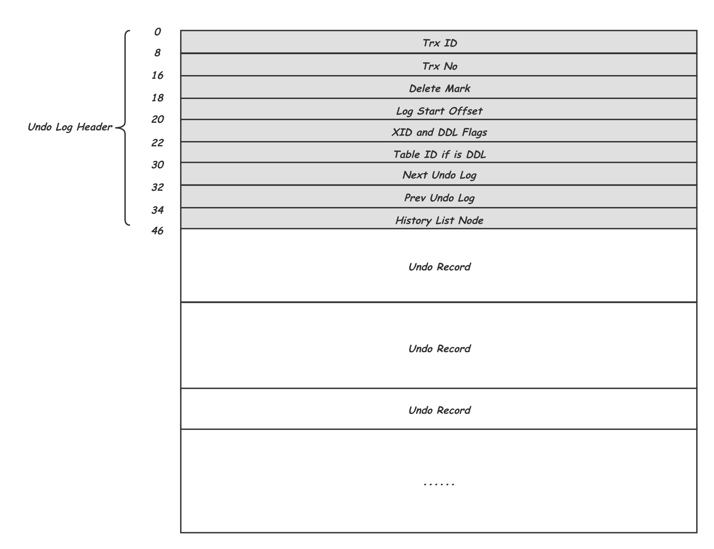
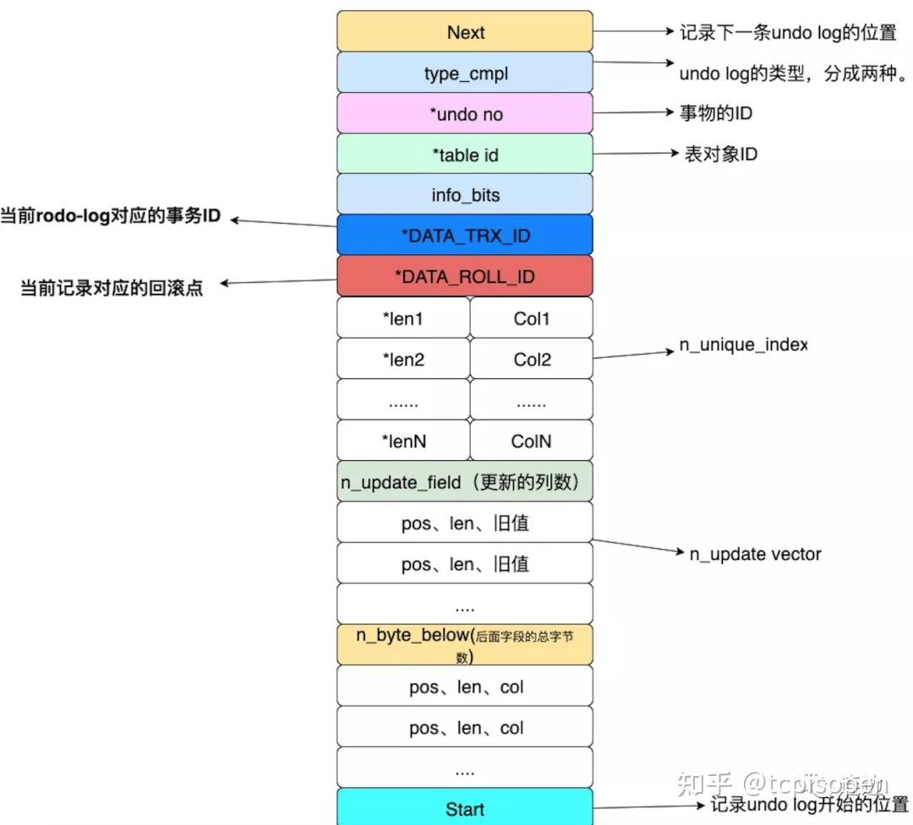

    这是“mysql”系列的第九篇文章，主要介绍的是undo日志。

# 一. mysql

`MySQL` 是一种广泛使用的开源关系型数据库管理系统（`RDBMS--Relational Database Management System`）

<!-- more -->

# 二. 日志类别
日志文件记录了影响MySQL数据库的各种类型活动。常见的日志文件有：
- 错误日志（`error log`）
- 二进制日志（`binlog`）
- 慢查询日志（`slow query log`）
- 查询日志（`log`）

# 三. undo log（回滚日志）
Undo log是Innodb中用于实现**事务原子性（Atomicity）**和**多版本并发控制（MVCC）**的核心机制。

## 3.1. 作用
1. **事务原子性**： `undo log`是为了实现事务的原子性而出现的产物，事务处理的过程中，如果出现了错误或者用户执行`ROLLBACK`语句，`MySQL`可以利用`undo log`中的备份将数据恢复到事务开始之前的状态。
2. **多个行版本控制（MVCC）- 隔离性**： `undo log`在`MySQL InnoDB`储存引擎中用来实现多版本并发控制，事务未提交之前，当读取的某一行被其他事务锁定时，它可以从`undo log`中分析出该行记录以前的数据是什么，从而提供该行版本信息，让用户实现非锁定一致性读取。

## 3.2. undo log文件
`undo Log`是**逻辑日志**，记录的是**修改前的旧值**，而非物理存储的直接操作。具体类型如下

| 操作类型   | undo log内容              |
|--------|-------------------------|
| INSERT | 记录插入的主键值（用于回滚时删除记录）     |
| DELETE | 记录被删除记录的完整内容（用于回滚时重新插入） |
| UPDATE | 记录被更新列的旧值（用于回滚时恢复旧值）    |

## 3.3. undo Log的存储

存储位置
- 系统表空间（ibdata1）或 独立的Undo表空间（通过innodb_undo_tablespaces配置）。
- 回滚段（Rollback segment）：每个事务分配一个回滚段，用于存储其 Undo Log。

## 3.2. undo log的生成
在事务中，进行以下四种操作，都会创建undo log：
- `insert`用户定义的表
- `update`或者`delete`用户定义的表
- `insert`用户定义的临时表
- `update`或者`delete`用户定义的临时表

### 3.2.1. 生成时机
用undo log实现原子性和持久化的事务的简化过程：

假设有A、B两个数据，值分别为1,2。
- A. 事务开始
- B. 记录A=1到undo log中
- C. 修改A=3
- D. 记录B=2到undo log中
- E. 修改B=4
- F. 将undo log写到磁盘 -------undo log持久化
- G. 将数据写到磁盘 -------数据持久化
- H. 事务提交 -------提交事务

## 3.3. undo log的组织方式
这一小节我们将从几个层面来进行介绍：首先是在不考虑物理存储的情况下的逻辑组织方式； 之后，物理组织方式介绍如何将其存储到到实际16KB物理块中；然后文件组织方式介绍整体的文件结构；最后再介绍其在内存中的组织方式。

### 3.3.1. 逻辑组织方式 - Undo Log
每个事务其实会修改一组的Record，对应的也就会产生一组Undo Record，这些Undo Record首尾相连就组成了这个事务的Undo Log。除了一个个的Undo Record之外，还在开头增加了一个Undo Log Header来记录一些必要的控制信息，因此，一个Undo Log的结构如下所示：

**Undo Log Header**中记录了产生这个Undo Log的事务的Trx ID；Trx No是事务的提交顺序，也会用这个来判断是否能Purge，这个在后面会详细介绍；Delete Mark标明该Undo Log中有没有TRX_UNDO_DEL_MARK_REC类型的Undo Record，避免Purge时不必要的扫描；Log Start Offset中记录Undo Log Header的结束位置，方便之后Header中增加内容时的兼容；之后是一些Flag信息；Next Undo Log及Prev Undo Log标记前后两个Undo Log，这个会在接下来介绍；最后通过History List Node将自己挂载到为Purge准备的History List中。

**索引中的同一个Record被不同事务修改，会产生不同的历史版本，这些历史版本又通过Rollptr穿成一个链表，供MVCC使用**。如下图所示：

示例中有三个事务操作了表t上，主键id是1的记录，首先事务I插入了这条记录并且设置filed a的值是A，之后事务J和事务K分别将这条id为1的记录中的filed a的值修改为了B和C。I，J，K三个事务分别有自己的逻辑上连续的三条Undo Log，每条Undo Log有自己的Undo Log Header。从索引中的这条Record沿着Rollptr可以依次找到这三个事务Undo Log中关于这条记录的历史版本。同时可以看出，Insert类型Undo Record中只记录了对应的主键值：id=1，而Update类型的Undo Record中还记录了对应的历史版本的生成事务Trx_id，以及被修改的field a的历史值。

每当InnoDB中需要修改某个Record时，都会将其历史版本写入一个Undo Log中，这种Undo Record是Update类型。当插入新的Record时，还没有一个历史版本，但为了方便事务回滚时做逆向（Delete）操作，这里还是会写入一个Insert类型的Undo Record。

#### 3.3.1.1. undo log record 的类型
为了更好的处理回滚，undo log和之前说的redo log记录物理日志不一样，它是逻辑日志，可以认为当delete一条记录时，undo log中会记录一条对应的insert记录，反之亦然，当update一条记录时，它记录一条对应相反的update记录。 对应着undo log的两种类型，分别是 insert undo log和update undo log。

##### 1. insert undo log长啥样
对于 insert 类型的sql，会在undo log中记录下方才你insert 进来的数据的ID，根据ID完成精准的删除。

##### 2. update undo log长啥样
一条update sql对应undolog长如下这样：

### 3.3.2. 物理组织格式【Undo Segment】
上面描述了一个Undo Log的结构，一个事务会产生多大的Undo Log本身是不可控的，而最终写入磁盘却是按照固定的块大小为单位的，InnoDB中默认是16KB，那么如何用固定的块大小承载不定长的Undo Log，以实现高效的空间分配、复用，避免空间浪费。InnoDB的基本思路是让多个较小的Undo Log紧凑存在一个Undo Page中，而对较大的Undo Log则随着不断的写入，按需分配足够多的Undo Page分散承载。下面我们就看看这部分的物理存储方式：

如上所示，是一个Undo Segment的示意图，每个写事务开始写操作之前都需要持有一个Undo Segment，一个Undo Segment中的所有磁盘空间的分配和释放，也就是16KB Page的申请和释放，都是由一个FSP的Segment管理的，这个跟索引中的Leaf Node Segment和Non-Leaf Node Segment的管理方式是一致的，这部分之后会有单独的文章来进行介绍。
- undo log 是采用 segment（段）的方式来记录的，每个 undo 操作在记录的时候占用一个 undo log segment（undo 日志段），undo log segment 包含在 rollback segment（回滚段）中。事务开始时，需要为其分配一个 rollback segment。每个 rollback segment 有 1024 个 undo log segment，这有助于管理多个并发事务的回滚需求。

# 七、各日志生成及写入流程总结


participant 客户端
participant mysqlserver
participant binlogbuffer
participant binlog
participant innodb
participant redologbuffer
participant redolog
participant undologsegment

客户端->mysqlserver: START TRANSACTION; \ninsert ... \ncommit;
activate mysqlserver #FFBBBB

==sql解析==
mysqlserver->mysqlserver: sql解析

==执行insert==
mysqlserver->innodb: ha_write_row，innodb执行插入
activate innodb #FFBBBB
innodb->innodb: row_ins，行插入操作
activate innodb #FFBBBB
innodb->innodb: row_ins_index_entry，向索引中插入数据
activate innodb #FFBBBB 
innodb->innodb: mtr.start()，开启mini事务
innodb->undologsegment: btr_cur_ins_lock_and_undo，写入undo日志
activate undologsegment #FFBBBB
deactivate undologsegment
innodb->innodb: page_cur_tuple_insert，在Page游标的下一个位置点Insert数据
innodb->innodb: mtr.commit()，提交mini事务
activate innodb #FFBBBB
innodb->innodb: 将修改的脏页加入flush list中
innodb->redologbuffer: 将redo日志一起拷贝到log_sys模块的公共日志buffer中。
activate redologbuffer #FFBBBB
deactivate redologbuffer
deactivate innodb
deactivate innodb
deactivate innodb
innodb-->mysqlserver:
deactivate innodb

==事务提交==
mysqlserver->mysqlserver:trans_commit，事务提交
activate mysqlserver #FFBBBB
==事务提交-prepare阶段==
mysqlserver->mysqlserver: **MYSQL_BIN_LOG::prepare**
activate mysqlserver #FFBBBB
mysqlserver->mysqlserver: binlog_prepare
mysqlserver->innodb: innobase_xa_prepare
activate innodb #FFBBBB
innodb->innodb: undo 段的状态从 TRX_UNDO_ACTIVE 修改为 TRX_UNDO_PREPARED
innodb->innodb: 事务对象状态从 TRX_STATE_ACTIVE 修改为 TRX_STATE_PREPARED。
innodb->innodb: 调用 trx_flush_logs()，处理 redo 日志刷盘的相关逻辑。
innodb->redologbuffer: 将redo日志一起拷贝到log_sys模块的公共日志buffer中。
activate redologbuffer #FFBBBB
deactivate redologbuffer
innodb-->mysqlserver:
deactivate innodb
deactivate mysqlserver
==事务提交-commit阶段==
mysqlserver->mysqlserver: **MYSQL_BIN_LOG::ordered_commit**
activate mysqlserver #FFBBBB
mysqlserver->mysqlserver: 1. flush 子阶段
activate mysqlserver #FFBBBB
mysqlserver->redolog: 根据 innodb_flush_log_at_trx_commit 参数进行 redo log 的刷盘操作
activate redolog #FFBBBB
deactivate redolog
mysqlserver->binlogbuffer: 将 trx_cache 中的数据 flush 到 binlog cache 中
activate binlogbuffer #FFBBBB
deactivate binlogbuffer
deactivate mysqlserver
mysqlserver->mysqlserver: 2. sync 子阶段
activate mysqlserver #FFBBBB
mysqlserver->binlog: 根据 sync_binlog 的参数设置进行刷盘前的等待并调用 fsync() 进行刷盘
activate binlog #FFBBBB
deactivate binlog
deactivate mysqlserver
mysqlserver->mysqlserver: 3. commit 子阶段
activate mysqlserver #FFBBBB

deactivate mysqlserver



**各文件写入顺序**：
- undo log 写入
- 数据写入
- redolog写入
  - redo log buffer
  - redo log 刷盘
- binlog 写入
  - 写入binlog buffer
  - binlog 刷盘

> 参考文章： 
> [MySQL Binlog 源码入门](http://mysql.taobao.org/monthly/2023/01/04/) 
> [MySQL · 引擎特性 · InnoDB 事务子系统介绍](http://mysql.taobao.org/monthly/2015/12/01/) 
> [07 期 | 二阶段提交 (1) prepare 阶段](https://opensource.actionsky.com/07-%e6%9c%9f-%e4%ba%8c%e9%98%b6%e6%ae%b5%e6%8f%90%e4%ba%a4-1-prepare-%e9%98%b6%e6%ae%b5/)
> [MySQL 的 binlog 的三种格式](https://www.51cto.com/article/703972.html)