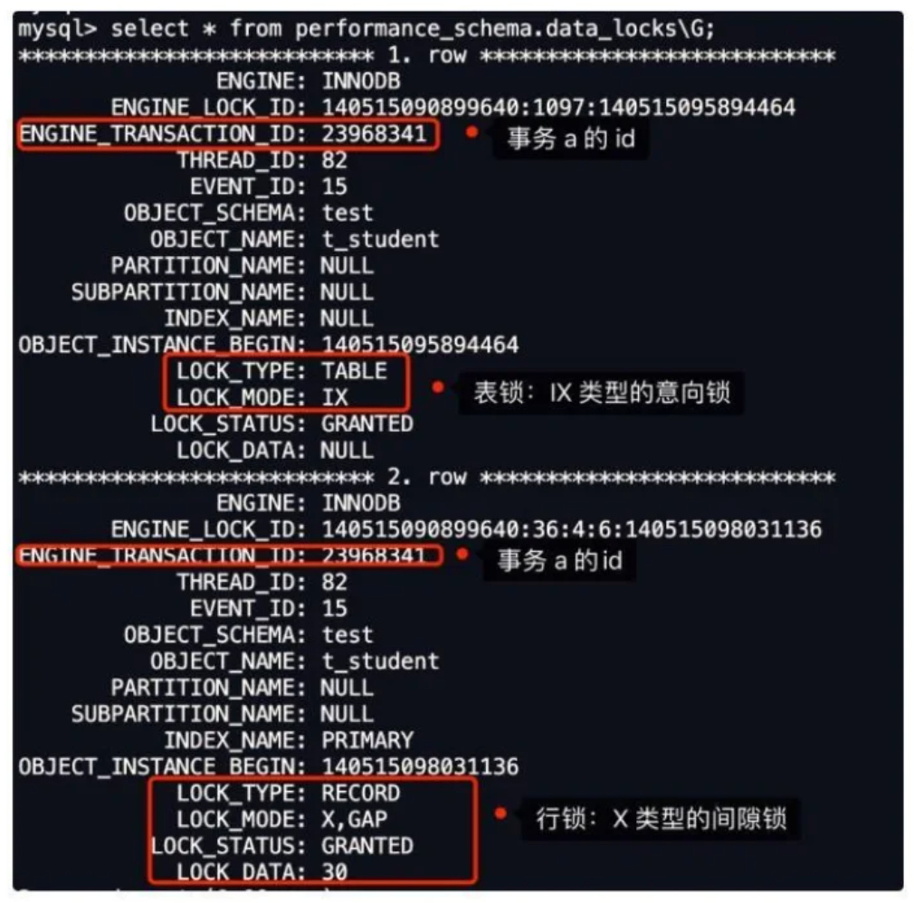
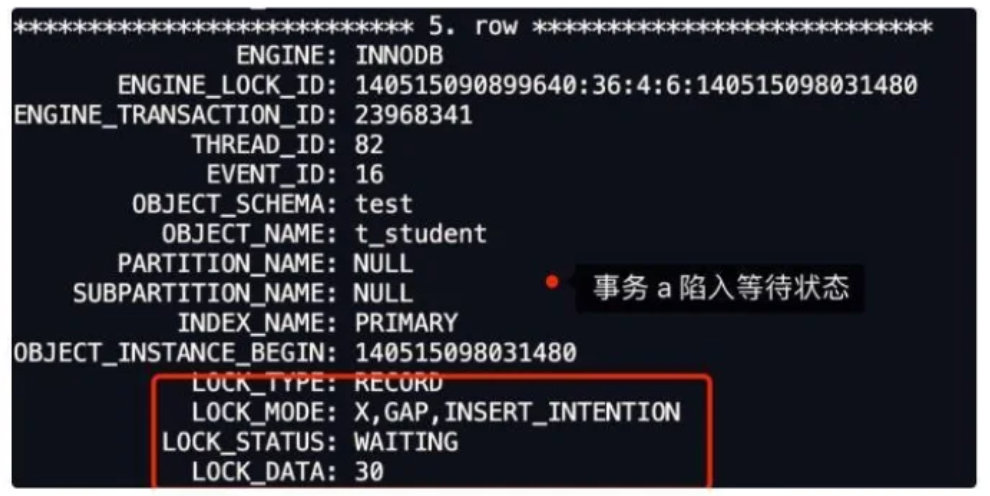
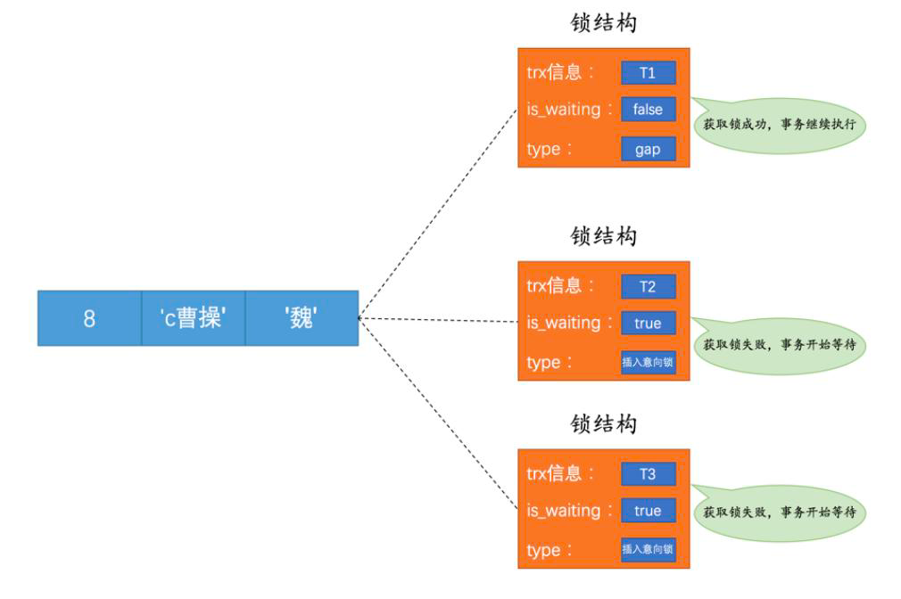
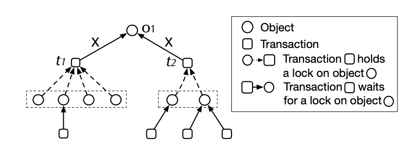

    这是“mysql”系列的第九篇文章，主要介绍的是死锁。

<style>
.my-code {
   color: green;
}
.orange {
   color: rgb(255, 53, 2)
}
.red {
   color: red
}
</style>

# 一、mysql

<code>MySQL</code> 是一种广泛使用的开源关系型数据库管理系统（RDBMS--Relational Database Management System）

<!-- more -->

本章主要围绕InnoDB存储引擎死锁相关的一些概念、产生死锁的原因、死锁场景以及死锁的处理策略。

# 二、死锁


## 2.1、死锁的定义
死锁是指<code class='orange'>两个或多个事务</code>在同一资源上相互占用，并请求<code class='orange'>锁定</code>对方占用的资源（我等待你的资源，你却等待我的资源，我们都相互等待，谁也不释放自己占有的资源），从而导致恶性循环的现象：
- 当多个事务试图以不同顺序锁定资源时，就可能会产生死锁
- 多个事务，同时锁定同一个资源时，也会产生死锁


## 2.2、死锁的危害
若死锁太频繁，那可能会带来许多的问题：
1. 使进程得不到正确的结果：处于死锁状态的进程得不到所需的资源，不能向前推进，故得不到结果
2. 使资源的利用率降低：处于死锁状态的进程不释放已占有的资源，以至于这些资源不能被其他进程利用，故系统资源利用率降低
3. 导致产生新的死锁：其它进程因请求不到死锁进程已占用的资源而无法向前推进，所以也会发生死锁

## 2.3、死锁产生的原因
死锁有四个必要的条件：
- 多个并发事务（2个或者以上）
- 保持着排他资源又提出新资源请求：一个进程因请求资源而阻塞时，对已获得的资源保持不放
- 不可剥夺：资源不能被抢占，即资源只能在进程完成任务后自动释放
- 环路：有一组等待进程｛P0、P1、P2｝，P0等待的资源被P1所占有，P1等待的资源被P2所占有，而P2等待的又被P0所占有，形成了一个等待循环

# 三、死锁示例【插入意向锁导致的死锁】
先创建一张t_student表，假设除了ID字段，其他字段都是普通字段
```sql
CREATE TABLE `t_student` (
    `id` int not null,
    `no` varchar(255) DEFAULT null,
    `name` varchar(255) DEFAULT null,
    `age` int DEFAULT null,
    `score` int DEFAULT null,
    PRIMARY KEY(`id`)
)
```


## 3.1、开始实验
- MySQL 8.0.26
- RR隔离级别

启动两个事务，按照图下的顺序执行：

- 前提：<code class='orange'>未打开死锁检测</code>。
- <code class='orange'>25、26</code>两条数据都不存在。

## 3.2、为什么发送死锁
可以通过<code class='orange'>select * from performance_schema.data_locks\G;</code>语句查看加的什么锁：

### Time1阶段

从上图可以看到，共加了2个锁：
- 表锁：X类型的意向锁
- 行锁：X类型的间隙锁

这里重点关注行锁，图中LOCK_TYPE中的RECORD表示行级锁
- <code class='orange'>LOCK_MODE</code> 为 <code class='orange'>X</code>，说明是 next-key 锁
- <code class='orange'>LOCK_MODE</code> 为 <code class='orange'>X,REC_NOT_GAP</code>，说明是记录锁
- <code class='orange'>LOCK_MODE</code> 为 <code class='orange'>X,GAP</code>，说明是间隙锁

此时事务A在主键索引上加的是间隙锁，锁范围：<code class='orange'>(20,30)</code>

### Time2阶段

从上图可以看到，共加了2个锁：
- 表锁：X类型的意向锁
- 行锁：X类型的间隙锁

此时事务B在主键索引上加的是间隙锁，锁范围：<code class='orange'>(20,30)</code>

> 两个事务的间隙锁范围都是一样的，为什么不冲突？
> 
> 间隙锁的意义<code class='orange'>**只在于阻止区间被插入**</code>，是可以共存的。一个事务获取的间隙锁不会阻止另外一个事务获取同一个范围的间隙锁。

### Time3阶段
time3，事务a插入了一条数据：

可以看到，此时事务A陷入等待状态<code class='orange'>（LOCK_STATUS：WAITING）</code>，因为事务B生成了间隙锁，所以事务A插入操作生成了一个<code class='orange'>INSERT_INTENTION</code>插入意向锁 <code class='orange'>（insert intention locks）</code>。

> <code class='orange'>插入意向锁</code>是行锁的一种，是一种特殊的间隙锁，在插入操作前设置的
> - 核心目标是<code class='orange'>**允许不同事务在同一个间隙范围内插入不冲突的数据**</code>，同时避免幻读的问题
> - 与已经存在的排他间隙锁<code class='orange'>（X Gap Lock）</code>冲突，必须等待其释放

#### 插入意向锁示例
现在T1为number=8的记录加了一个gap锁

然后T2和T3分布想插入4、5的2条记录，下图为锁的示意图

由于T1持有了gap锁，所以T2和T3需要生成一个插入意向锁的锁结构，并处于等待状态。当T1提交后会把它获取到的锁释放掉，T2和T3就能获取到对应的插入意向锁了，T2 和T3之间不会相互阻塞，可以同时获取到number=8的插入意向锁，然后执行插入操作。
> 我们说一个事务在插入一条记录时需要判断一下插入位置是不是被别的事务加了所谓的gap锁，如果有的话，插入操作需要等待，直到gap锁的事务提交

### Time4阶段
time4，事务b插入了一条数据：

此时事务B陷入等待状态<code class='orange'>（LOCK_STATUS：WAITING）</code>, 因为事务A生成了间隙锁，所以事务B插入操作生成了一个<code class='orange'>INSERT_INTENTION</code>插入意向锁

# 四、如何查看死锁

## 4.1、show engine innodb status
返回结果中包括死锁相关事务的详细信息，如引发死锁的 SQL 语句，事务已经获得的锁，正在等待什么锁，以及被回滚的事务等。据此可以分析死锁产生的原因和改进措施。

可以通过<code class='orange'>innodb_deadlock_detect=on|off</code>这个参数，来控制是否开启死锁检测机制。


# 五、死锁 解决方案
死锁，需要检测死锁并解除。

- <code class='orange'>死锁检测</code>
  - 原理：数据库系统通过某种算法（如等待图算法）定期或实时地检测是否存在死锁。等待图是一种用于表示事务之间的等待关系的图形结构，如果在等待图中发现了循环，就表示存在死锁。
- <code class='orange'>死锁解除</code>
  - <code class='orange'>外力介入打破僵局【回滚事务】</code>：当检测到死锁后，选择一个事务进行回滚，释放它持有的资源，打破死锁循环。选择回滚的事务可以基于一些策略，如选择回滚代价最小的事务（如事务已执行的时间最短、涉及的数据量最少等）。
  - <code class='orange'>锁超时机制</code>：设置一个事务等待锁的超时时间，当事务等待锁的时间超过这个时间时，自动回滚该事务。这种方法相对简单，但超时时间的设置需要根据具体的系统负载和业务需求进行调整，设置过短可能导致一些正常事务被误回滚，设置过长则可能使死锁持续存在较长时间，影响系统性能。

## 5.1、死锁检测
MySQL死锁检测是解决死锁问题的一种重要手段，但不是完整的解决方案，以下是具体分析：

### 5.1.1、死锁检测的作用
- **发现死锁**：MySQL的死锁检测机制能主动检查系统中是否存在死锁情况，通过监控事务对资源的请求和占用状态，判断是否有事务之间形成了相互等待的循环依赖关系
- **触发解决动作**：一旦检测到死锁，MySQL通常会选择一个牺牲者事务，回滚该事务，释放其占用的资源，以打破死锁局面，使其他事务能够继续执行。


### 5.1.2、死锁检测的局限性
**被动性：** 死锁检测是在死锁已经发生后才起作用，属于事后处理方式，不能预防死锁的发生。
**性能开销：** 检测过程需要消耗一定的系统资源和时间，尤其是在高并发、大量事务的场景下，可能会对系统性能产生影响。
**不彻底性：** 仅靠死锁检测和回滚牺牲者事务有时不能完全解决死锁问题。如果系统设计或业务逻辑存在问题，死锁可能会频繁发生，仅靠检测和回滚无法从根本上消除死锁。


### 5.1.3、死锁检测实现
#### 5.1.3.1、旧版死锁检测
##### 1、等待关系表达
在8.0.18以前，InnoDB的死锁检测机制是最常见的深度优先搜索（DFS）算法来搜索等待关系图

等待关系图如上图所示：
- 等待关系中的节点一种是等待对象（Object）例如行锁；另外一个是事务
- 等待关系中每一个对象都被事务锁持有，用虚线箭头表示
- 等待关系中每一个事务都在等待一个对象（例如行锁），用实现箭头表示

##### 2、死锁检测
在死锁检测的时候，我们会持有<code class='orange'>lock_sys->mutex</code>，然后对整个等待关系图进行DFS遍历，当发现等待关系图成环的时候，说明有死锁存在，我们根据事务优先级/undo大小/锁数量等因素选择一个事务进行回滚。 详细代码可参考 MySQL 8.0 DeadlockChecker类中相关实现，本文重点是讲新的死锁检测机制，因此老的机制参考以前的文档或者读者自己学习代码。

##### 3、问题
老的死锁检测机制主要存在的问题是性能问题。 在DFS搜索等待关系图的时候，是会持有<code class='orange'>lock_sys->mutex</code>这把大锁的，在<code class='orange'>lock_sys->mutex</code>持有期间所有的新加行锁和释放全部会被阻塞。当出现大量锁等待的时候（例如电商热点行场景等），等待关系图会变的特别的大，导致每一次加锁DFS遍历整个等待关系图的时间变得非常的长，从而导致<code class='orange'>lock_sys->mutex</code>竞争过于剧烈，引发大量线程等待<code class='orange'>lock_sys->mutex</code>，从而导致数据库在此场景下雪崩。

#### 5.2.3.2、新版死锁检测
查看淘宝的月报吧。

## 5.2、MySQL的锁超时机制
在InnoDB中其实提供了锁的超时机制，也就是<code class='orange'>一个事务在长时间内无法获取到锁时，就会主动放弃等待，抛出相关的错误码及信息，然后返回给客户端</code>。但这里的时间限制到底是多久呢？可以通过如下命令查询：
```
show variables like 'innodb_lock_wait_timeout';
+--------------------------+-------+
| Variable_name            | Value |
+--------------------------+-------+
| innodb_lock_wait_timeout | 50    |
+--------------------------+-------+
```
- <code class='orange'>**innodb_lock_wait_timeout**</code>参数，设置锁超时时间。

默认的锁超时时间是<code class='orange'>50s</code>，也就是在<code class='orange'>50s</code>内未获取到锁的事务，会自动结束并返回。那也就意味着当死锁情况出现时，这个死锁过程最多持续50s，然后其中就会有一个事务主动退出竞争，释放持有的锁资源，这似乎听起来蛮不错呀，但实际业务中，仅依赖超时机制去解除死锁是不够的，毕竟高并发情况下，50s时间太长了，会导致越来越多的事务阻塞。
> 那么咱们能不能把这个参数调小一点呢？比如调到1s，可以吗？当然可以，确实也能确保死锁发生后，在很短的时间内可以自动解除，但改掉了这个参数之后，也会影响正常事务等待锁的时间，也就是大部分未发生死锁，但需要等待锁资源的事务，在等待1s之后，就会立马报错并返回，这显然并不合理，毕竟容易误伤“友军”。

也正是由于依靠锁超时机制，略微有些不靠谱，因此InnoDB也专门针对于死锁问题，研发了一种检测算法，名为wait-for graph算法。


# 六、如何避免死锁产生？

## 6.1、预防死锁

### 6.1.1、顺序加锁法
<code class='orange'>原理：</code>对所有可能会被多个事务同时访问的资源规定一个全局的加锁顺序。每个事务都必须按照这个顺序来获取锁。

### 6.1.2、一次性加锁法
<code class='orange'>原理：</code>事务在开始执行之前，一次性获取所有需要的锁。如果无法获取所有的锁，就不开始执行事务，直接回滚。

### 6.1.3、减小事务持有锁的时间
<code class='orange'>原理：</code>事务持有锁的时间越长，发生死锁的可能性就越大。因此，尽量让事务在最短的时间内完成对资源的访问和操作，然后释放锁。

### 6.1.4、合理设置资源数量和访问方式
<code class='orange'>原理：</code>对于一些有限的资源（如数据库连接、内存缓冲区等），确保有足够的数量来满足并发事务的需求，避免事务因为等待资源而进入死锁状态。

### 6.1.5、优化事务设计和业务逻辑
<code class='orange'>原理：</code>在设计事务时，尽量减少事务之间的交互和依赖。如果可能的话，将一个大的事务拆分成多个小的事务，降低事务的复杂性和资源需求。


		
参考文章：
[MySQL · 引擎特性 · 死锁检测](http://mysql.taobao.org/monthly/2021/05/02/)
[解决死锁之路（终结篇） - 再见死锁](http://aneasystone.com/archives/2018/04/solving-dead-locks-four.html)
[死锁案例](https://juejin.cn/post/7156111610589741063)


