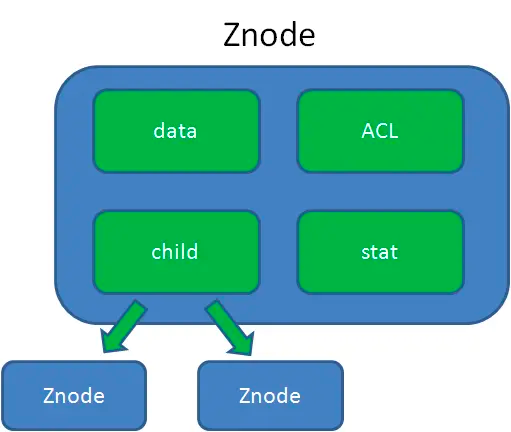

    这是“zookeeper”系列的第一篇文章，主要介绍的是架构和数据结构。

<style>
.my-code {
   color: red;
}
.orange {
   color: orange
}
.red {
   color: red
}
code {
   color: #0ABF5B;
}
</style>

# 一、zookeeper
`zookeeper`是一个分布式协调服务框架，它是一个为分布式应用提供一致性服务的软件。
- 主要用于实现分布式系统中`master`选举、分布式协调、集群管理、负载均衡、分布式锁等功能。
- 可以用来统一配置管理、统一命名服务、分布式锁、集群管理

<!-- more -->

# 二、架构

集群模式
- 一主多从，主服务支持读写，从服务只支持读，写都需要经过主服务

## 2.1、集群节点类型
- `leader`
主节点，可读写，负责集群的写请求，leader选举出之前，集群无法使用
- `follower`
从节点，处理读请求，参与leader的选举
- `observe`
从节点，处理读请求，不参与leader的选举

## 2.2、集群节点状态
- `Looking`
  - 处于该状态，集群会进行leader选举
  - `ZAB` 协议，定义所有进程启动的时候，初始化状态都是 `LOOKING` 状态，此时进程组中不存在 `Leader`，选举之后才有，在进行选举成功后，就进入消息广播模式，此时 `Zookeeper` 集群中的角色状态就不再是 `LOOKING` 状态。
- `follower`
Follower服务器和leader服务器保持数据同步的状态
- `Leading`
Leader服务器作为主服务器的状态


# 三、数据结构

`zookeeper`的数据节点可以视为树状结构（或者目录），树中的各节点被称为`znode`（即`zookeeper node`），一个`znode`可以有多个子节点，可以说 `zookeeper` 中的所有存储的数据是由 `znode` 组成的，并以 `key/value` 形式存储数据。整体结构类似于 `linux` 文件系统的模式以树形结构存储，其中根路径以`/`开头。如下所示：
```bash
[zk localhost:2181(connected) 0]: ls /
[animal, zookeeper]
[zk localhost:2181(connected) 2]: ls /animal
[]
[zk localhost:2181(connected) 3]: create -e -s /animal/cat "cat"
Created /animal/cat0002
[zk localhost:2181(connected) 0]: ls /animal
[cat0002]
```
可以看到，此时存储的数据在根目录下存在 `animal` 和 `zookeeper`两个节点，大体结构如下：


源码结构中，通过`DataTree`管理所有的`znode`的树形结构。

## 3.1、znode的存储结构
命名空间中的每个节点就是一个`znode`，它兼具文件和目录的特点，可维护数据、元信息等，存储数据，最大存储1M数据。

- **data**
存储实际的数据
- **ACL**
记录了znode的访问权限
- **stat**
znode的元数据，例如事务ID、版本号、时间戳、大小等等
- **child**
子节点引用，可以有多个子节点

`zk`的源码主要用Java编写，`znode`源码结构如下：
```java
package org.apache.zookeeper.data;
import java.util.List;
import java.util.Set;
import java.util.concurrent.CopyOnWriteArraySet;

import org.apache.zookeeper.ZooDefs;
import org.apache.zookeeper.data.Stat;
public class ZNode {
   // 节点数据
   private byte[] data;
   // 访问控制列表
   private List<ZooDefs.ACL> acl;
   // 节点状态信息
   private Stat stat;
   // 子节点名称集合
   private Set<String> children = new CopyOnWriteArraySet<>();

   public ZNode(byte[] data, List<ZooDefs.ACL> acl, Stat stat) {
      this.data = data;
      this.acl = acl;
      this.stat = stat;
   }
}
```

## 3.2、znode的类型与特性
`znode`的类型通过创建时的标志（`CreateMode`）控制，源码中通过`事务处理`和`节点状态管理`实现。

`zookeeper.create("/myNode", data, Ids.OPEN_ACL_UNSAFE, CreateMode.PERSISTENT)`
- 枚举类，定义**Znode**类型：
  - `PERSISTENT`【持久化节点】
  - `PERSISTENT_SEQUENTIAL`【持久化排序节点】
  - `EPHEMERAL`【临时节点】
  - `EPHEMERAL_SEQUENTIAL`【临时排序节点，每个节点有序号】

### 3.2.1、`PERSISTENT`【持久化节点】
使用场景
> 用于存储一些需要长期保存的配置信息或元数据。例如，在分布式应用中，存储整个系统的全局配置，这些配置在应用的整个生命周期内都应该存在且保持不变。

### 3.2.2、`PERSISTENT_SEQUENTIAL`【持久化排序节点】
使用场景
> 在分布式队列的实现中，多个生产者可以依次创建顺序节点来加入任务到队列中，消费者按照节点的顺序依次处理任务，保证任务的有序性。

### 3.2.3、`EPHEMERAL`【临时节点】
特点
> 与创建它的 `ZooKeeper` 客户端会话（`Session`）绑定。 当客户端会话结束（如客户端断开连接或会话超时）时，临时节点会被自动删除

使用场景
> **分布式锁**的实现中，可以利用临时节点

### 3.2.4、`EPHEMERAL_SEQUENTIAL`【临时排序节点，每个节点有序号】
使用场景
> 在分布式系统中进行一次性的资源分配或任务调度，每个客户端在请求资源或任务时创建一个临时顺序节点，根据节点的顺序来确定资源或任务的分配顺序，当客户端会话结束时，节点自动删除，释放相应的资源或任务


## 3.3、ZNode的持久化实现
`ZNode`的持久化通过`事务日志（WAL）`和`快照（Snapshot）`实现，确保数据一致性。

## 3.4、ZNode的事务处理
所有对`ZNode`的修改操作（如`Create、delete、setData`）都会封装为事务（`transaction`），通过`zookeeper`的原子广播协议（`zab`)保证一致性。

## 3.5、ZNode的watch机制
`ZNode`的`watcher`机制通过监听节点变化实现事件驱动模型。源码中通过 `WatchManager` 和 `WatchTrigger` 管理。

### 3.5.1、关键类
- `WatchManager`
  - 注册和触发`watcher`.
  - 当`Znode`发生变化时，调用`Watcher.process(WatchedEvent)`通知客户端。
- `WatchedEvent`
  - 封装`Watcher`事件类型（`EventType.NodeCreated, EventType.NodeDeleted`等）和路径。

## 3.6、ZNode的使用
在ZooKeeper中，znode（数据节点）的使用涉及创建、读取、更新和删除等基本操作。以下是详细介绍：

1. **创建znode**
    - 使用`create`方法创建znode，可以指定节点路径、数据、访问控制列表（ACL）和节点类型。
    - 节点类型包括持久节点（PERSISTENT）、临时节点（EPHEMERAL）、持久顺序节点（PERSISTENT_SEQUENTIAL）和临时顺序节点（EPHEMERAL_SEQUENTIAL）。
    - 示例：`String path = zookeeper.create("/myNode", data, Ids.OPEN_ACL_UNSAFE, CreateMode.PERSISTENT);`

2. **读取znode**
    - 使用`exists`方法检查znode是否存在，可以设置监听器以在节点变化时收到通知。
    - 使用`getData`方法获取znode的数据，同时可以获取节点的统计信息（Stat）。
    - 示例：`byte[] data = zookeeper.getData("/myNode", watcher, stat);`

3. **更新znode**
    - 使用`setData`方法更新znode的数据，可以指定数据的版本号，实现乐观锁机制。
    - 示例：`Stat stat = zookeeper.setData("/myNode", newData, -1);`

4. **删除znode**
    - 使用`delete`方法删除znode，可以指定版本号，确保删除的是期望的版本。
    - 示例：`zookeeper.delete("/myNode", -1);`

5. **监听znode变化**
    - 在创建、读取或检查znode时，可以注册监听器（Watcher）。
    - 当znode的状态发生变化（如创建、删除、数据更新）时，ZooKeeper会通知注册的监听器。
    - 示例：`Stat exists = zookeeper.exists("/myNode", new MyWatcher());`

6. **设置访问权限（ACL）**
    - 使用`setACL`方法设置znode的访问控制列表，控制节点的访问权限。
    - 示例：`List<ACL> acls = new ArrayList<ACL>(); acls.add(new ACL(Perms.ALL, new Id("world", "anyone"))); zookeeper.setACL("/myNode", acls, -1);`

通过以上操作，可以有效地使用ZooKeeper的znode进行分布式协调和数据管理。

## 3.7、源码结构示例
以Create操作为例，流程如下：
1. 客户端请求：
   `Zookeeper.create()`发送请求。
2. 服务端处理：
   `PrepRequestProcessor`预处理请求，生成事务。
3. 事务提交：
   `ProposalRequestProcessor`将事务提交给`Zab`协议广播。(proposal 发起提案)
4. 事务应用：
   `FinalRequestProcessor`调用`ZKDatabase.processTxn()`更新`DataTree`.
5. 持久化
    事务日志写入磁盘，快照定期生成。

