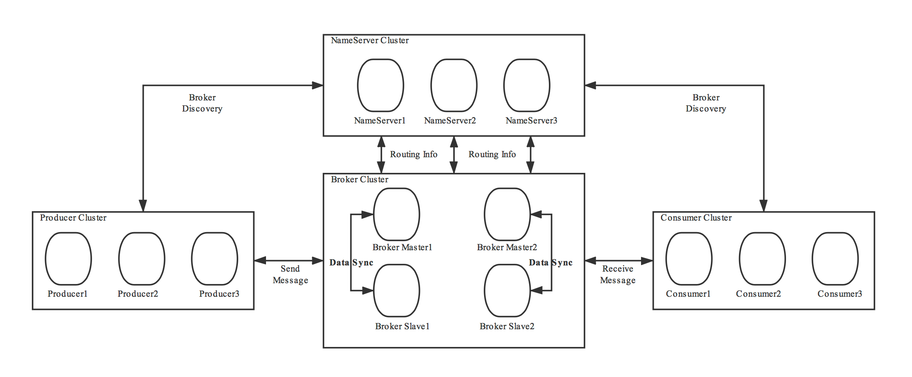

    这是rocketmq系列的第一篇文章，主要介绍的是rocketmq的架构。

# 一、rocketmq
**定位**：分布式消息中间件，适用于高吞吐、低延迟、高可用的场景。
**核心功能**：异步解耦、削峰填谷、分布式事务协调、顺序消息、延迟消息等。
**适用场景**：电商交易、金融支付、日志采集、实时计算等大规模分布式系统。

<!-- more -->

# 二、架构
RocketMQ 一共有四个部分组成：`NameServer`，`Broker`，`Producer 生产者`，`Consumer 消费者`，它们对应了：`发现`、`发`、`存`、`收`，为了保证高可用，一般每一部分都是集群部署的

# 三、核心组件--Nameserver
轻量级注册中心，提供服务注册、服务剔除、服务发现这些基础功能。 主要负责对于源数据的管理，管理Broker的路由信息，包括了对于Topic和路由信息的管理。类似`Dubbo`中的`Zookeeper`。

`特点`
- 每个 NameServer 结点之间是相互独立，彼此没有任何信息交互。
- Nameserver 被设计成几乎是无状态的，通过部署多个结点来标识自己是一个伪集群
  - Producer 在发送消息前从 NameServer 中获取 Topic 的路由信息也就是发往哪个 Broker。
  - Consumer 也会定时从 NameServer 获取 Topic 的路由信息。
  - Broker 在启动时会向 NameServer 注册，建立长连接，并定时进行心跳连接，且定时同步维护的 Topic 到 NameServer。
    - 单个Broker节点与所有的NameServer节点保持长连接及心跳，并会定时将Topic信息注册到NameServer

#  四、核心组件--Broker
消息存储与转发核心节点，支持主从架构（master-slave）、数据分片（queue）。
> 后续专门章节解析

# 五、核心组件--Producer
producer是消息生产者，负责向broker发送消息。
> 后续专门章节解析

# 六、核心组件--Consumer
消息消费者，负责消费消息
> 后续专门章节解析

参考文章：
https://juejin.cn/post/7250374485568503867
https://juejin.cn/post/7031701457086709796