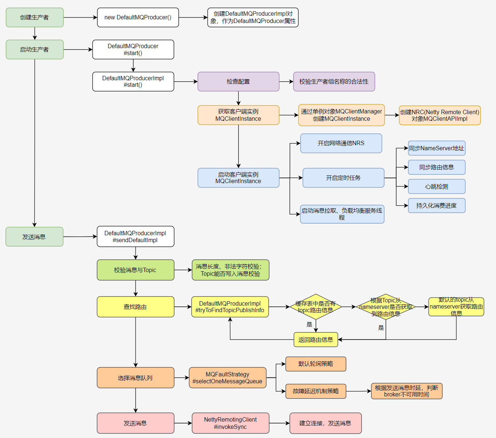

    这是rocketmq系列的第二篇文章，主要介绍的是rocketmq的生产者。

<style>
.my-code {
   color: orange;
}
.orange {
   color: rgb(255, 53, 2)
}
.red {
   color: red
}
</style>

# 一、核心组件--Producer
producer是消息生产者，负责向broker发送消息。

简单示例如下：
```java
DefaultMQProducer producer = new DefaultMQProducer("producerGroup");
producer.setNamesrvAddr("127.0.0.1:9876");
producer.start();
Message message = new Message(topic, new byte[] {'hello, world'});
producer.send(message);
```
最重要的是<code class="my-code">producer.start()</code>及<code class="my-code">producer.send()</code>，也就是producer启动及消息发送

<!-- more -->


# 二、producer启动
入口：<code class="my-code">producer.start()</code>
```java
public class DefaultMQProducer extends ClientConfig implements MQProducer {
    public void start() throws MQClientException {
        this.setProducerGroup(withNamespace(this.producerGroup));
        this.defaultMQProducerImpl.start();
        if (null != traceDispatcher) {
            try {
                traceDispatcher.start(this.getNamesrvAddr(), this.getAccessChannel());
            } catch (MQClientException e) {
                log.warn("trace dispatcher start failed ", e);
            }
        }
    }
}
```
**备注**： DefaultMQProducer的构造器，send和start等相关的方法，其实都是围绕DefaultMQProducerImpl来转，defaultMQProducerImpl：默认生产者的实现类，其start方法作为生产者启动的核心方法,接下来将核心分析其start方法的实现.

## 2.1、DefaultMQProducerImpl#start
```java
/**
 * mq-producer 启动
 * @param startFactory
 * @throws MQClientException
 */
public void start(final boolean startFactory) throws MQClientException {
    switch (this.serviceState) {
        case CREATE_JUST:
            // 0-服务状态设置
            this.serviceState = ServiceState.START_FAILED;
            //1-检测配置
            this.checkConfig();
            //2-并改变生产者的 instanceName为进程 ID。
            if (!this.defaultMQProducer.getProducerGroup().equals(MixAll.CLIENT_INNER_PRODUCER_GROUP)) {
                this.defaultMQProducer.changeInstanceNameToPID();
            }
            //3-创建 MQClientlnstance实例
            this.mQClientFactory = MQClientManager.getInstance().getAndCreateMQClientInstance(this.defaultMQProducer, rpcHook);
            //4-向 MQClientlnstance注册生产者。
            boolean registerOK = mQClientFactory.registerProducer(this.defaultMQProducer.getProducerGroup(), this);
            if (!registerOK) {
                this.serviceState = ServiceState.CREATE_JUST;
                throw new MQClientException("The producer group[" + this.defaultMQProducer.getProducerGroup()
                    + "] has been created before, specify another name please." + FAQUrl.suggestTodo(FAQUrl.GROUP_NAME_DUPLICATE_URL),
                    null);
            }
            //5-默认topic信息缓存（ this.defaultMQProducer.getCreateTopicKey() =  'TBW102' ）
            this.topicPublishInfoTable.put(this.defaultMQProducer.getCreateTopicKey(), new TopicPublishInfo());
            //6-是否启动-mQClientFactory
            if (startFactory) {
                mQClientFactory.start();
            }

            log.info("the producer [{}] start OK. sendMessageWithVIPChannel={}", this.defaultMQProducer.getProducerGroup(),
                this.defaultMQProducer.isSendMessageWithVIPChannel());
            this.serviceState = ServiceState.RUNNING;//设置状态为 运行中
            break;
        case RUNNING:
        case START_FAILED:
        case SHUTDOWN_ALREADY:
            throw new MQClientException("The producer service state not OK, maybe started once, "
                + this.serviceState
                + FAQUrl.suggestTodo(FAQUrl.CLIENT_SERVICE_NOT_OK),
                null);
        default:
            break;
    }
    //7-发送心跳到所有broker
    this.mQClientFactory.sendHeartbeatToAllBrokerWithLock();
}
```

## 2.2、MQClientInstance#start()
```java
public void start() throws MQClientException {
    synchronized (this) {
        switch (this.serviceState) {
            case CREATE_JUST:
                this.serviceState = ServiceState.START_FAILED;
                // If not specified,looking address from name server
                if (null == this.clientConfig.getNamesrvAddr()) {
                    this.mQClientAPIImpl.fetchNameServerAddr();
                }
              // 启动请求响应通道
                this.mQClientAPIImpl.start();
              // 启动各种定时任务
                this.startScheduledTask();
              // 启动拉消息服务
                this.pullMessageService.start();
              // 启动Rebalance服务
                this.rebalanceService.start();
              // 启动Producer服务
                this.defaultMQProducer.getDefaultMQProducerImpl().start(false);
                log.info("the client factory [{}] start OK", this.clientId);
                this.serviceState = ServiceState.RUNNING;
                break;
            case START_FAILED:
                throw new MQClientException("The Factory object[" + this.getClientId() + "] has been created before, and failed.", null);
            default:
                break;
        }
    }
}
```
以上是 Producer 的启动流程。这里面有几个重要的类，你需要清楚它们的各自的职责。后续你在使用 RocketMQ 时，如果遇到问题需要调试代码，了解这几个重要类的职责会对你有非常大的帮助。
- **DefaultMQProducerImpl**：Producer 的内部实现类，大部分 Producer 的业务逻辑，也就是发消息的逻辑，都在这个类中。
- **MQClientInstance**：这个类中封装了客户端一些通用的业务逻辑，无论是 Producer 还是 Consumer，最终需要与服务端交互时，都需要调用这个类中的方法；
- **MQClientAPIImpl**：这个类中封装了客户端服务端的 RPC，对调用者隐藏了真正网络通信部分的具体实现；
- **NettyRemotingClient**：RocketMQ 各进程之间网络通信的底层实现类。


# 三、producer消息发送【同步发送】
在 Producer 的接口 MQProducer 中，定义了 19 个不同参数的发消息的方法，按照发送方式不同可以分成三类：
- **单向发送（Oneway）**：发送消息后立即返回，不处理响应，不关心是否发送成功；
- **同步发送（Sync）**：发送消息后等待响应；
- **异步发送（Async）**：发送消息后立即返回，在提供的回调方法中处理响应。

根据DefaultMQProducer的send方法，最终调到DefaultMQProducerImpl的sendDefaultImpl方法，核心代码段如下。
```java
private SendResult sendDefaultImpl(
        Message msg,
        final CommunicationMode communicationMode,
        final SendCallback sendCallback,
        final long timeout
    ) throws MQClientException, RemotingException, MQBrokerException, InterruptedException {
        this.makeSureStateOK();
        //1. 数据合法性校验
        Validators.checkMessage(msg, this.defaultMQProducer);
        final long invokeID = random.nextLong();
        long beginTimestampFirst = System.currentTimeMillis();
        long beginTimestampPrev = beginTimestampFirst;
        long endTimestamp = beginTimestampFirst;
        //2、查找路由
        TopicPublishInfo topicPublishInfo = this.tryToFindTopicPublishInfo(msg.getTopic());
        if (topicPublishInfo != null && topicPublishInfo.ok()) {
            boolean callTimeout = false;
            MessageQueue mq = null;
            Exception exception = null;
            SendResult sendResult = null;
            int timesTotal = communicationMode == CommunicationMode.SYNC ? 1 + this.defaultMQProducer.getRetryTimesWhenSendFailed() : 1;
            int times = 0;
            String[] brokersSent = new String[timesTotal];
            for (; times < timesTotal; times++) {
                String lastBrokerName = null == mq ? null : mq.getBrokerName();
                //3、选择队列
                MessageQueue mqSelected = this.selectOneMessageQueue(topicPublishInfo, lastBrokerName);
                if (mqSelected != null) {
                    mq = mqSelected;
                    brokersSent[times] = mq.getBrokerName();
                    try {
                        beginTimestampPrev = System.currentTimeMillis();
                        if (times > 0) {
                            //Reset topic with namespace during resend.
                            msg.setTopic(this.defaultMQProducer.withNamespace(msg.getTopic()));
                        }
                        long costTime = beginTimestampPrev - beginTimestampFirst;
                        if (timeout < costTime) {
                            callTimeout = true;
                            break;
                        }
                        //4、消息发送
                        sendResult = this.sendKernelImpl(msg, mq, communicationMode, sendCallback, topicPublishInfo, timeout - costTime);
                        endTimestamp = System.currentTimeMillis();
                        this.updateFaultItem(mq.getBrokerName(), endTimestamp - beginTimestampPrev, false);
                        switch (communicationMode) {
                            case ASYNC:
                                return null;
                            case ONEWAY:
                                return null;
                            case SYNC:
                                if (sendResult.getSendStatus() != SendStatus.SEND_OK) {
                                    if (this.defaultMQProducer.isRetryAnotherBrokerWhenNotStoreOK()) {
                                        continue;
                                    }
                                }
                                return sendResult;
                            default:
                                break;
                        }
                    } catch (RemotingException e) {
                        endTimestamp = System.currentTimeMillis();
                        this.updateFaultItem(mq.getBrokerName(), endTimestamp - beginTimestampPrev, true);
                        log.warn(String.format("sendKernelImpl exception, resend at once, InvokeID: %s, RT: %sms, Broker: %s", invokeID, endTimestamp - beginTimestampPrev, mq), e);
                        log.warn(msg.toString());
                        exception = e;
                        continue;
                    } catch (MQClientException e) {
                        endTimestamp = System.currentTimeMillis();
                        this.updateFaultItem(mq.getBrokerName(), endTimestamp - beginTimestampPrev, true);
                        log.warn(String.format("sendKernelImpl exception, resend at once, InvokeID: %s, RT: %sms, Broker: %s", invokeID, endTimestamp - beginTimestampPrev, mq), e);
                        log.warn(msg.toString());
                        exception = e;
                        continue;
                    } catch (MQBrokerException e) {
                        endTimestamp = System.currentTimeMillis();
                        this.updateFaultItem(mq.getBrokerName(), endTimestamp - beginTimestampPrev, true);
                        log.warn(String.format("sendKernelImpl exception, resend at once, InvokeID: %s, RT: %sms, Broker: %s", invokeID, endTimestamp - beginTimestampPrev, mq), e);
                        log.warn(msg.toString());
                        exception = e;
                        switch (e.getResponseCode()) {
                            case ResponseCode.TOPIC_NOT_EXIST:
                            case ResponseCode.SERVICE_NOT_AVAILABLE:
                            case ResponseCode.SYSTEM_ERROR:
                            case ResponseCode.NO_PERMISSION:
                            case ResponseCode.NO_BUYER_ID:
                            case ResponseCode.NOT_IN_CURRENT_UNIT:
                                continue;
                            default:
                                if (sendResult != null) {
                                    return sendResult;
                                }

                                throw e;
                        }
                    } catch (InterruptedException e) {
                        endTimestamp = System.currentTimeMillis();
                        this.updateFaultItem(mq.getBrokerName(), endTimestamp - beginTimestampPrev, false);
                        log.warn(String.format("sendKernelImpl exception, throw exception, InvokeID: %s, RT: %sms, Broker: %s", invokeID, endTimestamp - beginTimestampPrev, mq), e);
                        log.warn(msg.toString());

                        log.warn("sendKernelImpl exception", e);
                        log.warn(msg.toString());
                        throw e;
                    }
                } else {
                    break;
                }
            }

            if (sendResult != null) {
                return sendResult;
            }

            String info = String.format("Send [%d] times, still failed, cost [%d]ms, Topic: %s, BrokersSent: %s",
                times,
                System.currentTimeMillis() - beginTimestampFirst,
                msg.getTopic(),
                Arrays.toString(brokersSent));

            info += FAQUrl.suggestTodo(FAQUrl.SEND_MSG_FAILED);

            MQClientException mqClientException = new MQClientException(info, exception);
            if (callTimeout) {
                throw new RemotingTooMuchRequestException("sendDefaultImpl call timeout");
            }

            if (exception instanceof MQBrokerException) {
                mqClientException.setResponseCode(((MQBrokerException) exception).getResponseCode());
            } else if (exception instanceof RemotingConnectException) {
                mqClientException.setResponseCode(ClientErrorCode.CONNECT_BROKER_EXCEPTION);
            } else if (exception instanceof RemotingTimeoutException) {
                mqClientException.setResponseCode(ClientErrorCode.ACCESS_BROKER_TIMEOUT);
            } else if (exception instanceof MQClientException) {
                mqClientException.setResponseCode(ClientErrorCode.BROKER_NOT_EXIST_EXCEPTION);
            }

            throw mqClientException;
        }

        validateNameServerSetting();

        throw new MQClientException("No route info of this topic: " + msg.getTopic() + FAQUrl.suggestTodo(FAQUrl.NO_TOPIC_ROUTE_INFO),
            null).setResponseCode(ClientErrorCode.NOT_FOUND_TOPIC_EXCEPTION);
    }
```

整体代码流程可以分成几个步骤：
1. 数据合法性校验
2. 查找路由
3. 选择消息队列
4. 消息发送


## 3.1、数据合法性校验
DefaultMQProducerImpl#sendDefaultImpl()方法，校验传送的消息与Topic，Validators#checkMessage() 
```java
// 校验消息核心代码
public static void checkMessage(Message msg, DefaultMQProducer defaultMQProducer)
    throws MQClientException {
    if (null == msg) {
        throw new MQClientException(ResponseCode.MESSAGE_ILLEGAL, "the message is null");
    }
    // topic规范检查
    Validators.checkTopic(msg.getTopic());
    // topic是否能写入消息
    Validators.isNotAllowedSendTopic(msg.getTopic());
    // 消息非空检查
    if (null == msg.getBody()) {
        throw new MQClientException(ResponseCode.MESSAGE_ILLEGAL, "the message body is null");
    }
    // 消息长度检查
    if (0 == msg.getBody().length) {
        throw new MQClientException(ResponseCode.MESSAGE_ILLEGAL, "the message body length is zero");
    }
    if (msg.getBody().length > defaultMQProducer.getMaxMessageSize()) {
        throw new MQClientException(ResponseCode.MESSAGE_ILLEGAL,
            "the message body size over max value, MAX: " + defaultMQProducer.getMaxMessageSize());
    }
}
```

## 3.2、查找路由
DefaultMQProducerImpl#sendDefaultImpl()方法，DefaultMQProducerImpl#tryToFindTopicPublishInfo() 核心代码
```java
// topic与topic路由信息映射缓存表
private final ConcurrentMap<String, TopicPublishInfo> topicPublishInfoTable =
    new ConcurrentHashMap<String, TopicPublishInfo>();
// MQ客户端实例
private MQClientInstance mQClientFactory;

// 查找路由信息
private TopicPublishInfo tryToFindTopicPublishInfo(final String topic) {
    // 获取缓存表中的topic路由信息
    TopicPublishInfo topicPublishInfo = this.topicPublishInfoTable.get(topic);
    // 缓存表中路由信息为空,则从NameServer获取topic路由信息
    if (null == topicPublishInfo || !topicPublishInfo.ok()) {
        this.topicPublishInfoTable.putIfAbsent(topic, new TopicPublishInfo());
        this.mQClientFactory.updateTopicRouteInfoFromNameServer(topic);
        topicPublishInfo = this.topicPublishInfoTable.get(topic);
    }
    // 缓存表中存在或Nameserver中存在topic的路由信息，直接返回
    if (topicPublishInfo.isHaveTopicRouterInfo() || topicPublishInfo.ok()) {
        return topicPublishInfo;
    // 若未找到当前topic的路由信息,则用默认主题继续查找
    } else {
        this.mQClientFactory.updateTopicRouteInfoFromNameServer(topic, true, this.defaultMQProducer);
        topicPublishInfo = this.topicPublishInfoTable.get(topic);
        return topicPublishInfo;
    }
}
```
优先获取缓存表中获取topic的路由信息TopicPublishInfo，若缓存表中存在，返回路由信息。

若缓存表中不存在，根据topic从nameserver中获取路由信息，若获取到路由信息，设置进缓存表并返回路由信息。

若nameserver中未查找到topic路由信息，使用默认的主题继续从nameserver中查找路由信息。

## 3.3、选择发送消息队列
DefaultMQProducerImpl#sendDefaultImpl()方法，DefaultMQProducerImpl#selectOneMessageQueue()核心代码
```java
// 故障延迟标识开关，默认关闭
private boolean sendLatencyFaultEnable = false;

// 选择消息队列
public MessageQueue selectOneMessageQueue(final TopicPublishInfo tpInfo, final String lastBrokerName) {
    // Broker故障延迟机制，默认关闭
    if (this.sendLatencyFaultEnable) {
        try {
            int index = tpInfo.getSendWhichQueue().getAndIncrement();
            // 1、对消息队列轮询获取一个队列
            for (int i = 0; i < tpInfo.getMessageQueueList().size(); i++) {
                // 基于index和队列数量取余，确定位置
                int pos = Math.abs(index++) % tpInfo.getMessageQueueList().size();
                if (pos < 0)
                    pos = 0;
                // 2、获取消息队列
                MessageQueue mq = tpInfo.getMessageQueueList().get(pos);
                // 3、消息队列所在的broker可用，返回消息队列；不可用，获取下一个消息队列
                if (latencyFaultTolerance.isAvailable(mq.getBrokerName()))
                    return mq;
            }

            // 4、若预测的所有broker都不可用，则随机选择一个broker,随机选择该Broker下一个队列进行发送
            final String notBestBroker = latencyFaultTolerance.pickOneAtLeast();
            // 获得Broker的写队列集合
            int writeQueueNums = tpInfo.getQueueIdByBroker(notBestBroker);
            if (writeQueueNums > 0) {
                final MessageQueue mq = tpInfo.selectOneMessageQueue();
                if (notBestBroker != null) {
                    // 获得一个队列,指定broker和队列ID并返回
                    mq.setBrokerName(notBestBroker);
                    mq.setQueueId(tpInfo.getSendWhichQueue().getAndIncrement() % writeQueueNums);
                }
                return mq;
            } else {
                latencyFaultTolerance.remove(notBestBroker);
            }
        } catch (Exception e) {
            log.error("Error occurred when selecting message queue", e);
        }

        return tpInfo.selectOneMessageQueue();
    }

    // 默认执行
    return tpInfo.selectOneMessageQueue(lastBrokerName);
}
```
故障延迟处理标识开关sendLatencyFaultEnable默认关闭，开关关闭，RocketMQ选择消息队列采用轮询的方式，轮询算法能保证每一个Queue队列的消息投递数量尽可能均匀。
```java
// 默认使用轮询方式选择消息队列
public MessageQueue selectOneMessageQueue() {
    // 使用 ThreadLocal 进行 sendWhichQueue 的自增
    int index = this.sendWhichQueue.getAndIncrement();
    // 对队列大小取模
    int pos = Math.abs(index) % this.messageQueueList.size();
    if (pos < 0)
        pos = 0;
    // 返回对应的队列
    return this.messageQueueList.get(pos);
}
```
开关打开，RocketMQ就开启了故障延迟功能，每次向Broker成功或者异常的发送，RocketMQ都会计算出该Borker的可用时间（发送结束时间-发送开始时间，失败的按照30S计算），并且保存，方便下次发送时做broekr不可用时长的判断。

### 3.3.1、故障规避延迟机制
故障规避延时机制，MQFaultStrategy#updateFaultItem() 核心代码：
```java
// 发送延时
private long[] latencyMax = {50L, 100L, 550L, 1000L, 2000L, 3000L, 15000L};
// 故障规避
private long[] notAvailableDuration = {0L, 0L, 30000L, 60000L, 120000L, 180000L, 600000L};

public void updateFaultItem(final String brokerName, final long currentLatency, boolean isolation) {
    if (this.sendLatencyFaultEnable) {
        //获取不可用持续时长，在这个时间内，Broker将被规避
        long duration = computeNotAvailableDuration(isolation ? 30000 : currentLatency);
        this.latencyFaultTolerance.updateFaultItem(brokerName, currentLatency, duration);
    }
}
// 根据发送延时来定义故障规避的时间
private long computeNotAvailableDuration(final long currentLatency) {
    for (int i = latencyMax.length - 1; i >= 0; i--) {
        if (currentLatency >= latencyMax[i])
            return this.notAvailableDuration[i];
    }
    return 0;
}
```
如果消息时长在550ms之内，不可用时长为0；达到550ms，不可用时长为30S；达到1000ms，不可用时长为60S；达到2000ms，不可用时长为120S；达到3000ms，不可用时长为180S；达到15000ms，不可用时长为600S。

故障延迟机制策略处理：遍历消息队列列表，获取列表中broker可用的消息队列；若列表中没有broker可用的消息队列，随机选择一个broker中的某个队列进行消息发送。
```java
public MessageQueue selectOneMessageQueue(final TopicPublishInfo tpInfo, final String lastBrokerName) {
    //故障延迟机制，默认关闭   
    if (this.sendLatencyFaultEnable) {
        try {
            int index = tpInfo.getSendWhichQueue().getAndIncrement();
            //1、轮询消息队列，得到队列
            for (int i = 0; i < tpInfo.getMessageQueueList().size(); i++) {
                int pos = Math.abs(index++) % tpInfo.getMessageQueueList().size();
                if (pos < 0)
                    pos = 0;
                //2、获取消息队列
                MessageQueue mq = tpInfo.getMessageQueueList().get(pos);
                //3、消息队列所在的broker可用，返回消息队列，不可用，获取下一个消息队列
                if (latencyFaultTolerance.isAvailable(mq.getBrokerName())) {
                    if (null == lastBrokerName || mq.getBrokerName().equals(lastBrokerName))
                        return mq;
                }
            }
            //4、若预测的所有broker都不可用，则随机选择一个broker，再随机选择一个队列
            final String notBestBroker = latencyFaultTolerance.pickOneAtLeast();
```
从RocketMQ的策略上可以看到，默认队列选择是轮训策略，而故障延迟选择队列则是优先考虑消息的发送时长短的队列。

当一个Topic创建在不同的Broker上时，通讯网络较好，推荐默认的轮询策略；通讯网络较差，推荐故障延迟机制，可避免不断向宕机的broker发送消息，实现消息发送的高可用。


## 3.4、消息发送
DefaultMQProducerImpl#sendDefaultImpl()方法，DefaultMQProducerImpl#sendKernelImpl()方法，代码段：
```java
case SYNC:
    long costTimeSync = System.currentTimeMillis() - beginStartTime;
    if (timeout < costTimeSync) {
        throw new RemotingTooMuchRequestException("sendKernelImpl call timeout");
    }
    sendResult = this.mQClientFactory.getMQClientAPIImpl().sendMessage(
        brokerAddr,
        mq.getBrokerName(),
        msg,
        requestHeader,
        timeout - costTimeSync,
        communicationMode,
        context,
        this);
    break;
```

### 3.4.1、构建RemotingCommand对象
MQClientAPIImpl#sendMessage()方法，代码段：
```java
public SendResult sendMessage(
        ...
    ) throws RemotingException, MQBrokerException, InterruptedException {
        RemotingCommand request = null;
        String msgType = msg.getProperty(MessageConst.PROPERTY_MESSAGE_TYPE);
        boolean isReply = msgType != null && msgType.equals(MixAll.REPLY_MESSAGE_FLAG);
        if (isReply) {
            if (sendSmartMsg) {
                SendMessageRequestHeaderV2 requestHeaderV2 = SendMessageRequestHeaderV2.createSendMessageRequestHeaderV2(requestHeader);
                request = RemotingCommand.createRequestCommand(RequestCode.SEND_REPLY_MESSAGE_V2, requestHeaderV2);
            } else {
                request = RemotingCommand.createRequestCommand(RequestCode.SEND_REPLY_MESSAGE, requestHeader);
            }
        } else {
            if (sendSmartMsg || msg instanceof MessageBatch) {
                SendMessageRequestHeaderV2 requestHeaderV2 = SendMessageRequestHeaderV2.createSendMessageRequestHeaderV2(requestHeader);
                request = RemotingCommand.createRequestCommand(msg instanceof MessageBatch ? RequestCode.SEND_BATCH_MESSAGE : RequestCode.SEND_MESSAGE_V2, requestHeaderV2);
            } else {
                request = RemotingCommand.createRequestCommand(RequestCode.SEND_MESSAGE, requestHeader);
            }
        }
        request.setBody(msg.getBody());
```
构建远程通信请求对象RemotingCommand，同时为ReuqestCode设置请求码ReuqestCode，RequestCode的具体作用在Broker端处理消息在具体介绍。

### 3.4.2、执行远程的调用：
根据通讯模式，执行远程的调用
```java
switch (communicationMode) {
    case ONEWAY:
        this.remotingClient.invokeOneway(addr, request, timeoutMillis);
        return null;
    case ASYNC:
        final AtomicInteger times = new AtomicInteger();
        long costTimeAsync = System.currentTimeMillis() - beginStartTime;
        if (timeoutMillis < costTimeAsync) {
            throw new RemotingTooMuchRequestException("sendMessage call timeout");
        }
        this.sendMessageAsync(addr, brokerName, msg, timeoutMillis - costTimeAsync, request, sendCallback, topicPublishInfo, instance,
            retryTimesWhenSendFailed, times, context, producer);
        return null;
    case SYNC:
        long costTimeSync = System.currentTimeMillis() - beginStartTime;
        if (timeoutMillis < costTimeSync) {
            throw new RemotingTooMuchRequestException("sendMessage call timeout");
        }
        return this.sendMessageSync(addr, brokerName, msg, timeoutMillis - costTimeSync, request);
    default:
        assert false;
        break;
}
```
MQClientAPIImpl#sendMessageSync()方法，代码段：
```java
private SendResult sendMessageSync(
        final String addr,
        final String brokerName,
        final Message msg,
        final long timeoutMillis,
        final RemotingCommand request
    ) throws RemotingException, MQBrokerException, InterruptedException {
        RemotingCommand response = this.remotingClient.invokeSync(addr, request, timeoutMillis);
        assert response != null;
        return this.processSendResponse(brokerName, msg, response);
    }
```
NettyRemotingClient#invokeSync()，代码段：
```java
public RemotingCommand invokeSync(String addr, final RemotingCommand request, long timeoutMillis)
        throws InterruptedException, RemotingConnectException, RemotingSendRequestException, RemotingTimeoutException {
    long beginStartTime = System.currentTimeMillis();
    //建立连接通道
    final Channel channel = this.getAndCreateChannel(addr);
    if (channel != null && channel.isActive()) {
        try {
            doBeforeRpcHooks(addr, request);
            long costTime = System.currentTimeMillis() - beginStartTime;
            if (timeoutMillis < costTime) {
                throw new RemotingTimeoutException("invokeSync call timeout");
            }
            //发送消息
            RemotingCommand response = this.invokeSyncImpl(channel, request, timeoutMillis - costTime);
            doAfterRpcHooks(RemotingHelper.parseChannelRemoteAddr(channel), request, response);
            return response;
}
```
在RocketMQ中，客户端与Broker的连接是在发送消息时建立的，即只有在需要与对端进行数据交互时建立的网络通信连接，连接建立之后，发送同步消息。

NettyRemotingAbstract#invokeSync()，代码段：
```java
public RemotingCommand invokeSyncImpl(final Channel channel, final RemotingCommand request,
    final long timeoutMillis)
    throws InterruptedException, RemotingSendRequestException, RemotingTimeoutException {
    final int opaque = request.getOpaque();
    try {
        //创建响应结果对象
        final ResponseFuture responseFuture = new ResponseFuture(channel, opaque, timeoutMillis, null, null);
        this.responseTable.put(opaque, responseFuture);
        final SocketAddress addr = channel.remoteAddress();
        //消息发送及响应结果监听设置
        channel.writeAndFlush(request).addListener(new ChannelFutureListener() {
            @Override
            public void operationComplete(ChannelFuture f) throws Exception {
                if (f.isSuccess()) {
                    responseFuture.setSendRequestOK(true);
                    return;
                } else {
                    responseFuture.setSendRequestOK(false);
                }
}
```

# 四、异步发送
在rocketmq中，异步发送消息是通过send方法并传入一个SendCallback对象来实现的，而不是直接使用sendAsync方法。以下是异步发送消息的示例代码：
```java
public class AsyncProducerTest {
  public static void main(String[] args) throws Exception {
    // 创建一个生产者实例，并设置组名
    DefaultMQProducer producer = new DefaultMQProducer("AsyncGroup");
    // 设置 NameServer 的地址，用于获取 Broker 的路由信息
    producer.setNamesrvAddr("x.x.x.x:9876");
    // 启动生产者
    producer.start();
    // 创建消息，指定 Topic、Tag 和消息体
    Message msg = new Message("AsyncTopic", "async", "AsyncMessage".getBytes("UTF-8"));
    // 异步发送消息，传入回调函数处理发送结果
    producer.send(msg, new SendCallback() {
      @Override
      public void onSuccess(SendResult sendResult) {
        // 消息发送成功时的处理
        System.out.println("message send success: " + sendResult);
      }

      @Override
      public void onException(Throwable throwable) {
        // 消息发送失败时的处理
        System.out.println("message send fail: " + throwable);
      }
    });
  }
}
```
主要逻辑是获取异常线程池，通过线程池去进行消息发送：
```java
public void send(final Message msg, final SendCallback sendCallback, final long timeout)
    throws MQClientException, RemotingException, InterruptedException {
    final long beginStartTime = System.currentTimeMillis();
    ExecutorService executor = this.getAsyncSenderExecutor();
    try {
        executor.submit(new Runnable() {
            @Override
            public void run() {
                long costTime = System.currentTimeMillis() - beginStartTime;
                if (timeout > costTime) {
                    try {
                        sendDefaultImpl(msg, CommunicationMode.ASYNC, sendCallback, timeout - costTime);
                    } catch (Exception e) {
                        sendCallback.onException(e);
                    }
                } else {
                    sendCallback.onException(
                        new RemotingTooMuchRequestException("DEFAULT ASYNC send call timeout"));
                }
            }

        });
    } catch (RejectedExecutionException e) {
        throw new MQClientException("executor rejected ", e);
    }

}
```

# 总结：生产者消息发送核心流程图


# 五、顺序消息
RocketMQ 消息的顺序性分为两部分，生产顺序性和消费顺序性。只有同时满足了生产顺序性和消费顺序性才能达到上述的FIFO效果。

那从生产者端是如何保证顺序性呢？

> 稍后的消息文章进行说明


# 六、事务消息

> 稍后的消息文章进行说明

# 七、延迟消息
> 稍后的消息文章进行说明


参考文章：
https://juejin.cn/post/7250374485568503867
https://juejin.cn/post/7031701457086709796