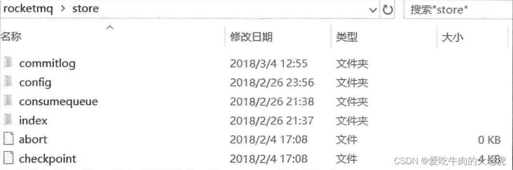
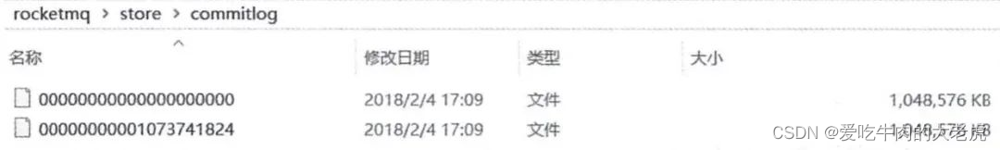
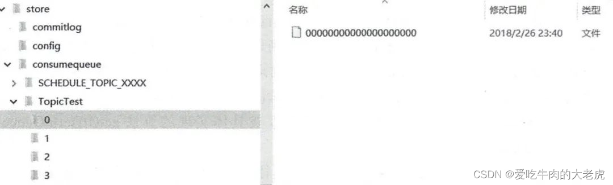
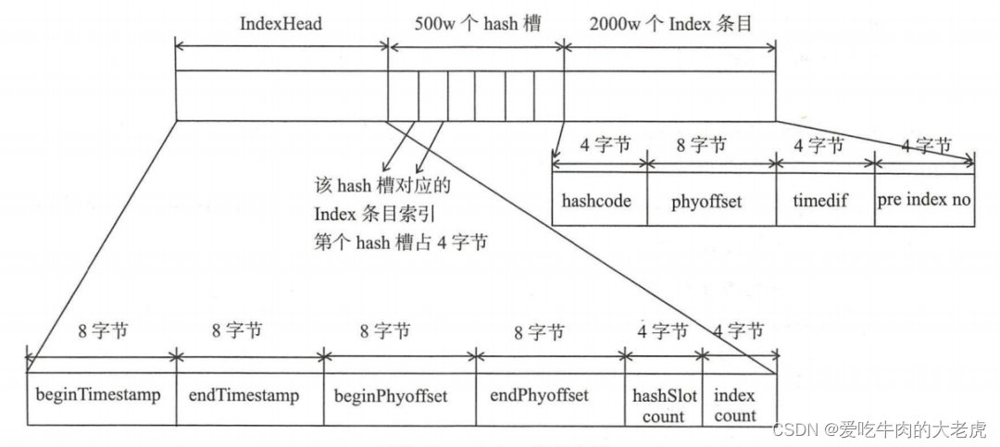
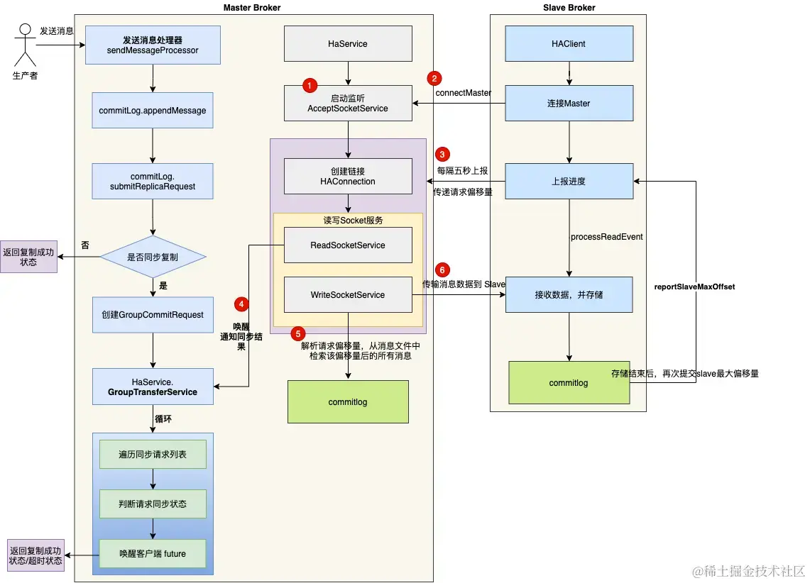

    这是rocketmq系列的第三篇文章，主要介绍的是Broker。

<style>
.my-code {
   color: orange;
}
.orange {
   color: rgb(255, 53, 2)
}
.red {
   color: red
}
</style>

# 一、核心组件--Broker
消息存储与转发核心节点，支持主从架构（master-slave）、数据分片（queue）。
<!-- more -->

接下来做一个整体概述。
##  1.1、Broker与NameServer的交互机制
注册与心跳

### 1.1.1、启动时注册
Broker启动时，会向配置的所有NameServer发送注册请求，将自己的信息（IP、端口、topic配置）写入每个NameServer

在Broker的配置文件中，需显示指定所有NameServer地址（以分号分隔）：
```
namesrvAddr=192.168.0.1:9876;192.168.0.2:9876;192.168.0.3:9876
```

> 为什么需要连接所有nameserver？
>
> - **namserver的无状态性**：nameserver节点之间不互相通信，每个节点独立存储路由信息。
> - **数据同步需求**：brokder需要将自己的元数据（如topic、queue信息、Broker地址等）注册到所有NameServer节点，确保每个NameServer都有完整的路由表。
> - **高可用保障**：即使部分NameServer宕机，其他NameServer扔能提供服务，生产者和消费者可以通过任意存活的NameServer获取路由信息。

### 1.1.2、定时心跳
Broker默认每30秒向所有NameServer发送一次心跳包，更新自身的存活状态（TCP长连接，心跳保活）。

### 1.1.3、故障感知
- NameServer若在120秒内未收到Broker心跳，则认为该Broker下线，将其从路由表中剔除。
- Broker会持续尝试与所有NameServer保持连接，即使某个NameServer暂时不可用，也会在恢复后自动重新连接。


## 1.2、Broker的数据存储
`Broker`的核心存储主要依赖三类文件，均位于<code class="my-code">${RocketMQ_HOME}/store</code>目录下：

- commitLog
- consumeQueue
- indexFile

### 1.2.1. CommitLog
- **作用**：消息主体以及元数据的存储主体，所有消息的主体内容按顺序写入CommitLog文件（无论Topic或Queue）。
- **文件结构**：
  - `CommitLog`文件保存于<code class="my-code">${Rocket_Home}/store/commitlog</code>目录中。
  - 
  - 单个文件默认1GB，写满后新建文件，文件名以起始偏移量命名（如00000000000000）。
  - 每条消息的存储格式：`消息长度+消息内容`，包含Topic、QueueID、消息体、Tag等元数据。


### 1.2.2. ConsumeQueue
- **作用**：消息的逻辑队列索引，按Topic和Queue分片，记录消息在CommitLog中的位置。
  - 消息消费队列，引入的目的主要是提高消息消费的性能，由于RocketMQ是基于主题topic的订阅模式，消息消费是针对主题进行的，如果要遍历commitlog文件中根据topic检索消息是非常低效的。
- **文件结构**：
  - `ConsumeQueue`文件可以看成是基于Topic的CommitLog索引文件，故ConsumeQueue文件夹的组织方式如下：<code class="my-code">topic/queue/file</code>三层组织结构，具体存储路径为：<code class="my-code">$HOME/store/consumequeue/{topic}/{queueId}/{fileName}</code>
  - 
  - 每个ConsumeQueue文件对应一个Queue，默认存储30w条索引（每条20字节）。
  - 每条索引包含：`CommitLog Offset（8B）+ 消息长度（4B） + Tag哈希值（8B）`。

### 1.2.3. IndexFile【索引文件】
- **作用**：支持按`Message Key`或`时间范围`快速查询消息。
- **文件结构**：
  - 
  - Index文件的存储位置是：<code class="my-code">{fileName}</code>，文件名fileName是以`创建时的时间戳`(YYYYMMDDHHMMSS)命名的
  - 单个文件大小固定（约400MB），存储哈希索引（Key的Hash值 —> CommitLog Offset）。


## 1.3、Broker的主从
在 RocketMQ 的集群模式中，Broker 分为 Master 与 Slave，一个 Master 可以对应多个 Slave，但是一个 Slave 只能对应一个 Master。
> 每个 Broker(主从都会) 与 Name Server 集群中的所有节点建立长连接，定时注册 Topic 信息到所有 Name Server。


### 1.3.1、消息复制
broker master和slave的消息同步，有两种模式：同步复制和异步复制。

#### 1.3.1.1、同步复制
生产者发送消息后，Master 接收到存储消息请求，将消息数据同步给 Slave 后，才将存储结果返回给生产者。同步复制模式下，发送消息会有一定延迟，系统吞吐量也会降低。

#### 1.3.1.2、异步复制
生产者发送消息后，Master 接收到存储消息请求，将消息存储后，直接将存储结果返回给生产者。 Master 和 Slave 再通过异步的方式同步数据，这种复制模式具有较小的延迟，可以实现比较高的吞吐量。
> 若 Master 出现故障，有些数据可能未写入 Slave ，未同步的数据可能丢失。

### 1.3.2、复制流程
复制流程分为两个部分：<code class="my-code">元数据复制</code>和<code class="my-code">消息数据复制</code>。
- 主从服务器同步主题，消费者进度，延迟消费进度，消费者配置数据
- 主从服务器同步消息数据

#### 1.3.2.1、元数据复制
Slave Broker 定时任务每隔 10 秒会同步元数据，包括主题，消费进度，延迟消费进度，消费者配置。
```java
public void syncAll() {
  //同步主题
  this.syncTopicConfig();
  //同步消费者进度文件
  this.syncConsumer0ffset ();
  //延迟消息进度
  this.syncDelayoffset();
  //消费组配置
  this.syncSubscriptionGroupConfig();
}
```
**同步主题**时, Slave Broker 向 Master Broker 发送 RPC 请求，返回数据后，首先加入本地缓存里，然后持久化到本地。
```java
public void syncTopicConfig() {
  String masterAddrBak = this.masterAddr;
  if (masterAddrBak != null && !masterAddrBak.eauals(brokercontroller.getBrokerAddr())) {
    try {
      //向master发送RPC请求
      TopicConfigSerializeWrapper topicWrapper = this.brokercontroller.getBrokerOuterAPI().getAllTopicCconfig(masterAddrBak);
      if (!this.brokerController.getTopicConfigManager().getDataVersion().equals(topicWrapper.getDataVersion())) {
        this.brokerController.getTopicConfigManager().getDataVersion().assignNewOne(topicWrapper.getDataVersion());
        this.brokerController.getTopicConfigManager().getTopicConfigTable().clear();
        this.brokerController.getTopicConfigManager().getTopicConfigTable().outAll(topicvrapper, aetTopicConfiatable);
        //持久化本地
        this.brokerController.getTopicConfigManager().persist();
        log.info("Update slave topic config from master, {}", masterAddrBak);
      }
    } catch (Exception e) {
      log.error("SyncTopicConfig Exception, {}", masterAddrBak, e);
    }
  }
}
```


#### 1.3.2.2、消息数据复制
下图是 Master 和 Slave 消息数据同步的流程图。


##### 1、Master 启动后监听指定端口；
Master 启动后创建 AcceptSocketService 服务 , 用来创建客户端到服务端的 TCP 链接。

```java
/**
 * Listens to slave connections to create {@link HAConnection}.
 */
class AcceptSocketService extends ServiceThread {
  private final SocketAddress socketAddressListen;
  private ServerSocketChannel serverSocketChannel;
  private Selector selector;

  public AcceptSocketService(final int port) {
    this.socketAddressListen = new InetSocketAddress(port);
  }

  /**
   * Starts listening to slave connections.
   *
   * @throws Exception If fails.
   */
  public void beginAccept() throws Exception {
    this.serverSocketChannel = ServerSocketChannel.open();
    this.selector = RemotingUtil.openSelector();
    this.serverSocketChannel.socket().setReuseAddress(true);
    this.serverSocketChannel.socket().bind(this.socketAddressListen);
    this.serverSocketChannel.configureBlocking(false);
    this.serverSocketChannel.register(this.selector, SelectionKey.OP_ACCEPT);
  }

  /**
   * {@inheritDoc}
   */
  @Override
  public void shutdown(final boolean interrupt) {
    super.shutdown(interrupt);
    try {
      this.serverSocketChannel.close();
      this.selector.close();
    } catch (IOException e) {
      log.error("AcceptSocketService shutdown exception", e);
    }
  }

  /**
   * {@inheritDoc}
   */
  @Override
  public void run() {
    log.info(this.getServiceName() + " service started");

    while (!this.isStopped()) {
      try {
        this.selector.select(1000);
        Set<SelectionKey> selected = this.selector.selectedKeys();

        if (selected != null) {
          for (SelectionKey k : selected) {
            if ((k.readyOps() & SelectionKey.OP_ACCEPT) != 0) {
              SocketChannel sc = ((ServerSocketChannel) k.channel()).accept();

              if (sc != null) {
                HAService.log.info("HAService receive new connection, "
                        + sc.socket().getRemoteSocketAddress());
                try {
                  HAConnection conn = new HAConnection(HAService.this, sc);
                  conn.start();
                  HAService.this.addConnection(conn);
                } catch (Exception e) {
                  log.error("new HAConnection exception", e);
                  sc.close();
                }
              }
            } else {
              log.warn("Unexpected ops in select " + k.readyOps());
            }
          }

          selected.clear();
        }
      } catch (Exception e) {
        log.error(this.getServiceName() + " service has exception.", e);
      }
    }

    log.info(this.getServiceName() + " service end");
  }

  /**
   * {@inheritDoc}
   */
  @Override
  public String getServiceName() {
    return AcceptSocketService.class.getSimpleName();
  }
}
```
RocketMQ 抽象了链接对象 HAConnection , HAConnection 会启动两个线程，分别用于读服务和写服务：
- 读服务(ReadSocketService)：处理 Slave 发送的请求
- 写服务(WriteSocketService)：用于向 Slave 传输数据

##### 2、Slave 启动后，尝试连接 Master ，建立 TCP 连接；
HAClient 是客户端 Slave 的核心类 ，负责和 Master 创建连接和数据交互。
```java
private boolean connectMaster() throws ClosedChannelException {
    if (null == socketChannel) {
        String addr = this.masterAddress.get();
        if (addr != null) {
            SocketAddress socketAddress = RemotingUtil.string2SocketAddress(addr);
            if (socketAddress != null) {
                this.socketChannel = RemotingUtil.connect(socketAddress);
                if (this.socketChannel != null) {
                    this.socketChannel.register(this.selector, SelectionKey.OP_READ);
                }
            }
        }
        this.currentReportedOffset = HAService.this.defaultMessageStore.getMaxPhyOffset();
        this.lastWriteTimestamp = System.currentTimeMillis();
    }
    return this.socketChannel != null;
}
```
客户端在启动后，首先尝试连接 Master , 查询当前消息存储中最大的物理偏移量 ，并存储在变量 currentReportedOffset 里。

##### 3、Slave 判定拉取间隔是否大于 5 秒，则向 Master 汇报已拉取消息偏移量；
```java
if (this.isTimeToReportOffset()) {
    boolean result = this.reportSlaveMaxOffset(this.currentReportedOffset);
    if (!result) {
        this.closeMaster();
    }
}
```
上报进度的数据格式是一个 Long 类型的 Offset , 8个字节 , 非常简洁 。

##### 4、Master 解析请求偏移量，从消息文件中检索该偏移量后的所有消息；
当 Slave 上报数据到 Master 时，触发 SelectionKey.OP_READ 事件，Master 将请求交由 ReadSocketService 服务处理：
```java
public class HAConnection {
    public class ReadSocketService extends ServiceThread {
      public void run() {
        HAConnection.log.info(this.getServiceName() + " service started");
        while (!this.isStopped()) {
          try {
              //最多阻塞1秒
            this.selector.select(1000);
            boolean ok = this.processReadEvent();
            if (!ok) {
              HAConnection.log.error("processReadEvent error");
              break;
            }
            //slave 超过20s没有返回数据，断开连接
            long interval = HAConnection.this.haService.getDefaultMessageStore().getSystemClock().now() - this.lastReadTimestamp;
            //超过20s没有返回数据，断开连接
            if (interval > HAConnection.this.haService.getDefaultMessageStore().getMessageStoreConfig().getHaHousekeepingInterval()) {
              log.warn("ha housekeeping, found this connection[" + HAConnection.this.clientAddr + "] expired, " + interval);
              break;
            }
          } catch (Exception e) {
            HAConnection.log.error(this.getServiceName() + " service has exception.", e);
            break;
          }
        }
      }
      ...
    }
}
```
当 Slave Broker 传递了自身 commitlog 的 maxPhyOffset 时，Master 会马上中断 selector.select(1000)，执行 processReadEvent 方法。

processReadEvent 方法的核心逻辑是设置 Slave 的当前进度 offset ，然后通知复制线程当前的复制进度。

写服务 WriteSocketService 从消息文件中检索该偏移量后的所有消息，并将消息数据发送给 Slave。

##### 5、Slave 接收到数据，将消息数据 append 到消息文件 commitlog 里 。
首先 HAClient 类中调用 dispatchReadRequest 方法 ， 解析出消息数据 ；
```java
private boolean dispatchReadRequest() {
            final int msgHeaderSize = 8 + 4; // phyoffset + size
            int readSocketPos = this.byteBufferRead.position();

            while (true) {
                int diff = this.byteBufferRead.position() - this.dispatchPosition;
                if (diff >= msgHeaderSize) {
                    long masterPhyOffset = this.byteBufferRead.getLong(this.dispatchPosition);
                    int bodySize = this.byteBufferRead.getInt(this.dispatchPosition + 8);

                    long slavePhyOffset = HAService.this.defaultMessageStore.getMaxPhyOffset();

                    if (slavePhyOffset != 0) {
                        if (slavePhyOffset != masterPhyOffset) {
                            log.error("master pushed offset not equal the max phy offset in slave, SLAVE: "
                                + slavePhyOffset + " MASTER: " + masterPhyOffset);
                            return false;
                        }
                    }

                    if (diff >= (msgHeaderSize + bodySize)) {
                        byte[] bodyData = new byte[bodySize];
                        this.byteBufferRead.position(this.dispatchPosition + msgHeaderSize);
                        this.byteBufferRead.get(bodyData);

                        HAService.this.defaultMessageStore.appendToCommitLog(masterPhyOffset, bodyData);

                        this.byteBufferRead.position(readSocketPos);
                        this.dispatchPosition += msgHeaderSize + bodySize;

                        if (!reportSlaveMaxOffsetPlus()) {
                            return false;
                        }

                        continue;
                    }
                }

                if (!this.byteBufferRead.hasRemaining()) {
                    this.reallocateByteBuffer();
                }

                break;
            }

            return true;
        }
```
然后将消息数据 append 到本地的消息存储。
```java
HAService.this.defaultMessageStore.appendToCommitLog(masterPhyOffset, bodyData);
this.byteBufferRead.position(readSocketPos);
this.dispatchPosition += msgHeaderSize + bodySize;
```

### 1.3.3、同步的实现
从数据复制流程图，我们发觉数据复制本身就是一个异步执行的，但是同步是如何实现的呢？

Master Broker 接收到写入消息的请求后 ，调用 Commitlog 的 aysncPutMessage 方法写入消息。
```java
public class CommitLog {
  public CompletableFuture<PutMessageResult> asyncPutMessage(final MessageExtBrokerInner msg) {
      CompletableFuture<PutMessageStatus> flushResultFuture = submitFlushRequest(result, putMessageResult, msg);
      CompletableFuture<PutMessageStatus> replicaResultFuture = submitReplicaRequest(result, putMessageResult, msg);
      return flushResultFuture.thenCombine(replicaResultFuture, (flushStatus, replicaStatus) -> {
          if (flushStatus != PutMessageStatus.PUT_OK) {
              putMessageResult.setPutMessageStatus(PutMessageStatus.FLUSH_DISK_TIMEOUT);
          }
          if (replicaStatus != PutMessageStatus.PUT_OK) {
              putMessageResult.setPutMessageStatus(replicaStatus);
          }
          return putMessageResult;
      });
  }
}
```
这段代码中，当 commitLog 执行完 appendMessage 后， 需要执行刷盘任务和同步复制两个任务。
但这两个任务并不是同步执行，而是异步的方式，使用了 CompletableFuture 这个异步神器。
当 HAConnection 读服务接收到 Slave 的进度反馈，发现消息数据复制成功，则唤醒 future 。
```java
public class HAService {
  class GroupTransferService extends ServiceThread {
    private void doWaitTransfer() {
      synchronized (this.requestsRead) {
        if (!this.requestsRead.isEmpty()) {
          for (CommitLog.GroupCommitRequest req : this.requestsRead) {
            boolean transferOK = HAService.this.push2SlaveMaxOffset.get() >= req.getNextOffset();
            long waitUntilWhen = HAService.this.defaultMessageStore.getSystemClock().now()
                    + HAService.this.defaultMessageStore.getMessageStoreConfig().getSyncFlushTimeout();
            while (!transferOK && HAService.this.defaultMessageStore.getSystemClock().now() < waitUntilWhen) {
              this.notifyTransferObject.waitForRunning(1000);
              transferOK = HAService.this.push2SlaveMaxOffset.get() >= req.getNextOffset();
            }

            if (!transferOK) {
              log.warn("transfer messsage to slave timeout, " + req.getNextOffset());
            }
            //复制完成，则唤醒future操作
            req.wakeupCustomer(transferOK ? PutMessageStatus.PUT_OK : PutMessageStatus.FLUSH_SLAVE_TIMEOUT);
          }

          this.requestsRead.clear();
        }
      }
    }
  }
}
```


参考文章：
https://juejin.cn/post/7250374485568503867
https://juejin.cn/post/7031701457086709796