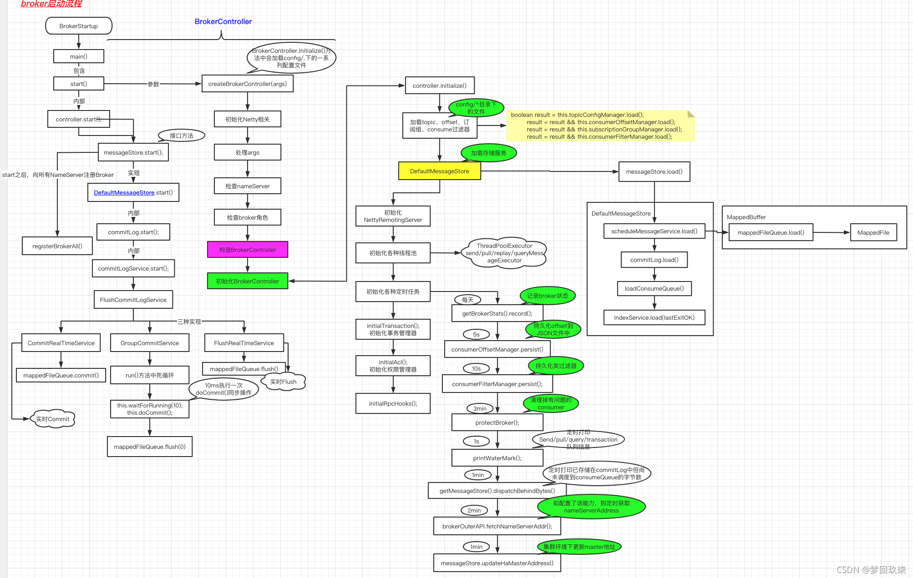
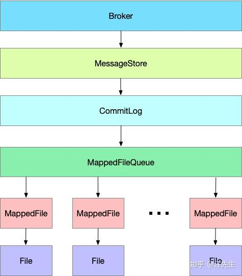

    这是rocketmq系列的第三篇文章，主要介绍的是Broker。

<style>
.my-code {
   color: orange;
}
.orange {
   color: rgb(255, 53, 2)
}
.red {
   color: red
}
</style>

# 一、核心组件--Broker
消息存储与转发核心节点，支持主从架构（master-slave）、数据分片（queue）。
<!-- more -->

接下来做一个整体概述。
##  1.1、Broker与NameServer的交互机制
注册与心跳

### 1.1.1、启动时注册
Broker启动时，会向配置的所有NameServer发送注册请求，将自己的信息（IP、端口、topic配置）写入每个NameServer

在Broker的配置文件中，需显示指定所有NameServer地址（以分号分隔）：
```
namesrvAddr=192.168.0.1:9876;192.168.0.2:9876;192.168.0.3:9876
```

> 为什么需要连接所有nameserver？
>
> - **namserver的无状态性**：nameserver节点之间不互相通信，每个节点独立存储路由信息。
> - **数据同步需求**：brokder需要将自己的元数据（如topic、queue信息、Broker地址等）注册到所有NameServer节点，确保每个NameServer都有完整的路由表。
> - **高可用保障**：即使部分NameServer宕机，其他NameServer扔能提供服务，生产者和消费者可以通过任意存活的NameServer获取路由信息。

### 1.1.2、定时心跳
Broker默认每30秒向所有NameServer发送一次心跳包，更新自身的存活状态（TCP长连接，心跳保活）。

### 1.1.3、故障感知
- NameServer若在120秒内未收到Broker心跳，则认为该Broker下线，将其从路由表中剔除。
- Broker会持续尝试与所有NameServer保持连接，即使某个NameServer暂时不可用，也会在恢复后自动重新连接。


## 1.2、Broker的数据存储
`Broker`的核心存储主要依赖三类文件，均位于<code class="my-code">${RocketMQ_HOME}/store</code>目录下：

- commitLog
- consumeQueue
- indexFile

### 1.2.1. CommitLog
- **作用**：消息主体以及元数据的存储主体，所有消息的主体内容按顺序写入CommitLog文件（无论Topic或Queue）。
- **文件结构**：
  - `CommitLog`文件保存于<code class="my-code">${Rocket_Home}/store/commitlog</code>目录中。
  - 
  - 单个文件默认1GB，写满后新建文件，文件名以起始偏移量命名（如00000000000000）。
  - 每条消息的存储格式：`消息长度+消息内容`，包含Topic、QueueID、消息体、Tag等元数据。


### 1.2.2. ConsumeQueue
- **作用**：消息的逻辑队列索引，按Topic和Queue分片，记录消息在CommitLog中的位置。
  - 消息消费队列，引入的目的主要是提高消息消费的性能，由于RocketMQ是基于主题topic的订阅模式，消息消费是针对主题进行的，如果要遍历commitlog文件中根据topic检索消息是非常低效的。
- **文件结构**：
  - `ConsumeQueue`文件可以看成是基于Topic的CommitLog索引文件，故ConsumeQueue文件夹的组织方式如下：<code class="my-code">topic/queue/file</code>三层组织结构，具体存储路径为：<code class="my-code">$HOME/store/consumequeue/{topic}/{queueId}/{fileName}</code>
  - 
  - 每个ConsumeQueue文件对应一个Queue，默认存储30w条索引（每条20字节）。
  - 每条索引包含：`CommitLog Offset（8B）+ 消息长度（4B） + Tag哈希值（8B）`。

### 1.2.3. IndexFile【索引文件】
- **作用**：支持按`Message Key`或`时间范围`快速查询消息。
- **文件结构**：
  - 
  - Index文件的存储位置是：<code class="my-code">{fileName}</code>，文件名fileName是以`创建时的时间戳`(YYYYMMDDHHMMSS)命名的
  - 单个文件大小固定（约400MB），存储哈希索引（Key的Hash值 —> CommitLog Offset）。


## 1.3、Broker的主从
在 RocketMQ 的集群模式中，Broker 分为 Master 与 Slave，一个 Master 可以对应多个 Slave，但是一个 Slave 只能对应一个 Master。
> 每个 Broker(主从都会) 与 Name Server 集群中的所有节点建立长连接，定时注册 Topic 信息到所有 Name Server。


### 1.3.1、消息复制
broker master和slave的消息同步，有两种模式：同步复制和异步复制。

#### 1.3.1.1、同步复制
生产者发送消息后，Master 接收到存储消息请求，将消息数据同步给 Slave 后，才将存储结果返回给生产者。同步复制模式下，发送消息会有一定延迟，系统吞吐量也会降低。

#### 1.3.1.2、异步复制
生产者发送消息后，Master 接收到存储消息请求，将消息存储后，直接将存储结果返回给生产者。 Master 和 Slave 再通过异步的方式同步数据，这种复制模式具有较小的延迟，可以实现比较高的吞吐量。
> 若 Master 出现故障，有些数据可能未写入 Slave ，未同步的数据可能丢失。

### 1.3.2、复制流程
复制流程分为两个部分：<code class="my-code">元数据复制</code>和<code class="my-code">消息数据复制</code>。
- 主从服务器同步主题，消费者进度，延迟消费进度，消费者配置数据
- 主从服务器同步消息数据

#### 1.3.2.1、元数据复制
Slave Broker 定时任务每隔 10 秒会同步元数据，包括主题，消费进度，延迟消费进度，消费者配置。
```java
public void syncAll() {
  //同步主题
  this.syncTopicConfig();
  //同步消费者进度文件
  this.syncConsumer0ffset ();
  //延迟消息进度
  this.syncDelayoffset();
  //消费组配置
  this.syncSubscriptionGroupConfig();
}
```
**同步主题**时, Slave Broker 向 Master Broker 发送 RPC 请求，返回数据后，首先加入本地缓存里，然后持久化到本地。
```java
public void syncTopicConfig() {
  String masterAddrBak = this.masterAddr;
  if (masterAddrBak != null && !masterAddrBak.eauals(brokercontroller.getBrokerAddr())) {
    try {
      //向master发送RPC请求
      TopicConfigSerializeWrapper topicWrapper = this.brokercontroller.getBrokerOuterAPI().getAllTopicCconfig(masterAddrBak);
      if (!this.brokerController.getTopicConfigManager().getDataVersion().equals(topicWrapper.getDataVersion())) {
        this.brokerController.getTopicConfigManager().getDataVersion().assignNewOne(topicWrapper.getDataVersion());
        this.brokerController.getTopicConfigManager().getTopicConfigTable().clear();
        this.brokerController.getTopicConfigManager().getTopicConfigTable().outAll(topicvrapper, aetTopicConfiatable);
        //持久化本地
        this.brokerController.getTopicConfigManager().persist();
        log.info("Update slave topic config from master, {}", masterAddrBak);
      }
    } catch (Exception e) {
      log.error("SyncTopicConfig Exception, {}", masterAddrBak, e);
    }
  }
}
```


#### 1.3.2.2、消息数据复制
下图是 Master 和 Slave 消息数据同步的流程图。


##### 1、Master 启动后监听指定端口；
Master 启动后创建 AcceptSocketService 服务 , 用来创建客户端到服务端的 TCP 链接。

```java
/**
 * Listens to slave connections to create {@link HAConnection}.
 */
class AcceptSocketService extends ServiceThread {
  private final SocketAddress socketAddressListen;
  private ServerSocketChannel serverSocketChannel;
  private Selector selector;

  public AcceptSocketService(final int port) {
    this.socketAddressListen = new InetSocketAddress(port);
  }

  /**
   * Starts listening to slave connections.
   *
   * @throws Exception If fails.
   */
  public void beginAccept() throws Exception {
    this.serverSocketChannel = ServerSocketChannel.open();
    this.selector = RemotingUtil.openSelector();
    this.serverSocketChannel.socket().setReuseAddress(true);
    this.serverSocketChannel.socket().bind(this.socketAddressListen);
    this.serverSocketChannel.configureBlocking(false);
    this.serverSocketChannel.register(this.selector, SelectionKey.OP_ACCEPT);
  }

  /**
   * {@inheritDoc}
   */
  @Override
  public void shutdown(final boolean interrupt) {
    super.shutdown(interrupt);
    try {
      this.serverSocketChannel.close();
      this.selector.close();
    } catch (IOException e) {
      log.error("AcceptSocketService shutdown exception", e);
    }
  }

  /**
   * {@inheritDoc}
   */
  @Override
  public void run() {
    log.info(this.getServiceName() + " service started");

    while (!this.isStopped()) {
      try {
        this.selector.select(1000);
        Set<SelectionKey> selected = this.selector.selectedKeys();

        if (selected != null) {
          for (SelectionKey k : selected) {
            if ((k.readyOps() & SelectionKey.OP_ACCEPT) != 0) {
              SocketChannel sc = ((ServerSocketChannel) k.channel()).accept();

              if (sc != null) {
                HAService.log.info("HAService receive new connection, "
                        + sc.socket().getRemoteSocketAddress());
                try {
                  HAConnection conn = new HAConnection(HAService.this, sc);
                  conn.start();
                  HAService.this.addConnection(conn);
                } catch (Exception e) {
                  log.error("new HAConnection exception", e);
                  sc.close();
                }
              }
            } else {
              log.warn("Unexpected ops in select " + k.readyOps());
            }
          }

          selected.clear();
        }
      } catch (Exception e) {
        log.error(this.getServiceName() + " service has exception.", e);
      }
    }

    log.info(this.getServiceName() + " service end");
  }

  /**
   * {@inheritDoc}
   */
  @Override
  public String getServiceName() {
    return AcceptSocketService.class.getSimpleName();
  }
}
```
RocketMQ 抽象了链接对象 HAConnection , HAConnection 会启动两个线程，分别用于读服务和写服务：
- 读服务(ReadSocketService)：处理 Slave 发送的请求
- 写服务(WriteSocketService)：用于向 Slave 传输数据

##### 2、Slave 启动后，尝试连接 Master ，建立 TCP 连接；
HAClient 是客户端 Slave 的核心类 ，负责和 Master 创建连接和数据交互。
```java
private boolean connectMaster() throws ClosedChannelException {
    if (null == socketChannel) {
        String addr = this.masterAddress.get();
        if (addr != null) {
            SocketAddress socketAddress = RemotingUtil.string2SocketAddress(addr);
            if (socketAddress != null) {
                this.socketChannel = RemotingUtil.connect(socketAddress);
                if (this.socketChannel != null) {
                    this.socketChannel.register(this.selector, SelectionKey.OP_READ);
                }
            }
        }
        this.currentReportedOffset = HAService.this.defaultMessageStore.getMaxPhyOffset();
        this.lastWriteTimestamp = System.currentTimeMillis();
    }
    return this.socketChannel != null;
}
```
客户端在启动后，首先尝试连接 Master , 查询当前消息存储中最大的物理偏移量 ，并存储在变量 currentReportedOffset 里。

##### 3、Slave 判定拉取间隔是否大于 5 秒，则向 Master 汇报已拉取消息偏移量；
```java
if (this.isTimeToReportOffset()) {
    boolean result = this.reportSlaveMaxOffset(this.currentReportedOffset);
    if (!result) {
        this.closeMaster();
    }
}
```
上报进度的数据格式是一个 Long 类型的 Offset , 8个字节 , 非常简洁 。

##### 4、Master 解析请求偏移量，从消息文件中检索该偏移量后的所有消息；
当 Slave 上报数据到 Master 时，触发 SelectionKey.OP_READ 事件，Master 将请求交由 ReadSocketService 服务处理：
```java
public class HAConnection {
    public class ReadSocketService extends ServiceThread {
      public void run() {
        HAConnection.log.info(this.getServiceName() + " service started");
        while (!this.isStopped()) {
          try {
              //最多阻塞1秒
            this.selector.select(1000);
            boolean ok = this.processReadEvent();
            if (!ok) {
              HAConnection.log.error("processReadEvent error");
              break;
            }
            //slave 超过20s没有返回数据，断开连接
            long interval = HAConnection.this.haService.getDefaultMessageStore().getSystemClock().now() - this.lastReadTimestamp;
            //超过20s没有返回数据，断开连接
            if (interval > HAConnection.this.haService.getDefaultMessageStore().getMessageStoreConfig().getHaHousekeepingInterval()) {
              log.warn("ha housekeeping, found this connection[" + HAConnection.this.clientAddr + "] expired, " + interval);
              break;
            }
          } catch (Exception e) {
            HAConnection.log.error(this.getServiceName() + " service has exception.", e);
            break;
          }
        }
      }
      ...
    }
}
```
当 Slave Broker 传递了自身 commitlog 的 maxPhyOffset 时，Master 会马上中断 selector.select(1000)，执行 processReadEvent 方法。

processReadEvent 方法的核心逻辑是设置 Slave 的当前进度 offset ，然后通知复制线程当前的复制进度。

写服务 WriteSocketService 从消息文件中检索该偏移量后的所有消息，并将消息数据发送给 Slave。

##### 5、Slave 接收到数据，将消息数据 append 到消息文件 commitlog 里 。
首先 HAClient 类中调用 dispatchReadRequest 方法 ， 解析出消息数据 ；
```java
private boolean dispatchReadRequest() {
            final int msgHeaderSize = 8 + 4; // phyoffset + size
            int readSocketPos = this.byteBufferRead.position();

            while (true) {
                int diff = this.byteBufferRead.position() - this.dispatchPosition;
                if (diff >= msgHeaderSize) {
                    long masterPhyOffset = this.byteBufferRead.getLong(this.dispatchPosition);
                    int bodySize = this.byteBufferRead.getInt(this.dispatchPosition + 8);

                    long slavePhyOffset = HAService.this.defaultMessageStore.getMaxPhyOffset();

                    if (slavePhyOffset != 0) {
                        if (slavePhyOffset != masterPhyOffset) {
                            log.error("master pushed offset not equal the max phy offset in slave, SLAVE: "
                                + slavePhyOffset + " MASTER: " + masterPhyOffset);
                            return false;
                        }
                    }

                    if (diff >= (msgHeaderSize + bodySize)) {
                        byte[] bodyData = new byte[bodySize];
                        this.byteBufferRead.position(this.dispatchPosition + msgHeaderSize);
                        this.byteBufferRead.get(bodyData);

                        HAService.this.defaultMessageStore.appendToCommitLog(masterPhyOffset, bodyData);

                        this.byteBufferRead.position(readSocketPos);
                        this.dispatchPosition += msgHeaderSize + bodySize;

                        if (!reportSlaveMaxOffsetPlus()) {
                            return false;
                        }

                        continue;
                    }
                }

                if (!this.byteBufferRead.hasRemaining()) {
                    this.reallocateByteBuffer();
                }

                break;
            }

            return true;
        }
```
然后将消息数据 append 到本地的消息存储。
```java
HAService.this.defaultMessageStore.appendToCommitLog(masterPhyOffset, bodyData);
this.byteBufferRead.position(readSocketPos);
this.dispatchPosition += msgHeaderSize + bodySize;
```

### 1.3.3、同步的实现
从数据复制流程图，我们发觉数据复制本身就是一个异步执行的，但是同步是如何实现的呢？

Master Broker 接收到写入消息的请求后 ，调用 Commitlog 的 aysncPutMessage 方法写入消息。
```java
public class CommitLog {
  public CompletableFuture<PutMessageResult> asyncPutMessage(final MessageExtBrokerInner msg) {
      CompletableFuture<PutMessageStatus> flushResultFuture = submitFlushRequest(result, putMessageResult, msg);
      CompletableFuture<PutMessageStatus> replicaResultFuture = submitReplicaRequest(result, putMessageResult, msg);
      return flushResultFuture.thenCombine(replicaResultFuture, (flushStatus, replicaStatus) -> {
          if (flushStatus != PutMessageStatus.PUT_OK) {
              putMessageResult.setPutMessageStatus(PutMessageStatus.FLUSH_DISK_TIMEOUT);
          }
          if (replicaStatus != PutMessageStatus.PUT_OK) {
              putMessageResult.setPutMessageStatus(replicaStatus);
          }
          return putMessageResult;
      });
  }
}
```
这段代码中，当 commitLog 执行完 appendMessage 后， 需要执行刷盘任务和同步复制两个任务。
但这两个任务并不是同步执行，而是异步的方式，使用了 CompletableFuture 这个异步神器。
当 HAConnection 读服务接收到 Slave 的进度反馈，发现消息数据复制成功，则唤醒 future 。
```java
public class HAService {
  class GroupTransferService extends ServiceThread {
    private void doWaitTransfer() {
      synchronized (this.requestsRead) {
        if (!this.requestsRead.isEmpty()) {
          for (CommitLog.GroupCommitRequest req : this.requestsRead) {
            boolean transferOK = HAService.this.push2SlaveMaxOffset.get() >= req.getNextOffset();
            long waitUntilWhen = HAService.this.defaultMessageStore.getSystemClock().now()
                    + HAService.this.defaultMessageStore.getMessageStoreConfig().getSyncFlushTimeout();
            while (!transferOK && HAService.this.defaultMessageStore.getSystemClock().now() < waitUntilWhen) {
              this.notifyTransferObject.waitForRunning(1000);
              transferOK = HAService.this.push2SlaveMaxOffset.get() >= req.getNextOffset();
            }

            if (!transferOK) {
              log.warn("transfer messsage to slave timeout, " + req.getNextOffset());
            }
            //复制完成，则唤醒future操作
            req.wakeupCustomer(transferOK ? PutMessageStatus.PUT_OK : PutMessageStatus.FLUSH_SLAVE_TIMEOUT);
          }

          this.requestsRead.clear();
        }
      }
    }
  }
}
```


# 二、Broker启动
运行的是 BrokerStartup  的main 方法：
```java
/* main 方法启动
 * @param args
 */
public static void main(String[] args) {
    //创建brokerController
    start(createBrokerController(args));
}

//1.创建 BrokerController instance
final BrokerController controller = new BrokerController(
        brokerConfig,
        nettyServerConfig,
        nettyClientConfig,
        messageStoreConfig);
// remember all configs to prevent discard
controller.getConfiguration().registerConfig(properties);
//2.进行初始化 Broker controller
boolean initResult = controller.initialize();
```
启动过程，分成2部分
1. BrokerController的创建及初始化。
2. BrokerController的启动。


# 三、核心组件-BrokerController
`BrokerController` 是 Apache RocketMQ 中负责管理 Broker 的核心类。它负责启动、停止和管理 Broker 的各个模块，包括消息存储、消息消费、网络通信等。

源码结构如下：
```java
public BrokerController(
        final BrokerConfig brokerConfig,
        final NettyServerConfig nettyServerConfig,
        final NettyClientConfig nettyClientConfig,
        final MessageStoreConfig messageStoreConfig
    ) {
        //broker 配置信息
        this.brokerConfig = brokerConfig;
        //nettyServer配置信息
        this.nettyServerConfig = nettyServerConfig;
        //nettyClient 配置信息
        this.nettyClientConfig = nettyClientConfig;
        //store 配置信息
        this.messageStoreConfig = messageStoreConfig;
        //consumer 偏移量管理器，会读取store/config/consumerOffset.json  json 配置文件，维护了offsetTable Map 结构
        this.consumerOffsetManager = new ConsumerOffsetManager(this);
        //topic 配置管理器，会读取store/config/topics.json
        this.topicConfigManager = new TopicConfigManager(this);
        //拉去消息处理器，用来处理消费端消息拉去，关联的业务code 为RequestCode.PULL_MESSAGE
        this.pullMessageProcessor = new PullMessageProcessor(this);
        //
        this.pullRequestHoldService = new PullRequestHoldService(this);
        //
        this.messageArrivingListener = new NotifyMessageArrivingListener(this.pullRequestHoldService);
        //
        this.consumerIdsChangeListener = new DefaultConsumerIdsChangeListener(this);
        this.consumerManager = new ConsumerManager(this.consumerIdsChangeListener);
        // 消费过滤管理器会读取store/config/consumerFilter.json
        this.consumerFilterManager = new ConsumerFilterManager(this);
        //生产者管理器
        this.producerManager = new ProducerManager();
        //用于清除不活动的连接，可以看到里面有一些扫描生产者以及消费者不活动连接的方法
        this.clientHousekeepingService = new ClientHousekeepingService(this);
        //
        this.broker2Client = new Broker2Client(this);
        this.subscriptionGroupManager = new SubscriptionGroupManager(this);
        //NettyClient 初始化
        this.brokerOuterAPI = new BrokerOuterAPI(nettyClientConfig);
        //
        this.filterServerManager = new FilterServerManager(this);
        //
        this.slaveSynchronize = new SlaveSynchronize(this);
        //发送线程池队列
        this.sendThreadPoolQueue = new LinkedBlockingQueue<Runnable>(this.brokerConfig.getSendThreadPoolQueueCapacity());
        //拉取线程池队列
        this.pullThreadPoolQueue = new LinkedBlockingQueue<Runnable>(this.brokerConfig.getPullThreadPoolQueueCapacity());
        //查询线程池队列
        this.queryThreadPoolQueue = new LinkedBlockingQueue<Runnable>(this.brokerConfig.getQueryThreadPoolQueueCapacity());
        this.clientManagerThreadPoolQueue = new LinkedBlockingQueue<Runnable>(this.brokerConfig.getClientManagerThreadPoolQueueCapacity());
        this.consumerManagerThreadPoolQueue = new LinkedBlockingQueue<Runnable>(this.brokerConfig.getConsumerManagerThreadPoolQueueCapacity());
        //broker 状态管理器
        this.brokerStatsManager = new BrokerStatsManager(this.brokerConfig.getBrokerClusterName());
        this.setStoreHost(new InetSocketAddress(this.getBrokerConfig().getBrokerIP1(), this.getNettyServerConfig().getListenPort()));
        //
        this.brokerFastFailure = new BrokerFastFailure(this);
        this.configuration = new Configuration(
            log,
            BrokerPathConfigHelper.getBrokerConfigPath(),
            this.brokerConfig, this.nettyServerConfig, this.nettyClientConfig, this.messageStoreConfig
        );
    }
```
`BrokerController`的主要模块：

| 模块               | 说明                                                                 |
|--------------------|--------------------------------------------------------------------|
| **MessageStore**   | 负责消息的存储和检索，包括 CommitLog、ConsumeQueue 和 IndexFile。   |
| **RemotingServer** | 负责处理网络请求，与 Producer 和 Consumer 通信。                    |
| **BrokerStatsManager** | 负责统计 Broker 的运行状态和性能指标。                           |
| **BrokerOuterAPI** | 负责与 NameServer 通信，注册和上报 Broker 信息。                    |
| **PullMessageProcessor** | 负责处理消费者的消息拉取请求。                                 |
| **SendMessageProcessor** | 负责处理生产者的消息写入请求。                                 |


# 四、Broker启动【第1步】BrokerController的创建与初始化

## 4.1、BrokerController初始化流程
1. 载入各种配置文件（topic配置、消费偏移量、订阅群组、消费过滤）。
2. 初始化DefaultMessageStore消息存储器，并load：载入CommitLog、ConsumeQueue、载入索引文件。
3. 构造NettyRemotingServer netty远程通信服务器（普通+vip）、9种执行器（sendMessageExecutor、pullMessageExecutor、replyMessageExecutor、queryMessageExecutor、adminBrokerExecutor、clientManageExecutor、heartbeatExecutor、endTransactionExecutor、consumerManageExecutor）
4. registerProcessor()：注册处理器（使用上面9个执行器，分别注册到普通远程通信服务器、VIP远程通信服务器）具体通信机制见 RocketMQ详解（三）核心设计原理。
5. 初始化定时任务：BrokerStats当天数据统计、每5S持久化一次消费Offset、每10s持久化一次消费者filter、每3分钟执行一次broker保护（默认不执行）、每1s打印水位日志（线程池待处理队列）、每1分钟打印commitLog分发滞后bytes、每2分钟（请求http://jmenv.tbsite.net:8080/rocketmq/nsaddr）拉取一次nameserver地址、主节点每1分钟（开启DLeger主从切换）打印从滞后主offset。
6. 注册SSL证书变化监听器。
7. 初始化事务相关服务、监听器。
8. 初始化AccessValidator
9. 初始化RPC请求钩子RPCHook（远程通信服务端+VIP远程通信服务端），包含doBeforeRequest请求前、doAfterResponse请求后2个方法。

```java
public boolean initialize() throws CloneNotSupportedException {
    boolean result = this.topicConfigManager.load();
    //加载对应管理器的配置文件
    result = result && this.consumerOffsetManager.load();
    result = result && this.subscriptionGroupManager.load();
    result = result && this.consumerFilterManager.load();

    if (result) {
        try {
            this.messageStore =
                new DefaultMessageStore(this.messageStoreConfig, this.brokerStatsManager, this.messageArrivingListener,
                    this.brokerConfig);
            this.brokerStats = new BrokerStats((DefaultMessageStore) this.messageStore);
            //load plugin
            Mes[2020-09-08-rocketmq-Broker.md](2020-09-08-rocketmq-Broker.md)sageStorePluginContext context = new MessageStorePluginContext(messageStoreConfig, brokerStatsManager, messageArrivingListener, brokerConfig);
            this.messageStore = MessageStoreFactory.build(context, this.messageStore);
            this.messageStore.getDispatcherList().addFirst(new CommitLogDispatcherCalcBitMap(this.brokerConfig, this.consumerFilterManager));
        } catch (IOException e) {
            result = false;
            log.error("Failed to initialize", e);
        }
    }
    //加载CommitLog 文件
    result = result && this.messageStore.load();

    if (result) {
        //初始化NettyServer
        this.remotingServer = new NettyRemotingServer(this.nettyServerConfig, this.clientHousekeepingService);
        NettyServerConfig fastConfig = (NettyServerConfig) this.nettyServerConfig.clone();
        fastConfig.setListenPort(nettyServerConfig.getListenPort() - 2);
        //初始化VIP NettyServer 端口为在109011 -2 
        this.fastRemotingServer = new NettyRemotingServer(fastConfig, this.clientHousekeepingService);
        //初始化一些线程池
        this.sendMessageExecutor = new BrokerFixedThreadPoolExecutor(
            this.brokerConfig.getSendMessageThreadPoolNums(),
            this.brokerConfig.getSendMessageThreadPoolNums(),
            1000 * 60,
            TimeUnit.MILLISECONDS,
            this.sendThreadPoolQueue,
            new ThreadFactoryImpl("SendMessageThread_"));

        this.pullMessageExecutor = new BrokerFixedThreadPoolExecutor(
            this.brokerConfig.getPullMessageThreadPoolNums(),
            this.brokerConfig.getPullMessageThreadPoolNums(),
            1000 * 60,
            TimeUnit.MILLISECONDS,
            this.pullThreadPoolQueue,
            new ThreadFactoryImpl("PullMessageThread_"));

        this.queryMessageExecutor = new BrokerFixedThreadPoolExecutor(
            this.brokerConfig.getQueryMessageThreadPoolNums(),
            this.brokerConfig.getQueryMessageThreadPoolNums(),
            1000 * 60,
            TimeUnit.MILLISECONDS,
            this.queryThreadPoolQueue,
            new ThreadFactoryImpl("QueryMessageThread_"));

        this.adminBrokerExecutor =
            Executors.newFixedThreadPool(this.brokerConfig.getAdminBrokerThreadPoolNums(), new ThreadFactoryImpl(
                "AdminBrokerThread_"));

        this.clientManageExecutor = new ThreadPoolExecutor(
            this.brokerConfig.getClientManageThreadPoolNums(),
            this.brokerConfig.getClientManageThreadPoolNums(),
            1000 * 60,
            TimeUnit.MILLISECONDS,
            this.clientManagerThreadPoolQueue,
            new ThreadFactoryImpl("ClientManageThread_"));

        this.consumerManageExecutor =
            Executors.newFixedThreadPool(this.brokerConfig.getConsumerManageThreadPoolNums(), new ThreadFactoryImpl(
                "ConsumerManageThread_"));
        //注册消息处理器，针对客户端发过来的消息code，会有针对的处理器进行处理
        this.registerProcessor();

        final long initialDelay = UtilAll.computNextMorningTimeMillis() - System.currentTimeMillis();
        final long period = 1000 * 60 * 60 * 24;
        //执行定定时任务
        this.scheduledExecutorService.scheduleAtFixedRate(new Runnable() {
            @Override
            public void run() {
                try {
                    BrokerController.this.getBrokerStats().record();
                } catch (Throwable e) {
                    log.error("schedule record error.", e);
                }
            }
        }, initialDelay, period, TimeUnit.MILLISECONDS);

       //定时 保存consumerOffset.json 文件
        this.scheduledExecutorService.scheduleAtFixedRate(new Runnable() {
            @Override
            public void run() {
                try {
                    BrokerController.this.consumerOffsetManager.persist();
                } catch (Throwable e) {
                    log.error("schedule persist consumerOffset error.", e);
                }
            }
        }, 1000 * 10, this.brokerConfig.getFlushConsumerOffsetInterval(), TimeUnit.MILLISECONDS);

        //定时保存 consumerfilter.json 文件
        this.scheduledExecutorService.scheduleAtFixedRate(new Runnable() {
            @Override
            public void run() {
                try {
                    BrokerController.this.consumerFilterManager.persist();
                } catch (Throwable e) {
                    log.error("schedule persist consumer filter error.", e);
                }
            }
        }, 1000 * 10, 1000 * 10, TimeUnit.MILLISECONDS);
        //

        this.scheduledExecutorService.scheduleAtFixedRate(new Runnable() {
            @Override
            public void run() {
                try {
                    BrokerController.this.protectBroker();
                } catch (Throwable e) {
                    log.error("protectBroker error.", e);
                }
            }
        }, 3, 3, TimeUnit.MINUTES);
        //打印水印日志

        this.scheduledExecutorService.scheduleAtFixedRate(new Runnable() {
            @Override
            public void run() {
                try {
                    BrokerController.this.printWaterMark();
                } catch (Throwable e) {
                    log.error("printWaterMark error.", e);
                }
            }
        }, 10, 1, TimeUnit.SECONDS);
        //

        this.scheduledExecutorService.scheduleAtFixedRate(new Runnable() {

            @Override
            public void run() {
                try {
                    log.info("dispatch behind commit log {} bytes", BrokerController.this.getMessageStore().dispatchBehindBytes());
                } catch (Throwable e) {
                    log.error("schedule dispatchBehindBytes error.", e);
                }
            }
        }, 1000 * 10, 1000 * 60, TimeUnit.MILLISECONDS);

        //
        if (this.brokerConfig.getNamesrvAddr() != null) {
            this.brokerOuterAPI.updateNameServerAddressList(this.brokerConfig.getNamesrvAddr());
            log.info("Set user specified name server address: {}", this.brokerConfig.getNamesrvAddr());
        } else if (this.brokerConfig.isFetchNamesrvAddrByAddressServer()) {
            this.scheduledExecutorService.scheduleAtFixedRate(new Runnable() {

                @Override
                public void run() {
                    try {
                        BrokerController.this.brokerOuterAPI.fetchNameServerAddr();
                    } catch (Throwable e) {
                        log.error("ScheduledTask fetchNameServerAddr exception", e);
                    }
                }
            }, 1000 * 10, 1000 * 60 * 2, TimeUnit.MILLISECONDS);
        }

        if (BrokerRole.SLAVE == this.messageStoreConfig.getBrokerRole()) {
            if (this.messageStoreConfig.getHaMasterAddress() != null && this.messageStoreConfig.getHaMasterAddress().length() >= 6) {
                this.messageStore.updateHaMasterAddress(this.messageStoreConfig.getHaMasterAddress());
                this.updateMasterHAServerAddrPeriodically = false;
            } else {
                this.updateMasterHAServerAddrPeriodically = true;
            }

            this.scheduledExecutorService.scheduleAtFixedRate(new Runnable() {

                @Override
                public void run() {
                    try {
                        BrokerController.this.slaveSynchronize.syncAll();
                    } catch (Throwable e) {
                        log.error("ScheduledTask syncAll slave exception", e);
                    }
                }
            }, 1000 * 10, 1000 * 60, TimeUnit.MILLISECONDS);
        } else {
            this.scheduledExecutorService.scheduleAtFixedRate(new Runnable() {

                @Override
                public void run() {
                    try {
                        BrokerController.this.printMasterAndSlaveDiff();
                    } catch (Throwable e) {
                        log.error("schedule printMasterAndSlaveDiff error.", e);
                    }
                }
            }, 1000 * 10, 1000 * 60, TimeUnit.MILLISECONDS);
        }
    }

    return result;
}
```

### 4.1.1、第1步：初始化messageStore消息存储器
消息存储实现类为：org.apache.rocketmq.store.DefaultMessageStore，在borker启动创建BrokerController实例时，会创建DefaultMessageStore用于消息存储。

> 具体内容：查看第六章节，内部进行详细介绍。


### 4.1.2、第2步：初始化网络通信模块
RemotingServer负责处理网络通信的核心组件。负责与客户端（Producer和Consumer）进行通信，处理消息的发送、拉取、查询等请求。
```java
// 初始化网络通信模块
this.remotingServer = new NettyRemotingServer(this.nettyServerConfig);
this.fastRemotingServer = new NettyRemotingServer(this.nettyServerConfig);
```

#### 4.1.2.1、RemotingServer的工作流程
1. 初始化Netty服务器
2. 注册请求处理器
   1. this.registerProcessor();根据请求类型（如消息发送、消息拉取），注册相应的处理器
3. 启动Netty服务器
4. 处理客户端请求
5. 管理连接

#### 4.1.2.2、注册请求处理器 this.registerProcessor()
```java
public void registerProcessor() {
    /**
     * SendMessageProcessor
     */
    SendMessageProcessor sendProcessor = new SendMessageProcessor(this);
    sendProcessor.registerSendMessageHook(sendMessageHookList);
    sendProcessor.registerConsumeMessageHook(consumeMessageHookList);

    this.remotingServer.registerProcessor(RequestCode.SEND_MESSAGE, sendProcessor, this.sendMessageExecutor);
    this.remotingServer.registerProcessor(RequestCode.SEND_MESSAGE_V2, sendProcessor, this.sendMessageExecutor);
    this.remotingServer.registerProcessor(RequestCode.SEND_BATCH_MESSAGE, sendProcessor, this.sendMessageExecutor);
    this.remotingServer.registerProcessor(RequestCode.CONSUMER_SEND_MSG_BACK, sendProcessor, this.sendMessageExecutor);
    this.fastRemotingServer.registerProcessor(RequestCode.SEND_MESSAGE, sendProcessor, this.sendMessageExecutor);
    this.fastRemotingServer.registerProcessor(RequestCode.SEND_MESSAGE_V2, sendProcessor, this.sendMessageExecutor);
    this.fastRemotingServer.registerProcessor(RequestCode.SEND_BATCH_MESSAGE, sendProcessor, this.sendMessageExecutor);
    this.fastRemotingServer.registerProcessor(RequestCode.CONSUMER_SEND_MSG_BACK, sendProcessor, this.sendMessageExecutor);
    /**
     * PullMessageProcessor
     */
    this.remotingServer.registerProcessor(RequestCode.PULL_MESSAGE, this.pullMessageProcessor, this.pullMessageExecutor);
    this.pullMessageProcessor.registerConsumeMessageHook(consumeMessageHookList);

    /**
     * ReplyMessageProcessor
     */
    ReplyMessageProcessor replyMessageProcessor = new ReplyMessageProcessor(this);
    replyMessageProcessor.registerSendMessageHook(sendMessageHookList);

    this.remotingServer.registerProcessor(RequestCode.SEND_REPLY_MESSAGE, replyMessageProcessor, replyMessageExecutor);
    this.remotingServer.registerProcessor(RequestCode.SEND_REPLY_MESSAGE_V2, replyMessageProcessor, replyMessageExecutor);
    this.fastRemotingServer.registerProcessor(RequestCode.SEND_REPLY_MESSAGE, replyMessageProcessor, replyMessageExecutor);
    this.fastRemotingServer.registerProcessor(RequestCode.SEND_REPLY_MESSAGE_V2, replyMessageProcessor, replyMessageExecutor);

    /**
     * QueryMessageProcessor
     */
    NettyRequestProcessor queryProcessor = new QueryMessageProcessor(this);
    this.remotingServer.registerProcessor(RequestCode.QUERY_MESSAGE, queryProcessor, this.queryMessageExecutor);
    this.remotingServer.registerProcessor(RequestCode.VIEW_MESSAGE_BY_ID, queryProcessor, this.queryMessageExecutor);

    this.fastRemotingServer.registerProcessor(RequestCode.QUERY_MESSAGE, queryProcessor, this.queryMessageExecutor);
    this.fastRemotingServer.registerProcessor(RequestCode.VIEW_MESSAGE_BY_ID, queryProcessor, this.queryMessageExecutor);

    /**
     * ClientManageProcessor
     */
    ClientManageProcessor clientProcessor = new ClientManageProcessor(this);
    this.remotingServer.registerProcessor(RequestCode.HEART_BEAT, clientProcessor, this.heartbeatExecutor);
    this.remotingServer.registerProcessor(RequestCode.UNREGISTER_CLIENT, clientProcessor, this.clientManageExecutor);
    this.remotingServer.registerProcessor(RequestCode.CHECK_CLIENT_CONFIG, clientProcessor, this.clientManageExecutor);

    this.fastRemotingServer.registerProcessor(RequestCode.HEART_BEAT, clientProcessor, this.heartbeatExecutor);
    this.fastRemotingServer.registerProcessor(RequestCode.UNREGISTER_CLIENT, clientProcessor, this.clientManageExecutor);
    this.fastRemotingServer.registerProcessor(RequestCode.CHECK_CLIENT_CONFIG, clientProcessor, this.clientManageExecutor);

    /**
     * ConsumerManageProcessor
     */
    ConsumerManageProcessor consumerManageProcessor = new ConsumerManageProcessor(this);
    this.remotingServer.registerProcessor(RequestCode.GET_CONSUMER_LIST_BY_GROUP, consumerManageProcessor, this.consumerManageExecutor);
    this.remotingServer.registerProcessor(RequestCode.UPDATE_CONSUMER_OFFSET, consumerManageProcessor, this.consumerManageExecutor);
    this.remotingServer.registerProcessor(RequestCode.QUERY_CONSUMER_OFFSET, consumerManageProcessor, this.consumerManageExecutor);

    this.fastRemotingServer.registerProcessor(RequestCode.GET_CONSUMER_LIST_BY_GROUP, consumerManageProcessor, this.consumerManageExecutor);
    this.fastRemotingServer.registerProcessor(RequestCode.UPDATE_CONSUMER_OFFSET, consumerManageProcessor, this.consumerManageExecutor);
    this.fastRemotingServer.registerProcessor(RequestCode.QUERY_CONSUMER_OFFSET, consumerManageProcessor, this.consumerManageExecutor);

    /**
     * EndTransactionProcessor
     */
    this.remotingServer.registerProcessor(RequestCode.END_TRANSACTION, new EndTransactionProcessor(this), this.endTransactionExecutor);
    this.fastRemotingServer.registerProcessor(RequestCode.END_TRANSACTION, new EndTransactionProcessor(this), this.endTransactionExecutor);

    /**
     * Default
     */
    AdminBrokerProcessor adminProcessor = new AdminBrokerProcessor(this);
    this.remotingServer.registerDefaultProcessor(adminProcessor, this.adminBrokerExecutor);
    this.fastRemotingServer.registerDefaultProcessor(adminProcessor, this.adminBrokerExecutor);
}
```
例如重要的请求处理器：<code class="my-code">SendMessageProcessor</code>
> 具体内容：查看第七章节，内部进行详细介绍。


### 4.1.3、第3步：初始化定时任务
会初始化多个定时任务，这些定时任务用于执行一些周期性的操作，例如清理过期消息、持久化消费进度、同步Broker状态等。

以下是 Broker 启动过程中初始化的主要定时任务：

#### 1. **清理过期消息**
- **任务名称**：`CleanExpiredMessageTask`
- **作用**：定期检查并清理过期的消息。
- **触发间隔**：默认 10 分钟。
- **配置参数**：`fileReservedTime`（消息保留时间）。

#### 2. **持久化消费进度**
- **任务名称**：`PersistConsumerOffsetTask`
- **作用**：定期将消费者的消费进度（Offset）持久化到磁盘。
- **触发间隔**：默认 5 秒。
- **配置参数**：`flushConsumerOffsetInterval`（持久化间隔）。

#### 3. **同步 Broker 状态**
- **任务名称**：`BrokerStatsManager`
- **作用**：定期向 NameServer 同步 Broker 的状态信息。
- **触发间隔**：默认 10 秒。
- **配置参数**：`brokerNotActiveTimeout`（Broker 不活跃超时时间）。

#### 4. **统计和监控**
- **任务名称**：`BrokerStatsManager`
- **作用**：定期收集和上报 Broker 的运行状态和性能指标。
- **触发间隔**：默认 1 分钟。
- **配置参数**：`brokerStatsInterval`（统计间隔）。

#### 5. **检查 HA 状态**
- **任务名称**：`HAService`
- **作用**：在主从模式下，定期检查主从同步状态。
- **触发间隔**：默认 5 秒。
- **配置参数**：`haSendHeartbeatInterval`（心跳间隔）。


# 五、Broker启动【第2步】BrokerController的启动
BrokerController#start方法。主要是启动各种服务和组件，例如messageStore、remotingServer、fastRemotingServer等等。
```java
public void start() throws Exception {
    //刷盘，同步，高可用开启
    if (this.messageStore != null) {
        this.messageStore.start();
    }
    //10911 NettyServer 端口绑定 ，开始服务
    if (this.remotingServer != null) {
        this.remotingServer.start();
    }
    //VIP 10911 -2 NettyServer 端口绑定 ，开始服务
    if (this.fastRemotingServer != null) {
        this.fastRemotingServer.start();
    }
    //初始化组装NettyClient bootstrap 信息
    if (this.brokerOuterAPI != null) {
        this.brokerOuterAPI.start();
    }
    //

    if (this.pullRequestHoldService != null) {
        this.pullRequestHoldService.start();
    }
    //开启检测不活动连接的服务，定时任务，每10s运行一次
    if (this.clientHousekeepingService != null) {
        this.clientHousekeepingService.start();
    }
    //
    if (this.filterServerManager != null) {
        this.filterServerManager.start();
    }
    //向nameServer 注册broker topic 信息
    this.registerBrokerAll(true, false);
    //每30s 向 每个nameServer 注册broker topic 信息
    this.scheduledExecutorService.scheduleAtFixedRate(new Runnable() {

        @Override
        public void run() {
            try {
                BrokerController.this.registerBrokerAll(true, false);
            } catch (Throwable e) {
                log.error("registerBrokerAll Exception", e);
            }
        }
    }, 1000 * 10, 1000 * 30, TimeUnit.MILLISECONDS);
    //
    if (this.brokerStatsManager != null) {
        this.brokerStatsManager.start();
    }
    //
    if (this.brokerFastFailure != null) {
        this.brokerFastFailure.start();
    }
}
```
主要是启动各种服务和组件，例如messageStore、remotingServer、fastRemotingServer等等。

## 5.1、启动小结



# 六、MessageStore【消息存储器】
什么是MessageStore？是核心模块，负责消息的存储、检索和管理。

消息存储实现类为：<code class="my-code">org.apache.rocketmq.store.DefaultMessageStore</code>，在borker启动创建<code class="my-code">BrokerController</code>实例时，会创建<code class="my-code">DefaultMessageStore</code>用于消息存储。

<code class="my-code">DefaultMessageStore</code>构造器如下：
- DefaultMessageStore 构造方法中会创建 <code class="my-code">commitlog、consumequeue</code> 等目录，期初目录下还没有文件。

```java
public DefaultMessageStore(final MessageStoreConfig messageStoreConfig, final BrokerStatsManager brokerStatsManager,
    final MessageArrivingListener messageArrivingListener, final BrokerConfig brokerConfig) throws IOException {
    //消息拉取长轮询模式消息到达监听器
    this.messageArrivingListener = messageArrivingListener;
    //broker配置
    this.brokerConfig = brokerConfig;
    //消息存储配置
    this.messageStoreConfig = messageStoreConfig;
    //broker状态管理器
    this.brokerStatsManager = brokerStatsManager;
    //MappedFile分配服务
    this.allocateMappedFileService = new AllocateMappedFileService(this);
    //初始化commitLog存储实现
    if (messageStoreConfig.isEnableDLegerCommitLog()) {
        this.commitLog = new DLedgerCommitLog(this);
    } else {
        this.commitLog = new CommitLog(this);
    }
    //cqTable
    this.consumeQueueTable = new ConcurrentHashMap<>(32);
    //cq队列文件刷盘服务
    this.flushConsumeQueueService = new FlushConsumeQueueService();
    //清除commitLog服务
    this.cleanCommitLogService = new CleanCommitLogService();
    //清除cq队列文件服务
    this.cleanConsumeQueueService = new CleanConsumeQueueService();

    this.storeStatsService = new StoreStatsService();
    //索引文件服务
    this.indexService = new IndexService(this);
    //HA机制服务
    if (!messageStoreConfig.isEnableDLegerCommitLog()) {
        this.haService = new HAService(this);
    } else {
        this.haService = null;
    }
    //commitLog消息分发，cq、indexFile文件构建
    this.reputMessageService = new ReputMessageService();

    this.scheduleMessageService = new ScheduleMessageService(this);
    //消息堆内存缓存
    this.transientStorePool = new TransientStorePool(messageStoreConfig);

    if (messageStoreConfig.isTransientStorePoolEnable()) {
        this.transientStorePool.init();
    }
    this.allocateMappedFileService.start();
    this.indexService.start();
    this.dispatcherList = new LinkedList<>();
    this.dispatcherList.addLast(new CommitLogDispatcherBuildConsumeQueue());
    this.dispatcherList.addLast(new CommitLogDispatcherBuildIndex());
    File file = new File(StorePathConfigHelper.getLockFile(messageStoreConfig.getStorePathRootDir()));
    MappedFile.ensureDirOK(file.getParent());
    MappedFile.ensureDirOK(getStorePathPhysic());
    MappedFile.ensureDirOK(getStorePathLogic());
    lockFile = new RandomAccessFile(file, "rw");
}
```
其主要属性为：
- MessageStoreConfig messageStoreConfig：消息存储服务配置类
- CommitLog commitLog：commitLog文件对应实现类
- ConcurrentMap<String/* topic /, ConcurrentMap<Integer/ queueId */, ConsumeQueue>> consumeQueueTable：消息队列缓存map，根据topic进行分组
- FlushConsumeQueueService flushConsumeQueueService：消息队列刷盘服务实现类
- CleanCommitLogService cleanCommitLogService：清除commitLog文件服务
- CleanConsumeQueueService cleanConsumeQueueService：清除消息队列服务
- IndexService indexService：索引服务
- AllocateMappedFileService allocateMappedFileService：MappedFile分配服务
- ReputMessageService reputMessageService：commitLog消息分发服务
- HAService haService：HA机制服务
- TransientStorePool transientStorePool：消息内存缓存
- MessageArrivingListener messageArrivingListener：消息拉取长轮询模式消息到达监听器
- BrokerConfig brokerConfig：broker配置类
- StoreCheckpoint storeCheckpoint：文件刷盘检测点

## 6.1、消息存储入口
消息存储入口位于<code class="my-code">org.apache.rocketmq.store.DefaultMessageStore#putMessage</code>
```java
@Override
public PutMessageResult putMessage(MessageExtBrokerInner msg) {
  PutMessageStatus checkStoreStatus = this.checkStoreStatus();
  if (checkStoreStatus != PutMessageStatus.PUT_OK) {
    return new PutMessageResult(checkStoreStatus, null);
  }

  PutMessageStatus msgCheckStatus = this.checkMessage(msg);
  if (msgCheckStatus == PutMessageStatus.MESSAGE_ILLEGAL) {
    return new PutMessageResult(msgCheckStatus, null);
  }

  long beginTime = this.getSystemClock().now();
  PutMessageResult result = this.commitLog.putMessage(msg);
  long elapsedTime = this.getSystemClock().now() - beginTime;
  if (elapsedTime > 500) {
    log.warn("not in lock elapsed time(ms)={}, bodyLength={}", elapsedTime, msg.getBody().length);
  }

  this.storeStatsService.setPutMessageEntireTimeMax(elapsedTime);

  if (null == result || !result.isOk()) {
    this.storeStatsService.getPutMessageFailedTimes().incrementAndGet();
  }

  return result;
}
```

## 6.2、调用commitLog.putMessage
```java
public PutMessageResult putMessage(final MessageExtBrokerInner msg) {
    // Set the storage time
    msg.setStoreTimestamp(System.currentTimeMillis());
    // Set the message body BODY CRC (consider the most appropriate setting
    // on the client)
    msg.setBodyCRC(UtilAll.crc32(msg.getBody()));
    // Back to Results
    AppendMessageResult result = null;

    StoreStatsService storeStatsService = this.defaultMessageStore.getStoreStatsService();

    String topic = msg.getTopic();
    int queueId = msg.getQueueId();

    final int tranType = MessageSysFlag.getTransactionValue(msg.getSysFlag());
    if (tranType == MessageSysFlag.TRANSACTION_NOT_TYPE
        || tranType == MessageSysFlag.TRANSACTION_COMMIT_TYPE) {
        // Delay Delivery
        if (msg.getDelayTimeLevel() > 0) {
            if (msg.getDelayTimeLevel() > this.defaultMessageStore.getScheduleMessageService().getMaxDelayLevel()) {
                msg.setDelayTimeLevel(this.defaultMessageStore.getScheduleMessageService().getMaxDelayLevel());
            }

            topic = TopicValidator.RMQ_SYS_SCHEDULE_TOPIC;
            queueId = ScheduleMessageService.delayLevel2QueueId(msg.getDelayTimeLevel());

            // Backup real topic, queueId
            MessageAccessor.putProperty(msg, MessageConst.PROPERTY_REAL_TOPIC, msg.getTopic());
            MessageAccessor.putProperty(msg, MessageConst.PROPERTY_REAL_QUEUE_ID, String.valueOf(msg.getQueueId()));
                msg.setPropertiesString(MessageDecoder.messageProperties2String(msg.getProperties()));

                msg.setTopic(topic);
                msg.setQueueId(queueId);
            }
        }

        InetSocketAddress bornSocketAddress = (InetSocketAddress) msg.getBornHost();
        if (bornSocketAddress.getAddress() instanceof Inet6Address) {
            msg.setBornHostV6Flag();
        }

        InetSocketAddress storeSocketAddress = (InetSocketAddress) msg.getStoreHost();
        if (storeSocketAddress.getAddress() instanceof Inet6Address) {
            msg.setStoreHostAddressV6Flag();
        }

        long elapsedTimeInLock = 0;

        MappedFile unlockMappedFile = null;
        MappedFile mappedFile = this.mappedFileQueue.getLastMappedFile();

        putMessageLock.lock(); //spin or ReentrantLock ,depending on store config
        try {
            long beginLockTimestamp = this.defaultMessageStore.getSystemClock().now();
            this.beginTimeInLock = beginLockTimestamp;

            // Here settings are stored timestamp, in order to ensure an orderly
            // global
            msg.setStoreTimestamp(beginLockTimestamp);

            if (null == mappedFile || mappedFile.isFull()) {
                mappedFile = this.mappedFileQueue.getLastMappedFile(0); // Mark: NewFile may be cause noise
            }
            if (null == mappedFile) {
                log.error("create mapped file1 error, topic: " + msg.getTopic() + " clientAddr: " + msg.getBornHostString());
                beginTimeInLock = 0;
                return new PutMessageResult(PutMessageStatus.CREATE_MAPEDFILE_FAILED, null);
            }

            result = mappedFile.appendMessage(msg, this.appendMessageCallback);
            switch (result.getStatus()) {
                case PUT_OK:
                    break;
                case END_OF_FILE:
                    unlockMappedFile = mappedFile;
                    // Create a new file, re-write the message
                    mappedFile = this.mappedFileQueue.getLastMappedFile(0);
                    if (null == mappedFile) {
                        // XXX: warn and notify me
                        log.error("create mapped file2 error, topic: " + msg.getTopic() + " clientAddr: " + msg.getBornHostString());
                        beginTimeInLock = 0;
                        return new PutMessageResult(PutMessageStatus.CREATE_MAPEDFILE_FAILED, result);
                    }
                    result = mappedFile.appendMessage(msg, this.appendMessageCallback);
                    break;
                case MESSAGE_SIZE_EXCEEDED:
                case PROPERTIES_SIZE_EXCEEDED:
                    beginTimeInLock = 0;
                    return new PutMessageResult(PutMessageStatus.MESSAGE_ILLEGAL, result);
                case UNKNOWN_ERROR:
                    beginTimeInLock = 0;
                    return new PutMessageResult(PutMessageStatus.UNKNOWN_ERROR, result);
                default:
                    beginTimeInLock = 0;
                    return new PutMessageResult(PutMessageStatus.UNKNOWN_ERROR, result);
            }

            elapsedTimeInLock = this.defaultMessageStore.getSystemClock().now() - beginLockTimestamp;
            beginTimeInLock = 0;
        } finally {
            putMessageLock.unlock();
        }

        if (elapsedTimeInLock > 500) {
            log.warn("[NOTIFYME]putMessage in lock cost time(ms)={}, bodyLength={} AppendMessageResult={}", elapsedTimeInLock, msg.getBody().length, result);
        }

        if (null != unlockMappedFile && this.defaultMessageStore.getMessageStoreConfig().isWarmMapedFileEnable()) {
            this.defaultMessageStore.unlockMappedFile(unlockMappedFile);
        }

        PutMessageResult putMessageResult = new PutMessageResult(PutMessageStatus.PUT_OK, result);

        // Statistics
        storeStatsService.getSinglePutMessageTopicTimesTotal(msg.getTopic()).incrementAndGet();
        storeStatsService.getSinglePutMessageTopicSizeTotal(topic).addAndGet(result.getWroteBytes());

        handleDiskFlush(result, putMessageResult, msg);
        handleHA(result, putMessageResult, msg);

        return putMessageResult;
    }
```
每个Broker都对应有一个MessageStore，专门用来存储发送到它的消息，不过MessageStore本身不是文件，只是存储的一个抽象，MessageStore 中保存着一个 CommitLog，CommitLog 维护了一个 MappedFileQueue，而MappedFileQueue 中又维护了多个 MappedFile，每个MappedFile都会映射到文件系统中一个文件，这些文件才是真正的存储消息的地方，MappedFile的文件名为它记录的第一条消息的全局物理偏移量。
- MappedFile：内存映射文件，使用内存映射文件技术，将磁盘文件映射到内存，减少磁盘IO。



# 七、SendMessageProcessor【消息处理器】
例如重要的请求处理器：<code class="my-code">SendMessageProcessor</code>，是负责处理生产者发送消息请求的核心处理器。它接收生产者发送的消息，并将其存储到Broker的消息存储模块中。
```java
public class SendMessageProcessor extends AbstractSendMessageProcessor implements NettyRequestProcessor {
  @Override
  public RemotingCommand processRequest(ChannelHandlerContext ctx,
                                        RemotingCommand request) throws RemotingCommandException {
    RemotingCommand response = null;
    try {
      response = asyncProcessRequest(ctx, request).get();
    } catch (InterruptedException | ExecutionException e) {
      log.error("process SendMessage error, request : " + request.toString(), e);
    }
    return response;
  }
}
```
<code class="my-code">SendMessageProcessor</code> 实现了 <code class="my-code">NettyRequestProcessor</code> 接口，并在接口方法<code class="my-code">processRequest()</code>中处理接收到的请求。
```java
public CompletableFuture<RemotingCommand> asyncProcessRequest(ChannelHandlerContext ctx,
                                                                  RemotingCommand request) throws RemotingCommandException {
    final SendMessageContext mqtraceContext;
    switch (request.getCode()) {
        case RequestCode.CONSUMER_SEND_MSG_BACK:
            return this.asyncConsumerSendMsgBack(ctx, request);
        default:
            SendMessageRequestHeader requestHeader = parseRequestHeader(request);
            if (requestHeader == null) {
                return CompletableFuture.completedFuture(null);
            }
            mqtraceContext = buildMsgContext(ctx, requestHeader);
            this.executeSendMessageHookBefore(ctx, request, mqtraceContext);
            if (requestHeader.isBatch()) {
                return this.asyncSendBatchMessage(ctx, request, mqtraceContext, requestHeader);
            } else {
                return this.asyncSendMessage(ctx, request, mqtraceContext, requestHeader);
            }
    }
}
```
继续跟踪
```java
private CompletableFuture<RemotingCommand> asyncSendMessage(ChannelHandlerContext ctx, RemotingCommand request,
                                                                SendMessageContext mqtraceContext,
                                                                SendMessageRequestHeader requestHeader) {
    final RemotingCommand response = preSend(ctx, request, requestHeader);
    final SendMessageResponseHeader responseHeader = (SendMessageResponseHeader)response.readCustomHeader();

    if (response.getCode() != -1) {
        return CompletableFuture.completedFuture(response);
    }

    final byte[] body = request.getBody();

    int queueIdInt = requestHeader.getQueueId();
    TopicConfig topicConfig = this.brokerController.getTopicConfigManager().selectTopicConfig(requestHeader.getTopic());

    if (queueIdInt < 0) {
        queueIdInt = randomQueueId(topicConfig.getWriteQueueNums());
    }

    MessageExtBrokerInner msgInner = new MessageExtBrokerInner();
    msgInner.setTopic(requestHeader.getTopic());
    msgInner.setQueueId(queueIdInt);

    if (!handleRetryAndDLQ(requestHeader, response, request, msgInner, topicConfig)) {
        return CompletableFuture.completedFuture(response);
    }

    msgInner.setBody(body);
    msgInner.setFlag(requestHeader.getFlag());
    MessageAccessor.setProperties(msgInner, MessageDecoder.string2messageProperties(requestHeader.getProperties()));
    msgInner.setPropertiesString(requestHeader.getProperties());
    msgInner.setBornTimestamp(requestHeader.getBornTimestamp());
    msgInner.setBornHost(ctx.channel().remoteAddress());
    msgInner.setStoreHost(this.getStoreHost());
    msgInner.setReconsumeTimes(requestHeader.getReconsumeTimes() == null ? 0 : requestHeader.getReconsumeTimes());
    String clusterName = this.brokerController.getBrokerConfig().getBrokerClusterName();
    MessageAccessor.putProperty(msgInner, MessageConst.PROPERTY_CLUSTER, clusterName);
    msgInner.setPropertiesString(MessageDecoder.messageProperties2String(msgInner.getProperties()));

    CompletableFuture<PutMessageResult> putMessageResult = null;
    Map<String, String> origProps = MessageDecoder.string2messageProperties(requestHeader.getProperties());
    String transFlag = origProps.get(MessageConst.PROPERTY_TRANSACTION_PREPARED);
    if (transFlag != null && Boolean.parseBoolean(transFlag)) {
        if (this.brokerController.getBrokerConfig().isRejectTransactionMessage()) {
            response.setCode(ResponseCode.NO_PERMISSION);
            response.setRemark(
                    "the broker[" + this.brokerController.getBrokerConfig().getBrokerIP1()
                            + "] sending transaction message is forbidden");
            return CompletableFuture.completedFuture(response);
        }
        putMessageResult = this.brokerController.getTransactionalMessageService().asyncPrepareMessage(msgInner);
    } else {
        putMessageResult = this.brokerController.getMessageStore().asyncPutMessage(msgInner);
    }
    return handlePutMessageResultFuture(putMessageResult, response, request, msgInner, responseHeader, mqtraceContext, ctx, queueIdInt);
}
```
<code class="my-code">SendMessageProcessor</code>最终调用了<code class="my-code">DefaultMessageStore</code>的<code class="my-code">asyncPutMessage()</code>方法来进行消息处理。关于MessageStore的相关内容，查看上一章节。


参考文章：
https://juejin.cn/post/7250374485568503867
https://juejin.cn/post/7031701457086709796