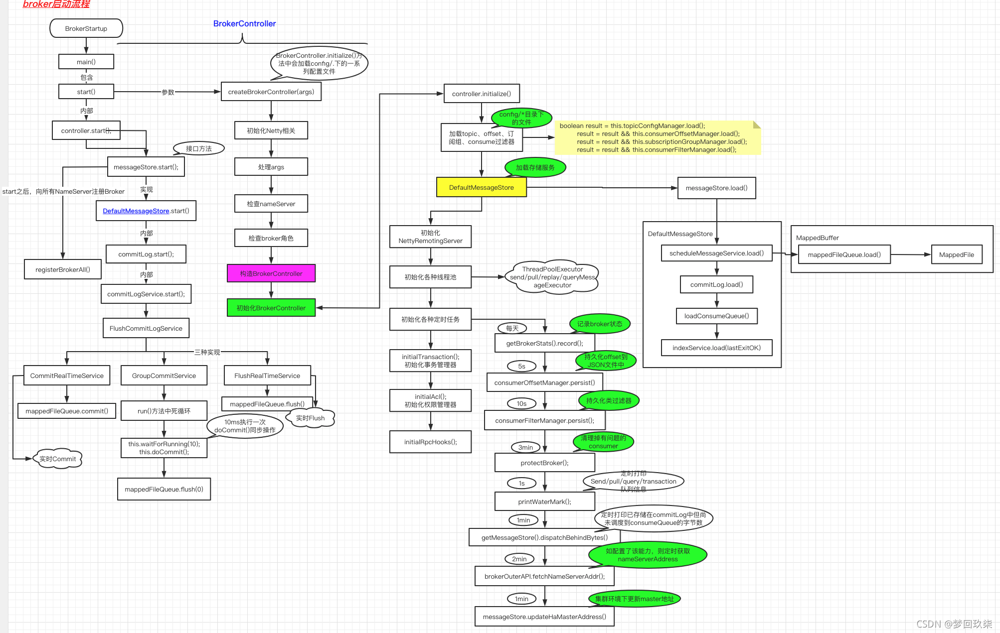

    这是rocketmq系列的第四篇文章，主要介绍的是Broker启动。

<style>
.my-code {
   color: orange;
}
.orange {
   color: rgb(255, 53, 2)
}
.red {
   color: red
}
</style>

# 一、核心组件--Broker
消息存储与转发核心节点，支持主从架构（master-slave）、数据分片（queue）。
<!-- more -->

# 二、Broker启动
运行的是 BrokerStartup  的main 方法：
```java
/* main 方法启动
 * @param args
 */
public static void main(String[] args) {
    //创建brokerController
    start(createBrokerController(args));
}

//1.创建 BrokerController instance
final BrokerController controller = new BrokerController(
        brokerConfig,
        nettyServerConfig,
        nettyClientConfig,
        messageStoreConfig);
// remember all configs to prevent discard
controller.getConfiguration().registerConfig(properties);
//2.进行初始化 Broker controller
boolean initResult = controller.initialize();
```
启动过程，分成2部分
1. BrokerController的创建及初始化。
2. BrokerController的启动。


# 三、核心组件-BrokerController
`BrokerController` 是 Apache RocketMQ 中负责管理 Broker 的核心类。它负责启动、停止和管理 Broker 的各个模块，包括消息存储、消息消费、网络通信等。

源码结构如下：
```java
public BrokerController(
        final BrokerConfig brokerConfig,
        final NettyServerConfig nettyServerConfig,
        final NettyClientConfig nettyClientConfig,
        final MessageStoreConfig messageStoreConfig
    ) {
        //broker 配置信息
        this.brokerConfig = brokerConfig;
        //nettyServer配置信息
        this.nettyServerConfig = nettyServerConfig;
        //nettyClient 配置信息
        this.nettyClientConfig = nettyClientConfig;
        //store 配置信息
        this.messageStoreConfig = messageStoreConfig;
        //consumer 偏移量管理器，会读取store/config/consumerOffset.json  json 配置文件，维护了offsetTable Map 结构
        this.consumerOffsetManager = new ConsumerOffsetManager(this);
        //topic 配置管理器，会读取store/config/topics.json
        this.topicConfigManager = new TopicConfigManager(this);
        //拉去消息处理器，用来处理消费端消息拉去，关联的业务code 为RequestCode.PULL_MESSAGE
        this.pullMessageProcessor = new PullMessageProcessor(this);
        //
        this.pullRequestHoldService = new PullRequestHoldService(this);
        //
        this.messageArrivingListener = new NotifyMessageArrivingListener(this.pullRequestHoldService);
        //
        this.consumerIdsChangeListener = new DefaultConsumerIdsChangeListener(this);
        this.consumerManager = new ConsumerManager(this.consumerIdsChangeListener);
        // 消费过滤管理器会读取store/config/consumerFilter.json
        this.consumerFilterManager = new ConsumerFilterManager(this);
        //生产者管理器
        this.producerManager = new ProducerManager();
        //用于清除不活动的连接，可以看到里面有一些扫描生产者以及消费者不活动连接的方法
        this.clientHousekeepingService = new ClientHousekeepingService(this);
        //
        this.broker2Client = new Broker2Client(this);
        this.subscriptionGroupManager = new SubscriptionGroupManager(this);
        //NettyClient 初始化
        this.brokerOuterAPI = new BrokerOuterAPI(nettyClientConfig);
        //
        this.filterServerManager = new FilterServerManager(this);
        //
        this.slaveSynchronize = new SlaveSynchronize(this);
        //发送线程池队列
        this.sendThreadPoolQueue = new LinkedBlockingQueue<Runnable>(this.brokerConfig.getSendThreadPoolQueueCapacity());
        //拉取线程池队列
        this.pullThreadPoolQueue = new LinkedBlockingQueue<Runnable>(this.brokerConfig.getPullThreadPoolQueueCapacity());
        //查询线程池队列
        this.queryThreadPoolQueue = new LinkedBlockingQueue<Runnable>(this.brokerConfig.getQueryThreadPoolQueueCapacity());
        this.clientManagerThreadPoolQueue = new LinkedBlockingQueue<Runnable>(this.brokerConfig.getClientManagerThreadPoolQueueCapacity());
        this.consumerManagerThreadPoolQueue = new LinkedBlockingQueue<Runnable>(this.brokerConfig.getConsumerManagerThreadPoolQueueCapacity());
        //broker 状态管理器
        this.brokerStatsManager = new BrokerStatsManager(this.brokerConfig.getBrokerClusterName());
        this.setStoreHost(new InetSocketAddress(this.getBrokerConfig().getBrokerIP1(), this.getNettyServerConfig().getListenPort()));
        //
        this.brokerFastFailure = new BrokerFastFailure(this);
        this.configuration = new Configuration(
            log,
            BrokerPathConfigHelper.getBrokerConfigPath(),
            this.brokerConfig, this.nettyServerConfig, this.nettyClientConfig, this.messageStoreConfig
        );
    }
```
`BrokerController`的主要模块：

| 模块               | 说明                                                                 |
|--------------------|--------------------------------------------------------------------|
| **MessageStore**   | 负责消息的存储和检索，包括 CommitLog、ConsumeQueue 和 IndexFile。   |
| **RemotingServer** | 负责处理网络请求，与 Producer 和 Consumer 通信。                    |
| **BrokerStatsManager** | 负责统计 Broker 的运行状态和性能指标。                           |
| **BrokerOuterAPI** | 负责与 NameServer 通信，注册和上报 Broker 信息。                    |
| **PullMessageProcessor** | 负责处理消费者的消息拉取请求。                                 |
| **SendMessageProcessor** | 负责处理生产者的消息写入请求。                                 |


# 四、Broker启动【第1步】BrokerController的创建与初始化

## 4.1、BrokerController初始化流程
1. 载入各种配置文件（topic配置、消费偏移量、订阅群组、消费过滤）。
2. 初始化DefaultMessageStore消息存储器，并load：载入CommitLog、ConsumeQueue、载入索引文件。
3. 构造NettyRemotingServer netty远程通信服务器（普通+vip）、9种执行器（sendMessageExecutor、pullMessageExecutor、replyMessageExecutor、queryMessageExecutor、adminBrokerExecutor、clientManageExecutor、heartbeatExecutor、endTransactionExecutor、consumerManageExecutor）
4. registerProcessor()：注册处理器（使用上面9个执行器，分别注册到普通远程通信服务器、VIP远程通信服务器）具体通信机制见 RocketMQ详解（三）核心设计原理。
5. 初始化定时任务：BrokerStats当天数据统计、每5S持久化一次消费Offset、每10s持久化一次消费者filter、每3分钟执行一次broker保护（默认不执行）、每1s打印水位日志（线程池待处理队列）、每1分钟打印commitLog分发滞后bytes、每2分钟（请求http://jmenv.tbsite.net:8080/rocketmq/nsaddr）拉取一次nameserver地址、主节点每1分钟（开启DLeger主从切换）打印从滞后主offset。
6. 注册SSL证书变化监听器。
7. 初始化事务相关服务、监听器。
8. 初始化AccessValidator
9. 初始化RPC请求钩子RPCHook（远程通信服务端+VIP远程通信服务端），包含doBeforeRequest请求前、doAfterResponse请求后2个方法。

```java
public boolean initialize() throws CloneNotSupportedException {
    boolean result = this.topicConfigManager.load();
    //加载对应管理器的配置文件
    result = result && this.consumerOffsetManager.load();
    result = result && this.subscriptionGroupManager.load();
    result = result && this.consumerFilterManager.load();

    if (result) {
        try {
            this.messageStore =
                new DefaultMessageStore(this.messageStoreConfig, this.brokerStatsManager, this.messageArrivingListener,
                    this.brokerConfig);
            this.brokerStats = new BrokerStats((DefaultMessageStore) this.messageStore);
            //load plugin
            Mes[2020-09-10-rocketmq-Broker-启动.md](2020-09-10-rocketmq-Broker-启动.md)sageStorePluginContext context = new MessageStorePluginContext(messageStoreConfig, brokerStatsManager, messageArrivingListener, brokerConfig);
            this.messageStore = MessageStoreFactory.build(context, this.messageStore);
            this.messageStore.getDispatcherList().addFirst(new CommitLogDispatcherCalcBitMap(this.brokerConfig, this.consumerFilterManager));
        } catch (IOException e) {
            result = false;
            log.error("Failed to initialize", e);
        }
    }
    //加载CommitLog 文件
    result = result && this.messageStore.load();

    if (result) {
        //初始化NettyServer
        this.remotingServer = new NettyRemotingServer(this.nettyServerConfig, this.clientHousekeepingService);
        NettyServerConfig fastConfig = (NettyServerConfig) this.nettyServerConfig.clone();
        fastConfig.setListenPort(nettyServerConfig.getListenPort() - 2);
        //初始化VIP NettyServer 端口为在109011 -2 
        this.fastRemotingServer = new NettyRemotingServer(fastConfig, this.clientHousekeepingService);
        //初始化一些线程池
        this.sendMessageExecutor = new BrokerFixedThreadPoolExecutor(
            this.brokerConfig.getSendMessageThreadPoolNums(),
            this.brokerConfig.getSendMessageThreadPoolNums(),
            1000 * 60,
            TimeUnit.MILLISECONDS,
            this.sendThreadPoolQueue,
            new ThreadFactoryImpl("SendMessageThread_"));

        this.pullMessageExecutor = new BrokerFixedThreadPoolExecutor(
            this.brokerConfig.getPullMessageThreadPoolNums(),
            this.brokerConfig.getPullMessageThreadPoolNums(),
            1000 * 60,
            TimeUnit.MILLISECONDS,
            this.pullThreadPoolQueue,
            new ThreadFactoryImpl("PullMessageThread_"));

        this.queryMessageExecutor = new BrokerFixedThreadPoolExecutor(
            this.brokerConfig.getQueryMessageThreadPoolNums(),
            this.brokerConfig.getQueryMessageThreadPoolNums(),
            1000 * 60,
            TimeUnit.MILLISECONDS,
            this.queryThreadPoolQueue,
            new ThreadFactoryImpl("QueryMessageThread_"));

        this.adminBrokerExecutor =
            Executors.newFixedThreadPool(this.brokerConfig.getAdminBrokerThreadPoolNums(), new ThreadFactoryImpl(
                "AdminBrokerThread_"));

        this.clientManageExecutor = new ThreadPoolExecutor(
            this.brokerConfig.getClientManageThreadPoolNums(),
            this.brokerConfig.getClientManageThreadPoolNums(),
            1000 * 60,
            TimeUnit.MILLISECONDS,
            this.clientManagerThreadPoolQueue,
            new ThreadFactoryImpl("ClientManageThread_"));

        this.consumerManageExecutor =
            Executors.newFixedThreadPool(this.brokerConfig.getConsumerManageThreadPoolNums(), new ThreadFactoryImpl(
                "ConsumerManageThread_"));
        //注册消息处理器，针对客户端发过来的消息code，会有针对的处理器进行处理
        this.registerProcessor();

        final long initialDelay = UtilAll.computNextMorningTimeMillis() - System.currentTimeMillis();
        final long period = 1000 * 60 * 60 * 24;
        //执行定定时任务
        this.scheduledExecutorService.scheduleAtFixedRate(new Runnable() {
            @Override
            public void run() {
                try {
                    BrokerController.this.getBrokerStats().record();
                } catch (Throwable e) {
                    log.error("schedule record error.", e);
                }
            }
        }, initialDelay, period, TimeUnit.MILLISECONDS);

       //定时 保存consumerOffset.json 文件
        this.scheduledExecutorService.scheduleAtFixedRate(new Runnable() {
            @Override
            public void run() {
                try {
                    BrokerController.this.consumerOffsetManager.persist();
                } catch (Throwable e) {
                    log.error("schedule persist consumerOffset error.", e);
                }
            }
        }, 1000 * 10, this.brokerConfig.getFlushConsumerOffsetInterval(), TimeUnit.MILLISECONDS);

        //定时保存 consumerfilter.json 文件
        this.scheduledExecutorService.scheduleAtFixedRate(new Runnable() {
            @Override
            public void run() {
                try {
                    BrokerController.this.consumerFilterManager.persist();
                } catch (Throwable e) {
                    log.error("schedule persist consumer filter error.", e);
                }
            }
        }, 1000 * 10, 1000 * 10, TimeUnit.MILLISECONDS);
        //

        this.scheduledExecutorService.scheduleAtFixedRate(new Runnable() {
            @Override
            public void run() {
                try {
                    BrokerController.this.protectBroker();
                } catch (Throwable e) {
                    log.error("protectBroker error.", e);
                }
            }
        }, 3, 3, TimeUnit.MINUTES);
        //打印水印日志

        this.scheduledExecutorService.scheduleAtFixedRate(new Runnable() {
            @Override
            public void run() {
                try {
                    BrokerController.this.printWaterMark();
                } catch (Throwable e) {
                    log.error("printWaterMark error.", e);
                }
            }
        }, 10, 1, TimeUnit.SECONDS);
        //

        this.scheduledExecutorService.scheduleAtFixedRate(new Runnable() {

            @Override
            public void run() {
                try {
                    log.info("dispatch behind commit log {} bytes", BrokerController.this.getMessageStore().dispatchBehindBytes());
                } catch (Throwable e) {
                    log.error("schedule dispatchBehindBytes error.", e);
                }
            }
        }, 1000 * 10, 1000 * 60, TimeUnit.MILLISECONDS);

        //
        if (this.brokerConfig.getNamesrvAddr() != null) {
            this.brokerOuterAPI.updateNameServerAddressList(this.brokerConfig.getNamesrvAddr());
            log.info("Set user specified name server address: {}", this.brokerConfig.getNamesrvAddr());
        } else if (this.brokerConfig.isFetchNamesrvAddrByAddressServer()) {
            this.scheduledExecutorService.scheduleAtFixedRate(new Runnable() {

                @Override
                public void run() {
                    try {
                        BrokerController.this.brokerOuterAPI.fetchNameServerAddr();
                    } catch (Throwable e) {
                        log.error("ScheduledTask fetchNameServerAddr exception", e);
                    }
                }
            }, 1000 * 10, 1000 * 60 * 2, TimeUnit.MILLISECONDS);
        }

        if (BrokerRole.SLAVE == this.messageStoreConfig.getBrokerRole()) {
            if (this.messageStoreConfig.getHaMasterAddress() != null && this.messageStoreConfig.getHaMasterAddress().length() >= 6) {
                this.messageStore.updateHaMasterAddress(this.messageStoreConfig.getHaMasterAddress());
                this.updateMasterHAServerAddrPeriodically = false;
            } else {
                this.updateMasterHAServerAddrPeriodically = true;
            }

            this.scheduledExecutorService.scheduleAtFixedRate(new Runnable() {

                @Override
                public void run() {
                    try {
                        BrokerController.this.slaveSynchronize.syncAll();
                    } catch (Throwable e) {
                        log.error("ScheduledTask syncAll slave exception", e);
                    }
                }
            }, 1000 * 10, 1000 * 60, TimeUnit.MILLISECONDS);
        } else {
            this.scheduledExecutorService.scheduleAtFixedRate(new Runnable() {

                @Override
                public void run() {
                    try {
                        BrokerController.this.printMasterAndSlaveDiff();
                    } catch (Throwable e) {
                        log.error("schedule printMasterAndSlaveDiff error.", e);
                    }
                }
            }, 1000 * 10, 1000 * 60, TimeUnit.MILLISECONDS);
        }
    }

    return result;
}
```

### 4.1.1、第1步：初始化messageStore消息存储器
消息存储实现类为：org.apache.rocketmq.store.DefaultMessageStore，在borker启动创建BrokerController实例时，会创建DefaultMessageStore用于消息存储。

> 具体内容：查看后续文章“Broker的内部核心组件”


### 4.1.2、第2步：初始化网络通信模块
RemotingServer负责处理网络通信的核心组件。负责与客户端（Producer和Consumer）进行通信，处理消息的发送、拉取、查询等请求。
```java
// 初始化网络通信模块
this.remotingServer = new NettyRemotingServer(this.nettyServerConfig);
this.fastRemotingServer = new NettyRemotingServer(this.nettyServerConfig);
```

#### 4.1.2.1、RemotingServer的工作流程
1. 初始化Netty服务器
2. 注册请求处理器
   1. this.registerProcessor();根据请求类型（如消息发送、消息拉取），注册相应的处理器
3. 启动Netty服务器
4. 处理客户端请求
5. 管理连接

#### 4.1.2.2、注册请求处理器 this.registerProcessor()
```java
public void registerProcessor() {
    /**
     * SendMessageProcessor
     */
    SendMessageProcessor sendProcessor = new SendMessageProcessor(this);
    sendProcessor.registerSendMessageHook(sendMessageHookList);
    sendProcessor.registerConsumeMessageHook(consumeMessageHookList);

    this.remotingServer.registerProcessor(RequestCode.SEND_MESSAGE, sendProcessor, this.sendMessageExecutor);
    this.remotingServer.registerProcessor(RequestCode.SEND_MESSAGE_V2, sendProcessor, this.sendMessageExecutor);
    this.remotingServer.registerProcessor(RequestCode.SEND_BATCH_MESSAGE, sendProcessor, this.sendMessageExecutor);
    this.remotingServer.registerProcessor(RequestCode.CONSUMER_SEND_MSG_BACK, sendProcessor, this.sendMessageExecutor);
    this.fastRemotingServer.registerProcessor(RequestCode.SEND_MESSAGE, sendProcessor, this.sendMessageExecutor);
    this.fastRemotingServer.registerProcessor(RequestCode.SEND_MESSAGE_V2, sendProcessor, this.sendMessageExecutor);
    this.fastRemotingServer.registerProcessor(RequestCode.SEND_BATCH_MESSAGE, sendProcessor, this.sendMessageExecutor);
    this.fastRemotingServer.registerProcessor(RequestCode.CONSUMER_SEND_MSG_BACK, sendProcessor, this.sendMessageExecutor);
    /**
     * PullMessageProcessor
     */
    this.remotingServer.registerProcessor(RequestCode.PULL_MESSAGE, this.pullMessageProcessor, this.pullMessageExecutor);
    this.pullMessageProcessor.registerConsumeMessageHook(consumeMessageHookList);

    /**
     * ReplyMessageProcessor
     */
    ReplyMessageProcessor replyMessageProcessor = new ReplyMessageProcessor(this);
    replyMessageProcessor.registerSendMessageHook(sendMessageHookList);

    this.remotingServer.registerProcessor(RequestCode.SEND_REPLY_MESSAGE, replyMessageProcessor, replyMessageExecutor);
    this.remotingServer.registerProcessor(RequestCode.SEND_REPLY_MESSAGE_V2, replyMessageProcessor, replyMessageExecutor);
    this.fastRemotingServer.registerProcessor(RequestCode.SEND_REPLY_MESSAGE, replyMessageProcessor, replyMessageExecutor);
    this.fastRemotingServer.registerProcessor(RequestCode.SEND_REPLY_MESSAGE_V2, replyMessageProcessor, replyMessageExecutor);

    /**
     * QueryMessageProcessor
     */
    NettyRequestProcessor queryProcessor = new QueryMessageProcessor(this);
    this.remotingServer.registerProcessor(RequestCode.QUERY_MESSAGE, queryProcessor, this.queryMessageExecutor);
    this.remotingServer.registerProcessor(RequestCode.VIEW_MESSAGE_BY_ID, queryProcessor, this.queryMessageExecutor);

    this.fastRemotingServer.registerProcessor(RequestCode.QUERY_MESSAGE, queryProcessor, this.queryMessageExecutor);
    this.fastRemotingServer.registerProcessor(RequestCode.VIEW_MESSAGE_BY_ID, queryProcessor, this.queryMessageExecutor);

    /**
     * ClientManageProcessor
     */
    ClientManageProcessor clientProcessor = new ClientManageProcessor(this);
    this.remotingServer.registerProcessor(RequestCode.HEART_BEAT, clientProcessor, this.heartbeatExecutor);
    this.remotingServer.registerProcessor(RequestCode.UNREGISTER_CLIENT, clientProcessor, this.clientManageExecutor);
    this.remotingServer.registerProcessor(RequestCode.CHECK_CLIENT_CONFIG, clientProcessor, this.clientManageExecutor);

    this.fastRemotingServer.registerProcessor(RequestCode.HEART_BEAT, clientProcessor, this.heartbeatExecutor);
    this.fastRemotingServer.registerProcessor(RequestCode.UNREGISTER_CLIENT, clientProcessor, this.clientManageExecutor);
    this.fastRemotingServer.registerProcessor(RequestCode.CHECK_CLIENT_CONFIG, clientProcessor, this.clientManageExecutor);

    /**
     * ConsumerManageProcessor
     */
    ConsumerManageProcessor consumerManageProcessor = new ConsumerManageProcessor(this);
    this.remotingServer.registerProcessor(RequestCode.GET_CONSUMER_LIST_BY_GROUP, consumerManageProcessor, this.consumerManageExecutor);
    this.remotingServer.registerProcessor(RequestCode.UPDATE_CONSUMER_OFFSET, consumerManageProcessor, this.consumerManageExecutor);
    this.remotingServer.registerProcessor(RequestCode.QUERY_CONSUMER_OFFSET, consumerManageProcessor, this.consumerManageExecutor);

    this.fastRemotingServer.registerProcessor(RequestCode.GET_CONSUMER_LIST_BY_GROUP, consumerManageProcessor, this.consumerManageExecutor);
    this.fastRemotingServer.registerProcessor(RequestCode.UPDATE_CONSUMER_OFFSET, consumerManageProcessor, this.consumerManageExecutor);
    this.fastRemotingServer.registerProcessor(RequestCode.QUERY_CONSUMER_OFFSET, consumerManageProcessor, this.consumerManageExecutor);

    /**
     * EndTransactionProcessor
     */
    this.remotingServer.registerProcessor(RequestCode.END_TRANSACTION, new EndTransactionProcessor(this), this.endTransactionExecutor);
    this.fastRemotingServer.registerProcessor(RequestCode.END_TRANSACTION, new EndTransactionProcessor(this), this.endTransactionExecutor);

    /**
     * Default
     */
    AdminBrokerProcessor adminProcessor = new AdminBrokerProcessor(this);
    this.remotingServer.registerDefaultProcessor(adminProcessor, this.adminBrokerExecutor);
    this.fastRemotingServer.registerDefaultProcessor(adminProcessor, this.adminBrokerExecutor);
}
```
例如重要的请求处理器：<code class="my-code">SendMessageProcessor</code>
> 具体内容：查看后续文章“Broker的内部核心组件”


### 4.1.3、第3步：初始化定时任务
会初始化多个定时任务，这些定时任务用于执行一些周期性的操作，例如清理过期消息、持久化消费进度、同步Broker状态等。

以下是 Broker 启动过程中初始化的主要定时任务：

#### 1. **清理过期消息**
- **任务名称**：`CleanExpiredMessageTask`
- **作用**：定期检查并清理过期的消息。
- **触发间隔**：默认 10 分钟。
- **配置参数**：`fileReservedTime`（消息保留时间）。

#### 2. **持久化消费进度**
- **任务名称**：`PersistConsumerOffsetTask`
- **作用**：定期将消费者的消费进度（Offset）持久化到磁盘。
- **触发间隔**：默认 5 秒。
- **配置参数**：`flushConsumerOffsetInterval`（持久化间隔）。

#### 3. **同步 Broker 状态**
- **任务名称**：`BrokerStatsManager`
- **作用**：定期向 NameServer 同步 Broker 的状态信息。
- **触发间隔**：默认 10 秒。
- **配置参数**：`brokerNotActiveTimeout`（Broker 不活跃超时时间）。

#### 4. **统计和监控**
- **任务名称**：`BrokerStatsManager`
- **作用**：定期收集和上报 Broker 的运行状态和性能指标。
- **触发间隔**：默认 1 分钟。
- **配置参数**：`brokerStatsInterval`（统计间隔）。

#### 5. **检查 HA 状态**
- **任务名称**：`HAService`
- **作用**：在主从模式下，定期检查主从同步状态。
- **触发间隔**：默认 5 秒。
- **配置参数**：`haSendHeartbeatInterval`（心跳间隔）。


# 五、Broker启动【第2步】BrokerController的启动
BrokerController#start方法。主要是启动各种服务和组件，例如messageStore、remotingServer、fastRemotingServer等等。
```java
public void start() throws Exception {
    //刷盘，同步，高可用开启
    if (this.messageStore != null) {
        this.messageStore.start();
    }
    //10911 NettyServer 端口绑定 ，开始服务
    if (this.remotingServer != null) {
        this.remotingServer.start();
    }
    //VIP 10911 -2 NettyServer 端口绑定 ，开始服务
    if (this.fastRemotingServer != null) {
        this.fastRemotingServer.start();
    }
    //初始化组装NettyClient bootstrap 信息
    if (this.brokerOuterAPI != null) {
        this.brokerOuterAPI.start();
    }
    //

    if (this.pullRequestHoldService != null) {
        this.pullRequestHoldService.start();
    }
    //开启检测不活动连接的服务，定时任务，每10s运行一次
    if (this.clientHousekeepingService != null) {
        this.clientHousekeepingService.start();
    }
    //
    if (this.filterServerManager != null) {
        this.filterServerManager.start();
    }
    //向nameServer 注册broker topic 信息
    this.registerBrokerAll(true, false);
    //每30s 向 每个nameServer 注册broker topic 信息
    this.scheduledExecutorService.scheduleAtFixedRate(new Runnable() {

        @Override
        public void run() {
            try {
                BrokerController.this.registerBrokerAll(true, false);
            } catch (Throwable e) {
                log.error("registerBrokerAll Exception", e);
            }
        }
    }, 1000 * 10, 1000 * 30, TimeUnit.MILLISECONDS);
    //
    if (this.brokerStatsManager != null) {
        this.brokerStatsManager.start();
    }
    //
    if (this.brokerFastFailure != null) {
        this.brokerFastFailure.start();
    }
}
```
主要是启动各种服务和组件，例如messageStore、remotingServer、fastRemotingServer等等。

## 5.1、启动小结



参考文章：
https://juejin.cn/post/7250374485568503867
https://juejin.cn/post/7031701457086709796