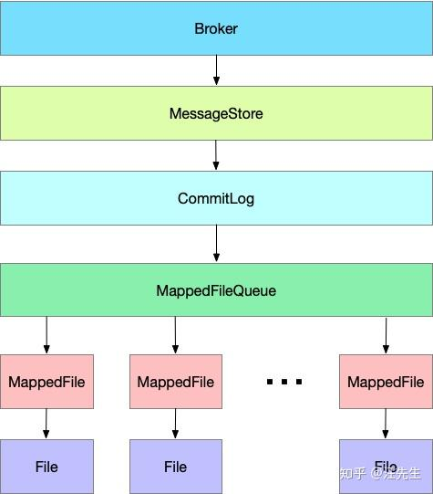

    这是rocketmq系列的第五篇文章，主要介绍的是Broker重要的内部组件。

<style>
.my-code {
   color: orange;
}
.orange {
   color: rgb(255, 53, 2)
}
.red {
   color: red
}
</style>

# 一、、MessageStore【消息存储器】
什么是MessageStore？是核心模块，负责消息的存储、检索和管理。

消息存储实现类为：<code class="my-code">org.apache.rocketmq.store.DefaultMessageStore</code>，在borker启动创建<code class="my-code">BrokerController</code>实例时，会创建<code class="my-code">DefaultMessageStore</code>用于消息存储。

<code class="my-code">DefaultMessageStore</code>构造器如下：
- DefaultMessageStore 构造方法中会创建 <code class="my-code">commitlog、consumequeue</code> 等目录，期初目录下还没有文件。

```java
public DefaultMessageStore(final MessageStoreConfig messageStoreConfig, final BrokerStatsManager brokerStatsManager,
    final MessageArrivingListener messageArrivingListener, final BrokerConfig brokerConfig) throws IOException {
    //消息拉取长轮询模式消息到达监听器
    this.messageArrivingListener = messageArrivingListener;
    //broker配置
    this.brokerConfig = brokerConfig;
    //消息存储配置
    this.messageStoreConfig = messageStoreConfig;
    //broker状态管理器
    this.brokerStatsManager = brokerStatsManager;
    //MappedFile分配服务
    this.allocateMappedFileService = new AllocateMappedFileService(this);
    //初始化commitLog存储实现
    if (messageStoreConfig.isEnableDLegerCommitLog()) {
        this.commitLog = new DLedgerCommitLog(this);
    } else {
        this.commitLog = new CommitLog(this);
    }
    //cqTable
    this.consumeQueueTable = new ConcurrentHashMap<>(32);
    //cq队列文件刷盘服务
    this.flushConsumeQueueService = new FlushConsumeQueueService();
    //清除commitLog服务
    this.cleanCommitLogService = new CleanCommitLogService();
    //清除cq队列文件服务
    this.cleanConsumeQueueService = new CleanConsumeQueueService();

    this.storeStatsService = new StoreStatsService();
    //索引文件服务
    this.indexService = new IndexService(this);
    //HA机制服务
    if (!messageStoreConfig.isEnableDLegerCommitLog()) {
        this.haService = new HAService(this);
    } else {
        this.haService = null;
    }
    //commitLog消息分发，cq、indexFile文件构建
    this.reputMessageService = new ReputMessageService();

    this.scheduleMessageService = new ScheduleMessageService(this);
    //消息堆内存缓存
    this.transientStorePool = new TransientStorePool(messageStoreConfig);

    if (messageStoreConfig.isTransientStorePoolEnable()) {
        this.transientStorePool.init();
    }
    this.allocateMappedFileService.start();
    this.indexService.start();
    this.dispatcherList = new LinkedList<>();
    this.dispatcherList.addLast(new CommitLogDispatcherBuildConsumeQueue());
    this.dispatcherList.addLast(new CommitLogDispatcherBuildIndex());
    File file = new File(StorePathConfigHelper.getLockFile(messageStoreConfig.getStorePathRootDir()));
    MappedFile.ensureDirOK(file.getParent());
    MappedFile.ensureDirOK(getStorePathPhysic());
    MappedFile.ensureDirOK(getStorePathLogic());
    lockFile = new RandomAccessFile(file, "rw");
}
```
其主要属性为：
- MessageStoreConfig messageStoreConfig：消息存储服务配置类
- CommitLog commitLog：commitLog文件对应实现类
- ConcurrentMap<String/* topic /, ConcurrentMap<Integer/ queueId */, ConsumeQueue>> consumeQueueTable：消息队列缓存map，根据topic进行分组
- FlushConsumeQueueService flushConsumeQueueService：消息队列刷盘服务实现类
- CleanCommitLogService cleanCommitLogService：清除commitLog文件服务
- CleanConsumeQueueService cleanConsumeQueueService：清除消息队列服务
- IndexService indexService：索引服务
- AllocateMappedFileService allocateMappedFileService：MappedFile分配服务
- ReputMessageService reputMessageService：commitLog消息分发服务
- HAService haService：HA机制服务
- TransientStorePool transientStorePool：消息内存缓存
- MessageArrivingListener messageArrivingListener：消息拉取长轮询模式消息到达监听器
- BrokerConfig brokerConfig：broker配置类
- StoreCheckpoint storeCheckpoint：文件刷盘检测点

## 1.1、消息存储入口
消息存储入口位于<code class="my-code">org.apache.rocketmq.store.DefaultMessageStore#putMessage</code>
```java
@Override
public PutMessageResult putMessage(MessageExtBrokerInner msg) {
  PutMessageStatus checkStoreStatus = this.checkStoreStatus();
  if (checkStoreStatus != PutMessageStatus.PUT_OK) {
    return new PutMessageResult(checkStoreStatus, null);
  }

  PutMessageStatus msgCheckStatus = this.checkMessage(msg);
  if (msgCheckStatus == PutMessageStatus.MESSAGE_ILLEGAL) {
    return new PutMessageResult(msgCheckStatus, null);
  }

  long beginTime = this.getSystemClock().now();
  PutMessageResult result = this.commitLog.putMessage(msg);
  long elapsedTime = this.getSystemClock().now() - beginTime;
  if (elapsedTime > 500) {
    log.warn("not in lock elapsed time(ms)={}, bodyLength={}", elapsedTime, msg.getBody().length);
  }

  this.storeStatsService.setPutMessageEntireTimeMax(elapsedTime);

  if (null == result || !result.isOk()) {
    this.storeStatsService.getPutMessageFailedTimes().incrementAndGet();
  }

  return result;
}
```

## 1.2、调用commitLog.putMessage
```java
public PutMessageResult putMessage(final MessageExtBrokerInner msg) {
    // Set the storage time
    msg.setStoreTimestamp(System.currentTimeMillis());
    // Set the message body BODY CRC (consider the most appropriate setting
    // on the client)
    msg.setBodyCRC(UtilAll.crc32(msg.getBody()));
    // Back to Results
    AppendMessageResult result = null;

    StoreStatsService storeStatsService = this.defaultMessageStore.getStoreStatsService();

    String topic = msg.getTopic();
    int queueId = msg.getQueueId();

    final int tranType = MessageSysFlag.getTransactionValue(msg.getSysFlag());
    if (tranType == MessageSysFlag.TRANSACTION_NOT_TYPE
        || tranType == MessageSysFlag.TRANSACTION_COMMIT_TYPE) {
        // Delay Delivery
        if (msg.getDelayTimeLevel() > 0) {
            if (msg.getDelayTimeLevel() > this.defaultMessageStore.getScheduleMessageService().getMaxDelayLevel()) {
                msg.setDelayTimeLevel(this.defaultMessageStore.getScheduleMessageService().getMaxDelayLevel());
            }

            topic = TopicValidator.RMQ_SYS_SCHEDULE_TOPIC;
            queueId = ScheduleMessageService.delayLevel2QueueId(msg.getDelayTimeLevel());

            // Backup real topic, queueId
            MessageAccessor.putProperty(msg, MessageConst.PROPERTY_REAL_TOPIC, msg.getTopic());
            MessageAccessor.putProperty(msg, MessageConst.PROPERTY_REAL_QUEUE_ID, String.valueOf(msg.getQueueId()));
                msg.setPropertiesString(MessageDecoder.messageProperties2String(msg.getProperties()));

                msg.setTopic(topic);
                msg.setQueueId(queueId);
            }
        }

        InetSocketAddress bornSocketAddress = (InetSocketAddress) msg.getBornHost();
        if (bornSocketAddress.getAddress() instanceof Inet6Address) {
            msg.setBornHostV6Flag();
        }

        InetSocketAddress storeSocketAddress = (InetSocketAddress) msg.getStoreHost();
        if (storeSocketAddress.getAddress() instanceof Inet6Address) {
            msg.setStoreHostAddressV6Flag();
        }

        long elapsedTimeInLock = 0;

        MappedFile unlockMappedFile = null;
        MappedFile mappedFile = this.mappedFileQueue.getLastMappedFile();

        putMessageLock.lock(); //spin or ReentrantLock ,depending on store config
        try {
            long beginLockTimestamp = this.defaultMessageStore.getSystemClock().now();
            this.beginTimeInLock = beginLockTimestamp;

            // Here settings are stored timestamp, in order to ensure an orderly
            // global
            msg.setStoreTimestamp(beginLockTimestamp);

            if (null == mappedFile || mappedFile.isFull()) {
                mappedFile = this.mappedFileQueue.getLastMappedFile(0); // Mark: NewFile may be cause noise
            }
            if (null == mappedFile) {
                log.error("create mapped file1 error, topic: " + msg.getTopic() + " clientAddr: " + msg.getBornHostString());
                beginTimeInLock = 0;
                return new PutMessageResult(PutMessageStatus.CREATE_MAPEDFILE_FAILED, null);
            }

            result = mappedFile.appendMessage(msg, this.appendMessageCallback);
            switch (result.getStatus()) {
                case PUT_OK:
                    break;
                case END_OF_FILE:
                    unlockMappedFile = mappedFile;
                    // Create a new file, re-write the message
                    mappedFile = this.mappedFileQueue.getLastMappedFile(0);
                    if (null == mappedFile) {
                        // XXX: warn and notify me
                        log.error("create mapped file2 error, topic: " + msg.getTopic() + " clientAddr: " + msg.getBornHostString());
                        beginTimeInLock = 0;
                        return new PutMessageResult(PutMessageStatus.CREATE_MAPEDFILE_FAILED, result);
                    }
                    result = mappedFile.appendMessage(msg, this.appendMessageCallback);
                    break;
                case MESSAGE_SIZE_EXCEEDED:
                case PROPERTIES_SIZE_EXCEEDED:
                    beginTimeInLock = 0;
                    return new PutMessageResult(PutMessageStatus.MESSAGE_ILLEGAL, result);
                case UNKNOWN_ERROR:
                    beginTimeInLock = 0;
                    return new PutMessageResult(PutMessageStatus.UNKNOWN_ERROR, result);
                default:
                    beginTimeInLock = 0;
                    return new PutMessageResult(PutMessageStatus.UNKNOWN_ERROR, result);
            }

            elapsedTimeInLock = this.defaultMessageStore.getSystemClock().now() - beginLockTimestamp;
            beginTimeInLock = 0;
        } finally {
            putMessageLock.unlock();
        }

        if (elapsedTimeInLock > 500) {
            log.warn("[NOTIFYME]putMessage in lock cost time(ms)={}, bodyLength={} AppendMessageResult={}", elapsedTimeInLock, msg.getBody().length, result);
        }

        if (null != unlockMappedFile && this.defaultMessageStore.getMessageStoreConfig().isWarmMapedFileEnable()) {
            this.defaultMessageStore.unlockMappedFile(unlockMappedFile);
        }

        PutMessageResult putMessageResult = new PutMessageResult(PutMessageStatus.PUT_OK, result);

        // Statistics
        storeStatsService.getSinglePutMessageTopicTimesTotal(msg.getTopic()).incrementAndGet();
        storeStatsService.getSinglePutMessageTopicSizeTotal(topic).addAndGet(result.getWroteBytes());

        handleDiskFlush(result, putMessageResult, msg);
        handleHA(result, putMessageResult, msg);

        return putMessageResult;
    }
```
每个Broker都对应有一个MessageStore，专门用来存储发送到它的消息，不过MessageStore本身不是文件，只是存储的一个抽象，MessageStore 中保存着一个 CommitLog，CommitLog 维护了一个 MappedFileQueue，而MappedFileQueue 中又维护了多个 MappedFile，每个MappedFile都会映射到文件系统中一个文件，这些文件才是真正的存储消息的地方，MappedFile的文件名为它记录的第一条消息的全局物理偏移量。
- MappedFile：内存映射文件，使用内存映射文件技术，将磁盘文件映射到内存，减少磁盘IO。


### 1.2.1、数据刷盘
存储最后，会调用<code class="red">handleDiskFlush(result, putMessageResult, msg);</code>进行数据刷盘操作
> 具体内容：查看后续章节，详细介绍

### 1.2.2、HA（高可以策略）
调用<code class="red">handleHA()</code>进行主从复制等高可用策略的执行。


# 三、SendMessageProcessor【消息处理器】
例如重要的请求处理器：<code class="my-code">SendMessageProcessor</code>，是负责处理生产者发送消息请求的核心处理器。它接收生产者发送的消息，并将其存储到Broker的消息存储模块中。
```java
public class SendMessageProcessor extends AbstractSendMessageProcessor implements NettyRequestProcessor {
  @Override
  public RemotingCommand processRequest(ChannelHandlerContext ctx,
                                        RemotingCommand request) throws RemotingCommandException {
    RemotingCommand response = null;
    try {
      response = asyncProcessRequest(ctx, request).get();
    } catch (InterruptedException | ExecutionException e) {
      log.error("process SendMessage error, request : " + request.toString(), e);
    }
    return response;
  }
}
```
<code class="my-code">SendMessageProcessor</code> 实现了 <code class="my-code">NettyRequestProcessor</code> 接口，并在接口方法<code class="my-code">processRequest()</code>中处理接收到的请求。
```java
public CompletableFuture<RemotingCommand> asyncProcessRequest(ChannelHandlerContext ctx,
                                                                  RemotingCommand request) throws RemotingCommandException {
    final SendMessageContext mqtraceContext;
    switch (request.getCode()) {
        case RequestCode.CONSUMER_SEND_MSG_BACK:
            return this.asyncConsumerSendMsgBack(ctx, request);
        default:
            SendMessageRequestHeader requestHeader = parseRequestHeader(request);
            if (requestHeader == null) {
                return CompletableFuture.completedFuture(null);
            }
            mqtraceContext = buildMsgContext(ctx, requestHeader);
            this.executeSendMessageHookBefore(ctx, request, mqtraceContext);
            if (requestHeader.isBatch()) {
                return this.asyncSendBatchMessage(ctx, request, mqtraceContext, requestHeader);
            } else {
                return this.asyncSendMessage(ctx, request, mqtraceContext, requestHeader);
            }
    }
}
```
继续跟踪
```java
private CompletableFuture<RemotingCommand> asyncSendMessage(ChannelHandlerContext ctx, RemotingCommand request,
                                                                SendMessageContext mqtraceContext,
                                                                SendMessageRequestHeader requestHeader) {
    final RemotingCommand response = preSend(ctx, request, requestHeader);
    final SendMessageResponseHeader responseHeader = (SendMessageResponseHeader)response.readCustomHeader();

    if (response.getCode() != -1) {
        return CompletableFuture.completedFuture(response);
    }

    final byte[] body = request.getBody();

    int queueIdInt = requestHeader.getQueueId();
    TopicConfig topicConfig = this.brokerController.getTopicConfigManager().selectTopicConfig(requestHeader.getTopic());

    if (queueIdInt < 0) {
        queueIdInt = randomQueueId(topicConfig.getWriteQueueNums());
    }

    MessageExtBrokerInner msgInner = new MessageExtBrokerInner();
    msgInner.setTopic(requestHeader.getTopic());
    msgInner.setQueueId(queueIdInt);

    if (!handleRetryAndDLQ(requestHeader, response, request, msgInner, topicConfig)) {
        return CompletableFuture.completedFuture(response);
    }

    msgInner.setBody(body);
    msgInner.setFlag(requestHeader.getFlag());
    MessageAccessor.setProperties(msgInner, MessageDecoder.string2messageProperties(requestHeader.getProperties()));
    msgInner.setPropertiesString(requestHeader.getProperties());
    msgInner.setBornTimestamp(requestHeader.getBornTimestamp());
    msgInner.setBornHost(ctx.channel().remoteAddress());
    msgInner.setStoreHost(this.getStoreHost());
    msgInner.setReconsumeTimes(requestHeader.getReconsumeTimes() == null ? 0 : requestHeader.getReconsumeTimes());
    String clusterName = this.brokerController.getBrokerConfig().getBrokerClusterName();
    MessageAccessor.putProperty(msgInner, MessageConst.PROPERTY_CLUSTER, clusterName);
    msgInner.setPropertiesString(MessageDecoder.messageProperties2String(msgInner.getProperties()));

    CompletableFuture<PutMessageResult> putMessageResult = null;
    Map<String, String> origProps = MessageDecoder.string2messageProperties(requestHeader.getProperties());
    String transFlag = origProps.get(MessageConst.PROPERTY_TRANSACTION_PREPARED);
    if (transFlag != null && Boolean.parseBoolean(transFlag)) {
        if (this.brokerController.getBrokerConfig().isRejectTransactionMessage()) {
            response.setCode(ResponseCode.NO_PERMISSION);
            response.setRemark(
                    "the broker[" + this.brokerController.getBrokerConfig().getBrokerIP1()
                            + "] sending transaction message is forbidden");
            return CompletableFuture.completedFuture(response);
        }
        putMessageResult = this.brokerController.getTransactionalMessageService().asyncPrepareMessage(msgInner);
    } else {
        putMessageResult = this.brokerController.getMessageStore().asyncPutMessage(msgInner);
    }
    return handlePutMessageResultFuture(putMessageResult, response, request, msgInner, responseHeader, mqtraceContext, ctx, queueIdInt);
}
```
<code class="my-code">SendMessageProcessor</code>最终调用了<code class="my-code">DefaultMessageStore</code>的<code class="my-code">asyncPutMessage()</code>方法来进行消息处理。关于MessageStore的相关内容，查看上一章节。


# 四、数据刷盘
在<code class="red">commitLog.putMessage</code>中，接消息存储后，Broker会调用 <code class="red">handleDiskFlush</code> 进行刷盘.
```java
public PutMessageResult putMessage(final MessageExtBrokerInner msg) {
  //忽略代码
  handleDiskFlush(result, putMessageResult, msg);
  handleHA(result, putMessageResult, msg);
}
```
分析 <code class="red">handleDiskFlush</code>，其中刷盘分为同步刷盘和异步刷盘
```java
public void handleDiskFlush(AppendMessageResult result, PutMessageResult putMessageResult, MessageExt messageExt) {
    // Synchronization flush 同步刷盘
    if (FlushDiskType.SYNC_FLUSH == this.defaultMessageStore.getMessageStoreConfig().getFlushDiskType()) {
        final GroupCommitService service = (GroupCommitService) this.flushCommitLogService;
        if (messageExt.isWaitStoreMsgOK()) {
            // result.getWroteOffset() + result.getWroteBytes() 获得下一个offset
            GroupCommitRequest request = new GroupCommitRequest(result.getWroteOffset() + result.getWroteBytes());
            // 将GroupCommitRequest添加到requestsWrite这个List中
            service.putRequest(request);
            boolean flushOK = request.waitForFlush(this.defaultMessageStore.getMessageStoreConfig().getSyncFlushTimeout());
            if (!flushOK) {
                log.error("do groupcommit, wait for flush failed, topic: " + messageExt.getTopic() + " tags: " + messageExt.getTags()
                    + " client address: " + messageExt.getBornHostString());
                putMessageResult.setPutMessageStatus(PutMessageStatus.FLUSH_DISK_TIMEOUT);
            }
        } else {
            service.wakeup();
        }
    }
    // Asynchronous flush 异步刷盘
    else {
        if (!this.defaultMessageStore.getMessageStoreConfig().isTransientStorePoolEnable()) {
            flushCommitLogService.wakeup();
        } else {
            commitLogService.wakeup();
        }
    }
}
```
同步和异步，同步刷盘由GroupCommitService实现，异步刷盘由FlushRealTimeService实现，默认采用异步刷盘

在采用异步刷盘的模式下，若是开启内存字节缓冲区，那么会在FlushRealTimeService的基础上开启CommitRealTimeService

## 4.1、同步刷盘
GroupCommitService
```java
class GroupCommitService extends FlushCommitLogService {
    private volatile List<GroupCommitRequest> requestsWrite = new ArrayList<GroupCommitRequest>();
    private volatile List<GroupCommitRequest> requestsRead = new ArrayList<GroupCommitRequest>();

    public synchronized void putRequest(final GroupCommitRequest request) {
        // 在完成List的add操作后，会通过CAS操作修改hasNotified这个原子化的Boolean值
        // 同时通过waitPoint的countDown进行唤醒操作，在后面会有用
        synchronized (this.requestsWrite) {
            this.requestsWrite.add(request);
        }
        if (hasNotified.compareAndSet(false, true)) {
            waitPoint.countDown(); // notify
        }
    }

    private void doCommit() {
        synchronized (this.requestsRead) {
            if (!this.requestsRead.isEmpty()) {
                // 遍历 requestsRead 表
                for (GroupCommitRequest req : this.requestsRead) {
                    // There may be a message in the next file, so a maximum of
                    // two times the flush
                    boolean flushOK = false;
                    for (int i = 0; i < 2 && !flushOK; i++) {
                        // 如果 getFlushedWhere 大于 getNextOffset，说明已经刷过盘了，不用再刷
                        flushOK = CommitLog.this.mappedFileQueue.getFlushedWhere() >= req.getNextOffset();

                        if (!flushOK) {
                            CommitLog.this.mappedFileQueue.flush(0);
                        }
                    }

                    // 唤醒线程
                    req.wakeupCustomer(flushOK);
                }

                long storeTimestamp = CommitLog.this.mappedFileQueue.getStoreTimestamp();
                if (storeTimestamp > 0) {
                    CommitLog.this.defaultMessageStore.getStoreCheckpoint().setPhysicMsgTimestamp(storeTimestamp);
                }

                this.requestsRead.clear();
            } else {
                // Because of individual messages is set to not sync flush, it
                // will come to this process
                CommitLog.this.mappedFileQueue.flush(0);
            }
        }
    }

    public void run() {
        CommitLog.log.info(this.getServiceName() + " service started");
        while (!this.isStopped()) {
            try {
                this.waitForRunning(10);
                // 不停 doCommit
                this.doCommit();
            } catch (Exception e) {
                CommitLog.log.warn(this.getServiceName() + " service has exception. ", e);
            }
        }

        // Under normal circumstances shutdown, wait for the arrival of the
        // request, and then flush
        try {
            Thread.sleep(10);
        } catch (InterruptedException e) {
            CommitLog.log.warn("GroupCommitService Exception, ", e);
        }

        synchronized (this) {
            this.swapRequests();
        }

        this.doCommit();

        CommitLog.log.info(this.getServiceName() + " service end");
    }
}
```
下面看看 flush 方法
```java
public boolean flush(final int flushLeastPages) {
    boolean result = true;
    // 根据flushedWhere，通过findMappedFileByOffset获取要刷新的文件映射MappedFile
    MappedFile mappedFile = this.findMappedFileByOffset(this.flushedWhere, this.flushedWhere == 0);
    if (mappedFile != null) {
        long tmpTimeStamp = mappedFile.getStoreTimestamp();
        int offset = mappedFile.flush(flushLeastPages);
        long where = mappedFile.getFileFromOffset() + offset;
        result = where == this.flushedWhere;
        this.flushedWhere = where;
        if (0 == flushLeastPages) {
            this.storeTimestamp = tmpTimeStamp;
        }
    }

    return result;
}

public int flush(final int flushLeastPages) {
    if (this.isAbleToFlush(flushLeastPages)) {
        // 加锁
        if (this.hold()) {
            int value = getReadPosition();

            try {
                //We only append data to fileChannel or mappedByteBuffer, never both.
                // 只会给 fileChannel 或 mappedByteBuffer 加数据，不会同时force
                if (writeBuffer != null || this.fileChannel.position() != 0) {
                    this.fileChannel.force(false);
                } else {
                    this.mappedByteBuffer.force();
                }
            } catch (Throwable e) {
                log.error("Error occurred when force data to disk.", e);
            }

            // 设置flushedPosition的值
            this.flushedPosition.set(value);
            this.release();
        } else {
            log.warn("in flush, hold failed, flush offset = " + this.flushedPosition.get());
            this.flushedPosition.set(getReadPosition());
        }
    }
    return this.getFlushedPosition();
}


private boolean isAbleToFlush(final int flushLeastPages) {
    int flush = this.flushedPosition.get();
    int write = getReadPosition();

    // 如果 fileSize == this.wrotePosition.get() 文件已经刷完了
    if (this.isFull()) {
        return true;
    }

    // 同步刷盘 所以 flushLeastPages = 0，只要有缓存就刷盘
    // 如果是异步刷盘，flushLeastPages = 4，说明只有当缓存的消息至少是4（page个数）*4K（page大小）= 16K时，异步刷盘才会将缓存写入文件
    if (flushLeastPages > 0) {
        return ((write / OS_PAGE_SIZE) - (flush / OS_PAGE_SIZE)) >= flushLeastPages;
    }

    // 当需要刷盘的位置 > flush 说明有盘可刷
    return write > flush;
}
```
同步刷盘分析结束，当<code class="red">requestsRead</code>里所有数据都刷盘后，回到 <code class="red">doCommit</code> 方法后会调用<code class="red">req.wakeupCustomer(flushOK);</code>唤醒等待的<code class="red">waitForFlush</code>的线程。

只有在消息真正持久化至磁盘后RocketMQ的Broker端才会真正返回给Producer端一个成功的ACK响应。同步刷盘对MQ消息可靠性来说是一种不错的保障，但是性能上会有较大影响，一般适用于金融业务应用该模式较多。

# 五、HA（高可用）策略
Broker的HA策略分为两部分
- 同步元数据
- 同步消息数据


## 5.1、同步元数据
在Slave启动时，会启动一个定时任务用来从master同步元数据

在 BrokerController 启动时


参考文章：
https://juejin.cn/post/7250374485568503867
https://juejin.cn/post/7031701457086709796