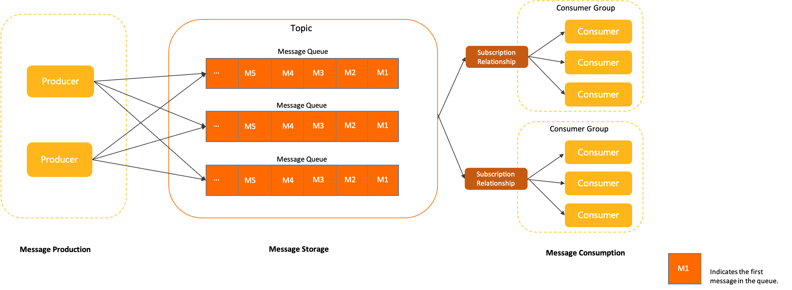

    这是rocketmq系列的第七篇文章，主要介绍的是消息的领域模型。

<style>
.my-code {
   color: orange;
}
.orange {
   color: rgb(255, 53, 2)
}
.red {
   color: red
}
</style>

# 一、领域模型
之前的文章讲了很多rocketmq的架构、消息发送、消息消费，但是没有详细的解析消息的数据结构等内容。


<!-- more -->
如上图所示，Apache RocketMQ 中消息的生命周期主要分为消息生产、消息存储、消息消费这三部分。

# 二、消息生产（producer）
Apache RocketMQ 中用于产生消息的运行实体，一般集成于业务调用链路的上游。生产者是轻量级匿名无身份的。

## 2.1、Topic路由信息

### 2.1.1、TopicPublishInfo
是生产者发送消息时用于管理Topic路由信息的核心类。它存储了Topic对应的消息队列（MessageQueue）列表，并提供了选择队列的策略。
```java
public class TopicPublishInfo {
    //标识当前Topic是否为顺序消息Topic。顺序消息需要固定选择同一队列
    private boolean orderTopic = false;
    private boolean haveTopicRouterInfo = false;
    // 存储当前Topic可用的消息队列列表（从NameServer获取的路由信息）。
    private List<MessageQueue> messageQueueList = new ArrayList<MessageQueue>();
    //ThreadLocalIndex（线程安全的自增索引）
    //作用：用于实现轮询（Round-Robin）策略，记录当前线程最后一次选择的队列索引。
    private volatile ThreadLocalIndex sendWhichQueue = new ThreadLocalIndex();
    //
    private TopicRouteData topicRouteData;
}
```

### 2.1.2、TopicRouteData
```java
public class TopicRouteData implements Serializable {
    private String orderTopicConf;// 1. 顺序消息的配置
    private List<QueueData> queueDatas;//2. 队列分布信息（如每个broker的读写队列数量）
    private List<BrokerData> brokerDatas;//3. broker的物理地址（主从节点信息）
}
```
### 2.1.3、QueueData结构
```java
public class QueueData implements Serializable {
    private String brokerName; //broker名称
    private int readQueueNums; // 可读队列数
    private int writeQueueNums; // 可写队列数
    private int perm; // 权限（如读写）
}
```

## 2.2、DefaultMQProducerImpl
发送消息的核心实现
```java
public SendResult sendDefaultImpl(Message msg, final CommunicationMode communicationMode) {
    // 选择队列并发送
}
```

# 三、消息存储（broker）

## 3.1、主题（Topic）：
Apache RocketMQ 消息传输和存储的分组容器，主题内部由多个队列组成，消息的存储和水平扩展实际是通过主题内的队列实现的。


## 3.2、队列（MessageQueue）：
消息的物理队列，由<code class="my-code">Topic、BrokerName、QueueID</code>唯一标识。
```java
public class MessageQueue implements Comparable<MessageQueue>, Serializable {
    private static final long serialVersionUID = 6191200464116433425L;
    private String topic;
    private String brokerName;
    private int queueId;
}
```

## 3.3、消息（Message）：
Apache RocketMQ 的最小传输单元。消息具备不可变性，在初始化发送和完成存储后即不可变。
```java
public class Message implements Serializable {
    private static final long serialVersionUID = 8445773977080406428L;

    private String topic;
    private int flag;
    private Map<String, String> properties;
    private byte[] body;
    private String transactionId;
}
```

## 3.4、ConsumeQueue
逻辑队列，按Topic和QueueId组织，记录消息在CommitLog中的偏移。
```java
public class ConsumeQueue {
    private final String topic;
    private final int queueId;
    private final long offset;
}
```
存储流程：
1. 消息写入CommitLog
2. 异步构建ConsumeQueue和IndexFile。

# 四、消息消费（consumer）

## 4.1、ConsumerManager
ConsumerManager是用来管理所有Consumer.
- 我们可以看到 在ConsumerManager中存着一个consumerTable的消费者表 key为GroupName value就是对应ConsumerGroup的一些信息。

```java
package org.apache.rocketmq.broker.client;
public class ConsumerManager {
    private final ConcurrentMap<String, ConsumerGroupInfo> consumerTable =
            new ConcurrentHashMap<String, ConsumerGroupInfo>(1024);
}
```
- <code class="my-code">ConsumerManager</code>中存着一个<code class="my-code">consumerTable</code>的消费者表 key为GroupName value就是对应ConsumerGroup的一些信息。
- <code class="my-code">ConsumerManager</code>是在Broker中的，由Broker存储（Consumer启动时注册进去）。

## 4.2、消费者分组（ConsumerGroup）：
Consumer Group :
RocketMQ中，订阅者的概念是通过消费组（<code class="my-code">Consumer Group</code>）来体现的。每个消费组都消费主题中一份完整的消息，不同消费组之间消费进度彼此不受影响，也就是说，一条消息被<code class="my-code">Consumer Group1</code>消费过，也会再给<code class="my-code">Consumer Group2</code>消费。
消费组中包含多个消费者，同一个组内的消费者是竞争消费的关系，每个消费者负责消费组内的一部分消息。默认情况，如果一条消息被消费者<code class="my-code">Consumer1</code>消费了，那同组的其他消费者就不会再收到这条消息。

```java
package org.apache.rocketmq.broker.client;
public class ConsumerGroupInfo {
    private static final InternalLogger log = InternalLoggerFactory.getLogger(LoggerName.BROKER_LOGGER_NAME);
    //消费组名称
    private final String groupName;
    //Topic的订阅信息
    private final ConcurrentMap<String/* Topic */, SubscriptionData> subscriptionTable = new ConcurrentHashMap<String, SubscriptionData>();
    //Netty 连接的channel
    private final ConcurrentMap<Channel, ClientChannelInfo> channelInfoTable =
            new ConcurrentHashMap<Channel, ClientChannelInfo>(16);
    //消费方式 Pull或者Push
    private volatile ConsumeType consumeType;
    //获取消息的机制 比如从头获取或从最新的消息开始获取以及时间获取
    private volatile MessageModel messageModel;
    private volatile ConsumeFromWhere consumeFromWhere;
    private volatile long lastUpdateTimestamp = System.currentTimeMillis();
}
```
1. Consumer启动时，从NameServer获取路由信息。【具体源码，查看上一章节】
2. 向Broker注册消费组
消费者向Broker发送心跳，注册自身到消费组（Consumer Group），触发负责均衡（Rebalance）。
```java
// 源码参考：ConsumerManageProcessor#processRequest
this.brokerController.getConsumerManager().registerConsumer(...);

// 源码路径：org.apache.rocketmq.broker.client.ConsumerManager
public void registerConsumer(
        final String group,
        final ClientChannelInfo clientChannelInfo,
        final ConsumeType consumeType,
        final MessageModel messageModel,
        final ConsumeFromWhere consumeFromWhere,
        final Set<SubscriptionData> subList) {
    // 维护消费者组的成员列表
}
```

## 4.3、消费进度管理
消费者的消费偏移量（<code class="my-code">offset</code>）存储在Broker上，与NameServer无关。
- 集群模式：Offset由Broker管理（存储在 <code class="my-code">${ROCKETMQ_HOME}/store/config/consumerOffset.json</code>）
- 广播模式：Offset由消费者本地管理。

```
{
  "offsetTable":{
      "TopicTest@GroupTest":{0:365,1:399,2:480,3:480}
  }
```

## 4.4、小结
- 消费者不需要向NameServer上传信息，仅通过NameServer获取Topic的路由信息（Broker地址和队列分布）。
- 消费者的注册、心跳、负载均衡、Offset管理等操作均直接与Broker交互。

# 五、NameServer

```java
public class RouteInfoManager {
    private final HashMap<String/* topic */, List<QueueData>> topicQueueTable;
    private final HashMap<String/* brokerName */, BrokerData> brokerAddrTable;
}
```
- <code class="my-code">BrokerData</code>：记录Broker的主从地址。
  - broker启动时，会将地址上传给NameServer
- <code class="my-code">QueueData</code>：Topic在Broker上的队列配置（读写队列数、权限等）。

